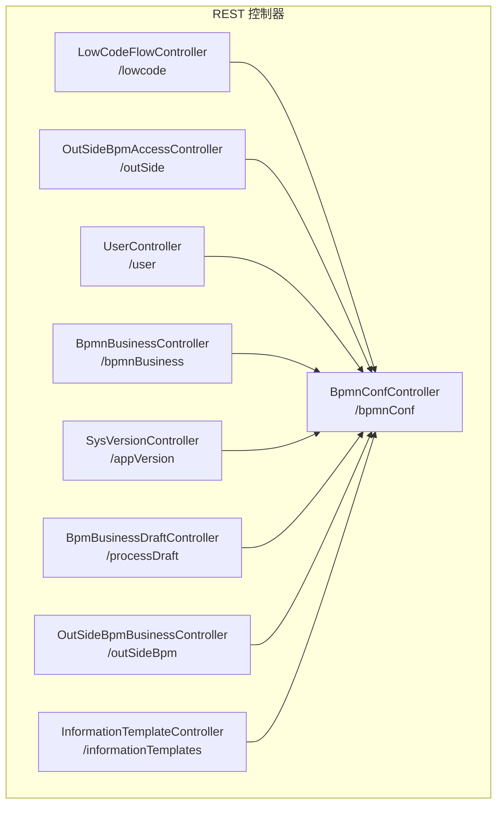
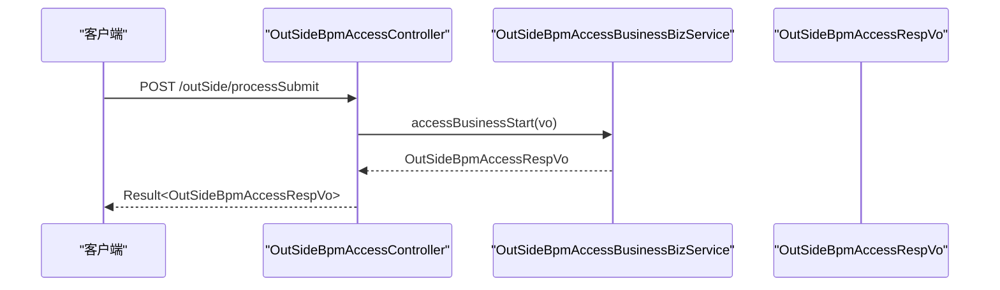
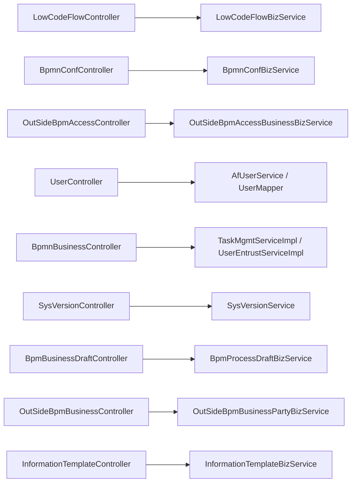

# API 接口文档

<cite>
**本文引用的文件**
- [LowCodeFlowController.java](file://antflow-engine/src/main/java/org/openoa/engine/bpmnconf/controller/LowCodeFlowController.java)
- [BpmnConfController.java](file://antflow-engine/src/main/java/org/openoa/engine/bpmnconf/controller/BpmnConfController.java)
- [OutSideBpmAccessController.java](file://antflow-engine/src/main/java/org/openoa/engine/bpmnconf/controller/OutSideBpmAccessController.java)
- [UserController.java](file://antflow-engine/src/main/java/org/openoa/engine/bpmnconf/controller/UserController.java)
- [BpmnBusinessController.java](file://antflow-engine/src/main/java/org/openoa/engine/bpmnconf/controller/BpmnBusinessController.java)
- [SysVersionController.java](file://antflow-engine/src/main/java/org/openoa/engine/bpmnconf/controller/SysVersionController.java)
- [BpmBusinessDraftController.java](file://antflow-engine/src/main/java/org/openoa/engine/bpmnconf/controller/BpmBusinessDraftController.java)
- [OutSideBpmBusinessController.java](file://antflow-engine/src/main/java/org/openoa/engine/bpmnconf/controller/OutSideBpmBusinessController.java)
- [InformationTemplateController.java](file://antflow-engine/src/main/java/org/openoa/engine/bpmnconf/controller/InformationTemplateController.java)
</cite>

## 目录
1. [简介](#简介)
2. [项目结构](#项目结构)
3. [核心组件](#核心组件)
4. [架构总览](#架构总览)
5. [详细组件分析](#详细组件分析)
6. [依赖关系分析](#依赖关系分析)
7. [性能考虑](#性能考虑)
8. [故障排查指南](#故障排查指南)
9. [结论](#结论)
10. [附录](#附录)

## 简介
本文件为 AntFlow 工作流系统的完整 API 接口参考文档，覆盖低代码流程 API、工作流管理 API、外部系统集成 API、用户管理 API 等模块。内容包括：
- 统一响应格式与错误处理机制
- 参数验证规则与分页查询规范
- 各模块接口的 HTTP 方法、URL 模式、请求/响应结构
- 认证方式说明、限流策略配置建议
- API 版本管理、向后兼容性与废弃 API 迁移指南

## 项目结构
AntFlow 后端采用 Spring Boot + Spring MVC 架构，REST 控制器位于 engine 模块的 bpmnconf.controller 包下，按功能域划分：
- 低代码流程：/lowcode
- 工作流配置与流程管理：/bpmnConf
- 外部系统接入：/outSide、/outSideBpm
- 用户与组织：/user
- 系统版本与草稿：/appVersion、/processDraft
- 信息模板与通知：/informationTemplates
- DIY 流程与委托：/bpmnBusiness

图表来源
- [LowCodeFlowController.java:1-85](file://antflow-engine/src/main/java/org/openoa/engine/bpmnconf/controller/LowCodeFlowController.java#L1-L85)
- [BpmnConfController.java:1-191](file://antflow-engine/src/main/java/org/openoa/engine/bpmnconf/controller/BpmnConfController.java#L1-L191)
- [OutSideBpmAccessController.java:1-91](file://antflow-engine/src/main/java/org/openoa/engine/bpmnconf/controller/OutSideBpmAccessController.java#L1-L91)
- [UserController.java:1-108](file://antflow-engine/src/main/java/org/openoa/engine/bpmnconf/controller/UserController.java#L1-L108)
- [BpmnBusinessController.java:1-114](file://antflow-engine/src/main/java/org/openoa/engine/bpmnconf/controller/BpmnBusinessController.java#L1-L114)
- [SysVersionController.java:1-83](file://antflow-engine/src/main/java/org/openoa/engine/bpmnconf/controller/SysVersionController.java#L1-L83)
- [BpmBusinessDraftController.java:1-24](file://antflow-engine/src/main/java/org/openoa/engine/bpmnconf/controller/BpmBusinessDraftController.java#L1-L24)
- [OutSideBpmBusinessController.java:1-196](file://antflow-engine/src/main/java/org/openoa/engine/bpmnconf/controller/OutSideBpmBusinessController.java#L1-L196)
- [InformationTemplateController.java:1-207](file://antflow-engine/src/main/java/org/openoa/engine/bpmnconf/controller/InformationTemplateController.java#L1-L207)

章节来源
- [LowCodeFlowController.java:1-85](file://antflow-engine/src/main/java/org/openoa/engine/bpmnconf/controller/LowCodeFlowController.java#L1-L85)
- [BpmnConfController.java:1-191](file://antflow-engine/src/main/java/org/openoa/engine/bpmnconf/controller/BpmnConfController.java#L1-L191)
- [OutSideBpmAccessController.java:1-91](file://antflow-engine/src/main/java/org/openoa/engine/bpmnconf/controller/OutSideBpmAccessController.java#L1-L91)
- [UserController.java:1-108](file://antflow-engine/src/main/java/org/openoa/engine/bpmnconf/controller/UserController.java#L1-L108)
- [BpmnBusinessController.java:1-114](file://antflow-engine/src/main/java/org/openoa/engine/bpmnconf/controller/BpmnBusinessController.java#L1-L114)
- [SysVersionController.java:1-83](file://antflow-engine/src/main/java/org/openoa/engine/bpmnconf/controller/SysVersionController.java#L1-L83)
- [BpmBusinessDraftController.java:1-24](file://antflow-engine/src/main/java/org/openoa/engine/bpmnconf/controller/BpmBusinessDraftController.java#L1-L24)
- [OutSideBpmBusinessController.java:1-196](file://antflow-engine/src/main/java/org/openoa/engine/bpmnconf/controller/OutSideBpmBusinessController.java#L1-L196)
- [InformationTemplateController.java:1-207](file://antflow-engine/src/main/java/org/openoa/engine/bpmnconf/controller/InformationTemplateController.java#L1-L207)

## 核心组件
- 统一响应格式
  - 成功响应：包含状态码、消息与数据体
  - 分页响应：返回数据列表与分页信息
  - 失败响应：包含错误码与错误描述
- 错误处理机制
  - 使用业务异常抛出统一错误
  - 参数校验失败时抛出业务异常
- 参数验证规则
  - 关键参数必填校验
  - 表单编码等关键标识非空校验
- 分页查询规范
  - 使用 PageDto 封装分页参数
  - 支持排序列与排序方向
  - 返回 ResultAndPage 结构

章节来源
- [LowCodeFlowController.java:33-82](file://antflow-engine/src/main/java/org/openoa/engine/bpmnconf/controller/LowCodeFlowController.java#L33-L82)
- [BpmnConfController.java:77-82](file://antflow-engine/src/main/java/org/openoa/engine/bpmnconf/controller/BpmnConfController.java#L77-L82)
- [OutSideBpmAccessController.java:49-54](file://antflow-engine/src/main/java/org/openoa/engine/bpmnconf/controller/OutSideBpmAccessController.java#L49-L54)
- [UserController.java:76-84](file://antflow-engine/src/main/java/org/openoa/engine/bpmnconf/controller/UserController.java#L76-L84)
- [BpmnBusinessController.java:59-65](file://antflow-engine/src/main/java/org/openoa/engine/bpmnconf/controller/BpmnBusinessController.java#L59-L65)
- [SysVersionController.java:46-50](file://antflow-engine/src/main/java/org/openoa/engine/bpmnconf/controller/SysVersionController.java#L46-L50)
- [InformationTemplateController.java:44-52](file://antflow-engine/src/main/java/org/openoa/engine/bpmnconf/controller/InformationTemplateController.java#L44-L52)

## 架构总览
以下序列图展示“外部系统发起流程”典型调用链路。

图表来源
- [OutSideBpmAccessController.java:38-41](file://antflow-engine/src/main/java/org/openoa/engine/bpmnconf/controller/OutSideBpmAccessController.java#L38-L41)
- [OutSideBpmAccessController.java:1-91](file://antflow-engine/src/main/java/org/openoa/engine/bpmnconf/controller/OutSideBpmAccessController.java#L1-L91)

## 详细组件分析

### 低代码流程 API
- 获取低代码表单编码集合
  - 方法与路径：GET /lowcode/getLowCodeFlowFormCodes
  - 请求：无
  - 响应：BaseKeyValueStruVo 列表
- 分页查询低代码表单编码
  - 方法与路径：POST /lowcode/getLFFormCodePageList
  - 请求体：DetailRequestDto（含 PageDto、TaskMgmtVO）
  - 响应：ResultAndPage<BaseKeyValueStruVo>
- 查询已启用的低代码表单编码（发起页）
  - 方法与路径：POST /lowcode/getLFActiveFormCodePageList
  - 请求体：同上
  - 响应：ResultAndPage<BaseKeyValueStruVo>
- 根据表单编码获取表单数据
  - 方法与路径：GET /lowcode/getformDataByFormCode?formCode=...
  - 请求参数：formCode（必填）
  - 响应：字符串（表单框架 JSON）
- 创建低代码表单编码
  - 方法与路径：POST /lowcode/createLowCodeFormCode
  - 请求体：BaseKeyValueStruVo
  - 响应：成功标记

章节来源
- [LowCodeFlowController.java:33-82](file://antflow-engine/src/main/java/org/openoa/engine/bpmnconf/controller/LowCodeFlowController.java#L33-L82)

### 工作流配置与流程管理 API
- 首页待办统计
  - 方法与路径：GET /bpmnConf/todoList
  - 响应：TaskMgmtVO
- 流程设计发布/复制
  - 方法与路径：POST /bpmnConf/edit
  - 请求体：BpmnConfVo
  - 响应：成功标记
- 流程设计分页列表
  - 方法与路径：POST /bpmnConf/listPage
  - 请求体：ConfDetailRequestDto（含 PageDto、BpmnConfVo）
  - 响应：ResultAndPage<BpmnConfVo>
- 流程设计预览
  - 方法与路径：POST /bpmnConf/preview
  - 请求体：JSON 字符串
  - 响应：预览结果
- 发起/任务页节点预览
  - 方法与路径：POST /bpmnConf/startPagePreviewNode
  - 请求体：JSON 字符串（包含 isStartPreview 标记）
  - 响应：PreviewNode
- 加载节点当前可操作人
  - 方法与路径：POST /bpmnConf/loadNodeOperationUser
  - 请求体：JSON 字符串
  - 响应：BaseIdTranStruVo 列表
- 获取审批进度
  - 方法与路径：GET /bpmnConf/getBpmVerifyInfoVos?processNumber=...
  - 请求参数：processNumber（必填）
  - 响应：BpmVerifyInfoVo 列表
- 查看业务流程数据
  - 方法与路径：POST /bpmnConf/process/viewBusinessProcess
  - 请求体：values（JSON 字符串）、formCode（参数）
  - 响应：BusinessDataVo
- 审批/发起/重提交操作
  - 方法与路径：POST /bpmnConf/process/buttonsOperation
  - 请求体：values（JSON 字符串）、formCode（参数）
  - 响应：BusinessDataVo
- 启用流程配置
  - 方法与路径：GET /bpmnConf/effectiveBpmn/{id}
  - 路径参数：id（必填）
  - 响应：成功标记
- 流程设计详情
  - 方法与路径：GET /bpmnConf/detail/{id}
  - 路径参数：id（必填）
  - 响应：BpmnConfVo
- 流程列表（多种类型）
  - 方法与路径：GET /bpmnConf/process/listPage/{type}
  - 路径参数：type（必填，枚举值见接口注释）
  - 请求体：DetailRequestDto（含 PageDto、TaskMgmtVO）
  - 响应：ResultAndPage<TaskMgmtVO>

章节来源
- [BpmnConfController.java:53-189](file://antflow-engine/src/main/java/org/openoa/engine/bpmnconf/controller/BpmnConfController.java#L53-L189)

### 外部系统接入 API
- 业务方流程发起
  - 方法与路径：POST /outSide/processSubmit
  - 请求体：OutSideBpmAccessBusinessVo
  - 响应：OutSideBpmAccessRespVo
- 分页查询外部表单编码
  - 方法与路径：POST /outSide/getOutSideFormCodePageList
  - 请求体：ConfDetailRequestDto（含 PageDto、BpmnConfVo）
  - 响应：ResultAndPage<BpmnConfVo>
- 三方接入流程预览
  - 方法与路径：POST /outSide/processPreview
  - 请求体：OutSideBpmAccessBusinessVo
  - 响应：预览结果
- 流程中断
  - 方法与路径：POST /outSide/processBreak
  - 请求体：OutSideBpmAccessBusinessVo
  - 响应：成功标记
- 查询外部流程记录
  - 方法与路径：GET /outSide/outSideProcessRecord?processNumber=...
  - 请求参数：processNumber（必填）
  - 响应：流程记录详情

章节来源
- [OutSideBpmAccessController.java:38-88](file://antflow-engine/src/main/java/org/openoa/engine/bpmnconf/controller/OutSideBpmAccessController.java#L38-L88)

### 用户与组织 API
- 模糊查询用户
  - 方法与路径：GET /user/queryUserByNameFuzzy?userName=...
  - 请求参数：userName（可空）
  - 响应：BaseIdTranStruVo 列表
- 模糊查询公司
  - 方法与路径：GET /user/queryCompanyByNameFuzzy?companyName=...
  - 请求参数：companyName（可空）
  - 响应：BaseIdTranStruVo 列表
- 获取全部人员（可按角色过滤）
  - 方法与路径：GET /user/getUser 或 /user/getUser/{roleId}
  - 路径参数：roleId（可选）
  - 响应：BaseIdTranStruVo 列表
- 人员分页列表
  - 方法与路径：POST /user/getUserPageList
  - 请求体：DetailRequestDto（含 PageDto、TaskMgmtVO）
  - 响应：ResultAndPage<BaseIdTranStruVo>
- 获取角色信息
  - 方法与路径：GET /user/getRoleInfo
  - 响应：BaseIdTranStruVo 列表
- 根据流程号与节点 ID 查询可指派人员
  - 方法与路径：GET /user/queryNodeAssigneesByNodeId?processNumber=...&nodeId=...
  - 请求参数：processNumber、nodeId（必填）
  - 响应：BaseIdTranStruVo 列表
- 根据流程号与元素 ID 查询可指派人员
  - 方法与路径：GET /user/queryNodeAssigneesByElementId?processNumber=...&elementId=...
  - 请求参数：processNumber、elementId（必填）
  - 响应：BaseIdTranStruVo 列表

章节来源
- [UserController.java:42-106](file://antflow-engine/src/main/java/org/openoa/engine/bpmnconf/controller/UserController.java#L42-L106)

### 系统版本与草稿 API
- 应用版本查询
  - 方法与路径：GET /appVersion/appVersion?application=...&appVersion=...
  - 请求参数：application、appVersion（必填）
  - 响应：AppVersionVo 或失败提示
- 获取下载二维码
  - 方法与路径：GET /appVersion/getQrCode
  - 响应：二维码信息
- 版本列表
  - 方法与路径：GET /appVersion/versionList
  - 请求参数：SysVersionVo（查询条件）
  - 响应：ResultAndPage<SysVersionVo>
- 更新版本
  - 方法与路径：POST /appVersion/{id}
  - 路径参数：id（必填）
  - 请求体：SysVersionVo
  - 响应：成功或业务异常
- 保存版本
  - 方法与路径：POST /appVersion/save
  - 请求体：SysVersionVo
  - 响应：成功或业务异常
- 加载业务草稿
  - 方法与路径：GET /processDraft/loadDraft?formCode=...
  - 请求参数：formCode（必填）
  - 响应：BusinessDataVo

章节来源
- [SysVersionController.java:29-81](file://antflow-engine/src/main/java/org/openoa/engine/bpmnconf/controller/SysVersionController.java#L29-L81)
- [BpmBusinessDraftController.java:18-22](file://antflow-engine/src/main/java/org/openoa/engine/bpmnconf/controller/BpmBusinessDraftController.java#L18-L22)

### 信息模板与通知 API
- 信息模板分页列表
  - 方法与路径：POST /informationTemplates/listPage
  - 请求体：InformationPgeRequestDto（含 PageDto、InformationTemplateVo）
  - 响应：ResultAndPage
- 根据 ID 获取模板
  - 方法与路径：GET /informationTemplates/getInformationTemplateById?templateId=...
  - 请求参数：templateId（必填）
  - 响应：InformationTemplateVo
- 修改模板
  - 方法与路径：POST /informationTemplates/updateById
  - 请求体：InformationTemplateVo
  - 响应：成功
- 保存模板
  - 方法与路径：POST /informationTemplates/save
  - 请求体：InformationTemplateVo
  - 响应：模板 ID
- 删除模板
  - 方法与路径：POST /informationTemplates/deleteById?id=...
  - 请求参数：id（必填）
  - 响应：成功
- 按名称模糊查询模板
  - 方法与路径：GET /informationTemplates/listByName?name=...
  - 请求参数：name（可选）
  - 响应：列表
- 获取默认模板
  - 方法与路径：GET /informationTemplates/defaultTemplates
  - 响应：默认模板列表
- 设置默认模板
  - 方法与路径：POST /informationTemplates/setDefaultTemplates
  - 请求体：DefaultTemplateVo[]
  - 响应：成功
- 获取通配符字符列表
  - 方法与路径：GET /informationTemplates/getWildcardCharacter?name=...
  - 请求参数：name（可选）
  - 响应：EnumerateVo 列表
- 获取流程事件类型
  - 方法与路径：GET /informationTemplates/getProcessEvents
  - 响应：事件类型枚举
- 获取通知类型
  - 方法与路径：GET /informationTemplates/getAllNoticeTypes
  - 响应：通知类型枚举
- 根据表单编码获取可用通知类型
  - 方法与路径：GET /informationTemplates/getNoticeTypeByFormCode?formCode=...
  - 请求参数：formCode（必填）
  - 响应：通知类型列表
- 测试超时提醒
  - 方法与路径：GET /informationTemplates/testDoTimeoutReminder
  - 响应：触发提醒逻辑

章节来源
- [InformationTemplateController.java:44-206](file://antflow-engine/src/main/java/org/openoa/engine/bpmnconf/controller/InformationTemplateController.java#L44-L206)

### DIY 流程与委托 API
- 获取自定义表单（DIY）流程编码列表
  - 方法与路径：GET /bpmnBusiness/getDIYFormCodeList?desc=...
  - 请求参数：desc（可选）
  - 响应：DIYProcessInfoDTO 列表
- 委托分页列表
  - 方法与路径：POST /bpmnBusiness/entrustlist/{type}
  - 路径参数：type（必填）
  - 请求体：DetailRequestDto（含 PageDto、Entrust）
  - 响应：ResultAndPage<Entrust>
- 委托详情
  - 方法与路径：GET /bpmnBusiness/entrustDetail/{id}
  - 路径参数：id（必填）
  - 响应：UserEntrust
- 编辑委托
  - 方法与路径：POST /bpmnBusiness/editEntrust
  - 请求体：DataVo
  - 响应：成功标记
- 获取流程自选审批人节点
  - 方法与路径：GET /bpmnBusiness/getStartUserChooseModules?formCode=...
  - 请求参数：formCode（必填）
  - 响应：BpmnNodeVo 列表

章节来源
- [BpmnBusinessController.java:46-111](file://antflow-engine/src/main/java/org/openoa/engine/bpmnconf/controller/BpmnBusinessController.java#L46-L111)

### 外部业务方管理 API
- 业务方项目分页列表
  - 方法与路径：POST /outSideBpm/businessParty/listPage
  - 请求体：ConfDetailRequestDto（含 PageDto、BpmnConfVo）
  - 响应：ResultAndPage
- 业务方项目详情
  - 方法与路径：GET /outSideBpm/businessParty/detail/{id}
  - 路径参数：id（必填）
  - 响应：业务方信息
- 编辑业务方项目
  - 方法与路径：POST /outSideBpm/businessParty/edit
  - 请求体：OutSideBpmBusinessPartyVo
  - 响应：成功
- 业务方应用分页列表
  - 方法与路径：POST /outSideBpm/businessParty/applicationsPageList
  - 请求体：ConfDetailRequestDto（含 PageDto、BpmnConfVo）
  - 响应：ResultAndPage
- 新增应用
  - 方法与路径：POST /outSideBpm/businessParty/addBpmProcessAppApplication
  - 请求体：BpmProcessAppApplicationVo
  - 响应：布尔结果
- 应用详情
  - 方法与路径：GET /outSideBpm/businessParty/applicationDetail/{id}
  - 路径参数：id（必填）
  - 响应：应用详情
- 条件模板分页列表
  - 方法与路径：GET /outSideBpm/conditionTemplate/listPage
  - 请求参数：PageDto、OutSideBpmConditionsTemplateVo
  - 响应：ResultAndPage
- 根据应用 ID 查询条件模板
  - 方法与路径：GET /outSideBpm/conditionTemplate/selectListByTemp/{applicationId}
  - 路径参数：applicationId（必填）
  - 响应：条件模板列表
- 编辑/新增条件模板
  - 方法与路径：POST /outSideBpm/conditionTemplate/edit
  - 请求体：OutSideBpmConditionsTemplateVo
  - 响应：成功
- 删除条件模板
  - 方法与路径：GET /outSideBpm/conditionTemplate/delete/{id}
  - 路径参数：id（必填）
  - 响应：成功
- 审批人模板分页列表
  - 方法与路径：GET /outSideBpm/approveTemplate/listPage
  - 请求参数：PageDto、OutSideBpmApproveTemplateVo
  - 响应：ResultAndPage
- 根据应用 ID 查询审批人模板
  - 方法与路径：GET /outSideBpm/approveTemplate/selectListByTemp/{applicationId}
  - 路径参数：applicationId（必填）
  - 响应：审批人模板列表
- 编辑/新增审批人模板
  - 方法与路径：POST /outSideBpm/approveTemplate/edit
  - 请求体：OutSideBpmApproveTemplateVo
  - 响应：成功
- 审批人模板详情
  - 方法与路径：GET /outSideBpm/approveTemplate/detail/{id}
  - 路径参数：id（必填）
  - 响应：模板详情

章节来源
- [OutSideBpmBusinessController.java:38-194](file://antflow-engine/src/main/java/org/openoa/engine/bpmnconf/controller/OutSideBpmBusinessController.java#L38-L194)

## 依赖关系分析
- 控制器层仅负责路由与参数封装，业务逻辑由对应服务层处理
- 统一通过 Result/ResultAndPage 包装响应，便于前端统一处理
- 分页查询统一使用 PageDto，避免重复参数传递
- 外部系统接入通过 OutSideBpmAccessController 与 OutSideBpmBusinessController 提供标准接口

图表来源
- [LowCodeFlowController.java:23-26](file://antflow-engine/src/main/java/org/openoa/engine/bpmnconf/controller/LowCodeFlowController.java#L23-L26)
- [BpmnConfController.java:34-46](file://antflow-engine/src/main/java/org/openoa/engine/bpmnconf/controller/BpmnConfController.java#L34-L46)
- [OutSideBpmAccessController.java:26-30](file://antflow-engine/src/main/java/org/openoa/engine/bpmnconf/controller/OutSideBpmAccessController.java#L26-L30)
- [UserController.java:29-40](file://antflow-engine/src/main/java/org/openoa/engine/bpmnconf/controller/UserController.java#L29-L40)
- [BpmnBusinessController.java:34-38](file://antflow-engine/src/main/java/org/openoa/engine/bpmnconf/controller/BpmnBusinessController.java#L34-L38)
- [SysVersionController.java:24-27](file://antflow-engine/src/main/java/org/openoa/engine/bpmnconf/controller/SysVersionController.java#L24-L27)
- [BpmBusinessDraftController.java:15-16](file://antflow-engine/src/main/java/org/openoa/engine/bpmnconf/controller/BpmBusinessDraftController.java#L15-L16)
- [OutSideBpmBusinessController.java:24-33](file://antflow-engine/src/main/java/org/openoa/engine/bpmnconf/controller/OutSideBpmBusinessController.java#L24-L33)
- [InformationTemplateController.java:31-37](file://antflow-engine/src/main/java/org/openoa/engine/bpmnconf/controller/InformationTemplateController.java#L31-L37)

## 性能考虑
- 分页查询建议设置合理的每页大小上限，避免一次性返回大量数据
- 对高频查询接口（如模糊搜索、分页列表）建议结合数据库索引优化
- 外部系统接入接口建议开启必要的缓存与异步处理，降低主流程阻塞
- 大字段（如表单框架 JSON）建议按需加载，避免不必要的序列化开销

## 故障排查指南
- 参数校验失败
  - 现象：接口返回业务异常，提示参数缺失或非法
  - 处理：检查必填参数是否传入，表单编码等关键标识是否为空
- 分页参数无效
  - 现象：分页结果异常或排序不生效
  - 处理：确认 PageDto 中的排序列与排序方向是否正确
- 外部系统流程中断失败
  - 现象：流程中断接口返回失败
  - 处理：确认流程号与业务参数是否匹配，检查流程状态是否允许中断
- 通知模板相关异常
  - 现象：模板保存/删除/设置默认失败
  - 处理：检查模板 ID 与用户权限，确保模板状态正常

章节来源
- [LowCodeFlowController.java:70-77](file://antflow-engine/src/main/java/org/openoa/engine/bpmnconf/controller/LowCodeFlowController.java#L70-L77)
- [BpmnConfController.java:122-125](file://antflow-engine/src/main/java/org/openoa/engine/bpmnconf/controller/BpmnConfController.java#L122-L125)
- [InformationTemplateController.java:89-98](file://antflow-engine/src/main/java/org/openoa/engine/bpmnconf/controller/InformationTemplateController.java#L89-L98)

## 结论
本 API 文档覆盖了 AntFlow 的主要 REST 接口，提供了统一的响应格式、参数校验与分页规范，并对关键流程的调用进行了可视化说明。建议在生产环境中结合缓存、限流与监控策略，确保接口稳定与高性能。

## 附录

### 统一响应格式说明
- 成功响应
  - 字段：code（状态码）、msg（消息）、data（数据体）
- 分页响应
  - 字段：code、msg、data（包含 records、total、size、current 等）
- 失败响应
  - 字段：code（错误码）、msg（错误描述）

### 错误处理机制
- 业务异常：通过业务异常抛出统一错误，前端据此提示
- 参数校验：对必填参数进行校验，非法参数抛出业务异常

### 参数验证规则
- 关键参数：如 formCode、processNumber、application、appVersion 等必须非空
- 路径参数：如 id、type、applicationId 等必须提供且合法

### 分页查询规范
- 请求参数：PageDto（含 current、size、orderColumn、asc 等）
- 响应结构：ResultAndPage（包含 records、total、pages、size、current）

### 认证方式说明
- 当前控制器未显式声明认证注解，建议在网关或全局拦截器中统一处理认证与鉴权
- 版本管理与草稿接口涉及当前登录用户信息，需确保认证上下文可用

### 限流策略配置
- 建议针对高频接口（如模糊搜索、分页列表、外部系统接入）配置限流
- 可基于 IP、用户 ID 或应用标识进行限流

### API 版本管理与兼容性
- 当前接口未体现显式的版本前缀，建议在网关层或路由层引入版本控制
- 兼容性保障：新增字段建议向后兼容；变更字段需评估影响范围并提供迁移指引

### 废弃 API 迁移指南
- 对于未来可能废弃的接口，建议保留过渡期并在响应头中标注 deprecation 信息
- 提供替代接口与迁移步骤，确保业务方平滑过渡