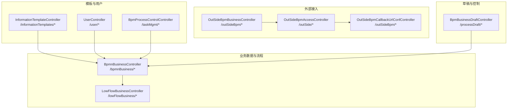
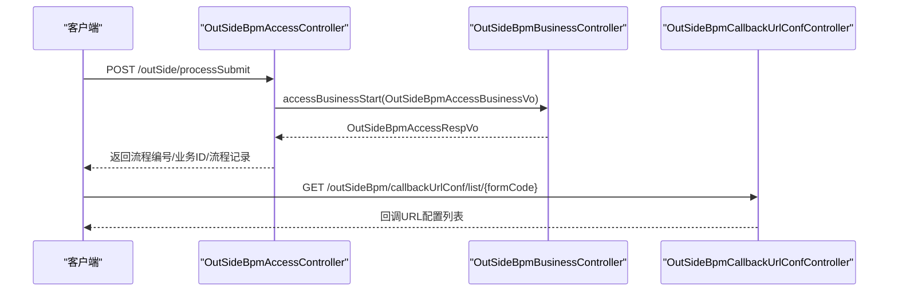
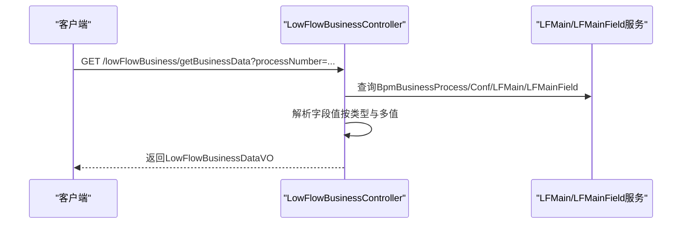
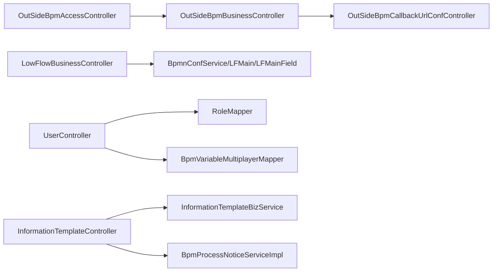

# 业务数据 API

<cite>
**本文引用的文件**
- [BpmnBusinessController.java](file://antflow-engine/src/main/java/org/openoa/engine/bpmnconf/controller/BpmnBusinessController.java)
- [InformationTemplateController.java](file://antflow-engine/src/main/java/org/openoa/engine/bpmnconf/controller/InformationTemplateController.java)
- [UserController.java](file://antflow-engine/src/main/java/org/openoa/engine/bpmnconf/controller/UserController.java)
- [LowFlowBusinessController.java](file://antflow-engine/src/main/java/org/openoa/engine/bpmnconf/controller/LowFlowBusinessController.java)
- [OutSideBpmBusinessController.java](file://antflow-engine/src/main/java/org/openoa/engine/bpmnconf/controller/OutSideBpmBusinessController.java)
- [OutSideBpmAccessController.java](file://antflow-engine/src/main/java/org/openoa/engine/bpmnconf/controller/OutSideBpmAccessController.java)
- [OutSideBpmCallbackUrlConfController.java](file://antflow-engine/src/main/java/org/openoa/engine/bpmnconf/controller/OutSideBpmCallbackUrlConfController.java)
- [BpmBusinessDraftController.java](file://antflow-engine/src/main/java/org/openoa/engine/bpmnconf/controller/BpmBusinessDraftController.java)
- [BpmProcessControlController.java](file://antflow-engine/src/main/java/org/openoa/engine/bpmnconf/controller/BpmProcessControlController.java)
- [OutSideBpmAccessBusinessVo.java](file://antflow-engine/src/main/java/org/openoa/engine/vo/OutSideBpmAccessBusinessVo.java)
- [OutSideBpmAccessRespVo.java](file://antflow-engine/src/main/java/org/openoa/engine/vo/OutSideBpmAccessRespVo.java)
</cite>

## 目录
1. [简介](#简介)
2. [项目结构](#项目结构)
3. [核心组件](#核心组件)
4. [架构总览](#架构总览)
5. [详细组件分析](#详细组件分析)
6. [依赖关系分析](#依赖关系分析)
7. [性能考虑](#性能考虑)
8. [故障排查指南](#故障排查指南)
9. [结论](#结论)
10. [附录](#附录)

## 简介
本文件面向业务数据 API 的使用者与集成者，系统性梳理与工作流关联的业务数据管理、信息模板配置、用户管理等接口的 HTTP 方法、URL 规则、参数说明与响应格式。同时覆盖低代码流程业务数据查询、外部系统接入流程提交与回调配置、草稿加载、流程控制与通知配置等能力，帮助读者快速完成业务数据的增删改查、模板化配置、权限与数据联动。

## 项目结构
业务数据相关接口主要分布在以下控制器中：
- 业务数据与流程节点：BpmnBusinessController
- 信息模板与通知：InformationTemplateController
- 用户与角色：UserController
- 低代码流程业务数据：LowFlowBusinessController
- 外部系统业务接入与流程控制：OutSideBpmBusinessController、OutSideBpmAccessController、OutSideBpmCallbackUrlConfController
- 草稿与流程控制：BpmBusinessDraftController、BpmProcessControlController

图表来源
- [BpmnBusinessController.java:30-114](file://antflow-engine/src/main/java/org/openoa/engine/bpmnconf/controller/BpmnBusinessController.java#L30-L114)
- [InformationTemplateController.java:29-207](file://antflow-engine/src/main/java/org/openoa/engine/bpmnconf/controller/InformationTemplateController.java#L29-L207)
- [UserController.java:26-108](file://antflow-engine/src/main/java/org/openoa/engine/bpmnconf/controller/UserController.java#L26-L108)
- [LowFlowBusinessController.java:32-234](file://antflow-engine/src/main/java/org/openoa/engine/bpmnconf/controller/LowFlowBusinessController.java#L32-L234)
- [OutSideBpmBusinessController.java:22-196](file://antflow-engine/src/main/java/org/openoa/engine/bpmnconf/controller/OutSideBpmBusinessController.java#L22-L196)
- [OutSideBpmAccessController.java:22-91](file://antflow-engine/src/main/java/org/openoa/engine/bpmnconf/controller/OutSideBpmAccessController.java#L22-L91)
- [OutSideBpmCallbackUrlConfController.java:16-69](file://antflow-engine/src/main/java/org/openoa/engine/bpmnconf/controller/OutSideBpmCallbackUrlConfController.java#L16-L69)
- [BpmBusinessDraftController.java:12-24](file://antflow-engine/src/main/java/org/openoa/engine/bpmnconf/controller/BpmBusinessDraftController.java#L12-L24)
- [BpmProcessControlController.java:25-61](file://antflow-engine/src/main/java/org/openoa/engine/bpmnconf/controller/BpmProcessControlController.java#L25-L61)

章节来源
- [BpmnBusinessController.java:30-114](file://antflow-engine/src/main/java/org/openoa/engine/bpmnconf/controller/BpmnBusinessController.java#L30-L114)
- [InformationTemplateController.java:29-207](file://antflow-engine/src/main/java/org/openoa/engine/bpmnconf/controller/InformationTemplateController.java#L29-L207)
- [UserController.java:26-108](file://antflow-engine/src/main/java/org/openoa/engine/bpmnconf/controller/UserController.java#L26-L108)
- [LowFlowBusinessController.java:32-234](file://antflow-engine/src/main/java/org/openoa/engine/bpmnconf/controller/LowFlowBusinessController.java#L32-L234)
- [OutSideBpmBusinessController.java:22-196](file://antflow-engine/src/main/java/org/openoa/engine/bpmnconf/controller/OutSideBpmBusinessController.java#L22-L196)
- [OutSideBpmAccessController.java:22-91](file://antflow-engine/src/main/java/org/openoa/engine/bpmnconf/controller/OutSideBpmAccessController.java#L22-L91)
- [OutSideBpmCallbackUrlConfController.java:16-69](file://antflow-engine/src/main/java/org/openoa/engine/bpmnconf/controller/OutSideBpmCallbackUrlConfController.java#L16-L69)
- [BpmBusinessDraftController.java:12-24](file://antflow-engine/src/main/java/org/openoa/engine/bpmnconf/controller/BpmBusinessDraftController.java#L12-L24)
- [BpmProcessControlController.java:25-61](file://antflow-engine/src/main/java/org/openoa/engine/bpmnconf/controller/BpmProcessControlController.java#L25-L61)

## 核心组件
- 业务数据与流程节点：提供表单DIY表单编码列表、委托管理、流程起始自选审批人节点查询等能力。
- 信息模板与通知：提供模板分页查询、按ID查询、保存/更新/删除、默认模板设置、通配符与事件类型枚举、通知类型查询、超时提醒测试等。
- 用户与角色：提供模糊搜索、全量/分页查询、角色信息、节点可办人员查询等。
- 低代码流程业务数据：根据流程编号查询低代码流程的业务数据，解析字段值并返回统一结构。
- 外部系统接入：提供业务方项目与应用管理、条件模板与审批人模板管理、流程提交/预览/打断、流程记录查询、回调URL配置等。
- 草稿与流程控制：提供草稿加载、流程通知配置、表单相关选项与用户自定义规则选项等。

章节来源
- [BpmnBusinessController.java:30-114](file://antflow-engine/src/main/java/org/openoa/engine/bpmnconf/controller/BpmnBusinessController.java#L30-L114)
- [InformationTemplateController.java:29-207](file://antflow-engine/src/main/java/org/openoa/engine/bpmnconf/controller/InformationTemplateController.java#L29-L207)
- [UserController.java:26-108](file://antflow-engine/src/main/java/org/openoa/engine/bpmnconf/controller/UserController.java#L26-L108)
- [LowFlowBusinessController.java:32-234](file://antflow-engine/src/main/java/org/openoa/engine/bpmnconf/controller/LowFlowBusinessController.java#L32-L234)
- [OutSideBpmBusinessController.java:22-196](file://antflow-engine/src/main/java/org/openoa/engine/bpmnconf/controller/OutSideBpmBusinessController.java#L22-L196)
- [OutSideBpmAccessController.java:22-91](file://antflow-engine/src/main/java/org/openoa/engine/bpmnconf/controller/OutSideBpmAccessController.java#L22-L91)
- [OutSideBpmCallbackUrlConfController.java:16-69](file://antflow-engine/src/main/java/org/openoa/engine/bpmnconf/controller/OutSideBpmCallbackUrlConfController.java#L16-L69)
- [BpmBusinessDraftController.java:12-24](file://antflow-engine/src/main/java/org/openoa/engine/bpmnconf/controller/BpmBusinessDraftController.java#L12-L24)
- [BpmProcessControlController.java:25-61](file://antflow-engine/src/main/java/org/openoa/engine/bpmnconf/controller/BpmProcessControlController.java#L25-L61)

## 架构总览
业务数据 API 通过 REST 控制器对外暴露，围绕“流程编号/表单编码”进行数据关联，结合模板与用户体系，支撑外部系统接入与内部流程编排。

图表来源
- [OutSideBpmAccessController.java:38-41](file://antflow-engine/src/main/java/org/openoa/engine/bpmnconf/controller/OutSideBpmAccessController.java#L38-L41)
- [OutSideBpmBusinessController.java:88-92](file://antflow-engine/src/main/java/org/openoa/engine/bpmnconf/controller/OutSideBpmBusinessController.java#L88-L92)
- [OutSideBpmCallbackUrlConfController.java:29-32](file://antflow-engine/src/main/java/org/openoa/engine/bpmnconf/controller/OutSideBpmCallbackUrlConfController.java#L29-L32)

## 详细组件分析

### 业务数据与流程节点接口（BpmnBusinessController）
- 获取自定义表单DIY表单编码列表
  - 方法与路径：GET /bpmnBusiness/getDIYFormCodeList
  - 参数：desc（描述，可选）
  - 响应：成功结果，返回DIY流程信息列表
- 获取委托列表（分页）
  - 方法与路径：POST /bpmnBusiness/entrustlist/{type}
  - 请求体：DetailRequestDto（含分页与查询条件）
  - 路径参数：type（委托类型）
  - 响应：分页结果与数据列表
- 获取委托详情
  - 方法与路径：GET /bpmnBusiness/entrustDetail/{id}
  - 路径参数：id（委托主键）
  - 响应：成功结果，返回委托详情
- 编辑委托
  - 方法与路径：POST /bpmnBusiness/editEntrust
  - 请求体：DataVo（委托数据）
  - 响应：成功结果
- 获取流程起始自选审批人节点
  - 方法与路径：GET /bpmnBusiness/getStartUserChooseModules
  - 参数：formCode（表单编码，必填）
  - 响应：成功结果，返回节点列表（含节点ID与名称）

章节来源
- [BpmnBusinessController.java:46-111](file://antflow-engine/src/main/java/org/openoa/engine/bpmnconf/controller/BpmnBusinessController.java#L46-L111)

### 信息模板与通知接口（InformationTemplateController）
- 分页查询信息模板
  - 方法与路径：POST /informationTemplates/listPage
  - 请求体：InformationPgeRequestDto（含分页与查询条件）
  - 响应：分页结果与模板列表
- 按ID查询信息模板
  - 方法与路径：GET /informationTemplates/getInformationTemplateById
  - 参数：templateId（模板ID，必填）
  - 响应：成功结果，返回模板详情
- 更新信息模板
  - 方法与路径：POST /informationTemplates/updateById
  - 请求体：InformationTemplateVo
  - 响应：成功
- 保存信息模板
  - 方法与路径：POST /informationTemplates/save
  - 请求体：InformationTemplateVo
  - 响应：成功结果，返回新模板ID
- 删除信息模板
  - 方法与路径：POST /informationTemplates/deleteById
  - 参数：id（模板ID，必填）
  - 响应：成功
- 按名称查询模板（启用且未删除）
  - 方法与路径：GET /informationTemplates/listByName
  - 参数：name（名称，可选）
  - 响应：成功结果，返回模板列表
- 获取默认模板
  - 方法与路径：GET /informationTemplates/defaultTemplates
  - 响应：成功结果，返回默认模板集合
- 设置默认模板
  - 方法与路径：POST /informationTemplates/setDefaultTemplates
  - 请求体：DefaultTemplateVo[]（模板ID数组）
  - 响应：成功
- 通配符字符查询
  - 方法与路径：GET /informationTemplates/getWildcardCharacter
  - 参数：name（关键词，可选）
  - 响应：成功结果，返回通配符枚举列表
- 获取所有流程事件
  - 方法与路径：GET /informationTemplates/getProcessEvents
  - 响应：成功结果，返回事件枚举列表
- 获取所有通知类型
  - 方法与路径：GET /informationTemplates/getAllNoticeTypes
  - 响应：成功结果，返回通知类型枚举列表
- 根据表单编码获取通知类型
  - 方法与路径：GET /informationTemplates/getNoticeTypeByFormCode
  - 参数：formCode（表单编码，必填）
  - 响应：成功结果，返回该表单可用通知类型列表
- 超时提醒测试
  - 方法与路径：GET /informationTemplates/testDoTimeoutReminder
  - 响应：无返回值（触发定时任务）

章节来源
- [InformationTemplateController.java:44-207](file://antflow-engine/src/main/java/org/openoa/engine/bpmnconf/controller/InformationTemplateController.java#L44-L207)

### 用户与角色接口（UserController）
- 模糊查询用户（公司名）
  - 方法与路径：GET /user/queryCompanyByNameFuzzy
  - 参数：companyName（公司名，可选）
  - 响应：成功结果，返回公司列表
- 模糊查询用户（用户名）
  - 方法与路径：GET /user/queryUserByNameFuzzy
  - 参数：userName（用户名，可选）
  - 响应：成功结果，返回用户列表
- 获取全部人员（可按角色过滤）
  - 方法与路径：GET /user/getUser 或 /user/getUser/{roleId}
  - 路径参数：roleId（角色ID，可选）
  - 响应：成功结果，返回人员列表
- 获取人员分页列表
  - 方法与路径：POST /user/getUserPageList
  - 请求体：DetailRequestDto（含分页与查询条件）
  - 响应：分页结果与人员列表
- 获取角色信息
  - 方法与路径：GET /user/getRoleInfo
  - 响应：成功结果，返回角色列表
- 根据节点ID查询节点可办人员
  - 方法与路径：GET /user/queryNodeAssigneesByNodeId
  - 参数：processNumber（流程编号）、nodeId（节点ID）
  - 响应：成功结果，返回可办人员列表
- 根据元素ID查询节点可办人员
  - 方法与路径：GET /user/queryNodeAssigneesByElementId
  - 参数：processNumber（流程编号）、elementId（元素ID）
  - 响应：成功结果，返回可办人员列表

章节来源
- [UserController.java:42-107](file://antflow-engine/src/main/java/org/openoa/engine/bpmnconf/controller/UserController.java#L42-L107)

### 低代码流程业务数据接口（LowFlowBusinessController）
- 根据流程编号查询低代码流程业务数据
  - 方法与路径：GET /lowFlowBusiness/getBusinessData
  - 参数：processNumber（流程编号，必填）
  - 响应：成功结果，返回LowFlowBusinessDataVO（包含主数据ID、配置ID、表单编码、创建人、字段列表等）
- 字段值解析逻辑
  - 支持字符串、数字、日期时间、日期、文本、布尔等类型
  - 对JSON对象/数组尝试解析；多值字段返回数组

图表来源
- [LowFlowBusinessController.java:58-141](file://antflow-engine/src/main/java/org/openoa/engine/bpmnconf/controller/LowFlowBusinessController.java#L58-L141)

章节来源
- [LowFlowBusinessController.java:58-234](file://antflow-engine/src/main/java/org/openoa/engine/bpmnconf/controller/LowFlowBusinessController.java#L58-L234)

### 外部系统业务接入与流程控制接口（OutSideBpmBusinessController）
- 业务方项目分页列表
  - 方法与路径：POST /outSideBpm/businessParty/listPage
  - 请求体：ConfDetailRequestDto
  - 响应：分页结果
- 业务方项目详情
  - 方法与路径：GET /outSideBpm/businessParty/detail/{id}
  - 路径参数：id
  - 响应：成功结果
- 编辑业务方项目
  - 方法与路径：POST /outSideBpm/businessParty/edit
  - 请求体：OutSideBpmBusinessPartyVo
  - 响应：成功结果
- 应用分页列表
  - 方法与路径：POST /outSideBpm/businessParty/applicationsPageList
  - 请求体：ConfDetailRequestDto
  - 响应：分页结果
- 新增应用
  - 方法与路径：POST /outSideBpm/businessParty/addBpmProcessAppApplication
  - 请求体：BpmProcessAppApplicationVo
  - 响应：成功结果
- 应用详情
  - 方法与路径：GET /outSideBpm/businessParty/applicationDetail/{id}
  - 路径参数：id
  - 响应：成功结果
- 条件模板分页列表
  - 方法与路径：GET /outSideBpm/conditionTemplate/listPage
  - 参数：page（分页）、vo（查询条件）
  - 响应：分页结果
- 根据应用ID查询条件模板列表
  - 方法与路径：GET /outSideBpm/conditionTemplate/selectListByTemp/{applicationId}
  - 路径参数：applicationId
  - 响应：列表
- 编辑/新增条件模板
  - 方法与路径：POST /outSideBpm/conditionTemplate/edit
  - 请求体：OutSideBpmConditionsTemplateVo
  - 响应：成功
- 删除条件模板
  - 方法与路径：GET /outSideBpm/conditionTemplate/delete/{id}
  - 路径参数：id
  - 响应：成功
- 审批人模板分页列表
  - 方法与路径：GET /outSideBpm/approveTemplate/listPage
  - 参数：page（分页）、vo（查询条件）
  - 响应：分页结果
- 根据应用ID查询审批人模板列表
  - 方法与路径：GET /outSideBpm/approveTemplate/selectListByTemp/{applicationId}
  - 路径参数：applicationId
  - 响应：列表
- 编辑/新增审批人模板
  - 方法与路径：POST /outSideBpm/approveTemplate/edit
  - 请求体：OutSideBpmApproveTemplateVo
  - 响应：成功
- 审批人模板详情
  - 方法与路径：GET /outSideBpm/approveTemplate/detail/{id}
  - 路径参数：id
  - 响应：成功

章节来源
- [OutSideBpmBusinessController.java:38-196](file://antflow-engine/src/main/java/org/openoa/engine/bpmnconf/controller/OutSideBpmBusinessController.java#L38-L196)

### 外部系统流程提交与回调配置接口（OutSideBpmAccessController、OutSideBpmCallbackUrlConfController）
- 流程提交
  - 方法与路径：POST /outSide/processSubmit
  - 请求体：OutSideBpmAccessBusinessVo
  - 响应：OutSideBpmAccessRespVo（包含流程编号、业务ID、流程记录）
- 获取外部表单编码分页列表
  - 方法与路径：POST /outSide/getOutSideFormCodePageList
  - 请求体：ConfDetailRequestDto
  - 响应：分页结果
- 流程预览
  - 方法与路径：POST /outSide/processPreview
  - 请求体：OutSideBpmAccessBusinessVo
  - 响应：预览结果
- 流程打断
  - 方法与路径：POST /outSide/processBreak
  - 请求体：OutSideBpmAccessBusinessVo
  - 响应：成功
- 查询流程记录
  - 方法与路径：GET /outSide/outSideProcessRecord
  - 参数：processNumber（流程编号）
  - 响应：流程记录
- 回调URL配置列表（按表单编码）
  - 方法与路径：GET /outSideBpm/callbackUrlConf/list/{formCode}
  - 路径参数：formCode
  - 响应：列表
- 回调URL配置列表（分页）
  - 方法与路径：GET /outSideBpm/callbackUrlConf/listPage
  - 参数：page（分页）、vo（查询条件）
  - 响应：分页结果
- 回调URL配置详情
  - 方法与路径：GET /outSideBpm/callbackUrlConf/detail/{id}
  - 路径参数：id
  - 响应：详情
- 编辑回调URL配置
  - 方法与路径：POST /outSideBpm/callbackUrlConf/edit
  - 请求体：OutSideBpmCallbackUrlConfVo
  - 响应：成功

章节来源
- [OutSideBpmAccessController.java:38-91](file://antflow-engine/src/main/java/org/openoa/engine/bpmnconf/controller/OutSideBpmAccessController.java#L38-L91)
- [OutSideBpmCallbackUrlConfController.java:29-68](file://antflow-engine/src/main/java/org/openoa/engine/bpmnconf/controller/OutSideBpmCallbackUrlConfController.java#L29-L68)

### 草稿与流程控制接口（BpmBusinessDraftController、BpmProcessControlController）
- 加载草稿
  - 方法与路径：GET /processDraft/loadDraft
  - 参数：formCode（表单编码）
  - 响应：业务数据草稿
- 保存流程通知配置
  - 方法与路径：POST /taskMgmt/taskMgmt
  - 请求体：BpmProcessDeptVo
  - 响应：成功
- 获取表单相关选项
  - 方法与路径：GET /taskMgmt/getFormRelatedOptions
  - 响应：表单相关选项枚举
- 获取用户自定义规则选项
  - 方法与路径：GET /taskMgmt/getUDROptions
  - 响应：用户自定义规则字典数据

章节来源
- [BpmBusinessDraftController.java:18-22](file://antflow-engine/src/main/java/org/openoa/engine/bpmnconf/controller/BpmBusinessDraftController.java#L18-L22)
- [BpmProcessControlController.java:39-60](file://antflow-engine/src/main/java/org/openoa/engine/bpmnconf/controller/BpmProcessControlController.java#L39-L60)

## 依赖关系分析
- 外部接入控制器依赖业务方与应用服务、条件模板与审批人模板服务、回调URL配置服务。
- 低代码业务数据控制器依赖流程配置与主表字段服务，用于解析字段值。
- 用户控制器依赖用户与角色映射、多值变量映射以查询节点可办人员。
- 信息模板控制器依赖模板业务服务与流程通知服务，提供模板与通知类型枚举。

图表来源
- [OutSideBpmAccessController.java:22-91](file://antflow-engine/src/main/java/org/openoa/engine/bpmnconf/controller/OutSideBpmAccessController.java#L22-L91)
- [OutSideBpmBusinessController.java:22-196](file://antflow-engine/src/main/java/org/openoa/engine/bpmnconf/controller/OutSideBpmBusinessController.java#L22-L196)
- [OutSideBpmCallbackUrlConfController.java:16-69](file://antflow-engine/src/main/java/org/openoa/engine/bpmnconf/controller/OutSideBpmCallbackUrlConfController.java#L16-L69)
- [LowFlowBusinessController.java:32-234](file://antflow-engine/src/main/java/org/openoa/engine/bpmnconf/controller/LowFlowBusinessController.java#L32-L234)
- [UserController.java:26-108](file://antflow-engine/src/main/java/org/openoa/engine/bpmnconf/controller/UserController.java#L26-L108)
- [InformationTemplateController.java:29-207](file://antflow-engine/src/main/java/org/openoa/engine/bpmnconf/controller/InformationTemplateController.java#L29-L207)

## 性能考虑
- 分页查询：优先使用分页接口（如 listPage、getUserPageList、applicationsPageList），避免一次性返回大量数据。
- 字段解析：低代码字段值解析包含JSON尝试解析与多值聚合，建议在客户端缓存常用字段类型以减少重复解析。
- 关联查询：外部接入流程提交涉及多服务协作，建议在网关层做请求合并与超时控制。
- 缓存策略：模板与枚举类数据（如通配符、事件类型、通知类型）可做本地缓存，降低重复查询开销。

## 故障排查指南
- 参数校验异常
  - 表单编码为空：外部接入与低代码业务数据查询均要求表单编码/流程编号非空，需检查调用参数。
  - 模板ID为空：模板删除接口要求模板ID非空。
- 数据缺失异常
  - 低代码流程未找到对应配置或字段数据时会抛出异常，需确认流程编号与表单编码是否匹配。
- 权限与登录
  - 模板删除接口会记录当前登录用户，确保调用方已正确登录并携带身份信息。
- 回调配置
  - 回调URL配置列表按表单编码查询，若返回为空，确认表单编码是否正确或是否存在配置。

章节来源
- [LowFlowBusinessController.java:62-98](file://antflow-engine/src/main/java/org/openoa/engine/bpmnconf/controller/LowFlowBusinessController.java#L62-L98)
- [InformationTemplateController.java:90-98](file://antflow-engine/src/main/java/org/openoa/engine/bpmnconf/controller/InformationTemplateController.java#L90-L98)
- [OutSideBpmAccessController.java:38-41](file://antflow-engine/src/main/java/org/openoa/engine/bpmnconf/controller/OutSideBpmAccessController.java#L38-L41)

## 结论
本文档系统性梳理了业务数据 API 的核心接口，覆盖业务数据查询、模板配置、用户管理、低代码流程数据、外部系统接入与回调配置、草稿与流程控制等场景。建议在生产环境中优先采用分页查询、参数校验与缓存策略，确保接口稳定与高性能。

## 附录
- 数据模型与字段说明（节选）
  - 外部接入请求体（OutSideBpmAccessBusinessVo）
    - 关键字段：businessPartyId、bpmnConfId、formCode、processNumber、formDataPc、formDataApp、templateMarks、userId、userName、approvalEmpls、remark、isDel、createUser、createTime、updateUser、updateTime、processBreakDesc、processBreakUserId、businessPartyMark、applicationId、outSideType、appraversList、embedNodes、outSideLevelNodes、lfConditions、isLowCodeFlow、lfFields
  - 外部接入响应体（OutSideBpmAccessRespVo）
    - 关键字段：processNumber、businessId、processRecord

章节来源
- [OutSideBpmAccessBusinessVo.java:29-139](file://antflow-engine/src/main/java/org/openoa/engine/vo/OutSideBpmAccessBusinessVo.java#L29-L139)
- [OutSideBpmAccessRespVo.java:16-34](file://antflow-engine/src/main/java/org/openoa/engine/vo/OutSideBpmAccessRespVo.java#L16-L34)