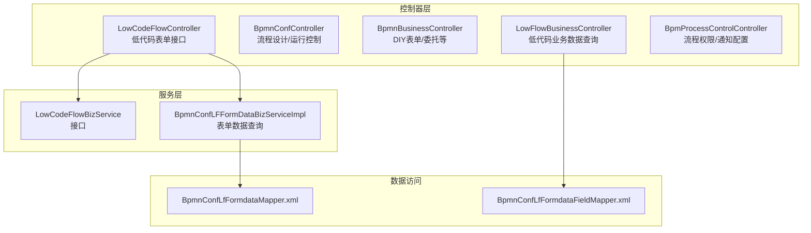
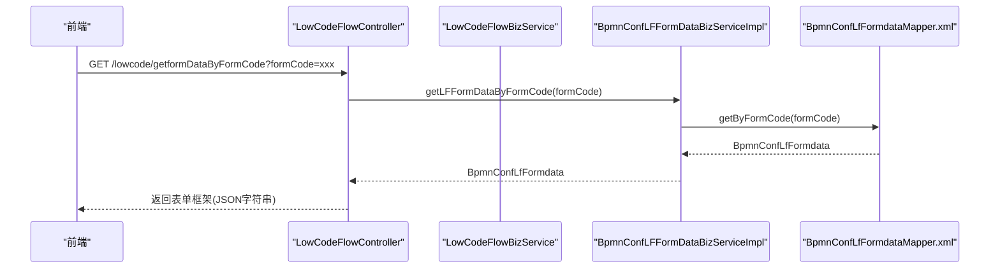
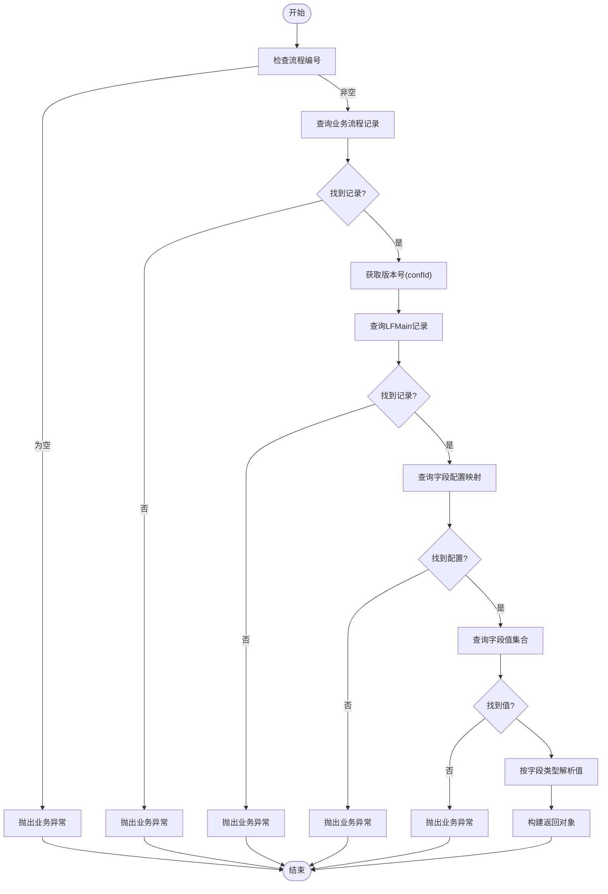
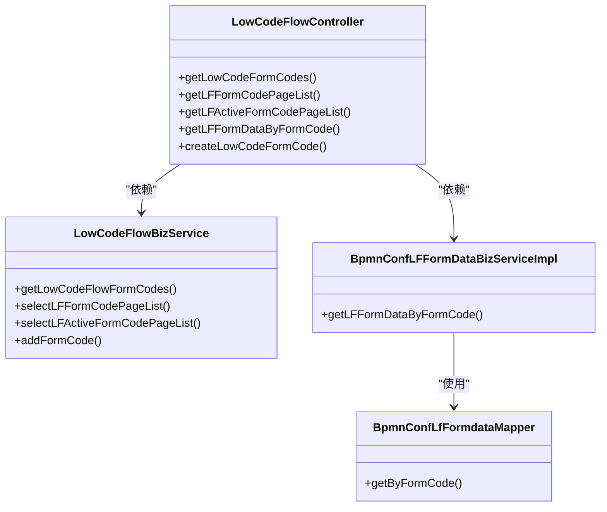

# 低代码流程 API

<cite>
**本文引用的文件**
- [LowCodeFlowController.java](file://antflow-engine/src/main/java/org/openoa/engine/bpmnconf/controller/LowCodeFlowController.java)
- [BpmnConfController.java](file://antflow-engine/src/main/java/org/openoa/engine/bpmnconf/controller/BpmnConfController.java)
- [BpmnBusinessController.java](file://antflow-engine/src/main/java/org/openoa/engine/bpmnconf/controller/BpmnBusinessController.java)
- [LowFlowBusinessController.java](file://antflow-engine/src/main/java/org/openoa/engine/bpmnconf/controller/LowFlowBusinessController.java)
- [BpmProcessControlController.java](file://antflow-engine/src/main/java/org/openoa/engine/bpmnconf/controller/BpmProcessControlController.java)
- [BpmnConfLFFormDataBizServiceImpl.java](file://antflow-engine/src/main/java/org/openoa/engine/lowflow/service/BpmnConfLFFormDataBizServiceImpl.java)
- [LowCodeFlowBizService.java](file://antflow-engine/src/main/java/org/openoa/engine/bpmnconf/service/interf/biz/LowCodeFlowBizService.java)
- [BpmnConfLfFormdataMapper.xml](file://antflow-engine/src/main/resources/mapper/BpmnConfLfFormdataMapper.xml)
- [BpmnConfLfFormdataFieldMapper.xml](file://antflow-engine/src/main/resources/mapper/BpmnConfLfFormdataFieldMapper.xml)
- [lowcodeApi.js](file://antflow-vue/src/api/workflow/lowcodeApi.js)
- [BaseKeyValueStruVo.java](file://antflow-base/src/main/java/org/openoa/base/vo/BaseKeyValueStruVo.java)
- [DetailRequestDto.java](file://antflow-base/src/main/java/org/openoa/base/vo/DetailRequestDto.java)
- [TaskMgmtVO.java](file://antflow-base/src/main/java/org/openoa/base/vo/TaskMgmtVO.java)
- [BpmnConfLfFormdata.java](file://antflow-base/src/main/java/org/openoa/base/entity/BpmnConfLfFormdata.java)
</cite>

## 目录
1. [简介](#简介)
2. [项目结构](#项目结构)
3. [核心组件](#核心组件)
4. [架构总览](#架构总览)
5. [详细组件分析](#详细组件分析)
6. [依赖关系分析](#依赖关系分析)
7. [性能考量](#性能考量)
8. [故障排查指南](#故障排查指南)
9. [结论](#结论)
10. [附录](#附录)

## 简介
本文件面向低代码流程 API 的使用者与集成者，系统性梳理“低代码流程设计、表单配置、流程运行”相关的 REST 接口，覆盖流程定义 CRUD、表单字段管理、流程实例启动、任务处理等能力。文档同时给出接口的 HTTP 方法、URL 路径、请求参数、响应格式、参数校验与错误处理机制，并结合前端调用示例说明典型使用场景。

## 项目结构
围绕低代码流程 API 的后端控制器主要分布在以下包：
- 流程设计与运行控制：BpmnConfController、BpmnBusinessController、BpmProcessControlController
- 低代码流程表单与业务数据：LowCodeFlowController、LowFlowBusinessController
- 服务层与数据访问：LowCodeFlowBizService、BpmnConfLFFormDataBizServiceImpl 及对应 Mapper XML

图表来源
- [LowCodeFlowController.java:1-85](file://antflow-engine/src/main/java/org/openoa/engine/bpmnconf/controller/LowCodeFlowController.java#L1-L85)
- [BpmnConfController.java:1-191](file://antflow-engine/src/main/java/org/openoa/engine/bpmnconf/controller/BpmnConfController.java#L1-L191)
- [BpmnBusinessController.java:1-114](file://antflow-engine/src/main/java/org/openoa/engine/bpmnconf/controller/BpmnBusinessController.java#L1-L114)
- [LowFlowBusinessController.java:1-234](file://antflow-engine/src/main/java/org/openoa/engine/bpmnconf/controller/LowFlowBusinessController.java#L1-L234)
- [BpmProcessControlController.java:1-61](file://antflow-engine/src/main/java/org/openoa/engine/bpmnconf/controller/BpmProcessControlController.java#L1-L61)
- [BpmnConfLFFormDataBizServiceImpl.java:1-16](file://antflow-engine/src/main/java/org/openoa/engine/lowflow/service/BpmnConfLFFormDataBizServiceImpl.java#L1-L16)
- [BpmnConfLfFormdataMapper.xml:1-11](file://antflow-engine/src/main/resources/mapper/BpmnConfLfFormdataMapper.xml#L1-L11)
- [BpmnConfLfFormdataFieldMapper.xml:1-11](file://antflow-engine/src/main/resources/mapper/BpmnConfLfFormdataFieldMapper.xml#L1-L11)

章节来源
- [LowCodeFlowController.java:1-85](file://antflow-engine/src/main/java/org/openoa/engine/bpmnconf/controller/LowCodeFlowController.java#L1-L85)
- [BpmnConfController.java:1-191](file://antflow-engine/src/main/java/org/openoa/engine/bpmnconf/controller/BpmnConfController.java#L1-L191)
- [BpmnBusinessController.java:1-114](file://antflow-engine/src/main/java/org/openoa/engine/bpmnconf/controller/BpmnBusinessController.java#L1-L114)
- [LowFlowBusinessController.java:1-234](file://antflow-engine/src/main/java/org/openoa/engine/bpmnconf/controller/LowFlowBusinessController.java#L1-L234)
- [BpmProcessControlController.java:1-61](file://antflow-engine/src/main/java/org/openoa/engine/bpmnconf/controller/BpmProcessControlController.java#L1-L61)

## 核心组件
- 低代码表单接口控制器：提供表单编码查询、分页列表、启用状态筛选、表单框架内容获取、新增表单编码等能力。
- 流程设计与运行控制控制器：提供流程设计编辑、列表分页、预览、节点操作人加载、审批进度查询、业务数据查看与按钮操作等。
- DIY 表单与委托控制器：提供 DIY 表单编码列表、委托分页与编辑、自选审批人节点查询等。
- 低代码业务数据控制器：根据流程编号查询低代码流程的业务主数据与字段值，按字段类型解析返回。
- 流程权限与通知控制器：提供流程通知类型、表单关联选项等基础配置查询。

章节来源
- [LowCodeFlowController.java:1-85](file://antflow-engine/src/main/java/org/openoa/engine/bpmnconf/controller/LowCodeFlowController.java#L1-L85)
- [BpmnConfController.java:1-191](file://antflow-engine/src/main/java/org/openoa/engine/bpmnconf/controller/BpmnConfController.java#L1-L191)
- [BpmnBusinessController.java:1-114](file://antflow-engine/src/main/java/org/openoa/engine/bpmnconf/controller/BpmnBusinessController.java#L1-L114)
- [LowFlowBusinessController.java:1-234](file://antflow-engine/src/main/java/org/openoa/engine/bpmnconf/controller/LowFlowBusinessController.java#L1-L234)
- [BpmProcessControlController.java:1-61](file://antflow-engine/src/main/java/org/openoa/engine/bpmnconf/controller/BpmProcessControlController.java#L1-L61)

## 架构总览
低代码流程 API 的典型调用链路如下：

图表来源
- [LowCodeFlowController.java:64-77](file://antflow-engine/src/main/java/org/openoa/engine/bpmnconf/controller/LowCodeFlowController.java#L64-L77)
- [BpmnConfLFFormDataBizServiceImpl.java:11-14](file://antflow-engine/src/main/java/org/openoa/engine/lowflow/service/BpmnConfLFFormDataBizServiceImpl.java#L11-L14)
- [BpmnConfLfFormdataMapper.xml:5-9](file://antflow-engine/src/main/resources/mapper/BpmnConfLfFormdataMapper.xml#L5-L9)

## 详细组件分析

### 低代码表单接口
- 接口目标：提供低代码表单编码、分页列表、启用列表、表单框架内容、新增表单编码等能力。
- 关键接口与参数：
  - 获取全部 LF 表单编码（流程设计选择）
    - 方法与路径：GET /lowcode/getLowCodeFlowFormCodes
    - 请求参数：无
    - 响应：成功结果，返回 BaseKeyValueStruVo 列表
  - 获取 LF 表单编码分页列表（模板列表使用）
    - 方法与路径：POST /lowcode/getLFFormCodePageList
    - 请求体：DetailRequestDto（包含 PageDto 与 TaskMgmtVO）
    - 响应：分页结果，包含 BaseKeyValueStruVo 列表
  - 获取启用的 LF 表单编码分页列表（发起页面使用）
    - 方法与路径：POST /lowcode/getLFActiveFormCodePageList
    - 请求体：DetailRequestDto（包含 PageDto 与 TaskMgmtVO）
    - 响应：分页结果，包含 BaseKeyValueStruVo 列表
  - 根据表单编码获取表单框架 JSON
    - 方法与路径：GET /lowcode/getformDataByFormCode
    - 查询参数：formCode（必填）
    - 响应：成功结果，返回表单框架 JSON 字符串
  - 新增低代码表单编码
    - 方法与路径：POST /lowcode/createLowCodeFormCode
    - 请求体：BaseKeyValueStruVo
    - 响应：成功结果，返回新增结果标识

- 参数校验与错误处理
  - formCode 为空时抛出业务异常
  - 分页请求默认使用 DetailRequestDto 内部 PageDto，若前端未提供则采用默认分页参数

- 前端调用示例（参考）
  - 获取表单编码分页列表：见 [lowcodeApi.js:29-37](file://antflow-vue/src/api/workflow/lowcodeApi.js#L29-L37)
  - 获取启用表单编码分页列表：见 [lowcodeApi.js:42-50](file://antflow-vue/src/api/workflow/lowcodeApi.js#L42-L50)
  - 根据表单编码获取表单框架：见 [lowcodeApi.js:57-62](file://antflow-vue/src/api/workflow/lowcodeApi.js#L57-L62)
  - 新增表单编码：见 [lowcodeApi.js:69-73](file://antflow-vue/src/api/workflow/lowcodeApi.js#L69-L73)

章节来源
- [LowCodeFlowController.java:28-82](file://antflow-engine/src/main/java/org/openoa/engine/bpmnconf/controller/LowCodeFlowController.java#L28-L82)
- [LowCodeFlowBizService.java:10-19](file://antflow-engine/src/main/java/org/openoa/engine/bpmnconf/service/interf/biz/LowCodeFlowBizService.java#L10-L19)
- [BpmnConfLFFormDataBizServiceImpl.java:11-14](file://antflow-engine/src/main/java/org/openoa/engine/lowflow/service/BpmnConfLFFormDataBizServiceImpl.java#L11-L14)
- [lowcodeApi.js:16-74](file://antflow-vue/src/api/workflow/lowcodeApi.js#L16-L74)
- [BaseKeyValueStruVo.java:19-31](file://antflow-base/src/main/java/org/openoa/base/vo/BaseKeyValueStruVo.java#L19-L31)
- [DetailRequestDto.java:20-23](file://antflow-base/src/main/java/org/openoa/base/vo/DetailRequestDto.java#L20-L23)

### 流程设计与运行控制接口
- 接口目标：流程设计编辑、列表分页、预览、节点操作人加载、审批进度、业务数据查看与按钮操作、流程列表分页等。
- 关键接口与参数：
  - 首页待办统计
    - 方法与路径：GET /bpmnConf/todoList
    - 请求参数：无
    - 响应：TaskMgmtVO 统计信息
  - 流程设计发布/复制
    - 方法与路径：POST /bpmnConf/edit
    - 请求体：BpmnConfVo（流程配置对象）
    - 响应：成功结果
  - 流程设计列表分页
    - 方法与路径：POST /bpmnConf/listPage
    - 请求体：ConfDetailRequestDto（包含 PageDto 与实体过滤条件）
    - 响应：分页结果，包含 BpmnConfVo 列表
  - 流程设计预览
    - 方法与路径：POST /bpmnConf/preview
    - 请求体：字符串参数（流程参数）
    - 响应：预览节点信息
  - 启动/任务页预览节点
    - 方法与路径：POST /bpmnConf/startPagePreviewNode
    - 请求体：字符串参数（包含 isStartPreview 标志）
    - 响应：PreviewNode 预览节点信息
  - 加载节点当前实际操作人
    - 方法与路径：POST /bpmnConf/loadNodeOperationUser
    - 请求体：字符串参数（流程参数）
    - 响应：BaseIdTranStruVo 列表
  - 审批进度数据
    - 方法与路径：GET /bpmnConf/getBpmVerifyInfoVos
    - 查询参数：processNumber（流程编号）
    - 响应：BpmVerifyInfoVo 列表
  - 审批页：查看业务数据
    - 方法与路径：POST /bpmnConf/process/viewBusinessProcess
    - 请求体：字符串参数（values），查询参数：formCode
    - 响应：BusinessDataVo
  - 审批页：按钮操作（发起/重新提交/审批）
    - 方法与路径：POST /bpmnConf/process/buttonsOperation
    - 请求体：字符串参数（values），查询参数：formCode
    - 响应：BusinessDataVo
  - 流程设计启用
    - 方法与路径：GET /bpmnConf/effectiveBpmn/{id}
    - 路径参数：id（流程配置ID）
    - 响应：成功结果
  - 流程设计详情
    - 方法与路径：GET /bpmnConf/detail/{id}
    - 路径参数：id（流程配置ID）
    - 响应：BpmnConfVo
  - 流程列表（多种类型）
    - 方法与路径：GET /bpmnConf/process/listPage/{type}
    - 路径参数：type（类型：3 我的发起，4 我的已办，5 我的待办，6 所有进行中实例，9 抄送给我）
    - 请求体：DetailRequestDto（包含 PageDto 与 TaskMgmtVO）
    - 响应：分页结果，包含 TaskMgmtVO 列表

- 参数校验与错误处理
  - 审批进度接口要求必须提供流程编号
  - 按钮操作接口依赖 formCode 与 values 参数

章节来源
- [BpmnConfController.java:48-190](file://antflow-engine/src/main/java/org/openoa/engine/bpmnconf/controller/BpmnConfController.java#L48-L190)
- [TaskMgmtVO.java:18-294](file://antflow-base/src/main/java/org/openoa/base/vo/TaskMgmtVO.java#L18-L294)

### DIY 表单与委托接口
- 接口目标：DIY 表单编码列表、委托分页与编辑、自选审批人节点查询。
- 关键接口与参数：
  - 获取 DIY 表单编码列表
    - 方法与路径：GET /bpmnBusiness/getDIYFormCodeList
    - 查询参数：desc（描述过滤）
    - 响应：DIYProcessInfoDTO 列表
  - 委托列表分页
    - 方法与路径：POST /bpmnBusiness/entrustlist/{type}
    - 路径参数：type（委托类型）
    - 请求体：DetailRequestDto（包含 PageDto 与 Entrust 过滤条件）
    - 响应：分页结果，包含 Entrust 列表
  - 委托详情
    - 方法与路径：GET /bpmnBusiness/entrustDetail/{id}
    - 路径参数：id（委托ID）
    - 响应：UserEntrust 详情
  - 编辑委托
    - 方法与路径：POST /bpmnBusiness/editEntrust
    - 请求体：DataVo（委托更新数据）
    - 响应：成功结果
  - 自选审批人节点查询
    - 方法与路径：GET /bpmnBusiness/getStartUserChooseModules
    - 查询参数：formCode（表单编码，必填）
    - 响应：BpmnNodeVo 列表（节点名称与ID）

- 参数校验与错误处理
  - 自选审批人节点查询要求必须提供 formCode

章节来源
- [BpmnBusinessController.java:40-111](file://antflow-engine/src/main/java/org/openoa/engine/bpmnconf/controller/BpmnBusinessController.java#L40-L111)

### 低代码业务数据查询接口
- 接口目标：根据流程编号查询低代码流程的业务主数据与字段值，按字段类型解析返回。
- 关键接口与参数：
  - 获取业务数据
    - 方法与路径：GET /lowFlowBusiness/getBusinessData
    - 查询参数：processNumber（流程编号，必填）
    - 响应：LowFlowBusinessDataVO（包含主数据ID、配置ID、表单编码、创建人、字段列表）

- 数据解析逻辑
  - 根据流程编号定位业务流程记录，获取版本号（即 confId）
  - 查询 LFMain 记录，获取主数据ID、表单编码、confId
  - 查询字段配置映射（按 fieldId）
  - 查询字段值集合（按主数据ID与表单编码）
  - 按字段类型解析字段值（字符串、数字、日期、文本、布尔等），多值字段返回数组

- 参数校验与错误处理
  - 流程编号为空或未找到流程记录时抛出业务异常
  - 字段配置或字段值缺失时抛出业务异常
  - 未识别的字段类型时抛出业务异常

图表来源
- [LowFlowBusinessController.java:58-141](file://antflow-engine/src/main/java/org/openoa/engine/bpmnconf/controller/LowFlowBusinessController.java#L58-L141)
- [LowFlowBusinessController.java:152-232](file://antflow-engine/src/main/java/org/openoa/engine/bpmnconf/controller/LowFlowBusinessController.java#L152-L232)

章节来源
- [LowFlowBusinessController.java:58-141](file://antflow-engine/src/main/java/org/openoa/engine/bpmnconf/controller/LowFlowBusinessController.java#L58-L141)
- [LowFlowBusinessController.java:152-232](file://antflow-engine/src/main/java/org/openoa/engine/bpmnconf/controller/LowFlowBusinessController.java#L152-L232)

### 流程权限与通知配置接口
- 接口目标：流程通知类型、表单关联选项等基础配置查询。
- 关键接口与参数：
  - 保存流程通知配置
    - 方法与路径：POST /taskMgmt/taskMgmt
    - 请求体：BpmProcessDeptVo
    - 响应：成功结果
  - 获取表单关联选项
    - 方法与路径：GET /taskMgmt/getFormRelatedOptions
    - 请求参数：无
    - 响应：BaseNumIdStruVo 列表（包含编码与描述）
  - 获取用户自定义规则选项
    - 方法与路径：GET /taskMgmt/getUDROptions
    - 请求参数：无
    - 响应：BaseIdTranStruVo 列表（包含ID与名称）

章节来源
- [BpmProcessControlController.java:27-60](file://antflow-engine/src/main/java/org/openoa/engine/bpmnconf/controller/BpmProcessControlController.java#L27-L60)

## 依赖关系分析
- 控制器与服务层
  - LowCodeFlowController 依赖 LowCodeFlowBizService 与 BpmnConfLFFormDataBizServiceImpl
  - LowFlowBusinessController 依赖多个服务接口以完成业务数据查询与字段解析
- 服务层与数据访问
  - BpmnConfLFFormDataBizServiceImpl 通过 BpmnConfLfFormdataMapper.xml 提供表单数据查询
  - LowFlowBusinessController 通过 BpmnConfLfFormdataFieldMapper.xml 更新字段条件标志位

图表来源
- [LowCodeFlowController.java:22-82](file://antflow-engine/src/main/java/org/openoa/engine/bpmnconf/controller/LowCodeFlowController.java#L22-L82)
- [LowCodeFlowBizService.java:10-19](file://antflow-engine/src/main/java/org/openoa/engine/bpmnconf/service/interf/biz/LowCodeFlowBizService.java#L10-L19)
- [BpmnConfLFFormDataBizServiceImpl.java:8-15](file://antflow-engine/src/main/java/org/openoa/engine/lowflow/service/BpmnConfLFFormDataBizServiceImpl.java#L8-L15)
- [BpmnConfLfFormdataMapper.xml:5-9](file://antflow-engine/src/main/resources/mapper/BpmnConfLfFormdataMapper.xml#L5-L9)

章节来源
- [LowCodeFlowController.java:22-82](file://antflow-engine/src/main/java/org/openoa/engine/bpmnconf/controller/LowCodeFlowController.java#L22-L82)
- [LowCodeFlowBizService.java:10-19](file://antflow-engine/src/main/java/org/openoa/engine/bpmnconf/service/interf/biz/LowCodeFlowBizService.java#L10-L19)
- [BpmnConfLFFormDataBizServiceImpl.java:8-15](file://antflow-engine/src/main/java/org/openoa/engine/lowflow/service/BpmnConfLFFormDataBizServiceImpl.java#L8-L15)
- [BpmnConfLfFormdataMapper.xml:5-9](file://antflow-engine/src/main/resources/mapper/BpmnConfLfFormdataMapper.xml#L5-L9)

## 性能考量
- 分页查询：所有分页接口均通过 DetailRequestDto 中的 PageDto 控制分页，建议前端合理设置页大小与偏移，避免一次性拉取过多数据。
- 字段解析：低代码业务数据查询涉及多次数据库查询与字段类型解析，建议在业务层缓存常用字段配置映射，减少重复查询。
- 表单数据查询：根据表单编码查询表单框架时，建议对常用编码进行缓存，降低数据库压力。
- 错误早返回：接口在参数校验失败时尽早抛出异常，避免无效计算与多余查询。

## 故障排查指南
- 常见错误与原因
  - 缺少必要参数：如 getformDataByFormCode 的 formCode 为空；getBusinessData 的 processNumber 为空或未找到记录；getStartUserChooseModules 的 formCode 为空
  - 数据缺失：流程编号对应的业务记录、字段配置或字段值缺失
  - 未识别字段类型：字段类型枚举值不在支持范围内
- 建议排查步骤
  - 确认请求参数是否完整且格式正确
  - 检查数据库中是否存在对应记录（流程编号、表单编码、字段配置等）
  - 查看服务日志，定位异常抛出位置与具体原因
  - 对高频接口增加缓存策略，减少数据库压力

章节来源
- [LowCodeFlowController.java:72-77](file://antflow-engine/src/main/java/org/openoa/engine/bpmnconf/controller/LowCodeFlowController.java#L72-L77)
- [LowFlowBusinessController.java:63-98](file://antflow-engine/src/main/java/org/openoa/engine/bpmnconf/controller/LowFlowBusinessController.java#L63-L98)
- [BpmnBusinessController.java:100-101](file://antflow-engine/src/main/java/org/openoa/engine/bpmnconf/controller/BpmnBusinessController.java#L100-L101)

## 结论
本文档系统化梳理了低代码流程 API 的核心接口，覆盖表单管理、流程设计与运行、业务数据查询与解析等关键能力。通过明确的请求参数、响应格式与错误处理机制，可帮助前后端协同高效集成。建议在生产环境中配合分页、缓存与参数校验策略，确保接口稳定与高性能。

## 附录
- 数据模型要点
  - 表单数据实体：包含主键、流程配置ID、表单数据（JSON）、租户ID、创建/更新信息等
  - 分页请求载体：DetailRequestDto 包含 PageDto 与 TaskMgmtVO
  - 任务管理视图：TaskMgmtVO 包含任务/流程关键属性与搜索条件

章节来源
- [BpmnConfLfFormdata.java:17-72](file://antflow-base/src/main/java/org/openoa/base/entity/BpmnConfLfFormdata.java#L17-L72)
- [DetailRequestDto.java:20-23](file://antflow-base/src/main/java/org/openoa/base/vo/DetailRequestDto.java#L20-L23)
- [TaskMgmtVO.java:18-294](file://antflow-base/src/main/java/org/openoa/base/vo/TaskMgmtVO.java#L18-L294)