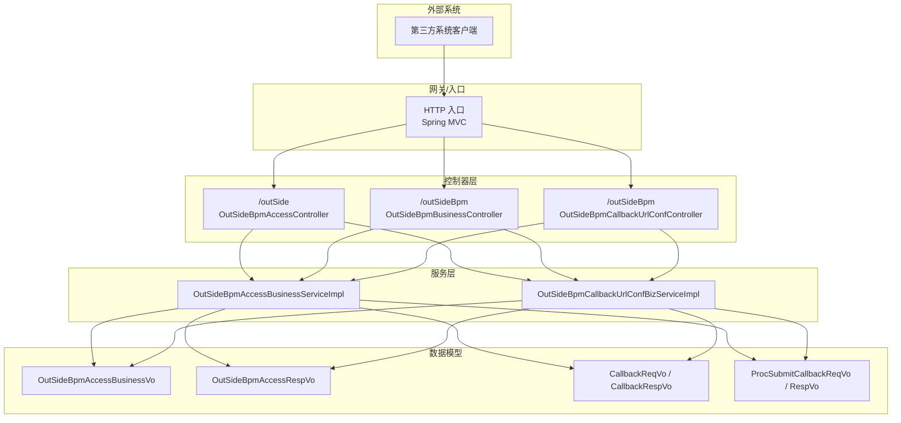
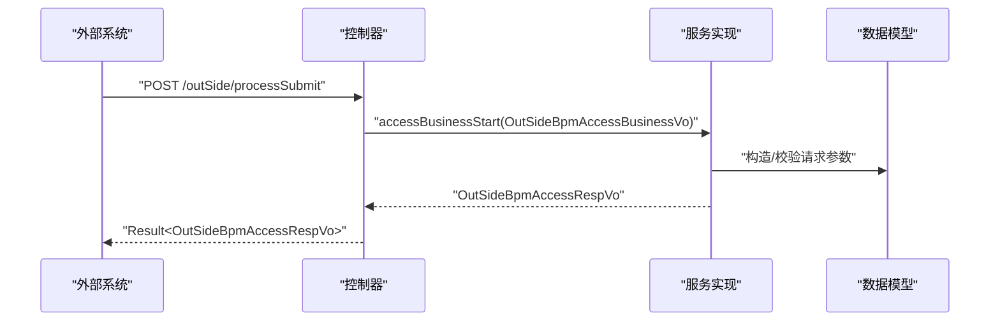
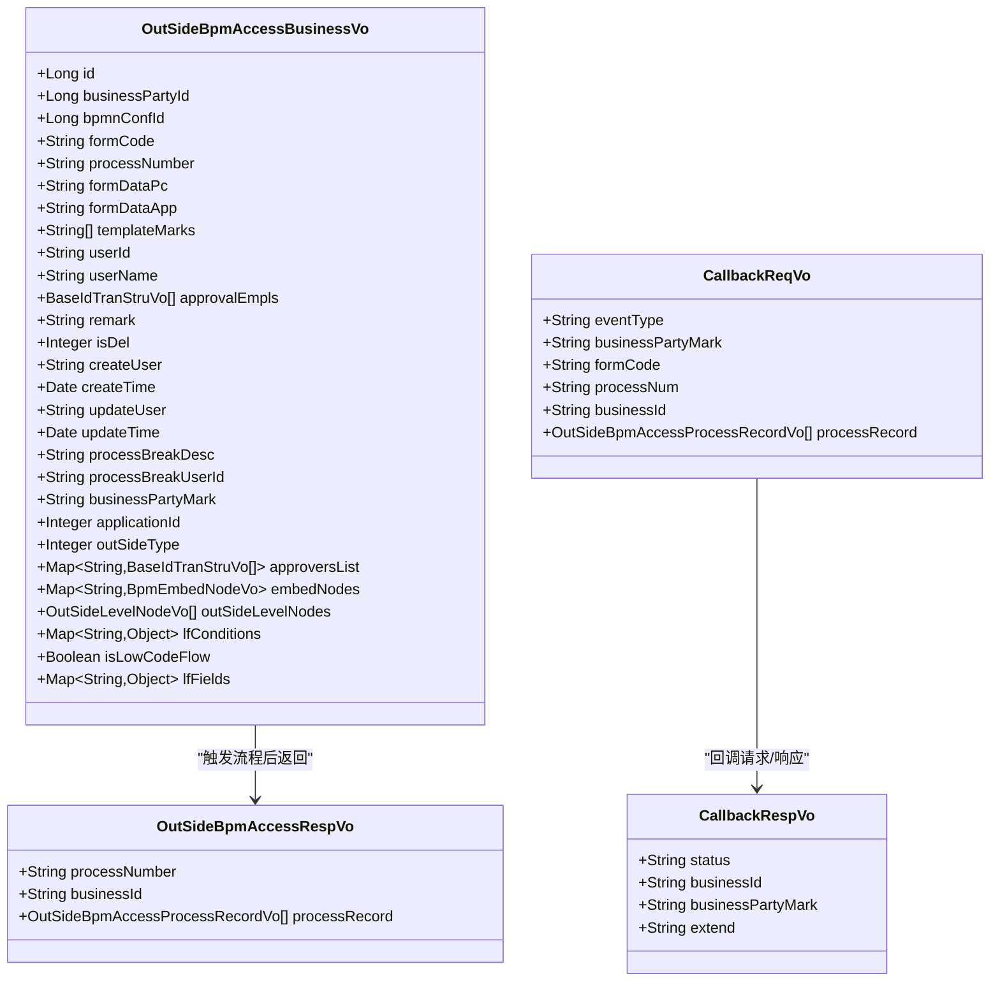
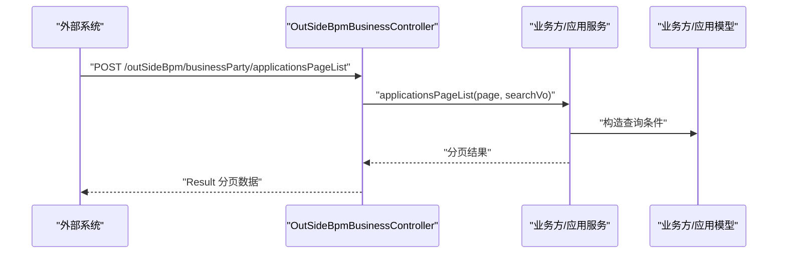
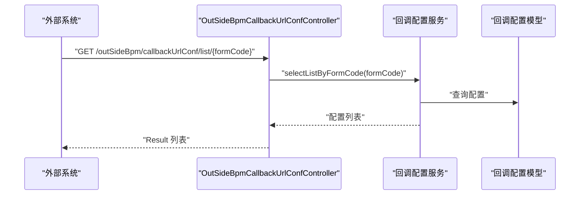
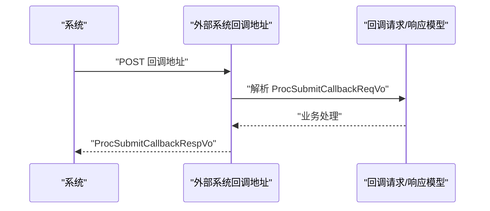
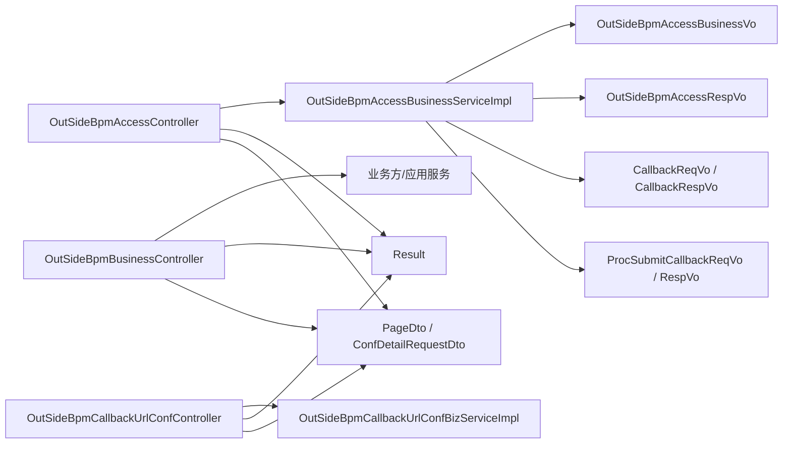

# 外部系统集成 API

<cite>
**本文引用的文件**
- [OutSideBpmAccessController.java](file://antflow-engine/src/main/java/org/openoa/engine/bpmnconf/controller/OutSideBpmAccessController.java)
- [OutSideBpmBusinessController.java](file://antflow-engine/src/main/java/org/openoa/engine/bpmnconf/controller/OutSideBpmBusinessController.java)
- [OutSideBpmCallbackUrlConfController.java](file://antflow-engine/src/main/java/org/openoa/engine/bpmnconf/controller/OutSideBpmCallbackUrlConfController.java)
- [OutSideBpmAccessBusinessVo.java](file://antflow-engine/src/main/java/org/openoa/engine/vo/OutSideBpmAccessBusinessVo.java)
- [OutSideBpmAccessRespVo.java](file://antflow-engine/src/main/java/org/openoa/engine/vo/OutSideBpmAccessRespVo.java)
- [CallbackReqVo.java](file://antflow-engine/src/main/java/org/openoa/engine/vo/CallbackReqVo.java)
- [CallbackRespVo.java](file://antflow-engine/src/main/java/org/openoa/engine/vo/CallbackRespVo.java)
- [ProcSubmitCallbackReqVo.java](file://antflow-engine/src/main/java/org/openoa/engine/vo/ProcSubmitCallbackReqVo.java)
- [ProcSubmitCallbackRespVo.java](file://antflow-engine/src/main/java/org/openoa/engine/vo/ProcSubmitCallbackRespVo.java)
- [OutSideBpmAccessBusinessServiceImpl.java](file://antflow-engine/src/main/java/org/openoa/engine/bpmnconf/service/impl/OutSideBpmAccessBusinessServiceImpl.java)
- [OutSideBpmCallbackUrlConfBizServiceImpl.java](file://antflow-engine/src/main/java/org/openoa/engine/bpmnconf/service/biz/OutSideBpmCallbackUrlConfBizServiceImpl.java)
- [OutSideBpmCallbackUrlConfBizService.java](file://antflow-engine/src/main/java/org/openoa/engine/bpmnconf/service/interf/biz/OutSideBpmCallbackUrlConfBizService.java)
- [OutSideBpmAccessProcessRecordVo.java](file://antflow-engine/src/main/java/org/openoa/engine/vo/OutSideBpmAccessProcessRecordVo.java)
- [OutSideBpmBusinessPartyVo.java](file://antflow-engine/src/main/java/org/openoa/engine/vo/OutSideBpmBusinessPartyVo.java)
- [BpmProcessAppApplicationVo.java](file://antflow-engine/src/main/java/org/openoa/engine/vo/BpmProcessAppApplicationVo.java)
- [OutSideBpmConditionsTemplateVo.java](file://antflow-engine/src/main/java/org/openoa/engine/vo/OutSideBpmConditionsTemplateVo.java)
- [OutSideBpmApproveTemplateVo.java](file://antflow-engine/src/main/java/org/openoa/engine/vo/OutSideBpmApproveTemplateVo.java)
- [OutSideBpmCallbackUrlConfVo.java](file://antflow-engine/src/main/java/org/openoa/engine/vo/OutSideBpmCallbackUrlConfVo.java)
- [OutSideBpmAccessProcessRecordVo.java](file://antflow-engine/src/main/java/org/openoa/engine/vo/OutSideBpmAccessProcessRecordVo.java)
- [Result.java](file://antflow-base/src/main/java/org/openoa/base/entity/Result.java)
- [PageDto.java](file://antflow-base/src/main/java/org/openoa/base/dto/PageDto.java)
- [ConfDetailRequestDto.java](file://antflow-base/src/main/java/org/openoa/base/vo/ConfDetailRequestDto.java)
- [BpmnConfVo.java](file://antflow-base/src/main/java/org/openoa/base/vo/BpmnConfVo.java)
- [BaseIdTranStruVo.java](file://antflow-base/src/main/java/org/openoa/base/vo/BaseIdTranStruVo.java)
- [BpmEmbedNodeVo.java](file://antflow-base/src/main/java/org/openoa/base/vo/BpmEmbedNodeVo.java)
- [OutSideLevelNodeVo.java](file://antflow-base/src/main/java/org/openoa/base/vo/OutSideLevelNodeVo.java)
</cite>

## 目录
1. [简介](#简介)
2. [项目结构](#项目结构)
3. [核心组件](#核心组件)
4. [架构总览](#架构总览)
5. [详细组件分析](#详细组件分析)
6. [依赖关系分析](#依赖关系分析)
7. [性能考虑](#性能考虑)
8. [故障排查指南](#故障排查指南)
9. [结论](#结论)
10. [附录](#附录)

## 简介
本文件面向需要与系统进行外部系统集成的第三方开发者，提供 REST API 接口规范与集成实践指南。内容覆盖外部流程接入、业务数据同步、回调通知、权限验证、数据格式转换与安全传输等方面，并给出流程发起、状态查询、结果回调等典型场景的调用步骤与最佳实践。

## 项目结构
系统采用基于 Spring Boot 的分层架构，外部系统集成相关能力集中在以下模块与控制器中：
- 控制器层：对外暴露 REST 接口，分别负责流程接入、业务方管理、回调配置等。
- VO/DTO 层：定义请求与响应的数据结构，确保前后端与第三方系统间的数据一致性。
- 服务层：封装业务逻辑，处理流程启动、预览、打断、记录查询、模板与回调配置等。

图表来源
- [OutSideBpmAccessController.java:22-90](file://antflow-engine/src/main/java/org/openoa/engine/bpmnconf/controller/OutSideBpmAccessController.java#L22-L90)
- [OutSideBpmBusinessController.java:20-195](file://antflow-engine/src/main/java/org/openoa/engine/bpmnconf/controller/OutSideBpmBusinessController.java#L20-L195)
- [OutSideBpmCallbackUrlConfController.java:16-68](file://antflow-engine/src/main/java/org/openoa/engine/bpmnconf/controller/OutSideBpmCallbackUrlConfController.java#L16-L68)
- [OutSideBpmAccessBusinessServiceImpl.java](file://antflow-engine/src/main/java/org/openoa/engine/bpmnconf/service/impl/OutSideBpmAccessBusinessServiceImpl.java)
- [OutSideBpmCallbackUrlConfBizServiceImpl.java](file://antflow-engine/src/main/java/org/openoa/engine/bpmnconf/service/biz/OutSideBpmCallbackUrlConfBizServiceImpl.java)

章节来源
- [OutSideBpmAccessController.java:22-90](file://antflow-engine/src/main/java/org/openoa/engine/bpmnconf/controller/OutSideBpmAccessController.java#L22-L90)
- [OutSideBpmBusinessController.java:20-195](file://antflow-engine/src/main/java/org/openoa/engine/bpmnconf/controller/OutSideBpmBusinessController.java#L20-L195)
- [OutSideBpmCallbackUrlConfController.java:16-68](file://antflow-engine/src/main/java/org/openoa/engine/bpmnconf/controller/OutSideBpmCallbackUrlConfController.java#L16-L68)

## 核心组件
- 外部流程接入控制器：提供流程提交、表单页面列表、流程预览、流程打断、流程记录查询等接口。
- 业务方与应用管理控制器：提供业务方项目信息、应用信息的分页查询、详情、编辑、新增等接口。
- 回调配置控制器：提供回调地址配置的查询、分页、详情、编辑等接口。
- 数据模型：统一的请求/响应 VO，包含流程编号、表单数据、审批人、嵌入节点、低代码条件与字段等扩展信息；回调请求/响应 VO，包含事件类型、业务方标识、表单编号、流程编号、业务编号与流程记录列表等。

章节来源
- [OutSideBpmAccessController.java:38-88](file://antflow-engine/src/main/java/org/openoa/engine/bpmnconf/controller/OutSideBpmAccessController.java#L38-L88)
- [OutSideBpmBusinessController.java:38-194](file://antflow-engine/src/main/java/org/openoa/engine/bpmnconf/controller/OutSideBpmBusinessController.java#L38-L194)
- [OutSideBpmCallbackUrlConfController.java:29-66](file://antflow-engine/src/main/java/org/openoa/engine/bpmnconf/controller/OutSideBpmCallbackUrlConfController.java#L29-L66)
- [OutSideBpmAccessBusinessVo.java:29-138](file://antflow-engine/src/main/java/org/openoa/engine/vo/OutSideBpmAccessBusinessVo.java#L29-L138)
- [OutSideBpmAccessRespVo.java:16-33](file://antflow-engine/src/main/java/org/openoa/engine/vo/OutSideBpmAccessRespVo.java#L16-L33)
- [CallbackReqVo.java:9-40](file://antflow-engine/src/main/java/org/openoa/engine/vo/CallbackReqVo.java#L9-L40)
- [CallbackRespVo.java:8-30](file://antflow-engine/src/main/java/org/openoa/engine/vo/CallbackRespVo.java#L8-L30)
- [ProcSubmitCallbackReqVo.java:6-20](file://antflow-engine/src/main/java/org/openoa/engine/vo/ProcSubmitCallbackReqVo.java#L6-L20)
- [ProcSubmitCallbackRespVo.java:3-4](file://antflow-engine/src/main/java/org/openoa/engine/vo/ProcSubmitCallbackRespVo.java#L3-L4)

## 架构总览
外部系统通过 REST API 与系统交互，控制器接收请求后调用对应服务实现，服务层完成业务处理并将结果以统一的响应对象返回。回调通知由系统向外部系统推送，回调请求体包含事件类型、业务方标识、表单编号、流程编号、业务编号与流程记录列表等关键字段。

图表来源
- [OutSideBpmAccessController.java:38-41](file://antflow-engine/src/main/java/org/openoa/engine/bpmnconf/controller/OutSideBpmAccessController.java#L38-L41)
- [OutSideBpmAccessBusinessServiceImpl.java](file://antflow-engine/src/main/java/org/openoa/engine/bpmnconf/service/impl/OutSideBpmAccessBusinessServiceImpl.java)
- [OutSideBpmAccessBusinessVo.java:29-138](file://antflow-engine/src/main/java/org/openoa/engine/vo/OutSideBpmAccessBusinessVo.java#L29-L138)
- [OutSideBpmAccessRespVo.java:16-33](file://antflow-engine/src/main/java/org/openoa/engine/vo/OutSideBpmAccessRespVo.java#L16-L33)
- [Result.java](file://antflow-base/src/main/java/org/openoa/base/entity/Result.java)

## 详细组件分析

### 外部流程接入接口
- 接口概览
  - 流程提交：POST /outSide/processSubmit
  - 表单页面列表：POST /outSide/getOutSideFormCodePageList
  - 流程预览：POST /outSide/processPreview
  - 流程打断：POST /outSide/processBreak
  - 流程记录查询：GET /outSide/outSideProcessRecord?processNumber=...

- 请求与响应模型
  - 请求：OutSideBpmAccessBusinessVo
  - 响应：OutSideBpmAccessRespVo
  - 统一返回：Result<T>

- 关键字段说明
  - 流程编号：用于后续状态查询与回调关联
  - 表单数据：PC 与 APP 端表单数据 JSON 字符串
  - 审批人：支持多级审批人列表与嵌入节点配置
  - 低代码字段：lfConditions、lfFields 等扩展字段
  - 业务方标识：businessPartyMark 用于区分不同业务方

图表来源
- [OutSideBpmAccessBusinessVo.java:29-138](file://antflow-engine/src/main/java/org/openoa/engine/vo/OutSideBpmAccessBusinessVo.java#L29-L138)
- [OutSideBpmAccessRespVo.java:16-33](file://antflow-engine/src/main/java/org/openoa/engine/vo/OutSideBpmAccessRespVo.java#L16-L33)
- [CallbackReqVo.java:9-40](file://antflow-engine/src/main/java/org/openoa/engine/vo/CallbackReqVo.java#L9-L40)
- [CallbackRespVo.java:8-30](file://antflow-engine/src/main/java/org/openoa/engine/vo/CallbackRespVo.java#L8-L30)

章节来源
- [OutSideBpmAccessController.java:38-88](file://antflow-engine/src/main/java/org/openoa/engine/bpmnconf/controller/OutSideBpmAccessController.java#L38-L88)
- [OutSideBpmAccessBusinessVo.java:29-138](file://antflow-engine/src/main/java/org/openoa/engine/vo/OutSideBpmAccessBusinessVo.java#L29-L138)
- [OutSideBpmAccessRespVo.java:16-33](file://antflow-engine/src/main/java/org/openoa/engine/vo/OutSideBpmAccessRespVo.java#L16-L33)
- [Result.java](file://antflow-base/src/main/java/org/openoa/base/entity/Result.java)

### 业务方与应用管理接口
- 接口概览
  - 业务方项目分页列表：POST /outSideBpm/businessParty/listPage
  - 业务方项目详情：GET /outSideBpm/businessParty/detail/{id}
  - 编辑业务方项目：POST /outSideBpm/businessParty/edit
  - 应用分页列表：POST /outSideBpm/businessParty/applicationsPageList
  - 新增应用：POST /outSideBpm/businessParty/addBpmProcessAppApplication
  - 应用详情：GET /outSideBpm/businessParty/applicationDetail/{id}

- 关键模型
  - 业务方：OutSideBpmBusinessPartyVo
  - 应用：BpmProcessAppApplicationVo

图表来源
- [OutSideBpmBusinessController.java:70-83](file://antflow-engine/src/main/java/org/openoa/engine/bpmnconf/controller/OutSideBpmBusinessController.java#L70-L83)
- [OutSideBpmBusinessPartyVo.java](file://antflow-engine/src/main/java/org/openoa/engine/vo/OutSideBpmBusinessPartyVo.java)
- [BpmProcessAppApplicationVo.java](file://antflow-engine/src/main/java/org/openoa/engine/vo/BpmProcessAppApplicationVo.java)

章节来源
- [OutSideBpmBusinessController.java:38-100](file://antflow-engine/src/main/java/org/openoa/engine/bpmnconf/controller/OutSideBpmBusinessController.java#L38-L100)

### 回调配置接口
- 接口概览
  - 根据表单编码查询回调配置列表：GET /outSideBpm/callbackUrlConf/list/{formCode}
  - 回调配置分页查询：GET /outSideBpm/callbackUrlConf/listPage
  - 回调配置详情：GET /outSideBpm/callbackUrlConf/detail/{id}
  - 编辑回调配置：POST /outSideBpm/callbackUrlConf/edit

- 关键模型
  - 回调配置：OutSideBpmCallbackUrlConfVo

图表来源
- [OutSideBpmCallbackUrlConfController.java:29-32](file://antflow-engine/src/main/java/org/openoa/engine/bpmnconf/controller/OutSideBpmCallbackUrlConfController.java#L29-L32)
- [OutSideBpmCallbackUrlConfBizServiceImpl.java](file://antflow-engine/src/main/java/org/openoa/engine/bpmnconf/service/biz/OutSideBpmCallbackUrlConfBizServiceImpl.java)
- [OutSideBpmCallbackUrlConfBizService.java](file://antflow-engine/src/main/java/org/openoa/engine/bpmnconf/service/interf/biz/OutSideBpmCallbackUrlConfBizService.java)
- [OutSideBpmCallbackUrlConfVo.java](file://antflow-engine/src/main/java/org/openoa/engine/vo/OutSideBpmCallbackUrlConfVo.java)

章节来源
- [OutSideBpmCallbackUrlConfController.java:29-66](file://antflow-engine/src/main/java/org/openoa/engine/bpmnconf/controller/OutSideBpmCallbackUrlConfController.java#L29-L66)

### 回调通知机制
- 回调请求体
  - 事件类型：eventType
  - 业务方标识：businessPartyMark
  - 表单编号：formCode
  - 流程编号：processNum
  - 业务编号：businessId
  - 流程记录列表：processRecord

- 回调响应体
  - 状态：status
  - 业务编号：businessId
  - 业务方标识：businessPartyMark
  - 扩展信息：extend

- 典型回调场景
  - 流程提交回调：ProcSubmitCallbackReqVo/RespVo

图表来源
- [CallbackReqVo.java:9-40](file://antflow-engine/src/main/java/org/openoa/engine/vo/CallbackReqVo.java#L9-L40)
- [CallbackRespVo.java:8-30](file://antflow-engine/src/main/java/org/openoa/engine/vo/CallbackRespVo.java#L8-L30)
- [ProcSubmitCallbackReqVo.java:6-20](file://antflow-engine/src/main/java/org/openoa/engine/vo/ProcSubmitCallbackReqVo.java#L6-L20)
- [ProcSubmitCallbackRespVo.java:3-4](file://antflow-engine/src/main/java/org/openoa/engine/vo/ProcSubmitCallbackRespVo.java#L3-L4)

章节来源
- [CallbackReqVo.java:9-40](file://antflow-engine/src/main/java/org/openoa/engine/vo/CallbackReqVo.java#L9-L40)
- [CallbackRespVo.java:8-30](file://antflow-engine/src/main/java/org/openoa/engine/vo/CallbackRespVo.java#L8-L30)
- [ProcSubmitCallbackReqVo.java:6-20](file://antflow-engine/src/main/java/org/openoa/engine/vo/ProcSubmitCallbackReqVo.java#L6-L20)
- [ProcSubmitCallbackRespVo.java:3-4](file://antflow-engine/src/main/java/org/openoa/engine/vo/ProcSubmitCallbackRespVo.java#L3-L4)

## 依赖关系分析
- 控制器依赖服务接口与实现，服务层依赖 VO/DTO 进行数据传递。
- 统一响应包装类 Result 提供一致的返回结构。
- 分页查询依赖 PageDto 与 ConfDetailRequestDto。

图表来源
- [OutSideBpmAccessController.java:22-90](file://antflow-engine/src/main/java/org/openoa/engine/bpmnconf/controller/OutSideBpmAccessController.java#L22-L90)
- [OutSideBpmBusinessController.java:20-195](file://antflow-engine/src/main/java/org/openoa/engine/bpmnconf/controller/OutSideBpmBusinessController.java#L20-L195)
- [OutSideBpmCallbackUrlConfController.java:16-68](file://antflow-engine/src/main/java/org/openoa/engine/bpmnconf/controller/OutSideBpmCallbackUrlConfController.java#L16-L68)
- [OutSideBpmAccessBusinessServiceImpl.java](file://antflow-engine/src/main/java/org/openoa/engine/bpmnconf/service/impl/OutSideBpmAccessBusinessServiceImpl.java)
- [OutSideBpmCallbackUrlConfBizServiceImpl.java](file://antflow-engine/src/main/java/org/openoa/engine/bpmnconf/service/biz/OutSideBpmCallbackUrlConfBizServiceImpl.java)
- [Result.java](file://antflow-base/src/main/java/org/openoa/base/entity/Result.java)
- [PageDto.java](file://antflow-base/src/main/java/org/openoa/base/dto/PageDto.java)
- [ConfDetailRequestDto.java](file://antflow-base/src/main/java/org/openoa/base/vo/ConfDetailRequestDto.java)

章节来源
- [OutSideBpmAccessController.java:22-90](file://antflow-engine/src/main/java/org/openoa/engine/bpmnconf/controller/OutSideBpmAccessController.java#L22-L90)
- [OutSideBpmBusinessController.java:20-195](file://antflow-engine/src/main/java/org/openoa/engine/bpmnconf/controller/OutSideBpmBusinessController.java#L20-L195)
- [OutSideBpmCallbackUrlConfController.java:16-68](file://antflow-engine/src/main/java/org/openoa/engine/bpmnconf/controller/OutSideBpmCallbackUrlConfController.java#L16-L68)

## 性能考虑
- 批量查询与分页：优先使用分页接口减少单次数据量，合理设置排序字段与过滤条件。
- 数据压缩：在 HTTP 传输层启用 gzip 压缩，降低大体量表单数据传输开销。
- 缓存策略：对不频繁变更的表单模板与回调配置进行缓存，减少数据库压力。
- 并发控制：流程提交与回调处理需注意幂等性与并发一致性，避免重复处理。

## 故障排查指南
- 统一响应结构：所有接口返回 Result 对象，检查 status 与 data 字段定位问题。
- 参数校验：确认请求体字段完整性，特别是流程编号、表单编号、业务方标识等关键字段。
- 回调失败重试：系统会进行有限次数的重试，外部系统需保证回调地址可用与响应稳定。
- 日志追踪：结合流程编号与业务编号在系统日志中定位具体流程实例与处理节点。

章节来源
- [Result.java](file://antflow-base/src/main/java/org/openoa/base/entity/Result.java)
- [OutSideBpmAccessController.java:38-88](file://antflow-engine/src/main/java/org/openoa/engine/bpmnconf/controller/OutSideBpmAccessController.java#L38-L88)

## 结论
本文档提供了外部系统集成所需的 REST API 接口规范与集成实践建议。通过统一的数据模型与回调机制，第三方系统可高效完成流程发起、状态查询与结果回调等关键能力。建议在生产环境中配合完善的监控与告警体系，确保集成稳定性与可观测性。

## 附录

### 接口清单与调用示例

- 流程发起
  - 方法：POST
  - 路径：/outSide/processSubmit
  - 请求体：OutSideBpmAccessBusinessVo
  - 响应体：OutSideBpmAccessRespVo
  - 示例步骤：
    1) 准备表单数据（PC/APP JSON）
    2) 设置业务方标识与表单编号
    3) 发送请求并获取流程编号
    4) 记录流程编号用于后续查询与回调

- 流程预览
  - 方法：POST
  - 路径：/outSide/processPreview
  - 请求体：OutSideBpmAccessBusinessVo
  - 响应体：Result

- 流程打断
  - 方法：POST
  - 路径：/outSide/processBreak
  - 请求体：OutSideBpmAccessBusinessVo
  - 响应体：Result

- 流程记录查询
  - 方法：GET
  - 路径：/outSide/outSideProcessRecord?processNumber=...
  - 响应体：Result

- 业务方与应用管理
  - 业务方分页列表：POST /outSideBpm/businessParty/listPage
  - 应用分页列表：POST /outSideBpm/businessParty/applicationsPageList
  - 新增应用：POST /outSideBpm/businessParty/addBpmProcessAppApplication
  - 回调配置管理：GET/POST /outSideBpm/callbackUrlConf/*

章节来源
- [OutSideBpmAccessController.java:38-88](file://antflow-engine/src/main/java/org/openoa/engine/bpmnconf/controller/OutSideBpmAccessController.java#L38-L88)
- [OutSideBpmBusinessController.java:38-194](file://antflow-engine/src/main/java/org/openoa/engine/bpmnconf/controller/OutSideBpmBusinessController.java#L38-L194)
- [OutSideBpmCallbackUrlConfController.java:29-66](file://antflow-engine/src/main/java/org/openoa/engine/bpmnconf/controller/OutSideBpmCallbackUrlConfController.java#L29-L66)