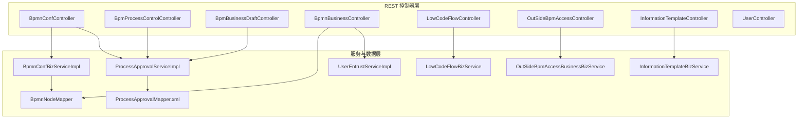
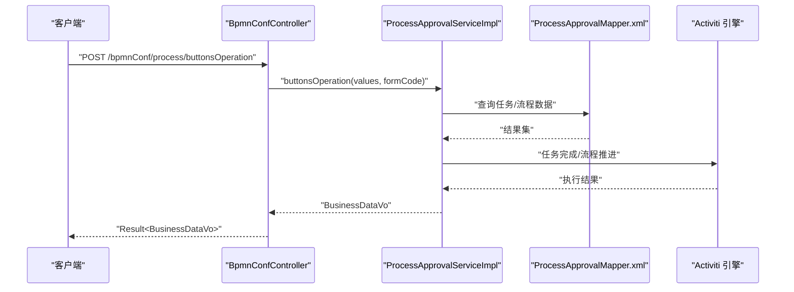
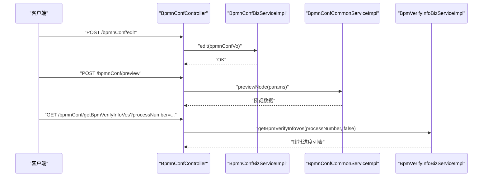
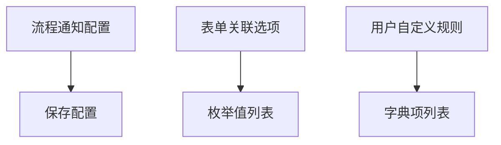
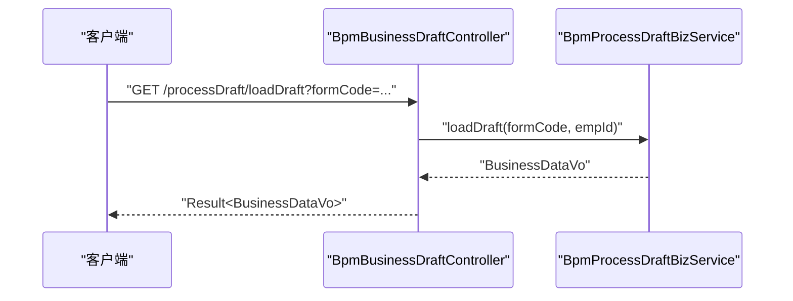
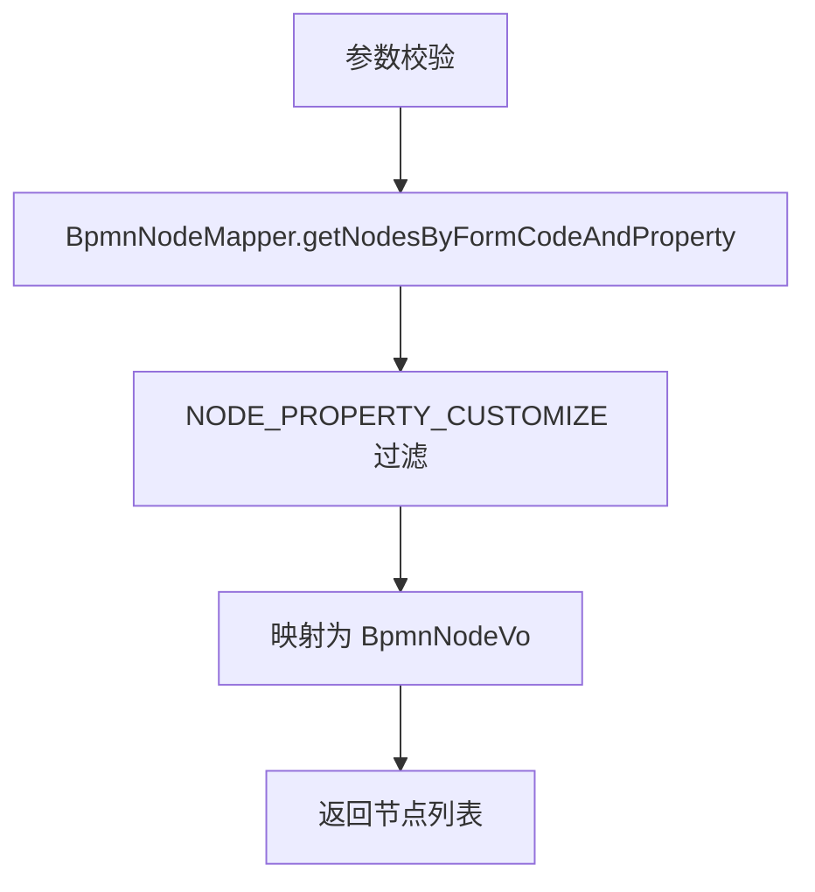
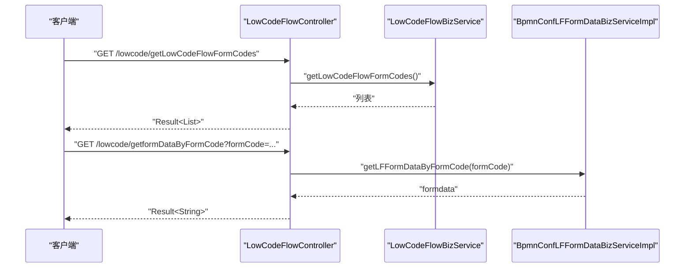
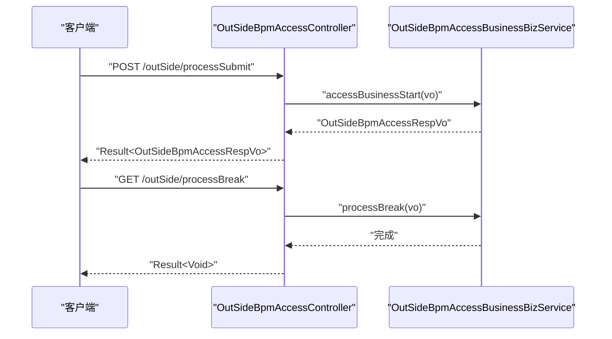
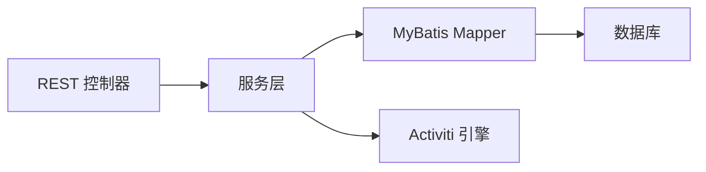

# 工作流管理 API

<cite>
**本文引用的文件**
- [BpmnConfController.java](file://antflow-engine/src/main/java/org/openoa/engine/bpmnconf/controller/BpmnConfController.java)
- [BpmProcessControlController.java](file://antflow-engine/src/main/java/org/openoa/engine/bpmnconf/controller/BpmProcessControlController.java)
- [BpmBusinessDraftController.java](file://antflow-engine/src/main/java/org/openoa/engine/bpmnconf/controller/BpmBusinessDraftController.java)
- [BpmnBusinessController.java](file://antflow-engine/src/main/java/org/openoa/engine/bpmnconf/controller/BpmnBusinessController.java)
- [LowCodeFlowController.java](file://antflow-engine/src/main/java/org/openoa/engine/bpmnconf/controller/LowCodeFlowController.java)
- [OutSideBpmAccessController.java](file://antflow-engine/src/main/java/org/openoa/engine/bpmnconf/controller/OutSideBpmAccessController.java)
- [InformationTemplateController.java](file://antflow-engine/src/main/java/org/openoa/engine/bpmnconf/controller/InformationTemplateController.java)
- [UserController.java](file://antflow-engine/src/main/java/org/openoa/engine/bpmnconf/controller/UserController.java)
- [12.Rest控制器.md](file://doc/系统介绍篇/12.Rest控制器.md)
- [11.流程操作和任务管理.md](file://doc/系统介绍篇/11.流程操作和任务管理.md)
- [14.流程设计器和流程节点配置.md](file://doc/系统介绍篇/14.流程设计器和流程节点配置.md)
- [18.外部工作流应用管理.md](file://doc/系统介绍篇/18.外部工作流应用管理.md)
- [TaskMgmtVO.java](file://antflow-base/src/main/java/org/openoa/base/vo/TaskMgmtVO.java)
</cite>

## 目录
1. [简介](#简介)
2. [项目结构](#项目结构)
3. [核心组件](#核心组件)
4. [架构总览](#架构总览)
5. [详细组件分析](#详细组件分析)
6. [依赖分析](#依赖分析)
7. [性能考虑](#性能考虑)
8. [故障排查指南](#故障排查指南)
9. [结论](#结论)
10. [附录](#附录)

## 简介
本文件面向工作流管理 API 的使用者与维护者，系统性梳理流程配置管理、流程控制、业务草稿管理、流程状态变更与终止、流程回退、权限控制、流程监控与统计分析等能力的接口规范。文档基于后端控制器与系统文档整理，配合架构图与序列图帮助理解端到端流程。

## 项目结构
后端采用分层架构，REST 控制器位于 antflow-engine 模块，对应的功能域如下：
- 流程配置与设计器：BpmnConfController
- 流程控制与权限：BpmProcessControlController
- 业务草稿：BpmBusinessDraftController
- BPMN 业务与委托：BpmnBusinessController
- 低代码流程：LowCodeFlowController
- 外部系统接入：OutSideBpmAccessController
- 通知模板与提醒：InformationTemplateController
- 用户与节点权限查询：UserController

**图表来源**
- [12.Rest控制器.md:7-41](file://doc/系统介绍篇/12.Rest控制器.md#L7-L41)
- [BpmnConfController.java:29-190](file://antflow-engine/src/main/java/org/openoa/engine/bpmnconf/controller/BpmnConfController.java#L29-L190)
- [BpmProcessControlController.java:25-60](file://antflow-engine/src/main/java/org/openoa/engine/bpmnconf/controller/BpmProcessControlController.java#L25-L60)
- [BpmBusinessDraftController.java:12-23](file://antflow-engine/src/main/java/org/openoa/engine/bpmnconf/controller/BpmBusinessDraftController.java#L12-L23)
- [BpmnBusinessController.java:29-113](file://antflow-engine/src/main/java/org/openoa/engine/bpmnconf/controller/BpmnBusinessController.java#L29-L113)
- [LowCodeFlowController.java:20-84](file://antflow-engine/src/main/java/org/openoa/engine/bpmnconf/controller/LowCodeFlowController.java#L20-L84)
- [OutSideBpmAccessController.java:20-90](file://antflow-engine/src/main/java/org/openoa/engine/bpmnconf/controller/OutSideBpmAccessController.java#L20-L90)
- [InformationTemplateController.java:28-206](file://antflow-engine/src/main/java/org/openoa/engine/bpmnconf/controller/InformationTemplateController.java#L28-L206)

**章节来源**
- [12.Rest控制器.md:1-377](file://doc/系统介绍篇/12.Rest控制器.md#L1-L377)

## 核心组件
- 流程配置与设计器接口：流程设计发布/复制、列表分页、节点预览、发起/任务页预览、节点操作人加载、审批进度查询、业务流程查看与按钮操作、流程启用、详情、流程列表分页等。
- 流程控制与权限接口：流程通知类型配置、表单关联选项、用户自定义规则选项。
- 业务草稿接口：加载指定表单的业务草稿。
- BPMN 业务与委托接口：DIY 表单代码列表、委托分页列表/详情/编辑、启动用户选择模块查询。
- 低代码流程接口：低代码表单代码列表、模板列表、启用列表、表单数据查询、创建低代码表单代码。
- 外部系统接入接口：业务方流程发起、三方流程模板列表、流程预览、流程终止、流程记录查询。
- 通知模板与提醒接口：模板列表/详情/保存/修改/删除、默认模板设置、通配符字符、流程事件、通知类型、按表单编码查询通知类型、超时提醒测试。
- 用户与节点权限查询接口：模糊查询用户/公司、获取全部人员/分页、角色信息、按节点/元素查询审批人。

**章节来源**
- [BpmnConfController.java:48-190](file://antflow-engine/src/main/java/org/openoa/engine/bpmnconf/controller/BpmnConfController.java#L48-L190)
- [BpmProcessControlController.java:34-59](file://antflow-engine/src/main/java/org/openoa/engine/bpmnconf/controller/BpmProcessControlController.java#L34-L59)
- [BpmBusinessDraftController.java:18-22](file://antflow-engine/src/main/java/org/openoa/engine/bpmnconf/controller/BpmBusinessDraftController.java#L18-L22)
- [BpmnBusinessController.java:40-111](file://antflow-engine/src/main/java/org/openoa/engine/bpmnconf/controller/BpmnBusinessController.java#L40-L111)
- [LowCodeFlowController.java:28-82](file://antflow-engine/src/main/java/org/openoa/engine/bpmnconf/controller/LowCodeFlowController.java#L28-L82)
- [OutSideBpmAccessController.java:32-88](file://antflow-engine/src/main/java/org/openoa/engine/bpmnconf/controller/OutSideBpmAccessController.java#L32-L88)
- [InformationTemplateController.java:44-205](file://antflow-engine/src/main/java/org/openoa/engine/bpmnconf/controller/InformationTemplateController.java#L44-L205)
- [UserController.java:42-106](file://antflow-engine/src/main/java/org/openoa/engine/bpmnconf/controller/UserController.java#L42-L106)

## 架构总览
工作流管理 API 采用分层架构，控制器负责对外暴露端点，服务层封装业务逻辑，数据层通过 MyBatis Mapper 访问数据库。系统与 Activiti 引擎集成，支持流程实例、任务、历史数据的查询与操作。

**图表来源**
- [11.流程操作和任务管理.md:74-98](file://doc/系统介绍篇/11.流程操作和任务管理.md#L74-L98)
- [BpmnConfController.java:146-149](file://antflow-engine/src/main/java/org/openoa/engine/bpmnconf/controller/BpmnConfController.java#L146-L149)

**章节来源**
- [11.流程操作和任务管理.md:1-333](file://doc/系统介绍篇/11.流程操作和任务管理.md#L1-L333)

## 详细组件分析

### 流程配置与设计器 API
- 端点：/bpmnConf/edit
  - 方法：POST
  - 请求体：BpmnConfVo
  - 作用：流程设计发布/复制
- 端点：/bpmnConf/listPage
  - 方法：POST
  - 请求体：ConfDetailRequestDto
  - 作用：流程设计信息列表分页
- 端点：/bpmnConf/preview
  - 方法：POST
  - 请求体：字符串参数
  - 作用：流程设计信息预览详情
- 端点：/bpmnConf/startPagePreviewNode
  - 方法：POST
  - 请求体：字符串参数（包含 isStartPreview）
  - 作用：发起/任务页预览节点切换
- 端点：/bpmnConf/loadNodeOperationUser
  - 方法：POST
  - 请求体：字符串参数
  - 作用：获取节点当前实际操作人
- 端点：/bpmnConf/getBpmVerifyInfoVos
  - 方法：GET
  - 参数：processNumber
  - 作用：获取审批进度数据信息
- 端点：/bpmnConf/process/viewBusinessProcess
  - 方法：POST
  - 请求体：values（字符串）、formCode（字符串）
  - 作用：审批页查看业务流程
- 端点：/bpmnConf/process/buttonsOperation
  - 方法：POST
  - 请求体：values（字符串）、formCode（字符串）
  - 作用：审批、发起、重新提交等按钮操作
- 端点：/bpmnConf/effectiveBpmn/{id}
  - 方法：GET
  - 路径参数：id
  - 作用：启用流程设计
- 端点：/bpmnConf/detail/{id}
  - 方法：GET
  - 路径参数：id
  - 作用：流程设计详情
- 端点：/bpmnConf/process/listPage/{type}
  - 方法：GET
  - 路径参数：type（3 我的发起，4 我的已办，5 我的待办，6 所有进行中实例，9 抄送到我）
  - 请求体：DetailRequestDto
  - 作用：PC 端流程列表分页

**图表来源**
- [BpmnConfController.java:65-125](file://antflow-engine/src/main/java/org/openoa/engine/bpmnconf/controller/BpmnConfController.java#L65-L125)

**章节来源**
- [BpmnConfController.java:48-190](file://antflow-engine/src/main/java/org/openoa/engine/bpmnconf/controller/BpmnConfController.java#L48-L190)

### 流程控制与权限 API
- 端点：/taskMgmt/taskMgmt
  - 方法：POST
  - 请求体：BpmProcessDeptVo
  - 作用：保存流程通知配置（注释说明：流程权限配置预留）
- 端点：/taskMgmt/getFormRelatedOptions
  - 方法：GET
  - 作用：获取表单关联选项（枚举映射）
- 端点：/taskMgmt/getUDROptions
  - 方法：GET
  - 作用：获取用户自定义规则选项（字典数据）

**图表来源**
- [BpmProcessControlController.java:39-59](file://antflow-engine/src/main/java/org/openoa/engine/bpmnconf/controller/BpmProcessControlController.java#L39-L59)

**章节来源**
- [BpmProcessControlController.java:25-60](file://antflow-engine/src/main/java/org/openoa/engine/bpmnconf/controller/BpmProcessControlController.java#L25-L60)

### 业务草稿 API
- 端点：/processDraft/loadDraft
  - 方法：GET
  - 参数：formCode
  - 作用：加载指定表单的业务草稿（当前登录员工）

**图表来源**
- [BpmBusinessDraftController.java:18-22](file://antflow-engine/src/main/java/org/openoa/engine/bpmnconf/controller/BpmBusinessDraftController.java#L18-L22)

**章节来源**
- [BpmBusinessDraftController.java:12-23](file://antflow-engine/src/main/java/org/openoa/engine/bpmnconf/controller/BpmBusinessDraftController.java#L12-L23)

### BPMN 业务与委托 API
- 端点：/bpmnBusiness/getDIYFormCodeList
  - 方法：GET
  - 参数：desc（描述筛选）
  - 作用：获取自定义表单DIY FormCode列表
- 端点：/bpmnBusiness/entrustlist/{type}
  - 方法：POST
  - 请求体：DetailRequestDto
  - 路径参数：type
  - 作用：按类型获取委托分页列表
- 端点：/bpmnBusiness/entrustDetail/{id}
  - 方法：GET
  - 路径参数：id
  - 作用：按ID获取委托详情
- 端点：/bpmnBusiness/editEntrust
  - 方法：POST
  - 请求体：DataVo
  - 作用：编辑委托信息
- 端点：/bpmnBusiness/getStartUserChooseModules
  - 方法：GET
  - 参数：formCode
  - 作用：获取流程启动用户选择模块（按节点属性过滤）

**图表来源**
- [BpmnBusinessController.java:98-111](file://antflow-engine/src/main/java/org/openoa/engine/bpmnconf/controller/BpmnBusinessController.java#L98-L111)

**章节来源**
- [BpmnBusinessController.java:40-111](file://antflow-engine/src/main/java/org/openoa/engine/bpmnconf/controller/BpmnBusinessController.java#L40-L111)

### 低代码流程 API
- 端点：/lowcode/getLowCodeFlowFormCodes
  - 方法：GET
  - 作用：获取全部 LF FormCodes（用于流程设计）
- 端点：/lowcode/getLFFormCodePageList
  - 方法：POST
  - 请求体：DetailRequestDto
  - 作用：获取 LF 表单代码分页列表（模板使用）
- 端点：/lowcode/getLFActiveFormCodePageList
  - 方法：POST
  - 请求体：DetailRequestDto
  - 作用：获取启用的 LF 表单代码分页列表（发起页面使用）
- 端点：/lowcode/getformDataByFormCode
  - 方法：GET
  - 参数：formCode
  - 作用：根据表单代码获取表单数据
- 端点：/lowcode/createLowCodeFormCode
  - 方法：POST
  - 请求体：BaseKeyValueStruVo
  - 作用：创建新的低代码表单代码

**图表来源**
- [LowCodeFlowController.java:33-82](file://antflow-engine/src/main/java/org/openoa/engine/bpmnconf/controller/LowCodeFlowController.java#L33-L82)

**章节来源**
- [LowCodeFlowController.java:28-84](file://antflow-engine/src/main/java/org/openoa/engine/bpmnconf/controller/LowCodeFlowController.java#L28-L84)

### 外部系统接入 API
- 端点：/outSide/processSubmit
  - 方法：POST
  - 请求体：OutSideBpmAccessBusinessVo
  - 作用：业务方流程发起
- 端点：/outSide/getOutSideFormCodePageList
  - 方法：POST
  - 请求体：ConfDetailRequestDto
  - 作用：获取三方流程模板列表
- 端点：/outSide/processPreview
  - 方法：POST
  - 请求体：OutSideBpmAccessBusinessVo
  - 作用：三方流程预览
- 端点：/outSide/processBreak
  - 方法：POST
  - 请求体：OutSideBpmAccessBusinessVo
  - 作用：流程终止
- 端点：/outSide/outSideProcessRecord
  - 方法：GET
  - 参数：processNumber
  - 作用：获取流程记录

**图表来源**
- [OutSideBpmAccessController.java:38-88](file://antflow-engine/src/main/java/org/openoa/engine/bpmnconf/controller/OutSideBpmAccessController.java#L38-L88)

**章节来源**
- [OutSideBpmAccessController.java:32-88](file://antflow-engine/src/main/java/org/openoa/engine/bpmnconf/controller/OutSideBpmAccessController.java#L32-L88)
- [18.外部工作流应用管理.md:1-239](file://doc/系统介绍篇/18.外部工作流应用管理.md#L1-L239)

### 通知模板与提醒 API
- 端点：/informationTemplates/listPage
  - 方法：POST
  - 请求体：InformationPgeRequestDto
  - 作用：模板列表分页
- 端点：/informationTemplates/getInformationTemplateById
  - 方法：GET
  - 参数：templateId
  - 作用：按ID获取模板详情
- 端点：/informationTemplates/updateById
  - 方法：POST
  - 请求体：InformationTemplateVo
  - 作用：修改模板
- 端点：/informationTemplates/save
  - 方法：POST
  - 请求体：InformationTemplateVo
  - 作用：保存模板
- 端点：/informationTemplates/deleteById
  - 方法：POST
  - 参数：id
  - 作用：删除模板
- 端点：/informationTemplates/listByName
  - 方法：GET
  - 参数：name
  - 作用：按名称模糊查询模板
- 端点：/informationTemplates/defaultTemplates
  - 方法：GET
  - 作用：获取默认模板列表
- 端点：/informationTemplates/setDefaultTemplates
  - 方法：POST
  - 请求体：DefaultTemplateVo[]
  - 作用：设置默认模板
- 端点：/informationTemplates/getWildcardCharacter
  - 方法：GET
  - 参数：name
  - 作用：获取通配符字符列表
- 端点：/informationTemplates/getProcessEvents
  - 方法：GET
  - 作用：获取所有流程事件
- 端点：/informationTemplates/getAllNoticeTypes
  - 方法：GET
  - 作用：获取所有通知类型
- 端点：/informationTemplates/getNoticeTypeByFormCode
  - 方法：GET
  - 参数：formCode
  - 作用：按表单编码查询通知类型
- 端点：/informationTemplates/testDoTimeoutReminder
  - 方法：GET
  - 作用：测试超时提醒

**章节来源**
- [InformationTemplateController.java:44-205](file://antflow-engine/src/main/java/org/openoa/engine/bpmnconf/controller/InformationTemplateController.java#L44-L205)

### 用户与节点权限查询 API
- 端点：/user/queryUserByNameFuzzy
  - 方法：GET
  - 参数：userName
  - 作用：模糊查询用户
- 端点：/user/queryCompanyByNameFuzzy
  - 方法：GET
  - 参数：companyName
  - 作用：模糊查询公司
- 端点：/user/getUser/{roleId}
  - 方法：GET
  - 路径参数：roleId
  - 作用：获取全部人员（可按角色过滤）
- 端点：/user/getUserPageList
  - 方法：POST
  - 请求体：DetailRequestDto
  - 作用：获取人员分页列表
- 端点：/user/getRoleInfo
  - 方法：GET
  - 作用：获取角色信息
- 端点：/user/queryNodeAssigneesByNodeId
  - 方法：GET
  - 参数：processNumber, nodeId
  - 作用：按节点ID查询审批人
- 端点：/user/queryNodeAssigneesByElementId
  - 方法：GET
  - 参数：processNumber, elementId
  - 作用：按元素ID查询审批人

**章节来源**
- [UserController.java:42-106](file://antflow-engine/src/main/java/org/openoa/engine/bpmnconf/controller/UserController.java#L42-L106)

## 依赖分析
- 控制器与服务层：各控制器通过 @Autowired 注入服务，如 ProcessApprovalServiceImpl、BpmnConfBizServiceImpl、UserEntrustServiceImpl、LowCodeFlowBizService、OutSideBpmAccessBusinessBizService、InformationTemplateBizService 等。
- 服务层与数据层：服务层通过 Mapper 或直接 SQL 访问数据库，如 ProcessApprovalMapper.xml、BpmnNodeMapper、DicDataMapper、OutSideBpmBusinessPartyMapper 等。
- 与 Activiti 集成：流程操作通过 TaskService、RuntimeService、HistoryService 等与 Activiti 引擎交互，支持任务完成、流程推进、历史审计等。

**图表来源**
- [12.Rest控制器.md:178-210](file://doc/系统介绍篇/12.Rest控制器.md#L178-L210)

**章节来源**
- [12.Rest控制器.md:176-272](file://doc/系统介绍篇/12.Rest控制器.md#L176-L272)

## 性能考虑
- 大数据集分页：列表查询统一使用 PageDto，建议前端合理设置 pageSize，避免一次性加载过多数据。
- 缓存策略：对高频字典项（如通知类型、事件类型、通配符字符）可考虑本地缓存，减少重复查询。
- 事务边界：批量操作时注意事务范围，避免长事务阻塞。
- 接口幂等：对外部接入的发起/终止等关键操作建议增加幂等控制（如业务唯一键）。

## 故障排查指南
- 参数校验失败：控制器对关键参数进行校验（如 formCode、processNumber），若为空将抛出业务异常。请检查请求参数是否正确传递。
- 委托管理异常：委托列表查询需提供分页参数，确保 DetailRequestDto 正确构造。
- 低代码表单：创建低代码表单代码前需确认表单编码唯一性，避免冲突。
- 外部接入：流程终止需确保 processNumber 正确，且当前流程实例仍处于可终止状态。
- 通知模板：删除模板时会标记 isDel=1，查询默认模板时需注意过滤条件。

**章节来源**
- [BpmnBusinessController.java:98-103](file://antflow-engine/src/main/java/org/openoa/engine/bpmnconf/controller/BpmnBusinessController.java#L98-L103)
- [LowCodeFlowController.java:70-77](file://antflow-engine/src/main/java/org/openoa/engine/bpmnconf/controller/LowCodeFlowController.java#L70-L77)
- [InformationTemplateController.java:89-97](file://antflow-engine/src/main/java/org/openoa/engine/bpmnconf/controller/InformationTemplateController.java#L89-L97)

## 结论
本文档系统性地梳理了工作流管理 API 的核心接口，涵盖流程配置、流程控制、业务草稿、低代码流程、外部接入、通知模板与用户权限查询等方面。结合架构图与序列图，有助于开发者快速理解端到端流程与数据流转，指导接口使用与集成。

## 附录
- 流程状态变更与终止：通过按钮操作与外部接入控制器实现，支持审批、发起、重新提交、终止等动作。
- 流程回退：系统支持动态条件迁移与流程重提交，可在条件变化时自动跳转至合适节点。
- 权限控制：节点审批人类型与按钮权限在设计器中配置，运行时通过服务层与 Activiti 引擎协同生效。
- 监控与统计：提供首页待办统计、流程事件与通知类型查询、超时提醒测试等能力。

**章节来源**
- [11.流程操作和任务管理.md:264-301](file://doc/系统介绍篇/11.流程操作和任务管理.md#L264-L301)
- [14.流程设计器和流程节点配置.md:211-307](file://doc/系统介绍篇/14.流程设计器和流程节点配置.md#L211-L307)
- [TaskMgmtVO.java:190-257](file://antflow-base/src/main/java/org/openoa/base/vo/TaskMgmtVO.java#L190-L257)