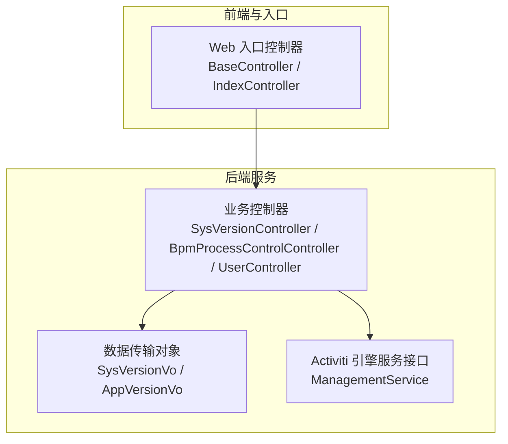
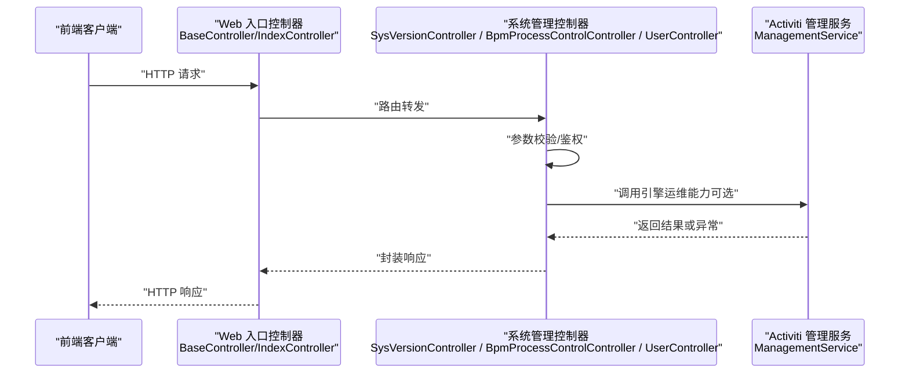
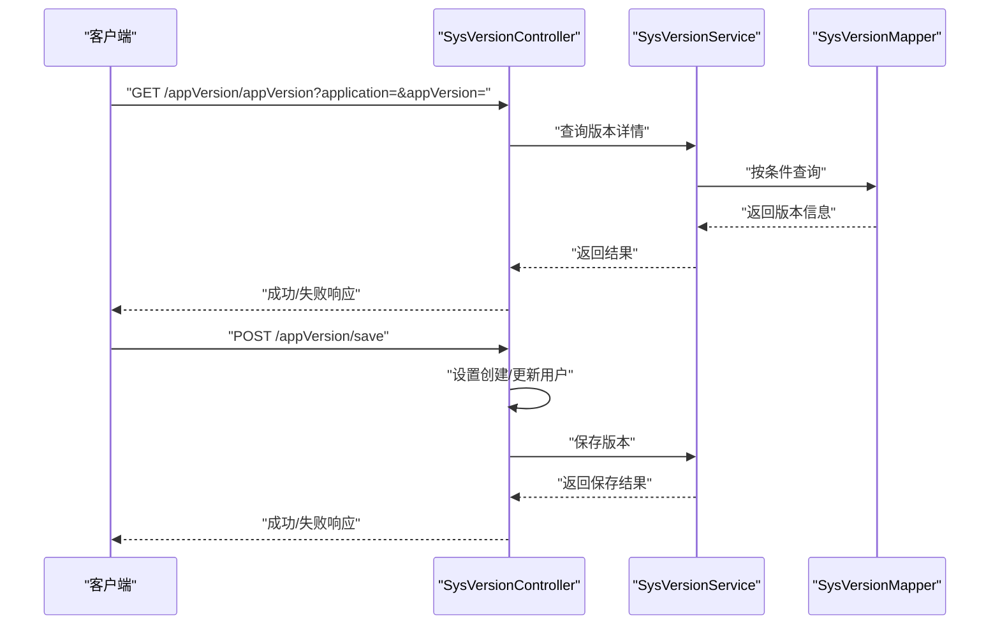
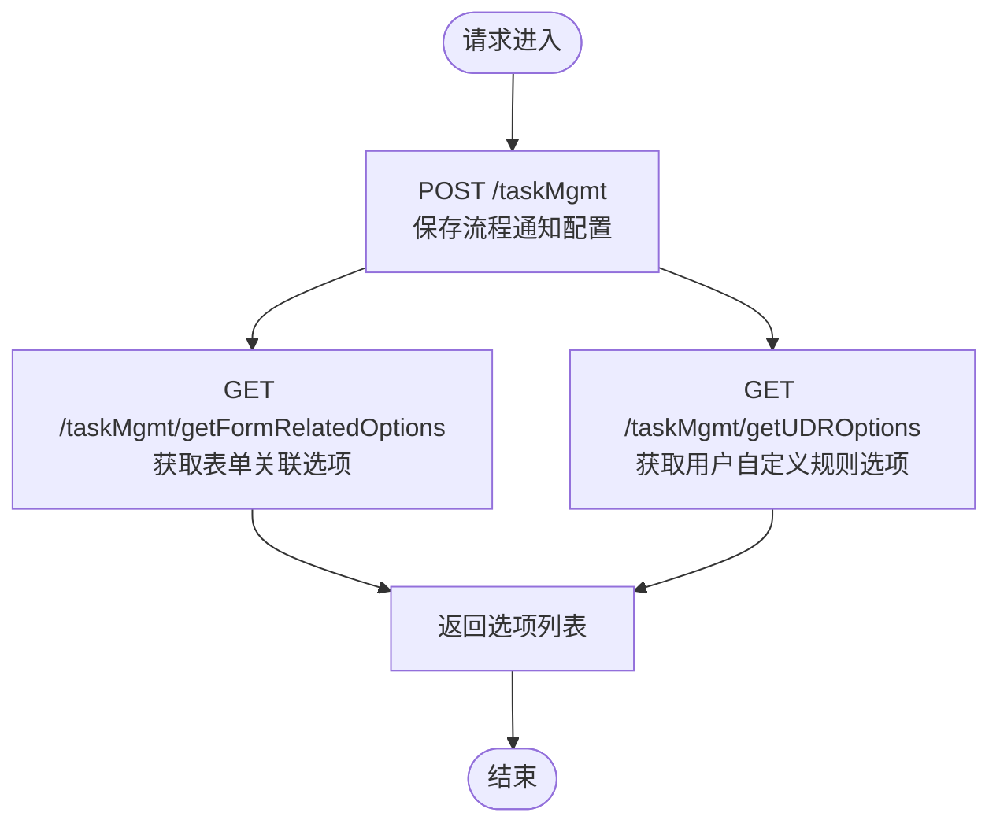
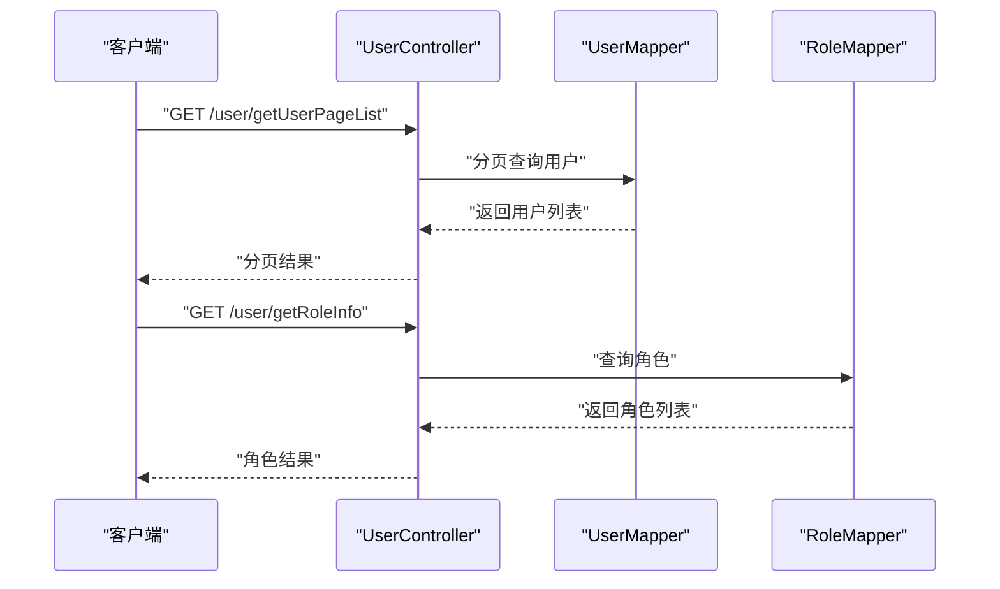
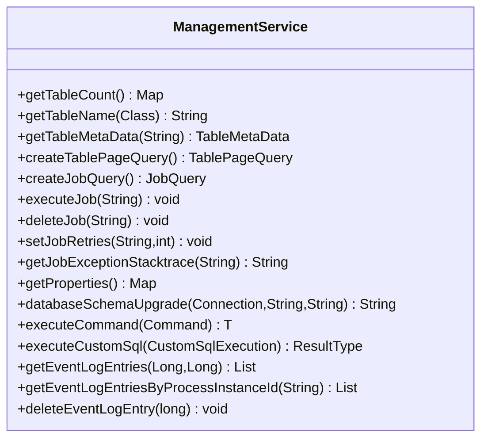
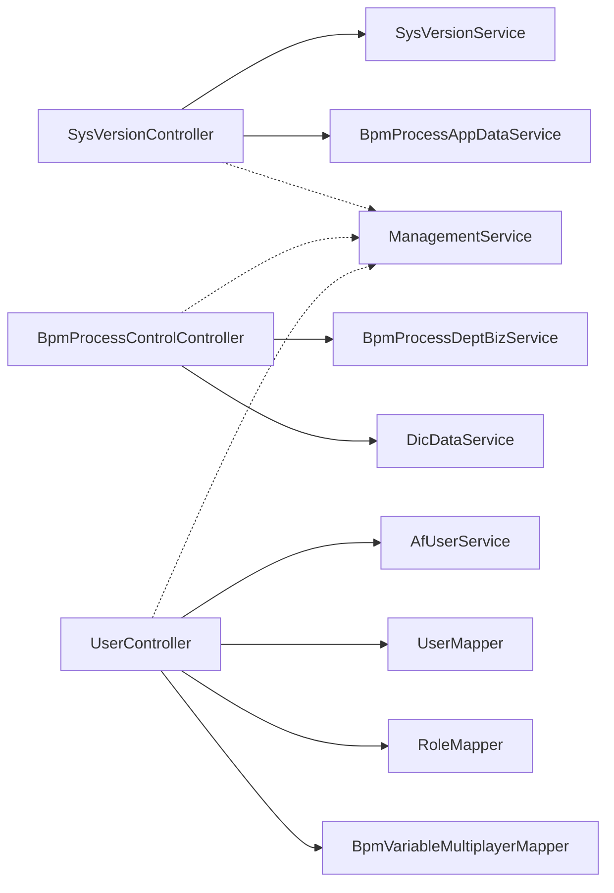

# 系统管理 API

<cite>
**本文引用的文件**
- [SysVersionController.java](file://antflow-engine/src/main/java/org/openoa/engine/bpmnconf/controller/SysVersionController.java)
- [BpmProcessControlController.java](file://antflow-engine/src/main/java/org/openoa/engine/bpmnconf/controller/BpmProcessControlController.java)
- [UserController.java](file://antflow-engine/src/main/java/org/openoa/engine/bpmnconf/controller/UserController.java)
- [ManagementService.java](file://antflow-base/src/main/java/org/activiti/engine/ManagementService.java)
- [SysVersionVo.java](file://antflow-engine/src/main/java/org/openoa/engine/vo/SysVersionVo.java)
- [AppVersionVo.java](file://antflow-engine/src/main/java/org/openoa/engine/vo/AppVersionVo.java)
- [BaseController.java](file://antflow-web/src/main/java/org/openoa/controller/BaseController.java)
- [IndexController.java](file://antflow-web/src/main/java/org/openoa/controller/IndexController.java)
</cite>

## 目录
1. [简介](#简介)
2. [项目结构](#项目结构)
3. [核心组件](#核心组件)
4. [架构总览](#架构总览)
5. [详细组件分析](#详细组件分析)
6. [依赖分析](#依赖分析)
7. [性能考虑](#性能考虑)
8. [故障排查指南](#故障排查指南)
9. [结论](#结论)
10. [附录](#附录)

## 简介
本文件面向系统管理员与运维工程师，系统性梳理并规范 AntFlow 工作流平台的“系统管理 API”。内容覆盖系统版本管理、流程任务管理、用户与角色管理、系统配置与参数查询、以及基于 Activiti 引擎的运维能力（如作业管理、事件日志、数据库元数据等）。文档以接口定义、调用流程、错误处理与最佳实践为主线，帮助读者快速掌握系统管理 API 的使用方法与注意事项。

## 项目结构
系统管理 API 主要位于后端工程的控制器层，围绕版本管理、流程任务管理、用户管理等模块展开；同时通过 Activiti 提供的 ManagementService 实现底层运维能力的封装与暴露。

图表来源
- [SysVersionController.java:1-83](file://antflow-engine/src/main/java/org/openoa/engine/bpmnconf/controller/SysVersionController.java#L1-L83)
- [BpmProcessControlController.java:1-61](file://antflow-engine/src/main/java/org/openoa/engine/bpmnconf/controller/BpmProcessControlController.java#L1-L61)
- [UserController.java:1-108](file://antflow-engine/src/main/java/org/openoa/engine/bpmnconf/controller/UserController.java#L1-L108)
- [ManagementService.java:1-165](file://antflow-base/src/main/java/org/activiti/engine/ManagementService.java#L1-L165)
- [SysVersionVo.java](file://antflow-engine/src/main/java/org/openoa/engine/vo/SysVersionVo.java)
- [AppVersionVo.java](file://antflow-engine/src/main/java/org/openoa/engine/vo/AppVersionVo.java)
- [BaseController.java](file://antflow-web/src/main/java/org/openoa/controller/BaseController.java)
- [IndexController.java](file://antflow-web/src/main/java/org/openoa/controller/IndexController.java)

章节来源
- [SysVersionController.java:1-83](file://antflow-engine/src/main/java/org/openoa/engine/bpmnconf/controller/SysVersionController.java#L1-L83)
- [BpmProcessControlController.java:1-61](file://antflow-engine/src/main/java/org/openoa/engine/bpmnconf/controller/BpmProcessControlController.java#L1-L61)
- [UserController.java:1-108](file://antflow-engine/src/main/java/org/openoa/engine/bpmnconf/controller/UserController.java#L1-L108)
- [ManagementService.java:1-165](file://antflow-base/src/main/java/org/activiti/engine/ManagementService.java#L1-L165)

## 核心组件
- 版本管理控制器：提供应用版本查询、二维码下载、版本列表、版本编辑与保存等接口。
- 流程任务管理控制器：提供流程通知配置、表单关联选项、用户自定义规则选项等查询接口。
- 用户管理控制器：提供模糊查询、分页查询、角色信息、节点经办人查询等接口。
- Activiti 管理服务接口：提供作业执行、作业删除、重试次数设置、异常堆栈获取、属性查询、数据库模式升级、事件日志查询等运维能力。

章节来源
- [SysVersionController.java:21-83](file://antflow-engine/src/main/java/org/openoa/engine/bpmnconf/controller/SysVersionController.java#L21-L83)
- [BpmProcessControlController.java:25-61](file://antflow-engine/src/main/java/org/openoa/engine/bpmnconf/controller/BpmProcessControlController.java#L25-L61)
- [UserController.java:25-108](file://antflow-engine/src/main/java/org/openoa/engine/bpmnconf/controller/UserController.java#L25-L108)
- [ManagementService.java:40-165](file://antflow-base/src/main/java/org/activiti/engine/ManagementService.java#L40-L165)

## 架构总览
系统管理 API 采用标准的 MVC 分层设计，控制器负责接收请求、组装参数并调用服务层；服务层协调持久层与引擎服务完成业务处理；VO 对象用于前后端数据传输；前端通过 Web 控制器统一入口访问后端。

图表来源
- [BaseController.java](file://antflow-web/src/main/java/org/openoa/controller/BaseController.java)
- [IndexController.java](file://antflow-web/src/main/java/org/openoa/controller/IndexController.java)
- [SysVersionController.java:21-83](file://antflow-engine/src/main/java/org/openoa/engine/bpmnconf/controller/SysVersionController.java#L21-L83)
- [BpmProcessControlController.java:25-61](file://antflow-engine/src/main/java/org/openoa/engine/bpmnconf/controller/BpmProcessControlController.java#L25-L61)
- [UserController.java:25-108](file://antflow-engine/src/main/java/org/openoa/engine/bpmnconf/controller/UserController.java#L25-L108)
- [ManagementService.java:40-165](file://antflow-base/src/main/java/org/activiti/engine/ManagementService.java#L40-L165)

## 详细组件分析

### 版本管理 API
- 接口目标：提供应用版本查询、二维码下载、版本列表、版本编辑与保存等能力，支撑移动端升级与运维配置。
- 关键接口
  - GET /appVersion/appVersion：按应用名与版本号查询版本详情
  - GET /appVersion/getQrCode：获取下载二维码
  - GET /appVersion/versionList：分页查询版本列表
  - POST /appVersion/{id}：根据 ID 更新版本信息
  - POST /appVersion/save：新增版本配置
- 数据模型
  - SysVersionVo：版本配置实体的传输对象
  - AppVersionVo：应用版本详情的传输对象
- 安全与鉴权
  - 编辑与保存接口会写入当前登录用户信息，需确保会话有效与权限校验
- 错误处理
  - 未找到版本时返回失败提示
  - 更新失败抛出业务异常
  - 插入失败抛出业务异常

图表来源
- [SysVersionController.java:29-81](file://antflow-engine/src/main/java/org/openoa/engine/bpmnconf/controller/SysVersionController.java#L29-L81)
- [SysVersionVo.java](file://antflow-engine/src/main/java/org/openoa/engine/vo/SysVersionVo.java)
- [AppVersionVo.java](file://antflow-engine/src/main/java/org/openoa/engine/vo/AppVersionVo.java)

章节来源
- [SysVersionController.java:21-83](file://antflow-engine/src/main/java/org/openoa/engine/bpmnconf/controller/SysVersionController.java#L21-L83)
- [SysVersionVo.java](file://antflow-engine/src/main/java/org/openoa/engine/vo/SysVersionVo.java)
- [AppVersionVo.java](file://antflow-engine/src/main/java/org/openoa/engine/vo/AppVersionVo.java)

### 流程任务管理 API
- 接口目标：为流程图标下的配置选项提供数据支撑，包括流程通知类型、表单关联选项、用户自定义规则选项等。
- 关键接口
  - POST /taskMgmt：保存流程通知配置
  - GET /taskMgmt/getFormRelatedOptions：获取表单关联选项枚举
  - GET /taskMgmt/getUDROptions：按分类获取用户自定义规则选项
- 适用场景
  - 配置流程通知策略
  - 动态生成表单关联与经办人规则下拉选项
- 数据模型
  - BpmProcessDeptVo：流程部门配置的传输对象
  - BaseNumIdStruVo / BaseIdTranStruVo：通用基础结构体，用于选项展示

图表来源
- [BpmProcessControlController.java:25-61](file://antflow-engine/src/main/java/org/openoa/engine/bpmnconf/controller/BpmProcessControlController.java#L25-L61)

章节来源
- [BpmProcessControlController.java:19-61](file://antflow-engine/src/main/java/org/openoa/engine/bpmnconf/controller/BpmProcessControlController.java#L19-L61)

### 用户与角色管理 API
- 接口目标：提供用户与组织信息的查询、分页与角色信息获取，支撑流程中的经办人选择与权限控制。
- 关键接口
  - GET /user/queryUserByNameFuzzy：按名称模糊查询用户
  - GET /user/queryCompanyByNameFuzzy：按公司名称模糊查询
  - GET /user/getUser 或 /user/getUser/{roleId}：获取全部或指定角色的用户列表
  - POST /user/getUserPageList：分页查询用户列表
  - GET /user/getRoleInfo：获取全部角色信息
  - GET /user/queryNodeAssigneesByNodeId：按流程编号与节点 ID 查询经办人
  - GET /user/queryNodeAssigneesByElementId：按流程编号与元素 ID 查询经办人
- 数据模型
  - BaseIdTranStruVo：用户/角色基础结构体
  - DetailRequestDto：分页查询请求载体
  - TaskMgmtVO：任务管理过滤条件

图表来源
- [UserController.java:64-94](file://antflow-engine/src/main/java/org/openoa/engine/bpmnconf/controller/UserController.java#L64-L94)

章节来源
- [UserController.java:25-108](file://antflow-engine/src/main/java/org/openoa/engine/bpmnconf/controller/UserController.java#L25-L108)

### Activiti 运维管理 API（ManagementService）
- 接口目标：提供作业管理、事件日志、数据库元数据、属性查询等运维能力，便于系统监控与故障定位。
- 关键能力
  - 作业管理：执行作业、删除作业、设置重试次数、获取异常堆栈
  - 属性与模式：获取引擎属性、数据库模式升级
  - 事件日志：查询全局事件日志与按流程实例查询事件日志
  - 表元数据：获取表计数、表名映射、表元数据、分页查询
- 使用建议
  - 仅在运维控制台或受控管理端调用
  - 注意事件日志开启与数据量控制
  - 执行作业前确认流程与实例状态

图表来源
- [ManagementService.java:40-165](file://antflow-base/src/main/java/org/activiti/engine/ManagementService.java#L40-L165)

章节来源
- [ManagementService.java:1-165](file://antflow-base/src/main/java/org/activiti/engine/ManagementService.java#L1-L165)

## 依赖分析
- 控制器层依赖
  - SysVersionController 依赖 SysVersionService 与 BpmProcessAppDataService，用于版本查询与下载二维码获取
  - BpmProcessControlController 依赖 BpmProcessDeptBizService 与 DicDataService，用于流程配置与选项枚举
  - UserController 依赖 AfUserService、UserMapper、RoleMapper、BpmVariableMultiplayerMapper，用于用户、角色与节点经办人查询
- 引擎服务依赖
  - ManagementService 提供作业、事件日志、表元数据等运维能力，供系统管理 API 统一封装与调用
- 数据模型依赖
  - SysVersionVo / AppVersionVo 作为版本相关接口的数据载体

图表来源
- [SysVersionController.java:24-27](file://antflow-engine/src/main/java/org/openoa/engine/bpmnconf/controller/SysVersionController.java#L24-L27)
- [BpmProcessControlController.java:30-32](file://antflow-engine/src/main/java/org/openoa/engine/bpmnconf/controller/BpmProcessControlController.java#L30-L32)
- [UserController.java:30-40](file://antflow-engine/src/main/java/org/openoa/engine/bpmnconf/controller/UserController.java#L30-L40)
- [ManagementService.java:40-165](file://antflow-base/src/main/java/org/activiti/engine/ManagementService.java#L40-L165)

章节来源
- [SysVersionController.java:21-83](file://antflow-engine/src/main/java/org/openoa/engine/bpmnconf/controller/SysVersionController.java#L21-L83)
- [BpmProcessControlController.java:25-61](file://antflow-engine/src/main/java/org/openoa/engine/bpmnconf/controller/BpmProcessControlController.java#L25-L61)
- [UserController.java:25-108](file://antflow-engine/src/main/java/org/openoa/engine/bpmnconf/controller/UserController.java#L25-L108)
- [ManagementService.java:40-165](file://antflow-base/src/main/java/org/activiti/engine/ManagementService.java#L40-L165)

## 性能考虑
- 分页查询：用户分页接口使用 PageDto 进行分页，建议合理设置每页大小，避免一次性返回大量数据
- 缓存与热点：版本查询与字典选项属于高频读取场景，可在服务层引入缓存策略降低数据库压力
- 事件日志：事件日志查询可能产生大量数据，建议限制查询范围与分页查询
- 作业管理：批量执行或删除作业时注意事务与重试策略，避免对运行时造成过大冲击

## 故障排查指南
- 版本管理
  - 未找到版本：检查 application 与 appVersion 参数是否正确
  - 更新失败：确认传入 ID 是否为空，检查编辑逻辑与权限
  - 保存失败：检查创建/更新用户信息是否正确写入
- 流程任务管理
  - 选项为空：确认字典分类与枚举值是否正确配置
  - 配置未生效：检查流程通知配置是否已持久化
- 用户管理
  - 模糊查询无结果：确认输入关键字与数据匹配规则
  - 分页查询异常：检查 PageDto 参数与 Mapper 映射
- Activiti 运维
  - 作业执行失败：查看异常堆栈，确认流程定义与实例状态
  - 事件日志为空：确认事件日志是否启用且存在数据
  - 数据库模式不一致：使用数据库模式升级接口进行修复

章节来源
- [SysVersionController.java:52-81](file://antflow-engine/src/main/java/org/openoa/engine/bpmnconf/controller/SysVersionController.java#L52-L81)
- [BpmProcessControlController.java:44-59](file://antflow-engine/src/main/java/org/openoa/engine/bpmnconf/controller/BpmProcessControlController.java#L44-L59)
- [UserController.java:42-106](file://antflow-engine/src/main/java/org/openoa/engine/bpmnconf/controller/UserController.java#L42-L106)
- [ManagementService.java:79-162](file://antflow-base/src/main/java/org/activiti/engine/ManagementService.java#L79-L162)

## 结论
系统管理 API 覆盖了版本管理、流程任务配置、用户与角色管理以及基于 Activiti 的运维能力。通过清晰的接口定义与数据模型，结合完善的错误处理与性能优化建议，能够满足日常运维与管理工作流系统的需要。建议在生产环境中严格控制调用权限，并结合监控与审计机制保障系统稳定与安全。

## 附录
- 访问路径示例
  - 版本管理：/appVersion/appVersion、/appVersion/getQrCode、/appVersion/versionList、/appVersion/{id}、/appVersion/save
  - 流程任务管理：/taskMgmt、/taskMgmt/getFormRelatedOptions、/taskMgmt/getUDROptions
  - 用户管理：/user/queryUserByNameFuzzy、/user/queryCompanyByNameFuzzy、/user/getUser、/user/getUserPageList、/user/getRoleInfo、/user/queryNodeAssigneesByNodeId、/user/queryNodeAssigneesByElementId
- 安全与审计
  - 编辑与保存接口会记录当前登录用户，建议配合统一鉴权与审计日志模块使用
  - 对敏感操作（如作业执行、事件日志清理）建议增加二次确认与操作审计