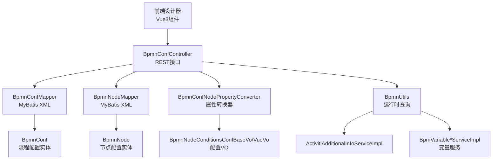
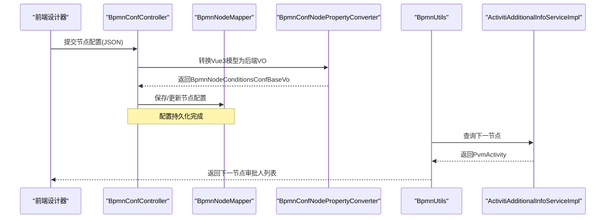
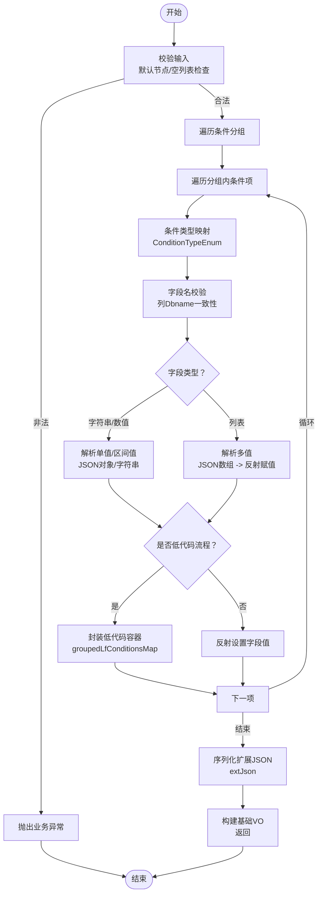
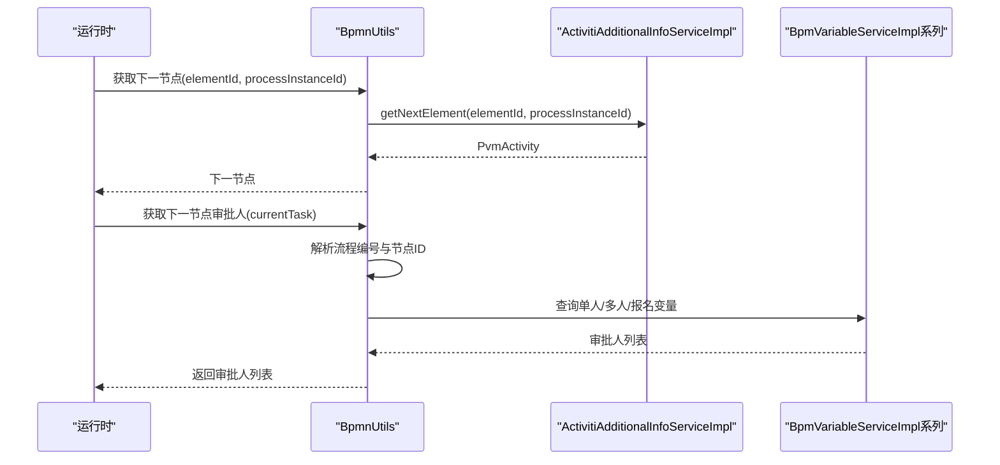
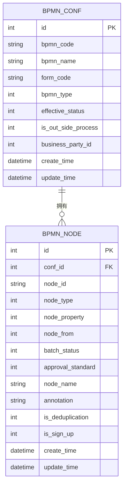
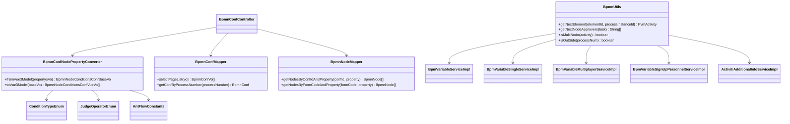

# BPMN配置系统

<cite>
**本文档引用的文件**
- [BpmnConfNodePropertyConverter.java](file://antflow-engine/src/main/java/org/openoa/engine/utils/BpmnConfNodePropertyConverter.java)
- [BpmnUtils.java](file://antflow-engine/src/main/java/org/openoa/engine/utils/BpmnUtils.java)
- [JsonUtils.java](file://antflow-engine/src/main/java/org/openoa/engine/utils/JsonUtils.java)
- [BpmnConfMapper.xml](file://antflow-engine/src/main/resources/mapper/BpmnConfMapper.xml)
- [BpmnNodeMapper.xml](file://antflow-engine/src/main/resources/mapper/BpmnNodeMapper.xml)
- [BpmnConfController.java](file://antflow-engine/src/main/java/org/openoa/engine/bpmnconf/controller/BpmnConfController.java)
- [BpmnNodeConditionsConfBaseVo.java](file://antflow-base/src/main/java/org/openoa/base/vo/BpmnNodeConditionsConfBaseVo.java)
- [BpmnNodeConditionsConfVueVo.java](file://antflow-base/src/main/java/org/openoa/base/vo/BpmnNodeConditionsConfVueVo.java)
- [ConditionTypeEnum.java](file://antflow-base/src/main/java/org/openoa/base/constant/enums/ConditionTypeEnum.java)
- [ConditionRelationShipEnum.java](file://antflow-base/src/main/java/org/openoa/base/constant/enums/ConditionRelationShipEnum.java)
- [JudgeOperatorEnum.java](file://antflow-base/src/main/java/org/openoa/base/constant/enums/JudgeOperatorEnum.java)
- [AntFlowConstants.java](file://antflow-engine/src/main/java/org/openoa/engine/bpmnconf/constant/AntFlowConstants.java)
- [BpmnConf.java](file://antflow-base/src/main/java/org/openoa/base/entity/BpmnConf.java)
- [BpmnNode.java](file://antflow-base/src/main/java/org/openoa/base/entity/BpmnNode.java)
- [BpmVariable.java](file://antflow-base/src/main/java/org/openoa/base/entity/BpmVariable.java)
- [BpmVariableSingle.java](file://antflow-base/src/main/java/org/openoa/base/entity/BpmVariableSingle.java)
- [BpmVariableMultiplayer.java](file://antflow-base/src/main/java/org/openoa/base/entity/BpmVariableMultiplayer.java)
- [BpmVariableMultiplayerPersonnel.java](file://antflow-base/src/main/java/org/openoa/base/entity/BpmVariableMultiplayerPersonnel.java)
- [BpmVariableSignUpPersonnel.java](file://antflow-base/src/main/java/org/openoa/base/entity/BpmVariableSignUpPersonnel.java)
- [ActivitiAdditionalInfoServiceImpl.java](file://antflow-engine/src/main/java/org/openoa/engine/bpmnconf/common/ActivitiAdditionalInfoServiceImpl.java)
- [BpmVariableServiceImpl.java](file://antflow-engine/src/main/java/org/openoa/engine/bpmnconf/service/impl/BpmVariableServiceImpl.java)
- [BpmVariableSingleServiceImpl.java](file://antflow-engine/src/main/java/org/openoa/engine/bpmnconf/service/impl/BpmVariableSingleServiceImpl.java)
- [BpmVariableMultiplayerServiceImpl.java](file://antflow-engine/src/main/java/org/openoa/engine/bpmnconf/service/impl/BpmVariableMultiplayerServiceImpl.java)
- [BpmVariableSignUpPersonnelServiceImpl.java](file://antflow-engine/src/main/java/org/openoa/engine/bpmnconf/service/impl/BpmVariableSignUpPersonnelServiceImpl.java)
- [BpmBusinessProcessServiceImpl.java](file://antflow-engine/src/main/java/org/openoa/engine/bpmnconf/service/biz/BpmBusinessProcessServiceImpl.java)
</cite>

## 目录
1. [简介](#简介)
2. [项目结构](#项目结构)
3. [核心组件](#核心组件)
4. [架构总览](#架构总览)
5. [详细组件分析](#详细组件分析)
6. [依赖关系分析](#依赖关系分析)
7. [性能考虑](#性能考虑)
8. [故障排除指南](#故障排除指南)
9. [结论](#结论)
10. [附录](#附录)

## 简介
本文件面向开发者与架构师，系统性阐述该BPMN配置系统的实现机制与最佳实践。内容涵盖流程定义管理、节点配置存储结构、路由条件配置方法、节点属性转换器工作原理、配置数据序列化与反序列化、配置与运行时数据映射关系、配置变更传播机制、配置验证规则、导入导出与版本管理策略，以及配置示例与实践建议。

## 项目结构
系统采用分层架构：前端通过设计器生成节点配置，后端通过MyBatis持久化至数据库，运行时通过Activiti引擎执行。核心模块包括：
- 配置实体与枚举：BpmnConf、BpmnNode、BpmVariable系列实体及条件相关枚举
- 转换器：BpmnConfNodePropertyConverter负责Vue3模型与后端VO之间的双向转换
- 工具类：BpmnUtils提供运行时查询下一节点、审批人等能力；JsonUtils提供JSON序列化/反序列化
- 数据访问：BpmnConfMapper、BpmnNodeMapper提供配置与节点的查询接口
- 控制器：BpmnConfController对外暴露配置管理REST接口

**图表来源**
- [BpmnConfController.java](file://antflow-engine/src/main/java/org/openoa/engine/bpmnconf/controller/BpmnConfController.java)
- [BpmnConfMapper.xml](file://antflow-engine/src/main/resources/mapper/BpmnConfMapper.xml)
- [BpmnNodeMapper.xml](file://antflow-engine/src/main/resources/mapper/BpmnNodeMapper.xml)
- [BpmnConfNodePropertyConverter.java](file://antflow-engine/src/main/java/org/openoa/engine/utils/BpmnConfNodePropertyConverter.java)
- [BpmnUtils.java](file://antflow-engine/src/main/java/org/openoa/engine/utils/BpmnUtils.java)

**章节来源**
- [BpmnConfMapper.xml:1-139](file://antflow-engine/src/main/resources/mapper/BpmnConfMapper.xml#L1-L139)
- [BpmnNodeMapper.xml:1-65](file://antflow-engine/src/main/resources/mapper/BpmnNodeMapper.xml#L1-L65)

## 核心组件
- 配置实体与枚举
  - 流程配置实体：BpmnConf（包含流程编码、名称、表单编码、生效状态、是否外部流程等）
  - 节点配置实体：BpmnNode（包含节点ID、节点类型、节点属性、路由条件、批注等）
  - 变量实体：BpmVariable、BpmVariableSingle、BpmVariableMultiplayer、BpmVariableSignUpPersonnel等，用于存储审批人、多人会签、报名节点等运行时参数
  - 条件枚举：ConditionTypeEnum（条件类型映射）、ConditionRelationShipEnum（组内关系）、JudgeOperatorEnum（比较运算符）、AntFlowConstants（常量）

- 属性转换器：BpmnConfNodePropertyConverter
  - 将前端Vue3模型（BpmnNodePropertysVo）转换为后端基础VO（BpmnNodeConditionsConfBaseVo），并支持低代码流程条件容器的特殊处理
  - 反向转换：将后端基础VO还原为前端展示VO（BpmnNodeConditionsConfVueVo），用于回显与编辑

- 运行时工具：BpmnUtils
  - 查询下一节点、下一节点审批人
  - 判断多节点（会签）场景
  - 判断外部流程标识
  - 读取环境变量

- JSON工具：JsonUtils
  - 提供对象转JSON字符串、原始JSON解析为Map的能力

**章节来源**
- [BpmnConf.java](file://antflow-base/src/main/java/org/openoa/base/entity/BpmnConf.java)
- [BpmnNode.java](file://antflow-base/src/main/java/org/openoa/base/entity/BpmnNode.java)
- [BpmVariable.java](file://antflow-base/src/main/java/org/openoa/base/entity/BpmVariable.java)
- [BpmVariableSingle.java](file://antflow-base/src/main/java/org/openoa/base/entity/BpmVariableSingle.java)
- [BpmVariableMultiplayer.java](file://antflow-base/src/main/java/org/openoa/base/entity/BpmVariableMultiplayer.java)
- [BpmVariableMultiplayerPersonnel.java](file://antflow-base/src/main/java/org/openoa/base/entity/BpmVariableMultiplayerPersonnel.java)
- [BpmVariableSignUpPersonnel.java](file://antflow-base/src/main/java/org/openoa/base/entity/BpmVariableSignUpPersonnel.java)
- [ConditionTypeEnum.java](file://antflow-base/src/main/java/org/openoa/base/constant/enums/ConditionTypeEnum.java)
- [ConditionRelationShipEnum.java](file://antflow-base/src/main/java/org/openoa/base/constant/enums/ConditionRelationShipEnum.java)
- [JudgeOperatorEnum.java](file://antflow-base/src/main/java/org/openoa/base/constant/enums/JudgeOperatorEnum.java)
- [AntFlowConstants.java](file://antflow-engine/src/main/java/org/openoa/engine/bpmnconf/constant/AntFlowConstants.java)
- [BpmnConfNodePropertyConverter.java:28-181](file://antflow-engine/src/main/java/org/openoa/engine/utils/BpmnConfNodePropertyConverter.java#L28-L181)
- [BpmnConfNodePropertyConverter.java:183-271](file://antflow-engine/src/main/java/org/openoa/engine/utils/BpmnConfNodePropertyConverter.java#L183-L271)
- [BpmnUtils.java:39-234](file://antflow-engine/src/main/java/org/openoa/engine/utils/BpmnUtils.java#L39-L234)
- [JsonUtils.java:21-54](file://antflow-engine/src/main/java/org/openoa/engine/utils/JsonUtils.java#L21-L54)

## 架构总览
系统围绕“配置持久化—转换器—运行时查询”形成闭环：
- 设计器生成的节点属性经转换器映射到后端VO，保存在BpmnNode中
- 运行时通过BpmnUtils结合ActivitiAdditionalInfoServiceImpl与各变量服务查询下一节点与审批人
- MyBatis Mapper负责配置与节点的CRUD与复杂查询

**图表来源**
- [BpmnConfController.java](file://antflow-engine/src/main/java/org/openoa/engine/bpmnconf/controller/BpmnConfController.java)
- [BpmnNodeMapper.xml:55-63](file://antflow-engine/src/main/resources/mapper/BpmnNodeMapper.xml#L55-L63)
- [BpmnConfNodePropertyConverter.java:28-181](file://antflow-engine/src/main/java/org/openoa/engine/utils/BpmnConfNodePropertyConverter.java#L28-L181)
- [BpmnUtils.java:79-100](file://antflow-engine/src/main/java/org/openoa/engine/utils/BpmnUtils.java#L79-L100)

## 详细组件分析

### 组件A：节点属性转换器（BpmnConfNodePropertyConverter）
职责与流程
- 输入：前端Vue3节点属性模型（包含条件分组、列ID、字段类型、运算符、取值等）
- 输出：后端基础VO（含条件类型数组、分组条件类型、扩展JSON、低代码流程容器等）
- 关键逻辑：
  - 校验输入合法性（默认节点与空节点列表）
  - 条件类型映射与字段名校验
  - 列表型字段的多值解析与反射赋值
  - 字符串/数值型字段的单值/区间值处理
  - 低代码流程条件容器的特殊封装与回显
  - 扩展JSON的序列化与反序列化

**图表来源**
- [BpmnConfNodePropertyConverter.java:28-181](file://antflow-engine/src/main/java/org/openoa/engine/utils/BpmnConfNodePropertyConverter.java#L28-L181)
- [BpmnConfNodePropertyConverter.java:183-271](file://antflow-engine/src/main/java/org/openoa/engine/utils/BpmnConfNodePropertyConverter.java#L183-L271)

**章节来源**
- [BpmnConfNodePropertyConverter.java:28-181](file://antflow-engine/src/main/java/org/openoa/engine/utils/BpmnConfNodePropertyConverter.java#L28-L181)
- [BpmnConfNodePropertyConverter.java:183-271](file://antflow-engine/src/main/java/org/openoa/engine/utils/BpmnConfNodePropertyConverter.java#L183-L271)

### 组件B：运行时节点查询（BpmnUtils）
职责与流程
- 查询下一节点：基于当前节点ID与流程实例ID，调用ActivitiAdditionalInfoServiceImpl获取PvmActivity
- 计算下一节点审批人：根据流程编号与节点ID，优先检查单人、多人、报名节点三种变量配置，返回审批人列表
- 多节点判断：判断会签节点场景
- 外部流程判断：根据业务流程记录判断是否外部流程
- 环境变量读取：通过Spring Environment获取配置

**图表来源**
- [BpmnUtils.java:79-180](file://antflow-engine/src/main/java/org/openoa/engine/utils/BpmnUtils.java#L79-L180)
- [ActivitiAdditionalInfoServiceImpl.java](file://antflow-engine/src/main/java/org/openoa/engine/bpmnconf/common/ActivitiAdditionalInfoServiceImpl.java)
- [BpmVariableServiceImpl.java](file://antflow-engine/src/main/java/org/openoa/engine/bpmnconf/service/impl/BpmVariableServiceImpl.java)
- [BpmVariableSingleServiceImpl.java](file://antflow-engine/src/main/java/org/openoa/engine/bpmnconf/service/impl/BpmVariableSingleServiceImpl.java)
- [BpmVariableMultiplayerServiceImpl.java](file://antflow-engine/src/main/java/org/openoa/engine/bpmnconf/service/impl/BpmVariableMultiplayerServiceImpl.java)
- [BpmVariableSignUpPersonnelServiceImpl.java](file://antflow-engine/src/main/java/org/openoa/engine/bpmnconf/service/impl/BpmVariableSignUpPersonnelServiceImpl.java)

**章节来源**
- [BpmnUtils.java:79-234](file://antflow-engine/src/main/java/org/openoa/engine/utils/BpmnUtils.java#L79-L234)

### 组件C：配置存储结构（BpmnConf、BpmnNode）
- BpmnConf：流程配置主表，包含流程编码、名称、表单编码、生效状态、去重策略、是否外部流程、业务方ID等
- BpmnNode：节点配置子表，包含节点ID、节点类型、节点属性（如是否去重、是否报名）、节点属性JSON（含路由条件）、批注、备注等
- 条件存储：通过BpmnNode.node_property存储条件JSON，或通过BpmVariable系列实体存储审批人/会签/报名等运行时参数

**图表来源**
- [BpmnConfMapper.xml:7-25](file://antflow-engine/src/main/resources/mapper/BpmnConfMapper.xml#L7-L25)
- [BpmnNodeMapper.xml:6-25](file://antflow-engine/src/main/resources/mapper/BpmnNodeMapper.xml#L6-L25)

**章节来源**
- [BpmnConfMapper.xml:1-139](file://antflow-engine/src/main/resources/mapper/BpmnConfMapper.xml#L1-L139)
- [BpmnNodeMapper.xml:1-65](file://antflow-engine/src/main/resources/mapper/BpmnNodeMapper.xml#L1-L65)

### 组件D：路由条件配置方法
- 条件类型映射：通过ConditionTypeEnum将前端列ID映射到后端字段名与类型
- 分组与关系：通过ConditionRelationShipEnum设置组内关系（AND/OR）
- 运算符：通过JudgeOperatorEnum设置比较运算符（等于、大于、区间等）
- 低代码流程：特殊容器字段用于存放列表型条件值
- 扩展JSON：通过extJson保留原始Vue3模型以便回显与二次编辑

**章节来源**
- [BpmnConfNodePropertyConverter.java:28-181](file://antflow-engine/src/main/java/org/openoa/engine/utils/BpmnConfNodePropertyConverter.java#L28-L181)
- [ConditionTypeEnum.java](file://antflow-base/src/main/java/org/openoa/base/constant/enums/ConditionTypeEnum.java)
- [ConditionRelationShipEnum.java](file://antflow-base/src/main/java/org/openoa/base/constant/enums/ConditionRelationShipEnum.java)
- [JudgeOperatorEnum.java](file://antflow-base/src/main/java/org/openoa/base/constant/enums/JudgeOperatorEnum.java)

### 组件E：配置验证规则
- 输入校验：默认节点与空节点列表必须存在；列ID必须有效；列Dbname需与字段名一致（低代码流程除外）
- 条件类型校验：非法条件类型直接抛出业务异常
- 运算符校验：未定义的运算符类型抛出异常
- 低代码流程特殊处理：集合选择与普通选择区分处理

**章节来源**
- [BpmnConfNodePropertyConverter.java:31-84](file://antflow-engine/src/main/java/org/openoa/engine/utils/BpmnConfNodePropertyConverter.java#L31-L84)
- [BpmnConfNodePropertyConverter.java:126-133](file://antflow-engine/src/main/java/org/openoa/engine/utils/BpmnConfNodePropertyConverter.java#L126-L133)

### 组件F：配置序列化与反序列化
- 序列化：使用FastJSON2将条件分组与扩展信息序列化为JSON字符串
- 反序列化：使用Jackson将JSON字符串解析为Map或对象
- 转换器内部：对列表型字段进行JSON数组解析，对字符串/数值型字段进行JSON对象解析

**章节来源**
- [BpmnConfNodePropertyConverter.java:90-106](file://antflow-engine/src/main/java/org/openoa/engine/utils/BpmnConfNodePropertyConverter.java#L90-L106)
- [BpmnConfNodePropertyConverter.java:152-158](file://antflow-engine/src/main/java/org/openoa/engine/utils/BpmnConfNodePropertyConverter.java#L152-L158)
- [JsonUtils.java:31-53](file://antflow-engine/src/main/java/org/openoa/engine/utils/JsonUtils.java#L31-L53)

### 组件G：配置与运行时数据映射
- 配置到运行时：BpmnNode.node_property保存条件JSON；BpmVariable系列实体保存审批人/会签/报名等
- 运行时查询：BpmnUtils根据流程编号与节点ID查询下一节点与审批人
- 映射关系：流程编号对应BpmnConf.bpmn_code；节点ID对应BpmnNode.node_id；审批人对应BpmVariable*实体

**章节来源**
- [BpmnUtils.java:112-179](file://antflow-engine/src/main/java/org/openoa/engine/utils/BpmnUtils.java#L112-L179)
- [BpmnNodeMapper.xml:55-63](file://antflow-engine/src/main/resources/mapper/BpmnNodeMapper.xml#L55-L63)

### 组件H：配置变更传播机制
- 变更入口：BpmnConfController接收配置变更请求
- 变更落地：通过BpmnConfMapper与BpmnNodeMapper持久化到数据库
- 运行时生效：Activiti引擎加载最新配置，BpmnUtils按最新配置计算下一节点与审批人
- 版本管理：通过BpmnConf.effective_status与BpmnConf.bpmn_code实现版本控制与生效状态管理

**章节来源**
- [BpmnConfController.java](file://antflow-engine/src/main/java/org/openoa/engine/bpmnconf/controller/BpmnConfController.java)
- [BpmnConfMapper.xml:132-137](file://antflow-engine/src/main/resources/mapper/BpmnConfMapper.xml#L132-L137)

### 组件I：配置导入导出与版本管理
- 导入：通过BpmnConfController接收配置JSON，转换器解析后持久化
- 导出：通过BpmnConfController返回配置VO，转换器将后端VO转换为前端展示VO
- 版本管理：BpmnConf.bpmn_code作为版本号，BpmnConf.effective_status控制生效状态；通过BpmnConfMapper的查询接口支持按版本检索

**章节来源**
- [BpmnConfNodePropertyConverter.java:183-271](file://antflow-engine/src/main/java/org/openoa/engine/utils/BpmnConfNodePropertyConverter.java#L183-L271)
- [BpmnConfMapper.xml:132-137](file://antflow-engine/src/main/resources/mapper/BpmnConfMapper.xml#L132-L137)

## 依赖关系分析
- 转换器依赖：条件枚举、常量、VO模型
- 运行时工具依赖：ActivitiAdditionalInfoServiceImpl与各BpmVariable*ServiceImpl
- Mapper依赖：MyBatis XML定义SQL与结果映射
- 控制器依赖：转换器与Mapper

**图表来源**
- [BpmnConfNodePropertyConverter.java:28-271](file://antflow-engine/src/main/java/org/openoa/engine/utils/BpmnConfNodePropertyConverter.java#L28-L271)
- [BpmnUtils.java:40-70](file://antflow-engine/src/main/java/org/openoa/engine/utils/BpmnUtils.java#L40-L70)
- [BpmnConfMapper.xml:1-139](file://antflow-engine/src/main/resources/mapper/BpmnConfMapper.xml#L1-L139)
- [BpmnNodeMapper.xml:1-65](file://antflow-engine/src/main/resources/mapper/BpmnNodeMapper.xml#L1-L65)

**章节来源**
- [BpmnConfNodePropertyConverter.java:28-271](file://antflow-engine/src/main/java/org/openoa/engine/utils/BpmnConfNodePropertyConverter.java#L28-L271)
- [BpmnUtils.java:40-70](file://antflow-engine/src/main/java/org/openoa/engine/utils/BpmnUtils.java#L40-L70)
- [BpmnConfMapper.xml:1-139](file://antflow-engine/src/main/resources/mapper/BpmnConfMapper.xml#L1-L139)
- [BpmnNodeMapper.xml:1-65](file://antflow-engine/src/main/resources/mapper/BpmnNodeMapper.xml#L1-L65)

## 性能考虑
- 转换器：避免重复反射与JSON解析，尽量批量处理；列表型字段使用流式处理减少内存占用
- 运行时查询：缓存常用流程配置与节点属性；对审批人查询进行去重与分页
- Mapper：合理使用索引（如bpmn_code、form_code、node_id等）；分页查询与条件过滤
- JSON工具：避免频繁创建ObjectMapper实例，复用静态实例

## 故障排除指南
- 转换异常：检查列ID是否在ConditionTypeEnum中定义；确认列Dbname与字段名一致性
- 运行时无下一节点：确认流程编号与节点ID正确；检查BpmnNode.effective_status与BpmnConf.effective_status
- 审批人为空：检查BpmVariable*实体是否正确配置；确认低代码流程容器字段是否正确封装
- JSON解析失败：检查extJson格式；确保字段类型与JSON结构匹配

**章节来源**
- [BpmnConfNodePropertyConverter.java:73-84](file://antflow-engine/src/main/java/org/openoa/engine/utils/BpmnConfNodePropertyConverter.java#L73-L84)
- [BpmnUtils.java:112-179](file://antflow-engine/src/main/java/org/openoa/engine/utils/BpmnUtils.java#L112-L179)
- [JsonUtils.java:47-52](file://antflow-engine/src/main/java/org/openoa/engine/utils/JsonUtils.java#L47-L52)

## 结论
该BPMN配置系统通过清晰的分层设计与严格的转换器机制，实现了从设计器到运行时的完整闭环。配置实体与枚举保证了类型安全，转换器提供了灵活的序列化/反序列化能力，运行时工具保障了下一节点与审批人的准确计算。配合完善的验证规则与版本管理策略，系统具备良好的可维护性与扩展性。

## 附录
- 配置示例与最佳实践
  - 使用条件枚举定义列ID，避免硬编码
  - 对列表型条件使用固定下拉框值映射，提升可维护性
  - 低代码流程容器字段需保持与前端约定一致
  - 在运行时查询前先缓存流程配置，减少数据库压力
  - 导入导出时保留extJson以保证编辑体验