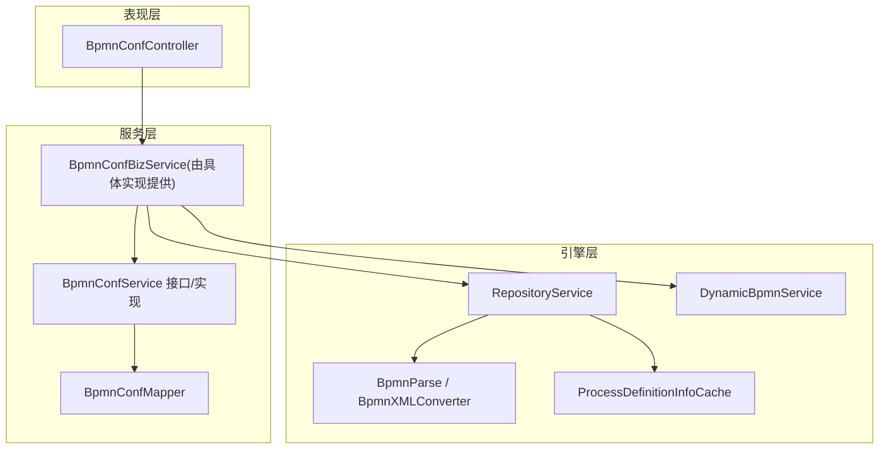
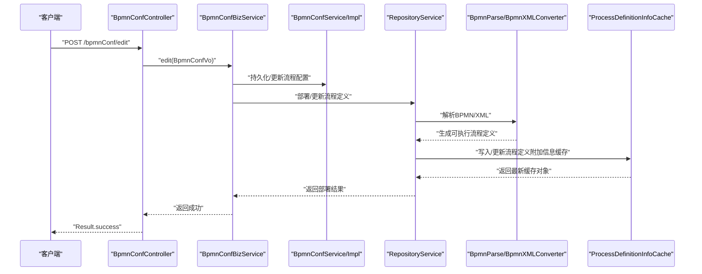
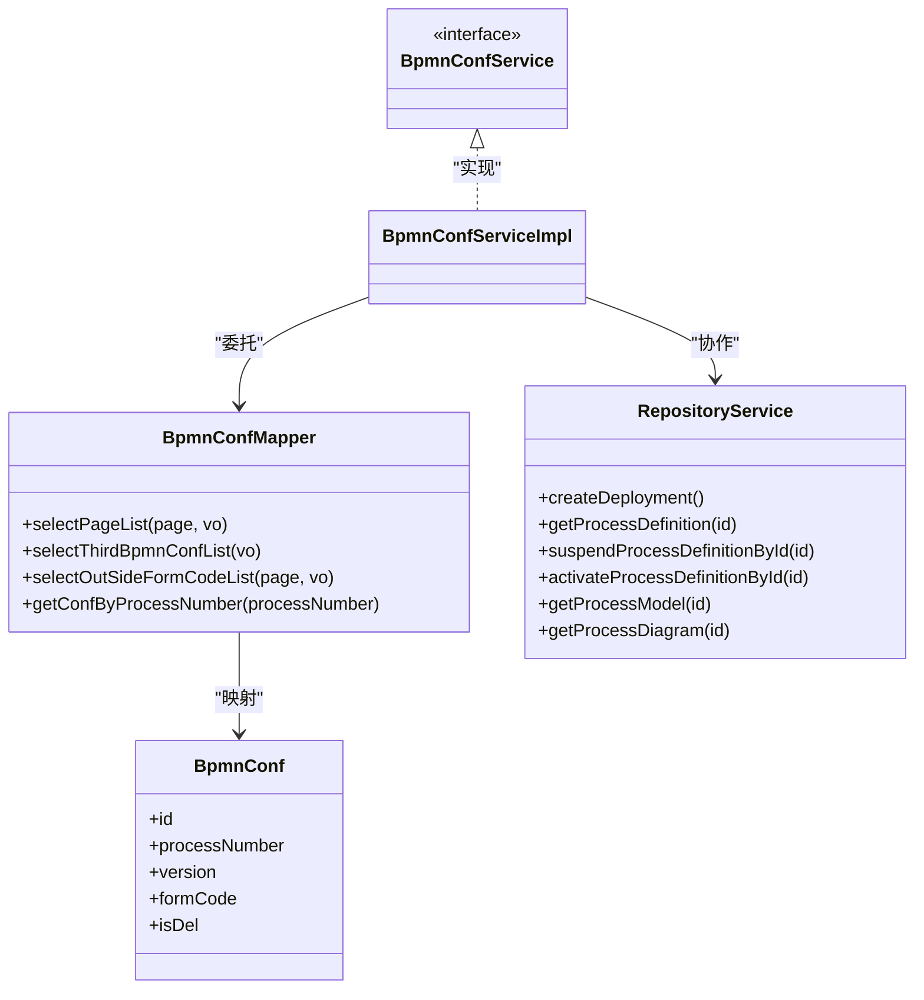
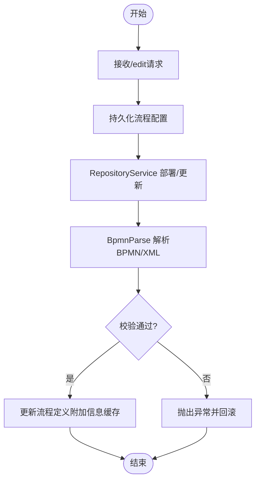
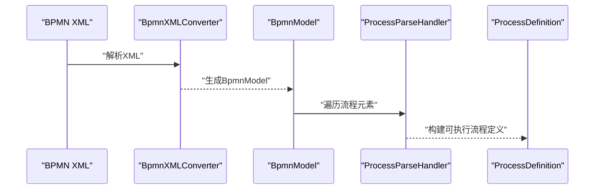
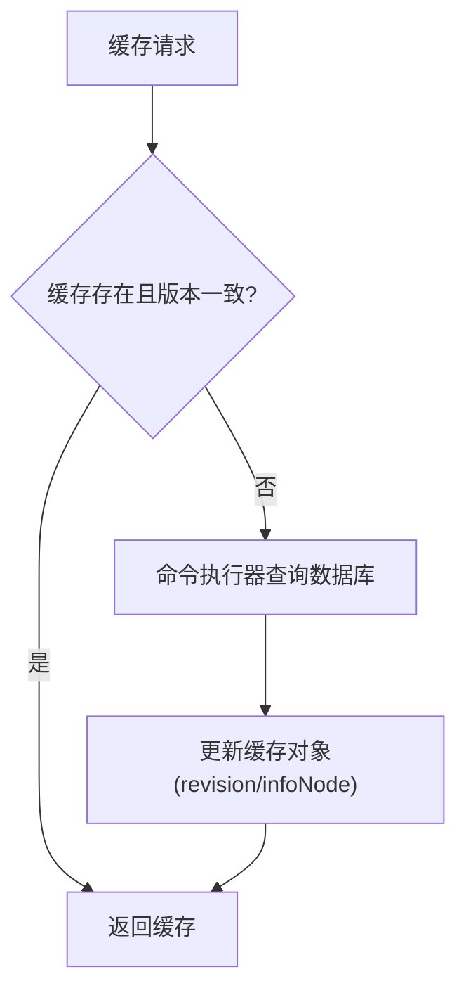
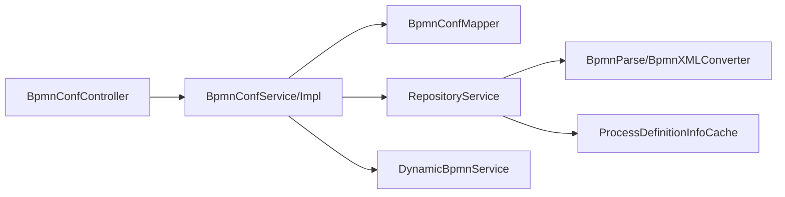

# 流程定义管理

<cite>
**本文引用的文件**
- [BpmnConfController.java](file://antflow-engine/src/main/java/org/openoa/engine/bpmnconf/controller/BpmnConfController.java)
- [BpmnConfService.java](file://antflow-engine/src/main/java/org/openoa/engine/bpmnconf/service/interf/repository/BpmnConfService.java)
- [BpmnConfServiceImpl.java](file://antflow-engine/src/main/java/org/openoa/engine/bpmnconf/service/impl/BpmnConfServiceImpl.java)
- [BpmnConfMapper.java](file://antflow-engine/src/main/java/org/openoa/engine/bpmnconf/mapper/BpmnConfMapper.java)
- [RepositoryService.java](file://antflow-base/src/main/java/org/activiti/engine/RepositoryService.java)
- [RepositoryServiceImpl.java](file://antflow-base/src/main/java/org/activiti/engine/impl/RepositoryServiceImpl.java)
- [DynamicBpmnService.java](file://antflow-base/src/main/java/org/activiti/engine/DynamicBpmnService.java)
- [DynamicBpmnServiceImpl.java](file://antflow-base/src/main/java/org/activiti/engine/impl/DynamicBpmnServiceImpl.java)
- [ProcessDefinition.java](file://antflow-base/src/main/java/org/activiti/engine/repository/ProcessDefinition.java)
- [Deployment.java](file://antflow-base/src/main/java/org/activiti/engine/repository/Deployment.java)
- [BpmnParse.java](file://antflow-base/src/main/java/org/activiti/engine/impl/bpmn/parser/BpmnParse.java)
- [ProcessParseHandler.java](file://antflow-base/src/main/java/org/activiti/engine/impl/bpmn/parser/handler/ProcessParseHandler.java)
- [BpmnXMLConverter.java](file://antflow-base/src/main/java/org/activiti/bpmn/converter/BpmnXMLConverter.java)
- [BpmnModelValidator.java](file://antflow-base/src/main/java/org/activiti/validation/validator/impl/BpmnModelValidator.java)
- [ProcessDefinitionInfoCache.java](file://antflow-base/src/main/java/org/activiti/engine/impl/persistence/deploy/ProcessDefinitionInfoCache.java)
- [BpmnDeployer.java](file://antflow-base/src/main/java/org/activiti/engine/impl/bpmn/deployer/BpmnDeployer.java)
- [TaskMgmtVO.java](file://antflow-base/src/main/java/org/openoa/base/vo/TaskMgmtVO.java)
- [BpmBusinessProcess.java](file://antflow-base/src/main/java/org/openoa/base/entity/BpmBusinessProcess.java)
- [开发者指南.md](file://doc/系统介绍篇/20.开发者指南.md)
</cite>

## 目录
1. [简介](#简介)
2. [项目结构](#项目结构)
3. [核心组件](#核心组件)
4. [架构总览](#架构总览)
5. [详细组件分析](#详细组件分析)
6. [依赖分析](#依赖分析)
7. [性能考量](#性能考量)
8. [故障排查指南](#故障排查指南)
9. [结论](#结论)
10. [附录](#附录)

## 简介
本文件聚焦于“流程定义管理”模块，围绕流程定义的存储结构、版本控制、状态管理、创建/修改/删除流程定义的操作流程、流程验证与冲突检测、与BPMN模型的映射关系、缓存与热更新策略、导入导出与批量操作、迁移方案以及API接口说明与使用示例进行系统化技术说明。目标是帮助开发者与运维人员全面掌握该模块的设计与实现细节。

## 项目结构
流程定义管理涉及三层：
- 表现层（控制器）：负责接收请求、编排业务、返回结果。
- 服务层（业务与持久化）：封装流程配置的CRUD、分页查询、状态变更等。
- 引擎层（Activiti）：负责BPMN解析、部署、校验、缓存与运行时交互。

图示来源
- [BpmnConfController.java:31-190](file://antflow-engine/src/main/java/org/openoa/engine/bpmnconf/controller/BpmnConfController.java#L31-L190)
- [BpmnConfService.java:8-9](file://antflow-engine/src/main/java/org/openoa/engine/bpmnconf/service/interf/repository/BpmnConfService.java#L8-L9)
- [BpmnConfServiceImpl.java:17-20](file://antflow-engine/src/main/java/org/openoa/engine/bpmnconf/service/impl/BpmnConfServiceImpl.java#L17-L20)
- [BpmnConfMapper.java:18-30](file://antflow-engine/src/main/java/org/openoa/engine/bpmnconf/mapper/BpmnConfMapper.java#L18-L30)
- [RepositoryService.java:42-437](file://antflow-base/src/main/java/org/activiti/engine/RepositoryService.java#L42-L437)
- [DynamicBpmnService.java:22-37](file://antflow-base/src/main/java/org/activiti/engine/DynamicBpmnService.java#L22-L37)
- [BpmnParse.java:197-235](file://antflow-base/src/main/java/org/activiti/engine/impl/bpmn/parser/BpmnParse.java#L197-L235)
- [BpmnXMLConverter.java:422-449](file://antflow-base/src/main/java/org/activiti/bpmn/converter/BpmnXMLConverter.java#L422-L449)
- [ProcessDefinitionInfoCache.java:37-121](file://antflow-base/src/main/java/org/activiti/engine/impl/persistence/deploy/ProcessDefinitionInfoCache.java#L37-L121)

章节来源
- [BpmnConfController.java:31-190](file://antflow-engine/src/main/java/org/openoa/engine/bpmnconf/controller/BpmnConfController.java#L31-L190)
- [RepositoryService.java:42-437](file://antflow-base/src/main/java/org/activiti/engine/RepositoryService.java#L42-L437)

## 核心组件
- 控制器层：提供流程设计编辑、列表分页、预览、节点操作人加载、审批进度查询、流程列表等REST接口。
- 服务层：BpmnConfService接口及其实现，配合BpmnConfMapper完成流程配置的增删改查与分页查询。
- 引擎层：RepositoryService负责部署、查询、挂起/激活流程定义；DynamicBpmnService支持运行时动态修改服务任务等；BpmnParse与BpmnXMLConverter负责BPMN解析与转换；ProcessDefinitionInfoCache提供流程定义附加信息的缓存与热更新。

章节来源
- [BpmnConfController.java:65-190](file://antflow-engine/src/main/java/org/openoa/engine/bpmnconf/controller/BpmnConfController.java#L65-L190)
- [BpmnConfService.java:8-9](file://antflow-engine/src/main/java/org/openoa/engine/bpmnconf/service/interf/repository/BpmnConfService.java#L8-L9)
- [BpmnConfServiceImpl.java:17-20](file://antflow-engine/src/main/java/org/openoa/engine/bpmnconf/service/impl/BpmnConfServiceImpl.java#L17-L20)
- [BpmnConfMapper.java:18-30](file://antflow-engine/src/main/java/org/openoa/engine/bpmnconf/mapper/BpmnConfMapper.java#L18-L30)
- [RepositoryService.java:42-437](file://antflow-base/src/main/java/org/activiti/engine/RepositoryService.java#L42-L437)
- [DynamicBpmnService.java:22-37](file://antflow-base/src/main/java/org/activiti/engine/DynamicBpmnService.java#L22-L37)
- [BpmnParse.java:197-235](file://antflow-base/src/main/java/org/activiti/engine/impl/bpmn/parser/BpmnParse.java#L197-L235)
- [BpmnXMLConverter.java:422-449](file://antflow-base/src/main/java/org/activiti/bpmn/converter/BpmnXMLConverter.java#L422-L449)
- [ProcessDefinitionInfoCache.java:37-121](file://antflow-base/src/main/java/org/activiti/engine/impl/persistence/deploy/ProcessDefinitionInfoCache.java#L37-L121)

## 架构总览
下图展示从控制器到引擎的关键调用链路与职责分工：

图示来源
- [BpmnConfController.java:65-69](file://antflow-engine/src/main/java/org/openoa/engine/bpmnconf/controller/BpmnConfController.java#L65-L69)
- [RepositoryService.java:44-91](file://antflow-base/src/main/java/org/activiti/engine/RepositoryService.java#L44-L91)
- [BpmnParse.java:197-235](file://antflow-base/src/main/java/org/activiti/engine/impl/bpmn/parser/BpmnParse.java#L197-L235)
- [BpmnXMLConverter.java:422-449](file://antflow-base/src/main/java/org/activiti/bpmn/converter/BpmnXMLConverter.java#L422-L449)
- [ProcessDefinitionInfoCache.java:70-102](file://antflow-base/src/main/java/org/activiti/engine/impl/persistence/deploy/ProcessDefinitionInfoCache.java#L70-L102)

## 详细组件分析

### 组件A：流程定义存储与版本控制
- 存储结构
  - 流程配置实体与映射：BpmnConf实体与BpmnConfMapper提供流程配置的增删改查与分页查询能力。
  - 流程定义与部署：RepositoryService提供创建部署、查询流程定义、挂起/激活流程定义、获取流程模型与图等能力。
- 版本控制机制
  - 流程定义版本由引擎侧维护（如processDefinition.key/id），并与业务侧版本号字段协同管理。
  - 业务侧版本号字段用于区分同一流程的不同版本，便于迁移与回滚。
- 状态管理
  - 通过RepositoryService的挂起/激活接口对流程定义状态进行管理，影响新实例的启动能力。

图示来源
- [BpmnConfMapper.java:18-30](file://antflow-engine/src/main/java/org/openoa/engine/bpmnconf/mapper/BpmnConfMapper.java#L18-L30)
- [BpmnConfService.java:8-9](file://antflow-engine/src/main/java/org/openoa/engine/bpmnconf/service/interf/repository/BpmnConfService.java#L8-L9)
- [BpmnConfServiceImpl.java:17-20](file://antflow-engine/src/main/java/org/openoa/engine/bpmnconf/service/impl/BpmnConfServiceImpl.java#L17-L20)
- [RepositoryService.java:44-298](file://antflow-base/src/main/java/org/activiti/engine/RepositoryService.java#L44-L298)

章节来源
- [BpmnConfMapper.java:18-30](file://antflow-engine/src/main/java/org/openoa/engine/bpmnconf/mapper/BpmnConfMapper.java#L18-L30)
- [RepositoryService.java:127-298](file://antflow-base/src/main/java/org/activiti/engine/RepositoryService.java#L127-L298)

### 组件B：流程定义创建/修改/删除流程
- 创建与修改
  - 控制器提供/edit接口，交由业务层处理流程设计发布/复制等操作。
  - 业务层结合RepositoryService进行部署或更新流程定义。
- 删除
  - RepositoryService提供删除部署与级联删除能力，确保运行时与历史数据一致性。
- 冲突检测
  - BPMN模型解析阶段通过ProcessValidator执行校验，发现错误即抛出异常；警告仅记录日志。
  - 业务层可在持久化前进行唯一性约束检查（如流程编号、表单编码等）。

图示来源
- [BpmnConfController.java:65-69](file://antflow-engine/src/main/java/org/openoa/engine/bpmnconf/controller/BpmnConfController.java#L65-L69)
- [RepositoryService.java:44-91](file://antflow-base/src/main/java/org/activiti/engine/RepositoryService.java#L44-L91)
- [BpmnParse.java:197-235](file://antflow-base/src/main/java/org/activiti/engine/impl/bpmn/parser/BpmnParse.java#L197-L235)
- [BpmnModelValidator.java:34-57](file://antflow-base/src/main/java/org/activiti/validation/validator/impl/BpmnModelValidator.java#L34-L57)

章节来源
- [BpmnConfController.java:65-69](file://antflow-engine/src/main/java/org/openoa/engine/bpmnconf/controller/BpmnConfController.java#L65-L69)
- [BpmnParse.java:197-235](file://antflow-base/src/main/java/org/activiti/engine/impl/bpmn/parser/BpmnParse.java#L197-L235)
- [BpmnModelValidator.java:34-57](file://antflow-base/src/main/java/org/activiti/validation/validator/impl/BpmnModelValidator.java#L34-L57)

### 组件C：流程验证规则与冲突检测
- 验证规则
  - 校验流程可执行性、长度限制、可选文档等。
- 冲突检测
  - 通过RepositoryService.validateProcess对BpmnModel进行验证，错误直接阻断部署。
  - 业务层面建议增加流程编号、表单编码唯一性检查，避免重复或歧义。

章节来源
- [BpmnModelValidator.java:34-57](file://antflow-base/src/main/java/org/activiti/validation/validator/impl/BpmnModelValidator.java#L34-L57)
- [RepositoryService.java:424-435](file://antflow-base/src/main/java/org/activiti/engine/RepositoryService.java#L424-L435)

### 组件D：流程定义与BPMN模型映射
- BPMN模型到流程定义
  - BpmnXMLConverter将XML转换为BpmnModel，再由ProcessParseHandler将Process映射为可执行的流程定义。
- 运行时模型
  - RepositoryService提供getBpmnModel以获取BpmnModel，便于业务侧读取与展示。

图示来源
- [BpmnXMLConverter.java:422-449](file://antflow-base/src/main/java/org/activiti/bpmn/converter/BpmnXMLConverter.java#L422-L449)
- [ProcessParseHandler.java:45-63](file://antflow-base/src/main/java/org/activiti/engine/impl/bpmn/parser/handler/ProcessParseHandler.java#L45-L63)
- [ProcessDefinition.java:19-35](file://antflow-base/src/main/java/org/activiti/engine/repository/ProcessDefinition.java#L19-L35)

章节来源
- [BpmnXMLConverter.java:422-449](file://antflow-base/src/main/java/org/activiti/bpmn/converter/BpmnXMLConverter.java#L422-L449)
- [ProcessParseHandler.java:45-63](file://antflow-base/src/main/java/org/activiti/engine/impl/bpmn/parser/handler/ProcessParseHandler.java#L45-L63)
- [ProcessDefinition.java:19-35](file://antflow-base/src/main/java/org/activiti/engine/repository/ProcessDefinition.java#L19-L35)

### 组件E：流程缓存策略与热更新
- 缓存策略
  - ProcessDefinitionInfoCache基于LRU实现，按processDefinitionId缓存流程定义附加信息。
- 热更新机制
  - 当缓存对象revision与数据库实体不一致时，命令执行器会刷新缓存内容，保证读取到最新数据。
- 部署时的缓存处理
  - BpmnDeployer在部署后读取并写入流程定义附加信息缓存对象，确保后续查询命中最新。

图示来源
- [ProcessDefinitionInfoCache.java:70-102](file://antflow-base/src/main/java/org/activiti/engine/impl/persistence/deploy/ProcessDefinitionInfoCache.java#L70-L102)
- [BpmnDeployer.java:274-300](file://antflow-base/src/main/java/org/activiti/engine/impl/bpmn/deployer/BpmnDeployer.java#L274-L300)

章节来源
- [ProcessDefinitionInfoCache.java:37-121](file://antflow-base/src/main/java/org/activiti/engine/impl/persistence/deploy/ProcessDefinitionInfoCache.java#L37-L121)
- [BpmnDeployer.java:274-300](file://antflow-base/src/main/java/org/activiti/engine/impl/bpmn/deployer/BpmnDeployer.java#L274-L300)

### 组件F：导入导出、批量操作与迁移
- 导入导出
  - RepositoryService提供获取流程模型与流程图的流式接口，可用于导出；部署接口用于导入。
- 批量操作
  - 控制器层提供分页查询与列表接口，便于前端批量选择与操作。
- 迁移方案
  - 基于RepositoryService的挂起/激活与分类设置，可实现灰度发布与版本切换；业务侧版本号字段用于标识迁移目标。

章节来源
- [RepositoryService.java:199-292](file://antflow-base/src/main/java/org/activiti/engine/RepositoryService.java#L199-L292)
- [BpmnConfController.java:77-82](file://antflow-engine/src/main/java/org/openoa/engine/bpmnconf/controller/BpmnConfController.java#L77-L82)

### 组件G：API接口说明与使用示例
- 接口概览
  - 流程设计发布/复制：POST /bpmnConf/edit
  - 列表分页：POST /bpmnConf/listPage
  - 预览：POST /bpmnConf/preview
  - 启动页/任务页节点预览：POST /bpmnConf/startPagePreviewNode
  - 加载节点当前实际操作人：POST /bpmnConf/loadNodeOperationUser
  - 审批进度：GET /bpmnConf/getBpmVerifyInfoVos
  - 流程列表：GET /bpmnConf/process/listPage/{type}
  - 流程启用：GET /bpmnConf/effectiveBpmn/{id}
  - 流程详情：GET /bpmnConf/detail/{id}

- 使用示例（路径）
  - 发布流程设计：[BpmnConfController.java:65-69](file://antflow-engine/src/main/java/org/openoa/engine/bpmnconf/controller/BpmnConfController.java#L65-L69)
  - 分页查询流程配置：[BpmnConfController.java:77-82](file://antflow-engine/src/main/java/org/openoa/engine/bpmnconf/controller/BpmnConfController.java#L77-L82)
  - 预览节点：[BpmnConfController.java:87-90](file://antflow-engine/src/main/java/org/openoa/engine/bpmnconf/controller/BpmnConfController.java#L87-L90)
  - 加载节点操作人：[BpmnConfController.java:111-114](file://antflow-engine/src/main/java/org/openoa/engine/bpmnconf/controller/BpmnConfController.java#L111-L114)
  - 审批进度查询：[BpmnConfController.java:122-125](file://antflow-engine/src/main/java/org/openoa/engine/bpmnconf/controller/BpmnConfController.java#L122-L125)
  - 流程列表：[BpmnConfController.java:183-189](file://antflow-engine/src/main/java/org/openoa/engine/bpmnconf/controller/BpmnConfController.java#L183-L189)
  - 启用流程：[BpmnConfController.java:158-162](file://antflow-engine/src/main/java/org/openoa/engine/bpmnconf/controller/BpmnConfController.java#L158-L162)
  - 流程详情：[BpmnConfController.java:170-173](file://antflow-engine/src/main/java/org/openoa/engine/bpmnconf/controller/BpmnConfController.java#L170-L173)

章节来源
- [BpmnConfController.java:65-190](file://antflow-engine/src/main/java/org/openoa/engine/bpmnconf/controller/BpmnConfController.java#L65-L190)
- [开发者指南.md:376-422](file://doc/系统介绍篇/20.开发者指南.md#L376-L422)

## 依赖分析
- 控制器依赖服务层，服务层依赖Mapper与RepositoryService。
- RepositoryService依赖Bpmn解析器与缓存组件。
- 动态BPMN服务提供运行时属性修改能力，与流程定义状态管理相辅相成。

图示来源
- [BpmnConfController.java:33-46](file://antflow-engine/src/main/java/org/openoa/engine/bpmnconf/controller/BpmnConfController.java#L33-L46)
- [BpmnConfService.java:8-9](file://antflow-engine/src/main/java/org/openoa/engine/bpmnconf/service/interf/repository/BpmnConfService.java#L8-L9)
- [RepositoryService.java:42-437](file://antflow-base/src/main/java/org/activiti/engine/RepositoryService.java#L42-L437)
- [DynamicBpmnService.java:22-37](file://antflow-base/src/main/java/org/activiti/engine/DynamicBpmnService.java#L22-L37)

章节来源
- [BpmnConfController.java:33-46](file://antflow-engine/src/main/java/org/openoa/engine/bpmnconf/controller/BpmnConfController.java#L33-L46)
- [RepositoryService.java:42-437](file://antflow-base/src/main/java/org/activiti/engine/RepositoryService.java#L42-L437)

## 性能考量
- 缓存命中：利用ProcessDefinitionInfoCache降低数据库访问频率，提升查询性能。
- 批量操作：对大数据集采用分页查询与批量处理，减少一次性传输与处理压力。
- 部署优化：在部署阶段尽量减少不必要的解析与校验，仅在必要时触发严格校验。
- 并发控制：在流程状态变更与部署过程中注意并发一致性，避免竞态条件。

## 故障排查指南
- 部署失败
  - 检查BPMN模型是否满足可执行要求与长度限制。
  - 查看解析与校验阶段的日志输出，定位具体错误。
- 缓存不一致
  - 确认缓存对象revision与数据库实体是否同步，必要时触发缓存刷新。
- 状态异常
  - 使用RepositoryService的挂起/激活接口恢复流程定义状态。
- 数据不一致
  - 使用RepositoryService的删除部署与级联删除能力清理残留数据。

章节来源
- [BpmnParse.java:197-235](file://antflow-base/src/main/java/org/activiti/engine/impl/bpmn/parser/BpmnParse.java#L197-L235)
- [ProcessDefinitionInfoCache.java:70-102](file://antflow-base/src/main/java/org/activiti/engine/impl/persistence/deploy/ProcessDefinitionInfoCache.java#L70-L102)
- [RepositoryService.java:47-67](file://antflow-base/src/main/java/org/activiti/engine/RepositoryService.java#L47-L67)

## 结论
流程定义管理模块通过清晰的分层设计与Activiti引擎能力，实现了从流程设计到部署、验证、缓存与运行时管理的完整闭环。结合版本控制与状态管理，能够支撑复杂的企业级工作流场景。建议在生产环境中强化校验与缓存策略，完善监控与告警，确保系统稳定性与性能。

## 附录
- 关键实体与视图
  - 流程业务实体：BpmBusinessProcess（含版本、状态、创建时间等字段）
  - 任务管理视图：TaskMgmtVO（含流程版本、路由地址、批量提交等字段）

章节来源
- [BpmBusinessProcess.java:49-110](file://antflow-base/src/main/java/org/openoa/base/entity/BpmBusinessProcess.java#L49-L110)
- [TaskMgmtVO.java:126-294](file://antflow-base/src/main/java/org/openoa/base/vo/TaskMgmtVO.java#L126-L294)