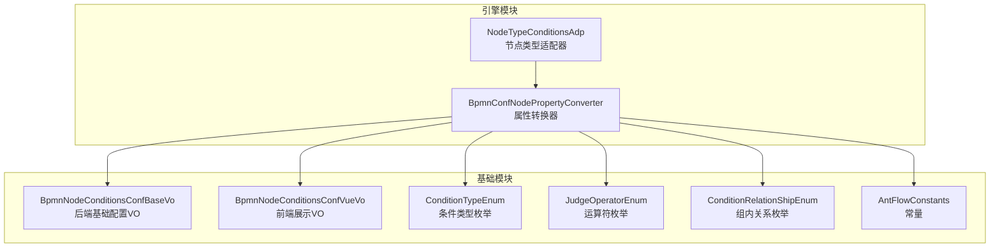
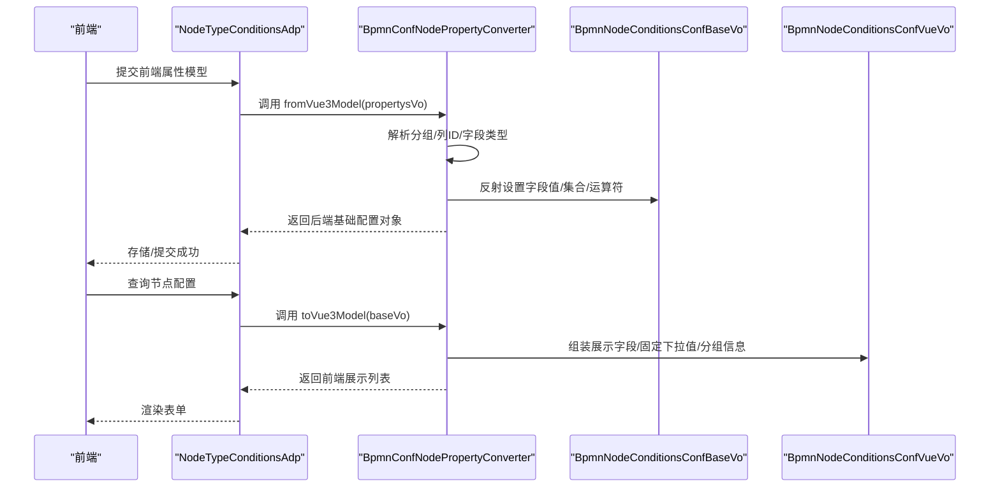
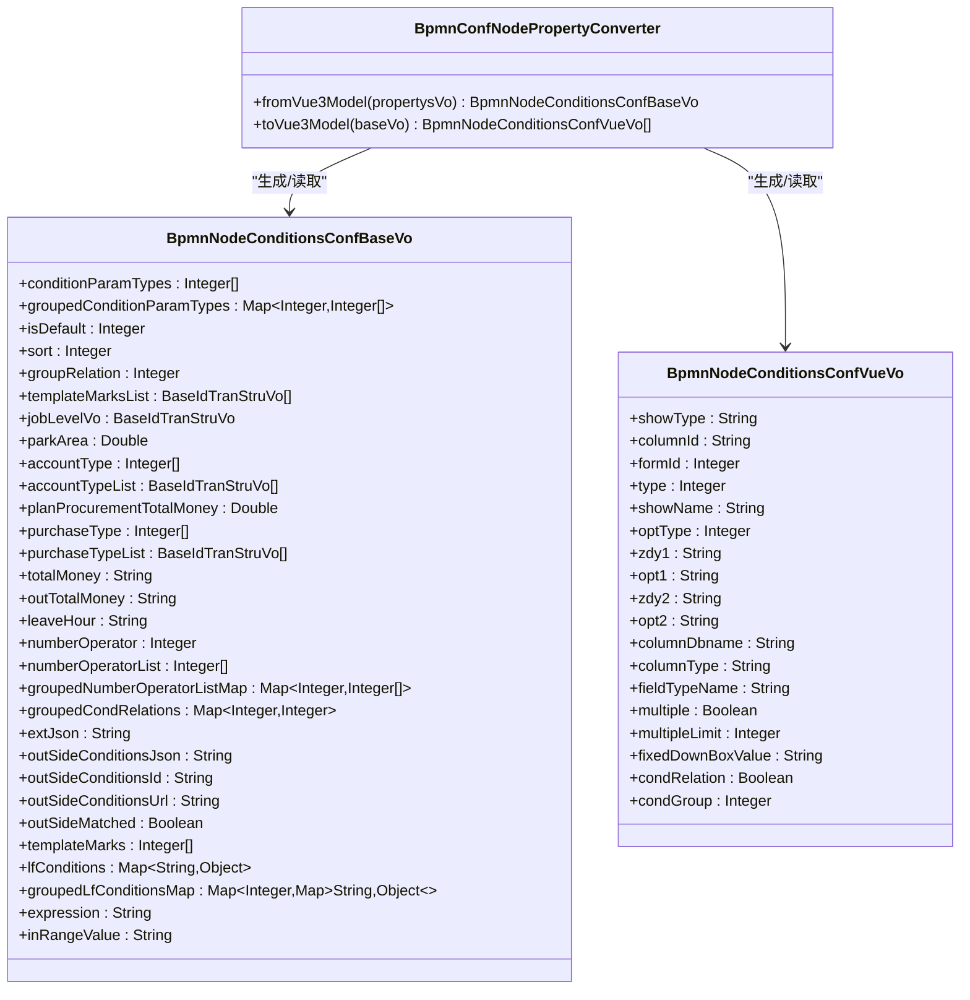
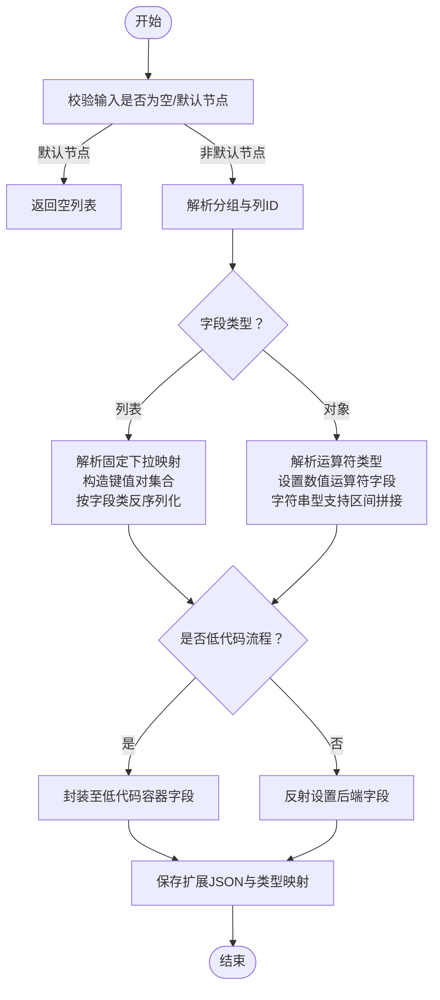
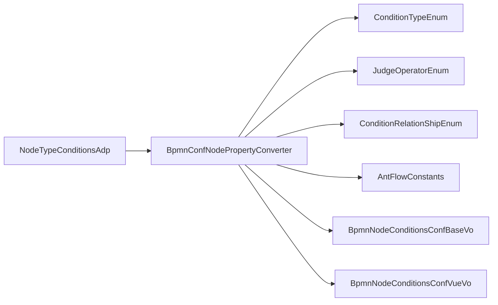

# 节点属性转换器

<cite>
**本文引用的文件**
- [BpmnConfNodePropertyConverter.java](file://antflow-engine/src/main/java/org/openoa/engine/utils/BpmnConfNodePropertyConverter.java)
- [BpmnNodeConditionsConfBaseVo.java](file://antflow-base/src/main/java/org/openoa/base/vo/BpmnNodeConditionsConfBaseVo.java)
- [BpmnNodeConditionsConfVueVo.java](file://antflow-base/src/main/java/org/openoa/base/vo/BpmnNodeConditionsConfVueVo.java)
- [ConditionTypeEnum.java](file://antflow-engine/src/main/java/org/openoa/engine/bpmnconf/constant/enus/ConditionTypeEnum.java)
- [JudgeOperatorEnum.java](file://antflow-base/src/main/java/org/openoa/base/constant/enus/JudgeOperatorEnum.java)
- [ConditionRelationShipEnum.java](file://antflow-base/src/main/java/org/openoa/base/constant/enums/ConditionRelationShipEnum.java)
- [AntFlowConstants.java](file://antflow-engine/src/main/java/org/openoa/engine/bpmnconf/constant/AntFlowConstants.java)
- [NodeTypeConditionsAdp.java](file://antflow-engine/src/main/java/org/openoa/engine/bpmnconf/adp/bpmnnodeadp/NodeTypeConditionsAdp.java)
</cite>

## 目录
1. [简介](#简介)
2. [项目结构](#项目结构)
3. [核心组件](#核心组件)
4. [架构总览](#架构总览)
5. [详细组件分析](#详细组件分析)
6. [依赖分析](#依赖分析)
7. [性能考虑](#性能考虑)
8. [故障排查指南](#故障排查指南)
9. [结论](#结论)
10. [附录](#附录)

## 简介
本文件围绕“节点属性转换器”展开，系统性阐述其设计原理、序列化与反序列化机制、数据类型映射规则、结构化存储方式、属性验证与默认值处理、扩展机制与自定义属性支持、属性版本兼容策略，并给出性能优化、内存管理与错误处理建议，以及使用示例与故障排查指引。该转换器的核心职责是在前端 Vue 模型与后端 Java 对象之间进行双向转换，确保工作流设计器与执行引擎的数据一致性。

## 项目结构
- 转换器主体位于引擎模块，负责将前端传入的节点属性模型转换为后端可持久化的配置对象，并支持逆向转换回前端展示模型。
- VO 类定义了前后端交互的数据结构，包括基础配置对象与 Vue 展示对象。
- 枚举类定义了条件类型、运算符、关系等元数据，驱动转换逻辑与校验。
- 常量类提供字段名、表达式上下文等约定，保证跨模块一致。

图表来源
- [BpmnConfNodePropertyConverter.java:28-273](file://antflow-engine/src/main/java/org/openoa/engine/utils/BpmnConfNodePropertyConverter.java#L28-L273)
- [NodeTypeConditionsAdp.java:204-252](file://antflow-engine/src/main/java/org/openoa/engine/bpmnconf/adp/bpmnnodeadp/NodeTypeConditionsAdp.java#L204-L252)
- [BpmnNodeConditionsConfBaseVo.java:24-125](file://antflow-base/src/main/java/org/openoa/base/vo/BpmnNodeConditionsConfBaseVo.java#L24-L125)
- [BpmnNodeConditionsConfVueVo.java:11-34](file://antflow-base/src/main/java/org/openoa/base/vo/BpmnNodeConditionsConfVueVo.java#L11-L34)
- [ConditionTypeEnum.java:20-171](file://antflow-engine/src/main/java/org/openoa/engine/bpmnconf/constant/enus/ConditionTypeEnum.java#L20-L171)
- [JudgeOperatorEnum.java:17-64](file://antflow-base/src/main/java/org/openoa/base/constant/enums/JudgeOperatorEnum.java#L17-L64)
- [ConditionRelationShipEnum.java:8-44](file://antflow-base/src/main/java/org/openoa/base/constant/enums/ConditionRelationShipEnum.java#L8-L44)
- [AntFlowConstants.java:88-91](file://antflow-engine/src/main/java/org/openoa/engine/bpmnconf/constant/AntFlowConstants.java#L88-L91)

章节来源
- [BpmnConfNodePropertyConverter.java:28-273](file://antflow-engine/src/main/java/org/openoa/engine/utils/BpmnConfNodePropertyConverter.java#L28-L273)
- [BpmnNodeConditionsConfBaseVo.java:24-125](file://antflow-base/src/main/java/org/openoa/base/vo/BpmnNodeConditionsConfBaseVo.java#L24-L125)
- [BpmnNodeConditionsConfVueVo.java:11-34](file://antflow-base/src/main/java/org/openoa/base/vo/BpmnNodeConditionsConfVueVo.java#L11-L34)
- [ConditionTypeEnum.java:20-171](file://antflow-engine/src/main/java/org/openoa/engine/bpmnconf/constant/enus/ConditionTypeEnum.java#L20-L171)
- [JudgeOperatorEnum.java:17-64](file://antflow-base/src/main/java/org/openoa/base/constant/enums/JudgeOperatorEnum.java#L17-L64)
- [ConditionRelationShipEnum.java:8-44](file://antflow-base/src/main/java/org/openoa/base/constant/enums/ConditionRelationShipEnum.java#L8-L44)
- [AntFlowConstants.java:88-91](file://antflow-engine/src/main/java/org/openoa/engine/bpmnconf/constant/AntFlowConstants.java#L88-L91)

## 核心组件
- 节点属性转换器：提供 fromVue3Model 与 toVue3Model 两个核心方法，完成前后端模型的双向转换。
- 基础配置 VO：承载后端持久化所需的字段集合，含条件类型、分组关系、扩展 JSON、低代码流程条件容器等。
- 前端展示 VO：承载前端表单渲染所需字段，含列 ID、显示名、运算符、分组、固定下拉框值等。
- 条件类型枚举：定义每种条件的字段名、字段类型、字段类、适配器类、比对类等，驱动反射赋值与校验。
- 运算符与关系枚举：统一数值运算符与组内关系（AND/OR）的映射。
- 常量：提供字段名约定（如表达式字段名、低代码条件容器字段名），保障跨模块一致性。

章节来源
- [BpmnConfNodePropertyConverter.java:28-273](file://antflow-engine/src/main/java/org/openoa/engine/utils/BpmnConfNodePropertyConverter.java#L28-L273)
- [BpmnNodeConditionsConfBaseVo.java:24-125](file://antflow-base/src/main/java/org/openoa/base/vo/BpmnNodeConditionsConfBaseVo.java#L24-L125)
- [BpmnNodeConditionsConfVueVo.java:11-34](file://antflow-base/src/main/java/org/openoa/base/vo/BpmnNodeConditionsConfVueVo.java#L11-L34)
- [ConditionTypeEnum.java:20-171](file://antflow-engine/src/main/java/org/openoa/engine/bpmnconf/constant/enus/ConditionTypeEnum.java#L20-L171)
- [JudgeOperatorEnum.java:17-64](file://antflow-base/src/main/java/org/openoa/base/constant/enums/JudgeOperatorEnum.java#L17-L64)
- [ConditionRelationShipEnum.java:8-44](file://antflow-base/src/main/java/org/openoa/base/constant/enums/ConditionRelationShipEnum.java#L8-L44)
- [AntFlowConstants.java:88-91](file://antflow-engine/src/main/java/org/openoa/engine/bpmnconf/constant/AntFlowConstants.java#L88-L91)

## 架构总览
转换器在“适配器-转换器-VO-枚举”的协作链路中运行：适配器调用转换器进行模型转换，转换器依据枚举与常量进行字段解析、类型映射与校验，最终生成或还原 VO 对象。

图表来源
- [NodeTypeConditionsAdp.java:204-252](file://antflow-engine/src/main/java/org/openoa/engine/bpmnconf/adp/bpmnnodeadp/NodeTypeConditionsAdp.java#L204-L252)
- [BpmnConfNodePropertyConverter.java:29-181](file://antflow-engine/src/main/java/org/openoa/engine/utils/BpmnConfNodePropertyConverter.java#L29-L181)
- [BpmnConfNodePropertyConverter.java:183-271](file://antflow-engine/src/main/java/org/openoa/engine/utils/BpmnConfNodePropertyConverter.java#L183-L271)

## 详细组件分析

### 转换器类结构与职责
- 双向转换入口：
  - fromVue3Model：从前端模型构建后端基础配置对象，包含字段映射、集合处理、运算符设置、低代码条件封装、分组关系与扩展 JSON 的持久化。
  - toVue3Model：从后端基础配置对象还原前端展示列表，包含集合拆分、固定下拉值映射、分组与列字段还原。
- 关键特性：
  - 分组与关系：支持按组组织条件，并将组内关系（AND/OR）映射为数值编码。
  - 条件类型识别：通过列 ID 映射到条件类型枚举，区分列表型与对象型字段，处理低代码流程条件的特殊容器。
  - 运算符映射：根据前端运算符类型设置后端数值运算符字段。
  - 低代码流程支持：将多值条件封装到低代码容器字段，便于后续执行引擎统一处理。

图表来源
- [BpmnConfNodePropertyConverter.java:28-273](file://antflow-engine/src/main/java/org/openoa/engine/utils/BpmnConfNodePropertyConverter.java#L28-L273)
- [BpmnNodeConditionsConfBaseVo.java:24-125](file://antflow-base/src/main/java/org/openoa/base/vo/BpmnNodeConditionsConfBaseVo.java#L24-L125)
- [BpmnNodeConditionsConfVueVo.java:11-34](file://antflow-base/src/main/java/org/openoa/base/vo/BpmnNodeConditionsConfVueVo.java#L11-L34)

章节来源
- [BpmnConfNodePropertyConverter.java:28-273](file://antflow-engine/src/main/java/org/openoa/engine/utils/BpmnConfNodePropertyConverter.java#L28-L273)
- [BpmnNodeConditionsConfBaseVo.java:24-125](file://antflow-base/src/main/java/org/openoa/base/vo/BpmnNodeConditionsConfBaseVo.java#L24-L125)
- [BpmnNodeConditionsConfVueVo.java:11-34](file://antflow-base/src/main/java/org/openoa/base/vo/BpmnNodeConditionsConfVueVo.java#L11-L34)

### 序列化与反序列化机制
- fromVue3Model 流程要点：
  - 校验输入非空与默认节点标记。
  - 解析分组列表，为每个条件设置组号与组关系编码。
  - 依据列 ID 获取条件类型枚举，校验字段名与字段类型。
  - 列表型字段：解析固定下拉值映射，构造键值对集合，按字段类进行反序列化，支持低代码容器封装。
  - 对象型字段：解析运算符类型并设置后端数值运算符字段；字符串型支持“介于”区间拼接；其他类型进行 JSON 反序列化。
  - 低代码流程：将集合/字符串/数值/日期等条件统一放入低代码容器字段，便于后续执行。
  - 保存扩展 JSON 与条件类型映射，便于逆向转换。
- toVue3Model 流程要点：
  - 默认节点直接返回空列表。
  - 从扩展 JSON 或分组映射重建前端展示列表。
  - 列表型字段：从低代码容器或普通字段提取集合，拼接为逗号分隔字符串；读取固定下拉映射并序列化为前端可用格式。
  - 对象型字段：暂不处理（保留占位，后续完善）。
  - 设置列字段名、显示名、分组与关系等前端渲染所需字段。

图表来源
- [BpmnConfNodePropertyConverter.java:29-181](file://antflow-engine/src/main/java/org/openoa/engine/utils/BpmnConfNodePropertyConverter.java#L29-L181)
- [BpmnConfNodePropertyConverter.java:183-271](file://antflow-engine/src/main/java/org/openoa/engine/utils/BpmnConfNodePropertyConverter.java#L183-L271)

章节来源
- [BpmnConfNodePropertyConverter.java:29-181](file://antflow-engine/src/main/java/org/openoa/engine/utils/BpmnConfNodePropertyConverter.java#L29-L181)
- [BpmnConfNodePropertyConverter.java:183-271](file://antflow-engine/src/main/java/org/openoa/engine/utils/BpmnConfNodePropertyConverter.java#L183-L271)

### 数据类型映射规则
- 条件类型枚举驱动映射：
  - 字段名：决定反射目标字段与前端列字段名。
  - 字段类型：1 表示列表，2 表示对象，3 表示特殊对象（如园区面积）。
  - 字段类：决定 JSON 反序列化的目标类型。
  - 适配器类：用于扩展与适配不同节点类型的条件处理。
  - 比对类：用于执行阶段的条件判断。
- 运算符映射：
  - 前端运算符类型映射为后端数值运算符字段，支持区间比较（如 first<a<second）。
- 关系映射：
  - 组内关系（AND/OR）映射为数值编码，支持默认值与显式值互转。
- 低代码流程：
  - 所有低代码条件统一放入低代码容器字段，字段名为常量约定，便于执行引擎统一处理。

章节来源
- [ConditionTypeEnum.java:20-171](file://antflow-engine/src/main/java/org/openoa/engine/bpmnconf/constant/enus/ConditionTypeEnum.java#L20-L171)
- [JudgeOperatorEnum.java:17-64](file://antflow-base/src/main/java/org/openoa/base/constant/enums/JudgeOperatorEnum.java#L17-L64)
- [ConditionRelationShipEnum.java:8-44](file://antflow-base/src/main/java/org/openoa/base/constant/enums/ConditionRelationShipEnum.java#L8-L44)
- [AntFlowConstants.java:88-91](file://antflow-engine/src/main/java/org/openoa/engine/bpmnconf/constant/AntFlowConstants.java#L88-L91)

### 结构化存储与属性验证
- 结构化存储：
  - 扩展 JSON：保存原始前端分组与列定义，便于逆向转换。
  - 条件类型映射：记录每组的条件类型列表，支撑前端渲染与后端持久化。
  - 低代码容器：将多值/复杂条件统一存放，避免字段膨胀。
- 属性验证：
  - 列 ID 必填且需能映射到有效枚举。
  - 字段名与列字段名需匹配（低代码流程除外）。
  - 运算符类型需在枚举范围内。
  - 默认节点与空节点需进行明确判定与异常抛出。
- 默认值处理：
  - 组内关系默认 OR（编码 1）。
  - 默认节点标记为 1 时，直接返回空列表。

章节来源
- [BpmnConfNodePropertyConverter.java:31-51](file://antflow-engine/src/main/java/org/openoa/engine/utils/BpmnConfNodePropertyConverter.java#L31-L51)
- [BpmnConfNodePropertyConverter.java:72-84](file://antflow-engine/src/main/java/org/openoa/engine/utils/BpmnConfNodePropertyConverter.java#L72-L84)
- [BpmnConfNodePropertyConverter.java:126-133](file://antflow-engine/src/main/java/org/openoa/engine/utils/BpmnConfNodePropertyConverter.java#L126-L133)
- [ConditionRelationShipEnum.java:22-32](file://antflow-base/src/main/java/org/openoa/base/constant/enums/ConditionRelationShipEnum.java#L22-L32)

### 扩展机制与自定义属性支持
- 条件类型扩展：
  - 新增条件类型枚举条目，指定字段名、字段类型、字段类、适配器类与比对类。
  - 低代码流程条件通过统一容器字段支持，无需新增后端字段。
- 适配器协作：
  - 适配器负责业务场景下的条件组装与转换，转换器仅做通用映射与校验。
- 前后端约定：
  - 常量类提供字段名约定，确保前后端一致。

章节来源
- [ConditionTypeEnum.java:20-171](file://antflow-engine/src/main/java/org/openoa/engine/bpmnconf/constant/enus/ConditionTypeEnum.java#L20-L171)
- [AntFlowConstants.java:88-91](file://antflow-engine/src/main/java/org/openoa/engine/bpmnconf/constant/AntFlowConstants.java#L88-L91)
- [NodeTypeConditionsAdp.java:204-252](file://antflow-engine/src/main/java/org/openoa/engine/bpmnconf/adp/bpmnnodeadp/NodeTypeConditionsAdp.java#L204-L252)

### 版本兼容性
- 兼容策略：
  - 通过扩展 JSON 与条件类型映射保留历史结构，逆向转换时优先从映射恢复。
  - 低代码流程采用统一容器字段，避免未来字段变更带来的破坏性影响。
  - 枚举新增不影响既有逻辑，仅需确保映射与校验规则覆盖新类型。

章节来源
- [BpmnConfNodePropertyConverter.java:177-180](file://antflow-engine/src/main/java/org/openoa/engine/utils/BpmnConfNodePropertyConverter.java#L177-L180)
- [BpmnConfNodePropertyConverter.java:194-199](file://antflow-engine/src/main/java/org/openoa/engine/utils/BpmnConfNodePropertyConverter.java#L194-L199)
- [ConditionTypeEnum.java:145-170](file://antflow-engine/src/main/java/org/openoa/engine/bpmnconf/constant/enus/ConditionTypeEnum.java#L145-L170)

## 依赖分析
- 耦合关系：
  - 转换器依赖枚举与常量进行字段映射与校验。
  - 适配器依赖转换器完成模型转换。
  - VO 作为契约对象，被转换器读写。
- 内聚性：
  - 转换器聚焦于“模型映射与校验”，内聚度高。
  - 枚举与常量提供稳定的元数据，降低耦合。
- 潜在循环依赖：
  - 当前结构未见循环依赖风险。

图表来源
- [NodeTypeConditionsAdp.java:204-252](file://antflow-engine/src/main/java/org/openoa/engine/bpmnconf/adp/bpmnnodeadp/NodeTypeConditionsAdp.java#L204-L252)
- [BpmnConfNodePropertyConverter.java:28-273](file://antflow-engine/src/main/java/org/openoa/engine/utils/BpmnConfNodePropertyConverter.java#L28-L273)
- [ConditionTypeEnum.java:20-171](file://antflow-engine/src/main/java/org/openoa/engine/bpmnconf/constant/enus/ConditionTypeEnum.java#L20-L171)
- [JudgeOperatorEnum.java:17-64](file://antflow-base/src/main/java/org/openoa/base/constant/enums/JudgeOperatorEnum.java#L17-L64)
- [ConditionRelationShipEnum.java:8-44](file://antflow-base/src/main/java/org/openoa/base/constant/enums/ConditionRelationShipEnum.java#L8-L44)
- [AntFlowConstants.java:88-91](file://antflow-engine/src/main/java/org/openoa/engine/bpmnconf/constant/AntFlowConstants.java#L88-L91)
- [BpmnNodeConditionsConfBaseVo.java:24-125](file://antflow-base/src/main/java/org/openoa/base/vo/BpmnNodeConditionsConfBaseVo.java#L24-L125)
- [BpmnNodeConditionsConfVueVo.java:11-34](file://antflow-base/src/main/java/org/openoa/base/vo/BpmnNodeConditionsConfVueVo.java#L11-L34)

章节来源
- [NodeTypeConditionsAdp.java:204-252](file://antflow-engine/src/main/java/org/openoa/engine/bpmnconf/adp/bpmnnodeadp/NodeTypeConditionsAdp.java#L204-L252)
- [BpmnConfNodePropertyConverter.java:28-273](file://antflow-engine/src/main/java/org/openoa/engine/utils/BpmnConfNodePropertyConverter.java#L28-L273)

## 性能考虑
- 反射与字段访问：
  - 使用反射设置字段值，建议在高频路径中缓存 Field 对象以减少重复查找成本。
- JSON 解析：
  - 大量 JSON 解析与序列化可能成为瓶颈，建议对固定下拉映射进行本地缓存或复用。
- 集合处理：
  - 列表型字段的键值对映射与集合拼接应避免重复遍历，尽量一次性完成。
- 低代码容器：
  - 统一容器字段减少了字段数量，有利于数据库存储与网络传输，提升整体性能。

## 故障排查指南
- 常见异常与定位：
  - 输入为空或默认节点：检查前端是否正确传递 propertysVo/isDefault。
  - 列 ID 无效：确认列 ID 是否在条件类型枚举中存在。
  - 字段名不匹配：低代码流程字段名遵循常量约定，非低代码流程需与枚举字段名一致。
  - 运算符类型未定义：核对前端运算符类型是否在枚举范围内。
- 排查步骤：
  - 打印扩展 JSON 与条件类型映射，确认逆向转换所需元数据是否完整。
  - 检查低代码容器字段是否正确封装。
  - 核对组内关系与默认节点标记的映射逻辑。
- 建议的日志与断言：
  - 在关键分支（如列 ID 解析、字段类反序列化、低代码容器封装）添加日志，便于定位问题。

章节来源
- [BpmnConfNodePropertyConverter.java:31-51](file://antflow-engine/src/main/java/org/openoa/engine/utils/BpmnConfNodePropertyConverter.java#L31-L51)
- [BpmnConfNodePropertyConverter.java:72-84](file://antflow-engine/src/main/java/org/openoa/engine/utils/BpmnConfNodePropertyConverter.java#L72-L84)
- [BpmnConfNodePropertyConverter.java:126-133](file://antflow-engine/src/main/java/org/openoa/engine/utils/BpmnConfNodePropertyConverter.java#L126-L133)
- [BpmnConfNodePropertyConverter.java:177-180](file://antflow-engine/src/main/java/org/openoa/engine/utils/BpmnConfNodePropertyConverter.java#L177-L180)

## 结论
节点属性转换器通过“枚举驱动 + 反射赋值 + 扩展 JSON”的组合，实现了前后端模型的稳定转换与低代码流程的统一支持。其设计兼顾了可扩展性与兼容性，配合适配器与常量约定，能够平滑演进并满足多样化的业务需求。建议在生产环境中关注反射性能、JSON 解析效率与日志可观测性，以进一步提升稳定性与吞吐能力。

## 附录
- 使用示例（路径参考）
  - 前端提交属性模型到适配器：[NodeTypeConditionsAdp.java:204-252](file://antflow-engine/src/main/java/org/openoa/engine/bpmnconf/adp/bpmnnodeadp/NodeTypeConditionsAdp.java#L204-L252)
  - 转换器正向转换：[BpmnConfNodePropertyConverter.java:29-181](file://antflow-engine/src/main/java/org/openoa/engine/utils/BpmnConfNodePropertyConverter.java#L29-L181)
  - 转换器逆向转换：[BpmnConfNodePropertyConverter.java:183-271](file://antflow-engine/src/main/java/org/openoa/engine/utils/BpmnConfNodePropertyConverter.java#L183-L271)
- 关键数据模型（路径参考）
  - 基础配置 VO：[BpmnNodeConditionsConfBaseVo.java:24-125](file://antflow-base/src/main/java/org/openoa/base/vo/BpmnNodeConditionsConfBaseVo.java#L24-L125)
  - 前端展示 VO：[BpmnNodeConditionsConfVueVo.java:11-34](file://antflow-base/src/main/java/org/openoa/base/vo/BpmnNodeConditionsConfVueVo.java#L11-L34)
- 元数据与枚举（路径参考）
  - 条件类型枚举：[ConditionTypeEnum.java:20-171](file://antflow-engine/src/main/java/org/openoa/engine/bpmnconf/constant/enus/ConditionTypeEnum.java#L20-L171)
  - 运算符枚举：[JudgeOperatorEnum.java:17-64](file://antflow-base/src/main/java/org/openoa/base/constant/enums/JudgeOperatorEnum.java#L17-L64)
  - 关系枚举：[ConditionRelationShipEnum.java:8-44](file://antflow-base/src/main/java/org/openoa/base/constant/enums/ConditionRelationShipEnum.java#L8-L44)
  - 常量：[AntFlowConstants.java:88-91](file://antflow-engine/src/main/java/org/openoa/engine/bpmnconf/constant/AntFlowConstants.java#L88-L91)