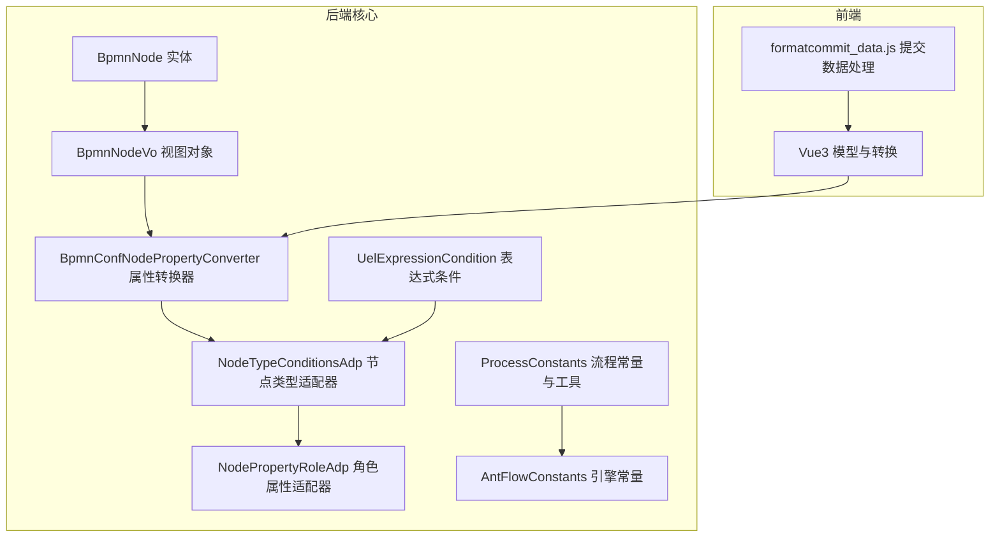
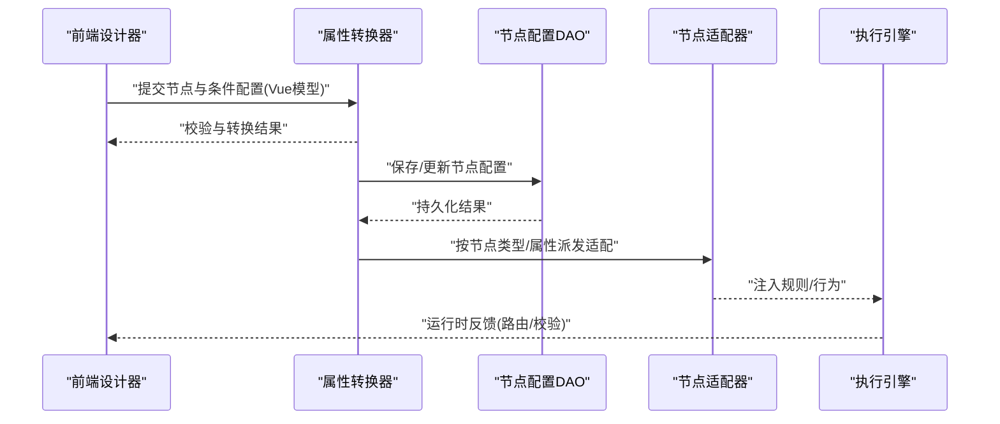
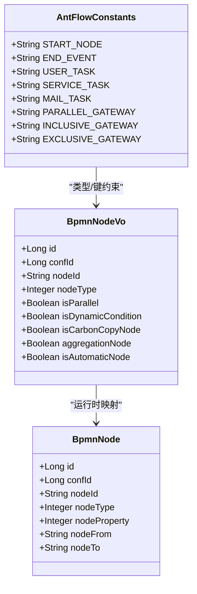
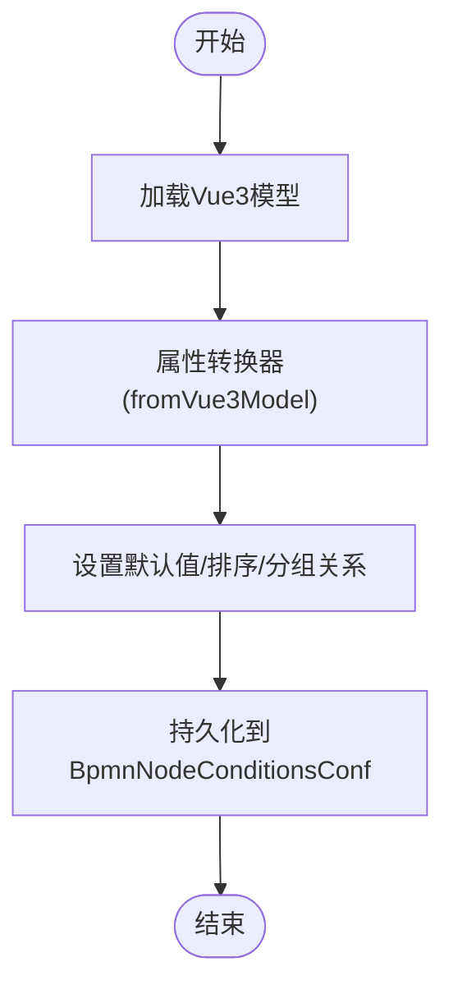
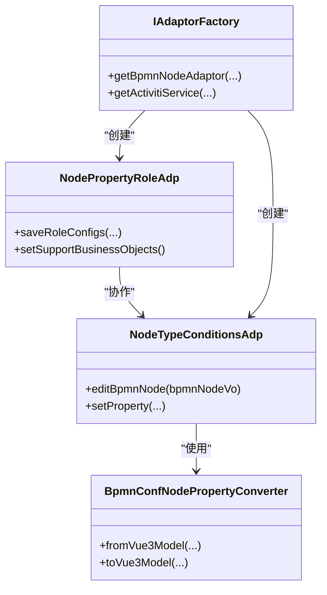
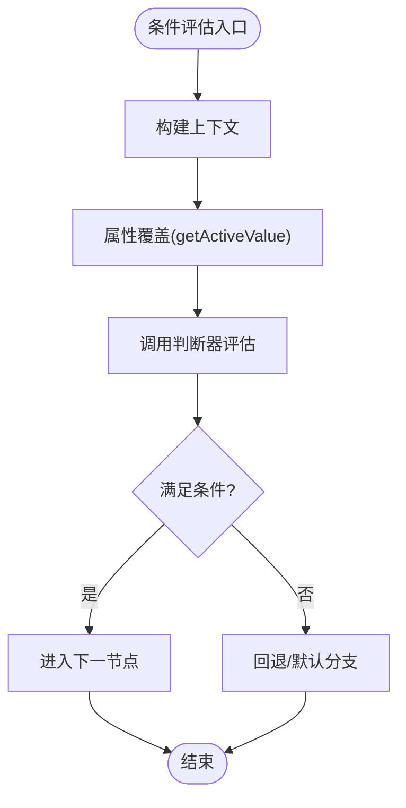
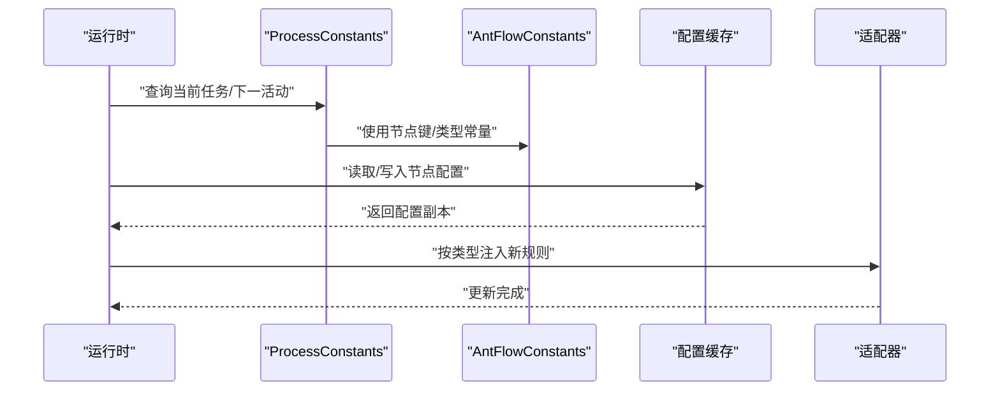
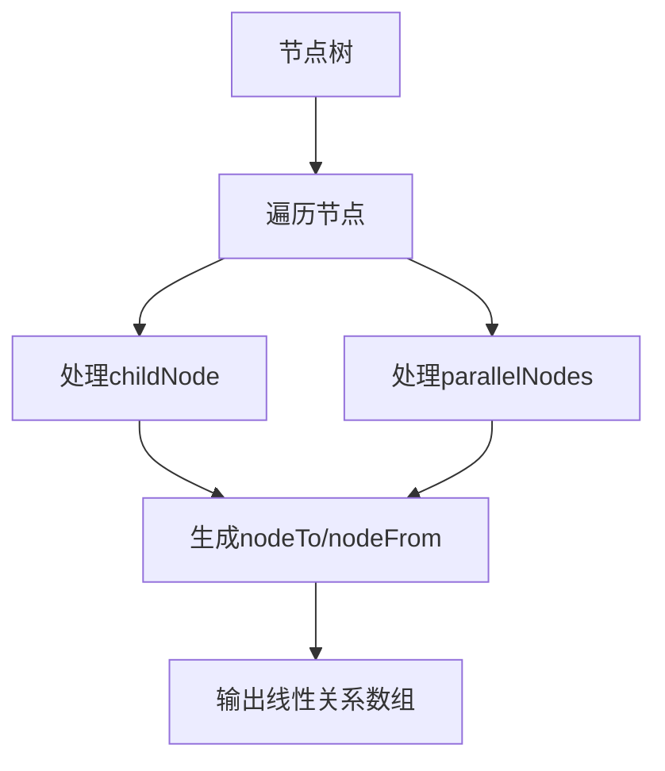
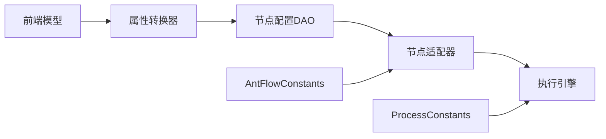

# 节点配置管理

<cite>
**本文引用的文件**
- [ProcessConstants.java](file://antflow-engine/src/main/java/org/openoa/engine/bpmnconf/common/ProcessConstants.java)
- [AntFlowConstants.java](file://antflow-engine/src/main/java/org/openoa/engine/bpmnconf/constant/AntFlowConstants.java)
- [BpmnNodeVo.java](file://antflow-base/src/main/java/org/activiti/engine/impl/DynamicBpmnServiceImpl.java)
- [BpmnNodeVo.java](file://antflow-base/src/main/java/org/openoa/base/vo/BpmnNodeVo.java)
- [BpmnNode.java](file://antflow-base/src/main/java/org/openoa/base/entity/BpmnNode.java)
- [BpmnConfNodePropertyConverter.java](file://antflow-engine/src/main/java/org/openoa/engine/bpmnconf/utils/BpmnConfNodePropertyConverter.java)
- [NodeTypeConditionsAdp.java](file://antflow-engine/src/main/java/org/openoa/engine/bpmnconf/adp/bpmnnodeadp/NodeTypeConditionsAdp.java)
- [NodePropertyRoleAdp.java](file://antflow-engine/src/main/java/org/openoa/engine/bpmnconf/adp/bpmnnodeadp/NodePropertyRoleAdp.java)
- [UelExpressionCondition.java](file://antflow-base/src/main/java/org/activiti/engine/impl/el/UelExpressionCondition.java)
- [6.流程配置系统.md](file://doc/系统介绍篇/6.流程配置系统.md)
- [3.核心概念和术语.md](file://doc/系统介绍篇/3.核心概念和术语.md)
- [23.系统扩展.md](file://doc/系统介绍篇/23.系统扩展.md)
- [formatcommit_data.js](file://antflow-vue/src/utils/antflow/formatcommit_data.js)
</cite>

## 目录
1. [简介](#简介)
2. [项目结构](#项目结构)
3. [核心组件](#核心组件)
4. [架构总览](#架构总览)
5. [详细组件分析](#详细组件分析)
6. [依赖分析](#依赖分析)
7. [性能考虑](#性能考虑)
8. [故障排查指南](#故障排查指南)
9. [结论](#结论)
10. [附录](#附录)

## 简介
本文件面向“节点配置管理”模块，系统性阐述节点配置的数据结构、节点类型与属性、存储机制、继承与默认值处理、节点适配器工作机制、行为定制与验证规则，以及动态加载、配置缓存与更新传播机制。文档同时提供各类节点类型的配置示例与最佳实践，帮助开发者在低代码流程引擎中高效构建与维护复杂审批与业务流程。

## 项目结构
节点配置管理涉及后端实体与服务、前端模型与转换器、适配器与工厂、以及运行时常量与工具类等模块。下图展示与节点配置管理直接相关的模块关系：

**图表来源**
- [BpmnNode.java:1-56](file://antflow-base/src/main/java/org/openoa/base/entity/BpmnNode.java#L1-L56)
- [BpmnNodeVo.java:1-49](file://antflow-base/src/main/java/org/openoa/base/vo/BpmnNodeVo.java#L1-L49)
- [BpmnConfNodePropertyConverter.java](file://antflow-engine/src/main/java/org/openoa/engine/bpmnconf/utils/BpmnConfNodePropertyConverter.java)
- [NodeTypeConditionsAdp.java:228-261](file://antflow-engine/src/main/java/org/openoa/engine/bpmnconf/adp/bpmnnodeadp/NodeTypeConditionsAdp.java#L228-L261)
- [NodePropertyRoleAdp.java:161-174](file://antflow-engine/src/main/java/org/openoa/engine/bpmnconf/adp/bpmnnodeadp/NodePropertyRoleAdp.java#L161-L174)
- [ProcessConstants.java:1-158](file://antflow-engine/src/main/java/org/openoa/engine/bpmnconf/common/ProcessConstants.java#L1-L158)
- [AntFlowConstants.java:1-92](file://antflow-engine/src/main/java/org/openoa/engine/bpmnconf/constant/AntFlowConstants.java#L1-L92)
- [UelExpressionCondition.java:60-79](file://antflow-base/src/main/java/org/activiti/engine/impl/el/UelExpressionCondition.java#L60-L79)
- [formatcommit_data.js:37-78](file://antflow-vue/src/utils/antflow/formatcommit_data.js#L37-L78)

**章节来源**
- [6.流程配置系统.md:63-76](file://doc/系统介绍篇/6.流程配置系统.md#L63-L76)
- [3.核心概念和术语.md:55-107](file://doc/系统介绍篇/3.核心概念和术语.md#L55-L107)
- [23.系统扩展.md:69-127](file://doc/系统介绍篇/23.系统扩展.md#L69-L127)

## 核心组件
- 节点实体与视图对象：BpmnNode（持久化实体）、BpmnNodeVo（运行时视图对象），承载节点标识、类型、属性与关系。
- 属性转换器：BpmnConfNodePropertyConverter，负责前后端模型双向转换，确保设计器与执行引擎一致。
- 节点适配器：NodeTypeConditionsAdp、NodePropertyRoleAdp，按节点类型与属性进行行为定制与规则注入。
- 运行时常量：AntFlowConstants、ProcessConstants，提供节点类型、网关类型、任务键、流程控制常量与工具方法。
- 表达式条件：UelExpressionCondition，支持元素级属性覆盖与表达式求值。
- 前端提交处理：formatcommit_data.js，负责节点树转线性关系、网关子节点 nodeTo 归集等。

**章节来源**
- [BpmnNode.java:1-56](file://antflow-base/src/main/java/org/openoa/base/entity/BpmnNode.java#L1-L56)
- [BpmnNodeVo.java:1-49](file://antflow-base/src/main/java/org/openoa/base/vo/BpmnNodeVo.java#L1-L49)
- [BpmnConfNodePropertyConverter.java](file://antflow-engine/src/main/java/org/openoa/engine/bpmnconf/utils/BpmnConfNodePropertyConverter.java)
- [NodeTypeConditionsAdp.java:228-261](file://antflow-engine/src/main/java/org/openoa/engine/bpmnconf/adp/bpmnnodeadp/NodeTypeConditionsAdp.java#L228-L261)
- [NodePropertyRoleAdp.java:161-174](file://antflow-engine/src/main/java/org/openoa/engine/bpmnconf/adp/bpmnnodeadp/NodePropertyRoleAdp.java#L161-L174)
- [AntFlowConstants.java:1-92](file://antflow-engine/src/main/java/org/openoa/engine/bpmnconf/constant/AntFlowConstants.java#L1-L92)
- [ProcessConstants.java:1-158](file://antflow-engine/src/main/java/org/openoa/engine/bpmnconf/common/ProcessConstants.java#L1-L158)
- [UelExpressionCondition.java:60-79](file://antflow-base/src/main/java/org/activiti/engine/impl/el/UelExpressionCondition.java#L60-L79)
- [formatcommit_data.js:37-78](file://antflow-vue/src/utils/antflow/formatcommit_data.js#L37-L78)

## 架构总览
节点配置管理采用“前端模型—转换器—后端实体—适配器—执行引擎”的分层架构。前端通过设计器生成节点树与条件配置，经转换器映射为后端对象；适配器根据节点类型与属性注入行为与规则；运行时通过常量与工具类保障一致性与可扩展性。

**图表来源**
- [3.核心概念和术语.md:55-107](file://doc/系统介绍篇/3.核心概念和术语.md#L55-L107)
- [23.系统扩展.md:69-127](file://doc/系统介绍篇/23.系统扩展.md#L69-L127)

## 详细组件分析

### 数据结构与节点类型
- 节点实体 BpmnNode：包含 confId、nodeId、nodeType、nodeProperty 等关键字段，支撑节点归属、类型与属性持久化。
- 节点视图 BpmnNodeVo：包含节点标识、类型、并行/动态条件/抄送/聚合/自动节点等布尔属性，用于运行时判断与渲染。
- 节点类型与常量：AntFlowConstants 定义了开始/结束事件、用户任务、服务任务、邮件任务、并行/包容/互斥网关等节点类型与键名。
- 配置数据模型：BpmnConf、BpmnNode、BpmnNodeConditionsConf、BpmnNodeConditionsParamConf 及 extJson 字段构成条件配置的分层存储。

**图表来源**
- [BpmnNode.java:1-56](file://antflow-base/src/main/java/org/openoa/base/entity/BpmnNode.java#L1-L56)
- [BpmnNodeVo.java:1-49](file://antflow-base/src/main/java/org/openoa/base/vo/BpmnNodeVo.java#L1-L49)
- [AntFlowConstants.java:1-92](file://antflow-engine/src/main/java/org/openoa/engine/bpmnconf/constant/AntFlowConstants.java#L1-L92)

**章节来源**
- [BpmnNode.java:1-56](file://antflow-base/src/main/java/org/openoa/base/entity/BpmnNode.java#L1-L56)
- [BpmnNodeVo.java:1-49](file://antflow-base/src/main/java/org/openoa/base/vo/BpmnNodeVo.java#L1-L49)
- [AntFlowConstants.java:1-92](file://antflow-engine/src/main/java/org/openoa/engine/bpmnconf/constant/AntFlowConstants.java#L1-L92)
- [6.流程配置系统.md:63-76](file://doc/系统介绍篇/6.流程配置系统.md#L63-L76)

### 存储机制与继承/默认值
- 分层存储：BpmnNodeConditionsConf 以 isDefault、sort、groupRelation、extJson 等字段记录节点条件配置；BpmnNodeConditionsParamConf 记录具体条件参数与运算符。
- 继承关系：节点属性可通过 BpmnConfNodePropertyConverter 在前后端之间双向转换，保证设计器与执行引擎一致。
- 默认值设置：NodeTypeConditionsAdp 在编辑节点时将 Vue 模型转换为后端对象并写入默认值与排序信息，确保无配置节点具备合理缺省行为。

**图表来源**
- [3.核心概念和术语.md:55-107](file://doc/系统介绍篇/3.核心概念和术语.md#L55-L107)
- [NodeTypeConditionsAdp.java:228-261](file://antflow-engine/src/main/java/org/openoa/engine/bpmnconf/adp/bpmnnodeadp/NodeTypeConditionsAdp.java#L228-L261)

**章节来源**
- [NodeTypeConditionsAdp.java:228-261](file://antflow-engine/src/main/java/org/openoa/engine/bpmnconf/adp/bpmnnodeadp/NodeTypeConditionsAdp.java#L228-L261)
- [BpmnConfNodePropertyConverter.java](file://antflow-engine/src/main/java/org/openoa/engine/bpmnconf/utils/BpmnConfNodePropertyConverter.java)

### 节点适配器工作机制与行为定制
- 适配器职责：根据节点类型与属性，注入特定规则（如条件判断、人员规则、表单适配等），并声明支持的业务对象类型。
- 典型适配器：
  - NodeTypeConditionsAdp：将 Vue3 模型转换为后端条件配置对象，设置属性并持久化。
  - NodePropertyRoleAdp：处理角色属性配置，批量保存外部人员配置等。
- 工厂与注册：IAdaptorFactory 负责创建适配器实例，形成统一的适配器生态。

**图表来源**
- [23.系统扩展.md:69-127](file://doc/系统介绍篇/23.系统扩展.md#L69-L127)
- [NodeTypeConditionsAdp.java:228-261](file://antflow-engine/src/main/java/org/openoa/engine/bpmnconf/adp/bpmnnodeadp/NodeTypeConditionsAdp.java#L228-L261)
- [NodePropertyRoleAdp.java:161-174](file://antflow-engine/src/main/java/org/openoa/engine/bpmnconf/adp/bpmnnodeadp/NodePropertyRoleAdp.java#L161-L174)

**章节来源**
- [23.系统扩展.md:69-127](file://doc/系统介绍篇/23.系统扩展.md#L69-L127)
- [NodeTypeConditionsAdp.java:228-261](file://antflow-engine/src/main/java/org/openoa/engine/bpmnconf/adp/bpmnnodeadp/NodeTypeConditionsAdp.java#L228-L261)
- [NodePropertyRoleAdp.java:161-174](file://antflow-engine/src/main/java/org/openoa/engine/bpmnconf/adp/bpmnnodeadp/NodePropertyRoleAdp.java#L161-L174)

### 节点验证规则与表达式条件
- 表达式条件：UelExpressionCondition 支持对元素属性进行覆盖与求值，允许在运行时根据上下文动态调整节点行为。
- 条件评估：通过条件服务与判断器（如字符串、数字、集合等判断器）评估节点路由，结合 groupRelation 与 extJson 实现复杂分支逻辑。

**图表来源**
- [UelExpressionCondition.java:60-79](file://antflow-base/src/main/java/org/activiti/engine/impl/el/UelExpressionCondition.java#L60-L79)

**章节来源**
- [UelExpressionCondition.java:60-79](file://antflow-base/src/main/java/org/activiti/engine/impl/el/UelExpressionCondition.java#L60-L79)

### 动态加载、配置缓存与更新传播
- 动态加载：运行时通过 ProcessConstants 获取当前任务、下一活动、历史任务等，结合 AntFlowConstants 的节点键与类型常量，动态定位节点状态与流转。
- 配置缓存：建议在适配器或工厂层引入轻量缓存，避免重复解析与转换；更新时采用失效策略或版本号标记。
- 更新传播：当节点配置变更时，通过适配器刷新运行时上下文，并通知相关监听器或回调，确保执行引擎与前端一致。

**图表来源**
- [ProcessConstants.java:1-158](file://antflow-engine/src/main/java/org/openoa/engine/bpmnconf/common/ProcessConstants.java#L1-L158)
- [AntFlowConstants.java:1-92](file://antflow-engine/src/main/java/org/openoa/engine/bpmnconf/constant/AntFlowConstants.java#L1-L92)

**章节来源**
- [ProcessConstants.java:1-158](file://antflow-engine/src/main/java/org/openoa/engine/bpmnconf/common/ProcessConstants.java#L1-L158)
- [AntFlowConstants.java:1-92](file://antflow-engine/src/main/java/org/openoa/engine/bpmnconf/constant/AntFlowConstants.java#L1-L92)

### 前端节点树与关系处理
- 节点树转线性：formatcommit_data.js 将设计器中的树形节点转换为线性关系数组，处理 childNode、parallelNodes 等字段，统一生成 nodeTo 与 nodeFrom。
- 网关子节点归集：对网关节点的多个出口进行 nodeTo 归集，确保后端条件配置与关系映射一致。

**图表来源**
- [formatcommit_data.js:37-78](file://antflow-vue/src/utils/antflow/formatcommit_data.js#L37-L78)

**章节来源**
- [formatcommit_data.js:37-78](file://antflow-vue/src/utils/antflow/formatcommit_data.js#L37-L78)

## 依赖分析
- 组件耦合：适配器依赖转换器与常量；转换器依赖前端模型；运行时工具依赖常量与适配器。
- 外部依赖：执行引擎（Activiti）提供元素属性覆盖与表达式求值能力；Spring Bean 工具提供运行时服务访问。
- 循环依赖风险：通过工厂与接口隔离，避免适配器间直接循环引用。

**图表来源**
- [23.系统扩展.md:69-127](file://doc/系统介绍篇/23.系统扩展.md#L69-L127)
- [AntFlowConstants.java:1-92](file://antflow-engine/src/main/java/org/openoa/engine/bpmnconf/constant/AntFlowConstants.java#L1-L92)
- [ProcessConstants.java:1-158](file://antflow-engine/src/main/java/org/openoa/engine/bpmnconf/common/ProcessConstants.java#L1-L158)

**章节来源**
- [23.系统扩展.md:69-127](file://doc/系统介绍篇/23.系统扩展.md#L69-L127)

## 性能考虑
- 缓存策略：对常用节点配置与转换结果进行缓存，减少重复解析与序列化开销。
- 批量处理：角色与条件配置采用批量保存，降低数据库往返次数。
- 懒加载：仅在需要时加载下一节点或历史任务，避免全量扫描。
- 表达式优化：尽量使用简单表达式，必要时预编译或缓存求值上下文。

## 故障排查指南
- 节点类型不匹配：检查 AntFlowConstants 中的节点键与类型是否与前端一致。
- 条件配置缺失：确认 NodeTypeConditionsAdp 是否正确调用转换器并设置默认值。
- 表达式求值异常：核对 UelExpressionCondition 的属性覆盖逻辑与上下文变量。
- 历史任务查询错误：检查 ProcessConstants 的历史任务过滤条件与 formKey 解析。

**章节来源**
- [AntFlowConstants.java:1-92](file://antflow-engine/src/main/java/org/openoa/engine/bpmnconf/constant/AntFlowConstants.java#L1-L92)
- [NodeTypeConditionsAdp.java:228-261](file://antflow-engine/src/main/java/org/openoa/engine/bpmnconf/adp/bpmnnodeadp/NodeTypeConditionsAdp.java#L228-L261)
- [UelExpressionCondition.java:60-79](file://antflow-base/src/main/java/org/activiti/engine/impl/el/UelExpressionCondition.java#L60-L79)
- [ProcessConstants.java:1-158](file://antflow-engine/src/main/java/org/openoa/engine/bpmnconf/common/ProcessConstants.java#L1-L158)

## 结论
节点配置管理通过清晰的数据结构、完善的适配器体系与前后端转换器，实现了从设计到执行的全链路一致性。借助常量与工具类保障运行时稳定性，结合缓存与批量处理提升性能。遵循本文的最佳实践，可在复杂业务场景中高效构建与维护节点配置。

## 附录

### 节点类型与属性参考
- 节点类型：开始事件、结束事件、用户任务、服务任务、邮件任务、并行/包容/互斥网关。
- 节点属性：并行、动态条件、抄送、聚合、自动节点等布尔属性。
- 关系字段：nodeFrom、nodeTo、childNode、parallelNodes。

**章节来源**
- [AntFlowConstants.java:1-92](file://antflow-engine/src/main/java/org/openoa/engine/bpmnconf/constant/AntFlowConstants.java#L1-L92)
- [BpmnNodeVo.java:1-49](file://antflow-base/src/main/java/org/openoa/base/vo/BpmnNodeVo.java#L1-L49)
- [formatcommit_data.js:37-78](file://antflow-vue/src/utils/antflow/formatcommit_data.js#L37-L78)

### 配置示例与最佳实践
- 示例：为审批节点配置动态条件与人员规则，使用 NodeTypeConditionsAdp 注入条件配置并设置默认值。
- 最佳实践：
  - 前端提交前统一处理节点树与关系，确保 nodeTo/nodeFrom 正确。
  - 使用转换器进行前后端模型一致性校验，避免运行时错误。
  - 对角色与条件配置采用批量保存，减少事务开销。
  - 在适配器中明确声明支持的业务对象类型，便于扩展与维护。

**章节来源**
- [NodeTypeConditionsAdp.java:228-261](file://antflow-engine/src/main/java/org/openoa/engine/bpmnconf/adp/bpmnnodeadp/NodeTypeConditionsAdp.java#L228-L261)
- [NodePropertyRoleAdp.java:161-174](file://antflow-engine/src/main/java/org/openoa/engine/bpmnconf/adp/bpmnnodeadp/NodePropertyRoleAdp.java#L161-L174)
- [formatcommit_data.js:37-78](file://antflow-vue/src/utils/antflow/formatcommit_data.js#L37-L78)