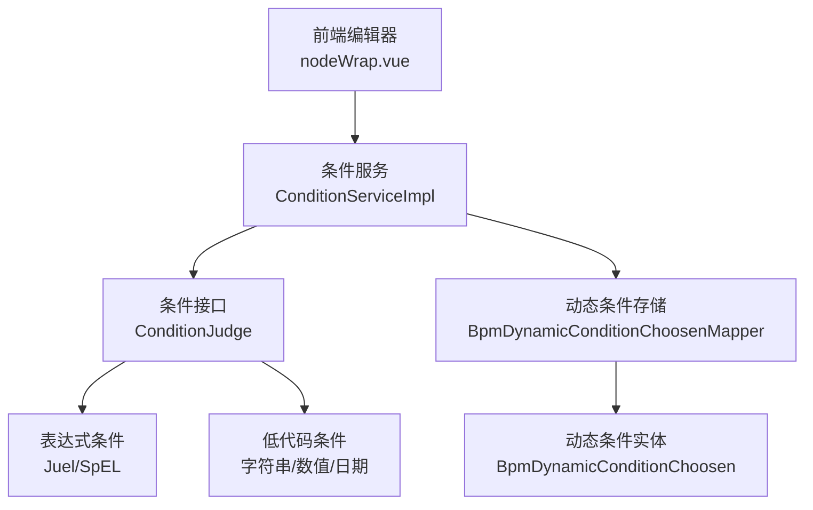
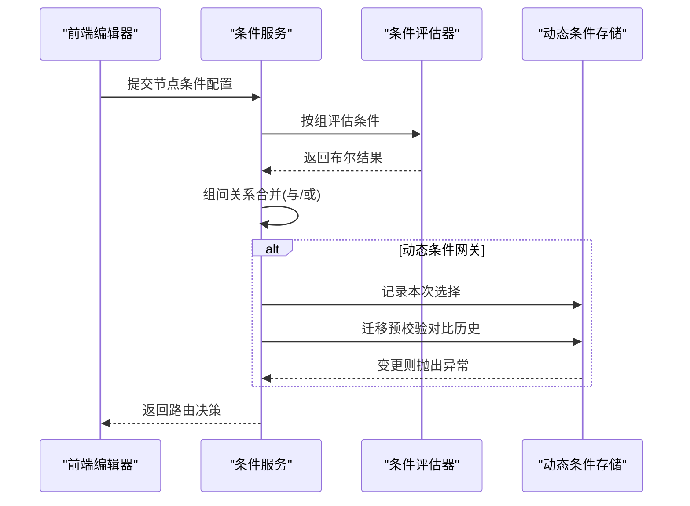
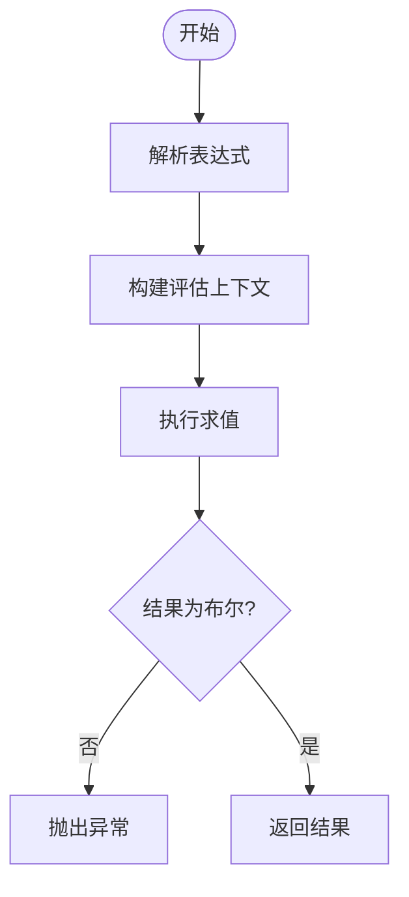
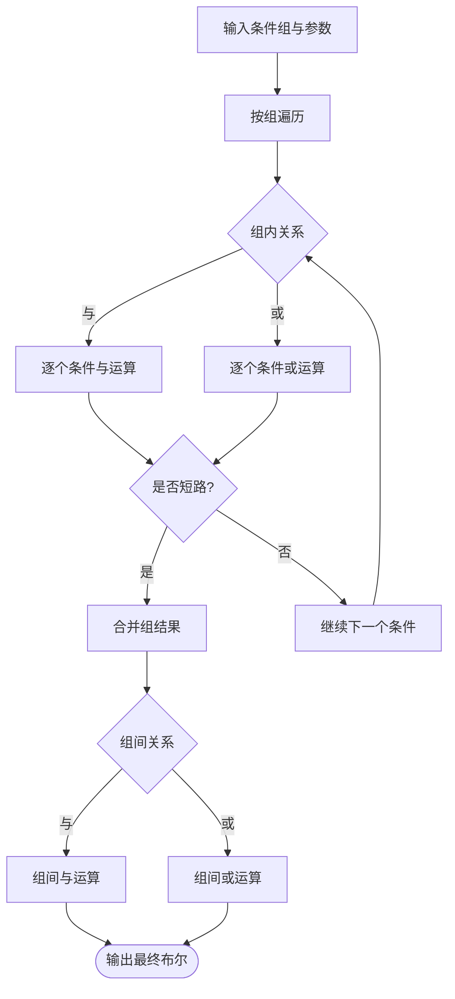
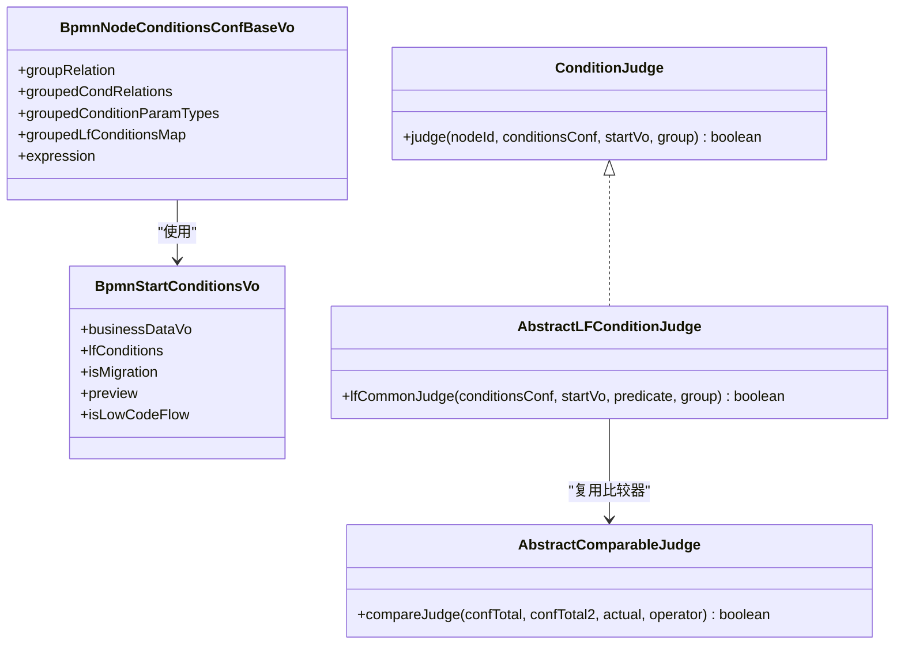
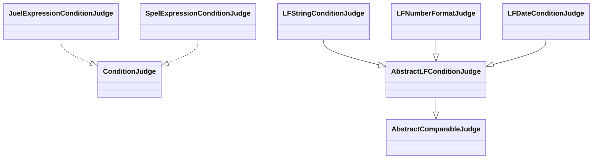
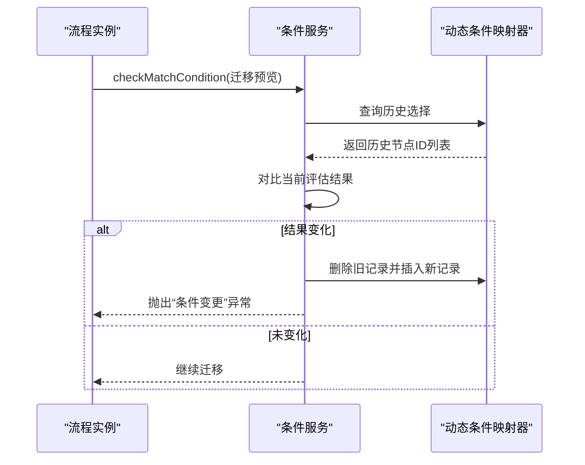
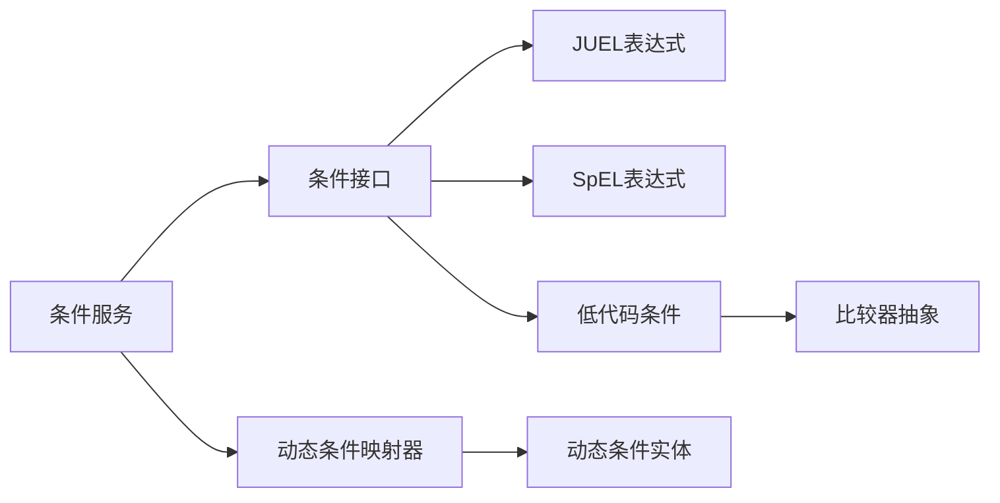

# 路由条件配置

<cite>
**本文引用的文件**
- [ConditionJudge.java](file://antflow-engine/src/main/java/org/openoa/engine/bpmnconf/adp/conditionfilter/ConditionJudge.java)
- [ConditionServiceImpl.java](file://antflow-engine/src/main/java/org/openoa/engine/bpmnconf/adp/conditionfilter/ConditionServiceImpl.java)
- [AbstractComparableJudge.java](file://antflow-engine/src/main/java/org/openoa/engine/bpmnconf/adp/conditionfilter/conditionjudge/AbstractComparableJudge.java)
- [AbstractLFConditionJudge.java](file://antflow-engine/src/main/java/org/openoa/engine/bpmnconf/adp/conditionfilter/conditionjudge/AbstractLFConditionJudge.java)
- [LFStringConditionJudge.java](file://antflow-engine/src/main/java/org/openoa/engine/bpmnconf/adp/conditionfilter/conditionjudge/LFStringConditionJudge.java)
- [LFNumberFormatJudge.java](file://antflow-engine/src/main/java/org/openoa/engine/bpmnconf/adp/conditionfilter/conditionjudge/LFNumberFormatJudge.java)
- [LFDateConditionJudge.java](file://antflow-engine/src/main/java/org/openoa/engine/bpmnconf/adp/conditionfilter/conditionjudge/LFDateConditionJudge.java)
- [JuelExpressionConditionJudge.java](file://antflow-engine/src/main/java/org/openoa/engine/bpmnconf/adp/conditionfilter/conditionjudge/JuelExpressionConditionJudge.java)
- [SpelExpressionConditionJudge.java](file://antflow-engine/src/main/java/org/openoa/engine/bpmnconf/adp/conditionfilter/conditionjudge/SpelExpressionConditionJudge.java)
- [SpelEvaluator.java](file://antflow-engine/src/main/java/org/openoa/engine/utils/SpelEvaluator.java)
- [NodeTypeConditionsAdp.java](file://antflow-engine/src/main/java/org/openoa/engine/bpmnconf/adp/bpmnnodeadp/NodeTypeConditionsAdp.java)
- [BpmDynamicConditionChoosen.java](file://antflow-base/src/main/java/org/openoa/base/entity/BpmDynamicConditionChoosen.java)
- [BpmDynamicConditionChoosenMapper.java](file://antflow-engine/src/main/java/org/openoa/engine/bpmnconf/mapper/BpmDynamicConditionChoosenMapper.java)
- [BpmnStartConditionsVo.java](file://antflow-base/src/main/java/org/openoa/base/vo/BpmnStartConditionsVo.java)
- [BpmnNodeConditionsConfBaseVo.java](file://antflow-base/src/main/java/org/openoa/base/vo/BpmnNodeConditionsConfBaseVo.java)
- [ConditionTypeEnum.md](file://doc/系统介绍篇/3.核心概念和术语.md)
- [流程配置系统.md](file://doc/系统介绍篇/6.流程配置系统.md)
- [nodeWrap.vue](file://antflow-vue/src/components/Workflow/nodeWrap.vue)
</cite>

## 目录
1. [简介](#简介)
2. [项目结构](#项目结构)
3. [核心组件](#核心组件)
4. [架构总览](#架构总览)
5. [详细组件分析](#详细组件分析)
6. [依赖分析](#依赖分析)
7. [性能考虑](#性能考虑)
8. [故障排查指南](#故障排查指南)
9. [结论](#结论)
10. [附录](#附录)

## 简介
本文件面向“路由条件配置模块”的技术文档，系统性阐述条件表达式语法、条件评估引擎、条件组合逻辑；详解条件配置的数据结构、条件优先级与继承机制；说明条件过滤器实现原理、动态条件计算与缓存策略；并提供可视化编辑器、条件测试与调试能力的使用建议，以及复杂业务场景下的配置示例与性能优化建议。

## 项目结构
路由条件配置涉及后端条件服务、条件评估器、前端可视化编辑器与动态条件持久化等模块。后端采用“接口+多实现”的策略，按条件类型分派到具体评估器；前端提供节点条件配置界面，支持优先级排序与错误提示。

图表来源
- [ConditionServiceImpl.java:35-135](file://antflow-engine/src/main/java/org/openoa/engine/bpmnconf/adp/conditionfilter/ConditionServiceImpl.java#L35-L135)
- [ConditionJudge.java:10-14](file://antflow-engine/src/main/java/org/openoa/engine/bpmnconf/adp/conditionfilter/ConditionJudge.java#L10-L14)
- [JuelExpressionConditionJudge.java:10-16](file://antflow-engine/src/main/java/org/openoa/engine/bpmnconf/adp/conditionfilter/conditionjudge/JuelExpressionConditionJudge.java#L10-L16)
- [SpelExpressionConditionJudge.java:10-15](file://antflow-engine/src/main/java/org/openoa/engine/bpmnconf/adp/conditionfilter/conditionjudge/SpelExpressionConditionJudge.java#L10-L15)
- [LFStringConditionJudge.java:10-15](file://antflow-engine/src/main/java/org/openoa/engine/bpmnconf/adp/conditionfilter/conditionjudge/LFStringConditionJudge.java#L10-L15)
- [LFNumberFormatJudge.java:14-49](file://antflow-engine/src/main/java/org/openoa/engine/bpmnconf/adp/conditionfilter/conditionjudge/LFNumberFormatJudge.java#L14-L49)
- [LFDateConditionJudge.java:11-17](file://antflow-engine/src/main/java/org/openoa/engine/bpmnconf/adp/conditionfilter/conditionjudge/LFDateConditionJudge.java#L11-L17)
- [BpmDynamicConditionChoosenMapper.java](file://antflow-engine/src/main/java/org/openoa/engine/bpmnconf/mapper/BpmDynamicConditionChoosenMapper.java)
- [BpmDynamicConditionChoosen.java](file://antflow-base/src/main/java/org/openoa/base/entity/BpmDynamicConditionChoosen.java)

章节来源
- [nodeWrap.vue:458-503](file://antflow-vue/src/components/Workflow/nodeWrap.vue#L458-L503)

## 核心组件
- 条件接口与服务
  - 条件接口定义统一的判定入口，接收节点ID、条件配置、启动条件上下文与当前组号。
  - 条件服务负责条件组合逻辑、组间关系（与/或）、动态条件记录与迁移预校验。
- 条件评估器
  - 表达式条件：JUEL/SpEL两种表达式引擎，分别用于传统表达式与低代码流程变量。
  - 低代码条件：字符串、数值、日期等类型，基于统一比较器实现。
- 数据模型
  - 启动条件上下文、节点条件配置基类、动态条件选择记录实体与映射器。

章节来源
- [ConditionJudge.java:10-14](file://antflow-engine/src/main/java/org/openoa/engine/bpmnconf/adp/conditionfilter/ConditionJudge.java#L10-L14)
- [ConditionServiceImpl.java:35-135](file://antflow-engine/src/main/java/org/openoa/engine/bpmnconf/adp/conditionfilter/ConditionServiceImpl.java#L35-L135)
- [BpmnStartConditionsVo.java](file://antflow-base/src/main/java/org/openoa/base/vo/BpmnStartConditionsVo.java)
- [BpmnNodeConditionsConfBaseVo.java](file://antflow-base/src/main/java/org/openoa/base/vo/BpmnNodeConditionsConfBaseVo.java)
- [BpmDynamicConditionChoosen.java](file://antflow-base/src/main/java/org/openoa/base/entity/BpmDynamicConditionChoosen.java)

## 架构总览
路由条件配置采用“配置即代码”的设计：前端将条件配置序列化为后端可解析的数据结构；后端根据条件类型分派到对应评估器；评估结果参与组合逻辑，最终决定路由走向。动态条件在流程迁移时进行一致性校验，防止条件变更导致的不可预期行为。

图表来源
- [ConditionServiceImpl.java:35-135](file://antflow-engine/src/main/java/org/openoa/engine/bpmnconf/adp/conditionfilter/ConditionServiceImpl.java#L35-L135)
- [BpmDynamicConditionChoosenMapper.java](file://antflow-engine/src/main/java/org/openoa/engine/bpmnconf/mapper/BpmDynamicConditionChoosenMapper.java)

## 详细组件分析

### 表达式条件语法与评估
- 语法支持
  - JUEL表达式：适用于传统流程节点条件，支持三元运算、逻辑运算符与流程变量访问。
  - SpEL表达式：适用于低代码流程，支持从启动条件上下文中读取变量。
- 评估流程
  - 将表达式封装为可执行对象，结合上下文（业务数据或低代码变量）求值，返回布尔结果。
  - 若表达式为空或返回非布尔值，抛出异常以避免误判。

图表来源
- [JuelExpressionConditionJudge.java:10-16](file://antflow-engine/src/main/java/org/openoa/engine/bpmnconf/adp/conditionfilter/conditionjudge/JuelExpressionConditionJudge.java#L10-L16)
- [SpelExpressionConditionJudge.java:10-15](file://antflow-engine/src/main/java/org/openoa/engine/bpmnconf/adp/conditionfilter/conditionjudge/SpelExpressionConditionJudge.java#L10-L15)
- [SpelEvaluator.java:14-30](file://antflow-engine/src/main/java/org/openoa/engine/utils/SpelEvaluator.java#L14-L30)

章节来源
- [JuelExpressionConditionJudge.java:10-16](file://antflow-engine/src/main/java/org/openoa/engine/bpmnconf/adp/conditionfilter/conditionjudge/JuelExpressionConditionJudge.java#L10-L16)
- [SpelExpressionConditionJudge.java:10-15](file://antflow-engine/src/main/java/org/openoa/engine/bpmnconf/adp/conditionfilter/conditionjudge/SpelExpressionConditionJudge.java#L10-L15)
- [SpelEvaluator.java:14-30](file://antflow-engine/src/main/java/org/openoa/engine/utils/SpelEvaluator.java#L14-L30)

### 条件组合逻辑与优先级
- 组内关系
  - 与（AND）：任一条件失败即整体失败，短路求值。
  - 或（OR）：任一条件成功即整体成功，短路求值。
- 组间关系
  - 与（AND）：任一组失败即整体失败。
  - 或（OR）：任一组成功即整体成功。
- 优先级设置
  - 前端节点条件列表支持拖拽重排，生成优先级层级；优先级越小越先评估。
  - 优先级变更会触发重新计算与校验。

图表来源
- [ConditionServiceImpl.java:46-98](file://antflow-engine/src/main/java/org/openoa/engine/bpmnconf/adp/conditionfilter/ConditionServiceImpl.java#L46-L98)
- [nodeWrap.vue:458-503](file://antflow-vue/src/components/Workflow/nodeWrap.vue#L458-L503)

章节来源
- [ConditionServiceImpl.java:46-98](file://antflow-engine/src/main/java/org/openoa/engine/bpmnconf/adp/conditionfilter/ConditionServiceImpl.java#L46-L98)
- [nodeWrap.vue:458-503](file://antflow-vue/src/components/Workflow/nodeWrap.vue#L458-L503)

### 条件配置数据结构
- 启动条件上下文
  - 包含业务数据、低代码变量、流程迁移标记、预览标记等。
- 节点条件配置基类
  - 包含组关系、组内关系映射、条件参数类型分组、低代码条件映射、表达式等。
- 低代码条件
  - 以“字段键-期望值/范围/格式”形式组织，配合运算符完成比较。

图表来源
- [BpmnStartConditionsVo.java](file://antflow-base/src/main/java/org/openoa/base/vo/BpmnStartConditionsVo.java)
- [BpmnNodeConditionsConfBaseVo.java](file://antflow-base/src/main/java/org/openoa/base/vo/BpmnNodeConditionsConfBaseVo.java)
- [AbstractComparableJudge.java:16-81](file://antflow-engine/src/main/java/org/openoa/engine/bpmnconf/adp/conditionfilter/conditionjudge/AbstractComparableJudge.java#L16-L81)
- [AbstractLFConditionJudge.java:18-57](file://antflow-engine/src/main/java/org/openoa/engine/bpmnconf/adp/conditionfilter/conditionjudge/AbstractLFConditionJudge.java#L18-L57)
- [ConditionJudge.java:10-14](file://antflow-engine/src/main/java/org/openoa/engine/bpmnconf/adp/conditionfilter/ConditionJudge.java#L10-L14)

章节来源
- [BpmnStartConditionsVo.java](file://antflow-base/src/main/java/org/openoa/base/vo/BpmnStartConditionsVo.java)
- [BpmnNodeConditionsConfBaseVo.java](file://antflow-base/src/main/java/org/openoa/base/vo/BpmnNodeConditionsConfBaseVo.java)
- [AbstractComparableJudge.java:16-81](file://antflow-engine/src/main/java/org/openoa/engine/bpmnconf/adp/conditionfilter/conditionjudge/AbstractComparableJudge.java#L16-L81)
- [AbstractLFConditionJudge.java:18-57](file://antflow-engine/src/main/java/org/openoa/engine/bpmnconf/adp/conditionfilter/conditionjudge/AbstractLFConditionJudge.java#L18-L57)

### 条件类型与继承机制
- 条件类型层次
  - 业务条件、低代码条件、表达式条件三大类，各自下辖多种具体类型。
  - 低代码条件进一步细分为字符串、数值、日期、集合等，均继承自统一的低代码条件抽象类。
- 继承与复用
  - 数值条件复用比较器，支持区间与单值比较。
  - 字符串条件直接比较大小写无关。
  - 日期条件基于日期格式化器进行比较。

图表来源
- [ConditionTypeEnum.md:109-171](file://doc/系统介绍篇/3.核心概念和术语.md#L109-L171)
- [LFStringConditionJudge.java:10-15](file://antflow-engine/src/main/java/org/openoa/engine/bpmnconf/adp/conditionfilter/conditionjudge/LFStringConditionJudge.java#L10-L15)
- [LFNumberFormatJudge.java:14-49](file://antflow-engine/src/main/java/org/openoa/engine/bpmnconf/adp/conditionfilter/conditionjudge/LFNumberFormatJudge.java#L14-L49)
- [LFDateConditionJudge.java:11-17](file://antflow-engine/src/main/java/org/openoa/engine/bpmnconf/adp/conditionfilter/conditionjudge/LFDateConditionJudge.java#L11-L17)
- [JuelExpressionConditionJudge.java:10-16](file://antflow-engine/src/main/java/org/openoa/engine/bpmnconf/adp/conditionfilter/conditionjudge/JuelExpressionConditionJudge.java#L10-L16)
- [SpelExpressionConditionJudge.java:10-15](file://antflow-engine/src/main/java/org/openoa/engine/bpmnconf/adp/conditionfilter/conditionjudge/SpelExpressionConditionJudge.java#L10-L15)

章节来源
- [ConditionTypeEnum.md:109-171](file://doc/系统介绍篇/3.核心概念和术语.md#L109-L171)

### 动态条件计算与缓存策略
- 动态条件记录
  - 在动态条件网关处，将“流程编号+节点ID+来源节点”作为唯一键，记录本次选择。
  - 迁移预校验时查询历史选择，若与当前评估不一致则抛出异常并更新记录。
- 缓存与回放
  - 通过映射器层面对动态条件进行增删改查，保证迁移前后一致性。
  - 默认条件不入库，仅在前后均为默认时视为无变更。

图表来源
- [ConditionServiceImpl.java:106-124](file://antflow-engine/src/main/java/org/openoa/engine/bpmnconf/adp/conditionfilter/ConditionServiceImpl.java#L106-L124)
- [BpmDynamicConditionChoosenMapper.java](file://antflow-engine/src/main/java/org/openoa/engine/bpmnconf/mapper/BpmDynamicConditionChoosenMapper.java)
- [BpmDynamicConditionChoosen.java](file://antflow-base/src/main/java/org/openoa/base/entity/BpmDynamicConditionChoosen.java)

章节来源
- [ConditionServiceImpl.java:106-124](file://antflow-engine/src/main/java/org/openoa/engine/bpmnconf/adp/conditionfilter/ConditionServiceImpl.java#L106-L124)
- [流程配置系统.md:275-298](file://doc/系统介绍篇/6.流程配置系统.md#L275-L298)

### 条件过滤器实现原理
- 低代码条件过滤
  - 从数据库加载的条件映射与用户输入变量进行字段级比对，支持大小写无关字符串比较、数值比较（含区间）与日期比较。
- 业务条件过滤
  - 通过比较器抽象类统一处理数值比较，支持单值与双值区间比较。
- 表达式条件过滤
  - 使用JUEL/SpEL引擎解析表达式，结合上下文变量求值。

章节来源
- [AbstractLFConditionJudge.java:18-57](file://antflow-engine/src/main/java/org/openoa/engine/bpmnconf/adp/conditionfilter/conditionjudge/AbstractLFConditionJudge.java#L18-L57)
- [AbstractComparableJudge.java:16-81](file://antflow-engine/src/main/java/org/openoa/engine/bpmnconf/adp/conditionfilter/conditionjudge/AbstractComparableJudge.java#L16-L81)
- [LFStringConditionJudge.java:10-15](file://antflow-engine/src/main/java/org/openoa/engine/bpmnconf/adp/conditionfilter/conditionjudge/LFStringConditionJudge.java#L10-L15)
- [LFNumberFormatJudge.java:14-49](file://antflow-engine/src/main/java/org/openoa/engine/bpmnconf/adp/conditionfilter/conditionjudge/LFNumberFormatJudge.java#L14-L49)
- [LFDateConditionJudge.java:11-17](file://antflow-engine/src/main/java/org/openoa/engine/bpmnconf/adp/conditionfilter/conditionjudge/LFDateConditionJudge.java#L11-L17)

### 可视化编辑器与测试工具
- 可视化编辑器
  - 节点条件列表支持拖拽排序，实时更新优先级层级；提供错误提示与交互反馈。
- 条件测试
  - 建议在前端模拟不同用户输入与业务数据，观察路由分支变化；结合日志定位表达式或比较器异常。
- 调试功能
  - 关注异常信息中的“条件类型为空”“运算符为空”“表达式返回非布尔”等提示，逐步缩小问题范围。

章节来源
- [nodeWrap.vue:458-503](file://antflow-vue/src/components/Workflow/nodeWrap.vue#L458-L503)

### 复杂业务场景示例
- 多组条件与嵌套逻辑
  - 使用组间“或”与组内“与”组合，实现“满足A或满足(B且C)”的复杂路由。
- 低代码条件与表达式混合
  - 将业务字段比较与表达式条件并行评估，通过组关系统一合并。
- 动态条件迁移
  - 在流程迁移预览阶段，系统自动检测条件变更并阻断不安全迁移。

章节来源
- [ConditionServiceImpl.java:46-98](file://antflow-engine/src/main/java/org/openoa/engine/bpmnconf/adp/conditionfilter/ConditionServiceImpl.java#L46-L98)
- [流程配置系统.md:275-298](file://doc/系统介绍篇/6.流程配置系统.md#L275-L298)

## 依赖分析
- 组件耦合
  - 条件服务依赖条件接口与各评估器实现；低代码条件依赖比较器抽象类。
  - 动态条件存储通过映射器与实体进行持久化。
- 外部依赖
  - 表达式引擎（JUEL/SpEL）与Spring EL上下文。
  - 工具类（日期格式化、数值缩放、集合工具）。

图表来源
- [ConditionServiceImpl.java:35-135](file://antflow-engine/src/main/java/org/openoa/engine/bpmnconf/adp/conditionfilter/ConditionServiceImpl.java#L35-L135)
- [AbstractComparableJudge.java:16-81](file://antflow-engine/src/main/java/org/openoa/engine/bpmnconf/adp/conditionfilter/conditionjudge/AbstractComparableJudge.java#L16-L81)
- [BpmDynamicConditionChoosenMapper.java](file://antflow-engine/src/main/java/org/openoa/engine/bpmnconf/mapper/BpmDynamicConditionChoosenMapper.java)
- [BpmDynamicConditionChoosen.java](file://antflow-base/src/main/java/org/openoa/base/entity/BpmDynamicConditionChoosen.java)

## 性能考虑
- 评估短路
  - 与/或关系在条件评估中启用短路，减少不必要的计算。
- 上下文构建
  - 表达式评估前尽量复用上下文对象，避免重复构造。
- 动态条件存储
  - 迁移预校验仅在必要时查询与对比，避免全量扫描。
- 批量与缓存
  - 对于高频条件，可在应用层引入轻量缓存（需注意迁移场景的一致性）。

## 故障排查指南
- 常见异常
  - 条件类型为空：检查条件配置是否正确下发。
  - 运算符为空：确认低代码条件的运算符字段是否填写。
  - 表达式返回非布尔：修正表达式逻辑，确保最终返回布尔值。
- 迁移异常
  - “条件变更”异常：表示动态条件在迁移前后不一致，需回退或同步配置。
- 调试步骤
  - 打开条件服务日志，定位具体组与条件位置。
  - 分别验证表达式与比较器输入，逐步缩小范围。

章节来源
- [ConditionServiceImpl.java:83-89](file://antflow-engine/src/main/java/org/openoa/engine/bpmnconf/adp/conditionfilter/ConditionServiceImpl.java#L83-L89)
- [ConditionServiceImpl.java:121](file://antflow-engine/src/main/java/org/openoa/engine/bpmnconf/adp/conditionfilter/ConditionServiceImpl.java#L121)

## 结论
路由条件配置模块通过清晰的接口分层、灵活的表达式与低代码条件、严谨的组合逻辑与动态校验，实现了复杂业务场景下的稳定路由控制。建议在实际落地中重视优先级与组合关系的设计，规范表达式与比较器的使用，并结合可视化编辑器与测试工具提升配置效率与质量。

## 附录
- 术语与类型参考：条件类型层次结构与评估器关系。
- 动态条件管理：迁移预览与变更检测流程。

章节来源
- [ConditionTypeEnum.md:109-171](file://doc/系统介绍篇/3.核心概念和术语.md#L109-L171)
- [流程配置系统.md:275-298](file://doc/系统介绍篇/6.流程配置系统.md#L275-L298)