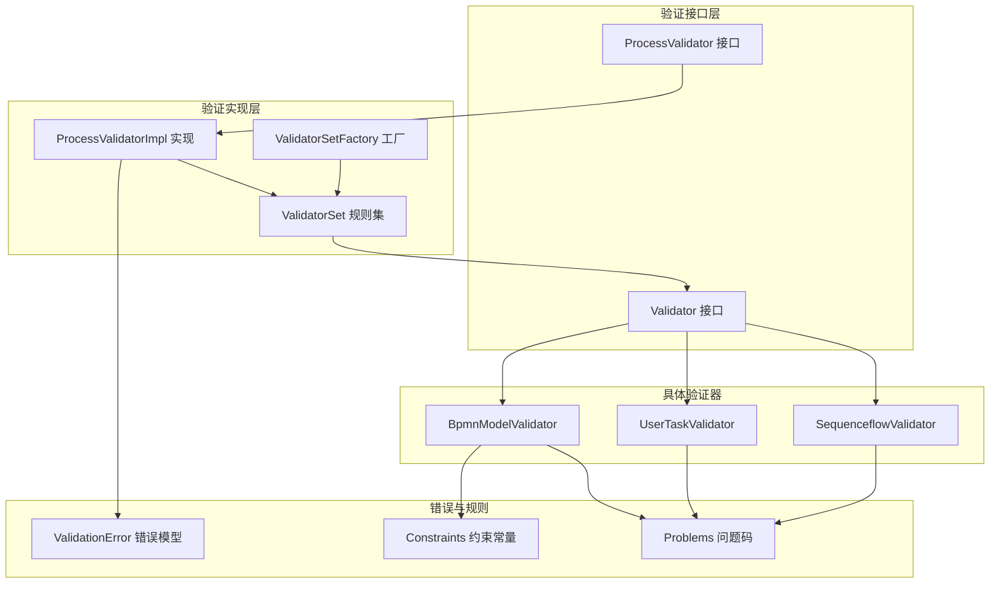
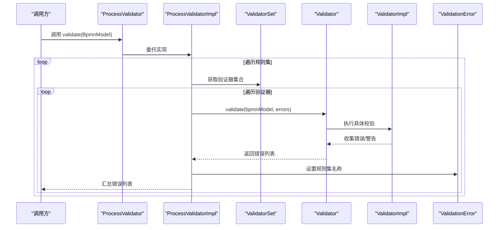
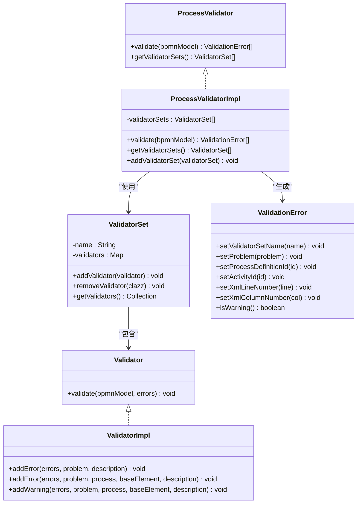
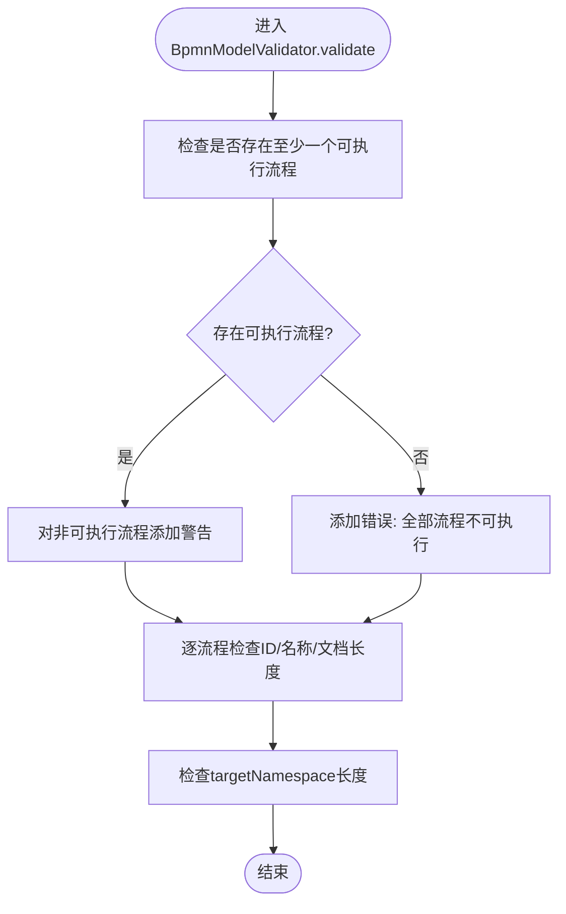
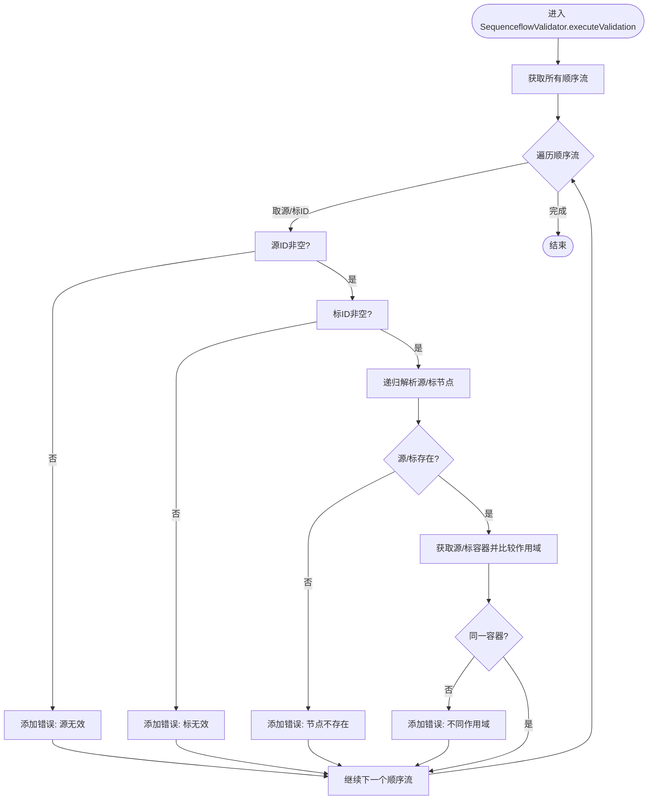
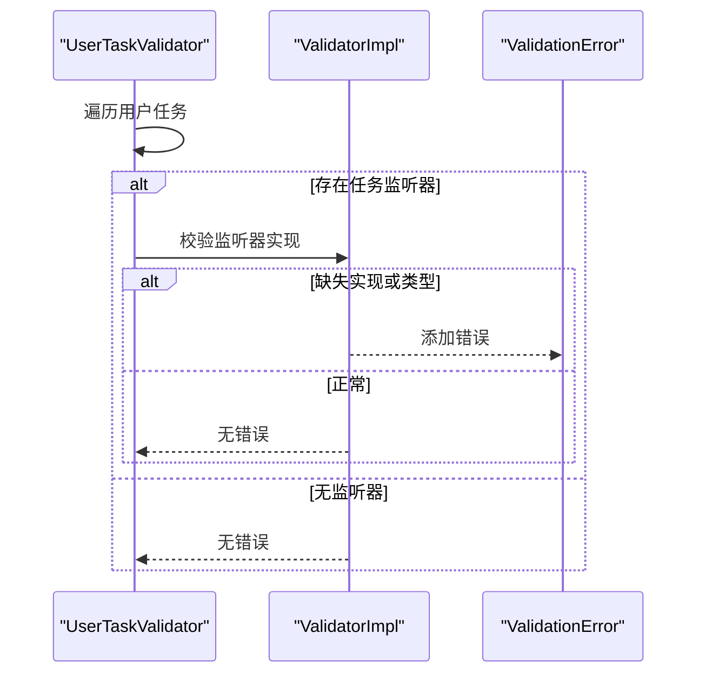
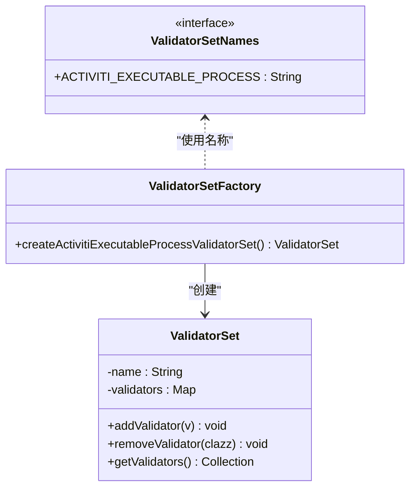
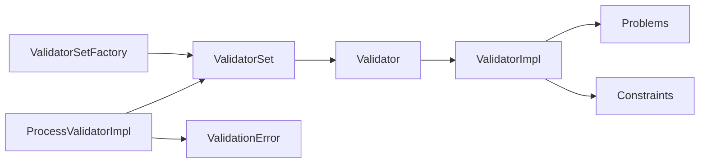

# 配置验证与校验

<cite>
**本文引用的文件**
- [ProcessValidator.java](file://antflow-base/src/main/java/org/activiti/validation/ProcessValidator.java)
- [ProcessValidatorImpl.java](file://antflow-base/src/main/java/org/activiti/validation/ProcessValidatorImpl.java)
- [ValidationError.java](file://antflow-base/src/main/java/org/activiti/validation/ValidationError.java)
- [Validator.java](file://antflow-base/src/main/java/org/activiti/validation/validator/Validator.java)
- [ValidatorImpl.java](file://antflow-base/src/main/java/org/activiti/validation/validator/ValidatorImpl.java)
- [ValidatorSet.java](file://antflow-base/src/main/java/org/activiti/validation/validator/ValidatorSet.java)
- [ValidatorSetFactory.java](file://antflow-base/src/main/java/org/activiti/validation/validator/ValidatorSetFactory.java)
- [ValidatorSetNames.java](file://antflow-base/src/main/java/org/activiti/validation/validator/ValidatorSetNames.java)
- [BpmnModelValidator.java](file://antflow-base/src/main/java/org/activiti/validation/validator/impl/BpmnModelValidator.java)
- [UserTaskValidator.java](file://antflow-base/src/main/java/org/activiti/validation/validator/impl/UserTaskValidator.java)
- [SequenceflowValidator.java](file://antflow-base/src/main/java/org/activiti/validation/validator/impl/SequenceflowValidator.java)
- [Constraints.java](file://antflow-base/src/main/java/org/activiti/validation/validator/Constraints.java)
- [Problems.java](file://antflow-base/src/main/java/org/activiti/validation/validator/Problems.java)
</cite>

## 目录
1. [简介](#简介)
2. [项目结构](#项目结构)
3. [核心组件](#核心组件)
4. [架构总览](#架构总览)
5. [详细组件分析](#详细组件分析)
6. [依赖关系分析](#依赖关系分析)
7. [性能考量](#性能考量)
8. [故障排查指南](#故障排查指南)
9. [结论](#结论)
10. [附录](#附录)

## 简介
本文件面向AntFlow工作流系统的“配置验证与校验”模块，系统性梳理配置验证的规则体系、验证时机、验证级别设置，以及在BPMN模型层面的完整性与节点有效性校验机制。文档覆盖以下主题：
- 规则体系：基于问题码与约束常量的统一错误描述与长度限制
- 验证时机：部署前或运行前对BPMN模型进行批量化校验
- 验证级别：通过ValidatorSet分组控制启用/禁用特定规则集
- BPMN模型验证：可执行性、命名与文档长度等基础约束
- 流程完整性检查：起始事件、顺序流连接性与作用域一致性
- 节点有效性验证：用户任务监听器、网关分支条件等
- 校验器实现机制：抽象基类统一错误收集、错误上下文定位
- 自定义验证规则：新增Validator并加入ValidatorSet
- 验证结果处理：错误对象携带位置信息与附加属性
- 批量验证与报告：按规则集聚合输出，便于生成报告与修复指引

## 项目结构
验证模块位于antflow-base工程中，采用分层设计：
- 接口层：ProcessValidator、Validator接口定义验证契约
- 实现层：ProcessValidatorImpl负责遍历ValidatorSet与Validator执行验证
- 错误模型：ValidationError承载错误上下文与定位信息
- 规则集：ValidatorSet封装一组验证器；ValidatorSetFactory提供默认规则集
- 具体验证器：如BpmnModelValidator、UserTaskValidator、SequenceflowValidator等
- 常量与问题码：Constraints与Problems集中定义约束上限与问题标识

图表来源
- [ProcessValidator.java:25-39](file://antflow-base/src/main/java/org/activiti/validation/ProcessValidator.java#L25-L39)
- [ProcessValidatorImpl.java:25-64](file://antflow-base/src/main/java/org/activiti/validation/ProcessValidatorImpl.java#L25-L64)
- [Validator.java:23-27](file://antflow-base/src/main/java/org/activiti/validation/validator/Validator.java#L23-L27)
- [ValidatorSet.java:22-61](file://antflow-base/src/main/java/org/activiti/validation/validator/ValidatorSet.java#L22-L61)
- [ValidatorSetFactory.java:45-84](file://antflow-base/src/main/java/org/activiti/validation/validator/ValidatorSetFactory.java#L45-L84)
- [BpmnModelValidator.java:28-90](file://antflow-base/src/main/java/org/activiti/validation/validator/impl/BpmnModelValidator.java#L28-L90)
- [UserTaskValidator.java:28-45](file://antflow-base/src/main/java/org/activiti/validation/validator/impl/UserTaskValidator.java#L28-L45)
- [SequenceflowValidator.java:30-77](file://antflow-base/src/main/java/org/activiti/validation/validator/impl/SequenceflowValidator.java#L30-L77)
- [ValidationError.java:16-159](file://antflow-base/src/main/java/org/activiti/validation/ValidationError.java#L16-L159)
- [Constraints.java:18-40](file://antflow-base/src/main/java/org/activiti/validation/validator/Constraints.java#L18-L40)
- [Problems.java:19-124](file://antflow-base/src/main/java/org/activiti/validation/validator/Problems.java#L19-L124)

章节来源
- [ProcessValidator.java:25-39](file://antflow-base/src/main/java/org/activiti/validation/ProcessValidator.java#L25-L39)
- [ProcessValidatorImpl.java:25-64](file://antflow-base/src/main/java/org/activiti/validation/ProcessValidatorImpl.java#L25-L64)
- [ValidatorSetFactory.java:45-84](file://antflow-base/src/main/java/org/activiti/validation/validator/ValidatorSetFactory.java#L45-L84)

## 核心组件
- ProcessValidator：定义validate(BpmnModel)返回ValidationError列表，并暴露可用的ValidatorSet集合
- ProcessValidatorImpl：遍历ValidatorSet中的所有Validator，逐个执行validate并将错误归集，同时为每个错误标注所属的ValidatorSet名称
- Validator与ValidatorImpl：Validator定义validate方法；ValidatorImpl提供统一的addError/addWarning工具，自动填充流程、节点、XML行列号等上下文
- ValidatorSet与ValidatorSetFactory：以命名规则集组织多个Validator；工厂提供默认的“可执行流程”规则集
- ValidationError：承载问题码、默认描述、流程/节点标识、XML坐标、是否警告等
- 具体验证器：BpmnModelValidator（模型与流程基础约束）、UserTaskValidator（用户任务监听器）、SequenceflowValidator（顺序流连接性）
- 规则与问题码：Constraints集中长度限制；Problems集中问题码，便于国际化映射与统一处理

章节来源
- [ProcessValidator.java:25-39](file://antflow-base/src/main/java/org/activiti/validation/ProcessValidator.java#L25-L39)
- [ProcessValidatorImpl.java:25-64](file://antflow-base/src/main/java/org/activiti/validation/ProcessValidatorImpl.java#L25-L64)
- [Validator.java:23-27](file://antflow-base/src/main/java/org/activiti/validation/validator/Validator.java#L23-L27)
- [ValidatorImpl.java:25-87](file://antflow-base/src/main/java/org/activiti/validation/validator/ValidatorImpl.java#L25-L87)
- [ValidatorSet.java:22-61](file://antflow-base/src/main/java/org/activiti/validation/validator/ValidatorSet.java#L22-L61)
- [ValidatorSetFactory.java:45-84](file://antflow-base/src/main/java/org/activiti/validation/validator/ValidatorSetFactory.java#L45-L84)
- [ValidationError.java:16-159](file://antflow-base/src/main/java/org/activiti/validation/ValidationError.java#L16-L159)
- [BpmnModelValidator.java:28-90](file://antflow-base/src/main/java/org/activiti/validation/validator/impl/BpmnModelValidator.java#L28-L90)
- [UserTaskValidator.java:28-45](file://antflow-base/src/main/java/org/activiti/validation/validator/impl/UserTaskValidator.java#L28-L45)
- [SequenceflowValidator.java:30-77](file://antflow-base/src/main/java/org/activiti/validation/validator/impl/SequenceflowValidator.java#L30-L77)
- [Constraints.java:18-40](file://antflow-base/src/main/java/org/activiti/validation/validator/Constraints.java#L18-L40)
- [Problems.java:19-124](file://antflow-base/src/main/java/org/activiti/validation/validator/Problems.java#L19-L124)

## 架构总览
下图展示从调用入口到具体验证器执行的完整链路，以及错误对象如何携带上下文信息：

图表来源
- [ProcessValidator.java:31](file://antflow-base/src/main/java/org/activiti/validation/ProcessValidator.java#L31)
- [ProcessValidatorImpl.java:30-47](file://antflow-base/src/main/java/org/activiti/validation/ProcessValidatorImpl.java#L30-L47)
- [Validator.java:25](file://antflow-base/src/main/java/org/activiti/validation/validator/Validator.java#L25)
- [ValidatorImpl.java:27-70](file://antflow-base/src/main/java/org/activiti/validation/validator/ValidatorImpl.java#L27-L70)

## 详细组件分析

### 组件A：验证器接口与实现
- 设计要点
  - Validator接口仅定义validate方法，职责单一，便于扩展新规则
  - ValidatorImpl提供统一的错误构造与上下文填充逻辑，减少重复代码
  - ProcessValidatorImpl负责遍历ValidatorSet与Validator，统一错误归集与规则集标记
- 数据结构与复杂度
  - 遍历复杂度近似O(N×M)，N为规则集数量，M为各规则集内验证器数量
  - 错误收集为线性时间，最终一次性返回
- 错误处理
  - 支持错误与警告两类，通过isWarning区分
  - 自动填充流程定义ID/名称、节点ID/名称、XML行列号等定位信息
- 性能影响
  - 验证器数量增加会线性增加验证时间
  - 建议按需启用规则集，避免不必要的全量校验

图表来源
- [ProcessValidator.java:25-39](file://antflow-base/src/main/java/org/activiti/validation/ProcessValidator.java#L25-L39)
- [ProcessValidatorImpl.java:25-64](file://antflow-base/src/main/java/org/activiti/validation/ProcessValidatorImpl.java#L25-L64)
- [Validator.java:23-27](file://antflow-base/src/main/java/org/activiti/validation/validator/Validator.java#L23-L27)
- [ValidatorImpl.java:25-87](file://antflow-base/src/main/java/org/activiti/validation/validator/ValidatorImpl.java#L25-L87)
- [ValidatorSet.java:22-61](file://antflow-base/src/main/java/org/activiti/validation/validator/ValidatorSet.java#L22-L61)
- [ValidationError.java:16-159](file://antflow-base/src/main/java/org/activiti/validation/ValidationError.java#L16-L159)

章节来源
- [ProcessValidator.java:25-39](file://antflow-base/src/main/java/org/activiti/validation/ProcessValidator.java#L25-L39)
- [ProcessValidatorImpl.java:25-64](file://antflow-base/src/main/java/org/activiti/validation/ProcessValidatorImpl.java#L25-L64)
- [ValidatorImpl.java:25-87](file://antflow-base/src/main/java/org/activiti/validation/validator/ValidatorImpl.java#L25-L87)
- [ValidatorSet.java:22-61](file://antflow-base/src/main/java/org/activiti/validation/validator/ValidatorSet.java#L22-L61)
- [ValidationError.java:16-159](file://antflow-base/src/main/java/org/activiti/validation/ValidationError.java#L16-L159)

### 组件B：BPMN模型验证（基础约束）
- 验证目标
  - 至少存在一个可执行流程定义
  - 对非可执行流程定义发出警告
  - 校验流程ID/名称/文档长度上限
  - 校验BPMN模型targetNamespace长度上限
- 规则来源
  - 通过Constraints定义长度上限
  - 通过Problems定义问题码
- 错误上下文
  - 使用ValidatorImpl自动填充流程与XML坐标

图表来源
- [BpmnModelValidator.java:30-88](file://antflow-base/src/main/java/org/activiti/validation/validator/impl/BpmnModelValidator.java#L30-L88)
- [Constraints.java:23-38](file://antflow-base/src/main/java/org/activiti/validation/validator/Constraints.java#L23-L38)
- [Problems.java:21-22](file://antflow-base/src/main/java/org/activiti/validation/validator/Problems.java#L21-L22)

章节来源
- [BpmnModelValidator.java:28-90](file://antflow-base/src/main/java/org/activiti/validation/validator/impl/BpmnModelValidator.java#L28-L90)
- [Constraints.java:18-40](file://antflow-base/src/main/java/org/activiti/validation/validator/Constraints.java#L18-L40)
- [Problems.java:19-124](file://antflow-base/src/main/java/org/activiti/validation/validator/Problems.java#L19-L124)

### 组件C：流程完整性检查（顺序流）
- 验证目标
  - 源/标引用非空
  - 递归查找源/标节点，确保存在
  - 同一作用域内容器一致性校验（避免跨边界连接）
- 规则来源
  - Problems提供问题码
- 错误上下文
  - 自动填充流程与节点信息

图表来源
- [SequenceflowValidator.java:32-74](file://antflow-base/src/main/java/org/activiti/validation/validator/impl/SequenceflowValidator.java#L32-L74)
- [Problems.java:37-38](file://antflow-base/src/main/java/org/activiti/validation/validator/Problems.java#L37-L38)

章节来源
- [SequenceflowValidator.java:30-77](file://antflow-base/src/main/java/org/activiti/validation/validator/impl/SequenceflowValidator.java#L30-L77)
- [Problems.java:19-124](file://antflow-base/src/main/java/org/activiti/validation/validator/Problems.java#L19-L124)

### 组件D：节点有效性验证（用户任务监听器）
- 验证目标
  - 用户任务的任务监听器必须提供实现类型或表达式
- 规则来源
  - Problems提供问题码
- 错误上下文
  - 自动填充流程与节点信息

图表来源
- [UserTaskValidator.java:30-42](file://antflow-base/src/main/java/org/activiti/validation/validator/impl/UserTaskValidator.java#L30-L42)
- [Problems.java:40](file://antflow-base/src/main/java/org/activiti/validation/validator/Problems.java#L40)

章节来源
- [UserTaskValidator.java:28-45](file://antflow-base/src/main/java/org/activiti/validation/validator/impl/UserTaskValidator.java#L28-L45)
- [Problems.java:19-124](file://antflow-base/src/main/java/org/activiti/validation/validator/Problems.java#L19-L124)

### 组件E：验证级别与规则集
- ValidatorSetNames：定义规则集名称（如“可执行流程”）
- ValidatorSet：以名称+键值对维护验证器实例，支持增删
- ValidatorSetFactory：提供默认规则集，包含模型、流程、事件、任务、网关、监听器、DI等验证器
- 验证时机：通常在部署或保存流程定义时触发，确保可执行性与完整性

图表来源
- [ValidatorSetNames.java:15-19](file://antflow-base/src/main/java/org/activiti/validation/validator/ValidatorSetNames.java#L15-L19)
- [ValidatorSet.java:22-61](file://antflow-base/src/main/java/org/activiti/validation/validator/ValidatorSet.java#L22-L61)
- [ValidatorSetFactory.java:47-82](file://antflow-base/src/main/java/org/activiti/validation/validator/ValidatorSetFactory.java#L47-L82)

章节来源
- [ValidatorSetNames.java:15-19](file://antflow-base/src/main/java/org/activiti/validation/validator/ValidatorSetNames.java#L15-L19)
- [ValidatorSet.java:22-61](file://antflow-base/src/main/java/org/activiti/validation/validator/ValidatorSet.java#L22-L61)
- [ValidatorSetFactory.java:45-84](file://antflow-base/src/main/java/org/activiti/validation/validator/ValidatorSetFactory.java#L45-L84)

### 组件F：验证结果处理与报告
- ValidationError统一承载问题码、默认描述、流程/节点标识、XML坐标、是否警告
- ProcessValidatorImpl为每个错误设置所属ValidatorSet名称，便于分类统计
- 报告生成建议
  - 按规则集分组汇总错误
  - 提取流程ID/名称、节点ID/名称、XML行列号用于定位
  - 区分错误与警告，优先修复错误

章节来源
- [ValidationError.java:16-159](file://antflow-base/src/main/java/org/activiti/validation/ValidationError.java#L16-L159)
- [ProcessValidatorImpl.java:39-42](file://antflow-base/src/main/java/org/activiti/validation/ProcessValidatorImpl.java#L39-L42)

## 依赖关系分析
- ProcessValidatorImpl依赖ValidatorSet与Validator接口，体现高层策略与底层实现的解耦
- ValidatorImpl依赖BpmnModel/Process/FlowElement等模型元素，用于提取上下文信息
- 具体验证器依赖Problems与Constraints，保证规则的一致性与可维护性
- ValidatorSetFactory集中注册默认验证器，便于统一启用/禁用

图表来源
- [ProcessValidatorImpl.java:25-64](file://antflow-base/src/main/java/org/activiti/validation/ProcessValidatorImpl.java#L25-L64)
- [ValidatorSetFactory.java:45-84](file://antflow-base/src/main/java/org/activiti/validation/validator/ValidatorSetFactory.java#L45-L84)
- [ValidatorImpl.java:25-87](file://antflow-base/src/main/java/org/activiti/validation/validator/ValidatorImpl.java#L25-L87)
- [Problems.java:19-124](file://antflow-base/src/main/java/org/activiti/validation/validator/Problems.java#L19-L124)
- [Constraints.java:18-40](file://antflow-base/src/main/java/org/activiti/validation/validator/Constraints.java#L18-L40)

章节来源
- [ProcessValidatorImpl.java:25-64](file://antflow-base/src/main/java/org/activiti/validation/ProcessValidatorImpl.java#L25-L64)
- [ValidatorSetFactory.java:45-84](file://antflow-base/src/main/java/org/activiti/validation/validator/ValidatorSetFactory.java#L45-L84)
- [ValidatorImpl.java:25-87](file://antflow-base/src/main/java/org/activiti/validation/validator/ValidatorImpl.java#L25-L87)
- [Problems.java:19-124](file://antflow-base/src/main/java/org/activiti/validation/validator/Problems.java#L19-L124)
- [Constraints.java:18-40](file://antflow-base/src/main/java/org/activiti/validation/validator/Constraints.java#L18-L40)

## 性能考量
- 验证复杂度与规则集规模线性相关，建议：
  - 按需启用规则集，避免全量校验
  - 将耗时规则（如跨容器作用域检查）放在必要场景
- 错误收集为线性时间，整体开销可控
- 可考虑缓存已解析的BpmnModel上下文，减少重复计算

## 故障排查指南
- 常见问题与定位
  - 全流程不可执行：检查流程定义的可执行属性
  - 顺序流源/标无效：核对源/标ID是否正确且存在于当前作用域
  - 用户任务监听器缺失实现：为监听器提供实现类型或表达式
  - 文本长度超限：缩短流程ID/名称/文档或targetNamespace
- 定位手段
  - 利用ValidationError中的流程ID/名称、节点ID/名称、XML行列号快速定位
  - 按规则集分组查看，优先修复错误类问题

章节来源
- [Problems.java:19-124](file://antflow-base/src/main/java/org/activiti/validation/validator/Problems.java#L19-L124)
- [ValidationError.java:16-159](file://antflow-base/src/main/java/org/activiti/validation/ValidationError.java#L16-L159)

## 结论
该验证模块通过清晰的接口与实现分离、统一的错误模型与上下文填充、可插拔的规则集机制，实现了对BPMN配置的系统化校验。结合默认规则集与自定义规则扩展，可在部署前有效保障流程的可执行性与完整性，提升系统稳定性与可维护性。

## 附录
- 自定义验证规则步骤
  - 新建实现Validator接口的类，在executeValidation中编写校验逻辑
  - 使用ValidatorImpl的addError/addWarning方法记录错误
  - 在ValidatorSetFactory中将新验证器加入目标规则集
  - 通过ProcessValidator.getValidatorSets()启用新规则
- 配置导入验证与批量验证
  - 导入流程定义后统一调用ProcessValidator.validate
  - 对多个流程定义循环执行validate，合并ValidationError列表
  - 依据规则集分组生成报告，指导修复

章节来源
- [Validator.java:23-27](file://antflow-base/src/main/java/org/activiti/validation/validator/Validator.java#L23-L27)
- [ValidatorImpl.java:25-87](file://antflow-base/src/main/java/org/activiti/validation/validator/ValidatorImpl.java#L25-L87)
- [ValidatorSetFactory.java:45-84](file://antflow-base/src/main/java/org/activiti/validation/validator/ValidatorSetFactory.java#L45-L84)
- [ProcessValidator.java:31](file://antflow-base/src/main/java/org/activiti/validation/ProcessValidator.java#L31)