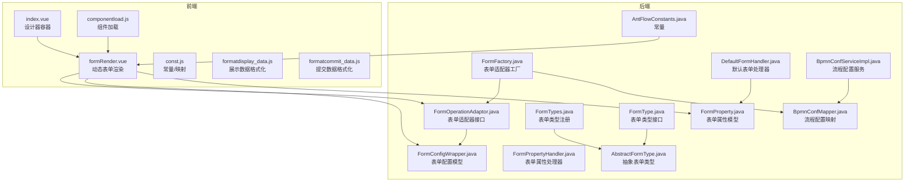
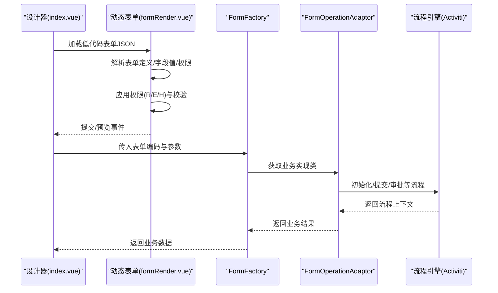
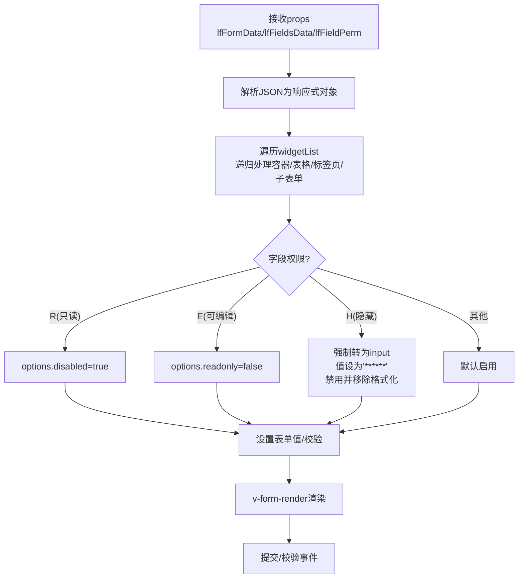
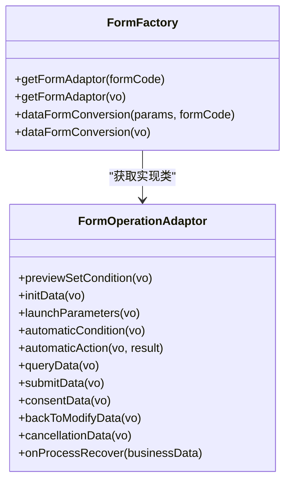
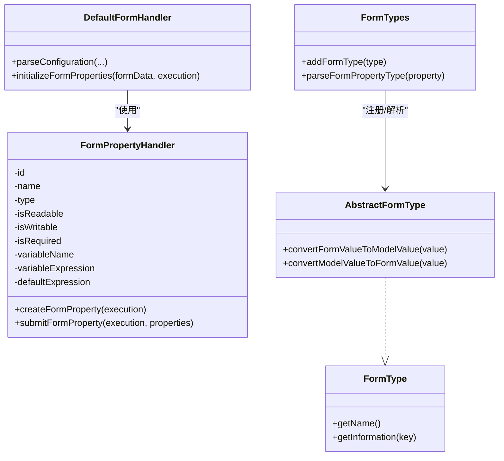
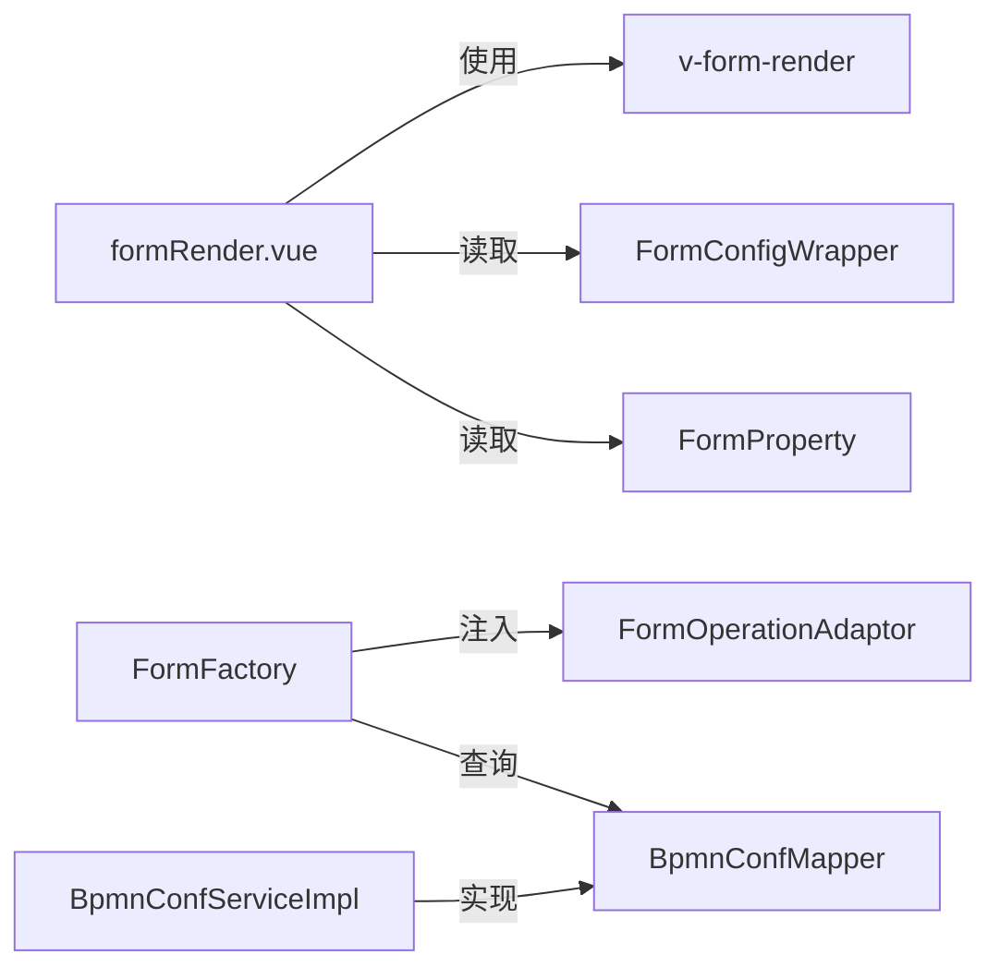

# 低代码表单引擎

<cite>
**本文引用的文件**
- [formRender.vue](file://antflow-vue/src/components/Workflow/DynamicForm/formRender.vue)
- [index.vue](file://antflow-vue/src/components/Workflow/DynamicForm/index.vue)
- [componentload.js](file://antflow-vue/src/views/workflow/components/componentload.js)
- [const.js](file://antflow-vue/src/utils/antflow/const.js)
- [formatdisplay_data.js](file://antflow-vue/src/utils/antflow/formatdisplay_data.js)
- [formatcommit_data.js](file://antflow-vue/src/utils/antflow/formatcommit_data.js)
- [FormFactory.java](file://antflow-engine/src/main/java/org/openoa/engine/factory/FormFactory.java)
- [FormOperationAdaptor.java](file://antflow-base/src/main/java/org/openoa/base/interf/FormOperationAdaptor.java)
- [FormConfigWrapper.java](file://antflow-base/src/main/java/org/openoa/base/vo/FormConfigWrapper.java)
- [FormPropertyHandler.java](file://antflow-base/src/main/java/org/activiti/engine/impl/form/FormPropertyHandler.java)
- [FormProperty.java](file://antflow-base/src/main/java/org/activiti/bpmn/model/FormProperty.java)
- [DefaultFormHandler.java](file://antflow-base/src/main/java/org/activiti/engine/impl/form/DefaultFormHandler.java)
- [FormTypes.java](file://antflow-base/src/main/java/org/activiti/engine/impl/form/FormTypes.java)
- [AbstractFormType.java](file://antflow-base/src/main/java/org/activiti/engine/form/AbstractFormType.java)
- [FormType.java](file://antflow-base/src/main/java/org/activiti/engine/form/FormType.java)
- [BpmnConfMapper.java](file://antflow-engine/src/main/java/org/openoa/engine/bpmnconf/mapper/BpmnConfMapper.java)
- [BpmnConfServiceImpl.java](file://antflow-engine/src/main/java/org/openoa/engine/bpmnconf/service/impl/BpmnConfServiceImpl.java)
- [AntFlowConstants.java](file://antflow-engine/src/main/java/org/openoa/engine/bpmnconf/constant/AntFlowConstants.java)
- [15.表单组件和动态表单.md](file://doc/系统介绍篇/15.表单组件和动态表单.md)
- [16.dashboard和任务管理.md](file://doc/系统介绍篇/16.dashboard和任务管理.md)
</cite>

## 目录
1. [简介](#简介)
2. [项目结构](#项目结构)
3. [核心组件](#核心组件)
4. [架构总览](#架构总览)
5. [详细组件分析](#详细组件分析)
6. [依赖分析](#依赖分析)
7. [性能考虑](#性能考虑)
8. [故障排查指南](#故障排查指南)
9. [结论](#结论)
10. [附录](#附录)

## 简介
本技术文档围绕低代码表单引擎展开，系统性阐述基于“字典/JSON”的表单代码管理系统、动态表单字段处理机制、数据持久化策略；说明表单设计器与渲染器的工作原理、验证规则配置方法；解释低代码表单与业务数据的绑定关系、表单数据存储结构与版本管理；并提供组件库扩展与自定义表单类型的开发指南及完整集成方案。

## 项目结构
低代码表单引擎由前端动态表单渲染与后端表单适配器两大部分组成：
- 前端：动态表单渲染组件、设计器联动、字段权限与校验处理、数据格式化工具
- 后端：表单适配器接口与工厂、流程表单属性处理、表单类型体系、配置持久化

图表来源
- [formRender.vue:1-258](file://antflow-vue/src/components/Workflow/DynamicForm/formRender.vue#L1-L258)
- [index.vue:25-79](file://antflow-vue/src/components/Workflow/DynamicForm/index.vue#L25-L79)
- [componentload.js:1-33](file://antflow-vue/src/views/workflow/components/componentload.js#L1-L33)
- [const.js:172-180](file://antflow-vue/src/utils/antflow/const.js#L172-L180)
- [formatdisplay_data.js:1-232](file://antflow-vue/src/utils/antflow/formatdisplay_data.js#L1-L232)
- [formatcommit_data.js:1-300](file://antflow-vue/src/utils/antflow/formatcommit_data.js#L1-L300)
- [FormFactory.java:1-159](file://antflow-engine/src/main/java/org/openoa/engine/factory/FormFactory.java#L1-L159)
- [FormOperationAdaptor.java:1-106](file://antflow-base/src/main/java/org/openoa/base/interf/FormOperationAdaptor.java#L1-L106)
- [FormConfigWrapper.java:1-94](file://antflow-base/src/main/java/org/openoa/base/vo/FormConfigWrapper.java#L1-L94)
- [FormPropertyHandler.java:1-192](file://antflow-base/src/main/java/org/activiti/engine/impl/form/FormPropertyHandler.java#L1-L192)
- [FormProperty.java:41-120](file://antflow-base/src/main/java/org/activiti/bpmn/model/FormProperty.java#L41-L120)
- [DefaultFormHandler.java:63-92](file://antflow-base/src/main/java/org/activiti/engine/impl/form/DefaultFormHandler.java#L63-L92)
- [FormTypes.java:1-40](file://antflow-base/src/main/java/org/activiti/engine/impl/form/FormTypes.java#L1-L40)
- [AbstractFormType.java:1-36](file://antflow-base/src/main/java/org/activiti/engine/form/AbstractFormType.java#L1-L36)
- [FormType.java:1-35](file://antflow-base/src/main/java/org/activiti/engine/form/FormType.java#L1-L35)
- [BpmnConfMapper.java:1-31](file://antflow-engine/src/main/java/org/openoa/engine/bpmnconf/mapper/BpmnConfMapper.java#L1-L31)
- [BpmnConfServiceImpl.java:1-21](file://antflow-engine/src/main/java/org/openoa/engine/bpmnconf/service/impl/BpmnConfServiceImpl.java#L1-L21)
- [AntFlowConstants.java:1-92](file://antflow-engine/src/main/java/org/openoa/engine/bpmnconf/constant/AntFlowConstants.java#L1-L92)

章节来源
- [formRender.vue:1-258](file://antflow-vue/src/components/Workflow/DynamicForm/formRender.vue#L1-L258)
- [index.vue:25-79](file://antflow-vue/src/components/Workflow/DynamicForm/index.vue#L25-L79)
- [componentload.js:1-33](file://antflow-vue/src/views/workflow/components/componentload.js#L1-L33)
- [const.js:172-180](file://antflow-vue/src/utils/antflow/const.js#L172-L180)
- [formatdisplay_data.js:1-232](file://antflow-vue/src/utils/antflow/formatdisplay_data.js#L1-L232)
- [formatcommit_data.js:1-300](file://antflow-vue/src/utils/antflow/formatcommit_data.js#L1-L300)
- [FormFactory.java:1-159](file://antflow-engine/src/main/java/org/openoa/engine/factory/FormFactory.java#L1-L159)
- [FormOperationAdaptor.java:1-106](file://antflow-base/src/main/java/org/openoa/base/interf/FormOperationAdaptor.java#L1-L106)
- [FormConfigWrapper.java:1-94](file://antflow-base/src/main/java/org/openoa/base/vo/FormConfigWrapper.java#L1-L94)
- [FormPropertyHandler.java:1-192](file://antflow-base/src/main/java/org/activiti/engine/impl/form/FormPropertyHandler.java#L1-L192)
- [FormProperty.java:41-120](file://antflow-base/src/main/java/org/activiti/bpmn/model/FormProperty.java#L41-L120)
- [DefaultFormHandler.java:63-92](file://antflow-base/src/main/java/org/activiti/engine/impl/form/DefaultFormHandler.java#L63-L92)
- [FormTypes.java:1-40](file://antflow-base/src/main/java/org/activiti/engine/impl/form/FormTypes.java#L1-L40)
- [AbstractFormType.java:1-36](file://antflow-base/src/main/java/org/activiti/engine/form/AbstractFormType.java#L1-L36)
- [FormType.java:1-35](file://antflow-base/src/main/java/org/activiti/engine/form/FormType.java#L1-L35)
- [BpmnConfMapper.java:1-31](file://antflow-engine/src/main/java/org/openoa/engine/bpmnconf/mapper/BpmnConfMapper.java#L1-L31)
- [BpmnConfServiceImpl.java:1-21](file://antflow-engine/src/main/java/org/openoa/engine/bpmnconf/service/impl/BpmnConfServiceImpl.java#L1-L21)
- [AntFlowConstants.java:1-92](file://antflow-engine/src/main/java/org/openoa/engine/bpmnconf/constant/AntFlowConstants.java#L1-L92)

## 核心组件
- 前端动态表单渲染器：负责将低代码表单JSON转换为可交互的表单视图，支持字段权限控制、动态校验、提交与预览。
- 表单设计器容器：监听设计器变更，同步更新低代码表单字段定义与数据。
- 组件加载器：按业务表单编码映射动态加载DIY表单组件，或加载统一的低代码表单渲染组件。
- 表单适配器与工厂：后端通过FormOperationAdaptor定义业务数据生命周期方法，FormFactory按表单编码解析并注入具体实现。
- 表单属性与类型体系：基于Activiti的FormProperty与FormPropertyHandler，结合自定义AbstractFormType实现类型转换与默认值处理。
- 数据格式化工具：将流程节点树结构转换为设计器可用的扁平列表，以及将节点属性适配为流程引擎期望的数据结构。
- 配置持久化：BpmnConfMapper/Service负责流程配置的查询与分页，支撑低代码表单与流程配置的持久化。

章节来源
- [formRender.vue:1-258](file://antflow-vue/src/components/Workflow/DynamicForm/formRender.vue#L1-L258)
- [index.vue:25-79](file://antflow-vue/src/components/Workflow/DynamicForm/index.vue#L25-L79)
- [componentload.js:1-33](file://antflow-vue/src/views/workflow/components/componentload.js#L1-L33)
- [FormFactory.java:1-159](file://antflow-engine/src/main/java/org/openoa/engine/factory/FormFactory.java#L1-L159)
- [FormOperationAdaptor.java:1-106](file://antflow-base/src/main/java/org/openoa/base/interf/FormOperationAdaptor.java#L1-L106)
- [FormPropertyHandler.java:1-192](file://antflow-base/src/main/java/org/activiti/engine/impl/form/FormPropertyHandler.java#L1-L192)
- [FormTypes.java:1-40](file://antflow-base/src/main/java/org/activiti/engine/impl/form/FormTypes.java#L1-L40)
- [formatdisplay_data.js:1-232](file://antflow-vue/src/utils/antflow/formatdisplay_data.js#L1-L232)
- [formatcommit_data.js:1-300](file://antflow-vue/src/utils/antflow/formatcommit_data.js#L1-L300)
- [BpmnConfMapper.java:1-31](file://antflow-engine/src/main/java/org/openoa/engine/bpmnconf/mapper/BpmnConfMapper.java#L1-L31)
- [BpmnConfServiceImpl.java:1-21](file://antflow-engine/src/main/java/org/openoa/engine/bpmnconf/service/impl/BpmnConfServiceImpl.java#L1-L21)

## 架构总览
低代码表单引擎采用“前端动态渲染 + 后端适配器”的分层架构：
- 设计器侧：通过index.vue监听设计器变更，将表单定义JSON写入store并触发渲染器更新。
- 渲染侧：formRender.vue接收表单定义、字段值与权限信息，递归遍历字段树，应用权限与校验，最终交给v-form-render生成UI。
- 业务侧：FormFactory根据表单编码解析业务实现类，调用FormOperationAdaptor的生命周期方法完成数据初始化、提交、审批等逻辑。
- 类型与属性：FormPropertyHandler与FormTypes负责表单属性的读取、默认值、类型转换与持久化变量绑定。

图表来源
- [index.vue:25-79](file://antflow-vue/src/components/Workflow/DynamicForm/index.vue#L25-L79)
- [formRender.vue:1-258](file://antflow-vue/src/components/Workflow/DynamicForm/formRender.vue#L1-L258)
- [FormFactory.java:1-159](file://antflow-engine/src/main/java/org/openoa/engine/factory/FormFactory.java#L1-L159)
- [FormOperationAdaptor.java:1-106](file://antflow-base/src/main/java/org/openoa/base/interf/FormOperationAdaptor.java#L1-L106)

## 详细组件分析

### 前端动态表单渲染器（formRender.vue）
- 输入：低代码表单定义JSON、字段值、字段权限、是否显示提交按钮、是否预览模式
- 处理：
  - 递归遍历widgetList，应用权限控制（只读/可编辑/隐藏）
  - 数字/选择类字段做类型转换
  - 将表单定义与数据分别设置给v-form-render
  - 提交时触发表单校验，合并自选审批人信息后输出
- 输出：标准化的表单数据字符串，供后端适配器处理

图表来源
- [formRender.vue:64-138](file://antflow-vue/src/components/Workflow/DynamicForm/formRender.vue#L64-L138)
- [formRender.vue:159-210](file://antflow-vue/src/components/Workflow/DynamicForm/formRender.vue#L159-L210)

章节来源
- [formRender.vue:1-258](file://antflow-vue/src/components/Workflow/DynamicForm/formRender.vue#L1-L258)

### 表单设计器容器（index.vue）
- 监听设计器DOM变化，将设计器导出的表单JSON写入store，驱动渲染器刷新
- 提供getData/getFieldList方法，供外部调用获取表单数据与字段列表

章节来源
- [index.vue:25-79](file://antflow-vue/src/components/Workflow/DynamicForm/index.vue#L25-L79)

### 组件加载器（componentload.js）
- 按业务表单编码映射加载DIY表单组件
- 低代码表单统一使用formRender作为渲染入口

章节来源
- [componentload.js:1-33](file://antflow-vue/src/views/workflow/components/componentload.js#L1-L33)
- [const.js:172-180](file://antflow-vue/src/utils/antflow/const.js#L172-L180)

### 数据格式化工具
- 展示数据格式化：将节点列表转换为树形结构，补充节点配置与并行/条件分支信息
- 提交数据格式化：将树形结构展平为节点数组，适配流程引擎所需的节点属性与审批人配置

章节来源
- [formatdisplay_data.js:1-232](file://antflow-vue/src/utils/antflow/formatdisplay_data.js#L1-L232)
- [formatcommit_data.js:1-300](file://antflow-vue/src/utils/antflow/formatcommit_data.js#L1-L300)

### 后端表单适配器与工厂（FormOperationAdaptor/FormFactory）
- FormOperationAdaptor定义业务数据生命周期方法：初始化、启动参数、自动条件/动作、查询/提交/审批、撤销、流程恢复等
- FormFactory根据表单编码解析业务实现类，支持外部访问流程场景的数据转换与Bean注入

图表来源
- [FormOperationAdaptor.java:1-106](file://antflow-base/src/main/java/org/openoa/base/interf/FormOperationAdaptor.java#L1-L106)
- [FormFactory.java:1-159](file://antflow-engine/src/main/java/org/openoa/engine/factory/FormFactory.java#L1-L159)

章节来源
- [FormOperationAdaptor.java:1-106](file://antflow-base/src/main/java/org/openoa/base/interf/FormOperationAdaptor.java#L1-L106)
- [FormFactory.java:1-159](file://antflow-engine/src/main/java/org/openoa/engine/factory/FormFactory.java#L1-L159)

### 表单属性与类型体系（Activiti）
- FormPropertyHandler：负责从执行上下文读取/写入表单属性值，支持默认表达式与变量绑定
- DefaultFormHandler：解析表单属性集合，生成可读的表单属性列表
- FormTypes：注册与解析表单类型，配合AbstractFormType实现模型值与表单值之间的双向转换

图表来源
- [FormPropertyHandler.java:1-192](file://antflow-base/src/main/java/org/activiti/engine/impl/form/FormPropertyHandler.java#L1-L192)
- [DefaultFormHandler.java:63-92](file://antflow-base/src/main/java/org/activiti/engine/impl/form/DefaultFormHandler.java#L63-L92)
- [FormTypes.java:1-40](file://antflow-base/src/main/java/org/activiti/engine/impl/form/FormTypes.java#L1-L40)
- [AbstractFormType.java:1-36](file://antflow-base/src/main/java/org/activiti/engine/form/AbstractFormType.java#L1-L36)
- [FormType.java:1-35](file://antflow-base/src/main/java/org/activiti/engine/form/FormType.java#L1-L35)

章节来源
- [FormPropertyHandler.java:1-192](file://antflow-base/src/main/java/org/activiti/engine/impl/form/FormPropertyHandler.java#L1-L192)
- [DefaultFormHandler.java:63-92](file://antflow-base/src/main/java/org/activiti/engine/impl/form/DefaultFormHandler.java#L63-L92)
- [FormTypes.java:1-40](file://antflow-base/src/main/java/org/activiti/engine/impl/form/FormTypes.java#L1-L40)
- [AbstractFormType.java:1-36](file://antflow-base/src/main/java/org/activiti/engine/form/AbstractFormType.java#L1-L36)
- [FormType.java:1-35](file://antflow-base/src/main/java/org/activiti/engine/form/FormType.java#L1-L35)

### 表单配置模型（FormConfigWrapper）
- widgetList：低代码表单的字段树结构，包含字段类型、选项、布局等
- FormConfig：表单整体配置，如模型名、标签宽度、布局类型、事件钩子等
- 用于前后端共享表单定义与渲染参数

章节来源
- [FormConfigWrapper.java:1-94](file://antflow-base/src/main/java/org/openoa/base/vo/FormConfigWrapper.java#L1-L94)

### 流程配置持久化（BpmnConfMapper/Service）
- 提供流程配置的分页查询、最大编码获取、第三方流程配置查询等能力
- 支撑低代码表单与流程配置的持久化与检索

章节来源
- [BpmnConfMapper.java:1-31](file://antflow-engine/src/main/java/org/openoa/engine/bpmnconf/mapper/BpmnConfMapper.java#L1-L31)
- [BpmnConfServiceImpl.java:1-21](file://antflow-engine/src/main/java/org/openoa/engine/bpmnconf/service/impl/BpmnConfServiceImpl.java#L1-L21)

## 依赖分析
- 前端渲染依赖：v-form-render组件、Element Plus布局与表单控件、权限与校验逻辑
- 后端适配依赖：Spring上下文、MyBatis-Plus、Activiti引擎表单属性处理
- 数据依赖：BpmnConfMapper提供流程配置数据支撑

图表来源
- [formRender.vue:1-258](file://antflow-vue/src/components/Workflow/DynamicForm/formRender.vue#L1-L258)
- [FormConfigWrapper.java:1-94](file://antflow-base/src/main/java/org/openoa/base/vo/FormConfigWrapper.java#L1-L94)
- [FormProperty.java:41-120](file://antflow-base/src/main/java/org/activiti/bpmn/model/FormProperty.java#L41-L120)
- [FormFactory.java:1-159](file://antflow-engine/src/main/java/org/openoa/engine/factory/FormFactory.java#L1-L159)
- [BpmnConfMapper.java:1-31](file://antflow-engine/src/main/java/org/openoa/engine/bpmnconf/mapper/BpmnConfMapper.java#L1-L31)
- [BpmnConfServiceImpl.java:1-21](file://antflow-engine/src/main/java/org/openoa/engine/bpmnconf/service/impl/BpmnConfServiceImpl.java#L1-L21)

章节来源
- [formRender.vue:1-258](file://antflow-vue/src/components/Workflow/DynamicForm/formRender.vue#L1-L258)
- [FormFactory.java:1-159](file://antflow-engine/src/main/java/org/openoa/engine/factory/FormFactory.java#L1-L159)
- [BpmnConfMapper.java:1-31](file://antflow-engine/src/main/java/org/openoa/engine/bpmnconf/mapper/BpmnConfMapper.java#L1-L31)
- [BpmnConfServiceImpl.java:1-21](file://antflow-engine/src/main/java/org/openoa/engine/bpmnconf/service/impl/BpmnConfServiceImpl.java#L1-L21)

## 性能考虑
- 前端渲染优化：仅对可见字段应用权限与校验，避免全量重算；使用响应式对象减少不必要的重渲染。
- 字段遍历：递归遍历widgetList时，优先处理容器/表格/标签页等复合结构，减少重复计算。
- 后端适配：FormFactory按需解析Bean，避免重复实例化；表单属性读写通过表达式与默认值缓存降低开销。
- 数据持久化：BpmnConfMapper提供分页查询与最大编码获取，避免全表扫描。

## 故障排查指南
- 表单字段权限异常
  - 现象：字段被错误隐藏或禁用
  - 排查：检查lfFieldPerm中字段ID与权限标识（R/E/H），确认handlerFn逻辑是否正确应用
- 表单提交校验失败
  - 现象：提交时报错或无法通过
  - 排查：确认v-form-render的validateForm回调，检查必填字段与自定义校验规则；若启用自选审批人，确保approversValid为true
- 低代码表单未加载
  - 现象：设计器导出后渲染器未显示
  - 排查：确认index.vue是否监听到DOM变化并调用setLowCodeFormField；检查formRender.vue是否正确解析JSON
- 表单适配器未找到
  - 现象：按表单编码无法获取Bean
  - 排查：确认FormFactory.getFormAdaptor是否正确解析实现类；检查Spring上下文中是否存在对应Bean

章节来源
- [formRender.vue:64-138](file://antflow-vue/src/components/Workflow/DynamicForm/formRender.vue#L64-L138)
- [formRender.vue:159-210](file://antflow-vue/src/components/Workflow/DynamicForm/formRender.vue#L159-L210)
- [index.vue:25-79](file://antflow-vue/src/components/Workflow/DynamicForm/index.vue#L25-L79)
- [FormFactory.java:1-159](file://antflow-engine/src/main/java/org/openoa/engine/factory/FormFactory.java#L1-L159)

## 结论
低代码表单引擎通过“前端动态渲染 + 后端适配器”的架构，实现了表单定义与业务逻辑的解耦。前端以JSON字典驱动表单渲染与权限控制，后端以适配器接口承载业务生命周期，配合Activiti的表单属性与类型体系，形成可扩展、可维护的低代码解决方案。通过完善的持久化与数据格式化工具，系统能够稳定支撑复杂流程与多样业务场景。

## 附录

### 开发示例与集成方案
- 自定义DIY表单组件
  - 在前端按const.js中的bizFormMaps映射添加新的表单组件路径与编码
  - 使用componentload.js的loadDIYComponent按编码动态加载组件
- 自定义低代码表单渲染
  - 在formRender.vue中扩展权限处理逻辑与校验规则
  - 通过FormConfigWrapper定义字段与表单配置
- 自定义表单类型
  - 继承AbstractFormType实现convertFormValueToModelValue与convertModelValueToFormValue
  - 在FormTypes中注册自定义类型，配合FormPropertyHandler使用
- 集成流程引擎
  - 在FormOperationAdaptor中实现initData/submitData/consentData等方法
  - 使用FormFactory按表单编码解析并注入业务实现类
  - 通过BpmnConfMapper/Service进行流程配置持久化

章节来源
- [const.js:172-180](file://antflow-vue/src/utils/antflow/const.js#L172-L180)
- [componentload.js:1-33](file://antflow-vue/src/views/workflow/components/componentload.js#L1-L33)
- [formRender.vue:1-258](file://antflow-vue/src/components/Workflow/DynamicForm/formRender.vue#L1-L258)
- [FormConfigWrapper.java:1-94](file://antflow-base/src/main/java/org/openoa/base/vo/FormConfigWrapper.java#L1-L94)
- [AbstractFormType.java:1-36](file://antflow-base/src/main/java/org/activiti/engine/form/AbstractFormType.java#L1-L36)
- [FormTypes.java:1-40](file://antflow-base/src/main/java/org/activiti/engine/impl/form/FormTypes.java#L1-L40)
- [FormOperationAdaptor.java:1-106](file://antflow-base/src/main/java/org/openoa/base/interf/FormOperationAdaptor.java#L1-L106)
- [FormFactory.java:1-159](file://antflow-engine/src/main/java/org/openoa/engine/factory/FormFactory.java#L1-L159)
- [BpmnConfMapper.java:1-31](file://antflow-engine/src/main/java/org/openoa/engine/bpmnconf/mapper/BpmnConfMapper.java#L1-L31)