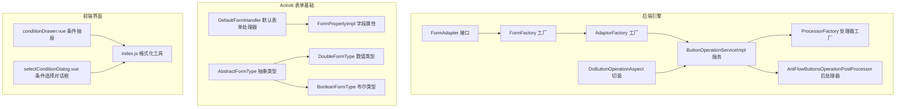
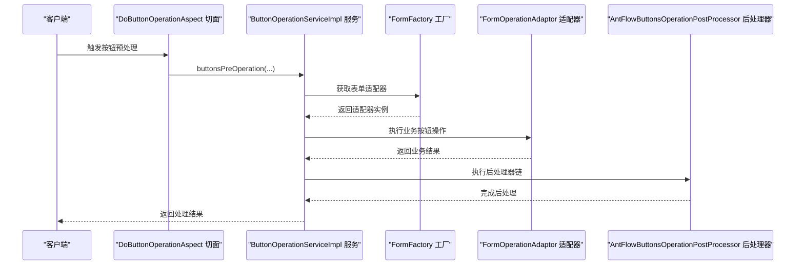
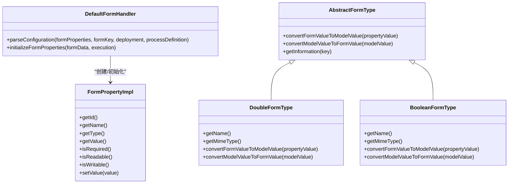
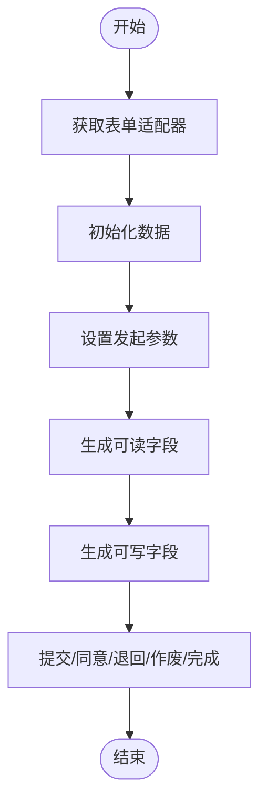
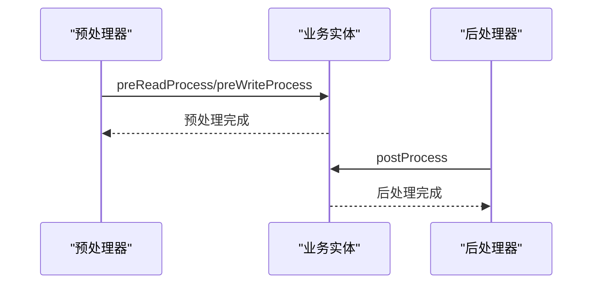
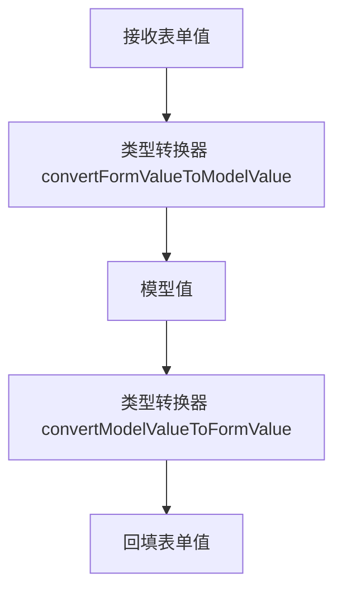
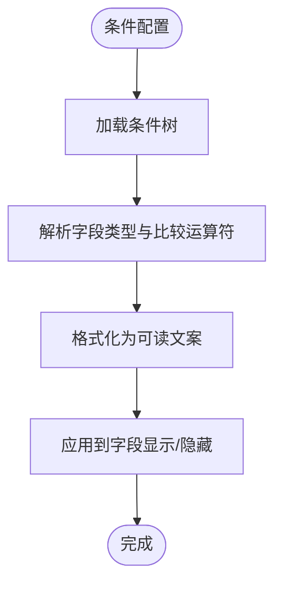
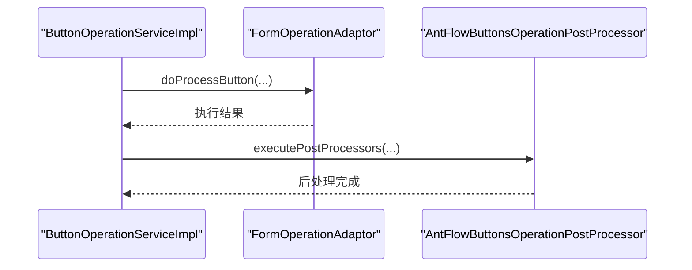
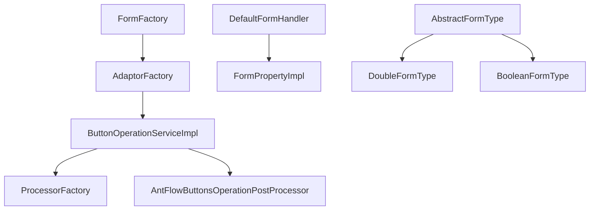

# 动态表单字段处理

<cite>
**本文引用的文件**
- [FormAdapter.java](file://antflow-engine/src/main/java/org/antflow/engine/bpmnconf/adp/FormAdapter.java)
- [FormFactory.java](file://antflow-engine/src/main/java/org/antflow/engine/factory/FormFactory.java)
- [AdaptorFactory.java](file://antflow-engine/src/main/java/org/antflow/engine/factory/AdaptorFactory.java)
- [ButtonOperationServiceImpl.java](file://antflow-engine/src/main/java/org/antflow/engine/bpmnconf/service/biz/ButtonOperationServiceImpl.java)
- [DoButtonOperationAspect.java](file://antflow-engine/src/main/java/org/antflow/engine/conf/aspect/DoButtonOperationAspect.java)
- [ProcessorFactory.java](file://antflow-base/src/main/java/org/openoa/base/service/ProcessorFactory.java)
- [AntFlowButtonsOperationPostProcessor.java](file://antflow-engine/src/main/java/org/antflow/engine/lowflow/service/AntFlowButtonsOperationPostProcessor.java)
- [ProcessActionButtonVo.java](file://antflow-base/src/main/java/org/openoa/base/vo/ProcessActionButtonVo.java)
- [DefaultFormHandler.java](file://antflow-base/src/main/java/org/activiti/engine/impl/form/DefaultFormHandler.java)
- [FormPropertyImpl.java](file://antflow-base/src/main/java/org/activiti/engine/impl/form/FormPropertyImpl.java)
- [AbstractFormType.java](file://antflow-base/src/main/java/org/activiti/engine/form/AbstractFormType.java)
- [DoubleFormType.java](file://antflow-base/src/main/java/org/activiti/engine/impl/form/DoubleFormType.java)
- [BooleanFormType.java](file://antflow-base/src/main/java/org/activiti/engine/impl/form/BooleanFormType.java)
- [conditionDrawer.vue](file://antflow-vue/src/components/Workflow/drawer/conditionDrawer.vue)
- [selectConditionDialog.vue](file://antflow-vue/src/components/Workflow/dialog/selectConditionDialog.vue)
- [index.js](file://antflow-vue/src/utils/antflow/index.js)
</cite>

## 目录
1. [简介](#简介)
2. [项目结构](#项目结构)
3. [核心组件](#核心组件)
4. [架构总览](#架构总览)
5. [组件详解](#组件详解)
6. [依赖关系分析](#依赖关系分析)
7. [性能考量](#性能考量)
8. [故障排查指南](#故障排查指南)
9. [结论](#结论)
10. [附录](#附录)

## 简介
本技术文档围绕“动态表单字段处理”模块，系统性阐述以下主题：
- 表单字段的动态生成机制与字段类型映射
- 字段控制处理器的实现原理与生命周期
- 字段预处理器与后处理器的协作机制
- 字段值的计算与转换逻辑
- 字段显示/隐藏的条件判断机制
- 按钮操作的后处理机制
- 字段验证器开发指南、自定义字段类型实现方法、字段事件监听机制
- 完整的字段处理示例与扩展开发方案

## 项目结构
动态表单相关能力横跨后端引擎与前端界面两部分：
- 后端引擎层负责表单适配、字段类型解析、字段处理器编排、按钮操作后处理等
- 前端界面层负责条件展示与格式化、字段渲染与交互

**图表来源**
- [FormAdapter.java:10-80](file://antflow-engine/src/main/java/org/antflow/engine/bpmnconf/adp/FormAdapter.java#L10-L80)
- [FormFactory.java:50-62](file://antflow-engine/src/main/java/org/antflow/engine/factory/FormFactory.java#L50-L62)
- [AdaptorFactory.java:17-31](file://antflow-engine/src/main/java/org/antflow/engine/factory/AdaptorFactory.java#L17-L31)
- [ButtonOperationServiceImpl.java:26-40](file://antflow-engine/src/main/java/org/antflow/engine/bpmnconf/service/biz/ButtonOperationServiceImpl.java#L26-L40)
- [DoButtonOperationAspect.java:35-38](file://antflow-engine/src/main/java/org/antflow/engine/conf/aspect/DoButtonOperationAspect.java#L35-L38)
- [ProcessorFactory.java:18-26](file://antflow-base/src/main/java/org/openoa/base/service/ProcessorFactory.java#L18-L26)
- [AntFlowButtonsOperationPostProcessor.java:32-66](file://antflow-engine/src/main/java/org/antflow/engine/lowflow/service/AntFlowButtonsOperationPostProcessor.java#L32-L66)
- [DefaultFormHandler.java:41-92](file://antflow-base/src/main/java/org/activiti/engine/impl/form/DefaultFormHandler.java#L41-L92)
- [FormPropertyImpl.java:43-74](file://antflow-base/src/main/java/org/activiti/engine/impl/form/FormPropertyImpl.java#L43-L74)
- [AbstractFormType.java:24-36](file://antflow-base/src/main/java/org/activiti/engine/form/AbstractFormType.java#L24-L36)
- [DoubleFormType.java:23-48](file://antflow-base/src/main/java/org/activiti/engine/impl/form/DoubleFormType.java#L23-L48)
- [BooleanFormType.java:22-46](file://antflow-base/src/main/java/org/activiti/engine/impl/form/BooleanFormType.java#L22-L46)
- [conditionDrawer.vue:341-378](file://antflow-vue/src/components/Workflow/drawer/conditionDrawer.vue#L341-L378)
- [selectConditionDialog.vue:30-77](file://antflow-vue/src/components/Workflow/dialog/selectConditionDialog.vue#L30-L77)
- [index.js:168-207](file://antflow-vue/src/utils/antflow/index.js#L168-L207)

**章节来源**
- [FormFactory.java:50-62](file://antflow-engine/src/main/java/org/antflow/engine/factory/FormFactory.java#L50-L62)
- [AdaptorFactory.java:17-31](file://antflow-engine/src/main/java/org/antflow/engine/factory/AdaptorFactory.java#L17-L31)

## 核心组件
- 表单适配器接口：定义启动条件设置、初始化数据、发起参数、查询/提交/同意/退回/作废/完成等生命周期方法，用于对接具体业务表单。
- 表单工厂：根据表单编码获取对应适配器实例，负责请求体与业务对象的转换与注入。
- 字段处理器与类型系统：基于 Activiti 的默认表单处理器，解析字段属性、变量表达式、默认值表达式；通过抽象类型与具体类型实现值的双向转换。
- 按钮操作与后处理：统一入口进行按钮操作事务处理，调用适配器执行业务动作，并在执行后触发后处理器链路。

**章节来源**
- [FormAdapter.java:10-80](file://antflow-engine/src/main/java/org/antflow/engine/bpmnconf/adp/FormAdapter.java#L10-L80)
- [FormFactory.java:70-123](file://antflow-engine/src/main/java/org/antflow/engine/factory/FormFactory.java#L70-L123)
- [DefaultFormHandler.java:41-92](file://antflow-base/src/main/java/org/activiti/engine/impl/form/DefaultFormHandler.java#L41-L92)
- [AbstractFormType.java:24-36](file://antflow-base/src/main/java/org/activiti/engine/form/AbstractFormType.java#L24-L36)
- [ButtonOperationServiceImpl.java:26-40](file://antflow-engine/src/main/java/org/antflow/engine/bpmnconf/service/biz/ButtonOperationServiceImpl.java#L26-L40)

## 架构总览
下图展示了从请求进入、表单适配、字段处理、按钮操作到后处理的整体流程。

**图表来源**
- [DoButtonOperationAspect.java:35-38](file://antflow-engine/src/main/java/org/antflow/engine/conf/aspect/DoButtonOperationAspect.java#L35-L38)
- [ButtonOperationServiceImpl.java:26-40](file://antflow-engine/src/main/java/org/antflow/engine/bpmnconf/service/biz/ButtonOperationServiceImpl.java#L26-L40)
- [FormFactory.java:50-62](file://antflow-engine/src/main/java/org/antflow/engine/factory/FormFactory.java#L50-L62)
- [AntFlowButtonsOperationPostProcessor.java:32-66](file://antflow-engine/src/main/java/org/antflow/engine/lowflow/service/AntFlowButtonsOperationPostProcessor.java#L32-L66)

## 组件详解

### 表单字段动态生成与类型映射
- 字段生成：默认表单处理器解析 BPMN 中的表单属性，构建字段处理器集合，按可读性筛选并生成表单属性列表。
- 类型映射：抽象类型定义值的双向转换接口；具体类型如数值、布尔等实现转换细节。
- 值转换：表单值与模型值之间的转换由具体类型实现，确保前后端一致。

**图表来源**
- [DefaultFormHandler.java:41-92](file://antflow-base/src/main/java/org/activiti/engine/impl/form/DefaultFormHandler.java#L41-L92)
- [FormPropertyImpl.java:43-74](file://antflow-base/src/main/java/org/activiti/engine/impl/form/FormPropertyImpl.java#L43-L74)
- [AbstractFormType.java:24-36](file://antflow-base/src/main/java/org/activiti/engine/form/AbstractFormType.java#L24-L36)
- [DoubleFormType.java:23-48](file://antflow-base/src/main/java/org/activiti/engine/impl/form/DoubleFormType.java#L23-L48)
- [BooleanFormType.java:22-46](file://antflow-base/src/main/java/org/activiti/engine/impl/form/BooleanFormType.java#L22-L46)

**章节来源**
- [DefaultFormHandler.java:41-92](file://antflow-base/src/main/java/org/activiti/engine/impl/form/DefaultFormHandler.java#L41-L92)
- [FormPropertyImpl.java:43-74](file://antflow-base/src/main/java/org/activiti/engine/impl/form/FormPropertyImpl.java#L43-L74)
- [AbstractFormType.java:24-36](file://antflow-base/src/main/java/org/activiti/engine/form/AbstractFormType.java#L24-L36)
- [DoubleFormType.java:23-48](file://antflow-base/src/main/java/org/activiti/engine/impl/form/DoubleFormType.java#L23-L48)
- [BooleanFormType.java:22-46](file://antflow-base/src/main/java/org/activiti/engine/impl/form/BooleanFormType.java#L22-L46)

### 字段控制处理器与生命周期
- 控制处理器：通过表单工厂与适配器工厂获取具体表单适配器，驱动字段的初始化、读写、默认值表达式等控制逻辑。
- 生命周期：适配器接口定义了启动条件设置、初始化数据、发起参数、查询/提交/同意/退回/作废/完成等阶段，确保字段在不同阶段按需呈现与校验。

**图表来源**
- [FormFactory.java:50-62](file://antflow-engine/src/main/java/org/antflow/engine/factory/FormFactory.java#L50-L62)
- [FormAdapter.java:18-78](file://antflow-engine/src/main/java/org/antflow/engine/bpmnconf/adp/FormAdapter.java#L18-L78)

**章节来源**
- [FormFactory.java:50-62](file://antflow-engine/src/main/java/org/antflow/engine/factory/FormFactory.java#L50-L62)
- [FormAdapter.java:18-78](file://antflow-engine/src/main/java/org/antflow/engine/bpmnconf/adp/FormAdapter.java#L18-L78)

### 字段预处理器与后处理器
- 预处理器：在读取与写入前对实体执行预处理，保证字段值在进入业务逻辑之前符合预期。
- 后处理器：在按钮操作完成后执行后处理，确保后续流程或状态更新的一致性。

**图表来源**
- [ProcessorFactory.java:27-44](file://antflow-base/src/main/java/org/openoa/base/service/ProcessorFactory.java#L27-L44)

**章节来源**
- [ProcessorFactory.java:18-44](file://antflow-base/src/main/java/org/openoa/base/service/ProcessorFactory.java#L18-L44)

### 字段值的计算与转换逻辑
- 表达式与默认值：字段处理器支持变量表达式与默认值表达式，在初始化时解析并赋值。
- 类型转换：具体类型实现表单值与模型值的双向转换，确保数据一致性。

**图表来源**
- [AbstractFormType.java:28-30](file://antflow-base/src/main/java/org/activiti/engine/form/AbstractFormType.java#L28-L30)
- [DoubleFormType.java:35-47](file://antflow-base/src/main/java/org/activiti/engine/impl/form/DoubleFormType.java#L35-L47)
- [BooleanFormType.java:34-46](file://antflow-base/src/main/java/org/activiti/engine/impl/form/BooleanFormType.java#L34-L46)

**章节来源**
- [DefaultFormHandler.java:68-76](file://antflow-base/src/main/java/org/activiti/engine/impl/form/DefaultFormHandler.java#L68-L76)
- [AbstractFormType.java:28-30](file://antflow-base/src/main/java/org/activiti/engine/form/AbstractFormType.java#L28-L30)
- [DoubleFormType.java:35-47](file://antflow-base/src/main/java/org/activiti/engine/impl/form/DoubleFormType.java#L35-L47)
- [BooleanFormType.java:34-46](file://antflow-base/src/main/java/org/activiti/engine/impl/form/BooleanFormType.java#L34-L46)

### 字段显示/隐藏的条件判断机制
- 条件配置：前端通过条件抽屉与条件选择对话框维护字段显示/隐藏的条件树，支持“且/或”关系与多种比较运算符。
- 展示格式化：前端工具函数将条件配置转为可读文案，便于审批人理解。

**图表来源**
- [conditionDrawer.vue:341-378](file://antflow-vue/src/components/Workflow/drawer/conditionDrawer.vue#L341-L378)
- [selectConditionDialog.vue:65-77](file://antflow-vue/src/components/Workflow/dialog/selectConditionDialog.vue#L65-L77)
- [index.js:168-207](file://antflow-vue/src/utils/antflow/index.js#L168-L207)

**章节来源**
- [conditionDrawer.vue:341-378](file://antflow-vue/src/components/Workflow/drawer/conditionDrawer.vue#L341-L378)
- [selectConditionDialog.vue:65-77](file://antflow-vue/src/components/Workflow/dialog/selectConditionDialog.vue#L65-L77)
- [index.js:168-207](file://antflow-vue/src/utils/antflow/index.js#L168-L207)

### 按钮操作的后处理机制
- 统一入口：按钮操作通过服务层进行事务封装，调用适配器执行业务动作。
- 后处理：在业务动作执行后，统一触发后处理器链，完成后续状态更新或通知。

**图表来源**
- [ButtonOperationServiceImpl.java:26-40](file://antflow-engine/src/main/java/org/antflow/engine/bpmnconf/service/biz/ButtonOperationServiceImpl.java#L26-L40)
- [AntFlowButtonsOperationPostProcessor.java:32-66](file://antflow-engine/src/main/java/org/antflow/engine/lowflow/service/AntFlowButtonsOperationPostProcessor.java#L32-L66)

**章节来源**
- [ButtonOperationServiceImpl.java:26-40](file://antflow-engine/src/main/java/org/antflow/engine/bpmnconf/service/biz/ButtonOperationServiceImpl.java#L26-L40)
- [AntFlowButtonsOperationPostProcessor.java:32-66](file://antflow-engine/src/main/java/org/antflow/engine/lowflow/service/AntFlowButtonsOperationPostProcessor.java#L32-L66)

### 字段验证器开发指南
- 基于类型转换：优先利用现有类型转换能力，确保输入输出一致性。
- 自定义类型：若需要新的字段类型，建议继承抽象类型并实现双向转换方法。
- 前端校验：结合条件配置与格式化工具，提供即时反馈与可读文案。

**章节来源**
- [AbstractFormType.java:24-36](file://antflow-base/src/main/java/org/activiti/engine/form/AbstractFormType.java#L24-L36)
- [DoubleFormType.java:23-48](file://antflow-base/src/main/java/org/activiti/engine/impl/form/DoubleFormType.java#L23-L48)
- [BooleanFormType.java:22-46](file://antflow-base/src/main/java/org/activiti/engine/impl/form/BooleanFormType.java#L22-L46)
- [index.js:168-207](file://antflow-vue/src/utils/antflow/index.js#L168-L207)

### 自定义字段类型的实现方法
- 继承抽象类型：实现名称、MIME 类型、双向转换方法。
- 注册与使用：在表单处理器中解析并使用新类型，确保前后端一致。

**章节来源**
- [AbstractFormType.java:24-36](file://antflow-base/src/main/java/org/activiti/engine/form/AbstractFormType.java#L24-L36)
- [DefaultFormHandler.java:61-62](file://antflow-base/src/main/java/org/activiti/engine/impl/form/DefaultFormHandler.java#L61-L62)

### 字段事件监听机制
- 监听器扩展点：可通过 Activiti 的监听器机制在节点事件发生时执行自定义逻辑，实现字段状态变更的事件监听。
- 建议：在流程节点配置中注册监听器，结合表单适配器实现字段联动与状态同步。

**章节来源**
- [ActivitiListener.java:21-71](file://antflow-base/src/main/java/org/activiti/bpmn/model/ActivitiListener.java#L21-L71)
- [ActivitiListenerParser.java:32-49](file://antflow-base/src/main/java/org/activiti/bpmn/converter/child/ActivitiListenerParser.java#L32-L49)

## 依赖关系分析
- 组件耦合：表单工厂与适配器工厂是核心入口，按钮操作服务依赖二者；后处理器通过统一工厂执行。
- 外部依赖：类型系统依赖 Activiti 的表单类型接口；前端依赖 Vue 组件与工具函数。

**图表来源**
- [FormFactory.java:50-62](file://antflow-engine/src/main/java/org/antflow/engine/factory/FormFactory.java#L50-L62)
- [AdaptorFactory.java:17-31](file://antflow-engine/src/main/java/org/antflow/engine/factory/AdaptorFactory.java#L17-L31)
- [ButtonOperationServiceImpl.java:26-40](file://antflow-engine/src/main/java/org/antflow/engine/bpmnconf/service/biz/ButtonOperationServiceImpl.java#L26-L40)
- [ProcessorFactory.java:18-26](file://antflow-base/src/main/java/org/openoa/base/service/ProcessorFactory.java#L18-L26)
- [DefaultFormHandler.java:41-92](file://antflow-base/src/main/java/org/activiti/engine/impl/form/DefaultFormHandler.java#L41-L92)
- [AbstractFormType.java:24-36](file://antflow-base/src/main/java/org/activiti/engine/form/AbstractFormType.java#L24-L36)

**章节来源**
- [FormFactory.java:50-62](file://antflow-engine/src/main/java/org/antflow/engine/factory/FormFactory.java#L50-L62)
- [AdaptorFactory.java:17-31](file://antflow-engine/src/main/java/org/antflow/engine/factory/AdaptorFactory.java#L17-L31)
- [ButtonOperationServiceImpl.java:26-40](file://antflow-engine/src/main/java/org/antflow/engine/bpmnconf/service/biz/ButtonOperationServiceImpl.java#L26-L40)
- [ProcessorFactory.java:18-26](file://antflow-base/src/main/java/org/openoa/base/service/ProcessorFactory.java#L18-L26)
- [DefaultFormHandler.java:41-92](file://antflow-base/src/main/java/org/activiti/engine/impl/form/DefaultFormHandler.java#L41-L92)
- [AbstractFormType.java:24-36](file://antflow-base/src/main/java/org/activiti/engine/form/AbstractFormType.java#L24-L36)

## 性能考量
- 类型转换缓存：在类型转换器中避免重复解析，提升批量字段处理效率。
- 表达式求值：尽量简化变量表达式与默认值表达式，减少运行时开销。
- 后处理器链：合理拆分后处理器职责，避免长链路阻塞。

## 故障排查指南
- 表单适配器缺失：检查表单编码是否正确，确认工厂能解析到对应适配器。
- 字段不可读/不可写：核对字段处理器的可读/可写标志与表达式配置。
- 按钮操作异常：查看切面对应拦截点与后处理器执行日志，定位异常环节。

**章节来源**
- [FormFactory.java:88-93](file://antflow-engine/src/main/java/org/antflow/engine/factory/FormFactory.java#L88-L93)
- [DefaultFormHandler.java:63-76](file://antflow-base/src/main/java/org/activiti/engine/impl/form/DefaultFormHandler.java#L63-L76)
- [DoButtonOperationAspect.java:35-38](file://antflow-engine/src/main/java/org/antflow/engine/conf/aspect/DoButtonOperationAspect.java#L35-L38)

## 结论
动态表单字段处理模块通过“表单适配器 + 字段处理器 + 类型系统 + 按钮后处理”的组合，实现了字段的动态生成、条件控制、值转换与流程联动。依托 Activiti 的类型体系与自研工厂/处理器机制，既能满足复杂业务场景，又具备良好的扩展性与可维护性。

## 附录
- 示例与扩展方案
  - 字段类型扩展：新增类型继承抽象类型并注册到表单处理器。
  - 条件展示：在前端条件抽屉中配置字段与比较运算符，使用格式化工具生成可读文案。
  - 按钮后处理：在后处理器中实现业务状态更新或通知逻辑。