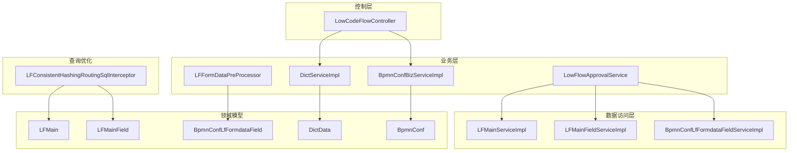
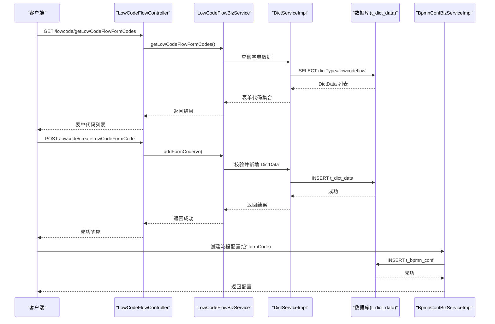
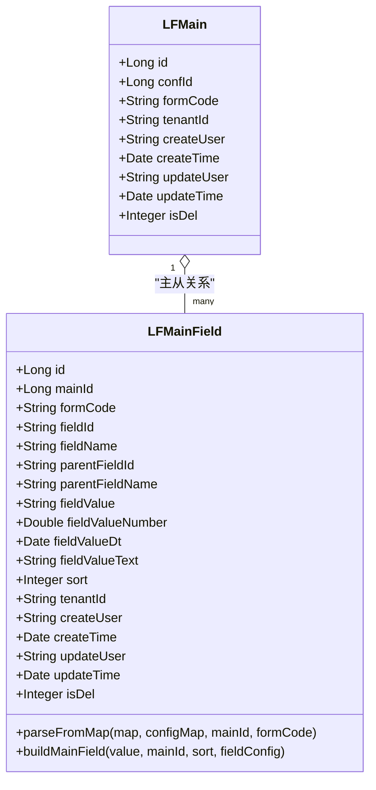
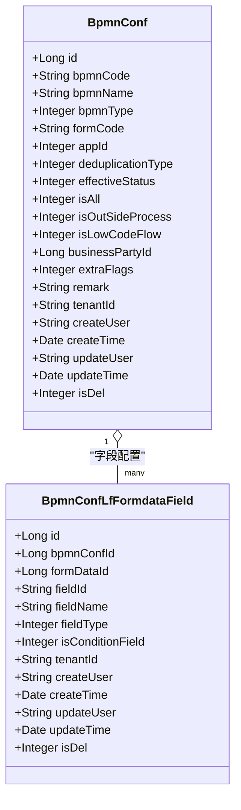
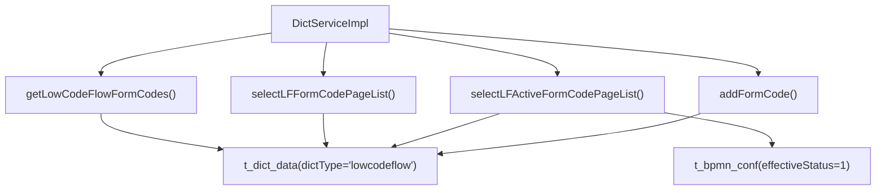
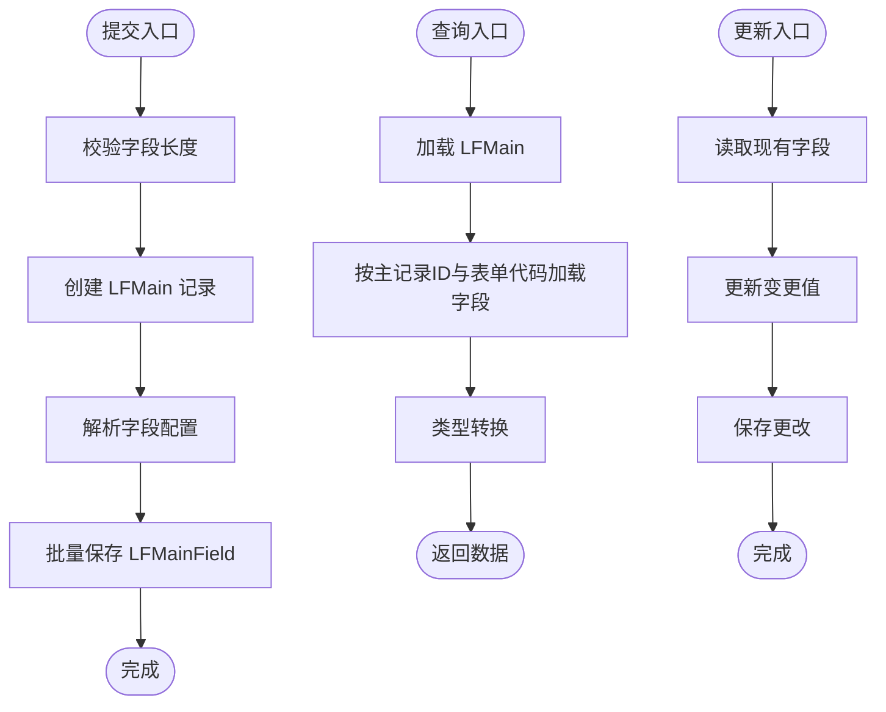
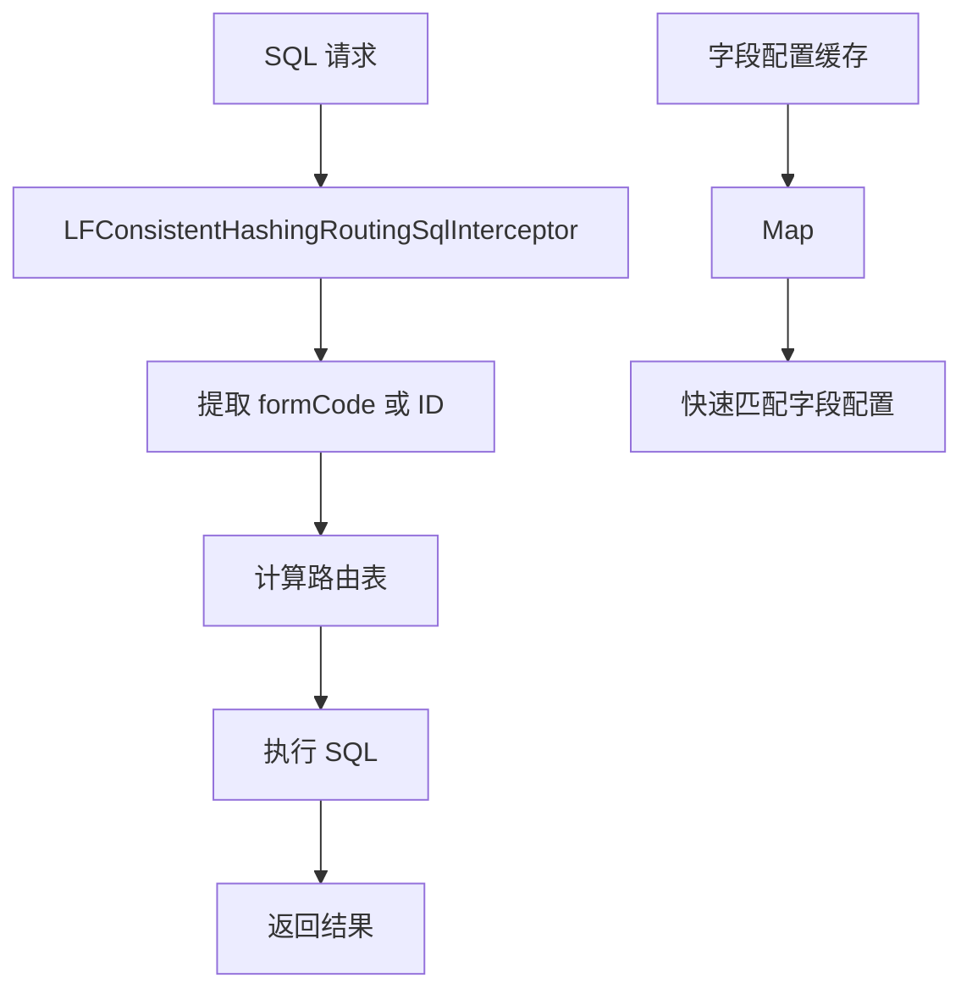
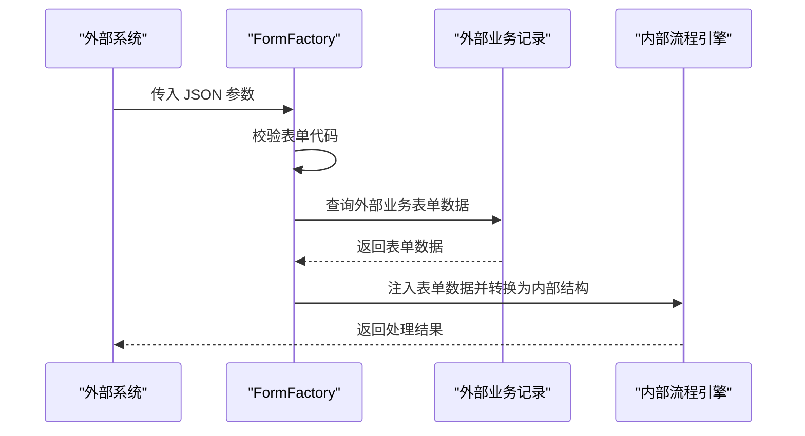
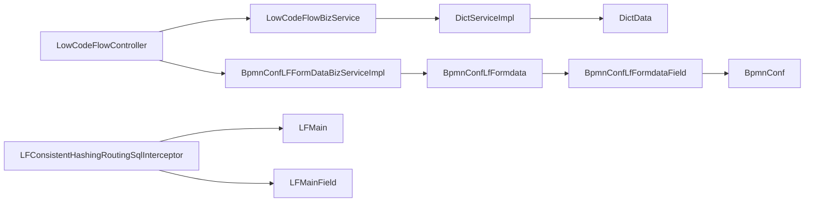

# 表单代码管理系统

<cite>
**本文档引用的文件**
- [LFMain.java](file://antflow-engine/src/main/java/org/openoa/engine/lowflow/entity/LFMain.java)
- [LFMainField.java](file://antflow-engine/src/main/java/org/openoa/engine/lowflow/entity/LFMainField.java)
- [BpmnConfLfFormdataField.java](file://antflow-base/src/main/java/org/openoa/base/entity/BpmnConfLfFormdataField.java)
- [DictData.java](file://antflow-base/src/main/java/org/openoa/base/entity/DictData.java)
- [LowCodeFlowController.java](file://antflow-engine/src/main/java/org/openoa/engine/bpmnconf/controller/LowCodeFlowController.java)
- [DictServiceImpl.java](file://antflow-engine/src/main/java/org/openoa/engine/bpmnconf/service/biz/DictServiceImpl.java)
- [LFMainServiceImpl.java](file://antflow-engine/src/main/java/org/openoa/engine/bpmnconf/service/impl/LFMainServiceImpl.java)
- [LFMainFieldServiceImpl.java](file://antflow-engine/src/main/java/org/openoa/engine/bpmnconf/service/impl/LFMainFieldServiceImpl.java)
- [BpmnConfLfFormdataFieldServiceImpl.java](file://antflow-engine/src/main/java/org/openoa/engine/bpmnconf/service/impl/BpmnConfLfFormdataFieldServiceImpl.java)
- [LFConsistentHashingRoutingSqlInterceptor.java](file://antflow-engine/src/main/java/org/openoa/engine/conf/mybatis/interceptor/LFConsistentHashingRoutingSqlInterceptor.java)
- [FormFactory.java](file://antflow-engine/src/main/java/org/openoa/engine/factory/FormFactory.java)
- [LowFlowApprovalService.java](file://antflow-engine/src/main/java/org/openoa/engine/lowflow/service/LowFlowApprovalService.java)
- [LFFormDataPreProcessor.java](file://antflow-engine/src/main/java/org/openoa/engine/lowflow/service/LFFormDataPreProcessor.java)
- [BpmnConfBizServiceImpl.java](file://antflow-engine/src/main/java/org/openoa/engine/bpmnconf/service/biz/BpmnConfBizServiceImpl.java)
- [BpmnConf.java](file://antflow-base/src/main/java/org/openoa/base/entity/BpmnConf.java)
- [LowFlowBusinessDataVO.java](file://antflow-base/src/main/java/org/openoa/base/vo/LowFlowBusinessDataVO.java)
- [9.低代码引擎.md](file://doc/系统介绍篇/9.低代码引擎.md)
- [12.Rest控制器.md](file://doc/系统介绍篇/12.Rest控制器.md)
- [10.外部系统集成.md](file://doc/系统介绍篇/10.外部系统集成.md)
- [24.流程模板关键字段说明.md](file://doc/系统介绍篇/24.流程模板关键字段说明.md)
- [AntFlow业务集成之三API接入(SAAS模式)流程实战.md](file://doc/系统集成与扩展开发篇/AntFlow业务集成之三API接入(SAAS模式)流程实战.md)
- [AntFlow业务集成之六diy流程搭便车扩展篇.md](file://doc/系统集成与扩展开发篇/AntFlow业务集成之六diy流程搭便车扩展篇.md)
</cite>

## 目录
1. [简介](#简介)
2. [项目结构](#项目结构)
3. [核心组件](#核心组件)
4. [架构总览](#架构总览)
5. [详细组件分析](#详细组件分析)
6. [依赖关系分析](#依赖关系分析)
7. [性能考虑](#性能考虑)
8. [故障排查指南](#故障排查指南)
9. [结论](#结论)
10. [附录](#附录)

## 简介
本系统围绕“表单代码”这一核心概念，采用基于字典的管理模式，结合低代码表单引擎，实现表单定义、运行时数据持久化、查询与路由、以及与业务流程的强绑定。核心目标包括：
- 基于字典的表单代码管理：通过字典表维护表单代码及其元信息，支持查询、分页、启用状态筛选。
- 低代码表单数据模型：使用 LFMain/LFMainField 存储表单主记录与字段明细，支持多类型字段值存储与类型转换。
- 字段配置与业务流程绑定：通过 BpmnConfLfFormdataField 维护字段配置，与流程配置 BpmnConf 强关联，确保表单与流程的一致性。
- 表单代码生命周期：从创建、查询、启用到与流程绑定的全生命周期管理。
- 存储与查询优化：通过一致性哈希分表拦截器实现按表单代码的表路由，提升大规模数据下的查询性能。

## 项目结构
系统采用分层架构，核心模块包括：
- 控制层：LowCodeFlowController 提供表单代码管理与表单数据查询的 REST 接口。
- 业务层：DictServiceImpl、BpmnConfBizServiceImpl 等负责表单代码与流程配置的业务逻辑。
- 领域模型：LFMain、LFMainField、BpmnConfLfFormdataField、DictData 等实体承载数据结构。
- 数据访问层：MyBatis Plus ServiceImpl 实现基础 CRUD。
- 查询优化：LFConsistentHashingRoutingSqlInterceptor 基于表单代码进行表路由。

**图表来源**
- [LowCodeFlowController.java:1-85](file://antflow-engine/src/main/java/org/openoa/engine/bpmnconf/controller/LowCodeFlowController.java#L1-L85)
- [DictServiceImpl.java:69-152](file://antflow-engine/src/main/java/org/openoa/engine/bpmnconf/service/biz/DictServiceImpl.java#L69-L152)
- [BpmnConfBizServiceImpl.java:154-185](file://antflow-engine/src/main/java/org/openoa/engine/bpmnconf/service/biz/BpmnConfBizServiceImpl.java#L154-L185)
- [LowFlowApprovalService.java:214-240](file://antflow-engine/src/main/java/org/openoa/engine/lowflow/service/LowFlowApprovalService.java#L214-L240)
- [LFConsistentHashingRoutingSqlInterceptor.java:81-216](file://antflow-engine/src/main/java/org/openoa/engine/conf/mybatis/interceptor/LFConsistentHashingRoutingSqlInterceptor.java#L81-L216)

**章节来源**
- [LowCodeFlowController.java:1-85](file://antflow-engine/src/main/java/org/openoa/engine/bpmnconf/controller/LowCodeFlowController.java#L1-L85)
- [9.低代码引擎.md:7-68](file://doc/系统介绍篇/9.低代码引擎.md#L7-L68)

## 核心组件
- LFMain：表单主记录，包含流程配置ID、表单代码、租户信息、创建/更新信息等。
- LFMainField：表单字段明细，支持字符串、数值、日期、文本、布尔等多种类型，具备字段父子关系与排序能力。
- BpmnConfLfFormdataField：字段配置元数据，与流程配置关联，定义字段ID、名称、类型、是否条件字段等。
- DictData：字典数据，用于表单代码的字典化管理，包含字典类型、值、标签、备注等。
- LowCodeFlowController：提供表单代码查询、分页列表、活动列表、表单数据获取、新增表单代码等接口。
- LFConsistentHashingRoutingSqlInterceptor：基于表单代码的 SQL 拦截与表路由，实现 LFMain/LFMainField 的分表存储。

**章节来源**
- [LFMain.java:1-63](file://antflow-engine/src/main/java/org/openoa/engine/lowflow/entity/LFMain.java#L1-L63)
- [LFMainField.java:1-146](file://antflow-engine/src/main/java/org/openoa/engine/lowflow/entity/LFMainField.java#L1-L146)
- [BpmnConfLfFormdataField.java:1-89](file://antflow-base/src/main/java/org/openoa/base/entity/BpmnConfLfFormdataField.java#L1-L89)
- [DictData.java:1-51](file://antflow-base/src/main/java/org/openoa/base/entity/DictData.java#L1-L51)
- [LowCodeFlowController.java:20-85](file://antflow-engine/src/main/java/org/openoa/engine/bpmnconf/controller/LowCodeFlowController.java#L20-L85)
- [LFConsistentHashingRoutingSqlInterceptor.java:81-216](file://antflow-engine/src/main/java/org/openoa/engine/conf/mybatis/interceptor/LFConsistentHashingRoutingSqlInterceptor.java#L81-L216)

## 架构总览
系统围绕“表单代码”贯穿设计，形成如下闭环：
- 表单代码管理：通过字典表维护表单代码，支持查询、分页、启用筛选。
- 表单配置绑定：流程配置 BpmnConf 与低代码表单字段配置 BpmnConfLfFormdataField 关联，确保表单与流程一致。
- 运行时数据存储：提交表单时生成 LFMain 记录，字段明细保存为 LFMainField，按表单代码进行分表路由。
- 外部系统集成：FormFactory 将外部 API 数据转换为内部结构，注入表单数据或外部表单数据。

**图表来源**
- [LowCodeFlowController.java:28-82](file://antflow-engine/src/main/java/org/openoa/engine/bpmnconf/controller/LowCodeFlowController.java#L28-L82)
- [DictServiceImpl.java:69-152](file://antflow-engine/src/main/java/org/openoa/engine/bpmnconf/service/biz/DictServiceImpl.java#L69-L152)
- [BpmnConfBizServiceImpl.java:154-185](file://antflow-engine/src/main/java/org/openoa/engine/bpmnconf/service/biz/BpmnConfBizServiceImpl.java#L154-L185)

**章节来源**
- [12.Rest控制器.md:117-173](file://doc/系统介绍篇/12.Rest控制器.md#L117-L173)
- [9.低代码引擎.md:175-221](file://doc/系统介绍篇/9.低代码引擎.md#L175-L221)

## 详细组件分析

### LFMain 与 LFMainField：表单数据模型
- 设计要点
  - LFMain：主表单记录，包含 confId、formCode、租户ID、创建/更新信息，支持逻辑删除。
  - LFMainField：字段明细，支持多种类型值存储（字符串、数值、日期、文本、布尔），并记录字段父子关系与排序。
  - 类型转换：根据字段配置类型进行值转换，避免类型不匹配导致的存储异常。
- 生命周期
  - 提交：生成主记录，解析字段配置，批量保存字段明细。
  - 查询：按主记录ID与表单代码加载字段明细。
  - 更新：读取现有字段，更新变更值并保存。
- 性能与扩展
  - 支持按主记录ID与表单代码的组合查询，便于快速定位字段集合。
  - 字段类型扩展简单，新增类型只需在类型转换逻辑中补充分支。

**图表来源**
- [LFMain.java:10-63](file://antflow-engine/src/main/java/org/openoa/engine/lowflow/entity/LFMain.java#L10-L63)
- [LFMainField.java:19-146](file://antflow-engine/src/main/java/org/openoa/engine/lowflow/entity/LFMainField.java#L19-L146)

**章节来源**
- [LFMain.java:1-63](file://antflow-engine/src/main/java/org/openoa/engine/lowflow/entity/LFMain.java#L1-L63)
- [LFMainField.java:81-146](file://antflow-engine/src/main/java/org/openoa/engine/lowflow/entity/LFMainField.java#L81-L146)

### 字段配置与业务流程绑定：BpmnConfLfFormdataField 与 BpmnConf
- 设计要点
  - BpmnConfLfFormdataField：维护字段配置，包括字段ID、名称、类型、是否条件字段等，与流程配置ID关联。
  - BpmnConf：流程配置实体，包含 formCode、生效状态、是否低代码流程等关键字段，作为表单与流程的绑定纽带。
- 绑定关系
  - 低代码流程启动时，通过流程配置ID加载字段配置，确保提交数据与表单定义一致。
  - 表单代码与流程配置通过 formCode 强关联，保证业务发起与流程执行的一致性。

**图表来源**
- [BpmnConfLfFormdataField.java:16-89](file://antflow-base/src/main/java/org/openoa/base/entity/BpmnConfLfFormdataField.java#L16-L89)
- [BpmnConf.java:49-107](file://antflow-base/src/main/java/org/openoa/base/entity/BpmnConf.java#L49-L107)

**章节来源**
- [BpmnConfLfFormdataField.java:1-89](file://antflow-base/src/main/java/org/openoa/base/entity/BpmnConfLfFormdataField.java#L1-L89)
- [BpmnConf.java:49-107](file://antflow-base/src/main/java/org/openoa/base/entity/BpmnConf.java#L49-L107)
- [24.流程模板关键字段说明.md:1-24](file://doc/系统介绍篇/24.流程模板关键字段说明.md#L1-L24)

### 表单代码管理：基于字典的表单代码体系
- 设计要点
  - 使用 DictData 维护表单代码，字典类型为 lowcodeflow，包含值（表单代码）、标签（表单名称）、备注等。
  - 通过 DictServiceImpl 提供查询、分页、启用筛选、新增等能力。
- 查询策略
  - 所有表单代码：用于流程设计界面。
  - 分页列表：带分页的模板管理。
  - 活动表单代码：可用于流程发起的表单，筛选生效状态。
- 新增流程
  - 新增表单代码后，需在流程配置中设置 isLowCodeFlow=1 且 formCode 指向该代码，方可启用。

**图表来源**
- [DictServiceImpl.java:69-152](file://antflow-engine/src/main/java/org/openoa/engine/bpmnconf/service/biz/DictServiceImpl.java#L69-L152)
- [LowCodeFlowController.java:28-82](file://antflow-engine/src/main/java/org/openoa/engine/bpmnconf/controller/LowCodeFlowController.java#L28-L82)

**章节来源**
- [DictServiceImpl.java:69-152](file://antflow-engine/src/main/java/org/openoa/engine/bpmnconf/service/biz/DictServiceImpl.java#L69-L152)
- [12.Rest控制器.md:117-173](file://doc/系统介绍篇/12.Rest控制器.md#L117-L173)
- [9.低代码引擎.md:175-229](file://doc/系统介绍篇/9.低代码引擎.md#L175-L229)

### 表单数据提交与查询：生命周期与处理流程
- 提交流程
  - 校验字段值长度，超长字段进行截断保护。
  - 生成 LFMain 主记录，保存 confId、formCode、租户ID等。
  - 解析字段配置，批量生成 LFMainField 并保存。
- 查询流程
  - 通过主记录ID与表单代码加载字段明细，转换为合适类型返回。
- 更新流程
  - 读取现有字段，更新变更值并保存。

**图表来源**
- [LowFlowApprovalService.java:214-240](file://antflow-engine/src/main/java/org/openoa/engine/lowflow/service/LowFlowApprovalService.java#L214-L240)
- [LFMainFieldServiceImpl.java:14-20](file://antflow-engine/src/main/java/org/openoa/engine/bpmnconf/service/impl/LFMainFieldServiceImpl.java#L14-L20)

**章节来源**
- [9.低代码引擎.md:165-173](file://doc/系统介绍篇/9.低代码引擎.md#L165-L173)
- [4.后端系统.md:447-491](file://doc/系统介绍篇/4.后端系统.md#L447-L491)

### 查询优化与缓存策略：一致性哈希分表拦截器
- 查询优化
  - LFConsistentHashingRoutingSqlInterceptor：拦截涉及 LFMain/LFMainField 的 SQL，根据表单代码进行表路由，实现按表单代码的分表存储。
  - 支持从 SQL 中提取 formCode 或通过业务ID反查 formCode，确保路由正确性。
- 缓存策略
  - 字段配置缓存：BpmnConfLfFormdataFieldServiceImpl 将字段配置按字段ID缓存为 Map，减少重复查询。
  - 表单代码缓存：DictServiceImpl 在查询活动表单代码时可结合流程配置的启用状态进行缓存过滤。

**图表来源**
- [LFConsistentHashingRoutingSqlInterceptor.java:81-216](file://antflow-engine/src/main/java/org/openoa/engine/conf/mybatis/interceptor/LFConsistentHashingRoutingSqlInterceptor.java#L81-L216)
- [BpmnConfLfFormdataFieldServiceImpl.java:18-31](file://antflow-engine/src/main/java/org/openoa/engine/bpmnconf/service/impl/BpmnConfLfFormdataFieldServiceImpl.java#L18-L31)

**章节来源**
- [LFConsistentHashingRoutingSqlInterceptor.java:81-216](file://antflow-engine/src/main/java/org/openoa/engine/conf/mybatis/interceptor/LFConsistentHashingRoutingSqlInterceptor.java#L81-L216)
- [BpmnConfLfFormdataFieldServiceImpl.java:18-31](file://antflow-engine/src/main/java/org/openoa/engine/bpmnconf/service/impl/BpmnConfLfFormdataFieldServiceImpl.java#L18-L31)

### 外部系统集成：表单数据转换与注入
- 数据转换
  - FormFactory：将外部 API 的 JSON 数据转换为内部结构，处理外部访问检查、低代码流检查、表单数据注入等。
  - 支持从外部业务记录中注入表单数据，确保审批人能看到关键业务信息。
- 集成模式
  - SaaS 模式下，流程由外部系统发起，审批在引擎侧完成，表单数据为外部业务数据的副本，仅保留关键字段。

**图表来源**
- [FormFactory.java:68-96](file://antflow-engine/src/main/java/org/openoa/engine/factory/FormFactory.java#L68-L96)
- [10.外部系统集成.md:155-197](file://doc/系统介绍篇/10.外部系统集成.md#L155-L197)
- [AntFlow业务集成之三API接入(SAAS模式)流程实战.md](file://doc/系统集成与扩展开发篇/AntFlow业务集成之三API接入(SAAS模式)流程实战.md#L118-L121)

**章节来源**
- [FormFactory.java:68-96](file://antflow-engine/src/main/java/org/openoa/engine/factory/FormFactory.java#L68-L96)
- [10.外部系统集成.md:155-197](file://doc/系统介绍篇/10.外部系统集成.md#L155-L197)

## 依赖关系分析
- 控制器依赖业务服务：LowCodeFlowController 依赖 LowCodeFlowBizService 与 BpmnConfLFFormDataBizServiceImpl。
- 业务服务依赖实体与 Mapper：DictServiceImpl、BpmnConfBizServiceImpl 依赖对应实体与 Mapper。
- 查询优化依赖拦截器：LFConsistentHashingRoutingSqlInterceptor 依赖 LFMain/LFMainField 实体进行表路由。
- 字段配置依赖流程配置：BpmnConfLfFormdataField 与 BpmnConf 强关联，确保表单与流程一致。

**图表来源**
- [LowCodeFlowController.java:20-85](file://antflow-engine/src/main/java/org/openoa/engine/bpmnconf/controller/LowCodeFlowController.java#L20-L85)
- [DictServiceImpl.java:69-152](file://antflow-engine/src/main/java/org/openoa/engine/bpmnconf/service/biz/DictServiceImpl.java#L69-L152)
- [LFConsistentHashingRoutingSqlInterceptor.java:81-216](file://antflow-engine/src/main/java/org/openoa/engine/conf/mybatis/interceptor/LFConsistentHashingRoutingSqlInterceptor.java#L81-L216)

**章节来源**
- [LowCodeFlowController.java:20-85](file://antflow-engine/src/main/java/org/openoa/engine/bpmnconf/controller/LowCodeFlowController.java#L20-L85)
- [9.低代码引擎.md:7-68](file://doc/系统介绍篇/9.低代码引擎.md#L7-L68)

## 性能考虑
- 分表路由：通过 LFConsistentHashingRoutingSqlInterceptor 按表单代码进行表路由，降低单表压力，提升查询性能。
- 字段配置缓存：将字段配置按字段ID缓存为 Map，避免重复查询，提高字段解析效率。
- 类型转换优化：在字段解析阶段统一进行类型转换，减少后续处理成本。
- 外部系统集成：通过表单数据注入减少重复存储，降低存储与查询开销。

## 故障排查指南
- 表单代码缺失
  - 现象：流程无法发起或表单数据为空。
  - 排查：确认字典表中是否存在对应表单代码，且流程配置的 formCode 与字典值一致。
- 字段配置错误
  - 现象：字段值无法解析或类型不匹配。
  - 排查：检查 BpmnConfLfFormdataField 的字段类型与字段ID是否正确，确保字段配置与表单定义一致。
- 查询路由失败
  - 现象：按表单代码查询不到数据或报错。
  - 排查：确认 SQL 中是否包含 formCode 或可通过业务ID反查 formCode，检查拦截器是否正确提取并路由。
- 外部系统数据注入失败
  - 现象：审批人看不到外部系统的关键字段。
  - 排查：确认外部业务记录中是否存在表单数据，检查 FormFactory 的注入逻辑是否正确。

**章节来源**
- [LFConsistentHashingRoutingSqlInterceptor.java:81-216](file://antflow-engine/src/main/java/org/openoa/engine/conf/mybatis/interceptor/LFConsistentHashingRoutingSqlInterceptor.java#L81-L216)
- [FormFactory.java:68-96](file://antflow-engine/src/main/java/org/openoa/engine/factory/FormFactory.java#L68-L96)
- [BpmnConfLfFormdataFieldServiceImpl.java:18-31](file://antflow-engine/src/main/java/org/openoa/engine/bpmnconf/service/impl/BpmnConfLfFormdataFieldServiceImpl.java#L18-L31)

## 结论
本系统通过“表单代码”为核心，构建了从字典管理、流程绑定、运行时数据存储到查询优化的完整闭环。LFMain/LFMainField 提供灵活的字段存储与类型转换能力，BpmnConfLfFormdataField 确保字段配置与流程一致，LFConsistentHashingRoutingSqlInterceptor 实现高效的分表路由。配合字典化的表单代码管理与外部系统集成能力，系统能够稳定支撑大规模低代码表单场景。

## 附录
- 开发示例与最佳实践
  - 表单代码管理
    - 新增表单代码：通过 /lowcode/createLowCodeFormCode 接口提交 BaseKeyValueStruVo，确保 key 为唯一表单代码。
    - 查询表单代码：使用 /lowcode/getLowCodeFlowFormCodes 获取所有表单代码，用于流程设计。
    - 分页与启用筛选：使用 /lowcode/getLFFormCodePageList 与 /lowcode/getLFActiveFormCodePageList 获取模板列表与可发起列表。
  - 表单数据操作
    - 提交：在低代码流程提交时，确保字段值长度合理，系统会自动进行长度截断保护。
    - 查询：通过主记录ID与表单代码加载字段明细，系统自动进行类型转换。
    - 更新：读取现有字段，更新变更值并保存。
  - 外部系统集成
    - 使用 FormFactory 将外部 JSON 数据转换为内部结构，必要时从外部业务记录中注入表单数据。
    - SaaS 模式下，仅保留关键字段，避免冗余存储与查询。

**章节来源**
- [LowCodeFlowController.java:28-82](file://antflow-engine/src/main/java/org/openoa/engine/bpmnconf/controller/LowCodeFlowController.java#L28-L82)
- [LowFlowBusinessDataVO.java:1-80](file://antflow-base/src/main/java/org/openoa/base/vo/LowFlowBusinessDataVO.java#L1-L80)
- [AntFlow业务集成之六diy流程搭便车扩展篇.md:28-44](file://doc/系统集成与扩展开发篇/AntFlow业务集成之六diy流程搭便车扩展篇.md#L28-L44)