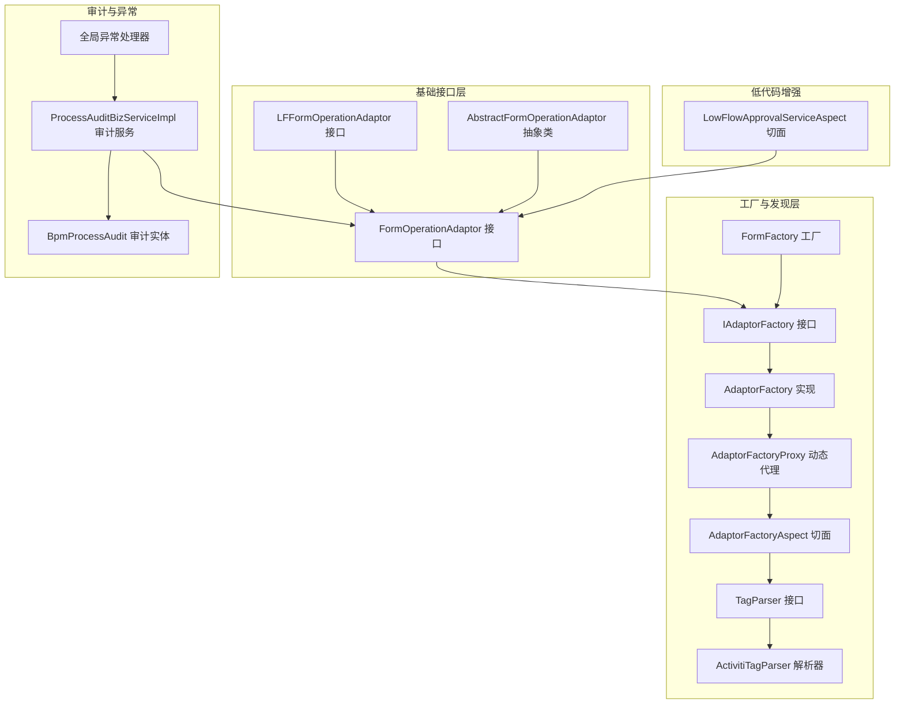
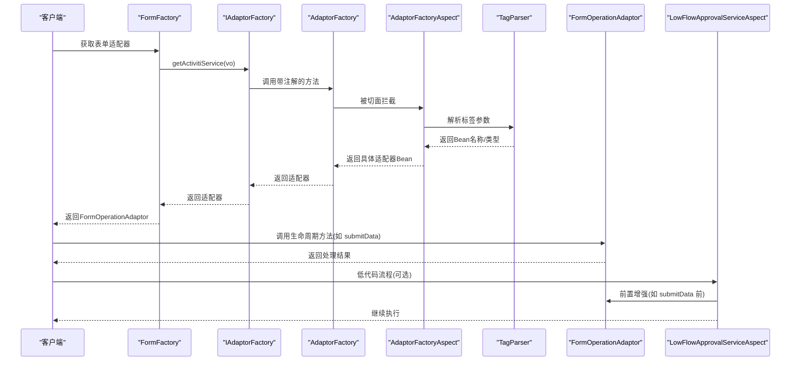
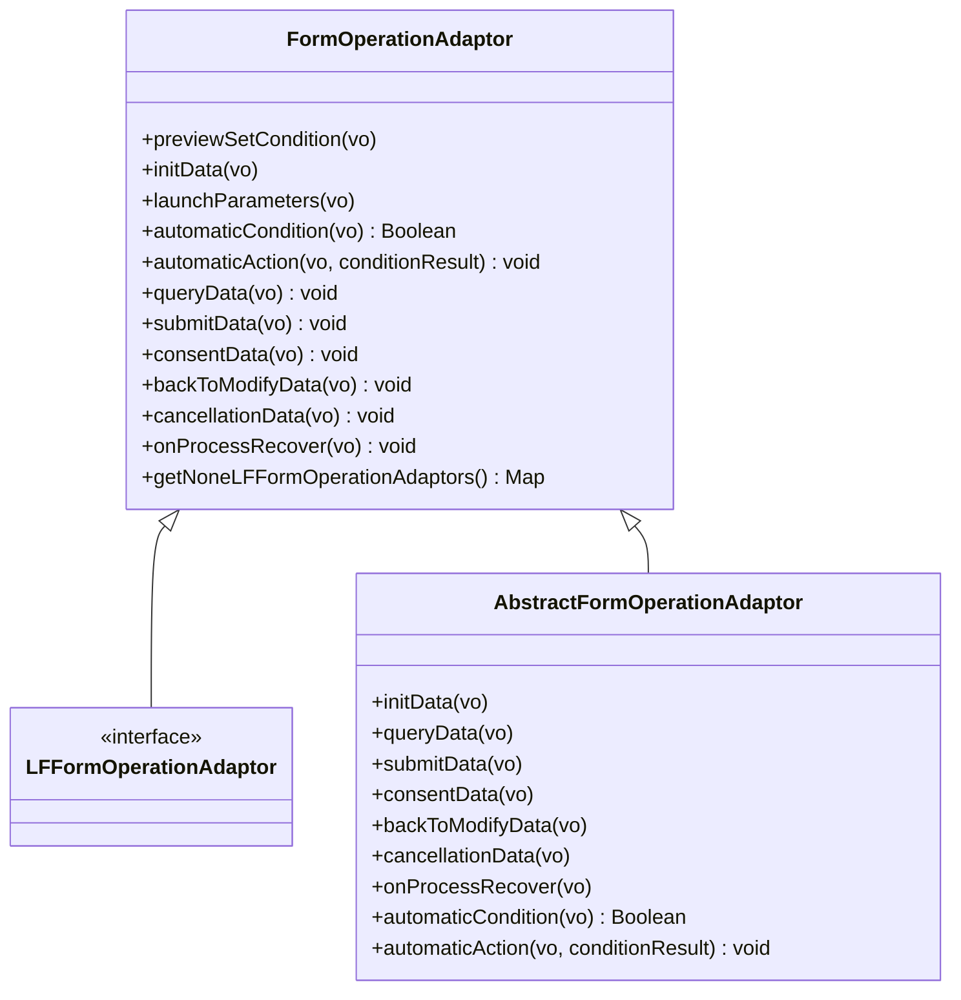
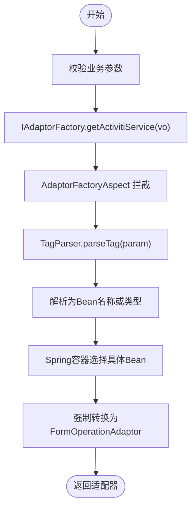
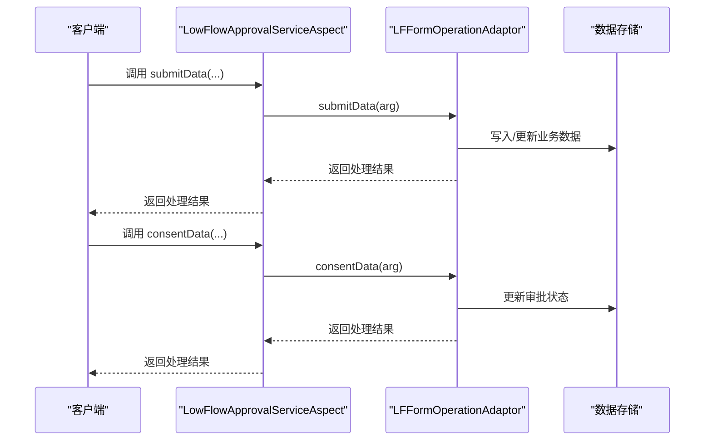
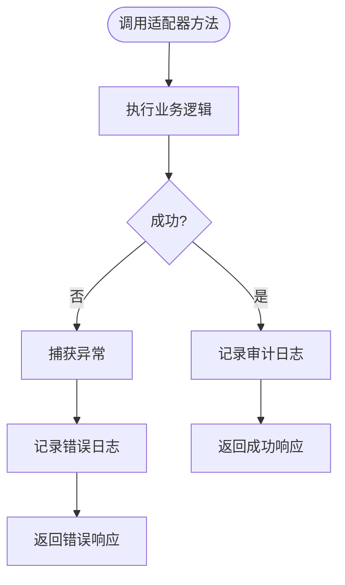
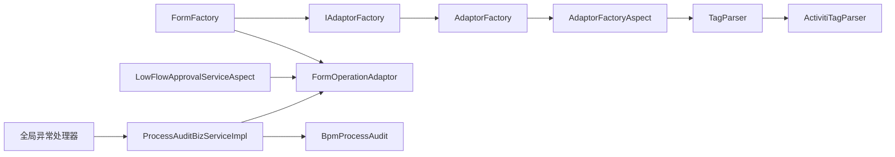

# 表单操作适配器

<cite>
**本文引用的文件**
- [FormOperationAdaptor 接口](file://antflow-base/src/main/java/org/openoa/base/interf/FormOperationAdaptor.java)
- [LFFormOperationAdaptor 接口](file://antflow-base/src/main/java/org/openoa/base/interf/LFFormOperationAdaptor.java)
- [AbstractFormOperationAdaptor 抽象类](file://antflow-engine/src/main/java/org/openoa/engine/bpmnconf/adp/processoperation/AbstractFormOperationAdaptor.java)
- [FormFactory 工厂](file://antflow-engine/src/main/java/org/openoa/engine/factory/FormFactory.java)
- [IAdaptorFactory 接口](file://antflow-engine/src/main/java/org/openoa/engine/factory/IAdaptorFactory.java)
- [AdaptorFactory 工厂实现](file://antflow-engine/src/main/java/org/openoa/engine/factory/AdaptorFactory.java)
- [AdaptorFactoryProxy 动态代理](file://antflow-engine/src/main/java/org/openoa/engine/factory/AdaptorFactoryProxy.java)
- [AdaptorFactoryAspect 切面](file://antflow-engine/src/main/java/org/openoa/engine/factory/AdaptorFactoryAspect.java)
- [TagParser 接口](file://antflow-engine/src/main/java/org/openoa/engine/factory/TagParser.java)
- [ActivitiTagParser 标签解析器](file://antflow-engine/src/main/java/org/openoa/engine/bpmnconf/service/tagparser/ActivitiTagParser.java)
- [LowFlowApprovalServiceAspect 低代码流程切面](file://antflow-engine/src/main/java/org/openoa/engine/conf/aspect/LowFlowApprovalServiceAspect.java)
- [ProcessAuditBizServiceImpl 审计服务](file://antflow-engine/src/main/java/org/openoa/engine/bpmnconf/service/biz/ProcessAuditBizServiceImpl.java)
- [BpmProcessAudit 审计实体](file://antflow-base/src/main/java/org/openoa/base/entity/BpmProcessAudit.java)
- [系统扩展文档](file://doc/系统介绍篇/23.系统扩展.md)
- [流程操作与任务管理](file://doc/系统介绍篇/11.流程操作和任务管理.md)
- [低代码引擎文档](file://doc/系统介绍篇/9.低代码引擎.md)
- [全局异常处理器](file://antflow-web/src/main/java/org/antflow/common/config/mvc/GlobalExceptionHandler.java)
</cite>

## 目录
1. [简介](#简介)
2. [项目结构](#项目结构)
3. [核心组件](#核心组件)
4. [架构总览](#架构总览)
5. [详细组件分析](#详细组件分析)
6. [依赖关系分析](#依赖关系分析)
7. [性能考量](#性能考量)
8. [故障排查指南](#故障排查指南)
9. [结论](#结论)
10. [附录](#附录)

## 简介
本文件面向“表单操作适配器”的技术文档，系统阐述适配器模式在表单操作中的应用、不同表单类型的处理策略、操作流程的标准化机制。重点说明适配器的注册与发现机制、适配器链的执行顺序、异常处理与回滚策略、扩展点设计与自定义适配器开发规范、适配器间通信机制，以及审计日志、权限控制与并发处理策略。同时提供完整的适配器开发示例、集成测试方法与性能监控方案。

## 项目结构
围绕表单操作适配器的关键模块分布如下：
- 基础接口层：FormOperationAdaptor、LFFormOperationAdaptor、AbstractFormOperationAdaptor
- 工厂与发现层：FormFactory、IAdaptorFactory、AdaptorFactory、AdaptorFactoryProxy、AdaptorFactoryAspect、TagParser、ActivitiTagParser
- 低代码流程增强：LowFlowApprovalServiceAspect
- 审计与异常：ProcessAuditBizServiceImpl、BpmProcessAudit、全局异常处理器

**图表来源**
- [FormOperationAdaptor 接口:1-106](file://antflow-base/src/main/java/org/openoa/base/interf/FormOperationAdaptor.java#L1-L106)
- [LFFormOperationAdaptor 接口:1-17](file://antflow-base/src/main/java/org/openoa/base/interf/LFFormOperationAdaptor.java#L1-L17)
- [AbstractFormOperationAdaptor 抽象类:1-62](file://antflow-engine/src/main/java/org/openoa/engine/bpmnconf/adp/processoperation/AbstractFormOperationAdaptor.java#L1-L62)
- [IAdaptorFactory 接口:1-53](file://antflow-engine/src/main/java/org/openoa/engine/factory/IAdaptorFactory.java#L1-L53)
- [AdaptorFactory 工厂实现:1-34](file://antflow-engine/src/main/java/org/openoa/engine/factory/AdaptorFactory.java#L1-L34)
- [AdaptorFactoryProxy 动态代理:1-121](file://antflow-engine/src/main/java/org/openoa/engine/factory/AdaptorFactoryProxy.java#L1-L121)
- [AdaptorFactoryAspect 切面:1-36](file://antflow-engine/src/main/java/org/openoa/engine/factory/AdaptorFactoryAspect.java#L1-L36)
- [TagParser 接口:1-13](file://antflow-engine/src/main/java/org/openoa/engine/factory/TagParser.java#L1-L13)
- [ActivitiTagParser 标签解析器:1-15](file://antflow-engine/src/main/java/org/openoa/engine/bpmnconf/service/tagparser/ActivitiTagParser.java#L1-L15)
- [FormFactory 工厂:1-159](file://antflow-engine/src/main/java/org/openoa/engine/factory/FormFactory.java#L1-L159)
- [LowFlowApprovalServiceAspect 低代码流程切面:86-151](file://antflow-engine/src/main/java/org/openoa/engine/conf/aspect/LowFlowApprovalServiceAspect.java#L86-L151)
- [ProcessAuditBizServiceImpl 审计服务:1-39](file://antflow-engine/src/main/java/org/openoa/engine/bpmnconf/service/biz/ProcessAuditBizServiceImpl.java#L1-L39)
- [BpmProcessAudit 审计实体:1-60](file://antflow-base/src/main/java/org/openoa/base/entity/BpmProcessAudit.java#L1-L60)
- [全局异常处理器:106-135](file://antflow-web/src/main/java/org/antflow/common/config/mvc/GlobalExceptionHandler.java#L106-L135)

**章节来源**
- [FormOperationAdaptor 接口:1-106](file://antflow-base/src/main/java/org/openoa/base/interf/FormOperationAdaptor.java#L1-L106)
- [FormFactory 工厂:1-159](file://antflow-engine/src/main/java/org/openoa/engine/factory/FormFactory.java#L1-L159)
- [IAdaptorFactory 接口:1-53](file://antflow-engine/src/main/java/org/openoa/engine/factory/IAdaptorFactory.java#L1-L53)

## 核心组件
- FormOperationAdaptor：表单操作适配器核心接口，定义表单生命周期各阶段的标准方法，包括预览条件设置、初始化数据、启动参数、自动条件与动作、查询、提交、同意、退回修改、作废、流程恢复等。
- LFFormOperationAdaptor：低代码表单专用适配器接口，继承自FormOperationAdaptor，适用于低代码流程的特殊行为。
- AbstractFormOperationAdaptor：内置抽象适配器，提供默认空实现，便于快速实现DIY流程。
- IAdaptorFactory：适配器工厂接口，声明各类适配器的获取方法，含注解驱动的标签解析。
- AdaptorFactory：IAdaptorFactory的具体实现，结合标签解析器选择合适的适配器实现。
- AdaptorFactoryProxy：基于Javassist的动态代理生成器，按方法注解生成代理，实现运行时Bean选择。
- AdaptorFactoryAspect：环绕切面，拦截带注解的方法，委托TagParser解析参数并选择具体Bean。
- TagParser/ActivitiTagParser：标签解析器接口及其实现，负责将业务参数解析为Bean名称或类型。
- FormFactory：表单工厂，负责根据表单代码获取FormOperationAdaptor实例，并进行表单数据转换。
- LowFlowApprovalServiceAspect：低代码流程切面，对LF适配器进行前置增强，支持自由搭便车模式。
- ProcessAuditBizServiceImpl：审计服务，记录流程关键节点的字段变更与操作轨迹。
- BpmProcessAudit：审计实体，持久化审计日志字段。
- 全局异常处理器：统一捕获业务异常与框架异常，输出标准响应。

**章节来源**
- [FormOperationAdaptor 接口:1-106](file://antflow-base/src/main/java/org/openoa/base/interf/FormOperationAdaptor.java#L1-L106)
- [LFFormOperationAdaptor 接口:1-17](file://antflow-base/src/main/java/org/openoa/base/interf/LFFormOperationAdaptor.java#L1-L17)
- [AbstractFormOperationAdaptor 抽象类:1-62](file://antflow-engine/src/main/java/org/openoa/engine/bpmnconf/adp/processoperation/AbstractFormOperationAdaptor.java#L1-L62)
- [IAdaptorFactory 接口:1-53](file://antflow-engine/src/main/java/org/openoa/engine/factory/IAdaptorFactory.java#L1-L53)
- [AdaptorFactory 工厂实现:1-34](file://antflow-engine/src/main/java/org/openoa/engine/factory/AdaptorFactory.java#L1-L34)
- [AdaptorFactoryProxy 动态代理:1-121](file://antflow-engine/src/main/java/org/openoa/engine/factory/AdaptorFactoryProxy.java#L1-L121)
- [AdaptorFactoryAspect 切面:1-36](file://antflow-engine/src/main/java/org/openoa/engine/factory/AdaptorFactoryAspect.java#L1-L36)
- [TagParser 接口:1-13](file://antflow-engine/src/main/java/org/openoa/engine/factory/TagParser.java#L1-L13)
- [ActivitiTagParser 标签解析器:1-15](file://antflow-engine/src/main/java/org/openoa/engine/bpmnconf/service/tagparser/ActivitiTagParser.java#L1-L15)
- [FormFactory 工厂:1-159](file://antflow-engine/src/main/java/org/openoa/engine/factory/FormFactory.java#L1-L159)
- [LowFlowApprovalServiceAspect 低代码流程切面:86-151](file://antflow-engine/src/main/java/org/openoa/engine/conf/aspect/LowFlowApprovalServiceAspect.java#L86-L151)
- [ProcessAuditBizServiceImpl 审计服务:1-39](file://antflow-engine/src/main/java/org/openoa/engine/bpmnconf/service/biz/ProcessAuditBizServiceImpl.java#L1-L39)
- [BpmProcessAudit 审计实体:1-60](file://antflow-base/src/main/java/org/openoa/base/entity/BpmProcessAudit.java#L1-L60)
- [全局异常处理器:106-135](file://antflow-web/src/main/java/org/antflow/common/config/mvc/GlobalExceptionHandler.java#L106-L135)

## 架构总览
表单操作适配器采用“接口 + 工厂 + 注解 + 动态代理 + 切面”的组合架构，实现：
- 适配器注册与发现：通过Spring容器管理Bean，按表单代码或流程类型自动选择对应适配器。
- 适配器链执行：在流程生命周期内，按阶段调用适配器方法；低代码流程通过切面增强前置处理。
- 异常与回滚：统一异常处理与业务异常封装；流程状态变化触发回滚或恢复逻辑。
- 审计与权限：审计服务记录关键字段变更；权限控制贯穿任务查询与操作检查。

**图表来源**
- [FormFactory 工厂:50-62](file://antflow-engine/src/main/java/org/openoa/engine/factory/FormFactory.java#L50-L62)
- [IAdaptorFactory 接口:28-52](file://antflow-engine/src/main/java/org/openoa/engine/factory/IAdaptorFactory.java#L28-L52)
- [AdaptorFactory 工厂实现:17-31](file://antflow-engine/src/main/java/org/openoa/engine/factory/AdaptorFactory.java#L17-L31)
- [AdaptorFactoryAspect 切面:27-36](file://antflow-engine/src/main/java/org/openoa/engine/factory/AdaptorFactoryAspect.java#L27-L36)
- [TagParser 接口:10-12](file://antflow-engine/src/main/java/org/openoa/engine/factory/TagParser.java#L10-L12)
- [FormOperationAdaptor 接口:14-105](file://antflow-base/src/main/java/org/openoa/base/interf/FormOperationAdaptor.java#L14-L105)
- [LowFlowApprovalServiceAspect 低代码流程切面:86-151](file://antflow-engine/src/main/java/org/openoa/engine/conf/aspect/LowFlowApprovalServiceAspect.java#L86-L151)

## 详细组件分析

### 组件A：FormOperationAdaptor 接口与生命周期
- 角色定位：定义表单在流程生命周期内的标准操作契约，覆盖预览、初始化、启动参数、自动条件与动作、查询、提交、同意、退回修改、作废、流程恢复等。
- 设计要点：
  - 泛型约束：T extends BusinessDataVo，确保适配器处理的数据类型一致性。
  - 默认方法：提供非低代码表单适配器集合筛选能力，便于批量处理。
  - 与ActivitiService、ProcessFinishListener的继承关系，统一生命周期与事件监听。
- 扩展建议：
  - 自定义适配器需实现必要方法；若无需某阶段逻辑，可保留空实现。
  - 对于低代码流程，推荐实现LFFormOperationAdaptor并遵循低代码约定。

**图表来源**
- [FormOperationAdaptor 接口:14-105](file://antflow-base/src/main/java/org/openoa/base/interf/FormOperationAdaptor.java#L14-L105)
- [LFFormOperationAdaptor 接口:13-17](file://antflow-base/src/main/java/org/openoa/base/interf/LFFormOperationAdaptor.java#L13-L17)
- [AbstractFormOperationAdaptor 抽象类:13-62](file://antflow-engine/src/main/java/org/openoa/engine/bpmnconf/adp/processoperation/AbstractFormOperationAdaptor.java#L13-L62)

**章节来源**
- [FormOperationAdaptor 接口:1-106](file://antflow-base/src/main/java/org/openoa/base/interf/FormOperationAdaptor.java#L1-L106)
- [LFFormOperationAdaptor 接口:1-17](file://antflow-base/src/main/java/org/openoa/base/interf/LFFormOperationAdaptor.java#L1-L17)
- [AbstractFormOperationAdaptor 抽象类:1-62](file://antflow-engine/src/main/java/org/openoa/engine/bpmnconf/adp/processoperation/AbstractFormOperationAdaptor.java#L1-L62)

### 组件B：工厂与发现机制
- IAdaptorFactory：声明各类适配器获取方法，使用注解标记解析器类型，实现“按参数类型解析Bean名称/类型”的统一入口。
- AdaptorFactory：具体实现，结合标签解析器选择Bean。
- AdaptorFactoryProxy：动态生成IAdaptorFactory代理，按方法注解注入TagParser，运行时解析参数并选择Bean。
- AdaptorFactoryAspect：环绕切面，拦截带注解的方法，委托TagParser解析参数，返回Bean或Bean名称。
- FormFactory：根据表单代码获取FormOperationAdaptor实例；支持外部访问流程与低代码流程的特殊处理；支持表单数据转换。

**图表来源**
- [IAdaptorFactory 接口:28-52](file://antflow-engine/src/main/java/org/openoa/engine/factory/IAdaptorFactory.java#L28-L52)
- [AdaptorFactory 工厂实现:17-31](file://antflow-engine/src/main/java/org/openoa/engine/factory/AdaptorFactory.java#L17-L31)
- [AdaptorFactoryProxy 动态代理:64-104](file://antflow-engine/src/main/java/org/openoa/engine/factory/AdaptorFactoryProxy.java#L64-L104)
- [AdaptorFactoryAspect 切面:27-36](file://antflow-engine/src/main/java/org/openoa/engine/factory/AdaptorFactoryAspect.java#L27-L36)
- [TagParser 接口:10-12](file://antflow-engine/src/main/java/org/openoa/engine/factory/TagParser.java#L10-L12)
- [ActivitiTagParser 标签解析器:7-14](file://antflow-engine/src/main/java/org/openoa/engine/bpmnconf/service/tagparser/ActivitiTagParser.java#L7-L14)
- [FormFactory 工厂:50-62](file://antflow-engine/src/main/java/org/openoa/engine/factory/FormFactory.java#L50-L62)

**章节来源**
- [IAdaptorFactory 接口:1-53](file://antflow-engine/src/main/java/org/openoa/engine/factory/IAdaptorFactory.java#L1-L53)
- [AdaptorFactory 工厂实现:1-34](file://antflow-engine/src/main/java/org/openoa/engine/factory/AdaptorFactory.java#L1-L34)
- [AdaptorFactoryProxy 动态代理:1-121](file://antflow-engine/src/main/java/org/openoa/engine/factory/AdaptorFactoryProxy.java#L1-L121)
- [AdaptorFactoryAspect 切面:1-36](file://antflow-engine/src/main/java/org/openoa/engine/factory/AdaptorFactoryAspect.java#L1-L36)
- [TagParser 接口:1-13](file://antflow-engine/src/main/java/org/openoa/engine/factory/TagParser.java#L1-L13)
- [ActivitiTagParser 标签解析器:1-15](file://antflow-engine/src/main/java/org/openoa/engine/bpmnconf/service/tagparser/ActivitiTagParser.java#L1-L15)
- [FormFactory 工厂:1-159](file://antflow-engine/src/main/java/org/openoa/engine/factory/FormFactory.java#L1-L159)

### 组件C：低代码流程增强与适配器链
- LowFlowApprovalServiceAspect：对LF适配器进行前置增强，按方法名分派到对应生命周期方法；支持“自由搭便车”模式，可通过标志位跳过后续处理。
- 适配器链执行顺序：
  - 非低代码：由FormFactory按表单代码获取FormOperationAdaptor，依次调用生命周期方法。
  - 低代码：先经LowFlowApprovalServiceAspect前置增强，再调用对应LF适配器方法。
- 回滚策略：当流程被打回或作废时，调用适配器的退回修改或作废方法，实现业务数据的逆向处理。

**图表来源**
- [LowFlowApprovalServiceAspect 低代码流程切面:86-151](file://antflow-engine/src/main/java/org/openoa/engine/conf/aspect/LowFlowApprovalServiceAspect.java#L86-L151)
- [FormOperationAdaptor 接口:60-91](file://antflow-base/src/main/java/org/openoa/base/interf/FormOperationAdaptor.java#L60-L91)

**章节来源**
- [LowFlowApprovalServiceAspect 低代码流程切面:86-151](file://antflow-engine/src/main/java/org/openoa/engine/conf/aspect/LowFlowApprovalServiceAspect.java#L86-L151)
- [FormOperationAdaptor 接口:60-91](file://antflow-base/src/main/java/org/openoa/base/interf/FormOperationAdaptor.java#L60-L91)

### 组件D：审计日志与异常处理
- 审计日志：ProcessAuditBizServiceImpl通过FormFactory获取适配器，结合Javers对比字段差异，记录到BpmProcessAudit实体。
- 异常处理：全局异常处理器捕获业务异常与框架异常，输出统一响应；对外回调失败时记录错误日志并返回空结果，避免中断主流程。

**图表来源**
- [ProcessAuditBizServiceImpl 审计服务:1-39](file://antflow-engine/src/main/java/org/openoa/engine/bpmnconf/service/biz/ProcessAuditBizServiceImpl.java#L1-L39)
- [BpmProcessAudit 审计实体:1-60](file://antflow-base/src/main/java/org/openoa/base/entity/BpmProcessAudit.java#L1-L60)
- [全局异常处理器:106-135](file://antflow-web/src/main/java/org/antflow/common/config/mvc/GlobalExceptionHandler.java#L106-L135)

**章节来源**
- [ProcessAuditBizServiceImpl 审计服务:1-39](file://antflow-engine/src/main/java/org/openoa/engine/bpmnconf/service/biz/ProcessAuditBizServiceImpl.java#L1-L39)
- [BpmProcessAudit 审计实体:1-60](file://antflow-base/src/main/java/org/openoa/base/entity/BpmProcessAudit.java#L1-L60)
- [全局异常处理器:106-135](file://antflow-web/src/main/java/org/antflow/common/config/mvc/GlobalExceptionHandler.java#L106-L135)

## 依赖关系分析
- 组件耦合：
  - FormFactory依赖IAdaptorFactory与外部访问业务服务，承担“表单代码 → 适配器实例”的映射职责。
  - IAdaptorFactory通过注解与TagParser协作，实现“参数 → Bean名称/类型”的解析。
  - AdaptorFactoryProxy与AdaptorFactoryAspect共同完成动态代理与运行时选择。
  - LowFlowApprovalServiceAspect与FormOperationAdaptor形成增强与被增强的关系。
- 外部依赖：
  - Spring容器负责Bean生命周期与依赖注入。
  - Javers用于字段级审计差异计算。
  - Activiti引擎提供任务与流程实例管理（间接通过适配器与业务服务交互）。

**图表来源**
- [FormFactory 工厂:42-62](file://antflow-engine/src/main/java/org/openoa/engine/factory/FormFactory.java#L42-L62)
- [IAdaptorFactory 接口:28-52](file://antflow-engine/src/main/java/org/openoa/engine/factory/IAdaptorFactory.java#L28-L52)
- [AdaptorFactory 工厂实现:17-31](file://antflow-engine/src/main/java/org/openoa/engine/factory/AdaptorFactory.java#L17-L31)
- [AdaptorFactoryAspect 切面:27-36](file://antflow-engine/src/main/java/org/openoa/engine/factory/AdaptorFactoryAspect.java#L27-L36)
- [TagParser 接口:10-12](file://antflow-engine/src/main/java/org/openoa/engine/factory/TagParser.java#L10-L12)
- [ActivitiTagParser 标签解析器:7-14](file://antflow-engine/src/main/java/org/openoa/engine/bpmnconf/service/tagparser/ActivitiTagParser.java#L7-L14)
- [FormOperationAdaptor 接口:14-105](file://antflow-base/src/main/java/org/openoa/base/interf/FormOperationAdaptor.java#L14-L105)
- [LowFlowApprovalServiceAspect 低代码流程切面:86-151](file://antflow-engine/src/main/java/org/openoa/engine/conf/aspect/LowFlowApprovalServiceAspect.java#L86-L151)
- [ProcessAuditBizServiceImpl 审计服务:1-39](file://antflow-engine/src/main/java/org/openoa/engine/bpmnconf/service/biz/ProcessAuditBizServiceImpl.java#L1-L39)
- [BpmProcessAudit 审计实体:1-60](file://antflow-base/src/main/java/org/openoa/base/entity/BpmProcessAudit.java#L1-L60)
- [全局异常处理器:106-135](file://antflow-web/src/main/java/org/antflow/common/config/mvc/GlobalExceptionHandler.java#L106-L135)

**章节来源**
- [FormFactory 工厂:1-159](file://antflow-engine/src/main/java/org/openoa/engine/factory/FormFactory.java#L1-L159)
- [IAdaptorFactory 接口:1-53](file://antflow-engine/src/main/java/org/openoa/engine/factory/IAdaptorFactory.java#L1-L53)
- [AdaptorFactory 工厂实现:1-34](file://antflow-engine/src/main/java/org/openoa/engine/factory/AdaptorFactory.java#L1-L34)
- [AdaptorFactoryAspect 切面:1-36](file://antflow-engine/src/main/java/org/openoa/engine/factory/AdaptorFactoryAspect.java#L1-L36)
- [TagParser 接口:1-13](file://antflow-engine/src/main/java/org/openoa/engine/factory/TagParser.java#L1-L13)
- [ActivitiTagParser 标签解析器:1-15](file://antflow-engine/src/main/java/org/openoa/engine/bpmnconf/service/tagparser/ActivitiTagParser.java#L1-L15)
- [FormOperationAdaptor 接口:1-106](file://antflow-base/src/main/java/org/openoa/base/interf/FormOperationAdaptor.java#L1-L106)
- [LowFlowApprovalServiceAspect 低代码流程切面:86-151](file://antflow-engine/src/main/java/org/openoa/engine/conf/aspect/LowFlowApprovalServiceAspect.java#L86-L151)
- [ProcessAuditBizServiceImpl 审计服务:1-39](file://antflow-engine/src/main/java/org/openoa/engine/bpmnconf/service/biz/ProcessAuditBizServiceImpl.java#L1-L39)
- [BpmProcessAudit 审计实体:1-60](file://antflow-base/src/main/java/org/openoa/base/entity/BpmProcessAudit.java#L1-L60)
- [全局异常处理器:106-135](file://antflow-web/src/main/java/org/antflow/common/config/mvc/GlobalExceptionHandler.java#L106-L135)

## 性能考量
- 动态代理与反射：AdaptorFactoryProxy通过Javassist生成代理，减少重复样板代码；但需注意代理生成成本与运行时解析开销。
- Spring容器查找：按Bean名称或类型查找适配器，建议合理命名与缓存策略，避免频繁扫描。
- 低代码流程增强：前置增强仅在LF流程生效，对非LF流程无额外开销。
- 审计差异计算：Javers字段对比可能带来CPU与内存压力，建议对关键字段进行差异化审计。
- 并发处理：流程任务并发场景下，适配器方法需保证幂等与事务一致性；必要时引入分布式锁或乐观锁。

[本节为通用性能指导，不直接分析具体文件]

## 故障排查指南
- 适配器未找到：
  - 检查表单代码与Bean名称是否一致；确认Bean已注册且作用域正确。
  - 查看IAdaptorFactory注解与TagParser解析是否匹配。
- 生命周期方法异常：
  - 统一由全局异常处理器捕获并输出标准响应；关注业务异常码与消息。
  - 审计日志可辅助定位字段变更与操作时间线。
- 低代码流程异常：
  - 检查LowFlowApprovalServiceAspect是否正确拦截方法名；确认LF适配器Bean名称与formCode一致。
- 回滚与恢复：
  - 当流程被打回或作废时，检查适配器的退回修改与作废方法实现；确保业务状态与流程状态一致。

**章节来源**
- [全局异常处理器:106-135](file://antflow-web/src/main/java/org/antflow/common/config/mvc/GlobalExceptionHandler.java#L106-L135)
- [LowFlowApprovalServiceAspect 低代码流程切面:86-151](file://antflow-engine/src/main/java/org/openoa/engine/conf/aspect/LowFlowApprovalServiceAspect.java#L86-L151)
- [ProcessAuditBizServiceImpl 审计服务:1-39](file://antflow-engine/src/main/java/org/openoa/engine/bpmnconf/service/biz/ProcessAuditBizServiceImpl.java#L1-L39)

## 结论
表单操作适配器通过接口契约、工厂与注解驱动的发现机制、动态代理与切面增强，实现了对不同表单类型的统一处理与扩展。配合低代码流程增强、审计日志与异常处理，形成了从注册发现、执行链路、异常回滚到审计追踪的完整闭环。开发者可依据本文档规范快速实现自定义适配器，并在保证性能与并发安全的前提下，灵活扩展业务能力。

[本节为总结性内容，不直接分析具体文件]

## 附录

### 开发示例与最佳实践
- 自定义表单适配器：
  - 实现FormOperationAdaptor接口，按需覆盖生命周期方法；Bean名称与表单代码保持一致。
  - 参考系统扩展文档中的示例与步骤。
- 低代码表单适配器：
  - 实现LFFormOperationAdaptor接口，Bean名称需与低代码表单formCode一致；必要时使用AbstractFreeRideFormOperationAdaptor简化实现。
- 扩展点与注册：
  - 通过IAdaptorFactory声明适配器获取方法，使用注解与TagParser实现自动解析。
  - 低代码流程通过切面增强前置处理，支持自由搭便车模式。

**章节来源**
- [系统扩展文档:144-186](file://doc/系统介绍篇/23.系统扩展.md#L144-L186)
- [低代码引擎文档:133-164](file://doc/系统介绍篇/9.低代码引擎.md#L133-L164)

### 集成测试方法
- 单元测试：
  - Mock FormFactory与IAdaptorFactory，验证表单代码到适配器的映射。
  - Mock TagParser与AdaptorFactoryAspect，验证动态代理与Bean选择。
- 集成测试：
  - 模拟流程生命周期调用，覆盖预览、初始化、提交、同意、退回修改、作废、完成等场景。
  - 验证低代码流程切面对LF适配器的前置增强效果。
- 审计测试：
  - 验证字段变更记录到BpmProcessAudit；核对任务名称、任务定义key、创建人与时间。

**章节来源**
- [FormFactory 工厂:50-123](file://antflow-engine/src/main/java/org/openoa/engine/factory/FormFactory.java#L50-L123)
- [IAdaptorFactory 接口:28-52](file://antflow-engine/src/main/java/org/openoa/engine/factory/IAdaptorFactory.java#L28-L52)
- [LowFlowApprovalServiceAspect 低代码流程切面:86-151](file://antflow-engine/src/main/java/org/openoa/engine/conf/aspect/LowFlowApprovalServiceAspect.java#L86-L151)
- [ProcessAuditBizServiceImpl 审计服务:1-39](file://antflow-engine/src/main/java/org/openoa/engine/bpmnconf/service/biz/ProcessAuditBizServiceImpl.java#L1-L39)

### 性能监控方案
- 指标采集：
  - 适配器方法耗时、调用次数、异常率；低代码流程前置增强耗时占比。
- 监控埋点：
  - 在FormFactory与AdaptorFactoryAspect关键路径埋点；对LF流程切面进行专项监控。
- 告警策略：
  - 超时告警、异常率阈值告警、审计写入延迟告警。

[本节为通用监控建议，不直接分析具体文件]