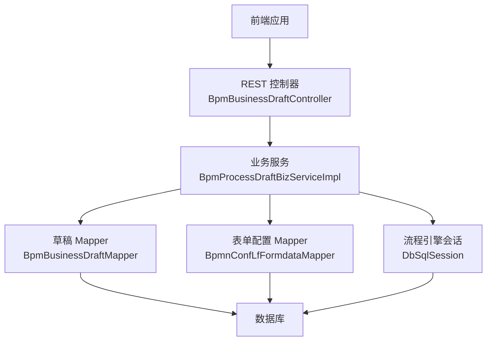
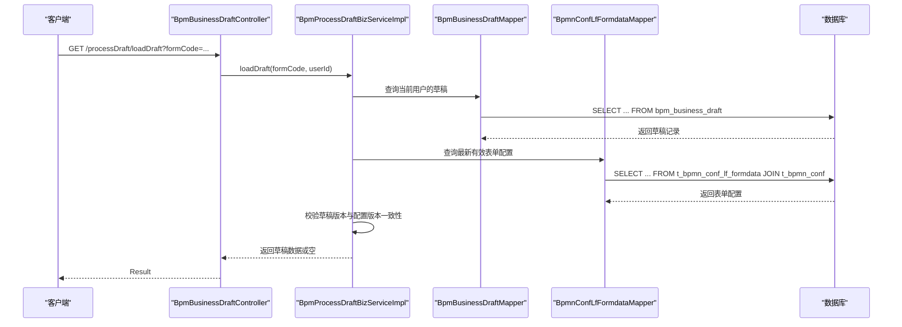
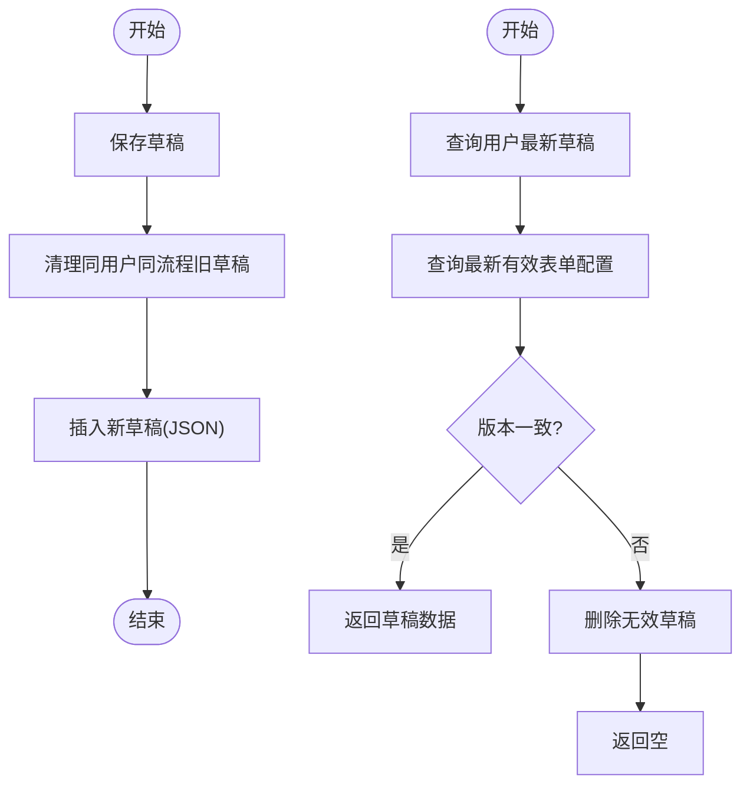
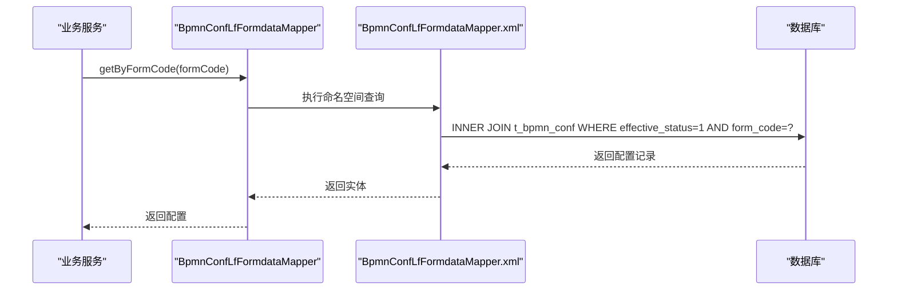
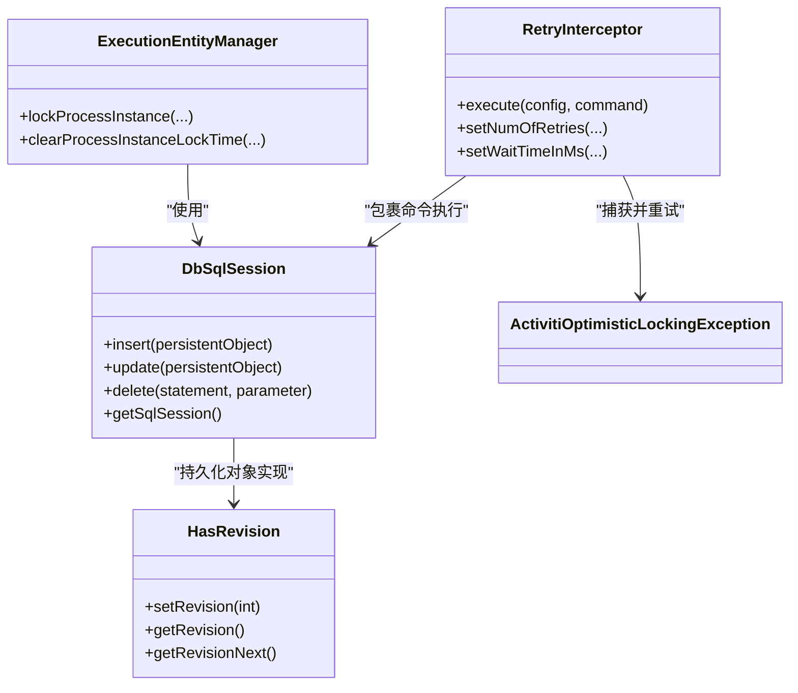
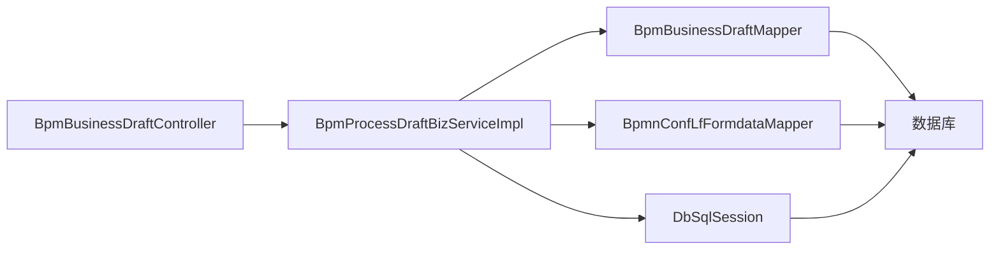

# 表单数据持久化

<cite>
**本文引用的文件**
- [BpmBusinessDraft.java](file://antflow-base/src/main/java/org/openoa/base/entity/BpmBusinessDraft.java)
- [BpmBusiness.java](file://antflow-base/src/main/java/org/openoa/base/entity/BpmBusiness.java)
- [BpmnConfLfFormdata.java](file://antflow-base/src/main/java/org/openoa/base/entity/BpmnConfLfFormdata.java)
- [BpmnConfLfFormdataField.java](file://antflow-base/src/main/java/org/openoa/base/entity/BpmnConfLfFormdataField.java)
- [BpmBusinessDraftMapper.java](file://antflow-engine/src/main/java/org/openoa/engine/bpmnconf/mapper/BpmBusinessDraftMapper.java)
- [BpmnConfLfFormdataMapper.java](file://antflow-engine/src/main/java/org/openoa/engine/bpmnconf/mapper/BpmnConfLfFormdataMapper.java)
- [BpmnConfLfFormdataFieldMapper.java](file://antflow-engine/src/main/java/org/openoa/engine/bpmnconf/mapper/BpmnConfLfFormdataFieldMapper.java)
- [BpmnConfLfFormdataMapper.xml](file://antflow-engine/src/main/resources/mapper/BpmnConfLfFormdataMapper.xml)
- [BpmnConfLfFormdataFieldMapper.xml](file://antflow-engine/src/main/resources/mapper/BpmnConfLfFormdataFieldMapper.xml)
- [BpmProcessDraftBizServiceImpl.java](file://antflow-engine/src/main/java/org/openoa/engine/bpmnconf/service/biz/BpmProcessDraftBizServiceImpl.java)
- [BpmBusinessDraftController.java](file://antflow-engine/src/main/java/org/openoa/engine/bpmnconf/controller/BpmBusinessDraftController.java)
- [BpmProcessDraftBizService.java](file://antflow-engine/src/main/java/org/openoa/engine/bpmnconf/service/interf/biz/BpmProcessDraftBizService.java)
- [BpmnConfLfFormdataService.java](file://antflow-engine/src/main/java/org/openoa/engine/bpmnconf/service/interf/repository/BpmnConfLfFormdataService.java)
- [BpmnConfLfFormdataServiceImpl.java](file://antflow-engine/src/main/java/org/openoa/engine/bpmnconf/service/impl/BpmnConfLfFormdataServiceImpl.java)
- [DbSqlSession.java](file://antflow-base/src/main/java/org/activiti/engine/impl/db/DbSqlSession.java)
- [RetryInterceptor.java](file://antflow-base/src/main/java/org/activiti/engine/impl/interceptor/RetryInterceptor.java)
- [ActivitiOptimisticLockingException.java](file://antflow-base/src/main/java/org/activiti/engine/ActivitiOptimisticLockingException.java)
- [ExecutionEntityManager.java](file://antflow-base/src/main/java/org/activiti/engine/impl/persistence/entity/ExecutionEntityManager.java)
- [HasRevision.java](file://antflow-base/src/main/java/org/activiti/engine/impl/db/HasRevision.java)
- [MultiSchemaMultiTenantProcessEngineConfiguration.java](file://antflow-base/src/main/java/org/activiti/engine/impl/cfg/multitenant/MultiSchemaMultiTenantProcessEngineConfiguration.java)
- [TenantAwareDataSource.java](file://antflow-base/src/main/java/org/activiti/engine/impl/cfg/multitenant/TenantAwareDataSource.java)
- [DefaultDataBaseTypeDetector.java](file://antflow-engine/src/main/java/org/openoa/engine/conf/engineconfig/DefaultDataBaseTypeDetector.java)
- [act_init_db.sql](file://script/act_init_db.sql)
- [bpm_init_db.sql](file://script/bpm_init_db.sql)
- [bpm_init_db_data.sql](file://script/bpm_init_db_data.sql)
</cite>

## 目录
1. [简介](#简介)
2. [项目结构](#项目结构)
3. [核心组件](#核心组件)
4. [架构总览](#架构总览)
5. [详细组件分析](#详细组件分析)
6. [依赖分析](#依赖分析)
7. [性能考虑](#性能考虑)
8. [故障排查指南](#故障排查指南)
9. [结论](#结论)
10. [附录](#附录)

## 简介
本文件围绕“表单数据持久化”主题，系统梳理了该系统中表单数据的存储策略、数据模型设计、持久化层实现架构，以及与业务流程的关联关系、数据一致性保障与事务处理策略。同时覆盖数据访问对象（DAO）设计模式、MyBatis 映射配置、查询优化技术、数据迁移与备份恢复策略、性能监控指标、最佳实践、错误处理与数据完整性验证方法，并提供可操作的故障排查指南。

## 项目结构
本项目采用前后端分离与低代码流程引擎结合的架构。与表单数据持久化直接相关的核心模块包括：
- 基础实体层：定义表单草稿、业务主数据、低代码表单配置等实体类
- 引擎服务层：提供表单草稿保存/加载、低代码表单数据查询等业务能力
- 数据访问层：基于 MyBatis Plus 的 Mapper 接口与 XML 映射
- 流程引擎层：基于 Activiti 的持久化会话与乐观锁控制
- 多租户与数据源：按租户隔离的数据源路由与数据库类型检测

图表来源
- [BpmBusinessDraftController.java:1-23](file://antflow-engine/src/main/java/org/openoa/engine/bpmnconf/controller/BpmBusinessDraftController.java#L1-23)
- [BpmProcessDraftBizServiceImpl.java:1-89](file://antflow-engine/src/main/java/org/openoa/engine/bpmnconf/service/biz/BpmProcessDraftBizServiceImpl.java#L1-89)
- [BpmBusinessDraftMapper.java:1-11](file://antflow-engine/src/main/java/org/openoa/engine/bpmnconf/mapper/BpmBusinessDraftMapper.java#L1-11)
- [BpmnConfLfFormdataMapper.java:1-13](file://antflow-engine/src/main/java/org/openoa/engine/bpmnconf/mapper/BpmnConfLfFormdataMapper.java#L1-13)
- [DbSqlSession.java:145-1497](file://antflow-base/src/main/java/org/activiti/engine/impl/db/DbSqlSession.java#L145-L1497)

章节来源
- [BpmBusinessDraftController.java:1-23](file://antflow-engine/src/main/java/org/openoa/engine/bpmnconf/controller/BpmBusinessDraftController.java#L1-L23)
- [BpmProcessDraftBizServiceImpl.java:1-89](file://antflow-engine/src/main/java/org/openoa/engine/bpmnconf/service/biz/BpmProcessDraftBizServiceImpl.java#L1-L89)
- [BpmBusinessDraftMapper.java:1-11](file://antflow-engine/src/main/java/org/openoa/engine/bpmnconf/mapper/BpmBusinessDraftMapper.java#L1-L11)
- [BpmnConfLfFormdataMapper.java:1-13](file://antflow-engine/src/main/java/org/openoa/engine/bpmnconf/mapper/BpmnConfLfFormdataMapper.java#L1-L13)
- [DbSqlSession.java:145-1497](file://antflow-base/src/main/java/org/activiti/engine/impl/db/DbSqlSession.java#L145-L1497)

## 核心组件
- 实体模型
  - 表单草稿实体：用于持久化用户在流程发起前的草稿数据，包含 JSON 结构的表单数据、流程标识、创建者信息、租户标识等
  - 业务主数据实体：记录业务主键、流程编号、创建人等信息，支撑流程运行期的数据关联
  - 低代码表单配置实体：记录低代码表单的配置数据（JSON），并与流程配置进行关联
  - 低代码表单字段实体：记录字段元信息及条件标记，支撑表单渲染与校验
- 数据访问层
  - 草稿 Mapper：继承 MyBatis Plus BaseMapper，提供标准 CRUD 能力
  - 表单配置 Mapper：提供按表单编码查询最新有效配置的能力
  - 字段配置 Mapper：提供按配置与字段更新条件标记的能力
- 业务服务层
  - 草稿业务服务：负责草稿保存、加载、版本校验与失效清理
  - 低代码表单数据服务：基于 MyBatis Plus 提供的通用服务封装
- 控制器层
  - 提供草稿加载接口，统一返回结果包装

章节来源
- [BpmBusinessDraft.java:1-67](file://antflow-base/src/main/java/org/openoa/base/entity/BpmBusinessDraft.java#L1-L67)
- [BpmBusiness.java:1-65](file://antflow-base/src/main/java/org/openoa/base/entity/BpmBusiness.java#L1-L65)
- [BpmnConfLfFormdata.java:1-72](file://antflow-base/src/main/java/org/openoa/base/entity/BpmnConfLfFormdata.java#L1-L72)
- [BpmnConfLfFormdataField.java:1-51](file://antflow-base/src/main/java/org/openoa/base/entity/BpmnConfLfFormdataField.java#L1-L51)
- [BpmBusinessDraftMapper.java:1-11](file://antflow-engine/src/main/java/org/openoa/engine/bpmnconf/mapper/BpmBusinessDraftMapper.java#L1-L11)
- [BpmnConfLfFormdataMapper.java:1-13](file://antflow-engine/src/main/java/org/openoa/engine/bpmnconf/mapper/BpmnConfLfFormdataMapper.java#L1-L13)
- [BpmnConfLfFormdataFieldMapper.java](file://antflow-engine/src/main/java/org/openoa/engine/bpmnconf/mapper/BpmnConfLfFormdataFieldMapper.java)
- [BpmProcessDraftBizService.java:1-12](file://antflow-engine/src/main/java/org/openoa/engine/bpmnconf/service/interf/biz/BpmProcessDraftBizService.java#L1-L12)
- [BpmnConfLfFormdataService.java:1-8](file://antflow-engine/src/main/java/org/openoa/engine/bpmnconf/service/interf/repository/BpmnConfLfFormdataService.java#L1-L8)
- [BpmnConfLfFormdataServiceImpl.java:1-11](file://antflow-engine/src/main/java/org/openoa/engine/bpmnconf/service/impl/BpmnConfLfFormdataServiceImpl.java#L1-L11)

## 架构总览
表单数据持久化贯穿“控制器—业务服务—数据访问—数据库”的链路，并通过流程引擎的会话层完成底层的插入/更新操作。系统还具备多租户数据源路由能力，确保不同租户的数据隔离。

图表来源
- [BpmBusinessDraftController.java:1-23](file://antflow-engine/src/main/java/org/openoa/engine/bpmnconf/controller/BpmBusinessDraftController.java#L1-L23)
- [BpmProcessDraftBizServiceImpl.java:1-89](file://antflow-engine/src/main/java/org/openoa/engine/bpmnconf/service/biz/BpmProcessDraftBizServiceImpl.java#L1-L89)
- [BpmBusinessDraftMapper.java:1-11](file://antflow-engine/src/main/java/org/openoa/engine/bpmnconf/mapper/BpmBusinessDraftMapper.java#L1-L11)
- [BpmnConfLfFormdataMapper.java:1-13](file://antflow-engine/src/main/java/org/openoa/engine/bpmnconf/mapper/BpmnConfLfFormdataMapper.java#L1-L13)
- [BpmnConfLfFormdataMapper.xml:1-11](file://antflow-engine/src/main/resources/mapper/BpmnConfLfFormdataMapper.xml#L1-L11)

## 详细组件分析

### 组件一：表单草稿持久化（草稿保存与加载）
- 存储策略
  - 同一流程仅保留最新版本草稿，历史草稿无意义；保存时先清理同用户同流程的旧草稿
  - 草稿以 JSON 形式存储，便于跨版本兼容与灵活扩展
  - 支持多租户隔离，草稿记录包含租户标识
- 业务流程关联
  - 草稿与流程模板通过表单编码关联；加载时需比对当前有效模板版本，不一致则视为失效
- 数据一致性与事务
  - 保存采用单条插入，删除与插入在同一事务内执行，避免并发导致的脏写
  - 加载采用读取最新一条草稿，若版本不匹配则删除并返回空
- DAO 设计与 MyBatis 映射
  - 使用 MyBatis Plus BaseMapper 提供标准 CRUD
  - 无需额外 XML，通过注解与通用服务实现
- 错误处理
  - 未找到有效模板配置时抛出业务异常
  - 版本不一致时清理无效草稿并返回空

图表来源
- [BpmProcessDraftBizServiceImpl.java:31-88](file://antflow-engine/src/main/java/org/openoa/engine/bpmnconf/service/biz/BpmProcessDraftBizServiceImpl.java#L31-L88)
- [BpmBusinessDraftMapper.java:1-11](file://antflow-engine/src/main/java/org/openoa/engine/bpmnconf/mapper/BpmBusinessDraftMapper.java#L1-L11)

章节来源
- [BpmProcessDraftBizServiceImpl.java:1-89](file://antflow-engine/src/main/java/org/openoa/engine/bpmnconf/service/biz/BpmProcessDraftBizServiceImpl.java#L1-L89)
- [BpmBusinessDraftController.java:1-23](file://antflow-engine/src/main/java/org/openoa/engine/bpmnconf/controller/BpmBusinessDraftController.java#L1-L23)
- [BpmBusinessDraft.java:1-67](file://antflow-base/src/main/java/org/openoa/base/entity/BpmBusinessDraft.java#L1-L67)

### 组件二：低代码表单配置持久化（按表单编码查询）
- 存储策略
  - 低代码表单配置以 JSON 字段形式存储，便于动态表单结构的灵活表达
  - 通过与流程配置表的关联，实现“表单编码—配置版本—有效状态”的查询
- DAO 设计与 MyBatis 映射
  - Mapper 接口提供按表单编码查询最新有效配置的方法
  - XML 中通过内连接查询，限定有效状态与表单编码
- 性能优化建议
  - 在表单配置表与流程配置表建立合适的索引，加速按编码与状态的过滤
  - 对常用查询参数建立复合索引，减少连接成本

图表来源
- [BpmnConfLfFormdataMapper.java:1-13](file://antflow-engine/src/main/java/org/openoa/engine/bpmnconf/mapper/BpmnConfLfFormdataMapper.java#L1-L13)
- [BpmnConfLfFormdataMapper.xml:1-11](file://antflow-engine/src/main/resources/mapper/BpmnConfLfFormdataMapper.xml#L1-L11)

章节来源
- [BpmnConfLfFormdata.java:1-72](file://antflow-base/src/main/java/org/openoa/base/entity/BpmnConfLfFormdata.java#L1-L72)
- [BpmnConfLfFormdataMapper.java:1-13](file://antflow-engine/src/main/java/org/openoa/engine/bpmnconf/mapper/BpmnConfLfFormdataMapper.java#L1-L13)
- [BpmnConfLfFormdataMapper.xml:1-11](file://antflow-engine/src/main/resources/mapper/BpmnConfLfFormdataMapper.xml#L1-L11)

### 组件三：字段条件标记更新
- 功能说明
  - 将指定配置下的某个字段标记为“条件字段”，用于流程中的条件分支判断
- DAO 设计
  - 提供按配置 ID 与字段 ID 的条件更新语句
- 安全性与一致性
  - 更新操作应处于事务中，避免并发更新导致的状态不一致

章节来源
- [BpmnConfLfFormdataFieldMapper.java](file://antflow-engine/src/main/java/org/openoa/engine/bpmnconf/mapper/BpmnConfLfFormdataFieldMapper.java)
- [BpmnConfLfFormdataFieldMapper.xml:1-11](file://antflow-engine/src/main/resources/mapper/BpmnConfLfFormdataFieldMapper.xml#L1-L11)
- [BpmnConfLfFormdataField.java:1-51](file://antflow-base/src/main/java/org/openoa/base/entity/BpmnConfLfFormdataField.java#L1-L51)

### 组件四：流程引擎持久化会话与乐观锁
- 插入/更新/删除
  - 通过 DbSqlSession 维护插入、更新、批量删除队列，最终在事务提交时批量执行
- 乐观锁与重试
  - 执行过程中如遇乐观锁冲突，通过 RetryInterceptor 进行指数退避重试
  - 运行时锁定与解锁通过执行实体管理器提供的 SQL 完成
- 一致性保障
  - 通过实体修订号与版本字段实现乐观锁，防止并发写丢失

图表来源
- [DbSqlSession.java:145-1497](file://antflow-base/src/main/java/org/activiti/engine/impl/db/DbSqlSession.java#L145-L1497)
- [RetryInterceptor.java:1-92](file://antflow-base/src/main/java/org/activiti/engine/impl/interceptor/RetryInterceptor.java#L1-L92)
- [ActivitiOptimisticLockingException.java:1-31](file://antflow-base/src/main/java/org/activiti/engine/ActivitiOptimisticLockingException.java#L1-L31)
- [ExecutionEntityManager.java:220-240](file://antflow-base/src/main/java/org/activiti/engine/impl/persistence/entity/ExecutionEntityManager.java#L220-L240)
- [HasRevision.java:1-26](file://antflow-base/src/main/java/org/activiti/engine/impl/db/HasRevision.java#L1-L26)

章节来源
- [DbSqlSession.java:145-1497](file://antflow-base/src/main/java/org/activiti/engine/impl/db/DbSqlSession.java#L145-L1497)
- [RetryInterceptor.java:1-92](file://antflow-base/src/main/java/org/activiti/engine/impl/interceptor/RetryInterceptor.java#L1-L92)
- [ActivitiOptimisticLockingException.java:1-31](file://antflow-base/src/main/java/org/activiti/engine/ActivitiOptimisticLockingException.java#L1-L31)
- [ExecutionEntityManager.java:220-240](file://antflow-base/src/main/java/org/activiti/engine/impl/persistence/entity/ExecutionEntityManager.java#L220-L240)
- [HasRevision.java:1-26](file://antflow-base/src/main/java/org/activiti/engine/impl/db/HasRevision.java#L1-L26)

### 组件五：多租户数据源与数据库类型检测
- 多租户数据源路由
  - 通过 TenantAwareDataSource 根据当前租户上下文选择对应数据源
  - 支持运行时注册新租户数据源并自动创建租户模式
- 数据库类型检测
  - 根据驱动类型选择对应的数据库类型常量，确保引擎配置正确

章节来源
- [MultiSchemaMultiTenantProcessEngineConfiguration.java:52-114](file://antflow-base/src/main/java/org/activiti/engine/impl/cfg/multitenant/MultiSchemaMultiTenantProcessEngineConfiguration.java#L52-L114)
- [TenantAwareDataSource.java:1-36](file://antflow-base/src/main/java/org/activiti/engine/impl/cfg/multitenant/TenantAwareDataSource.java#L1-L36)
- [DefaultDataBaseTypeDetector.java:31-47](file://antflow-engine/src/main/java/org/openoa/engine/conf/engineconfig/DefaultDataBaseTypeDetector.java#L31-L47)

## 依赖分析
- 组件耦合
  - 控制器依赖业务服务；业务服务依赖 Mapper；Mapper 依赖数据库
  - 业务服务与流程引擎会话存在间接依赖（通过持久化层）
- 外部依赖
  - MyBatis Plus 提供通用 Mapper 与分页、条件构造器等能力
  - Activiti 提供持久化会话、乐观锁拦截器、执行实体管理等能力
- 循环依赖
  - 当前结构未见循环依赖，职责清晰

图表来源
- [BpmBusinessDraftController.java:1-23](file://antflow-engine/src/main/java/org/openoa/engine/bpmnconf/controller/BpmBusinessDraftController.java#L1-L23)
- [BpmProcessDraftBizServiceImpl.java:1-89](file://antflow-engine/src/main/java/org/openoa/engine/bpmnconf/service/biz/BpmProcessDraftBizServiceImpl.java#L1-L89)
- [BpmBusinessDraftMapper.java:1-11](file://antflow-engine/src/main/java/org/openoa/engine/bpmnconf/mapper/BpmBusinessDraftMapper.java#L1-L11)
- [BpmnConfLfFormdataMapper.java:1-13](file://antflow-engine/src/main/java/org/openoa/engine/bpmnconf/mapper/BpmnConfLfFormdataMapper.java#L1-L13)
- [DbSqlSession.java:145-1497](file://antflow-base/src/main/java/org/activiti/engine/impl/db/DbSqlSession.java#L145-L1497)

## 性能考虑
- 查询优化
  - 为表单配置与流程配置表的常用过滤字段建立索引（如 form_code、effective_status、bpmn_conf_id）
  - 减少不必要的连接与子查询，优先使用等值过滤
- 写入优化
  - 批量插入/更新可通过 DbSqlSession 的批处理队列合并执行
  - 控制草稿保存频率，避免频繁写入
- 乐观锁与重试
  - 合理设置重试次数与等待间隔，避免热点数据争用导致的抖动
- 缓存策略
  - 对热点表单配置进行缓存，降低数据库压力
- 监控指标
  - 关键指标：数据库连接池使用率、慢查询数量、事务回滚率、重试失败率、表单草稿保存耗时

## 故障排查指南
- 常见问题与定位
  - 草稿加载为空：检查是否存在有效模板配置；确认版本是否一致；查看是否被清理
  - 保存失败：检查租户上下文是否正确；确认数据库连接与事务是否正常
  - 乐观锁冲突：查看重试拦截器日志；评估并发度与重试参数
- 排查步骤
  - 核对请求参数与用户上下文（表单编码、用户 ID、租户 ID）
  - 查看业务服务日志，定位异常抛出点
  - 检查数据库层面的插入/更新 SQL 是否成功执行
  - 若涉及多租户，核对数据源路由是否正确
- 相关参考
  - 业务异常抛出位置与参数校验
  - 乐观锁异常类型与重试拦截器行为
  - 执行实体加解锁 SQL 的执行情况

章节来源
- [BpmProcessDraftBizServiceImpl.java:31-88](file://antflow-engine/src/main/java/org/openoa/engine/bpmnconf/service/biz/BpmProcessDraftBizServiceImpl.java#L31-L88)
- [RetryInterceptor.java:1-92](file://antflow-base/src/main/java/org/activiti/engine/impl/interceptor/RetryInterceptor.java#L1-L92)
- [ActivitiOptimisticLockingException.java:1-31](file://antflow-base/src/main/java/org/activiti/engine/ActivitiOptimisticLockingException.java#L1-L31)
- [ExecutionEntityManager.java:220-240](file://antflow-base/src/main/java/org/activiti/engine/impl/persistence/entity/ExecutionEntityManager.java#L220-L240)

## 结论
本系统通过“草稿 JSON 存储 + 低代码配置 + 多租户数据源路由 + 乐观锁重试”的组合，实现了稳定、可扩展的表单数据持久化能力。业务服务层承担了版本校验与一致性保障，数据访问层基于 MyBatis Plus 提供高效 CRUD，流程引擎层提供了可靠的事务与并发控制。配合合理的索引与缓存策略，可在高并发场景下保持良好的性能与稳定性。

## 附录
- 数据初始化脚本
  - 流程引擎基础表与数据初始化脚本位于 script 目录，可用于数据库初始化与回归测试
- 最佳实践清单
  - 为高频查询字段建立索引
  - 控制草稿保存频率，避免热写
  - 合理配置乐观锁重试参数
  - 对热点配置进行缓存
  - 多租户环境下严格校验租户上下文
  - 定期备份数据库，制定恢复演练计划

章节来源
- [act_init_db.sql](file://script/act_init_db.sql)
- [bpm_init_db.sql](file://script/bpm_init_db.sql)
- [bpm_init_db_data.sql](file://script/bpm_init_db_data.sql)