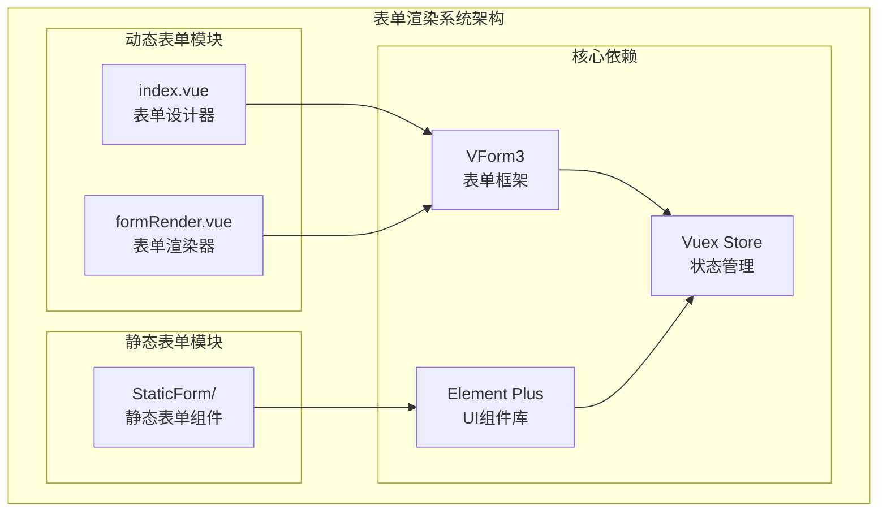
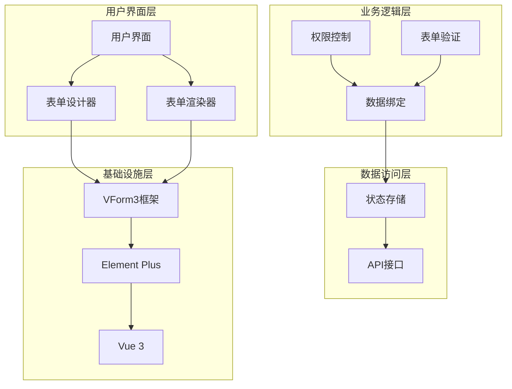
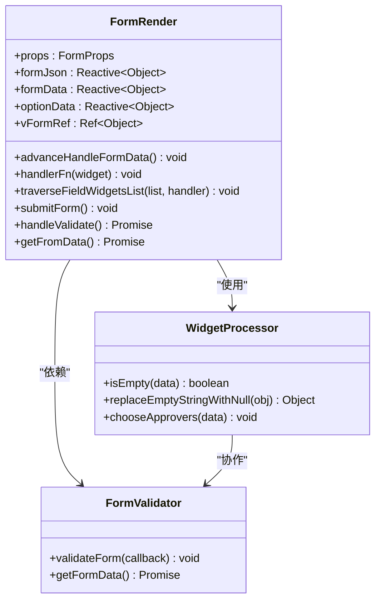
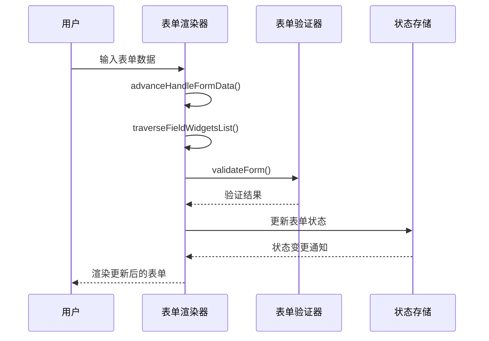
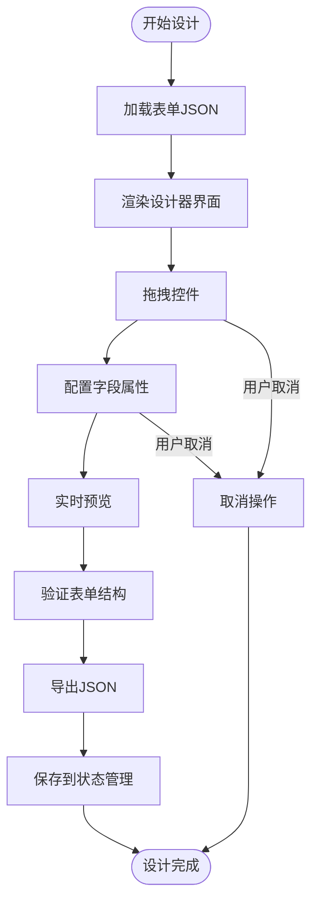
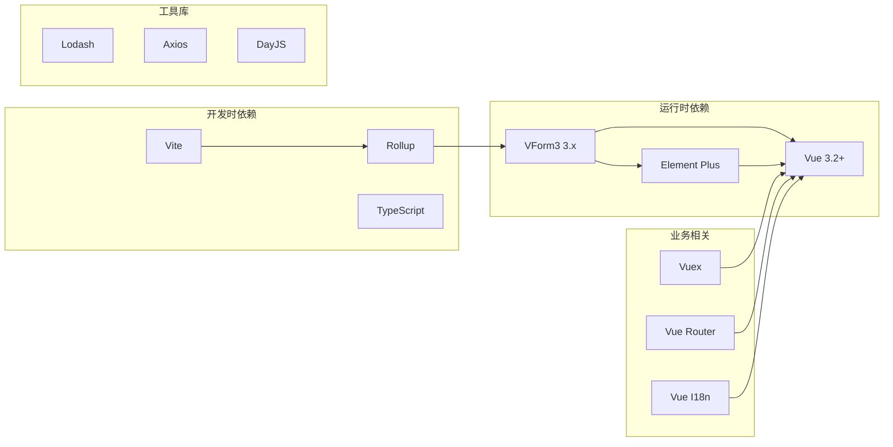
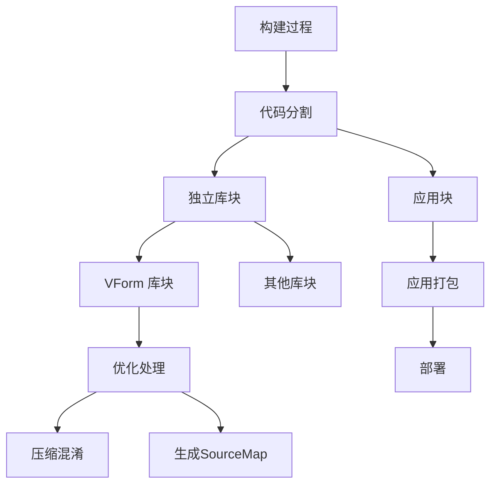

# 表单渲染系统

<cite>
**本文档引用的文件**
- [formRender.vue](file://antflow-vue/src/components/Workflow/StaticForm/formRender.vue)
- [index.vue](file://antflow-vue/src/components/Workflow/DynamicForm/index.vue)
- [main.js](file://antflow-vue/src/main.js)
- [vite.config.js](file://antflow-vue/vite.config.js)
- [ObjectUtils.js](file://antflow-vue/src/utils/antflow/ObjectUtils.js)
- [workflow.js](file://antflow-vue/src/store/modules/workflow.js)
- [lf.vue](file://antflow-vue/src/views/lowcode/lf.vue)
- [outsideDesign/index.vue](file://antflow-vue/src/views/workflow/outsideMgt/outsideDesign/index.vue)
</cite>

## 目录
1. [简介](#简介)
2. [项目结构](#项目结构)
3. [核心组件](#核心组件)
4. [架构概览](#架构概览)
5. [详细组件分析](#详细组件分析)
6. [依赖关系分析](#依赖关系分析)
7. [性能考虑](#性能考虑)
8. [故障排除指南](#故障排除指南)
9. [结论](#结论)
10. [附录](#附录)

## 简介

AntFlow 表单渲染系统是一个基于 Vue 3 和 Element Plus 的低代码表单解决方案。该系统提供了完整的表单设计、渲染、验证和数据管理功能，支持动态表单生成、组件生命周期管理和响应式状态更新。

系统的核心特性包括：
- 动态表单生成机制
- 前端组件渲染策略
- 表单组件生命周期管理
- 表单状态响应式更新
- 用户交互事件处理
- 性能优化技术和组件复用策略
- 自定义表单组件开发指南

## 项目结构

表单渲染系统主要位于 `antflow-vue` 项目的 `src/components/Workflow` 目录下，采用模块化设计：



**图表来源**
- [index.vue:1-106](file://antflow-vue/src/components/Workflow/DynamicForm/index.vue#L1-L106)
- [formRender.vue:1-258](file://antflow-vue/src/components/Workflow/StaticForm/formRender.vue#L1-L258)
- [main.js](file://antflow-vue/src/main.js#L99)

**章节来源**
- [index.vue:1-106](file://antflow-vue/src/components/Workflow/DynamicForm/index.vue#L1-L106)
- [formRender.vue:1-258](file://antflow-vue/src/components/Workflow/StaticForm/formRender.vue#L1-L258)
- [main.js](file://antflow-vue/src/main.js#L99)

## 核心组件

### 表单渲染器 (v-form-render)

表单渲染器是系统的核心组件，负责将 JSON 配置转换为可视化的表单界面。其主要职责包括：

- **JSON 解析与验证**：解析表单设计器导出的 JSON 结构
- **组件映射**：将 JSON 中的字段类型映射到对应的 Vue 组件
- **状态管理**：维护表单数据的响应式状态
- **验证处理**：集成 Element Plus 的表单验证机制

### 表单设计器 (v-form-designer)

表单设计器提供可视化的设计界面，允许用户通过拖拽方式创建表单：

- **拖拽式设计**：支持多种表单控件的拖拽放置
- **实时预览**：设计过程中的实时表单预览
- **JSON 导出**：将设计结果导出为可渲染的 JSON 格式
- **字段配置**：提供详细的字段属性配置界面

### 字段权限控制系统

系统实现了完善的字段权限控制机制：

- **权限级别**：支持只读(R)、编辑(E)、隐藏(H)等权限级别
- **动态权限**：根据用户角色动态调整字段可见性和可编辑性
- **数据脱敏**：对敏感字段进行数据脱敏处理

**章节来源**
- [formRender.vue:58-109](file://antflow-vue/src/components/Workflow/StaticForm/formRender.vue#L58-L109)
- [index.vue:3-7](file://antflow-vue/src/components/Workflow/DynamicForm/index.vue#L3-L7)

## 架构概览

表单渲染系统采用分层架构设计，确保各组件间的松耦合和高内聚：



**图表来源**
- [main.js](file://antflow-vue/src/main.js#L99)
- [formRender.vue:22-62](file://antflow-vue/src/components/Workflow/StaticForm/formRender.vue#L22-L62)
- [index.vue:10-23](file://antflow-vue/src/components/Workflow/DynamicForm/index.vue#L10-L23)

## 详细组件分析

### 表单渲染器组件分析

表单渲染器组件实现了完整的生命周期管理和状态同步机制：



**图表来源**
- [formRender.vue:22-62](file://antflow-vue/src/components/Workflow/StaticForm/formRender.vue#L22-L62)
- [formRender.vue:64-138](file://antflow-vue/src/components/Workflow/StaticForm/formRender.vue#L64-L138)

#### 生命周期管理

表单渲染器实现了完整的 Vue 3 生命周期管理：

1. **初始化阶段** (`onBeforeMount`)
   - 解析表单 JSON 配置
   - 处理字段权限控制
   - 初始化表单数据结构

2. **挂载阶段** (`onMounted`)
   - 设置表单 JSON 配置
   - 同步表单数据
   - 触发组件渲染

3. **卸载阶段** (`onBeforeUnmount`)
   - 清理内存资源
   - 移除事件监听器
   - 释放表单引用

#### 数据流处理



**图表来源**
- [formRender.vue:139-150](file://antflow-vue/src/components/Workflow/StaticForm/formRender.vue#L139-L150)
- [formRender.vue:159-168](file://antflow-vue/src/components/Workflow/StaticForm/formRender.vue#L159-L168)

**章节来源**
- [formRender.vue:22-234](file://antflow-vue/src/components/Workflow/StaticForm/formRender.vue#L22-L234)

### 表单设计器组件分析

表单设计器组件提供了完整的可视化设计功能：



**图表来源**
- [index.vue:25-44](file://antflow-vue/src/components/Workflow/DynamicForm/index.vue#L25-L44)

#### 设计器观察者模式

设计器使用 MutationObserver 实时监控设计区域的变化：

- **变化检测**：监听 DOM 结构变化
- **状态同步**：自动同步表单设计状态
- **性能优化**：使用 `isObjectChanged` 函数避免不必要的更新

**章节来源**
- [index.vue:25-48](file://antflow-vue/src/components/Workflow/DynamicForm/index.vue#L25-L48)

### 权限控制系统分析

系统实现了多层次的字段权限控制机制：

```mermaid
flowchart TD
Field[字段] --> CheckPerm{检查权限配置}
CheckPerm --> |无权限配置| Default[默认权限]
CheckPerm --> |有权限配置| GetPerm[获取字段权限]
GetPerm --> PermType{权限类型}
PermType --> |只读(R)| ReadOnly[设置只读]
PermType --> |编辑(E)| Editable[允许编辑]
PermType --> |隐藏(H)| HideField[隐藏字段]
PermType --> |其他| Disabled[禁用字段]
HideField --> MaskData[数据脱敏]
MaskData --> SetInput[转换为文本输入]
Default --> PreviewMode{预览模式?}
PreviewMode --> |是| DisableAll[全部禁用]
PreviewMode --> |否| EnableAll[启用所有字段]
ReadOnly --> ApplyStyle[应用样式]
Editable --> ApplyStyle
Disabled --> ApplyStyle
SetInput --> ApplyStyle
```

**图表来源**
- [formRender.vue:69-109](file://antflow-vue/src/components/Workflow/StaticForm/formRender.vue#L69-L109)

**章节来源**
- [formRender.vue:69-109](file://antflow-vue/src/components/Workflow/StaticForm/formRender.vue#L69-L109)

## 依赖关系分析

### 核心依赖关系

表单渲染系统的关键依赖关系如下：



**图表来源**
- [main.js](file://antflow-vue/src/main.js#L99)
- [vite.config.js:38-57](file://antflow-vue/vite.config.js#L38-L57)

### 组件间通信机制

系统采用多种组件间通信方式：

1. **Props 传递**：父子组件间的数据传递
2. **事件发射**：子组件向父组件的通知机制
3. **状态管理**：跨组件的状态共享
4. **全局注册**：框架级组件的全局可用性

**章节来源**
- [main.js:99-109](file://antflow-vue/src/main.js#L99-L109)
- [vite.config.js:29-57](file://antflow-vue/vite.config.js#L29-L57)

## 性能考虑

### 渲染优化策略

系统采用了多项性能优化措施：

#### 1. 组件懒加载
- 使用动态导入减少初始包体积
- 按需加载非关键组件
- 实现组件级别的代码分割

#### 2. 渲染缓存机制
- 利用 Vue 3 的响应式系统优化重渲染
- 实现计算属性的缓存
- 使用 `memo` 技术避免重复计算

#### 3. 内存管理
- 在组件卸载时清理事件监听器
- 及时释放大型对象引用
- 实现垃圾回收友好的数据结构

### 打包优化配置



**图表来源**
- [vite.config.js:38-57](file://antflow-vue/vite.config.js#L38-L57)

**章节来源**
- [vite.config.js:38-57](file://antflow-vue/vite.config.js#L38-L57)

## 故障排除指南

### 常见问题及解决方案

#### 1. 表单渲染异常

**问题症状**：
- 表单组件不显示
- 字段配置无效
- 验证错误

**排查步骤**：
1. 检查表单 JSON 格式是否正确
2. 验证字段类型映射关系
3. 确认组件注册状态

**解决方案**：
- 使用 `JSON.parse` 进行格式验证
- 实现字段类型白名单检查
- 添加组件存在性检查

#### 2. 性能问题

**问题症状**：
- 页面加载缓慢
- 表单响应迟钝
- 内存占用过高

**排查步骤**：
1. 分析组件渲染次数
2. 检查事件监听器数量
3. 监控内存使用情况

**解决方案**：
- 实施组件懒加载
- 优化数据绑定策略
- 实现适当的缓存机制

#### 3. 权限控制失效

**问题症状**：
- 字段权限不生效
- 数据脱敏失败
- 权限状态异常

**排查步骤**：
1. 验证权限配置数据结构
2. 检查字段匹配逻辑
3. 确认权限级别判断

**解决方案**：
- 实现权限配置验证
- 添加字段存在性检查
- 增加权限状态跟踪

**章节来源**
- [formRender.vue:151-158](file://antflow-vue/src/components/Workflow/StaticForm/formRender.vue#L151-L158)
- [index.vue:46-48](file://antflow-vue/src/components/Workflow/DynamicForm/index.vue#L46-L48)

## 结论

AntFlow 表单渲染系统通过模块化设计和分层架构，成功实现了低代码表单解决方案。系统的主要优势包括：

1. **高度可扩展性**：基于 VForm3 框架，支持自定义组件开发
2. **完善的权限控制**：多层次的字段权限管理机制
3. **优秀的性能表现**：通过多种优化策略确保流畅的用户体验
4. **良好的开发体验**：清晰的 API 接口和丰富的配置选项

未来的发展方向包括：
- 进一步优化渲染性能
- 增强移动端适配能力
- 扩展更多表单组件类型
- 完善表单模板生态系统

## 附录

### 开发指南

#### 自定义表单组件开发

1. **组件命名规范**：使用 `v-form-` 前缀
2. **属性接口定义**：遵循 VForm3 组件接口规范
3. **事件处理机制**：正确处理 `@input`、`@change` 等事件
4. **验证集成**：实现与 Element Plus 验证系统的集成

#### 渲染钩子函数使用

系统提供了多个钩子函数用于扩展功能：

- `onFormCreated`：表单创建时回调
- `onFormMounted`：表单挂载时回调  
- `onFormDataChange`：表单数据变化回调
- `onCreated`：字段创建时回调
- `onMounted`：字段挂载时回调
- `onValidate`：字段验证时回调

#### 样式定制方案

1. **全局样式覆盖**：通过 SCSS 变量定制主题
2. **组件级样式**：使用 `scoped` 样式隔离
3. **CSS 变量支持**：利用 CSS 自定义属性实现动态样式
4. **响应式设计**：确保在不同设备上的良好显示效果