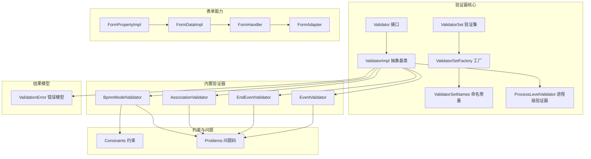
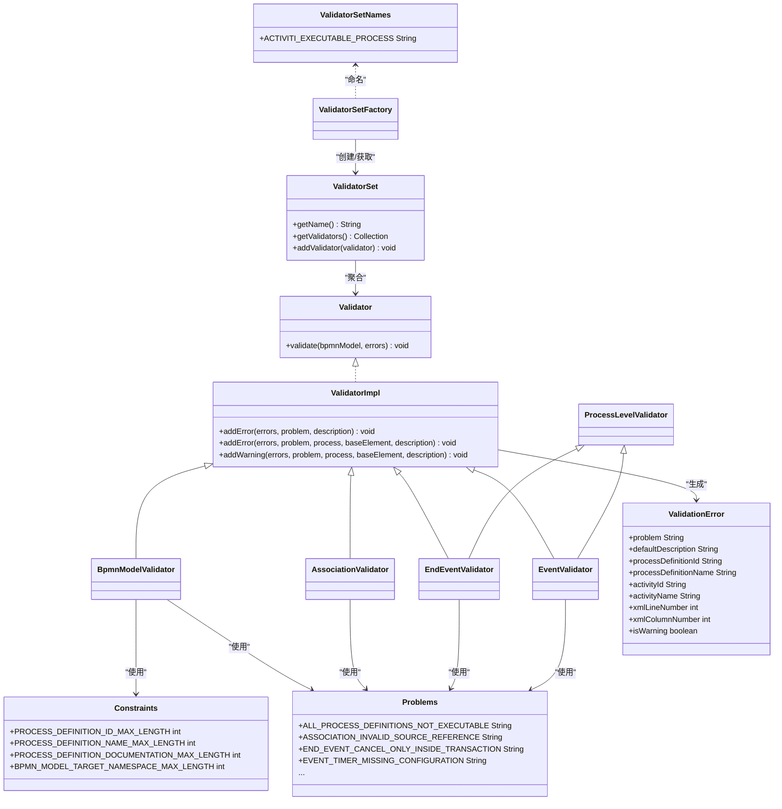
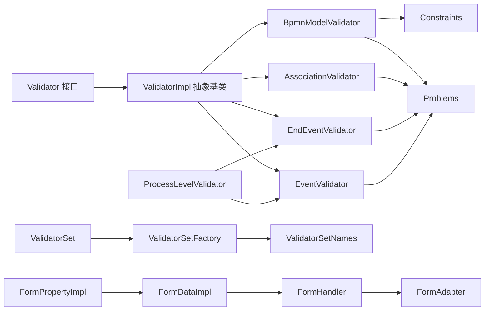

# 表单验证规则

<cite>
**本文引用的文件**
- [Validator.java](file://antflow-base/src/main/java/org/activiti/validation/validator/Validator.java)
- [ValidatorImpl.java](file://antflow-base/src/main/java/org/activiti/validation/validator/ValidatorImpl.java)
- [ValidatorSet.java](file://antflow-base/src/main/java/org/activiti/validation/validator/ValidatorSet.java)
- [ValidatorSetFactory.java](file://antflow-base/src/main/java/org/activiti/validation/validator/ValidatorSetFactory.java)
- [ValidatorSetNames.java](file://antflow-base/src/main/java/org/activiti/validation/validator/ValidatorSetNames.java)
- [BpmnModelValidator.java](file://antflow-base/src/main/java/org/activiti/validation/validator/impl/BpmnModelValidator.java)
- [AssociationValidator.java](file://antflow-base/src/main/java/org/activiti/validation/validator/impl/AssociationValidator.java)
- [EndEventValidator.java](file://antflow-base/src/main/java/org/activiti/validation/validator/impl/EndEventValidator.java)
- [EventValidator.java](file://antflow-base/src/main/java/org/activiti/validation/validator/impl/EventValidator.java)
- [Constraints.java](file://antflow-base/src/main/java/org/activiti/validation/validator/Constraints.java)
- [Problems.java](file://antflow-base/src/main/java/org/activiti/validation/validator/Problems.java)
- [ValidationError.java](file://antflow-base/src/main/java/org/activiti/validation/ValidationError.java)
- [ProcessLevelValidator.java](file://antflow-base/src/main/java/org/activiti/validation/validator/ProcessLevelValidator.java)
- [FormPropertyImpl.java](file://antflow-base/src/main/java/org/activiti/engine/impl/form/FormPropertyImpl.java)
- [FormDataImpl.java](file://antflow-base/src/main/java/org/activiti/engine/impl/form/FormDataImpl.java)
- [FormHandler.java](file://antflow-base/src/main/java/org/activiti/engine/form/FormHandler.java)
- [FormAdapter.java](file://antflow-engine/src/main/java/org/openoa/engine/bpmnconf/adp/FormAdapter.java)
</cite>

## 目录
1. [简介](#简介)
2. [项目结构](#项目结构)
3. [核心组件](#核心组件)
4. [架构总览](#架构总览)
5. [详细组件分析](#详细组件分析)
6. [依赖关系分析](#依赖关系分析)
7. [性能考虑](#性能考虑)
8. [故障排查指南](#故障排查指南)
9. [结论](#结论)
10. [附录](#附录)

## 简介
本技术文档围绕“表单验证规则系统”展开，目标是帮助读者理解并高效使用该系统：包括验证器的架构设计、验证规则的配置方式、验证结果的处理机制；内置验证器的实现原理、自定义验证器的开发指南、验证规则的组合与嵌套；验证上下文的传递、验证错误信息的国际化支持、验证性能优化策略；以及复杂验证场景、异步验证与动态加载机制的实践方案。文档同时提供可操作的示例路径、调试技巧与性能优化建议。

## 项目结构
该验证体系位于基础模块中，采用“接口 + 抽象基类 + 具体实现 + 结果模型”的分层组织方式，并通过集合工厂与命名常量对验证集进行统一管理。与表单相关的能力在引擎的表单处理模块中体现，二者协同完成从流程模型到表单数据的全链路验证。

图表来源
- [Validator.java:23-27](file://antflow-base/src/main/java/org/activiti/validation/validator/Validator.java#L23-L27)
- [ValidatorImpl.java:25-87](file://antflow-base/src/main/java/org/activiti/validation/validator/ValidatorImpl.java#L25-L87)
- [ValidatorSet.java:22-61](file://antflow-base/src/main/java/org/activiti/validation/validator/ValidatorSet.java#L22-L61)
- [ValidatorSetFactory.java](file://antflow-base/src/main/java/org/activiti/validation/validator/ValidatorSetFactory.java)
- [ValidatorSetNames.java:15-19](file://antflow-base/src/main/java/org/activiti/validation/validator/ValidatorSetNames.java#L15-L19)
- [BpmnModelValidator.java:28-90](file://antflow-base/src/main/java/org/activiti/validation/validator/impl/BpmnModelValidator.java#L28-L90)
- [AssociationValidator.java:30-69](file://antflow-base/src/main/java/org/activiti/validation/validator/impl/AssociationValidator.java#L30-L69)
- [EndEventValidator.java:31-55](file://antflow-base/src/main/java/org/activiti/validation/validator/impl/EndEventValidator.java#L31-L55)
- [EventValidator.java:35-107](file://antflow-base/src/main/java/org/activiti/validation/validator/impl/EventValidator.java#L35-L107)
- [Constraints.java:18-40](file://antflow-base/src/main/java/org/activiti/validation/validator/Constraints.java#L18-L40)
- [Problems.java:19-124](file://antflow-base/src/main/java/org/activiti/validation/validator/Problems.java#L19-L124)
- [ValidationError.java:16-159](file://antflow-base/src/main/java/org/activiti/validation/ValidationError.java#L16-L159)
- [ProcessLevelValidator.java](file://antflow-base/src/main/java/org/activiti/validation/validator/ProcessLevelValidator.java)
- [FormPropertyImpl.java:39-74](file://antflow-base/src/main/java/org/activiti/engine/impl/form/FormPropertyImpl.java#L39-L74)
- [FormDataImpl.java](file://antflow-base/src/main/java/org/activiti/engine/impl/form/FormDataImpl.java)
- [FormHandler.java](file://antflow-base/src/main/java/org/activiti/engine/form/FormHandler.java)
- [FormAdapter.java](file://antflow-engine/src/main/java/org/openoa/engine/bpmnconf/adp/FormAdapter.java)

章节来源
- [Validator.java:23-27](file://antflow-base/src/main/java/org/activiti/validation/validator/Validator.java#L23-L27)
- [ValidatorSet.java:22-61](file://antflow-base/src/main/java/org/activiti/validation/validator/ValidatorSet.java#L22-L61)
- [ValidatorSetNames.java:15-19](file://antflow-base/src/main/java/org/activiti/validation/validator/ValidatorSetNames.java#L15-L19)
- [BpmnModelValidator.java:28-90](file://antflow-base/src/main/java/org/activiti/validation/validator/impl/BpmnModelValidator.java#L28-L90)
- [AssociationValidator.java:30-69](file://antflow-base/src/main/java/org/activiti/validation/validator/impl/AssociationValidator.java#L30-L69)
- [EndEventValidator.java:31-55](file://antflow-base/src/main/java/org/activiti/validation/validator/impl/EndEventValidator.java#L31-L55)
- [EventValidator.java:35-107](file://antflow-base/src/main/java/org/activiti/validation/validator/impl/EventValidator.java#L35-L107)
- [Constraints.java:18-40](file://antflow-base/src/main/java/org/activiti/validation/validator/Constraints.java#L18-L40)
- [Problems.java:19-124](file://antflow-base/src/main/java/org/activiti/validation/validator/Problems.java#L19-L124)
- [ValidationError.java:16-159](file://antflow-base/src/main/java/org/activiti/validation/ValidationError.java#L16-L159)
- [ProcessLevelValidator.java](file://antflow-base/src/main/java/org/activiti/validation/validator/ProcessLevelValidator.java)
- [FormPropertyImpl.java:39-74](file://antflow-base/src/main/java/org/activiti/engine/impl/form/FormPropertyImpl.java#L39-L74)
- [FormDataImpl.java](file://antflow-base/src/main/java/org/activiti/engine/impl/form/FormDataImpl.java)
- [FormHandler.java](file://antflow-base/src/main/java/org/activiti/engine/form/FormHandler.java)
- [FormAdapter.java](file://antflow-engine/src/main/java/org/openoa/engine/bpmnconf/adp/FormAdapter.java)

## 核心组件
- 验证器接口与抽象基类
  - Validator：定义统一的 validate 方法签名，接收流程模型与错误列表。
  - ValidatorImpl：提供统一的错误收集与上下文填充能力，便于各具体验证器复用。
- 验证集与工厂
  - ValidatorSet：以名称标识一组验证器，负责聚合与去重。
  - ValidatorSetFactory：根据命名创建或获取验证集实例。
  - ValidatorSetNames：集中声明验证集名称常量。
- 内置验证器
  - BpmnModelValidator：检查模型可执行性、长度约束等。
  - AssociationValidator：校验关联元素的引用完整性。
  - EndEventValidator：校验结束事件在事务子流程中的使用。
  - EventValidator：校验各类事件定义的引用与配置。
- 约束与问题码
  - Constraints：集中定义长度等硬性约束阈值。
  - Problems：集中定义错误码，用于定位与国际化映射。
- 错误结果模型
  - ValidationError：承载问题码、默认描述、XML位置、流程/活动上下文等。
- 表单能力
  - FormPropertyImpl、FormDataImpl、FormHandler：支撑表单属性、表单数据与表单处理器。
  - FormAdapter：引擎侧适配器，连接业务配置与表单渲染。

章节来源
- [Validator.java:23-27](file://antflow-base/src/main/java/org/activiti/validation/validator/Validator.java#L23-L27)
- [ValidatorImpl.java:25-87](file://antflow-base/src/main/java/org/activiti/validation/validator/ValidatorImpl.java#L25-L87)
- [ValidatorSet.java:22-61](file://antflow-base/src/main/java/org/activiti/validation/validator/ValidatorSet.java#L22-L61)
- [ValidatorSetFactory.java](file://antflow-base/src/main/java/org/activiti/validation/validator/ValidatorSetFactory.java)
- [ValidatorSetNames.java:15-19](file://antflow-base/src/main/java/org/activiti/validation/validator/ValidatorSetNames.java#L15-L19)
- [BpmnModelValidator.java:28-90](file://antflow-base/src/main/java/org/activiti/validation/validator/impl/BpmnModelValidator.java#L28-L90)
- [AssociationValidator.java:30-69](file://antflow-base/src/main/java/org/activiti/validation/validator/impl/AssociationValidator.java#L30-L69)
- [EndEventValidator.java:31-55](file://antflow-base/src/main/java/org/activiti/validation/validator/impl/EndEventValidator.java#L31-L55)
- [EventValidator.java:35-107](file://antflow-base/src/main/java/org/activiti/validation/validator/impl/EventValidator.java#L35-L107)
- [Constraints.java:18-40](file://antflow-base/src/main/java/org/activiti/validation/validator/Constraints.java#L18-L40)
- [Problems.java:19-124](file://antflow-base/src/main/java/org/activiti/validation/validator/Problems.java#L19-L124)
- [ValidationError.java:16-159](file://antflow-base/src/main/java/org/activiti/validation/ValidationError.java#L16-L159)
- [FormPropertyImpl.java:39-74](file://antflow-base/src/main/java/org/activiti/engine/impl/form/FormPropertyImpl.java#L39-L74)
- [FormDataImpl.java](file://antflow-base/src/main/java/org/activiti/engine/impl/form/FormDataImpl.java)
- [FormHandler.java](file://antflow-base/src/main/java/org/activiti/engine/form/FormHandler.java)
- [FormAdapter.java](file://antflow-engine/src/main/java/org/openoa/engine/bpmnconf/adp/FormAdapter.java)

## 架构总览
验证器架构遵循“接口驱动 + 组合优先”的设计原则。Validator 定义契约，ValidatorImpl 提供通用错误收集与上下文注入；具体验证器按职责拆分，覆盖模型、流程元素、事件等维度；验证集通过工厂与命名常量进行统一管理；最终以 ValidationError 结果模型输出，便于国际化与前端展示。

图表来源
- [Validator.java:23-27](file://antflow-base/src/main/java/org/activiti/validation/validator/Validator.java#L23-L27)
- [ValidatorImpl.java:25-87](file://antflow-base/src/main/java/org/activiti/validation/validator/ValidatorImpl.java#L25-L87)
- [BpmnModelValidator.java:28-90](file://antflow-base/src/main/java/org/activiti/validation/validator/impl/BpmnModelValidator.java#L28-L90)
- [AssociationValidator.java:30-69](file://antflow-base/src/main/java/org/activiti/validation/validator/impl/AssociationValidator.java#L30-L69)
- [EndEventValidator.java:31-55](file://antflow-base/src/main/java/org/activiti/validation/validator/impl/EndEventValidator.java#L31-L55)
- [EventValidator.java:35-107](file://antflow-base/src/main/java/org/activiti/validation/validator/impl/EventValidator.java#L35-L107)
- [ProcessLevelValidator.java](file://antflow-base/src/main/java/org/activiti/validation/validator/ProcessLevelValidator.java)
- [ValidatorSet.java:22-61](file://antflow-base/src/main/java/org/activiti/validation/validator/ValidatorSet.java#L22-L61)
- [ValidatorSetFactory.java](file://antflow-base/src/main/java/org/activiti/validation/validator/ValidatorSetFactory.java)
- [ValidatorSetNames.java:15-19](file://antflow-base/src/main/java/org/activiti/validation/validator/ValidatorSetNames.java#L15-L19)
- [Constraints.java:18-40](file://antflow-base/src/main/java/org/activiti/validation/validator/Constraints.java#L18-L40)
- [Problems.java:19-124](file://antflow-base/src/main/java/org/activiti/validation/validator/Problems.java#L19-L124)
- [ValidationError.java:16-159](file://antflow-base/src/main/java/org/activiti/validation/ValidationError.java#L16-L159)

## 详细组件分析

### 验证器接口与抽象基类
- 设计要点
  - 统一入口：validate 接收 BpmnModel 与错误列表，保证调用方无需关心具体实现细节。
  - 上下文注入：抽象基类自动填充流程/活动 ID、名称与 XML 行列号，减少重复代码。
  - 错误与警告：区分错误与警告，便于分级处理与国际化。
- 关键行为
  - addError 重载：支持多种上下文参数，确保错误定位准确。
  - addWarning：标记为警告，不影响流程可执行性判断但提示潜在问题。

章节来源
- [Validator.java:23-27](file://antflow-base/src/main/java/org/activiti/validation/validator/Validator.java#L23-L27)
- [ValidatorImpl.java:25-87](file://antflow-base/src/main/java/org/activiti/validation/validator/ValidatorImpl.java#L25-L87)

### 验证集与工厂
- 设计要点
  - ValidatorSet：以名称标识一组验证器，内部使用 Map 去重，支持批量添加与移除。
  - ValidatorSetFactory：根据命名创建或获取验证集，避免重复实例化。
  - ValidatorSetNames：集中管理命名常量，降低耦合度。
- 使用建议
  - 将不同维度的验证器归入同一验证集，便于统一调度与扩展。

章节来源
- [ValidatorSet.java:22-61](file://antflow-base/src/main/java/org/activiti/validation/validator/ValidatorSet.java#L22-L61)
- [ValidatorSetFactory.java](file://antflow-base/src/main/java/org/activiti/validation/validator/ValidatorSetFactory.java)
- [ValidatorSetNames.java:15-19](file://antflow-base/src/main/java/org/activiti/validation/validator/ValidatorSetNames.java#L15-L19)

### 内置验证器详解

#### BpmnModelValidator
- 功能概述
  - 校验至少存在一个可执行流程定义；若全部不可执行则报错；否则对每个不可执行流程发出警告。
  - 校验流程定义的 ID、名称、文档长度是否超过约束阈值。
  - 校验模型的 targetNamespace 长度。
- 复杂度与性能
  - 时间复杂度 O(P)，P 为流程数量；空间复杂度 O(E)，E 为错误条目数量。
  - 仅遍历一次流程集合，避免重复扫描。

章节来源
- [BpmnModelValidator.java:28-90](file://antflow-base/src/main/java/org/activiti/validation/validator/impl/BpmnModelValidator.java#L28-L90)
- [Constraints.java:18-40](file://antflow-base/src/main/java/org/activiti/validation/validator/Constraints.java#L18-L40)
- [Problems.java:19-124](file://antflow-base/src/main/java/org/activiti/validation/validator/Problems.java#L19-L124)

#### AssociationValidator
- 功能概述
  - 遍历全局与进程内的所有 Artifact，筛选出 Association 并校验 sourceRef 与 targetRef 是否为空。
- 复杂度与性能
  - 时间复杂度 O(A)，A 为 Artifact 数量；空间复杂度 O(E)。

章节来源
- [AssociationValidator.java:30-69](file://antflow-base/src/main/java/org/activiti/validation/validator/impl/AssociationValidator.java#L30-L69)
- [Problems.java:19-124](file://antflow-base/src/main/java/org/activiti/validation/validator/Problems.java#L19-L124)

#### EndEventValidator
- 功能概述
  - 在进程级别查找所有 EndEvent，若使用 CancelEventDefinition，则要求其必须位于 Transaction 子流程内。
- 复杂度与性能
  - 时间复杂度 O(E)，E 为 EndEvent 数量；空间复杂度 O(E)。

章节来源
- [EndEventValidator.java:31-55](file://antflow-base/src/main/java/org/activiti/validation/validator/impl/EndEventValidator.java#L31-L55)
- [Problems.java:19-124](file://antflow-base/src/main/java/org/activiti/validation/validator/Problems.java#L19-L124)

#### EventValidator
- 功能概述
  - 遍历进程内所有 Event，针对不同 EventDefinition 执行相应校验：
    - MessageEventDefinition：校验 messageRef 是否存在且有效。
    - SignalEventDefinition：校验 signalRef 是否存在且有效。
    - TimerEventDefinition：校验至少配置了 timeDate/timeCycle/timeDuration 中的一个。
    - CompensateEventDefinition：校验 activityRef 是否指向存在的活动。
- 复杂度与性能
  - 时间复杂度 O(V)，V 为事件数量；空间复杂度 O(E)。

章节来源
- [EventValidator.java:35-107](file://antflow-base/src/main/java/org/activiti/validation/validator/impl/EventValidator.java#L35-L107)
- [Problems.java:19-124](file://antflow-base/src/main/java/org/activiti/validation/validator/Problems.java#L19-L124)

### 错误结果模型与国际化
- ValidationError 字段
  - 包含问题码、默认英文描述、流程/活动上下文、XML 位置、是否警告等。
- 国际化支持
  - 默认英文描述用于回退；可通过“验证器集名/验证器名”映射到本地化版本，实现多语言展示。

章节来源
- [ValidationError.java:16-159](file://antflow-base/src/main/java/org/activiti/validation/ValidationError.java#L16-L159)

### 表单验证与动态表单
- 表单属性与数据
  - FormPropertyImpl：封装表单属性的只读/可写、必填、类型与当前值。
  - FormDataImpl：封装表单数据，承载表单属性集合与关联的流程任务/启动信息。
- 表单处理器
  - FormHandler：定义表单处理契约，驱动表单渲染与提交。
- 引擎适配器
  - FormAdapter：在引擎侧将业务配置转换为表单渲染所需的数据结构，支持动态表单字段与校验规则的加载。

章节来源
- [FormPropertyImpl.java:39-74](file://antflow-base/src/main/java/org/activiti/engine/impl/form/FormPropertyImpl.java#L39-L74)
- [FormDataImpl.java](file://antflow-base/src/main/java/org/activiti/engine/impl/form/FormDataImpl.java)
- [FormHandler.java](file://antflow-base/src/main/java/org/activiti/engine/form/FormHandler.java)
- [FormAdapter.java](file://antflow-engine/src/main/java/org/openoa/engine/bpmnconf/adp/FormAdapter.java)

## 依赖关系分析

图表来源
- [Validator.java:23-27](file://antflow-base/src/main/java/org/activiti/validation/validator/Validator.java#L23-L27)
- [ValidatorImpl.java:25-87](file://antflow-base/src/main/java/org/activiti/validation/validator/ValidatorImpl.java#L25-L87)
- [BpmnModelValidator.java:28-90](file://antflow-base/src/main/java/org/activiti/validation/validator/impl/BpmnModelValidator.java#L28-L90)
- [AssociationValidator.java:30-69](file://antflow-base/src/main/java/org/activiti/validation/validator/impl/AssociationValidator.java#L30-L69)
- [EndEventValidator.java:31-55](file://antflow-base/src/main/java/org/activiti/validation/validator/impl/EndEventValidator.java#L31-L55)
- [EventValidator.java:35-107](file://antflow-base/src/main/java/org/activiti/validation/validator/impl/EventValidator.java#L35-L107)
- [ProcessLevelValidator.java](file://antflow-base/src/main/java/org/activiti/validation/validator/ProcessLevelValidator.java)
- [ValidatorSet.java:22-61](file://antflow-base/src/main/java/org/activiti/validation/validator/ValidatorSet.java#L22-L61)
- [ValidatorSetFactory.java](file://antflow-base/src/main/java/org/activiti/validation/validator/ValidatorSetFactory.java)
- [ValidatorSetNames.java:15-19](file://antflow-base/src/main/java/org/activiti/validation/validator/ValidatorSetNames.java#L15-L19)
- [Constraints.java:18-40](file://antflow-base/src/main/java/org/activiti/validation/validator/Constraints.java#L18-L40)
- [Problems.java:19-124](file://antflow-base/src/main/java/org/activiti/validation/validator/Problems.java#L19-L124)
- [FormPropertyImpl.java:39-74](file://antflow-base/src/main/java/org/activiti/engine/impl/form/FormPropertyImpl.java#L39-L74)
- [FormDataImpl.java](file://antflow-base/src/main/java/org/activiti/engine/impl/form/FormDataImpl.java)
- [FormHandler.java](file://antflow-base/src/main/java/org/activiti/engine/form/FormHandler.java)
- [FormAdapter.java](file://antflow-engine/src/main/java/org/openoa/engine/bpmnconf/adp/FormAdapter.java)

## 性能考虑
- 遍历策略
  - 优先使用一次性遍历，避免重复扫描；如 BpmnModelValidator 对流程集合仅遍历一次。
- 数据结构选择
  - ValidatorSet 使用 Map 去重，确保验证器唯一性，降低重复执行风险。
- 错误收集
  - 通过抽象基类统一收集，减少分支逻辑开销；仅在必要时填充上下文信息。
- 表单验证
  - 将表单属性与规则预加载至内存，避免运行时频繁 IO；结合缓存策略提升动态表单渲染性能。

## 故障排查指南
- 常见问题定位
  - “流程定义不可执行”：检查至少存在一个可执行流程定义；查看对应警告与错误码。
  - “关联元素引用缺失”：核对 sourceRef/targetRef 是否为空或无效。
  - “结束事件使用限制”：CancelEventDefinition 仅允许在事务子流程内使用。
  - “定时器事件未配置”：确认 timeDate/timeCycle/timeDuration 至少配置一项。
- 国际化与展示
  - 通过 ValidationError 的默认英文描述与问题码，结合本地化映射实现多语言展示。
- 调试技巧
  - 利用 XML 行列号定位问题元素；结合流程/活动 ID 快速定位上下文。
  - 分模块启用验证器集，逐步缩小问题范围。

章节来源
- [Problems.java:19-124](file://antflow-base/src/main/java/org/activiti/validation/validator/Problems.java#L19-L124)
- [ValidationError.java:16-159](file://antflow-base/src/main/java/org/activiti/validation/ValidationError.java#L16-L159)

## 结论
该表单验证规则系统以清晰的接口与抽象基类为基础，通过验证集与工厂实现可扩展的组合验证；内置验证器覆盖模型、流程元素与事件的关键规则；错误结果模型提供丰富的上下文信息，便于国际化与前端展示。配合表单属性、表单数据与引擎适配器，系统实现了从流程模型到动态表单的全链路验证能力。建议在实际工程中遵循“分层职责 + 组合优先 + 上下文最小化”的原则，持续优化性能与可维护性。

## 附录

### 自定义验证器开发指南
- 实现步骤
  - 实现 Validator 或继承 ValidatorImpl，重写 validate 方法。
  - 在 validate 中遍历目标元素，使用 addError/addWarning 记录问题。
  - 在 Problems 中新增问题码，在 Constraints 中设置阈值。
- 最佳实践
  - 明确验证边界，避免跨域验证导致的耦合。
  - 保持错误信息简洁明确，便于国际化映射。
  - 合理使用上下文信息，避免冗余字段。

章节来源
- [Validator.java:23-27](file://antflow-base/src/main/java/org/activiti/validation/validator/Validator.java#L23-L27)
- [ValidatorImpl.java:25-87](file://antflow-base/src/main/java/org/activiti/validation/validator/ValidatorImpl.java#L25-L87)
- [Problems.java:19-124](file://antflow-base/src/main/java/org/activiti/validation/validator/Problems.java#L19-L124)
- [Constraints.java:18-40](file://antflow-base/src/main/java/org/activiti/validation/validator/Constraints.java#L18-L40)

### 验证规则组合与嵌套
- 组合机制
  - 通过 ValidatorSet 聚合多个验证器，按需启用/禁用。
  - 使用 ValidatorSetFactory 与 ValidatorSetNames 统一管理命名与实例。
- 嵌套场景
  - ProcessLevelValidator 在进程级别遍历元素，适用于需要跨元素关联的规则。

章节来源
- [ValidatorSet.java:22-61](file://antflow-base/src/main/java/org/activiti/validation/validator/ValidatorSet.java#L22-L61)
- [ValidatorSetFactory.java](file://antflow-base/src/main/java/org/activiti/validation/validator/ValidatorSetFactory.java)
- [ValidatorSetNames.java:15-19](file://antflow-base/src/main/java/org/activiti/validation/validator/ValidatorSetNames.java#L15-L19)
- [ProcessLevelValidator.java](file://antflow-base/src/main/java/org/activiti/validation/validator/ProcessLevelValidator.java)

### 验证上下文传递
- 上下文字段
  - 流程 ID/名称、活动 ID/名称、XML 行列号、是否警告。
- 传递方式
  - 通过抽象基类自动填充，减少手动传参；在复杂规则中可显式传入 Process 与 BaseElement。

章节来源
- [ValidatorImpl.java:25-87](file://antflow-base/src/main/java/org/activiti/validation/validator/ValidatorImpl.java#L25-L87)
- [ValidationError.java:16-159](file://antflow-base/src/main/java/org/activiti/validation/ValidationError.java#L16-L159)

### 验证错误信息国际化
- 支持方式
  - 以问题码为键，结合验证器集名/验证器名进行本地化映射。
  - 默认英文描述作为回退，保证无本地化时仍可展示。

章节来源
- [ValidationError.java:16-159](file://antflow-base/src/main/java/org/activiti/validation/ValidationError.java#L16-L159)
- [Problems.java:19-124](file://antflow-base/src/main/java/org/activiti/validation/validator/Problems.java#L19-L124)

### 复杂验证场景处理
- 场景示例
  - 多事件定义联动：在 EventValidator 中统一处理，避免分散校验。
  - 事务边界校验：EndEventValidator 限定 CancelEventDefinition 的使用范围。
- 处理建议
  - 将跨元素依赖的规则集中在进程级验证器中，减少重复计算。

章节来源
- [EventValidator.java:35-107](file://antflow-base/src/main/java/org/activiti/validation/validator/impl/EventValidator.java#L35-L107)
- [EndEventValidator.java:31-55](file://antflow-base/src/main/java/org/activiti/validation/validator/impl/EndEventValidator.java#L31-L55)

### 异步验证与动态加载
- 异步验证
  - 可在调用 validate 前对大型模型进行分片处理，或在 UI 层异步展示验证结果。
- 动态加载
  - 将验证器注册到 ValidatorSet，结合配置中心实现运行时开关与规则热更新。
  - 表单规则通过 FormAdapter 动态加载，支持字段级校验与联动。

章节来源
- [ValidatorSet.java:22-61](file://antflow-base/src/main/java/org/activiti/validation/validator/ValidatorSet.java#L22-L61)
- [FormAdapter.java](file://antflow-engine/src/main/java/org/openoa/engine/bpmnconf/adp/FormAdapter.java)

### 验证规则示例（路径）
- 模型可执行性检查：[BpmnModelValidator.validate:30-47](file://antflow-base/src/main/java/org/activiti/validation/validator/impl/BpmnModelValidator.java#L30-L47)
- 关联元素引用校验：[AssociationValidator.validate:33-56](file://antflow-base/src/main/java/org/activiti/validation/validator/impl/AssociationValidator.java#L33-L56)
- 结束事件使用限制：[EndEventValidator.executeValidation:34-52](file://antflow-base/src/main/java/org/activiti/validation/validator/impl/EndEventValidator.java#L34-L52)
- 事件定义配置校验：[EventValidator.executeValidation:37-57](file://antflow-base/src/main/java/org/activiti/validation/validator/impl/EventValidator.java#L37-L57)

### 调试技巧
- 快速定位
  - 依据 XML 行列号与活动 ID/名称，快速锁定问题元素。
- 分层排查
  - 先模型级规则，再进程级规则，最后事件级规则，逐步缩小范围。
- 国际化验证
  - 通过问题码与默认英文描述，确认本地化映射是否正确。

章节来源
- [ValidationError.java:16-159](file://antflow-base/src/main/java/org/activiti/validation/ValidationError.java#L16-L159)
- [Problems.java:19-124](file://antflow-base/src/main/java/org/activiti/validation/validator/Problems.java#L19-L124)