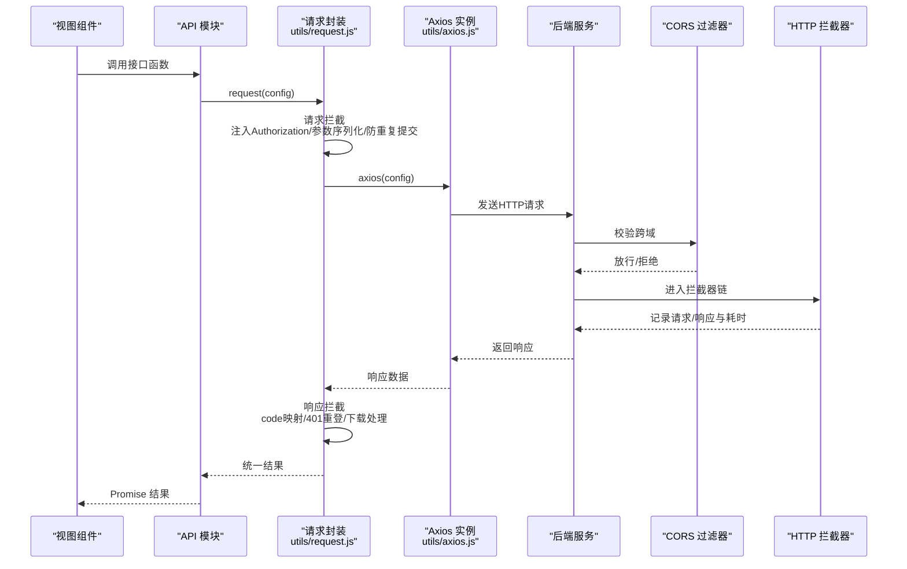
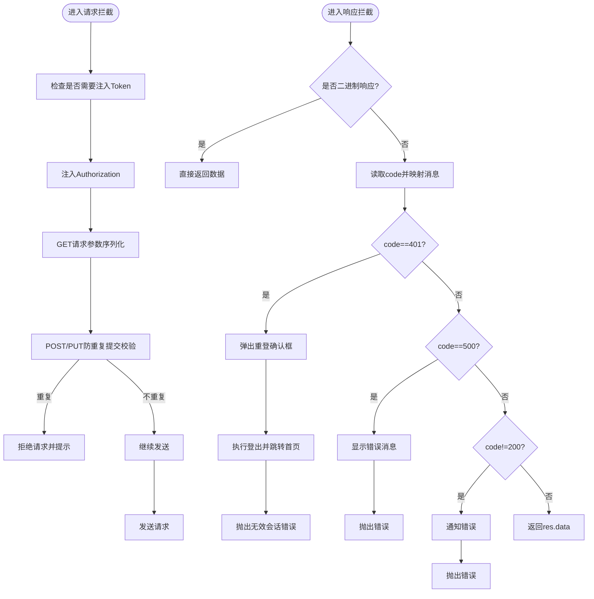
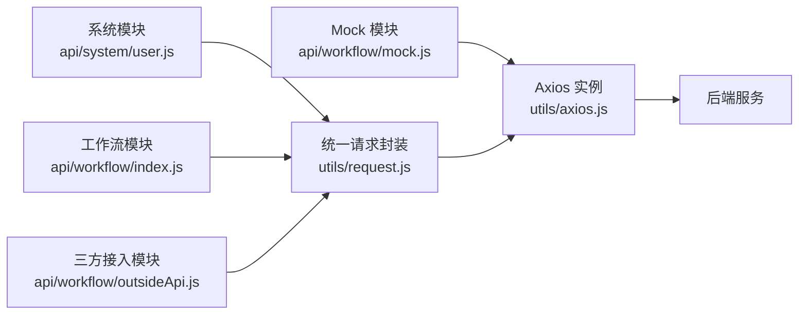
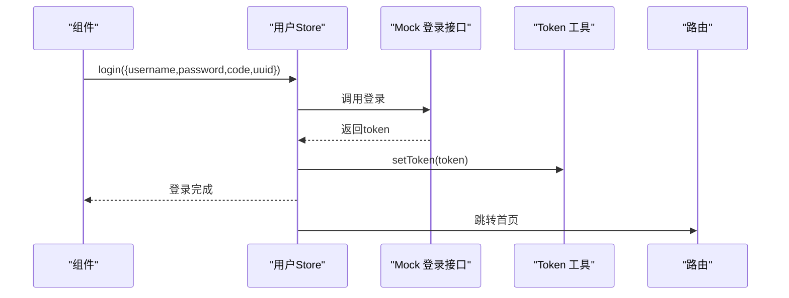
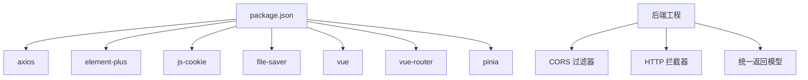

# API 集成

<cite>
**本文引用的文件**   
- [axios.js](file://antflow-vue/src/utils/axios.js)
- [request.js](file://antflow-vue/src/utils/request.js)
- [user.js](file://antflow-vue/src/api/system/user.js)
- [workflow/index.js](file://antflow-vue/src/api/workflow/index.js)
- [workflow/outsideApi.js](file://antflow-vue/src/api/workflow/outsideApi.js)
- [workflow/mock.js](file://antflow-vue/src/api/workflow/mock.js)
- [auth.js](file://antflow-vue/src/utils/auth.js)
- [errorCode.js](file://antflow-vue/src/utils/errorCode.js)
- [ruoyi.js](file://antflow-vue/src/utils/ruoyi.js)
- [login.json](file://antflow-vue/public/mock/login.json)
- [vite.config.js](file://antflow-vue/vite.config.js)
- [main.js](file://antflow-vue/src/main.js)
- [user store](file://antflow-vue/src/store/modules/user.js)
- [package.json](file://antflow-vue/package.json)
- [RestInterceptor.java](file://antflow-engine/src/main/java/org/openoa/engine/conf/config/RestInterceptor.java)
- [Result.java](file://antflow-base/src/main/java/org/openoa/base/entity/Result.java)
- [CorsConfig.java](file://antflow-engine/src/main/java/org/openoa/engine/conf/mvc/CorsConfig.java)
</cite>

## 目录
1. [简介](#简介)
2. [项目结构](#项目结构)
3. [核心组件](#核心组件)
4. [架构总览](#架构总览)
5. [详细组件分析](#详细组件分析)
6. [依赖分析](#依赖分析)
7. [性能考虑](#性能考虑)
8. [故障排查指南](#故障排查指南)
9. [结论](#结论)
10. [附录](#附录)

## 简介
本技术文档面向 API 集成系统，围绕前端 Axios 客户端配置、请求/响应拦截器、统一错误处理、REST 接口封装、Mock 数据支持、认证与 CORS、以及请求代理与下载能力进行系统性说明。文档同时给出调用示例、最佳实践与性能优化建议，帮助开发者高效对接后端服务。

## 项目结构
前端采用 Vite + Vue3 + Element Plus 架构，API 层按功能域划分模块，工具层提供通用请求、认证、参数转换与错误码映射；后端通过 Spring MVC 提供 REST 接口与跨域过滤器，拦截器用于日志与限流处理。

```mermaid
graph TB
FE["前端应用<br/>Vue3 + Element Plus"] --> AX["Axios 实例<br/>utils/axios.js"]
FE --> REQ["请求封装与拦截器<br/>utils/request.js"]
FE --> API_SYS["系统接口模块<br/>api/system/user.js"]
FE --> API_WF["工作流接口模块<br/>api/workflow/index.js"]
FE --> API_OUT["三方接入接口模块<br/>api/workflow/outsideApi.js"]
FE --> MOCK["Mock 接口模块<br/>api/workflow/mock.js"]
FE --> AUTH["认证工具<br/>utils/auth.js"]
FE --> ERR["错误码映射<br/>utils/errorCode.js"]
FE --> TOOL["通用工具<br/>utils/ruoyi.js"]
FE --> STORE["用户状态管理<br/>store/modules/user.js"]
BE["后端服务<br/>Spring Boot"] --> CORS["CORS 过滤器<br/>conf/mvc/CorsConfig.java"]
BE --> INT["HTTP 拦截器<br/>conf/config/RestInterceptor.java"]
BE --> MODEL["统一返回模型<br/>base/entity/Result.java"]
```

**图表来源**
- [axios.js:1-35](file://antflow-vue/src/utils/axios.js#L1-L35)
- [request.js:1-205](file://antflow-vue/src/utils/request.js#L1-L205)
- [user.js:1-137](file://antflow-vue/src/api/system/user.js#L1-L137)
- [workflow/index.js:1-285](file://antflow-vue/src/api/workflow/index.js#L1-L285)
- [workflow/outsideApi.js:1-233](file://antflow-vue/src/api/workflow/outsideApi.js#L1-L233)
- [workflow/mock.js:1-155](file://antflow-vue/src/api/workflow/mock.js#L1-L155)
- [auth.js:1-16](file://antflow-vue/src/utils/auth.js#L1-L16)
- [errorCode.js:1-7](file://antflow-vue/src/utils/errorCode.js#L1-L7)
- [ruoyi.js:1-229](file://antflow-vue/src/utils/ruoyi.js#L1-L229)
- [user store:1-130](file://antflow-vue/src/store/modules/user.js#L1-L130)
- [CorsConfig.java:1-48](file://antflow-engine/src/main/java/org/openoa/engine/conf/mvc/CorsConfig.java#L1-L48)
- [RestInterceptor.java:1-70](file://antflow-engine/src/main/java/org/openoa/engine/conf/config/RestInterceptor.java#L1-L70)
- [Result.java:56-94](file://antflow-base/src/main/java/org/openoa/base/entity/Result.java#L56-L94)

**章节来源**
- [axios.js:1-35](file://antflow-vue/src/utils/axios.js#L1-L35)
- [request.js:1-205](file://antflow-vue/src/utils/request.js#L1-L205)
- [user.js:1-137](file://antflow-vue/src/api/system/user.js#L1-L137)
- [workflow/index.js:1-285](file://antflow-vue/src/api/workflow/index.js#L1-L285)
- [workflow/outsideApi.js:1-233](file://antflow-vue/src/api/workflow/outsideApi.js#L1-L233)
- [workflow/mock.js:1-155](file://antflow-vue/src/api/workflow/mock.js#L1-L155)
- [auth.js:1-16](file://antflow-vue/src/utils/auth.js#L1-L16)
- [errorCode.js:1-7](file://antflow-vue/src/utils/errorCode.js#L1-L7)
- [ruoyi.js:1-229](file://antflow-vue/src/utils/ruoyi.js#L1-L229)
- [user store:1-130](file://antflow-vue/src/store/modules/user.js#L1-L130)
- [CorsConfig.java:1-48](file://antflow-engine/src/main/java/org/openoa/engine/conf/mvc/CorsConfig.java#L1-L48)
- [RestInterceptor.java:1-70](file://antflow-engine/src/main/java/org/openoa/engine/conf/config/RestInterceptor.java#L1-L70)
- [Result.java:56-94](file://antflow-base/src/main/java/org/openoa/base/entity/Result.java#L56-L94)

## 核心组件
- Axios 客户端与拦截器
  - 统一实例：基础配置、超时、withCredentials、默认 Content-Type。
  - 请求拦截：注入 Authorization、GET 参数序列化、重复提交防抖。
  - 响应拦截：统一状态码映射、错误提示、401 重登弹窗、下载场景处理。
- REST 接口封装
  - 系统模块：用户 CRUD、个人资料、角色授权、部门树等。
  - 工作流模块：流程配置、待办/抄送/已办等分页查询、审批操作、节点用户加载、生效流程等。
  - 三方接入模块：租户、应用、回调地址、流程提交等。
  - Mock 模块：登录、菜单、用户/角色/部门/员工、流程数据、签名等静态数据。
- 认证与状态管理
  - Token 管理：Cookie 中读取/写入 Admin-Token。
  - 用户 Store：登录、获取信息、退出登录、路由跳转与密码提示。
- 错误处理与提示
  - 错误码映射：401/403/404/default。
  - 响应拦截：根据 code 显示消息或抛错；网络异常、超时、状态码异常统一提示。
- 工具与下载
  - 参数序列化、树形构造、Blob 校验、下载方法。
- 开发代理与跨域
  - Vite 代理：/dev-api -> 后端地址，springdoc 文档代理。
  - CORS：全局 CorsFilter，允许 Credentials、通配 Header/Method，设置 maxAge。

**章节来源**
- [axios.js:1-35](file://antflow-vue/src/utils/axios.js#L1-L35)
- [request.js:1-205](file://antflow-vue/src/utils/request.js#L1-L205)
- [user.js:1-137](file://antflow-vue/src/api/system/user.js#L1-L137)
- [workflow/index.js:1-285](file://antflow-vue/src/api/workflow/index.js#L1-L285)
- [workflow/outsideApi.js:1-233](file://antflow-vue/src/api/workflow/outsideApi.js#L1-L233)
- [workflow/mock.js:1-155](file://antflow-vue/src/api/workflow/mock.js#L1-L155)
- [auth.js:1-16](file://antflow-vue/src/utils/auth.js#L1-L16)
- [errorCode.js:1-7](file://antflow-vue/src/utils/errorCode.js#L1-L7)
- [ruoyi.js:1-229](file://antflow-vue/src/utils/ruoyi.js#L1-L229)
- [user store:1-130](file://antflow-vue/src/store/modules/user.js#L1-L130)
- [vite.config.js:64-81](file://antflow-vue/vite.config.js#L64-L81)
- [CorsConfig.java:1-48](file://antflow-engine/src/main/java/org/openoa/engine/conf/mvc/CorsConfig.java#L1-L48)

## 架构总览
前端通过 Axios 发起请求，经由请求拦截器统一注入认证与参数处理，再由响应拦截器统一错误处理与提示；后端提供 REST 接口并通过 CORS 过滤器与拦截器保障安全与可观测性。

**图表来源**
- [request.js:28-164](file://antflow-vue/src/utils/request.js#L28-L164)
- [axios.js:17-33](file://antflow-vue/src/utils/axios.js#L17-L33)
- [CorsConfig.java:33-47](file://antflow-engine/src/main/java/org/openoa/engine/conf/mvc/CorsConfig.java#L33-L47)
- [RestInterceptor.java:30-65](file://antflow-engine/src/main/java/org/openoa/engine/conf/config/RestInterceptor.java#L30-L65)

## 详细组件分析

### Axios 客户端与拦截器
- 配置策略
  - 超时：60 秒（全局实例），10 秒（请求封装实例）。
  - withCredentials：开启跨站携带 Cookie。
  - 默认 Content-Type：application/json;charset=utf-8。
- 请求拦截器
  - 注入 Authorization: Bearer token（若存在且未禁用 isToken）。
  - GET 请求将 params 序列化到 URL，清空 params，避免重复拼参。
  - 防重复提交：对 POST/PUT 请求基于 url、序列化后的 data、时间戳做短时间窗口去重。
- 响应拦截器
  - 二进制响应直接透传（blob/arraybuffer）。
  - code=401 弹出“重新登录”确认框，触发用户登出并跳转首页。
  - code=500/601 统一错误提示；其他非 200 抛错。
  - 成功时返回 res.data。
  - 网络错误、超时、状态码异常统一提示。

**图表来源**
- [request.js:28-164](file://antflow-vue/src/utils/request.js#L28-L164)
- [auth.js:1-16](file://antflow-vue/src/utils/auth.js#L1-L16)

**章节来源**
- [axios.js:8-33](file://antflow-vue/src/utils/axios.js#L8-L33)
- [request.js:28-164](file://antflow-vue/src/utils/request.js#L28-L164)
- [auth.js:1-16](file://antflow-vue/src/utils/auth.js#L1-L16)

### REST 接口封装与模块化组织
- 系统模块（用户）
  - 列表、详情、新增、修改、删除、重置密码、状态切换、个人资料、密码修改、头像上传、授权角色、部门树等。
- 工作流模块
  - 流程配置详情、DIY 表单代码、待办/抄送/已办/我发起/撤销/退回/所有实例分页查询、审批操作、进度查询、流程预览、节点当前操作人、生效流程、按钮权限、审批人配置、委托列表/详情/设置、自选审批人节点等。
- 三方接入模块
  - 外部表单模板、租户管理、应用管理、条件模板、审批人模板、流程提交、回调地址配置与列表等。
- Mock 模块
  - 登录、退出、用户信息、菜单、岗位、角色、部门、员工、条件字段、流程数据、电子签名、动态数据获取等。

**图表来源**
- [user.js:1-137](file://antflow-vue/src/api/system/user.js#L1-L137)
- [workflow/index.js:1-285](file://antflow-vue/src/api/workflow/index.js#L1-L285)
- [workflow/outsideApi.js:1-233](file://antflow-vue/src/api/workflow/outsideApi.js#L1-L233)
- [workflow/mock.js:1-155](file://antflow-vue/src/api/workflow/mock.js#L1-L155)
- [request.js:1-205](file://antflow-vue/src/utils/request.js#L1-L205)
- [axios.js:1-35](file://antflow-vue/src/utils/axios.js#L1-L35)

**章节来源**
- [user.js:1-137](file://antflow-vue/src/api/system/user.js#L1-L137)
- [workflow/index.js:1-285](file://antflow-vue/src/api/workflow/index.js#L1-L285)
- [workflow/outsideApi.js:1-233](file://antflow-vue/src/api/workflow/outsideApi.js#L1-L233)
- [workflow/mock.js:1-155](file://antflow-vue/src/api/workflow/mock.js#L1-L155)

### 认证机制与状态管理
- Token 管理
  - 从 Cookie 读取/写入 Admin-Token。
- 用户 Store
  - 登录：调用 Mock 登录接口，设置 Token 并缓存用户信息。
  - 获取信息：拉取用户信息，处理头像、角色/权限、密码提示。
  - 退出：清空状态、移除 Token、跳转首页。
- 登录流程示意

**图表来源**
- [user store:24-40](file://antflow-vue/src/store/modules/user.js#L24-L40)
- [workflow/mock.js:16-23](file://antflow-vue/src/api/workflow/mock.js#L16-L23)
- [auth.js:1-16](file://antflow-vue/src/utils/auth.js#L1-L16)

**章节来源**
- [auth.js:1-16](file://antflow-vue/src/utils/auth.js#L1-L16)
- [user store:1-130](file://antflow-vue/src/store/modules/user.js#L1-L130)
- [workflow/mock.js:1-155](file://antflow-vue/src/api/workflow/mock.js#L1-L155)

### CORS 处理与开发代理
- CORS
  - 全局 CorsFilter，允许任意 Origin/Method/Header，允许 Credentials，设置较长 maxAge。
- 开发代理
  - /dev-api 代理至后端地址，springdoc 文档路径代理。
  - Vite server 配置，host: true，自动打开浏览器。

**章节来源**
- [CorsConfig.java:33-47](file://antflow-engine/src/main/java/org/openoa/engine/conf/mvc/CorsConfig.java#L33-L47)
- [vite.config.js:64-81](file://antflow-vue/vite.config.js#L64-L81)

### 错误处理与统一模式
- 错误码映射：401、403、404、default。
- 响应拦截：
  - 二进制响应直接透传。
  - code=401 触发重登弹窗并登出。
  - code=500/601 显示错误消息并抛错。
  - 其他非 200 统一通知错误并抛错。
  - 网络错误、超时、状态码异常统一提示。

**章节来源**
- [errorCode.js:1-7](file://antflow-vue/src/utils/errorCode.js#L1-L7)
- [request.js:99-164](file://antflow-vue/src/utils/request.js#L99-L164)

### Mock 数据支持与接口文档生成
- Mock 数据
  - 通过 Mock 模块以静态 JSON 文件形式返回，便于本地联调。
  - 示例：登录、菜单、用户、角色、部门、员工、条件、流程数据、签名等。
- 接口文档
  - Vite 配置中保留 springdoc 文档代理，可直接访问后端 OpenAPI 文档。

**章节来源**
- [workflow/mock.js:1-155](file://antflow-vue/src/api/workflow/mock.js#L1-L155)
- [login.json:1-5](file://antflow-vue/public/mock/login.json#L1-L5)
- [vite.config.js:75-80](file://antflow-vue/vite.config.js#L75-L80)

### 请求取消、重试与下载
- 请求取消
  - 代码中未见显式取消控制器或 AbortController 使用，如需取消可在调用处引入取消信号并在请求配置中传递。
- 重试机制
  - 代码中未内置自动重试逻辑；可在调用层基于错误类型与业务语义实现指数退避重试。
- 下载能力
  - download 方法支持 Blob 下载、错误提示、Loading 状态管理，transformRequest 将参数序列化为 x-www-form-urlencoded。

**章节来源**
- [request.js:166-202](file://antflow-vue/src/utils/request.js#L166-L202)

### API 调用示例与最佳实践
- 示例路径
  - 用户列表：[user.js:4-11](file://antflow-vue/src/api/system/user.js#L4-L11)
  - 用户详情：[user.js:13-19](file://antflow-vue/src/api/system/user.js#L13-L19)
  - 工作流流程配置详情：[workflow/index.js:20-22](file://antflow-vue/src/api/workflow/index.js#L20-L22)
  - 三方流程提交：[workflow/outsideApi.js:210-212](file://antflow-vue/src/api/workflow/outsideApi.js#L210-L212)
  - Mock 登录：[workflow/mock.js:16-18](file://antflow-vue/src/api/workflow/mock.js#L16-L18)
- 最佳实践
  - 在请求拦截中统一注入 Authorization，避免在各接口重复设置。
  - 对于大体积 POST/PUT，启用防重复提交并设置合理时间窗口。
  - 对二进制下载场景，使用 download 方法并确保 responseType 为 blob。
  - 对 401 场景，配合用户 Store 的登出与路由跳转，保证用户体验一致性。

**章节来源**
- [user.js:1-137](file://antflow-vue/src/api/system/user.js#L1-L137)
- [workflow/index.js:1-285](file://antflow-vue/src/api/workflow/index.js#L1-L285)
- [workflow/outsideApi.js:1-233](file://antflow-vue/src/api/workflow/outsideApi.js#L1-L233)
- [workflow/mock.js:1-155](file://antflow-vue/src/api/workflow/mock.js#L1-L155)
- [request.js:28-164](file://antflow-vue/src/utils/request.js#L28-L164)

## 依赖分析
- 前端依赖
  - axios、element-plus、js-cookie、file-saver、vue、vue-router、pinia 等。
- 后端依赖
  - Spring MVC 提供 CORS 过滤器与拦截器，统一返回模型 Result 支持 needRetry/expInfo 等字段。

**图表来源**
- [package.json:18-40](file://antflow-vue/package.json#L18-L40)
- [CorsConfig.java:33-47](file://antflow-engine/src/main/java/org/openoa/engine/conf/mvc/CorsConfig.java#L33-L47)
- [RestInterceptor.java:30-65](file://antflow-engine/src/main/java/org/openoa/engine/conf/config/RestInterceptor.java#L30-L65)
- [Result.java:56-94](file://antflow-base/src/main/java/org/openoa/base/entity/Result.java#L56-L94)

**章节来源**
- [package.json:1-54](file://antflow-vue/package.json#L1-L54)
- [CorsConfig.java:1-48](file://antflow-engine/src/main/java/org/openoa/engine/conf/mvc/CorsConfig.java#L1-L48)
- [RestInterceptor.java:1-70](file://antflow-engine/src/main/java/org/openoa/engine/conf/config/RestInterceptor.java#L1-L70)
- [Result.java:56-94](file://antflow-base/src/main/java/org/openoa/base/entity/Result.java#L56-L94)

## 性能考虑
- 依赖预构建与分包
  - Vite optimizeDeps/include 与 Rollup manualChunks，将 vForm 独立打包，第三方按一级目录拆分，减少重复与提升缓存命中。
- 资源与构建
  - 生产关闭 sourcemap，chunkSizeWarningLimit 调整，输出目录与命名策略明确。
- 请求侧优化
  - 合理设置超时与重试策略；对大体积请求启用防重复提交；GET 参数序列化避免冗余拼参。
- 下载优化
  - 使用 Blob 直接下载，避免不必要的 JSON 解析；Loading 状态提示提升交互体验。

**章节来源**
- [vite.config.js:28-62](file://antflow-vue/vite.config.js#L28-L62)
- [request.js:28-96](file://antflow-vue/src/utils/request.js#L28-L96)

## 故障排查指南
- 401 无效会话
  - 现象：弹出“重新登录”确认框，随后登出并跳转首页。
  - 排查：确认 Token 是否过期或被清除；检查后端会话有效期与拦截器逻辑。
- 网络错误/超时
  - 现象：统一提示“后端接口连接异常/系统接口请求超时”，并记录错误。
  - 排查：检查代理配置、跨域设置、后端可达性与防火墙。
- 状态码异常
  - 现象：根据 code 显示错误消息或通知错误。
  - 排查：核对后端返回码与前端错误码映射；关注 500/601 特定业务提示。
- 重复提交
  - 现象：短时间内相同请求被拒绝并提示“数据正在处理，请勿重复提交”。
  - 排查：确认防重复提交开关与时间窗口设置；避免频繁点击提交按钮。
- CORS 拦截
  - 现象：跨域请求被拒绝。
  - 排查：确认后端 CorsFilter 配置与前端 withCredentials；确保允许的 Origin/Method/Header 正确。

**章节来源**
- [request.js:100-164](file://antflow-vue/src/utils/request.js#L100-L164)
- [vite.config.js:64-81](file://antflow-vue/vite.config.js#L64-L81)
- [CorsConfig.java:33-47](file://antflow-engine/src/main/java/org/openoa/engine/conf/mvc/CorsConfig.java#L33-L47)

## 结论
本系统通过统一的 Axios 客户端与拦截器，实现了认证注入、参数处理、重复提交防护、统一错误处理与下载能力；后端提供 CORS 与拦截器保障跨域与可观测性。模块化的 API 设计覆盖系统、工作流与三方接入场景，并辅以 Mock 数据与文档代理，便于前后端协同开发与联调。建议在调用层补充请求取消与重试策略，持续优化性能与稳定性。

## 附录
- 关键实现路径参考
  - Axios 实例与拦截器：[axios.js:1-35](file://antflow-vue/src/utils/axios.js#L1-L35)、[request.js:1-205](file://antflow-vue/src/utils/request.js#L1-L205)
  - 系统接口封装：[user.js:1-137](file://antflow-vue/src/api/system/user.js#L1-L137)
  - 工作流接口封装：[workflow/index.js:1-285](file://antflow-vue/src/api/workflow/index.js#L1-L285)
  - 三方接入接口封装：[workflow/outsideApi.js:1-233](file://antflow-vue/src/api/workflow/outsideApi.js#L1-L233)
  - Mock 接口封装：[workflow/mock.js:1-155](file://antflow-vue/src/api/workflow/mock.js#L1-L155)
  - 认证与状态管理：[auth.js:1-16](file://antflow-vue/src/utils/auth.js#L1-L16)、[user store:1-130](file://antflow-vue/src/store/modules/user.js#L1-L130)
  - 错误码与工具：[errorCode.js:1-7](file://antflow-vue/src/utils/errorCode.js#L1-L7)、[ruoyi.js:1-229](file://antflow-vue/src/utils/ruoyi.js#L1-L229)
  - 开发代理与跨域：[vite.config.js:64-81](file://antflow-vue/vite.config.js#L64-L81)、[CorsConfig.java:1-48](file://antflow-engine/src/main/java/org/openoa/engine/conf/mvc/CorsConfig.java#L1-L48)
  - 后端拦截与返回模型：[RestInterceptor.java:1-70](file://antflow-engine/src/main/java/org/openoa/engine/conf/config/RestInterceptor.java#L1-L70)、[Result.java:56-94](file://antflow-base/src/main/java/org/openoa/base/entity/Result.java#L56-L94)