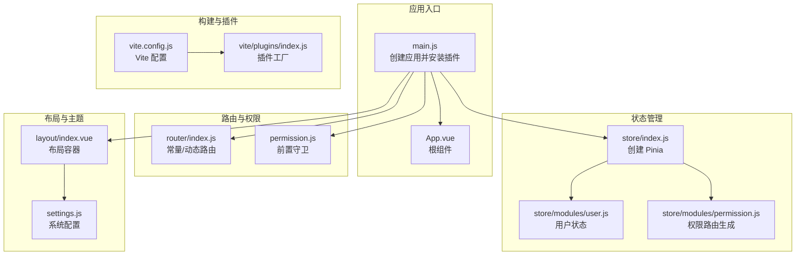
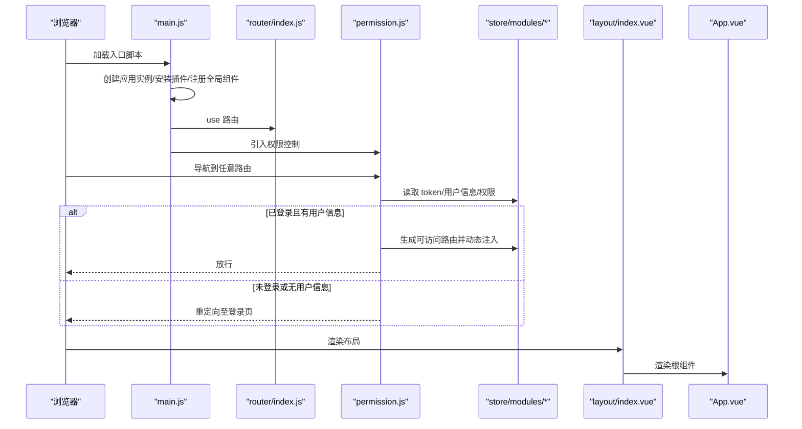
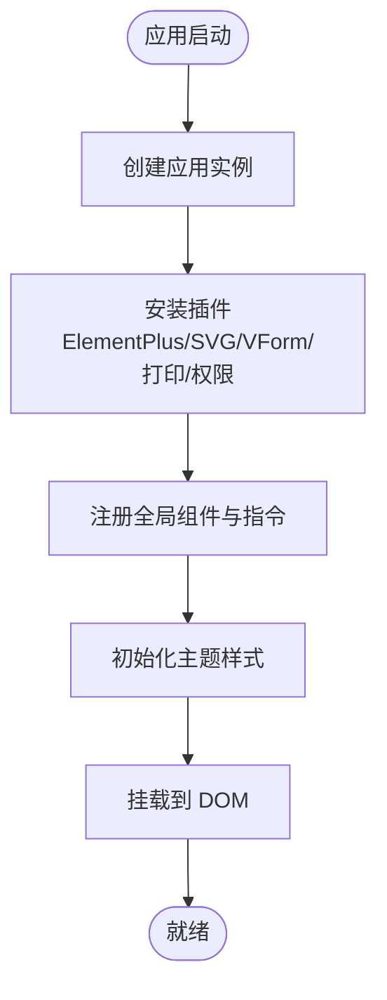
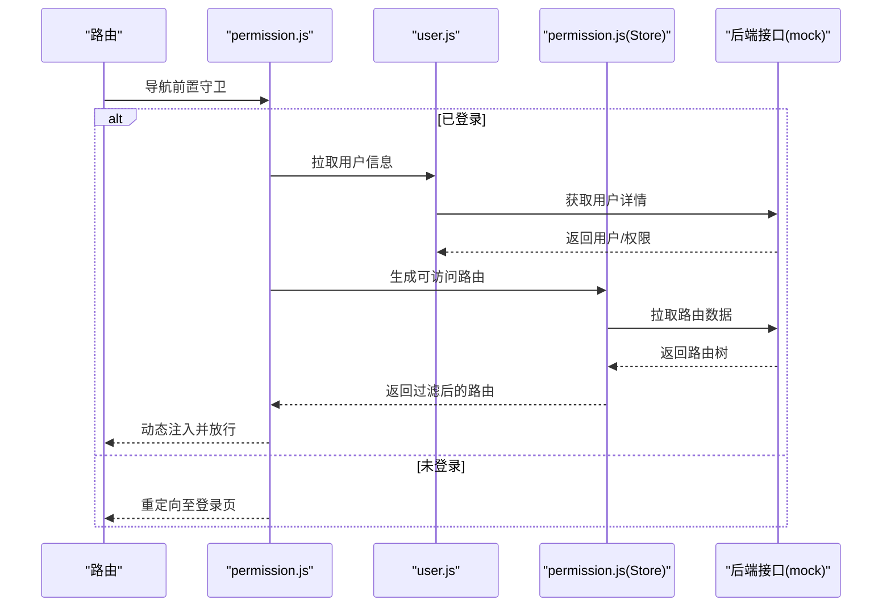
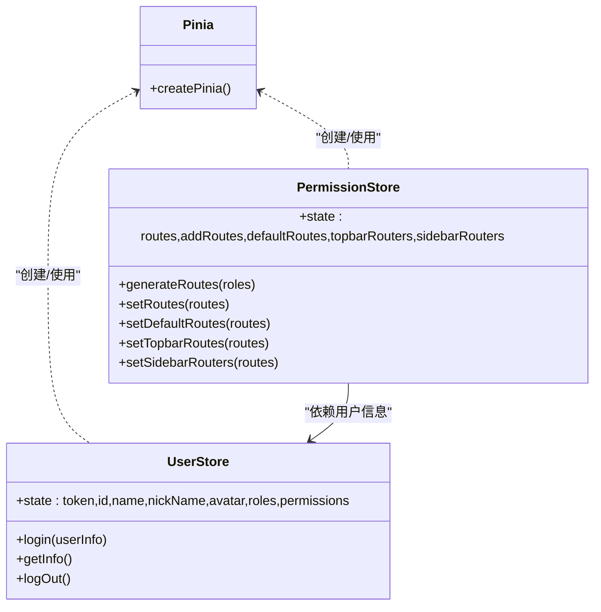
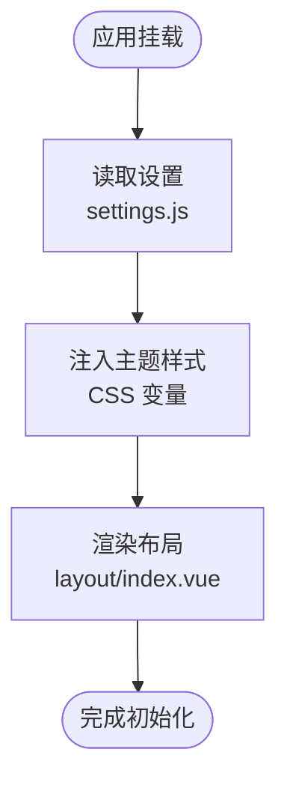
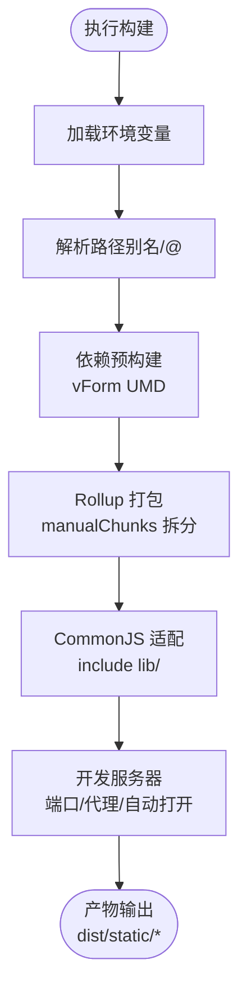
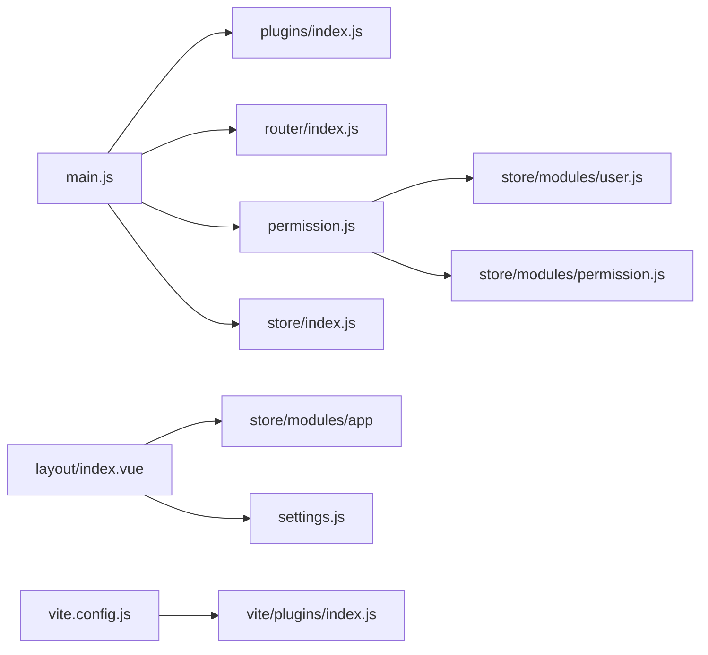

# Vue 应用架构

<cite>
**本文引用的文件**   
- [package.json](file://antflow-vue/package.json)
- [vite.config.js](file://antflow-vue/vite.config.js)
- [main.js](file://antflow-vue/src/main.js)
- [App.vue](file://antflow-vue/src/App.vue)
- [settings.js](file://antflow-vue/src/settings.js)
- [store/index.js](file://antflow-vue/src/store/index.js)
- [router/index.js](file://antflow-vue/src/router/index.js)
- [permission.js](file://antflow-vue/src/permission.js)
- [layout/index.vue](file://antflow-vue/src/layout/index.vue)
- [plugins/index.js](file://antflow-vue/src/plugins/index.js)
- [utils/index.js](file://antflow-vue/src/utils/index.js)
- [store/modules/user.js](file://antflow-vue/src/store/modules/user.js)
- [store/modules/permission.js](file://antflow-vue/src/store/modules/permission.js)
- [views/index.vue](file://antflow-vue/src/views/index.vue)
- [vite/plugins/index.js](file://antflow-vue/vite/plugins/index.js)
</cite>

## 目录
1. [简介](#简介)
2. [项目结构](#项目结构)
3. [核心组件](#核心组件)
4. [架构总览](#架构总览)
5. [详细组件分析](#详细组件分析)
6. [依赖关系分析](#依赖关系分析)
7. [性能考量](#性能考量)
8. [故障排查指南](#故障排查指南)
9. [结论](#结论)
10. [附录](#附录)

## 简介
本文件面向 Vue 3 + Vite 前端工程，系统性梳理 AntFlow 前端应用的整体架构、组件树结构、模块化组织方式，并深入解析 Vite 构建配置与优化策略、插件体系、环境变量与代理配置、路由与权限控制、状态管理、主题与布局、以及开发体验与性能优化建议。目标是帮助开发者快速理解并高效维护该 Vue 应用。

## 项目结构
AntFlow 前端位于 antflow-vue 目录，采用“按功能域划分”的模块化组织方式：
- src/api：后端接口封装（示例使用 mock）
- src/assets：静态资源与样式
- src/components：通用业务组件与基础 UI 组件
- src/directive：自定义指令
- src/layout：布局容器与侧边栏、导航、标签页等
- src/plugins：全局插件（页签、认证、缓存、模态框、下载）
- src/router：路由定义与动态加载
- src/store：Pinia 状态管理（用户、权限、应用、设置等）
- src/utils：工具函数库
- src/views：页面视图
- vite/plugins：Vite 插件工厂
- public：公共资源与文档
- 根目录：构建脚本、依赖声明、Vite 配置

**图表来源**
- [main.js:1-110](file://antflow-vue/src/main.js#L1-L110)
- [App.vue:1-16](file://antflow-vue/src/App.vue#L1-L16)
- [router/index.js:1-339](file://antflow-vue/src/router/index.js#L1-L339)
- [permission.js:1-77](file://antflow-vue/src/permission.js#L1-L77)
- [store/index.js:1-3](file://antflow-vue/src/store/index.js#L1-L3)
- [store/modules/user.js:1-130](file://antflow-vue/src/store/modules/user.js#L1-L130)
- [store/modules/permission.js:1-143](file://antflow-vue/src/store/modules/permission.js#L1-L143)
- [layout/index.vue:1-142](file://antflow-vue/src/layout/index.vue#L1-L142)
- [settings.js:1-58](file://antflow-vue/src/settings.js#L1-L58)
- [vite.config.js:1-100](file://antflow-vue/vite.config.js#L1-L100)
- [vite/plugins/index.js:1-16](file://antflow-vue/vite/plugins/index.js#L1-L16)

**章节来源**
- [package.json:1-54](file://antflow-vue/package.json#L1-L54)
- [vite.config.js:1-100](file://antflow-vue/vite.config.js#L1-L100)
- [main.js:1-110](file://antflow-vue/src/main.js#L1-L110)

## 核心组件
- 应用入口与插件系统
  - main.js 负责创建应用实例、全局注册 Element Plus、SVG 图标、VForm3、全局组件与指令、打印插件、权限控制入口等。
  - plugins/index.js 提供统一的全局插件挂载点，集中暴露 $tab、$auth、$cache、$modal、$download 等能力。
- 路由与权限
  - router/index.js 定义常量路由与动态路由，结合 permission.js 的前置守卫完成登录态校验、角色/权限过滤、动态注入路由。
  - store/modules/permission.js 负责从后端拉取路由数据并生成可访问路由集合；store/modules/user.js 管理用户登录态与头像等信息。
- 布局与主题
  - layout/index.vue 作为布局容器，负责响应式设备切换、侧边栏与标签页渲染、主题色注入等。
  - settings.js 提供标题、侧边栏主题、标签页、固定头部、Logo、版权等系统配置。
- 工具与通用组件
  - utils/index.js 提供日期格式化、URL 参数处理、防抖、深拷贝、唯一标识等常用工具。
  - components 目录下包含分页、富文本、上传、字典标签、流程节点包装等通用组件，main.js 中统一注册为全局组件。

**章节来源**
- [main.js:1-110](file://antflow-vue/src/main.js#L1-L110)
- [plugins/index.js:1-19](file://antflow-vue/src/plugins/index.js#L1-L19)
- [router/index.js:1-339](file://antflow-vue/src/router/index.js#L1-L339)
- [permission.js:1-77](file://antflow-vue/src/permission.js#L1-L77)
- [store/modules/user.js:1-130](file://antflow-vue/src/store/modules/user.js#L1-L130)
- [store/modules/permission.js:1-143](file://antflow-vue/src/store/modules/permission.js#L1-L143)
- [layout/index.vue:1-142](file://antflow-vue/src/layout/index.vue#L1-L142)
- [settings.js:1-58](file://antflow-vue/src/settings.js#L1-L58)
- [utils/index.js:1-391](file://antflow-vue/src/utils/index.js#L1-L391)

## 架构总览
下图展示了应用启动、路由与权限、状态管理、布局与主题之间的交互关系：

**图表来源**
- [main.js:1-110](file://antflow-vue/src/main.js#L1-L110)
- [router/index.js:1-339](file://antflow-vue/src/router/index.js#L1-L339)
- [permission.js:1-77](file://antflow-vue/src/permission.js#L1-L77)
- [store/modules/user.js:1-130](file://antflow-vue/src/store/modules/user.js#L1-L130)
- [store/modules/permission.js:1-143](file://antflow-vue/src/store/modules/permission.js#L1-L143)
- [layout/index.vue:1-142](file://antflow-vue/src/layout/index.vue#L1-L142)
- [App.vue:1-16](file://antflow-vue/src/App.vue#L1-L16)

## 详细组件分析

### 启动流程与插件系统
- 启动流程要点
  - 创建 Vue 应用实例，引入 Element Plus、SVG 图标、VForm3、全局组件与指令、打印插件、权限控制入口。
  - 通过 plugins/index.js 挂载统一的全局插件，暴露 $tab、$auth、$cache、$modal、$download。
  - 注入全局工具方法（如日期格式化、字典标签等），并在 App.vue 中初始化主题样式。
- 插件系统
  - plugins/index.js 将各插件的实例方法挂载到 app.config.globalProperties，便于在组件内以 $xxx 方式调用。
  - 与 main.js 的组合确保插件在应用生命周期早期可用。

**图表来源**
- [main.js:1-110](file://antflow-vue/src/main.js#L1-L110)
- [plugins/index.js:1-19](file://antflow-vue/src/plugins/index.js#L1-L19)
- [App.vue:1-16](file://antflow-vue/src/App.vue#L1-L16)

**章节来源**
- [main.js:1-110](file://antflow-vue/src/main.js#L1-L110)
- [plugins/index.js:1-19](file://antflow-vue/src/plugins/index.js#L1-L19)
- [App.vue:1-16](file://antflow-vue/src/App.vue#L1-L16)

### 路由与权限控制
- 路由设计
  - constantRoutes：常量路由（登录、404、重定向、首页等）。
  - dynamicRoutes：基于权限动态加载的路由集合，包含流程设计、任务中心、外部应用管理等。
  - 路由元信息 meta：title、icon、noCache、activeMenu、affix 等，用于侧边栏、面包屑与 keep-alive 控制。
- 权限控制
  - permission.js 在 beforeEach 中进行进度条、白名单、token 校验、用户信息拉取、动态路由注入与放行。
  - store/modules/permission.js 从后端获取路由数据，过滤并生成可访问路由，同时支持侧边栏与顶部导航路由集。
  - store/modules/user.js 管理登录态、头像、角色与权限列表。

**图表来源**
- [permission.js:1-77](file://antflow-vue/src/permission.js#L1-L77)
- [store/modules/user.js:1-130](file://antflow-vue/src/store/modules/user.js#L1-L130)
- [store/modules/permission.js:1-143](file://antflow-vue/src/store/modules/permission.js#L1-L143)
- [router/index.js:1-339](file://antflow-vue/src/router/index.js#L1-L339)

**章节来源**
- [router/index.js:1-339](file://antflow-vue/src/router/index.js#L1-L339)
- [permission.js:1-77](file://antflow-vue/src/permission.js#L1-L77)
- [store/modules/user.js:1-130](file://antflow-vue/src/store/modules/user.js#L1-L130)
- [store/modules/permission.js:1-143](file://antflow-vue/src/store/modules/permission.js#L1-L143)

### 状态管理（Pinia）
- store/index.js 创建 Pinia 实例并导出。
- user.js 管理登录态、用户信息、头像、角色与权限。
- permission.js（Store）负责路由生成、侧边栏/顶部路由集与默认路由集的维护。
- 与路由守卫配合，实现“登录态 → 用户信息 → 动态路由”的链路。

**图表来源**
- [store/index.js:1-3](file://antflow-vue/src/store/index.js#L1-L3)
- [store/modules/user.js:1-130](file://antflow-vue/src/store/modules/user.js#L1-L130)
- [store/modules/permission.js:1-143](file://antflow-vue/src/store/modules/permission.js#L1-L143)

**章节来源**
- [store/index.js:1-3](file://antflow-vue/src/store/index.js#L1-L3)
- [store/modules/user.js:1-130](file://antflow-vue/src/store/modules/user.js#L1-L130)
- [store/modules/permission.js:1-143](file://antflow-vue/src/store/modules/permission.js#L1-L143)

### 布局与主题
- layout/index.vue
  - 响应式设备检测（移动端/桌面端），自动收起侧边栏。
  - 渲染侧边栏、导航栏、标签页、主内容区与系统设置面板。
  - 主题色通过 CSS 变量注入，支持动态切换。
- settings.js
  - 提供标题、侧边栏主题、标签页、固定头部、Logo、版权等配置项。
- App.vue
  - 在挂载阶段根据设置初始化主题样式。

**图表来源**
- [layout/index.vue:1-142](file://antflow-vue/src/layout/index.vue#L1-L142)
- [settings.js:1-58](file://antflow-vue/src/settings.js#L1-L58)
- [App.vue:1-16](file://antflow-vue/src/App.vue#L1-L16)

**章节来源**
- [layout/index.vue:1-142](file://antflow-vue/src/layout/index.vue#L1-L142)
- [settings.js:1-58](file://antflow-vue/src/settings.js#L1-L58)
- [App.vue:1-16](file://antflow-vue/src/App.vue#L1-L16)

### 构建与开发服务器
- Vite 配置概览
  - 基础路径 base：根据环境变量 VITE_APP_ENV 与 VITE_HOME_PATH 决定部署路径。
  - 路径别名：~、@ 指向项目根与 src 目录。
  - 依赖预构建：optimizeDeps.include 指定 vForm UMD 依赖。
  - 打包策略：rollupOptions.output.manualChunks 按目录拆分第三方依赖；lib/vForm 单独拆包；CommonJS 适配 include lib 目录。
  - 开发服务器：端口 80、host 允许外网访问、开启自动打开；代理 dev-api 与 springdoc 文档。
  - CSS：PostCSS 移除 @charset 规则。
- 插件工厂
  - vite/plugins/index.js 统一导出插件：Vue、自动导入、setup 语法扩展、SVG 图标、压缩（仅生产）。

**图表来源**
- [vite.config.js:1-100](file://antflow-vue/vite.config.js#L1-L100)
- [vite/plugins/index.js:1-16](file://antflow-vue/vite/plugins/index.js#L1-L16)

**章节来源**
- [vite.config.js:1-100](file://antflow-vue/vite.config.js#L1-L100)
- [vite/plugins/index.js:1-16](file://antflow-vue/vite/plugins/index.js#L1-L16)

### 页面与通用组件
- views/index.vue
  - 首页卡片布局，包含产品介绍、版本信息、更新日志与外部链接。
  - 通过 settingsStore.version 读取版本号，控制文案差异。
- components
  - 分页、富文本、上传/预览、字典标签、流程节点包装等组件在 main.js 中统一注册为全局组件，减少重复导入。

**章节来源**
- [views/index.vue:1-288](file://antflow-vue/src/views/index.vue#L1-L288)
- [main.js:1-110](file://antflow-vue/src/main.js#L1-L110)

## 依赖关系分析
- 模块耦合
  - main.js 与 plugins/index.js、router/index.js、permission.js、store/index.js、layout/index.vue 存在强耦合，共同构成启动与运行时的核心。
  - permission.js 依赖 store/modules/user.js 与 store/modules/permission.js，形成“守卫 → 用户 → 权限路由”的链路。
  - layout/index.vue 依赖 store/modules/app 与 store/modules/settings，用于响应式布局与主题控制。
- 外部依赖
  - Vue 3、Element Plus、Vue Router、Pinia、axios、echarts、vuedraggable、splitpanes 等。
  - Vite 插件：@vitejs/plugin-vue、unplugin-auto-import、unplugin-vue-setup-extend-plus、vite-plugin-compression、vite-plugin-svg-icons。

**图表来源**
- [main.js:1-110](file://antflow-vue/src/main.js#L1-L110)
- [plugins/index.js:1-19](file://antflow-vue/src/plugins/index.js#L1-L19)
- [router/index.js:1-339](file://antflow-vue/src/router/index.js#L1-L339)
- [permission.js:1-77](file://antflow-vue/src/permission.js#L1-L77)
- [store/index.js:1-3](file://antflow-vue/src/store/index.js#L1-L3)
- [store/modules/user.js:1-130](file://antflow-vue/src/store/modules/user.js#L1-L130)
- [store/modules/permission.js:1-143](file://antflow-vue/src/store/modules/permission.js#L1-L143)
- [layout/index.vue:1-142](file://antflow-vue/src/layout/index.vue#L1-L142)
- [settings.js:1-58](file://antflow-vue/src/settings.js#L1-L58)
- [vite.config.js:1-100](file://antflow-vue/vite.config.js#L1-L100)
- [vite/plugins/index.js:1-16](file://antflow-vue/vite/plugins/index.js#L1-L16)

**章节来源**
- [package.json:1-54](file://antflow-vue/package.json#L1-L54)
- [main.js:1-110](file://antflow-vue/src/main.js#L1-L110)
- [router/index.js:1-339](file://antflow-vue/src/router/index.js#L1-L339)
- [permission.js:1-77](file://antflow-vue/src/permission.js#L1-L77)
- [store/modules/permission.js:1-143](file://antflow-vue/src/store/modules/permission.js#L1-L143)
- [layout/index.vue:1-142](file://antflow-vue/src/layout/index.vue#L1-L142)
- [vite.config.js:1-100](file://antflow-vue/vite.config.js#L1-L100)

## 性能考量
- 依赖拆分与懒加载
  - 通过 manualChunks 将 vForm 单独打包，避免与业务代码混合导致缓存失效。
  - 第三方依赖按一级目录拆分，有利于 CDN 缓存命中与增量更新。
- 体积与警告阈值
  - chunkSizeWarningLimit 调整为 2000KB，降低大包告警频率，便于聚焦真实问题。
- 开发体验
  - optimizeDeps.include 指定 vForm UMD，避免首次热更时的解析开销。
  - CommonJS 适配 include lib/，保证本地库与第三方 CommonJS 依赖正常打包。
- 生产优化
  - 仅在生产构建启用压缩插件，减少开发时编译时间。
  - 关闭生产 sourcemap，降低产物体积与泄露风险。

**章节来源**
- [vite.config.js:32-62](file://antflow-vue/vite.config.js#L32-L62)
- [vite/plugins/index.js:13](file://antflow-vue/vite/plugins/index.js#L13)

## 故障排查指南
- 登录后白屏或路由不生效
  - 检查 permission.js 中的白名单与守卫逻辑，确认 token 是否存在、用户信息是否拉取成功。
  - 确认 store/modules/permission.js 的 generateRoutes 是否正确注入动态路由。
- 图标不显示
  - 确认 main.js 中已注册 SVG 图标虚拟模块与 SvgIcon 组件。
- 主题样式异常
  - 检查 App.vue 中的主题初始化逻辑与 layout/index.vue 的 CSS 变量注入。
- 开发代理失败
  - 确认 vite.config.js 的 server.proxy 配置指向正确的后端地址，路径重写规则是否匹配。
- 版本更新提示无法关闭
  - 检查 layout/index.vue 中的版本检查定时器与弹窗逻辑，确认 localStorage 中的版本记录。

**章节来源**
- [permission.js:1-77](file://antflow-vue/src/permission.js#L1-L77)
- [store/modules/permission.js:1-143](file://antflow-vue/src/store/modules/permission.js#L1-L143)
- [main.js:26-29](file://antflow-vue/src/main.js#L26-L29)
- [layout/index.vue:66-93](file://antflow-vue/src/layout/index.vue#L66-L93)
- [vite.config.js:64-81](file://antflow-vue/vite.config.js#L64-L81)

## 结论
该 Vue 应用采用清晰的模块化组织与成熟的生态（Vue 3 + Element Plus + Pinia + Vue Router + Vite），通过权限守卫与动态路由实现细粒度的访问控制，借助布局与主题系统提供一致的用户体验。构建配置针对依赖拆分、CommonJS 适配与开发体验进行了针对性优化。遵循本文档的架构与最佳实践，可有效提升开发效率与系统稳定性。

## 附录
- 环境变量与脚本
  - scripts：dev、build:prod、build:stage、preview。
  - 环境变量：VITE_APP_ENV、VITE_HOME_PATH、VITE_APP_TITLE、VITE_APP_BASE_API 等。
- 代码规范与质量
  - 仓库未提供 ESLint 与 Prettier 配置文件，建议在团队内补充统一的代码风格与提交前检查流程，以保障长期可维护性。

**章节来源**
- [package.json:8-12](file://antflow-vue/package.json#L8-L12)
- [vite.config.js:5-10](file://antflow-vue/vite.config.js#L5-L10)
- [views/index.vue:189-192](file://antflow-vue/src/views/index.vue#L189-L192)