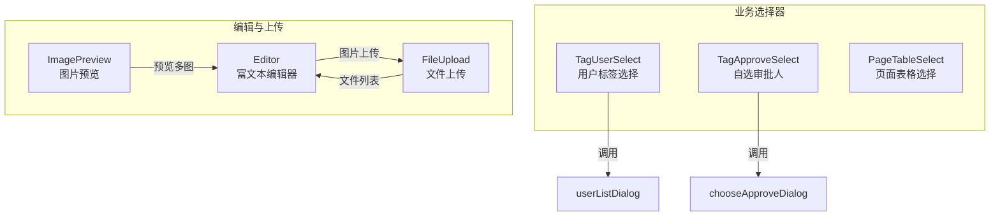
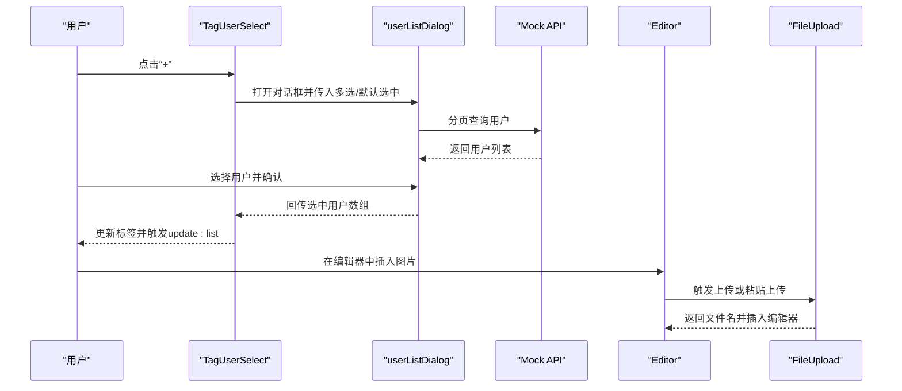
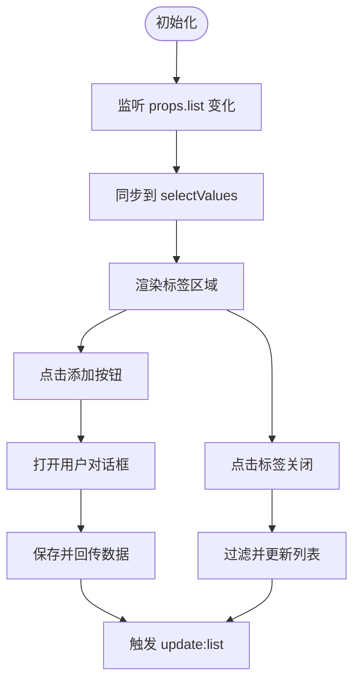
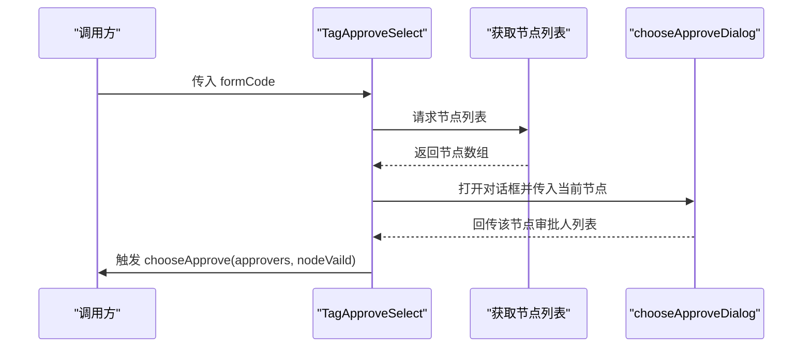
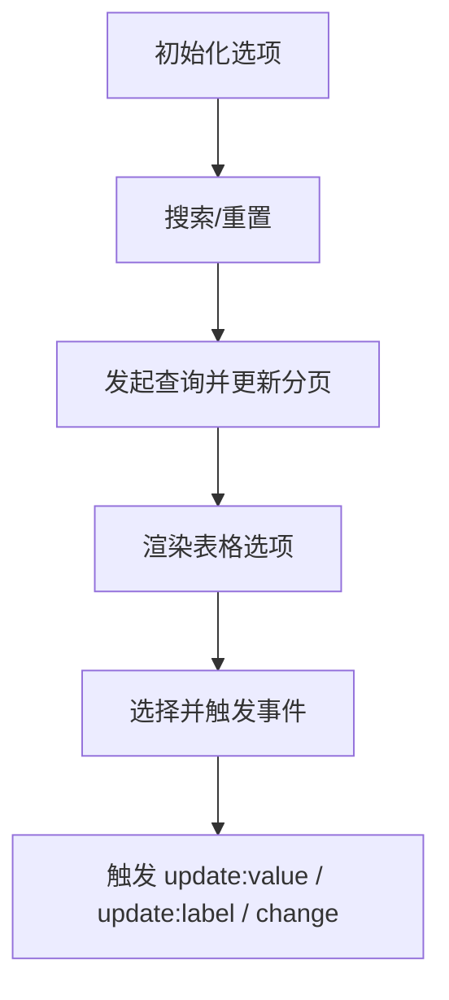
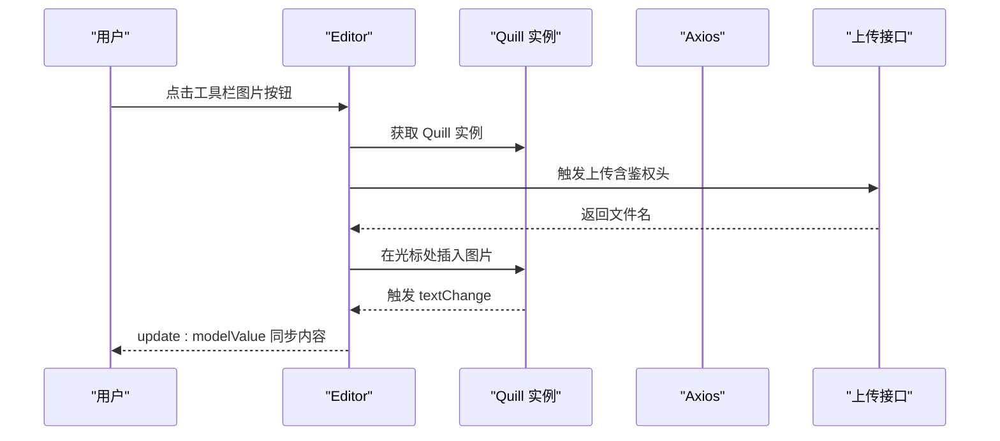
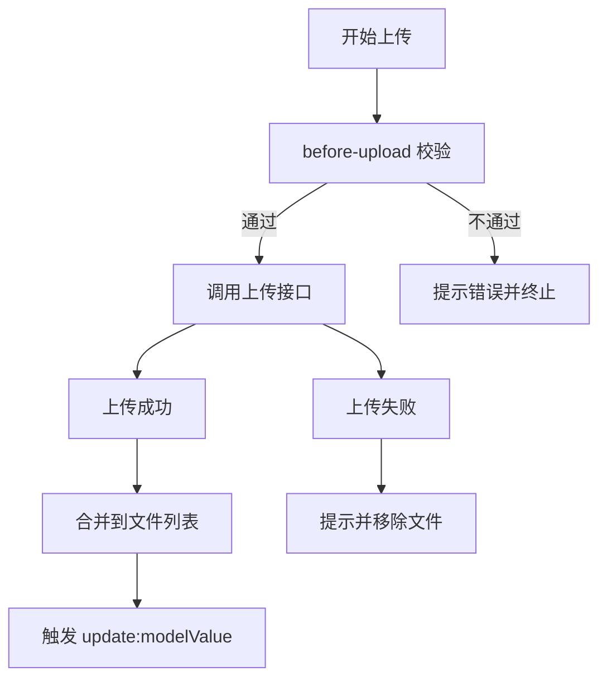
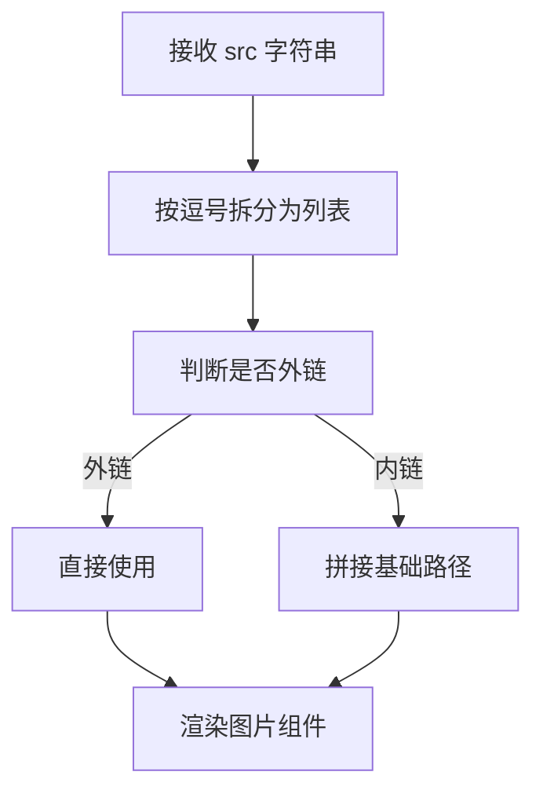
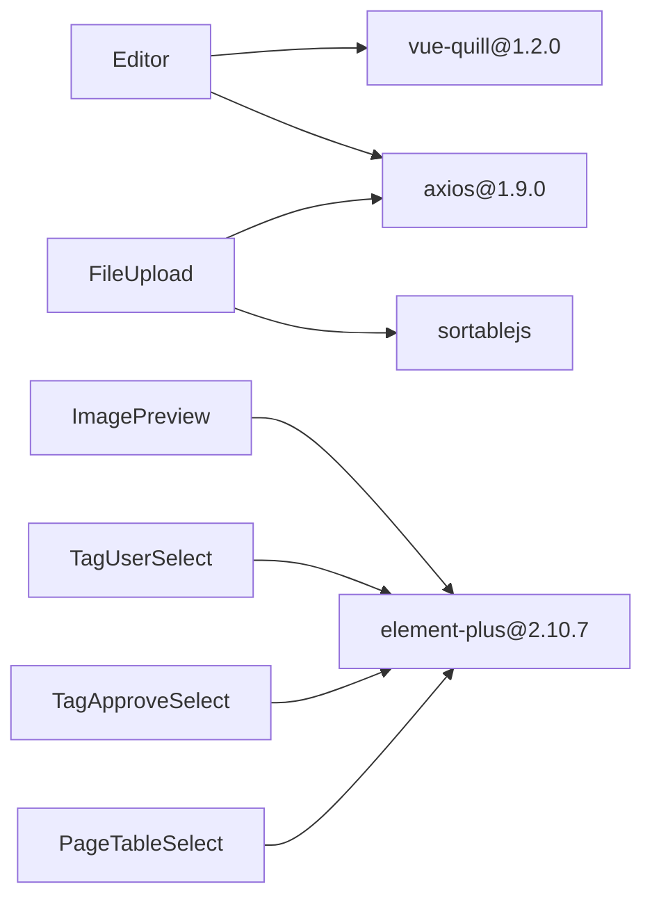

# 业务组件库

<cite>
**本文引用的文件**
- [antflow-vue/src/components/BizSelects/TagUserSelect/index.vue](file://antflow-vue/src/components/BizSelects/TagUserSelect/index.vue)
- [antflow-vue/src/components/BizSelects/TagUserSelect/userListDialog.vue](file://antflow-vue/src/components/BizSelects/TagUserSelect/userListDialog.vue)
- [antflow-vue/src/components/BizSelects/TagApproveSelect/index.vue](file://antflow-vue/src/components/BizSelects/TagApproveSelect/index.vue)
- [antflow-vue/src/components/BizSelects/TagApproveSelect/chooseApproveDialog.vue](file://antflow-vue/src/components/BizSelects/TagApproveSelect/chooseApproveDialog.vue)
- [antflow-vue/src/components/BizSelects/PageTableSelect/index.vue](file://antflow-vue/src/components/BizSelects/PageTableSelect/index.vue)
- [antflow-vue/src/components/Editor/index.vue](file://antflow-vue/src/components/Editor/index.vue)
- [antflow-vue/src/components/FileUpload/index.vue](file://antflow-vue/src/components/FileUpload/index.vue)
- [antflow-vue/src/components/ImagePreview/index.vue](file://antflow-vue/src/components/ImagePreview/index.vue)
- [antflow-vue/package.json](file://antflow-vue/package.json)
- [antflow-vue/src/settings.js](file://antflow-vue/src/settings.js)
</cite>

## 目录
1. [简介](#简介)
2. [项目结构](#项目结构)
3. [核心组件](#核心组件)
4. [架构总览](#架构总览)
5. [详细组件分析](#详细组件分析)
6. [依赖分析](#依赖分析)
7. [性能考虑](#性能考虑)
8. [故障排查指南](#故障排查指南)
9. [结论](#结论)
10. [附录](#附录)

## 简介
本文件面向业务组件库的使用者与维护者，系统化梳理并说明以下组件的设计理念与实现要点：
- 选择器组件：用户选择器、部门选择器（基于页面表格选择器）、自选审批人选择器
- 编辑器组件：富文本编辑与图片上传处理
- 文件上传组件：多格式与多文件支持、拖拽排序与数量限制
- 图片预览组件：多图预览、外链与内链适配

文档同时覆盖组件的可配置性、事件系统、数据绑定机制，并给出样式定制、国际化与无障碍访问建议，以及使用示例、最佳实践与自定义组件开发方法。

## 项目结构
组件集中在 antflow-vue/src/components 目录下，按功能域划分：
- BizSelects：业务选择器集合（用户、审批人、页面表格）
- Editor：富文本编辑器
- FileUpload：文件上传
- ImagePreview：图片预览

图表来源
- [antflow-vue/src/components/BizSelects/TagUserSelect/index.vue:1-83](file://antflow-vue/src/components/BizSelects/TagUserSelect/index.vue#L1-L83)
- [antflow-vue/src/components/BizSelects/TagUserSelect/userListDialog.vue:1-205](file://antflow-vue/src/components/BizSelects/TagUserSelect/userListDialog.vue#L1-L205)
- [antflow-vue/src/components/BizSelects/TagApproveSelect/index.vue:1-154](file://antflow-vue/src/components/BizSelects/TagApproveSelect/index.vue#L1-L154)
- [antflow-vue/src/components/BizSelects/TagApproveSelect/chooseApproveDialog.vue:1-199](file://antflow-vue/src/components/BizSelects/TagApproveSelect/chooseApproveDialog.vue#L1-L199)
- [antflow-vue/src/components/Editor/index.vue:1-277](file://antflow-vue/src/components/Editor/index.vue#L1-L277)
- [antflow-vue/src/components/FileUpload/index.vue:1-257](file://antflow-vue/src/components/FileUpload/index.vue#L1-L257)
- [antflow-vue/src/components/ImagePreview/index.vue:1-93](file://antflow-vue/src/components/ImagePreview/index.vue#L1-L93)

章节来源
- [antflow-vue/src/components/BizSelects/TagUserSelect/index.vue:1-83](file://antflow-vue/src/components/BizSelects/TagUserSelect/index.vue#L1-L83)
- [antflow-vue/src/components/BizSelects/TagUserSelect/userListDialog.vue:1-205](file://antflow-vue/src/components/BizSelects/TagUserSelect/userListDialog.vue#L1-L205)
- [antflow-vue/src/components/BizSelects/TagApproveSelect/index.vue:1-154](file://antflow-vue/src/components/BizSelects/TagApproveSelect/index.vue#L1-L154)
- [antflow-vue/src/components/BizSelects/TagApproveSelect/chooseApproveDialog.vue:1-199](file://antflow-vue/src/components/BizSelects/TagApproveSelect/chooseApproveDialog.vue#L1-L199)
- [antflow-vue/src/components/Editor/index.vue:1-277](file://antflow-vue/src/components/Editor/index.vue#L1-L277)
- [antflow-vue/src/components/FileUpload/index.vue:1-257](file://antflow-vue/src/components/FileUpload/index.vue#L1-L257)
- [antflow-vue/src/components/ImagePreview/index.vue:1-93](file://antflow-vue/src/components/ImagePreview/index.vue#L1-L93)

## 核心组件
- 用户选择器（TagUserSelect）：以标签形式展示已选用户，支持单选/多选，点击“+”打开用户对话框，支持删除标签并回写父组件。
- 自选审批人（TagApproveSelect）：根据流程起始节点动态渲染多个审批节点，每个节点可选择若干审批人，支持限制每个节点的审批人数，格式化返回数据结构。
- 页面表格选择器（PageTableSelect）：在下拉选项中嵌入表格样式的选项，支持搜索、分页与自定义列展示。
- 富文本编辑器（Editor）：基于 Quill，支持工具栏、只读、占位符、最小/最大高度、图片粘贴上传与远程上传。
- 文件上传（FileUpload）：多文件上传、类型与大小限制、数量上限、拖拽排序、删除与回写值。
- 图片预览（ImagePreview）：支持外链与内链图片，多图预览，悬停缩放与错误占位。

章节来源
- [antflow-vue/src/components/BizSelects/TagUserSelect/index.vue:1-83](file://antflow-vue/src/components/BizSelects/TagUserSelect/index.vue#L1-L83)
- [antflow-vue/src/components/BizSelects/TagApproveSelect/index.vue:1-154](file://antflow-vue/src/components/BizSelects/TagApproveSelect/index.vue#L1-L154)
- [antflow-vue/src/components/BizSelects/PageTableSelect/index.vue:1-155](file://antflow-vue/src/components/BizSelects/PageTableSelect/index.vue#L1-L155)
- [antflow-vue/src/components/Editor/index.vue:1-277](file://antflow-vue/src/components/Editor/index.vue#L1-L277)
- [antflow-vue/src/components/FileUpload/index.vue:1-257](file://antflow-vue/src/components/FileUpload/index.vue#L1-L257)
- [antflow-vue/src/components/ImagePreview/index.vue:1-93](file://antflow-vue/src/components/ImagePreview/index.vue#L1-L93)

## 架构总览
组件间协作关系如下：
- 选择器组件通过对话框组件加载用户数据，完成本地筛选与分页，最终回传选中结果。
- 富文本编辑器与文件上传组件通过统一的上传接口与鉴权头进行交互。
- 图片预览组件对 src 进行内外链判断与拼接，保证预览一致性。

图表来源
- [antflow-vue/src/components/BizSelects/TagUserSelect/index.vue:1-83](file://antflow-vue/src/components/BizSelects/TagUserSelect/index.vue#L1-L83)
- [antflow-vue/src/components/BizSelects/TagUserSelect/userListDialog.vue:1-205](file://antflow-vue/src/components/BizSelects/TagUserSelect/userListDialog.vue#L1-L205)
- [antflow-vue/src/components/Editor/index.vue:1-277](file://antflow-vue/src/components/Editor/index.vue#L1-L277)
- [antflow-vue/src/components/FileUpload/index.vue:1-257](file://antflow-vue/src/components/FileUpload/index.vue#L1-L257)

## 详细组件分析

### 用户选择器（TagUserSelect）
- 设计理念
  - 使用标签展示已选用户，直观反馈；空态提示占位文字；支持删除标签。
  - 通过 v-model:visible 与 v-model:checkedData 控制对话框可见性与选中数据，实现父子通信。
- 实现机制
  - 初始渲染根据 props.list 同步 selectValues；watch 监听变化并回写 update:list。
  - 删除标签时过滤并回写；保存对话框时直接回传最新数据。
- 可配置性
  - placeholder、multiple、list 等属性开放给父组件。
- 事件系统
  - update:list：用于双向绑定与回写。
- 数据绑定
  - 支持数组与逗号分隔字符串两种输出格式。
- 样式与可用性
  - 空列表时高亮边框提示必填；标签可关闭，布局紧凑。

图表来源
- [antflow-vue/src/components/BizSelects/TagUserSelect/index.vue:1-83](file://antflow-vue/src/components/BizSelects/TagUserSelect/index.vue#L1-L83)

章节来源
- [antflow-vue/src/components/BizSelects/TagUserSelect/index.vue:1-83](file://antflow-vue/src/components/BizSelects/TagUserSelect/index.vue#L1-L83)
- [antflow-vue/src/components/BizSelects/TagUserSelect/userListDialog.vue:1-205](file://antflow-vue/src/components/BizSelects/TagUserSelect/userListDialog.vue#L1-L205)

### 自选审批人（TagApproveSelect）
- 功能特性
  - 根据表单编码异步获取起始节点列表，为每个节点渲染已选审批人标签。
  - 限制每个节点最多可选人数，支持删除与重新选择。
  - 统一格式化返回数据：approvers（节点ID -> 审批人列表），nodeVaild（是否所有节点都选择了审批人）。
- 实现机制
  - onMounted 中请求节点列表；openUserDialog 将当前节点注入对话框；保存后合并回 approvaNodeList 并触发 chooseApprove。
- 事件系统
  - chooseApprove：返回标准化数据结构。
- 数据绑定
  - 通过 formCode 与节点 ID 维护多节点审批人映射。

图表来源
- [antflow-vue/src/components/BizSelects/TagApproveSelect/index.vue:1-154](file://antflow-vue/src/components/BizSelects/TagApproveSelect/index.vue#L1-L154)
- [antflow-vue/src/components/BizSelects/TagApproveSelect/chooseApproveDialog.vue:1-199](file://antflow-vue/src/components/BizSelects/TagApproveSelect/chooseApproveDialog.vue#L1-L199)

章节来源
- [antflow-vue/src/components/BizSelects/TagApproveSelect/index.vue:1-154](file://antflow-vue/src/components/BizSelects/TagApproveSelect/index.vue#L1-L154)
- [antflow-vue/src/components/BizSelects/TagApproveSelect/chooseApproveDialog.vue:1-199](file://antflow-vue/src/components/BizSelects/TagApproveSelect/chooseApproveDialog.vue#L1-L199)

### 页面表格选择器（PageTableSelect）
- 设计理念
  - 在下拉框中以表格形式展示候选数据，提升可读性与筛选效率。
- 实现机制
  - 内置搜索表单与分页控件；通过 el-option 渲染表格样式行；支持多选与单选。
  - 提供 update:value、update:label、change 事件，便于父组件获取选中值与标签。
- 可配置性
  - value、multiple、placeholder 等属性；支持自定义列与表格样式。
- 事件系统
  - change：返回完整选中对象；update:value/update:label：用于双向绑定。

图表来源
- [antflow-vue/src/components/BizSelects/PageTableSelect/index.vue:1-155](file://antflow-vue/src/components/BizSelects/PageTableSelect/index.vue#L1-L155)

章节来源
- [antflow-vue/src/components/BizSelects/PageTableSelect/index.vue:1-155](file://antflow-vue/src/components/BizSelects/PageTableSelect/index.vue#L1-L155)

### 富文本编辑器（Editor）
- 富文本处理能力
  - 基于 Quill Snow 主题，内置常用工具栏（加粗、斜体、列表、标题、对齐、清除、链接/图片/视频）。
  - 支持只读模式、最小/最大高度、占位符。
- 图片上传
  - 支持点击工具栏图片按钮或粘贴图片触发上传。
  - 上传前校验类型（JPEG/JPG/PNG/SVG）与大小；成功后插入图片并移动光标。
  - 通过统一上传接口与鉴权头进行远程上传。
- 事件系统
  - update:modelValue：双向绑定内容；textChange：内容变更时同步父组件。
- 可配置性
  - modelValue、height、minHeight、readOnly、fileSize、type（url/base64）。

图表来源
- [antflow-vue/src/components/Editor/index.vue:1-277](file://antflow-vue/src/components/Editor/index.vue#L1-L277)

章节来源
- [antflow-vue/src/components/Editor/index.vue:1-277](file://antflow-vue/src/components/Editor/index.vue#L1-L277)

### 文件上传（FileUpload）
- 多格式支持
  - 默认支持 doc/docx/xls/xlsx/ppt/pptx/txt/pdf 等常见办公文档；可通过 fileType 自定义。
- 上传与校验
  - before-upload 校验类型、文件名合法性（不含逗号）、大小；超限/超数量即时提示。
- 拖拽排序与删除
  - 通过 sortablejs 实现列表拖拽排序；支持删除单项并回写 modelValue。
- 事件系统
  - update:modelValue：回写逗号分隔的文件名列表；内部维护上传进度与成功/失败状态。
- 可配置性
  - action、data、limit、fileSize、fileType、isShowTip、disabled、drag 等。

图表来源
- [antflow-vue/src/components/FileUpload/index.vue:1-257](file://antflow-vue/src/components/FileUpload/index.vue#L1-L257)

章节来源
- [antflow-vue/src/components/FileUpload/index.vue:1-257](file://antflow-vue/src/components/FileUpload/index.vue#L1-L257)

### 图片预览（ImagePreview）
- 实现方式
  - 支持单图或多图（逗号分隔），自动识别外链与内链，拼接基础路径。
  - 使用 Element Plus 图片组件，支持错误占位与预览弹层。
- 可配置性
  - src、width、height；内部计算真实尺寸与预览列表。
- 无障碍与可用性
  - 错误占位图标明确提示；预览弹层可放大查看。

图表来源
- [antflow-vue/src/components/ImagePreview/index.vue:1-93](file://antflow-vue/src/components/ImagePreview/index.vue#L1-L93)

章节来源
- [antflow-vue/src/components/ImagePreview/index.vue:1-93](file://antflow-vue/src/components/ImagePreview/index.vue#L1-L93)

## 依赖分析
- 组件依赖
  - Editor 依赖 @vueup/vue-quill 与 axios；FileUpload 依赖 axios、sortablejs；ImagePreview 依赖 Element Plus 图片组件。
  - BizSelects 子组件依赖 Element Plus 表格、对话框、分页等。
- 版本与兼容
  - package.json 中声明了 Vue 3、Element Plus、Quill 等依赖版本，注意与浏览器与 Node 环境兼容性。

图表来源
- [antflow-vue/package.json:1-54](file://antflow-vue/package.json#L1-L54)

章节来源
- [antflow-vue/package.json:1-54](file://antflow-vue/package.json#L1-L54)

## 性能考虑
- 列表渲染
  - BizSelects 与 FileUpload 使用虚拟滚动/懒加载策略（如分页）降低首屏压力。
- 上传优化
  - Editor 与 FileUpload 均采用 before-upload 校验，减少无效请求；FileUpload 使用批量合并策略，避免频繁回写。
- 图片处理
  - ImagePreview 仅在需要时渲染预览弹层；Editor 限制图片大小与类型，避免大图卡顿。
- 组件复用
  - 将对话框抽离为独立子组件，减少重复逻辑与内存占用。

## 故障排查指南
- 上传失败
  - 检查鉴权头是否正确设置；确认上传接口返回 code 与 fileName 字段；查看控制台网络请求与响应。
- 图片无法插入
  - 确认 before-upload 校验未拦截（类型与大小）；检查上传成功回调是否触发；确认 Quill 实例存在且可获取。
- 文件列表异常
  - 确认 modelValue 格式（数组或逗号分隔字符串）；检查 listToString 输出；确认拖拽排序回调是否触发 update:modelValue。
- 多选上限
  - TagApproveSelect 与 userListDialog 均有 multiplelimit 限制，需确保不超过上限。
- 预览问题
  - 检查 src 是否为外链或内链；确认基础路径拼接逻辑；查看错误占位是否显示。

章节来源
- [antflow-vue/src/components/Editor/index.vue:1-277](file://antflow-vue/src/components/Editor/index.vue#L1-L277)
- [antflow-vue/src/components/FileUpload/index.vue:1-257](file://antflow-vue/src/components/FileUpload/index.vue#L1-L257)
- [antflow-vue/src/components/ImagePreview/index.vue:1-93](file://antflow-vue/src/components/ImagePreview/index.vue#L1-L93)
- [antflow-vue/src/components/BizSelects/TagUserSelect/userListDialog.vue:1-205](file://antflow-vue/src/components/BizSelects/TagUserSelect/userListDialog.vue#L1-L205)
- [antflow-vue/src/components/BizSelects/TagApproveSelect/chooseApproveDialog.vue:1-199](file://antflow-vue/src/components/BizSelects/TagApproveSelect/chooseApproveDialog.vue#L1-L199)

## 结论
业务组件库围绕“可配置、可扩展、易用”的目标设计，通过对话框与表格组合实现灵活的选择体验，通过统一的上传与鉴权机制保障编辑器与文件上传的稳定性。建议在实际项目中结合业务场景调整默认配置、样式与事件回调，以获得更佳的用户体验。

## 附录

### 组件使用示例与最佳实践
- 用户选择器
  - 单选/多选：通过 multiple 切换；默认占位文字通过 placeholder 设置；双向绑定使用 v-model:list。
  - 最佳实践：在表单校验时监听 update:list，确保必填项非空。
- 自选审批人
  - 通过 formCode 获取节点列表；限制每个节点审批人数；统一格式化返回数据，便于后端处理。
  - 最佳实践：在提交前校验 nodeVaild，确保每个节点都有审批人。
- 页面表格选择器
  - 自定义列与表格样式；结合分页与搜索提升大数据量下的交互效率。
  - 最佳实践：在 change 事件中缓存完整对象，在 update:value 中仅传递 ID。
- 富文本编辑器
  - 通过 fileSize 与 fileType 限制图片与文件；在只读场景禁用工具栏。
  - 最佳实践：在提交时清理空标签与多余空白，保持内容整洁。
- 文件上传
  - 自定义 fileType 与 fileSize；开启拖拽排序提升用户体验；在禁用状态下仅展示文件列表。
  - 最佳实践：对上传进度与错误进行统一提示，避免用户重复操作。
- 图片预览
  - 多图场景建议使用逗号分隔；对外链与内链分别处理；提供错误占位与放大预览。

### 样式定制与主题
- 全局主题
  - settings.js 提供侧边栏主题、标签页、固定头部等全局配置项，可在应用入口统一启用。
- 组件样式
  - 各组件均提供 scoped 样式，可按需覆盖变量或类名；Editor 与 FileUpload 提供额外样式以适配工具栏与列表项。

章节来源
- [antflow-vue/src/settings.js:1-58](file://antflow-vue/src/settings.js#L1-L58)
- [antflow-vue/src/components/Editor/index.vue:1-277](file://antflow-vue/src/components/Editor/index.vue#L1-L277)
- [antflow-vue/src/components/FileUpload/index.vue:1-257](file://antflow-vue/src/components/FileUpload/index.vue#L1-L257)

### 国际化与无障碍访问
- 国际化
  - 组件文本（如占位符、按钮文案）建议通过 i18n 注入，避免硬编码；Editor 的工具栏提示文本可按语言切换。
- 无障碍访问
  - 为按钮与图标提供可读的 aria-label；为表格与对话框提供键盘可访问性；为图片预览提供 alt 文本或占位提示。

### 自定义组件开发方法
- 组件结构
  - 采用 props + emits 的清晰接口；使用 v-model:xxx 实现双向绑定；在 mounted 或 onMounted 中初始化数据。
- 交互与事件
  - 明确事件命名规范（update:xxx、change、自定义事件），并在文档中列出所有事件与参数。
- 样式与主题
  - 使用 CSS 变量与 Element Plus 主题变量，确保与整体风格一致；提供 scoped 样式以便覆盖。
- 测试与文档
  - 为关键流程编写单元测试与端到端用例；在 README 中补充使用示例与注意事项。