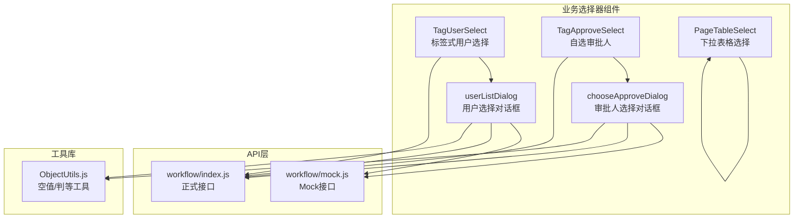
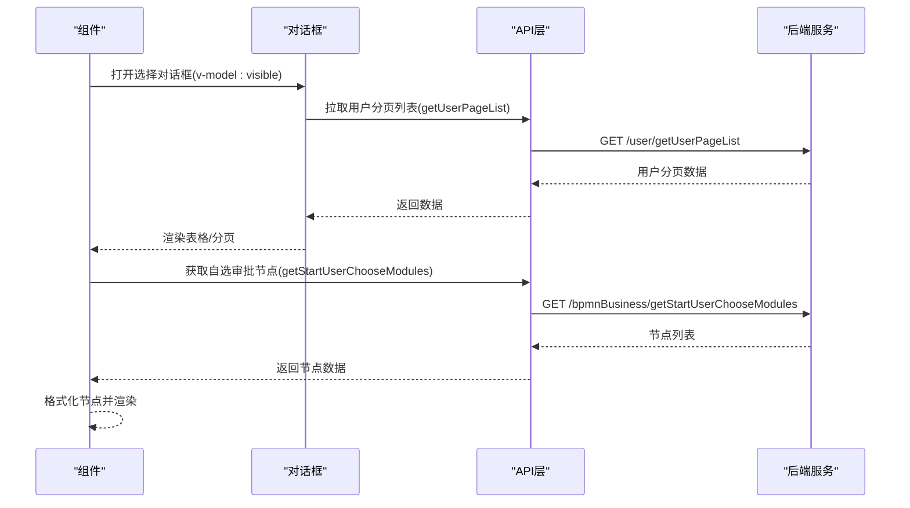
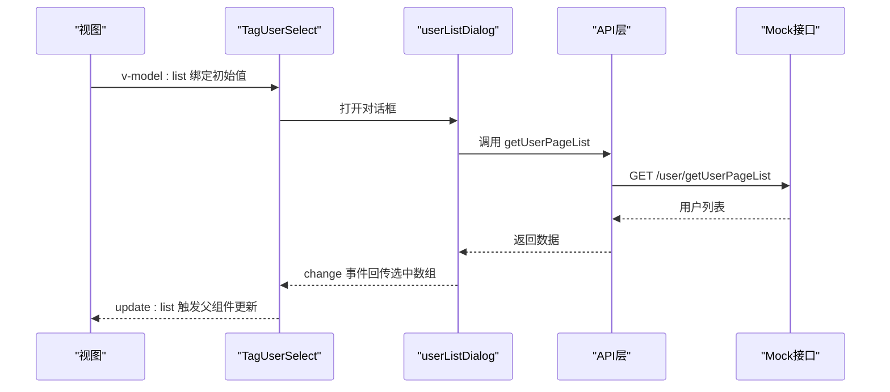
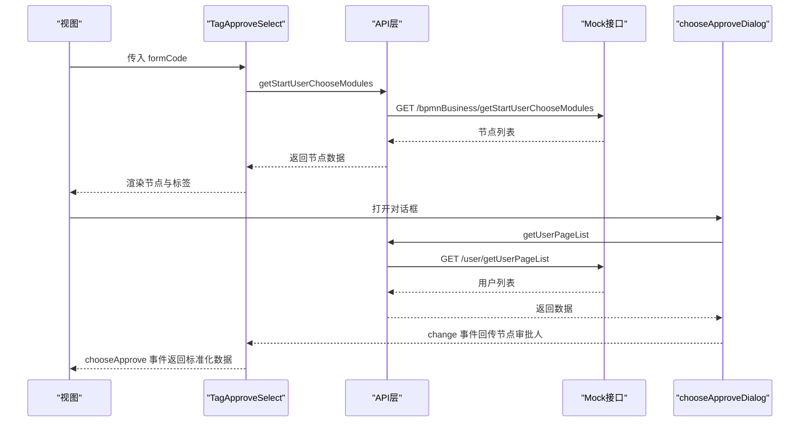
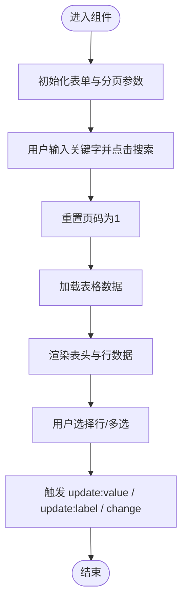
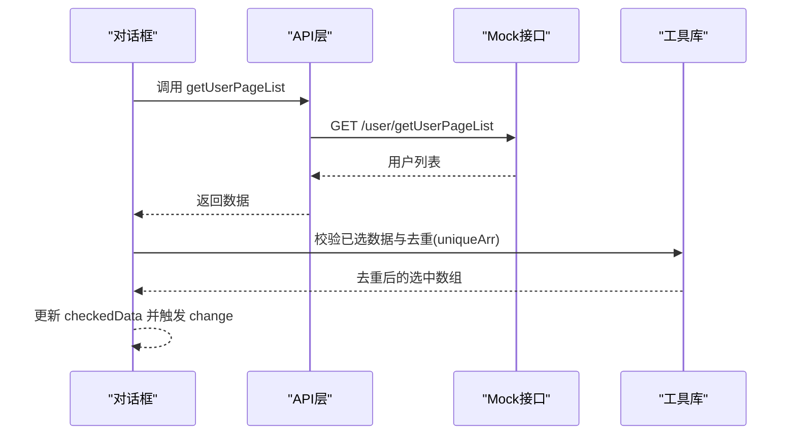
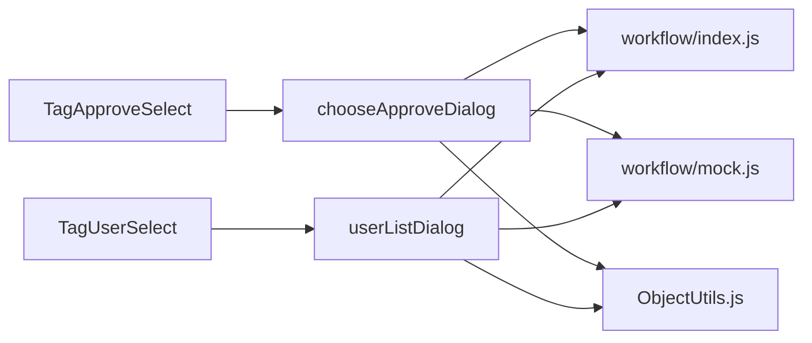

# 业务选择器组件

<cite>
**本文引用的文件**
- [TagUserSelect/index.vue](file://antflow-vue/src/components/BizSelects/TagUserSelect/index.vue)
- [TagApproveSelect/index.vue](file://antflow-vue/src/components/BizSelects/TagApproveSelect/index.vue)
- [PageTableSelect/index.vue](file://antflow-vue/src/components/BizSelects/PageTableSelect/index.vue)
- [chooseApproveDialog.vue](file://antflow-vue/src/components/BizSelects/chooseApproveDialog.vue)
- [userListDialog.vue](file://antflow-vue/src/components/BizSelects/userListDialog.vue)
- [workflow/index.js](file://antflow-vue/src/api/workflow/index.js)
- [workflow/mock.js](file://antflow-vue/src/api/workflow/mock.js)
- [ObjectUtils.js](file://antflow-vue/src/utils/antflow/ObjectUtils.js)
- [transferDialog.vue](file://antflow-vue/src/views/workflow/flowTask/pendding/components/transferDialog.vue)
</cite>

## 目录
1. [简介](#简介)
2. [项目结构](#项目结构)
3. [核心组件](#核心组件)
4. [架构总览](#架构总览)
5. [详细组件分析](#详细组件分析)
6. [依赖分析](#依赖分析)
7. [性能考虑](#性能考虑)
8. [故障排查指南](#故障排查指南)
9. [结论](#结论)
10. [附录：使用示例与最佳实践](#附录使用示例与最佳实践)

## 简介
本文件面向业务选择器组件的使用者与维护者，系统性梳理以下核心组件的实现原理与使用方法：
- 用户选择器：基于标签展示的人员选择组件，支持单选与多选，具备标签删除、占位提示、双向绑定与事件回调。
- 审批人选择器：按流程节点维度展示“自选审批人”，支持每个节点限定审批人数上限，提供标签式展示与删除。
- 页面表格选择器：在下拉选择框内嵌入搜索表单与分页表格，支持关键字搜索、分页加载与行级选择。
- 选择对话框：通用的用户选择弹窗，支持单选/多选、搜索、分页、已选去重与确认回调。

组件通过统一的API层与后端交互，数据格式在组件内部完成转换与校验，错误处理采用全局提示与本地状态管理相结合的方式。

## 项目结构
业务选择器组件位于前端工程 antflow-vue 的 BizSelects 目录下，配套的API与工具函数分别位于 api 与 utils/antflow 目录。页面表格选择器作为独立的下拉选择组件，其余组件以对话框形式承载用户选择逻辑。

图表来源
- [TagUserSelect/index.vue:1-83](file://antflow-vue/src/components/BizSelects/TagUserSelect/index.vue#L1-L83)
- [TagApproveSelect/index.vue:1-154](file://antflow-vue/src/components/BizSelects/TagApproveSelect/index.vue#L1-L154)
- [PageTableSelect/index.vue:1-155](file://antflow-vue/src/components/BizSelects/PageTableSelect/index.vue#L1-L155)
- [chooseApproveDialog.vue:1-199](file://antflow-vue/src/components/BizSelects/chooseApproveDialog.vue#L1-L199)
- [userListDialog.vue:1-195](file://antflow-vue/src/components/BizSelects/userListDialog.vue#L1-L195)
- [workflow/index.js:1-285](file://antflow-vue/src/api/workflow/index.js#L1-L285)
- [workflow/mock.js:1-155](file://antflow-vue/src/api/workflow/mock.js#L1-L155)
- [ObjectUtils.js:1-141](file://antflow-vue/src/utils/antflow/ObjectUtils.js#L1-L141)

章节来源
- [TagUserSelect/index.vue:1-83](file://antflow-vue/src/components/BizSelects/TagUserSelect/index.vue#L1-L83)
- [TagApproveSelect/index.vue:1-154](file://antflow-vue/src/components/BizSelects/TagApproveSelect/index.vue#L1-L154)
- [PageTableSelect/index.vue:1-155](file://antflow-vue/src/components/BizSelects/PageTableSelect/index.vue#L1-L155)
- [chooseApproveDialog.vue:1-199](file://antflow-vue/src/components/BizSelects/chooseApproveDialog.vue#L1-L199)
- [userListDialog.vue:1-195](file://antflow-vue/src/components/BizSelects/userListDialog.vue#L1-L195)
- [workflow/index.js:1-285](file://antflow-vue/src/api/workflow/index.js#L1-L285)
- [workflow/mock.js:1-155](file://antflow-vue/src/api/workflow/mock.js#L1-L155)
- [ObjectUtils.js:1-141](file://antflow-vue/src/utils/antflow/ObjectUtils.js#L1-L141)

## 核心组件
- 用户选择器（TagUserSelect）
  - 功能：以标签形式展示已选人员，支持单选/多选；点击“+”打开用户选择对话框；标签可关闭移除；支持占位提示与必填边框高亮。
  - 数据绑定：v-model:list 接收数组或逗号分隔字符串，内部统一转为数组并触发 update:list 回调。
  - 事件：update:list（值变化时）、change（对话框确认时）。
  - 样式：默认边框与标签间距，无值时显示占位文本，必填未选中时边框高亮。
- 审批人选择器（TagApproveSelect）
  - 功能：按流程节点展示“自选审批人”，每个节点限制审批人数；支持为节点添加审批人并删除。
  - 数据绑定：通过 formCode 初始化节点列表；chooseApprove 事件返回标准化数据（包含节点校验状态）。
  - 事件：chooseApprove（节点审批人变更时）。
  - 样式：节点标题带星号标识必填，节点内容区域圆角边框与背景色。
- 页面表格选择器（PageTableSelect）
  - 功能：在 el-select 下拉框内嵌入搜索表单与表格，支持关键字搜索、分页加载与行级选择。
  - 数据绑定：v-model:value 绑定选中值；触发 update:value、update:label、change 事件。
  - 样式：表头加粗，下拉面板固定高度与滚动条。
- 选择对话框（chooseApproveDialog / userListDialog）
  - 功能：通用用户选择弹窗，支持单选/多选、搜索、分页、已选去重与确认回调。
  - 数据绑定：v-model:visible 控制显隐；v-model:checkedData 传入已选数据；change 返回更新后的审批人集合。
  - 事件：update:visible、change。
  - 校验：多选时限制数量（multiplelimit），禁用确认按钮直到满足条件。

章节来源
- [TagUserSelect/index.vue:18-63](file://antflow-vue/src/components/BizSelects/TagUserSelect/index.vue#L18-L63)
- [TagApproveSelect/index.vue:30-111](file://antflow-vue/src/components/BizSelects/TagApproveSelect/index.vue#L30-L111)
- [PageTableSelect/index.vue:51-146](file://antflow-vue/src/components/BizSelects/PageTableSelect/index.vue#L51-L146)
- [chooseApproveDialog.vue:47-191](file://antflow-vue/src/components/BizSelects/chooseApproveDialog.vue#L47-L191)
- [userListDialog.vue:47-186](file://antflow-vue/src/components/BizSelects/userListDialog.vue#L47-L186)

## 架构总览
组件与API交互遵循“组件 -> API层 -> 后端”的链路，Mock层用于演示与联调，正式接口用于生产环境。

图表来源
- [workflow/index.js:279-284](file://antflow-vue/src/api/workflow/index.js#L279-L284)
- [workflow/mock.js:121-131](file://antflow-vue/src/api/workflow/mock.js#L121-L131)
- [TagApproveSelect/index.vue:50-63](file://antflow-vue/src/components/BizSelects/TagApproveSelect/index.vue#L50-L63)
- [chooseApproveDialog.vue:109-124](file://antflow-vue/src/components/BizSelects/chooseApproveDialog.vue#L109-L124)
- [userListDialog.vue:107-122](file://antflow-vue/src/components/BizSelects/userListDialog.vue#L107-L122)

## 详细组件分析

### 用户选择器（TagUserSelect）
- 数据获取机制
  - 通过 userListDialog 弹窗拉取用户分页列表，内部使用 Mock 接口 getUserPageList。
  - 选中后通过 change 事件回传数组，组件内部统一触发 update:list。
- 搜索过滤
  - 对话框内提供关键字输入与搜索按钮，查询参数随分页请求发送。
- 多选单选支持
  - 通过 multiple 属性切换单选/多选；多选时支持标签删除与去重。
- 标签显示效果
  - 使用 Element Plus 的标签组件，支持关闭事件与尺寸控制。
- 与后端API交互
  - 正式接口由 workflow/index.js 提供；组件当前使用 Mock 接口进行演示。
- 错误处理
  - 拉取失败时通过全局提示组件报错；对话框关闭时清空状态。
- 配置选项
  - placeholder：占位提示文本
  - multiple：是否多选
  - list：初始值（数组或逗号分隔字符串）
- 事件回调
  - update:list：值变化时触发
  - change：对话框确认时触发
- 样式定制
  - 外层容器边框与圆角；占位文本颜色；必填状态边框高亮类名

图表来源
- [TagUserSelect/index.vue:18-63](file://antflow-vue/src/components/BizSelects/TagUserSelect/index.vue#L18-L63)
- [userListDialog.vue:47-186](file://antflow-vue/src/components/BizSelects/userListDialog.vue#L47-L186)
- [workflow/mock.js:121-131](file://antflow-vue/src/api/workflow/mock.js#L121-L131)

章节来源
- [TagUserSelect/index.vue:18-63](file://antflow-vue/src/components/BizSelects/TagUserSelect/index.vue#L18-L63)
- [userListDialog.vue:107-122](file://antflow-vue/src/components/BizSelects/userListDialog.vue#L107-L122)
- [workflow/mock.js:121-131](file://antflow-vue/src/api/workflow/mock.js#L121-L131)

### 审批人选择器（TagApproveSelect）
- 数据获取机制
  - 组件挂载时通过 workflow/index.js 的 getStartUserChooseModules 拉取流程自选审批节点列表。
  - 将返回的节点映射为内部结构，每个节点维护 approversList。
- 搜索过滤
  - 打开 chooseApproveDialog 后，对话框内提供关键字搜索与分页。
- 多选单选支持
  - 审批人选择为多选，且每个节点限制最多 multiplelimit 个审批人。
- 标签显示效果
  - 节点标题带星号标识必填；节点内容区为浅色背景与圆角边框。
- 与后端API交互
  - 通过 workflow/index.js 的 getStartUserChooseModules 获取节点；chooseApproveDialog 内部使用 Mock 接口。
- 错误处理
  - 拉取失败时通过全局提示组件报错；对话框关闭时清空状态。
- 配置选项
  - formCode：流程编码，用于初始化节点列表
- 事件回调
  - chooseApprove：节点审批人变更时返回标准化数据（包含节点校验状态）
- 样式定制
  - 节点标题背景色与字体加粗；节点内容区圆角边框与背景色

图表来源
- [TagApproveSelect/index.vue:30-111](file://antflow-vue/src/components/BizSelects/TagApproveSelect/index.vue#L30-L111)
- [workflow/index.js:279-284](file://antflow-vue/src/api/workflow/index.js#L279-L284)
- [workflow/mock.js:121-131](file://antflow-vue/src/api/workflow/mock.js#L121-L131)
- [chooseApproveDialog.vue:109-124](file://antflow-vue/src/components/BizSelects/chooseApproveDialog.vue#L109-L124)

章节来源
- [TagApproveSelect/index.vue:30-111](file://antflow-vue/src/components/BizSelects/TagApproveSelect/index.vue#L30-L111)
- [workflow/index.js:279-284](file://antflow-vue/src/api/workflow/index.js#L279-L284)
- [chooseApproveDialog.vue:109-124](file://antflow-vue/src/components/BizSelects/chooseApproveDialog.vue#L109-L124)

### 页面表格选择器（PageTableSelect）
- 数据获取机制
  - 组件内部维护本地 options 列表；提供搜索与分页能力；通过分页事件刷新列表。
- 搜索过滤
  - 表单内关键字输入，回车或点击搜索触发查询。
- 多选单选支持
  - 通过 multiple 属性切换单选/多选；支持行级选择。
- 标签显示效果
  - 表头加粗，列宽分布合理；下拉面板固定高度与滚动条。
- 与后端API交互
  - 组件当前使用本地静态数据；如需接入后端，请在 getList 中替换为真实接口。
- 错误处理
  - 通过分页组件与表单校验配合，保证交互一致性。
- 配置选项
  - value：当前选中值
  - multiple：是否多选
  - placeholder：占位提示
- 事件回调
  - update:value、update:label、change
- 样式定制
  - 输入框高度与下拉面板样式

图表来源
- [PageTableSelect/index.vue:51-146](file://antflow-vue/src/components/BizSelects/PageTableSelect/index.vue#L51-L146)

章节来源
- [PageTableSelect/index.vue:51-146](file://antflow-vue/src/components/BizSelects/PageTableSelect/index.vue#L51-L146)

### 选择对话框（chooseApproveDialog / userListDialog）
- 数据获取机制
  - 通过 getUserPageList 拉取用户分页列表；支持关键字搜索与分页。
- 搜索过滤
  - 表单内关键字输入，回车或点击搜索触发查询。
- 多选单选支持
  - 单选使用 radio；多选使用 checkbox；多选时限制数量（multiplelimit）。
- 标签显示效果
  - 表格列包含用户名称、邮箱、状态；支持状态标签展示。
- 与后端API交互
  - 使用 Mock 接口 getUserPageList；可替换为正式接口。
- 错误处理
  - 拉取失败时通过全局提示组件报错；关闭对话框时清空状态。
- 配置选项
  - visible：控制显隐
  - multiple：是否多选
  - multiplelimit：多选最大数量
  - checkedData：已选数据（审批人选择时为节点对象，用户选择时为数组）
- 事件回调
  - update:visible、change
- 样式定制
  - 对话框宽度、表格高度、分页布局

图表来源
- [chooseApproveDialog.vue:109-172](file://antflow-vue/src/components/BizSelects/chooseApproveDialog.vue#L109-L172)
- [userListDialog.vue:107-168](file://antflow-vue/src/components/BizSelects/userListDialog.vue#L107-L168)
- [workflow/mock.js:121-131](file://antflow-vue/src/api/workflow/mock.js#L121-L131)
- [ObjectUtils.js:1-141](file://antflow-vue/src/utils/antflow/ObjectUtils.js#L1-L141)

章节来源
- [chooseApproveDialog.vue:109-172](file://antflow-vue/src/components/BizSelects/chooseApproveDialog.vue#L109-L172)
- [userListDialog.vue:107-168](file://antflow-vue/src/components/BizSelects/userListDialog.vue#L107-L168)
- [workflow/mock.js:121-131](file://antflow-vue/src/api/workflow/mock.js#L121-L131)
- [ObjectUtils.js:1-141](file://antflow-vue/src/utils/antflow/ObjectUtils.js#L1-L141)

## 依赖分析
- 组件耦合
  - TagUserSelect 依赖 userListDialog；TagApproveSelect 依赖 chooseApproveDialog 与 workflow/index.js。
  - 选择对话框依赖 workflow/mock.js 进行演示，可替换为正式接口。
- 外部依赖
  - Element Plus 的标签、按钮、对话框、表格、分页等组件。
  - 工具库 ObjectUtils 提供空值判断与对象比较。
- 循环依赖
  - 组件间通过事件回调传递数据，未见循环导入。

图表来源
- [TagUserSelect/index.vue:18-20](file://antflow-vue/src/components/BizSelects/TagUserSelect/index.vue#L18-L20)
- [TagApproveSelect/index.vue:32-33](file://antflow-vue/src/components/BizSelects/TagApproveSelect/index.vue#L32-L33)
- [workflow/index.js:1-285](file://antflow-vue/src/api/workflow/index.js#L1-L285)
- [workflow/mock.js:1-155](file://antflow-vue/src/api/workflow/mock.js#L1-L155)
- [ObjectUtils.js:1-141](file://antflow-vue/src/utils/antflow/ObjectUtils.js#L1-L141)

章节来源
- [TagUserSelect/index.vue:18-20](file://antflow-vue/src/components/BizSelects/TagUserSelect/index.vue#L18-L20)
- [TagApproveSelect/index.vue:32-33](file://antflow-vue/src/components/BizSelects/TagApproveSelect/index.vue#L32-L33)
- [workflow/index.js:1-285](file://antflow-vue/src/api/workflow/index.js#L1-L285)
- [workflow/mock.js:1-155](file://antflow-vue/src/api/workflow/mock.js#L1-L155)
- [ObjectUtils.js:1-141](file://antflow-vue/src/utils/antflow/ObjectUtils.js#L1-L141)

## 性能考虑
- 列表渲染
  - 对话框表格使用 v-loading 与固定高度，避免频繁重排。
- 搜索与分页
  - 搜索触发时重置页码，减少无效请求；分页组件仅在 total > 0 时显示。
- 数据去重
  - 多选时对选中数组按 id 去重，避免重复提交。
- 事件节流
  - 建议在高频搜索场景下增加防抖策略（可在组件外层封装）。
- 样式优化
  - 下拉面板固定高度与滚动条，减少 DOM 体积。

## 故障排查指南
- 对话框无法打开
  - 检查 v-model:visible 是否正确绑定；确认父组件 visible 状态。
- 搜索无结果
  - 检查查询参数是否正确传递；确认 Mock 接口返回数据结构。
- 多选数量超限
  - 检查 multiplelimit 配置；确认 canCommit 计算逻辑。
- 选中数据未更新
  - 检查 change 事件是否触发；确认父组件是否监听 update:list 或 chooseApprove。
- 错误提示
  - 拉取失败时会通过全局提示组件报错；检查网络与接口返回。

章节来源
- [chooseApproveDialog.vue:102-104](file://antflow-vue/src/components/BizSelects/chooseApproveDialog.vue#L102-L104)
- [userListDialog.vue:100-102](file://antflow-vue/src/components/BizSelects/userListDialog.vue#L100-L102)
- [workflow/mock.js:119-124](file://antflow-vue/src/api/workflow/mock.js#L119-L124)

## 结论
业务选择器组件围绕“标签展示 + 对话框选择 + API交互”的模式构建，具备良好的扩展性与复用性。通过统一的事件与数据格式，组件能够灵活适配不同业务场景；通过 Mock 与正式接口的切换，便于联调与上线。建议在实际项目中结合自身后端接口完善数据获取与错误处理，并在高频交互场景下引入防抖与缓存策略以提升性能。

## 附录：使用示例与最佳实践
- 用户选择器（TagUserSelect）
  - 在表单中使用 v-model:list 绑定数组或字符串；监听 update:list 更新父组件状态。
  - 示例路径参考：[transferDialog.vue:28-100](file://antflow-vue/src/views/workflow/flowTask/pendding/components/transferDialog.vue#L28-L100)
- 审批人选择器（TagApproveSelect）
  - 传入 formCode 初始化节点；监听 chooseApprove 获取标准化数据（包含节点校验状态）。
  - 示例路径参考：[TagApproveSelect/index.vue:30-111](file://antflow-vue/src/components/BizSelects/TagApproveSelect/index.vue#L30-L111)
- 页面表格选择器（PageTableSelect）
  - 在 el-form-item 中使用 v-model:value 绑定选中值；监听 update:value、update:label、change。
  - 示例路径参考：[PageTableSelect/index.vue:55-78](file://antflow-vue/src/components/BizSelects/PageTableSelect/index.vue#L55-L78)
- 最佳实践
  - 统一数据格式：组件内部统一为数组，对外提供字符串或数组两种形态。
  - 事件命名：遵循 update:* 与业务事件（如 chooseApprove）的区分。
  - 样式定制：通过 scoped 样式覆盖默认外观，保持主题一致。
  - 错误处理：在对话框关闭时清空状态，避免脏数据残留。
  - 性能优化：在搜索与分页场景引入防抖与缓存，减少重复请求。

章节来源
- [transferDialog.vue:28-100](file://antflow-vue/src/views/workflow/flowTask/pendding/components/transferDialog.vue#L28-L100)
- [TagUserSelect/index.vue:18-63](file://antflow-vue/src/components/BizSelects/TagUserSelect/index.vue#L18-L63)
- [TagApproveSelect/index.vue:30-111](file://antflow-vue/src/components/BizSelects/TagApproveSelect/index.vue#L30-L111)
- [PageTableSelect/index.vue:55-78](file://antflow-vue/src/components/BizSelects/PageTableSelect/index.vue#L55-L78)