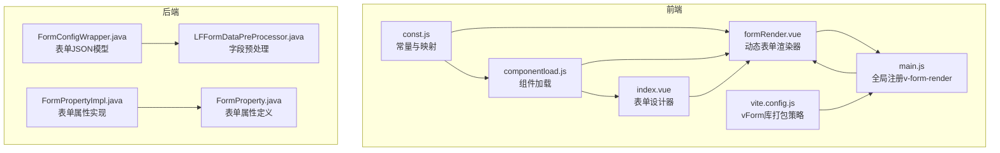
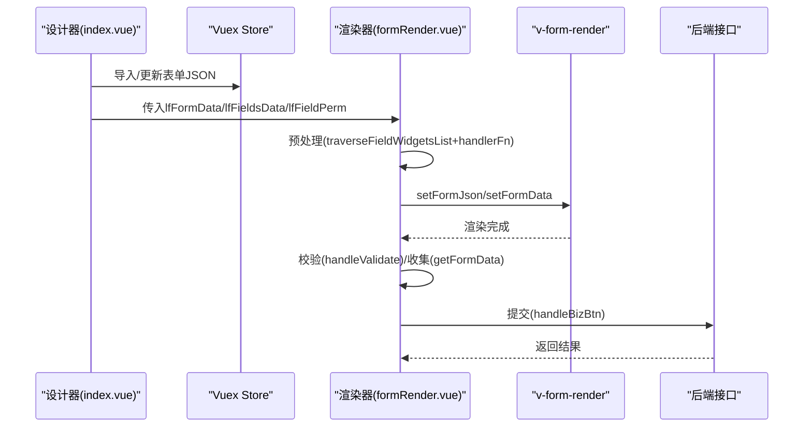
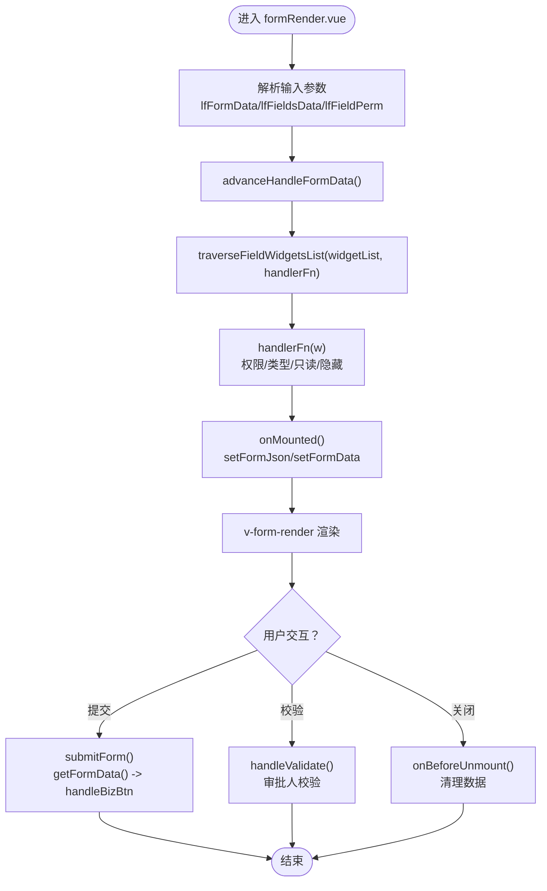
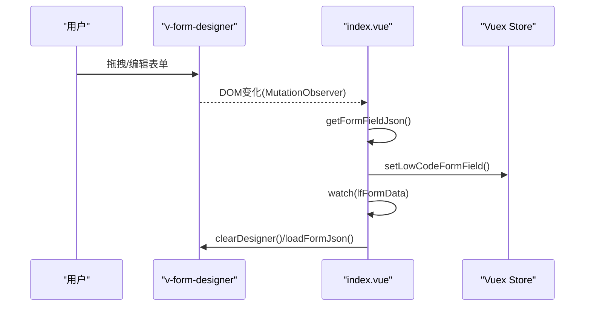
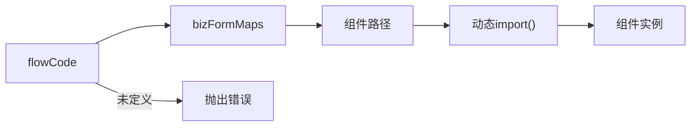
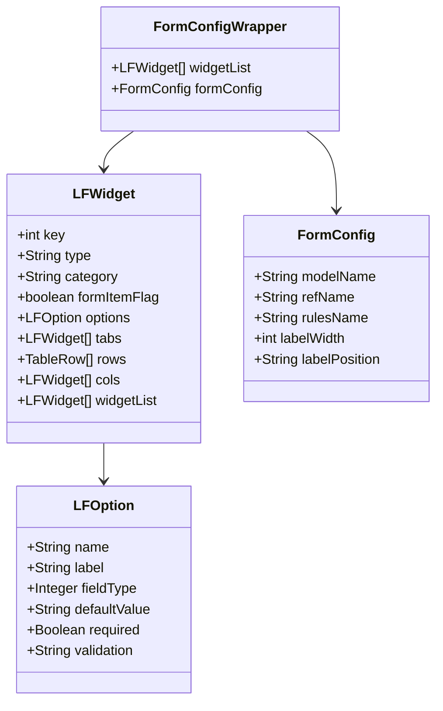
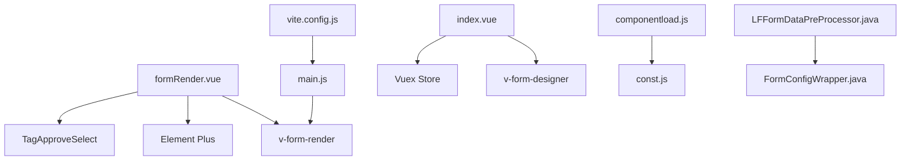

# 动态表单组件

<cite>
**本文引用的文件**
- [formRender.vue](file://antflow-vue/src/components/Workflow/DynamicForm/formRender.vue)
- [index.vue](file://antflow-vue/src/components/Workflow/DynamicForm/index.vue)
- [componentload.js](file://antflow-vue/src/views/workflow/components/componentload.js)
- [const.js](file://antflow-vue/src/utils/antflow/const.js)
- [main.js](file://antflow-vue/src/main.js)
- [FormConfigWrapper.java](file://antflow-base/src/main/java/org/openoa/base/vo/FormConfigWrapper.java)
- [LFFormDataPreProcessor.java](file://antflow-engine/src/main/java/org/openoa/engine/lowflow/service/LFFormDataPreProcessor.java)
- [FormPropertyImpl.java](file://antflow-base/src/main/java/org/activiti/engine/impl/form/FormPropertyImpl.java)
- [FormProperty.java](file://antflow-base/src/main/java/org/activiti/bpmn/model/FormProperty.java)
- [FormInterface.js](file://antflow-vue/src/components/Workflow/config/FormInterface.js)
- [FormInterface.js（drawer）](file://antflow-vue/src/components/Workflow/drawer/permConfig/FormInterface.js)
- [vite.config.js](file://antflow-vue/vite.config.js)
</cite>

## 目录
1. [简介](#简介)
2. [项目结构](#项目结构)
3. [核心组件](#核心组件)
4. [架构总览](#架构总览)
5. [详细组件分析](#详细组件分析)
6. [依赖关系分析](#依赖关系分析)
7. [性能考量](#性能考量)
8. [故障排查指南](#故障排查指南)
9. [结论](#结论)
10. [附录](#附录)

## 简介
本文件面向开发者，系统化阐述动态表单组件的实现与使用，重点覆盖以下方面：
- 动态表单渲染器 formRender 的实现机制：字段动态生成、数据绑定、权限与验证规则应用。
- 表单组件 index.vue 的整体架构：表单容器、字段管理、布局控制。
- 低代码表单的数据流处理、字段类型映射、表单状态管理。
- 字段配置示例：文本框、选择器、日期组件等常用类型。
- 自定义扩展方法：如何基于现有组件体系扩展新的字段类型与交互。

## 项目结构
动态表单相关代码主要分布在前端 antflow-vue 与后端 antflow-base/antflow-engine 中，形成“设计器—渲染器—引擎”的闭环：
- 前端设计器与渲染器：index.vue（设计器）、formRender.vue（渲染器）、componentload.js（组件加载）、const.js（常量与映射）、main.js（全局注册）。
- 后端表单模型与预处理：FormConfigWrapper.java（表单JSON结构）、LFFormDataPreProcessor.java（字段抽取与预处理）、FormPropertyImpl.java 与 FormProperty.java（传统Activiti表单属性模型）。
- 构建与打包：vite.config.js（vForm库单独打包策略）。

图表来源
- [index.vue:1-106](file://antflow-vue/src/components/Workflow/DynamicForm/index.vue#L1-L106)
- [formRender.vue:1-258](file://antflow-vue/src/components/Workflow/DynamicForm/formRender.vue#L1-L258)
- [componentload.js:1-34](file://antflow-vue/src/views/workflow/components/componentload.js#L1-L34)
- [const.js:1-359](file://antflow-vue/src/utils/antflow/const.js#L1-L359)
- [main.js:78-109](file://antflow-vue/src/main.js#L78-L109)
- [vite.config.js:29-70](file://antflow-vue/vite.config.js#L29-L70)
- [FormConfigWrapper.java:1-94](file://antflow-base/src/main/java/org/openoa/base/vo/FormConfigWrapper.java#L1-L94)
- [LFFormDataPreProcessor.java:79-144](file://antflow-engine/src/main/java/org/openoa/engine/lowflow/service/LFFormDataPreProcessor.java#L79-L144)
- [FormPropertyImpl.java:39-74](file://antflow-base/src/main/java/org/activiti/engine/impl/form/FormPropertyImpl.java#L39-L74)
- [FormProperty.java:41-120](file://antflow-base/src/main/java/org/activiti/bpmn/model/FormProperty.java#L41-L120)

章节来源
- [index.vue:1-106](file://antflow-vue/src/components/Workflow/DynamicForm/index.vue#L1-L106)
- [formRender.vue:1-258](file://antflow-vue/src/components/Workflow/DynamicForm/formRender.vue#L1-L258)
- [componentload.js:1-34](file://antflow-vue/src/views/workflow/components/componentload.js#L1-L34)
- [const.js:1-359](file://antflow-vue/src/utils/antflow/const.js#L1-L359)
- [main.js:78-109](file://antflow-vue/src/main.js#L78-L109)
- [vite.config.js:29-70](file://antflow-vue/vite.config.js#L29-L70)
- [FormConfigWrapper.java:1-94](file://antflow-base/src/main/java/org/openoa/base/vo/FormConfigWrapper.java#L1-L94)
- [LFFormDataPreProcessor.java:79-144](file://antflow-engine/src/main/java/org/openoa/engine/lowflow/service/LFFormDataPreProcessor.java#L79-L144)
- [FormPropertyImpl.java:39-74](file://antflow-base/src/main/java/org/activiti/engine/impl/form/FormPropertyImpl.java#L39-L74)
- [FormProperty.java:41-120](file://antflow-base/src/main/java/org/activiti/bpmn/model/FormProperty.java#L41-L120)

## 核心组件
- 表单渲染器 formRender.vue
  - 接收三个输入：lfFormData（表单定义JSON）、lfFieldsData（字段默认值）、lfFieldPerm（字段权限）。
  - 在挂载前对字段进行预处理（遍历widgetList，应用权限与类型转换），再通过 v-form-render 完成最终渲染。
  - 提供提交、校验、暴露数据等能力，支持“自选审批人”附加数据。
- 表单设计器 index.vue
  - 基于 v-form-designer 提供拖拽式表单设计，监听DOM变化同步store中的低代码表单字段配置。
  - 支持导入/导出表单JSON，便于前后端协作。
- 组件加载与映射 componentload.js
  - 提供 loadDIYComponent 与 loadLFComponent，分别用于按 flowCode 加载自定义表单组件或低代码表单渲染器。
  - 通过 const.js 中的 bizFormMaps 实现 flowCode 与组件路径的映射。
- 全局注册 main.js
  - 全局注册 v-form-render（来自 VForm3），确保渲染器可用。
- 常量与映射 const.js
  - 包含业务表单映射、条件节点字段类型映射、按钮配置等，支撑低代码表单与流程引擎的对接。

章节来源
- [formRender.vue:35-150](file://antflow-vue/src/components/Workflow/DynamicForm/formRender.vue#L35-L150)
- [index.vue:10-74](file://antflow-vue/src/components/Workflow/DynamicForm/index.vue#L10-L74)
- [componentload.js:1-34](file://antflow-vue/src/views/workflow/components/componentload.js#L1-L34)
- [const.js:172-180](file://antflow-vue/src/utils/antflow/const.js#L172-L180)
- [main.js:99-109](file://antflow-vue/src/main.js#L99-L109)

## 架构总览
动态表单从“设计—渲染—提交—持久化”的全链路如下：

图表来源
- [index.vue:33-48](file://antflow-vue/src/components/Workflow/DynamicForm/index.vue#L33-L48)
- [formRender.vue:63-168](file://antflow-vue/src/components/Workflow/DynamicForm/formRender.vue#L63-L168)
- [main.js:99-109](file://antflow-vue/src/main.js#L99-L109)

## 详细组件分析

### 表单渲染器 formRender.vue
- 输入与状态
  - 通过 props 接收 lfFormData、lfFieldsData、lfFieldPerm、showSubmit、isPreview。
  - reactive 化 formJson、formData、lfFieldPermData，并在 mounted 后调用 v-form-render 的 setFormJson/setFormData 完成渲染。
- 字段预处理
  - advanceHandleFormData：在存在默认值时，遍历 widgetList，调用 handlerFn 应用权限与类型转换。
  - handlerFn：统一处理字段的 disabled/readonly/hidden/format/valueFormat 等；支持数字类型转换；支持权限控制（R/E/H）；支持预览模式禁用。
  - traverseFieldWidgetsList：递归遍历 grid/table/tab/sub-form/container 等复杂布局。
- 事件与交互
  - submitForm：通过 v-form-render 的 getFormData 获取数据，触发父组件 handleBizBtn。
  - handleValidate：结合 hasChooseApprove 的审批人校验，返回Promise。
  - chooseApprovers：接收自选审批人数据并写入 formData。
- 生命周期与清理
  - onBeforeUnmount：清理 formJson、formData、lfFieldPermData，避免内存泄漏。

图表来源
- [formRender.vue:63-150](file://antflow-vue/src/components/Workflow/DynamicForm/formRender.vue#L63-L150)
- [formRender.vue:159-210](file://antflow-vue/src/components/Workflow/DynamicForm/formRender.vue#L159-L210)

章节来源
- [formRender.vue:35-150](file://antflow-vue/src/components/Workflow/DynamicForm/formRender.vue#L35-L150)
- [formRender.vue:159-210](file://antflow-vue/src/components/Workflow/DynamicForm/formRender.vue#L159-L210)

### 表单设计器 index.vue
- 设计器容器与观察者
  - 使用 v-form-designer 提供拖拽式表单设计。
  - 通过 MutationObserver 监听设计器DOM变化，将最新表单JSON写入 Vuex store。
- 数据导入与导出
  - watch 监听传入的 lfFormData，清空并加载设计器。
  - 提供 getData/getFieldList 暴露导出能力，便于后端持久化与前端调试。
- 样式与布局
  - 控制设计器容器尺寸与边距，保证在不同页面中的展示一致性。

图表来源
- [index.vue:25-48](file://antflow-vue/src/components/Workflow/DynamicForm/index.vue#L25-L48)
- [index.vue:39-44](file://antflow-vue/src/components/Workflow/DynamicForm/index.vue#L39-L44)

章节来源
- [index.vue:10-74](file://antflow-vue/src/components/Workflow/DynamicForm/index.vue#L10-L74)

### 组件加载与映射 componentload.js
- loadDIYComponent：根据 flowCode 从 bizFormMaps 中查找组件路径，动态 import 对应表单组件。
- loadLFComponent：返回低代码表单渲染器 formRender。
- 与 const.js 的 bizFormMaps 协同，实现业务表单与 flowCode 的解耦映射。

图表来源
- [componentload.js:8-25](file://antflow-vue/src/views/workflow/components/componentload.js#L8-L25)
- [const.js:174-180](file://antflow-vue/src/utils/antflow/const.js#L174-L180)

章节来源
- [componentload.js:1-34](file://antflow-vue/src/views/workflow/components/componentload.js#L1-L34)
- [const.js:172-180](file://antflow-vue/src/utils/antflow/const.js#L172-L180)

### 全局注册 main.js
- 全局注册 VForm3，使 v-form-render 可在任意组件中使用。
- 设置 Element Plus 的全局尺寸，提升一致性。

章节来源
- [main.js:99-109](file://antflow-vue/src/main.js#L99-L109)

### 字段类型映射与后端模型
- 前端字段类型映射（const.js）
  - 条件节点字段类型映射：input/input-number/select/checkbox/radio/switch/time/date-range/date 等与后端约定的列类型、字段类型、值类型映射。
- 后端表单模型（FormConfigWrapper.java）
  - widgetList：包含字段定义与布局信息。
  - options：字段选项（name/label/type/fieldType/defaultValue/required/validation 等）。
- 字段预处理（LFFormDataPreProcessor.java）
  - 递归遍历 widgetList，提取非容器字段，生成字段元数据（fieldId/fieldName/fieldType）。
  - 支持 card/tab/grid/table 等容器类型的子字段抽取。

图表来源
- [FormConfigWrapper.java:10-82](file://antflow-base/src/main/java/org/openoa/base/vo/FormConfigWrapper.java#L10-L82)

章节来源
- [const.js:208-252](file://antflow-vue/src/utils/antflow/const.js#L208-L252)
- [FormConfigWrapper.java:1-94](file://antflow-base/src/main/java/org/openoa/base/vo/FormConfigWrapper.java#L1-L94)
- [LFFormDataPreProcessor.java:83-138](file://antflow-engine/src/main/java/org/openoa/engine/lowflow/service/LFFormDataPreProcessor.java#L83-L138)

### 表单状态管理与字段接口
- 表单状态管理
  - index.vue 通过 Vuex store 持久化低代码表单字段配置，便于跨页面共享。
- 字段接口（FormInterface.js）
  - 提供 showFields/hideFields/disableFields/enableFields 等占位接口，便于后续扩展字段级别的可见性与可编辑性控制。

章节来源
- [index.vue:25-31](file://antflow-vue/src/components/Workflow/DynamicForm/index.vue#L25-L31)
- [FormInterface.js:49-84](file://antflow-vue/src/components/Workflow/config/FormInterface.js#L49-L84)
- [FormInterface.js（drawer）:49-84](file://antflow-vue/src/components/Workflow/drawer/permConfig/FormInterface.js#L49-L84)

### 传统表单属性模型（兼容参考）
- FormPropertyImpl/FormProperty
  - 传统Activiti表单属性模型，包含 id/name/type/value/required/readable/writable 等，用于流程引擎的表单渲染与校验。
  - 与低代码表单（LF）模型互补，便于在混合场景下迁移与兼容。

章节来源
- [FormPropertyImpl.java:39-74](file://antflow-base/src/main/java/org/activiti/engine/impl/form/FormPropertyImpl.java#L39-L74)
- [FormProperty.java:41-120](file://antflow-base/src/main/java/org/activiti/bpmn/model/FormProperty.java#L41-L120)

## 依赖关系分析
- 前端依赖
  - formRender.vue 依赖 v-form-render（main.js 注册）、Element Plus、TagApproveSelect。
  - index.vue 依赖 v-form-designer，通过 MutationObserver 与 Vuex store 交互。
  - componentload.js 依赖 const.js 的 bizFormMaps。
- 构建依赖
  - vite.config.js 将 lib/vForm 单独打包，避免重复与体积膨胀。
- 后端依赖
  - LFFormDataPreProcessor 依赖 FormConfigWrapper 抽取字段元数据，支撑低代码表单的字段清单与类型管理。

图表来源
- [formRender.vue:1-20](file://antflow-vue/src/components/Workflow/DynamicForm/formRender.vue#L1-L20)
- [index.vue:1-8](file://antflow-vue/src/components/Workflow/DynamicForm/index.vue#L1-L8)
- [componentload.js:1-34](file://antflow-vue/src/views/workflow/components/componentload.js#L1-L34)
- [main.js:99-109](file://antflow-vue/src/main.js#L99-L109)
- [vite.config.js:29-70](file://antflow-vue/vite.config.js#L29-L70)
- [LFFormDataPreProcessor.java:79-144](file://antflow-engine/src/main/java/org/openoa/engine/lowflow/service/LFFormDataPreProcessor.java#L79-L144)
- [FormConfigWrapper.java:1-94](file://antflow-base/src/main/java/org/openoa/base/vo/FormConfigWrapper.java#L1-L94)

章节来源
- [formRender.vue:1-20](file://antflow-vue/src/components/Workflow/DynamicForm/formRender.vue#L1-L20)
- [index.vue:1-8](file://antflow-vue/src/components/Workflow/DynamicForm/index.vue#L1-L8)
- [componentload.js:1-34](file://antflow-vue/src/views/workflow/components/componentload.js#L1-L34)
- [main.js:99-109](file://antflow-vue/src/main.js#L99-L109)
- [vite.config.js:29-70](file://antflow-vue/vite.config.js#L29-L70)
- [LFFormDataPreProcessor.java:79-144](file://antflow-engine/src/main/java/org/openoa/engine/lowflow/service/LFFormDataPreProcessor.java#L79-L144)
- [FormConfigWrapper.java:1-94](file://antflow-base/src/main/java/org/openoa/base/vo/FormConfigWrapper.java#L1-L94)

## 性能考量
- vForm 库打包优化
  - vite.config.js 将 lib/vForm 单独拆包，减少重复打包与缓存失效影响。
- 渲染与数据绑定
  - formRender.vue 在 onBeforeMount 阶段完成字段预处理，避免渲染阶段重复计算。
  - 使用 reactive/nextTick 确保 setFormJson/setFormData 的时机正确。
- DOM 观察与状态同步
  - index.vue 的 MutationObserver 仅在必要时触发 store 更新，避免频繁写入。

章节来源
- [vite.config.js:29-70](file://antflow-vue/vite.config.js#L29-L70)
- [formRender.vue:139-150](file://antflow-vue/src/components/Workflow/DynamicForm/formRender.vue#L139-L150)
- [index.vue:25-31](file://antflow-vue/src/components/Workflow/DynamicForm/index.vue#L25-L31)

## 故障排查指南
- 提交按钮不可用
  - 检查 props.showSubmit 是否为 true；确认 isPreview 与权限控制逻辑未将按钮置为 disabled。
- 字段权限不生效
  - 确认 lfFieldPerm 的结构与字段名匹配（options.name）；检查 handlerFn 的权限分支逻辑。
- 数字字段类型异常
  - 确认 number/select/radio 类型且非 multiple 时，formData 对应字段会被转换为 Number。
- 自选审批人必填校验
  - handleValidate 会在 hasChooseApprove 为 true 时校验 approversValid，若为 false 则提示“请选择自选审批人”。

章节来源
- [formRender.vue:78-108](file://antflow-vue/src/components/Workflow/DynamicForm/formRender.vue#L78-L108)
- [formRender.vue:169-190](file://antflow-vue/src/components/Workflow/DynamicForm/formRender.vue#L169-L190)

## 结论
动态表单组件通过“设计器—渲染器—引擎”的协同，实现了低代码表单的可视化设计、灵活渲染与稳定落地。开发者可基于现有组件体系快速扩展字段类型、权限控制与交互行为，同时依托后端模型与映射机制，确保前后端数据一致性与可维护性。

## 附录

### 字段类型与配置要点（示例说明）
- 文本框（input）
  - 关键选项：name/label/type/defaultValue/placeholder/required/validation。
  - 建议：为必填字段配置 validation 与 validationHint，提升用户体验。
- 选择器（select）
  - 关键选项：name/label/options/required/multiple。
  - 建议：多选时注意值类型为数组；后端需支持数组解析。
- 单选/多选（radio/checkbox）
  - 关键选项：name/label/options/required。
  - 建议：radio 默认值为数值或字符串，需与后端枚举保持一致。
- 日期组件（date/date-range/time/time-range）
  - 关键选项：name/label/format/valueFormat/required。
  - 建议：format 与 valueFormat 保持一致，避免解析偏差。
- 布局容器（grid/table/tab/sub-form/container）
  - 关键点：traverseFieldWidgetsList 会递归处理这些容器内的字段，确保权限与类型转换覆盖到子字段。

章节来源
- [FormConfigWrapper.java:29-67](file://antflow-base/src/main/java/org/openoa/base/vo/FormConfigWrapper.java#L29-L67)
- [formRender.vue:111-138](file://antflow-vue/src/components/Workflow/DynamicForm/formRender.vue#L111-L138)
- [const.js:208-252](file://antflow-vue/src/utils/antflow/const.js#L208-L252)