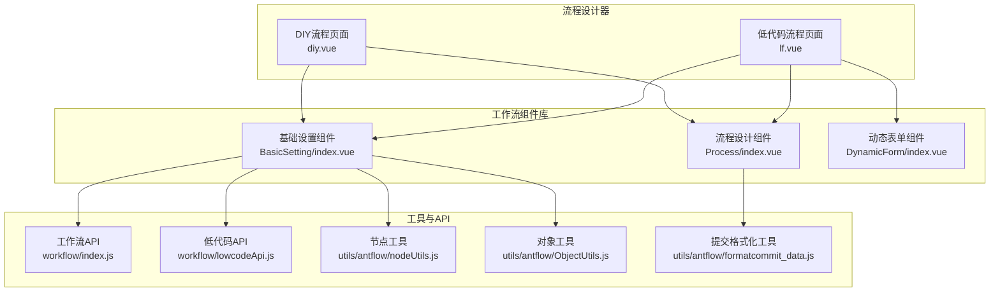
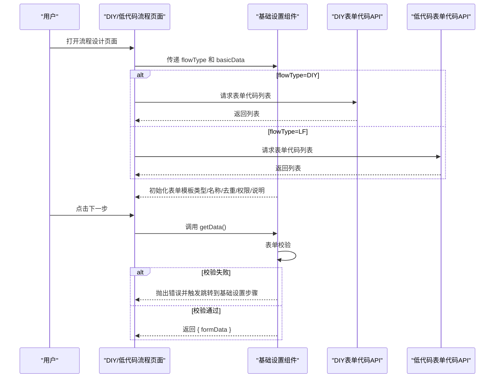
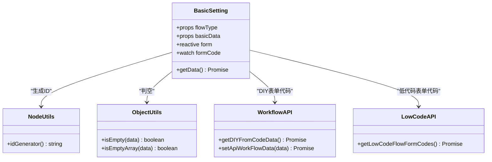

# 基础设置组件

<cite>
**本文引用的文件**
- [BasicSetting/index.vue](file://antflow-vue/src/components/Workflow/BasicSetting/index.vue)
- [workflow/index.js](file://antflow-vue/src/api/workflow/index.js)
- [workflow/lowcodeApi.js](file://antflow-vue/src/api/workflow/lowcodeApi.js)
- [utils/antflow/nodeUtils.js](file://antflow-vue/src/utils/antflow/nodeUtils.js)
- [utils/antflow/ObjectUtils.js](file://antflow-vue/src/utils/antflow/ObjectUtils.js)
- [views/workflow/flowDesign/diy.vue](file://antflow-vue/src/views/workflow/flowDesign/diy.vue)
- [views/workflow/flowDesign/lf.vue](file://antflow-vue/src/views/workflow/flowDesign/lf.vue)
- [utils/antflow/formatcommit_data.js](file://antflow-vue/src/utils/antflow/formatcommit_data.js)
</cite>

## 目录
1. [简介](#简介)
2. [项目结构](#项目结构)
3. [核心组件](#核心组件)
4. [架构总览](#架构总览)
5. [详细组件分析](#详细组件分析)
6. [依赖分析](#依赖分析)
7. [性能考虑](#性能考虑)
8. [故障排查指南](#故障排查指南)
9. [结论](#结论)
10. [附录](#附录)

## 简介
基础设置组件负责在流程设计阶段完成流程的基础信息配置，包括流程模板类型（DIY/低代码）、流程名称、去重类型、发起人权限、流程说明等。组件通过表单校验确保必填项正确，并将表单数据以统一格式暴露给上层流程设计器，供发布流程时合并提交。

## 项目结构
基础设置组件位于前端工程 antflow-vue 的工作流组件库中，与流程设计器页面（DIY/低代码）配合使用，形成“基础设置 → 表单设计（低代码）→ 流程设计”的三步式流程。

图表来源
- [diy.vue:30-35](file://antflow-vue/src/views/workflow/flowDesign/diy.vue#L30-L35)
- [lf.vue:30-38](file://antflow-vue/src/views/workflow/flowDesign/lf.vue#L30-L38)
- [index.vue:76-95](file://antflow-vue/src/components/Workflow/BasicSetting/index.vue#L76-L95)
- [index.js:28-30](file://antflow-vue/src/api/workflow/index.js#L28-L30)
- [lowcodeApi.js:22-24](file://antflow-vue/src/api/workflow/lowcodeApi.js#L22-L24)
- [nodeUtils.js:179-234](file://antflow-vue/src/utils/antflow/nodeUtils.js#L179-L234)
- [ObjectUtils.js:4-22](file://antflow-vue/src/utils/antflow/ObjectUtils.js#L4-L22)
- [formatcommit_data.js:8-14](file://antflow-vue/src/utils/antflow/formatcommit_data.js#L8-L14)

章节来源
- [diy.vue:1-185](file://antflow-vue/src/views/workflow/flowDesign/diy.vue#L1-L185)
- [lf.vue:1-194](file://antflow-vue/src/views/workflow/flowDesign/lf.vue#L1-L194)
- [index.vue:1-233](file://antflow-vue/src/components/Workflow/BasicSetting/index.vue#L1-L233)

## 核心组件
- 组件职责
  - 表单字段：模板类型（只读/可选）、流程名称（只读/可选）、去重类型、发起人权限、流程说明。
  - 数据来源：根据 flowType 加载 DIY 或低代码表单代码列表；根据路由参数或传入 basicData 初始化表单。
  - 校验策略：对模板类型、流程名称、流程编号进行必填校验；通过表单 ref 触发表单校验。
  - 数据暴露：提供 getData 方法，返回 Promise，内部执行表单校验并通过后返回包含表单数据的对象。
  - 状态同步：监听模板类型变化，自动填充流程名称；根据复制模式切换表单项的可编辑性与提示。

章节来源
- [index.vue:21-71](file://antflow-vue/src/components/Workflow/BasicSetting/index.vue#L21-L71)
- [index.vue:121-153](file://antflow-vue/src/components/Workflow/BasicSetting/index.vue#L121-L153)
- [index.vue:135-144](file://antflow-vue/src/components/Workflow/BasicSetting/index.vue#L135-L144)
- [index.vue:187-203](file://antflow-vue/src/components/Workflow/BasicSetting/index.vue#L187-L203)
- [index.vue:206-220](file://antflow-vue/src/components/Workflow/BasicSetting/index.vue#L206-L220)

## 架构总览
基础设置组件在不同流程类型中的调用链路如下：

图表来源
- [diy.vue:30-35](file://antflow-vue/src/views/workflow/flowDesign/diy.vue#L30-L35)
- [lf.vue:30-38](file://antflow-vue/src/views/workflow/flowDesign/lf.vue#L30-L38)
- [index.vue:76-95](file://antflow-vue/src/components/Workflow/BasicSetting/index.vue#L76-L95)
- [index.js:28-30](file://antflow-vue/src/api/workflow/index.js#L28-L30)
- [lowcodeApi.js:22-24](file://antflow-vue/src/api/workflow/lowcodeApi.js#L22-L24)
- [index.vue:206-220](file://antflow-vue/src/components/Workflow/BasicSetting/index.vue#L206-L220)

## 详细组件分析

### 表单字段与交互
- 模板类型（formCode）
  - 非复制模式：只读显示，不可编辑。
  - 复制模式：可从下拉列表选择，列表来源于对应 API。
- 流程名称（bpmnName）
  - 非复制模式：只读显示，不可编辑。
  - 复制模式：显示提示说明，输入框只读，实际值由模板类型联动填充。
- 去重类型（deduplicationType）
  - 下拉选择：不去重、前去重、后去重、相邻节点去重。
- 发起人权限（viewPageButtons.viewPageStart）
  - 复选框组：支持“撤回”“作废”等按钮权限勾选。
- 流程说明（remark）
  - 文本域，限制长度，支持字数统计。

章节来源
- [index.vue:21-71](file://antflow-vue/src/components/Workflow/BasicSetting/index.vue#L21-L71)
- [index.vue:99-119](file://antflow-vue/src/components/Workflow/BasicSetting/index.vue#L99-L119)

### 数据绑定与状态同步
- 响应式数据
  - 使用 reactive 定义 form 结构，包含 bpmnName、bpmnCode、formCode、remark、deduplicationType、viewPageButtons 等。
- 初始化逻辑
  - 若传入 basicData 且存在 formCode，则优先使用 basicData 中的值初始化表单。
  - 否则使用路由参数 fc、fcname 初始化表单。
  - 根据 flowType 决定加载 DIY 或低代码表单代码列表。
- watch 监听
  - 监听 formCode，当值变化时，遍历 formCodeOptions 匹配 label 并填充 bpmnName。
- ID 生成
  - 使用 NodeUtils.idGenerator 生成唯一 bpmnCode。

章节来源
- [index.vue:122-153](file://antflow-vue/src/components/Workflow/BasicSetting/index.vue#L122-L153)
- [index.vue:159-185](file://antflow-vue/src/components/Workflow/BasicSetting/index.vue#L159-L185)
- [nodeUtils.js:8-22](file://antflow-vue/src/utils/antflow/nodeUtils.js#L8-L22)

### 表单验证机制
- 规则定义
  - formCode：必填，blur 触发。
  - bpmnName：必填，change 触发。
  - bpmnCode：必填，blur 触发。
- 校验执行
  - 通过 ref 调用 validate，若失败则发出 nextChange 事件并拒绝 Promise。
  - 成功时将 effectiveStatus 转换为数值后返回 formData。

章节来源
- [index.vue:187-203](file://antflow-vue/src/components/Workflow/BasicSetting/index.vue#L187-L203)
- [index.vue:206-217](file://antflow-vue/src/components/Workflow/BasicSetting/index.vue#L206-L217)

### 不同流程类型的配置差异
- DIY 流程
  - 通过 getDIYFromCodeData 获取表单代码列表。
  - 发布时直接提交基础设置数据与流程节点数据。
- 低代码流程
  - 通过 getLowCodeFlowFormCodes 获取表单代码列表。
  - 发布时先获取动态表单数据，再合并基础设置与节点数据提交。

章节来源
- [index.js:28-30](file://antflow-vue/src/api/workflow/index.js#L28-L30)
- [lowcodeApi.js:22-24](file://antflow-vue/src/api/workflow/lowcodeApi.js#L22-L24)
- [diy.vue:94-125](file://antflow-vue/src/views/workflow/flowDesign/diy.vue#L94-L125)
- [lf.vue:99-134](file://antflow-vue/src/views/workflow/flowDesign/lf.vue#L99-L134)

### 发起人权限配置
- viewPageButtons.viewPageStart 为复选框组，支持勾选“撤回”“作废”等按钮权限。
- 组件内部定义了 viewPageButtons 选项集合，用于渲染复选框。

章节来源
- [index.vue:60-67](file://antflow-vue/src/components/Workflow/BasicSetting/index.vue#L60-L67)
- [index.vue:113-119](file://antflow-vue/src/components/Workflow/BasicSetting/index.vue#L113-L119)

### 流程名称生成与去重类型设置
- 流程名称生成
  - 复制模式下，选择模板类型后自动填充流程名称。
- 去重类型
  - 支持四种去重策略，用于控制审批人去重行为。

章节来源
- [index.vue:135-144](file://antflow-vue/src/components/Workflow/BasicSetting/index.vue#L135-L144)
- [index.vue:49-55](file://antflow-vue/src/components/Workflow/BasicSetting/index.vue#L49-L55)
- [index.vue:99-111](file://antflow-vue/src/components/Workflow/BasicSetting/index.vue#L99-L111)

### 复制操作处理
- 复制模式通过路由参数 copy 控制，影响表单项的可编辑性与提示文案。
- 复制模式下，模板类型与流程名称采用只读展示，实际值由模板类型联动填充。

章节来源
- [index.vue:85-95](file://antflow-vue/src/components/Workflow/BasicSetting/index.vue#L85-L95)
- [index.vue:21-48](file://antflow-vue/src/components/Workflow/BasicSetting/index.vue#L21-L48)

### 数据提交与格式化
- 上层页面通过 Promise.all 并行获取各步骤数据，然后合并提交。
- 流程节点数据通过 formatcommit_data.js 进行扁平化、关系整理与适配。

章节来源
- [diy.vue:94-125](file://antflow-vue/src/views/workflow/flowDesign/diy.vue#L94-L125)
- [lf.vue:99-134](file://antflow-vue/src/views/workflow/flowDesign/lf.vue#L99-L134)
- [formatcommit_data.js:8-14](file://antflow-vue/src/utils/antflow/formatcommit_data.js#L8-L14)

## 依赖分析
- 组件依赖
  - Element Plus 表单组件与校验。
  - NodeUtils：ID 生成。
  - ObjectUtils：判空工具。
  - 工作流 API：DIY/低代码表单代码列表。
- 上层依赖
  - DIY/低代码流程页面通过 ref 调用 getData，合并其他步骤数据后统一提交。

图表来源
- [index.vue:76-95](file://antflow-vue/src/components/Workflow/BasicSetting/index.vue#L76-L95)
- [nodeUtils.js:8-22](file://antflow-vue/src/utils/antflow/nodeUtils.js#L8-L22)
- [ObjectUtils.js:4-22](file://antflow-vue/src/utils/antflow/ObjectUtils.js#L4-L22)
- [index.js:28-30](file://antflow-vue/src/api/workflow/index.js#L28-L30)
- [lowcodeApi.js:22-24](file://antflow-vue/src/api/workflow/lowcodeApi.js#L22-L24)

章节来源
- [index.vue:76-95](file://antflow-vue/src/components/Workflow/BasicSetting/index.vue#L76-L95)
- [index.js:28-30](file://antflow-vue/src/api/workflow/index.js#L28-L30)
- [lowcodeApi.js:22-24](file://antflow-vue/src/api/workflow/lowcodeApi.js#L22-L24)
- [nodeUtils.js:8-22](file://antflow-vue/src/utils/antflow/nodeUtils.js#L8-L22)
- [ObjectUtils.js:4-22](file://antflow-vue/src/utils/antflow/ObjectUtils.js#L4-L22)

## 性能考虑
- 表单代码列表加载
  - 仅在首次进入页面时按 flowType 加载一次，避免重复请求。
- 表单校验
  - 使用 Element Plus 内置校验，按需触发（blur/change），减少不必要的校验开销。
- 数据合并
  - 上层通过 Promise.all 并行获取各步骤数据，缩短整体等待时间。

## 故障排查指南
- 表单校验失败
  - 现象：点击下一步时停留在基础设置步骤并提示必填项。
  - 排查：检查 formCode、bpmnName、bpmnCode 是否填写；确认 nextChange 事件是否被正确触发。
- 模板类型下拉为空
  - 现象：复制模式下模板类型无法选择。
  - 排查：确认 flowType 是否为 DIY/LF；检查对应 API 是否返回数据。
- 流程名称未自动填充
  - 现象：复制模式下流程名称未随模板类型变化。
  - 排查：确认 formCodeOptions 是否已加载；检查 watch 监听逻辑是否执行。
- 发布失败
  - 现象：提交后返回错误。
  - 排查：确认 getData 返回的 formData 是否包含必要字段；检查 setApiWorkFlowData 的返回状态。

章节来源
- [index.vue:187-217](file://antflow-vue/src/components/Workflow/BasicSetting/index.vue#L187-L217)
- [index.js:28-30](file://antflow-vue/src/api/workflow/index.js#L28-L30)
- [lowcodeApi.js:22-24](file://antflow-vue/src/api/workflow/lowcodeApi.js#L22-L24)
- [diy.vue:94-125](file://antflow-vue/src/views/workflow/flowDesign/diy.vue#L94-L125)
- [lf.vue:99-134](file://antflow-vue/src/views/workflow/flowDesign/lf.vue#L99-L134)

## 结论
基础设置组件通过清晰的表单结构、完善的校验机制与灵活的流程类型适配，为流程设计提供了稳定的基础配置能力。结合上层流程设计器的步骤编排与数据合并策略，能够高效完成从模板选择到流程发布的全流程配置。

## 附录

### 使用示例与最佳实践
- DIY 流程
  - 在 diy.vue 中通过 BasicSetting 组件加载 DIY 表单代码列表，完成后直接进入流程设计。
  - 发布时仅合并基础设置与节点数据。
- 低代码流程
  - 在 lf.vue 中先加载低代码表单代码列表，再进入表单设计与流程设计。
  - 发布时合并基础设置、动态表单与节点数据。
- 最佳实践
  - 复制流程时开启复制模式，利用模板类型联动自动填充流程名称。
  - 合理设置去重类型，避免重复审批人导致的流程阻塞。
  - 为流程说明添加必要的背景信息与注意事项，提升使用者体验。

章节来源
- [diy.vue:30-35](file://antflow-vue/src/views/workflow/flowDesign/diy.vue#L30-L35)
- [lf.vue:30-38](file://antflow-vue/src/views/workflow/flowDesign/lf.vue#L30-L38)
- [index.vue:21-71](file://antflow-vue/src/components/Workflow/BasicSetting/index.vue#L21-L71)