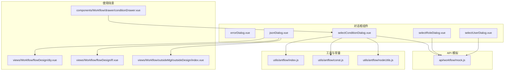
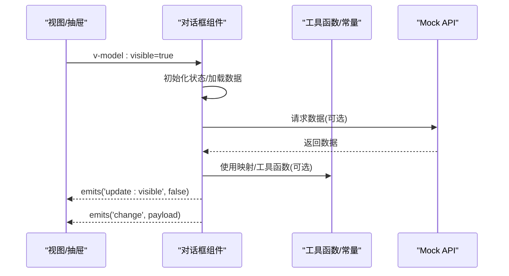
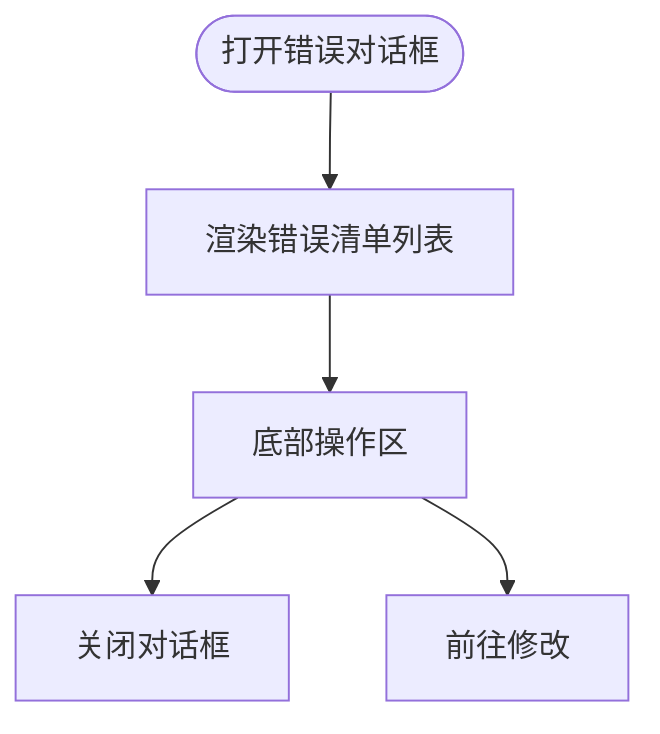
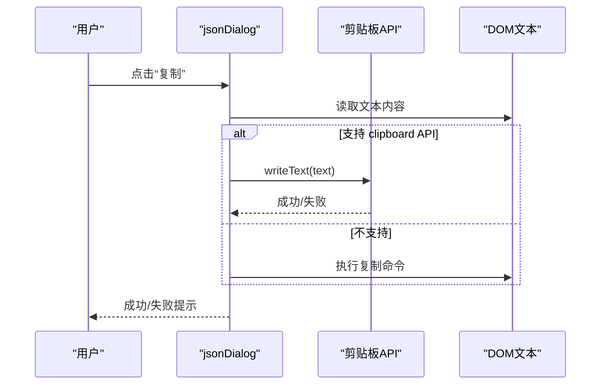
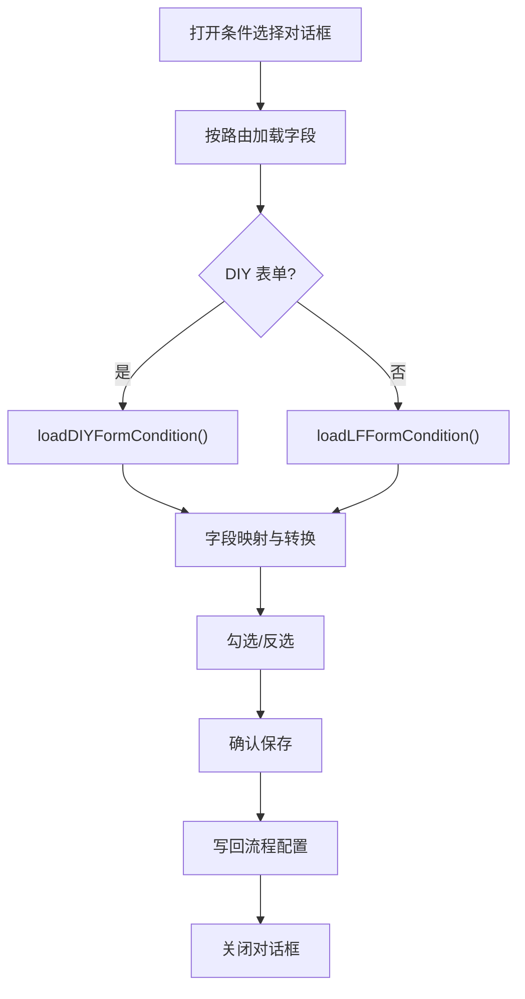
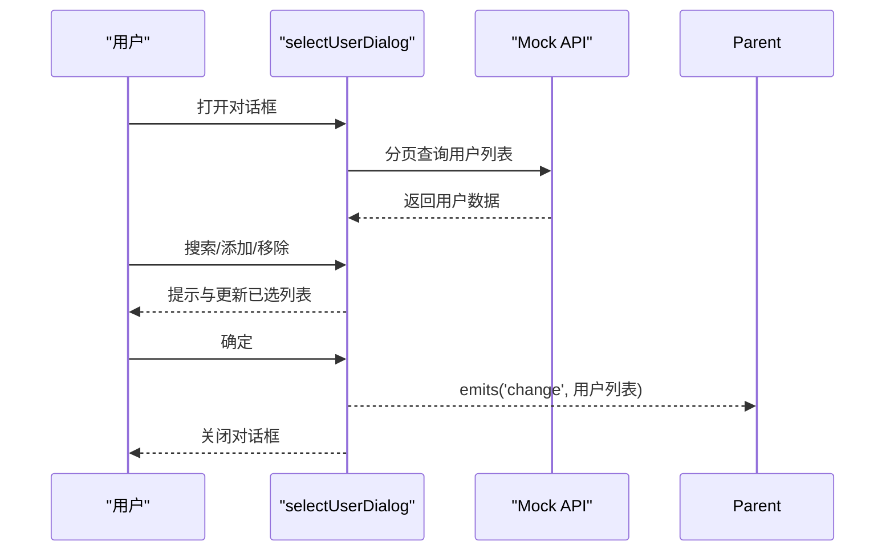
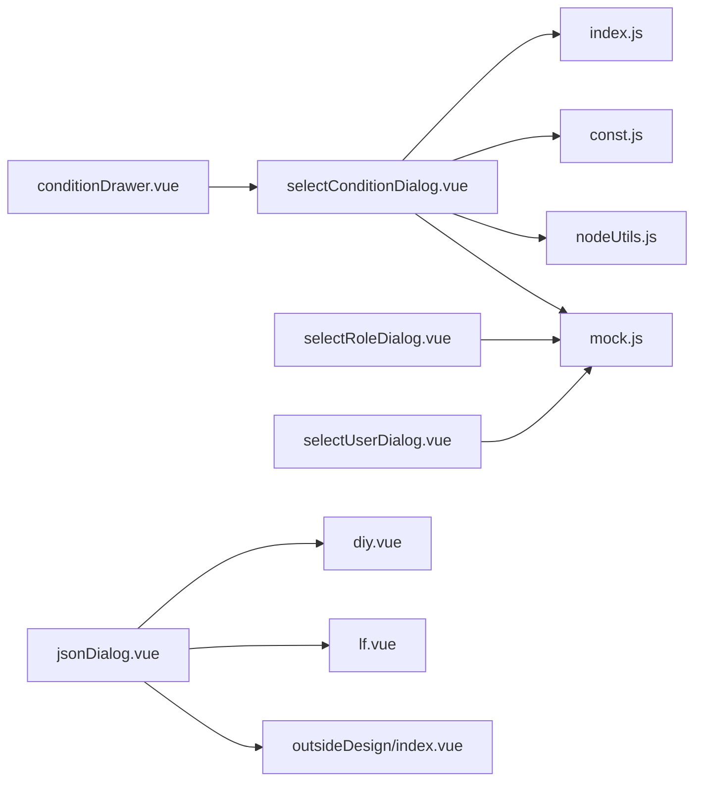

# 对话框组件

<cite>
**本文引用的文件**
- [errorDialog.vue](file://antflow-vue/src/components/Workflow/dialog/errorDialog.vue)
- [jsonDialog.vue](file://antflow-vue/src/components/Workflow/dialog/jsonDialog.vue)
- [selectConditionDialog.vue](file://antflow-vue/src/components/Workflow/dialog/selectConditionDialog.vue)
- [selectRoleDialog.vue](file://antflow-vue/src/components/Workflow/dialog/selectRoleDialog.vue)
- [selectUserDialog.vue](file://antflow-vue/src/components/Workflow/dialog/selectUserDialog.vue)
- [index.js](file://antflow-vue/src/utils/antflow/index.js)
- [const.js](file://antflow-vue/src/utils/antflow/const.js)
- [nodeUtils.js](file://antflow-vue/src/utils/antflow/nodeUtils.js)
- [mock.js](file://antflow-vue/src/api/workflow/mock.js)
- [conditionDrawer.vue](file://antflow-vue/src/components/Workflow/drawer/conditionDrawer.vue)
- [diy.vue](file://antflow-vue/src/views/Workflow/flowDesign/diy.vue)
- [lf.vue](file://antflow-vue/src/views/Workflow/flowDesign/lf.vue)
- [outsideDesign/index.vue](file://antflow-vue/src/views/Workflow/outsideMgt/outsideDesign/index.vue)
</cite>

## 目录
1. [简介](#简介)
2. [项目结构](#项目结构)
3. [核心组件](#核心组件)
4. [架构总览](#架构总览)
5. [详细组件分析](#详细组件分析)
6. [依赖分析](#依赖分析)
7. [性能考虑](#性能考虑)
8. [故障排查指南](#故障排查指南)
9. [结论](#结论)
10. [附录](#附录)

## 简介
本文件面向开发者，系统性梳理并解读工作流前端工程中的对话框组件体系，重点覆盖以下五个组件：
- 错误对话框(errorDialog)：用于展示流程发布/配置中的错误清单，引导用户前往修改。
- JSON对话框(jsonDialog)：用于查看与复制流程/节点配置的JSON结构。
- 条件选择对话框(selectConditionDialog)：用于在流程设计器中选择条件字段，构建条件分支。
- 角色选择对话框(selectRoleDialog)：用于在审批/通知等场景选择角色，并进行权限判断与筛选。
- 用户选择对话框(selectUserDialog)：用于在审批/通知等场景选择用户，支持分页与搜索。

文档将从架构、数据流、处理逻辑、交互与错误处理等方面进行深入分析，并提供使用示例与自定义配置建议，帮助开发者快速理解与扩展弹窗交互的设计与实现。

## 项目结构
对话框组件集中位于 antflow-vue 工程的 Workflow/dialog 目录，配套工具函数与常量位于 utils/antflow，API 模拟数据位于 api/workflow/mock.js。部分组件在设计器与视图层中被调用，如 diy.vue、lf.vue、outsideDesign/index.vue 中对 jsonDialog 的使用；条件选择对话框在 conditionDrawer.vue 中被引用。

**图表来源**
- [errorDialog.vue:1-81](file://antflow-vue/src/components/Workflow/dialog/errorDialog.vue#L1-L81)
- [jsonDialog.vue:1-70](file://antflow-vue/src/components/Workflow/dialog/jsonDialog.vue#L1-L70)
- [selectConditionDialog.vue:1-190](file://antflow-vue/src/components/Workflow/dialog/selectConditionDialog.vue#L1-L190)
- [selectRoleDialog.vue:1-174](file://antflow-vue/src/components/Workflow/dialog/selectRoleDialog.vue#L1-L174)
- [selectUserDialog.vue:1-203](file://antflow-vue/src/components/Workflow/dialog/selectUserDialog.vue#L1-L203)
- [index.js:1-279](file://antflow-vue/src/utils/antflow/index.js#L1-L279)
- [const.js:1-359](file://antflow-vue/src/utils/antflow/const.js#L1-L359)
- [nodeUtils.js:1-412](file://antflow-vue/src/utils/antflow/nodeUtils.js#L1-L412)
- [mock.js:1-155](file://antflow-vue/src/api/workflow/mock.js#L1-L155)
- [diy.vue:35-35](file://antflow-vue/src/views/Workflow/flowDesign/diy.vue#L35-L35)
- [lf.vue:38-38](file://antflow-vue/src/views/Workflow/flowDesign/lf.vue#L38-L38)
- [outsideDesign/index.vue:39-39](file://antflow-vue/src/views/Workflow/outsideMgt/outsideDesign/index.vue#L39-L39)
- [conditionDrawer.vue:202-202](file://antflow-vue/src/components/Workflow/drawer/conditionDrawer.vue#L202-L202)

**章节来源**
- [errorDialog.vue:1-81](file://antflow-vue/src/components/Workflow/dialog/errorDialog.vue#L1-L81)
- [jsonDialog.vue:1-70](file://antflow-vue/src/components/Workflow/dialog/jsonDialog.vue#L1-L70)
- [selectConditionDialog.vue:1-190](file://antflow-vue/src/components/Workflow/dialog/selectConditionDialog.vue#L1-L190)
- [selectRoleDialog.vue:1-174](file://antflow-vue/src/components/Workflow/dialog/selectRoleDialog.vue#L1-L174)
- [selectUserDialog.vue:1-203](file://antflow-vue/src/components/Workflow/dialog/selectUserDialog.vue#L1-L203)

## 核心组件
本节概述五个对话框组件的核心职责与公共特性：
- 错误对话框(errorDialog)：接收错误清单列表与可见性状态，展示“当前无法发布”等提示，并提供“我知道了/前往修改”两类操作反馈。
- JSON对话框(jsonDialog)：接收标题与模型值(modelValue)，默认以只读文本形式展示，提供复制能力与关闭按钮。
- 条件选择对话框(selectConditionDialog)：根据路由路径区分自定义表单与低代码表单，加载可用字段，支持勾选/反选，最终写回流程配置。
- 角色选择对话框(selectRoleDialog)：提供角色列表与已选列表，支持搜索、添加/移除、确认保存，返回标准化的角色列表。
- 用户选择对话框(selectUserDialog)：提供用户列表与已选列表，支持分页、搜索、添加/移除、确认保存，返回标准化的用户列表。

**章节来源**
- [errorDialog.vue:7-52](file://antflow-vue/src/components/Workflow/dialog/errorDialog.vue#L7-L52)
- [jsonDialog.vue:1-66](file://antflow-vue/src/components/Workflow/dialog/jsonDialog.vue#L1-L66)
- [selectConditionDialog.vue:1-170](file://antflow-vue/src/components/Workflow/dialog/selectConditionDialog.vue#L1-L170)
- [selectRoleDialog.vue:1-165](file://antflow-vue/src/components/Workflow/dialog/selectRoleDialog.vue#L1-L165)
- [selectUserDialog.vue:1-193](file://antflow-vue/src/components/Workflow/dialog/selectUserDialog.vue#L1-L193)

## 架构总览
对话框组件围绕“属性驱动 + 事件回调”的模式组织，均通过 v-model:visible 控制显隐，通过 props 接收数据，通过 emits('update:visible', false) 与 emits('change', payload) 与父组件通信。工具函数与常量提供字段映射、条件字符串生成、节点构造等支撑能力。

**图表来源**
- [selectConditionDialog.vue:56-86](file://antflow-vue/src/components/Workflow/dialog/selectConditionDialog.vue#L56-L86)
- [selectRoleDialog.vue:89-113](file://antflow-vue/src/components/Workflow/dialog/selectRoleDialog.vue#L89-L113)
- [selectUserDialog.vue:106-142](file://antflow-vue/src/components/Workflow/dialog/selectUserDialog.vue#L106-L142)
- [mock.js:84-131](file://antflow-vue/src/api/workflow/mock.js#L84-L131)
- [index.js:14-35](file://antflow-vue/src/utils/antflow/index.js#L14-L35)
- [const.js:208-252](file://antflow-vue/src/utils/antflow/const.js#L208-L252)

## 详细组件分析

### 错误对话框(errorDialog)
- 功能要点
  - 展示错误清单列表，逐条说明节点类型与缺失项。
  - 提供“我知道了/前往修改”两键，便于用户快速反馈与跳转。
- 数据与交互
  - 接收 list 与 visible 两个属性，内部通过计算属性绑定 v-model:visible。
  - footer 区域触发 update:visible 事件，实现关闭。
- 错误处理
  - 无复杂异常处理，主要负责信息展示与用户反馈。

**图表来源**
- [errorDialog.vue:7-28](file://antflow-vue/src/components/Workflow/dialog/errorDialog.vue#L7-L28)

**章节来源**
- [errorDialog.vue:7-52](file://antflow-vue/src/components/Workflow/dialog/errorDialog.vue#L7-L52)

### JSON对话框(jsonDialog)
- 功能要点
  - 以只读文本展示 modelValue（通常为 JSON 对象），支持复制到剪贴板。
  - 提供“关闭/复制”按钮，复制逻辑兼容现代浏览器 clipboard API 与传统 execCommand。
- 数据与交互
  - 接收 visible、title、modelValue 三个属性。
  - 通过 handleCopy 读取 DOM 文本并执行复制，成功/失败通过全局消息提示反馈。
- 错误处理
  - 当 DOM 元素不存在或剪贴板不可用时，降级到 execCommand 并提示成功。

**图表来源**
- [jsonDialog.vue:50-66](file://antflow-vue/src/components/Workflow/dialog/jsonDialog.vue#L50-L66)

**章节来源**
- [jsonDialog.vue:1-66](file://antflow-vue/src/components/Workflow/dialog/jsonDialog.vue#L1-L66)

### 条件选择对话框(selectConditionDialog)
- 功能要点
  - 根据路由路径区分自定义表单与低代码表单，分别加载可用字段。
  - 支持勾选/反选字段，确认后写回流程配置的条件列表。
  - 使用工具函数生成条件字符串，辅助设计器展示条件标题与错误标记。
- 数据与交互
  - 接收 visible 与 activeGroupIdx，内部维护 conditions 与 conditionList。
  - 加载阶段根据路由判断 DIY 或 LF 字段加载策略，结合映射常量生成 judgeNode。
  - 确认时通过 NodeUtils.createJudgeNode 构造条件节点，排序并清理多余项。
- 错误处理
  - 通过工具函数生成“请设置条件”等提示，配合设计器进行错误标记与提示。

**图表来源**
- [selectConditionDialog.vue:65-160](file://antflow-vue/src/components/Workflow/dialog/selectConditionDialog.vue#L65-L160)
- [const.js:208-252](file://antflow-vue/src/utils/antflow/const.js#L208-L252)
- [nodeUtils.js:248-280](file://antflow-vue/src/utils/antflow/nodeUtils.js#L248-L280)
- [index.js:128-243](file://antflow-vue/src/utils/antflow/index.js#L128-L243)

**章节来源**
- [selectConditionDialog.vue:1-170](file://antflow-vue/src/components/Workflow/dialog/selectConditionDialog.vue#L1-L170)
- [const.js:208-252](file://antflow-vue/src/utils/antflow/const.js#L208-L252)
- [nodeUtils.js:248-280](file://antflow-vue/src/utils/antflow/nodeUtils.js#L248-L280)
- [index.js:128-243](file://antflow-vue/src/utils/antflow/index.js#L128-L243)

### 角色选择对话框(selectRoleDialog)
- 功能要点
  - 展示角色列表与已选列表，支持搜索、添加/移除、确认保存。
  - 返回标准化的角色列表，包含类型、目标ID与名称。
- 数据与交互
  - 接收 visible 与 data，内部维护 queryParams、roleList、checkedRoleList。
  - 通过 getRoleList 获取角色数据，handleSelectUser 与 handleRemove 控制已选列表。
  - 保存时将 checkedRoleList 转换为统一结构并通过 change 事件返回。
- 错误处理
  - 对重复选择/移除未选中等情况给出提示。

**图表来源**
- [selectRoleDialog.vue:100-155](file://antflow-vue/src/components/Workflow/dialog/selectRoleDialog.vue#L100-L155)
- [mock.js:148-154](file://antflow-vue/src/api/workflow/mock.js#L148-L154)

**章节来源**
- [selectRoleDialog.vue:1-165](file://antflow-vue/src/components/Workflow/dialog/selectRoleDialog.vue#L1-L165)
- [mock.js:148-154](file://antflow-vue/src/api/workflow/mock.js#L148-L154)

### 用户选择对话框(selectUserDialog)
- 功能要点
  - 展示用户列表与已选列表，支持分页、搜索、添加/移除、确认保存。
  - 返回标准化的用户列表，包含类型、目标ID与名称。
- 数据与交互
  - 接收 visible 与 data，内部维护 qform、pageDto、userList、checkedUsersList。
  - 通过 getUserPageList 获取用户分页数据，handleSelectUser 与 handleRemove 控制已选列表。
  - 保存时将 checkedUsersList 转换为统一结构并通过 change 事件返回。
- 错误处理
  - 对重复选择/移除未选中等情况给出提示；请求失败时通过全局消息提示。

**图表来源**
- [selectUserDialog.vue:124-182](file://antflow-vue/src/components/Workflow/dialog/selectUserDialog.vue#L124-L182)
- [mock.js:121-131](file://antflow-vue/src/api/workflow/mock.js#L121-L131)

**章节来源**
- [selectUserDialog.vue:1-193](file://antflow-vue/src/components/Workflow/dialog/selectUserDialog.vue#L1-L193)
- [mock.js:121-131](file://antflow-vue/src/api/workflow/mock.js#L121-L131)

## 依赖分析
- 组件间耦合
  - selectConditionDialog 与工具链耦合度较高，依赖 index.js 的条件字符串生成、const.js 的字段映射、nodeUtils.js 的节点构造。
  - selectRoleDialog 与 selectUserDialog 在交互模式与数据结构上高度一致，均依赖 mock.js 的分页/列表接口。
  - jsonDialog 与视图层强耦合，被 diy.vue、lf.vue、outsideDesign/index.vue 引入以展示配置。
- 外部依赖
  - Element Plus 的 el-dialog、el-table、el-button 等组件。
  - 全局消息提示与复制指令（通过 proxy.$modal 与 document.execCommand）。

**图表来源**
- [selectConditionDialog.vue:18-24](file://antflow-vue/src/components/Workflow/dialog/selectConditionDialog.vue#L18-L24)
- [index.js:1-279](file://antflow-vue/src/utils/antflow/index.js#L1-L279)
- [const.js:208-252](file://antflow-vue/src/utils/antflow/const.js#L208-L252)
- [nodeUtils.js:248-280](file://antflow-vue/src/utils/antflow/nodeUtils.js#L248-L280)
- [mock.js:84-131](file://antflow-vue/src/api/workflow/mock.js#L84-L131)
- [diy.vue:35-35](file://antflow-vue/src/views/Workflow/flowDesign/diy.vue#L35-L35)
- [lf.vue:38-38](file://antflow-vue/src/views/Workflow/flowDesign/lf.vue#L38-L38)
- [outsideDesign/index.vue:39-39](file://antflow-vue/src/views/Workflow/outsideMgt/outsideDesign/index.vue#L39-L39)
- [conditionDrawer.vue:202-202](file://antflow-vue/src/components/Workflow/drawer/conditionDrawer.vue#L202-L202)

**章节来源**
- [selectConditionDialog.vue:18-24](file://antflow-vue/src/components/Workflow/dialog/selectConditionDialog.vue#L18-L24)
- [index.js:1-279](file://antflow-vue/src/utils/antflow/index.js#L1-L279)
- [const.js:208-252](file://antflow-vue/src/utils/antflow/const.js#L208-L252)
- [nodeUtils.js:248-280](file://antflow-vue/src/utils/antflow/nodeUtils.js#L248-L280)
- [mock.js:84-131](file://antflow-vue/src/api/workflow/mock.js#L84-L131)
- [diy.vue:35-35](file://antflow-vue/src/views/Workflow/flowDesign/diy.vue#L35-L35)
- [lf.vue:38-38](file://antflow-vue/src/views/Workflow/flowDesign/lf.vue#L38-L38)
- [outsideDesign/index.vue:39-39](file://antflow-vue/src/views/Workflow/outsideMgt/outsideDesign/index.vue#L39-L39)
- [conditionDrawer.vue:202-202](file://antflow-vue/src/components/Workflow/drawer/conditionDrawer.vue#L202-L202)

## 性能考虑
- 渲染优化
  - 条件选择对话框在字段较多时，建议限制一次性渲染数量或采用虚拟滚动（当前实现为简单列表渲染）。
  - 用户/角色选择对话框使用分页与表格，注意避免大数据量时的全量渲染，优先采用懒加载与服务端分页。
- 计算与映射
  - 条件字符串生成与字段映射在频繁交互中可能成为瓶颈，建议缓存中间结果或减少重复计算。
- 复制能力
  - JSON 复制优先使用 clipboard API，降级方案仅在必要时启用，避免不必要的 DOM 操作。

[本节为通用指导，无需特定文件引用]

## 故障排查指南
- JSON 复制失败
  - 现象：点击复制后提示失败。
  - 排查：确认浏览器支持 clipboard API；若不支持，检查是否正确执行复制命令；确保 DOM 元素存在且可读。
  - 参考路径：[jsonDialog.vue:50-66](file://antflow-vue/src/components/Workflow/dialog/jsonDialog.vue#L50-L66)
- 条件选择无效
  - 现象：勾选字段后未生效或出现“请设置条件”提示。
  - 排查：确认字段映射与类型转换是否正确；检查条件列表写回逻辑与排序清理步骤；核对工具函数生成的条件字符串。
  - 参考路径：[selectConditionDialog.vue:65-160](file://antflow-vue/src/components/Workflow/dialog/selectConditionDialog.vue#L65-L160)、[index.js:128-243](file://antflow-vue/src/utils/antflow/index.js#L128-L243)
- 用户/角色选择重复或移除异常
  - 现象：重复添加/移除无效果或报错。
  - 排查：检查去重逻辑与已选列表过滤；确认 change 事件返回的数据结构与父组件期望一致。
  - 参考路径：[selectUserDialog.vue:150-170](file://antflow-vue/src/components/Workflow/dialog/selectUserDialog.vue#L150-L170)、[selectRoleDialog.vue:122-141](file://antflow-vue/src/components/Workflow/dialog/selectRoleDialog.vue#L122-L141)
- API 请求失败
  - 现象：角色/用户/条件加载失败。
  - 排查：检查 mock.js 中的接口地址与参数；确认 headers 设置与跨域配置；查看全局消息提示。
  - 参考路径：[mock.js:121-131](file://antflow-vue/src/api/workflow/mock.js#L121-L131)、[mock.js:148-154](file://antflow-vue/src/api/workflow/mock.js#L148-L154)

**章节来源**
- [jsonDialog.vue:50-66](file://antflow-vue/src/components/Workflow/dialog/jsonDialog.vue#L50-L66)
- [selectConditionDialog.vue:65-160](file://antflow-vue/src/components/Workflow/dialog/selectConditionDialog.vue#L65-L160)
- [index.js:128-243](file://antflow-vue/src/utils/antflow/index.js#L128-L243)
- [selectUserDialog.vue:150-170](file://antflow-vue/src/components/Workflow/dialog/selectUserDialog.vue#L150-L170)
- [selectRoleDialog.vue:122-141](file://antflow-vue/src/components/Workflow/dialog/selectRoleDialog.vue#L122-L141)
- [mock.js:121-131](file://antflow-vue/src/api/workflow/mock.js#L121-L131)
- [mock.js:148-154](file://antflow-vue/src/api/workflow/mock.js#L148-L154)

## 结论
上述对话框组件围绕“属性驱动 + 事件回调”的模式，配合工具函数与常量，实现了从数据加载、字段映射、条件构建到用户交互的完整闭环。其中条件选择对话框与工具链耦合紧密，是流程设计器的关键入口；用户/角色选择对话框在交互与数据结构上高度一致，便于统一扩展；JSON 对话框则承担了配置可视化与复制输出的重要职责。建议在后续迭代中关注渲染性能与交互一致性，并完善错误提示与边界场景处理。

[本节为总结性内容，无需特定文件引用]

## 附录

### 使用示例与自定义配置
- 错误对话框(errorDialog)
  - 在流程发布前校验失败时，传入错误清单与 visible 控制显隐。
  - 示例路径：[errorDialog.vue:7-28](file://antflow-vue/src/components/Workflow/dialog/errorDialog.vue#L7-L28)
- JSON对话框(jsonDialog)
  - 在流程设计视图中展示节点配置，传入 title 与 modelValue。
  - 示例路径：[diy.vue:35-35](file://antflow-vue/src/views/Workflow/flowDesign/diy.vue#L35-L35)、[lf.vue:38-38](file://antflow-vue/src/views/Workflow/flowDesign/lf.vue#L38-L38)、[outsideDesign/index.vue:39-39](file://antflow-vue/src/views/Workflow/outsideMgt/outsideDesign/index.vue#L39-L39)
- 条件选择对话框(selectConditionDialog)
  - 在条件抽屉中打开，传入 activeGroupIdx 与 visible，确认后写回流程配置。
  - 示例路径：[conditionDrawer.vue:202-202](file://antflow-vue/src/components/Workflow/drawer/conditionDrawer.vue#L202-L202)
- 角色选择对话框(selectRoleDialog)
  - 在审批/通知配置中打开，传入初始数据与 visible，确认后返回角色列表。
  - 示例路径：[selectRoleDialog.vue:145-155](file://antflow-vue/src/components/Workflow/dialog/selectRoleDialog.vue#L145-L155)
- 用户选择对话框(selectUserDialog)
  - 在审批/通知配置中打开，传入初始数据与 visible，确认后返回用户列表。
  - 示例路径：[selectUserDialog.vue:174-182](file://antflow-vue/src/components/Workflow/dialog/selectUserDialog.vue#L174-L182)

### 自定义配置建议
- 字段映射与类型转换
  - 若新增表单控件类型，需同步更新字段映射与类型转换逻辑，确保条件节点构造正确。
  - 参考路径：[const.js:208-252](file://antflow-vue/src/utils/antflow/const.js#L208-L252)、[nodeUtils.js:248-280](file://antflow-vue/src/utils/antflow/nodeUtils.js#L248-L280)
- 条件字符串生成
  - 如需调整条件展示文案或关系符，可在工具函数中扩展条件字符串生成逻辑。
  - 参考路径：[index.js:128-243](file://antflow-vue/src/utils/antflow/index.js#L128-L243)
- 复制能力增强
  - 在支持 clipboard API 的环境下优先使用，必要时保留 execCommand 降级方案。
  - 参考路径：[jsonDialog.vue:50-66](file://antflow-vue/src/components/Workflow/dialog/jsonDialog.vue#L50-L66)

**章节来源**
- [errorDialog.vue:7-28](file://antflow-vue/src/components/Workflow/dialog/errorDialog.vue#L7-L28)
- [diy.vue:35-35](file://antflow-vue/src/views/Workflow/flowDesign/diy.vue#L35-L35)
- [lf.vue:38-38](file://antflow-vue/src/views/Workflow/flowDesign/lf.vue#L38-L38)
- [outsideDesign/index.vue:39-39](file://antflow-vue/src/views/Workflow/outsideMgt/outsideDesign/index.vue#L39-L39)
- [conditionDrawer.vue:202-202](file://antflow-vue/src/components/Workflow/drawer/conditionDrawer.vue#L202-L202)
- [selectRoleDialog.vue:145-155](file://antflow-vue/src/components/Workflow/dialog/selectRoleDialog.vue#L145-L155)
- [selectUserDialog.vue:174-182](file://antflow-vue/src/components/Workflow/dialog/selectUserDialog.vue#L174-L182)
- [const.js:208-252](file://antflow-vue/src/utils/antflow/const.js#L208-L252)
- [nodeUtils.js:248-280](file://antflow-vue/src/utils/antflow/nodeUtils.js#L248-L280)
- [index.js:128-243](file://antflow-vue/src/utils/antflow/index.js#L128-L243)
- [jsonDialog.vue:50-66](file://antflow-vue/src/components/Workflow/dialog/jsonDialog.vue#L50-L66)