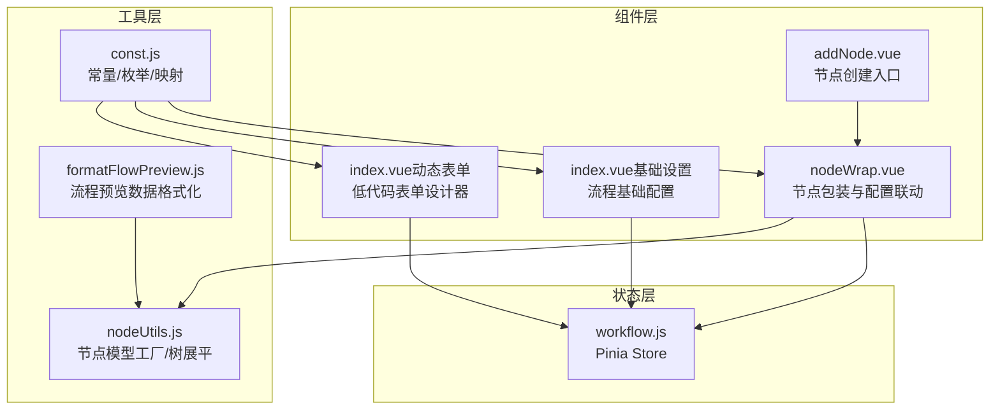
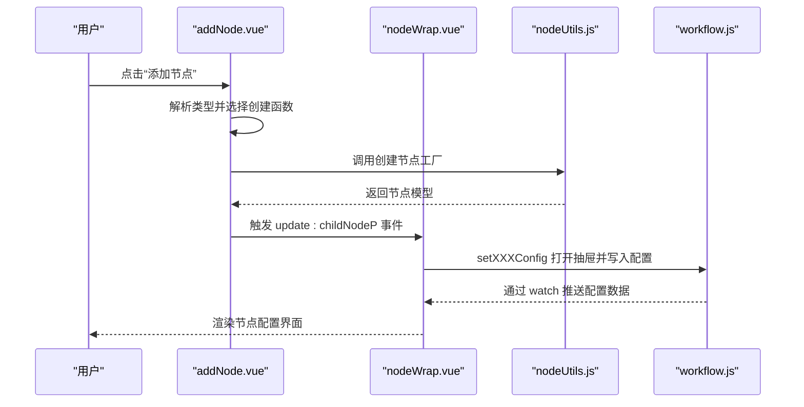
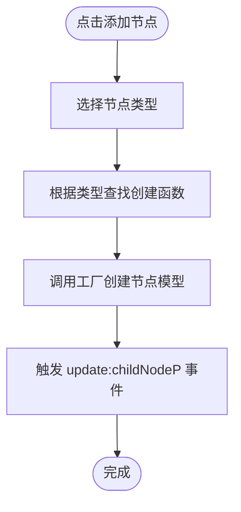
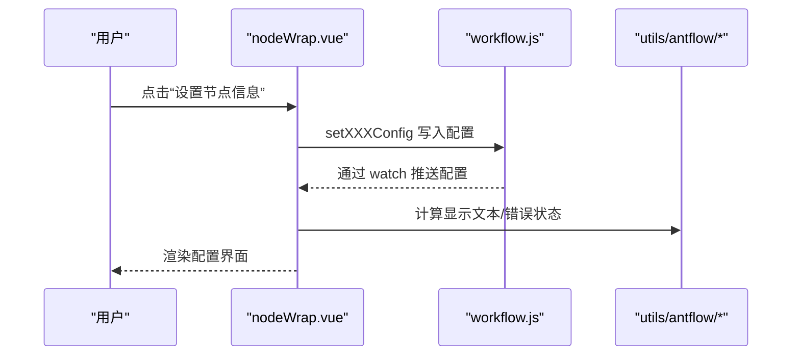
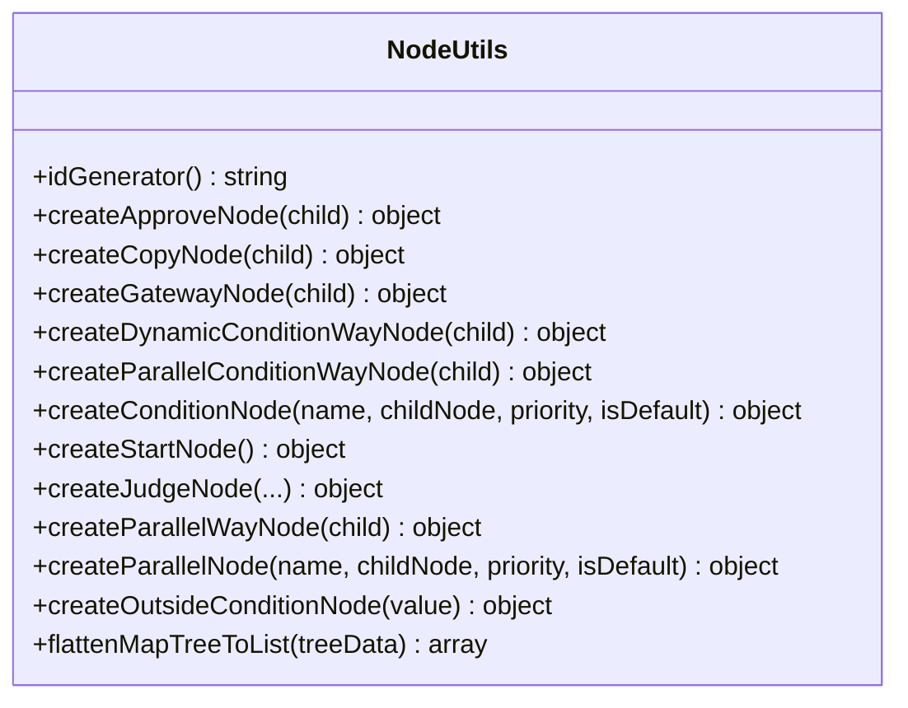
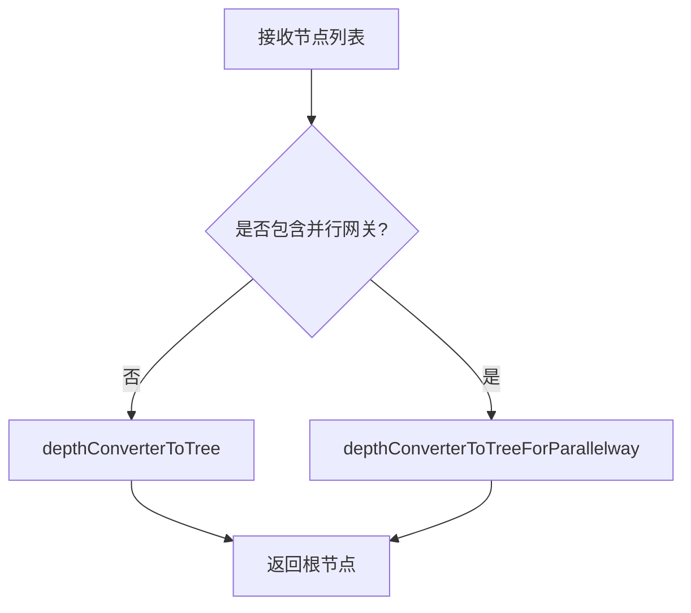
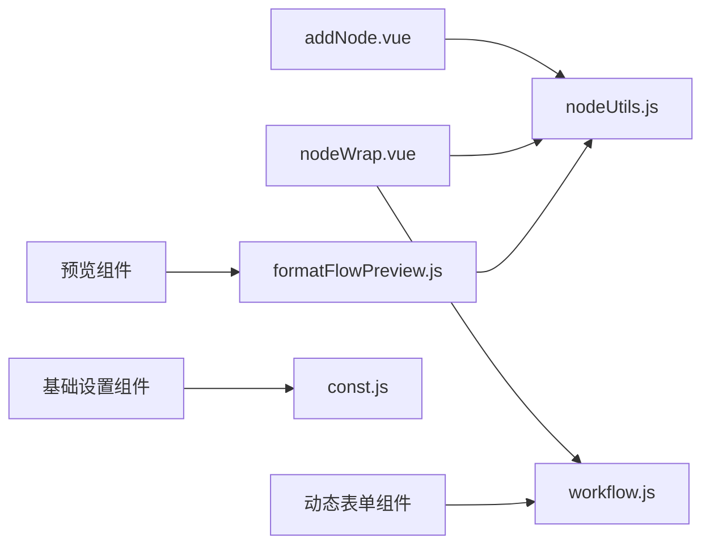

# 工作流组件

<cite>
**本文引用的文件**
- [addNode.vue](file://antflow-vue/src/components/Workflow/addNode.vue)
- [nodeWrap.vue](file://antflow-vue/src/components/Workflow/nodeWrap.vue)
- [nodeUtils.js](file://antflow-vue/src/utils/antflow/nodeUtils.js)
- [workflow.js](file://antflow-vue/src/store/modules/workflow.js)
- [const.js](file://antflow-vue/src/utils/antflow/const.js)
- [formatFlowPreview.js](file://antflow-vue/src/utils/antflow/formatFlowPreview.js)
- [index.vue（基础设置）](file://antflow-vue/src/components/Workflow/BasicSetting/index.vue)
- [index.vue（动态表单）](file://antflow-vue/src/components/Workflow/DynamicForm/index.vue)
</cite>

## 目录
1. [简介](#简介)
2. [项目结构](#项目结构)
3. [核心组件](#核心组件)
4. [架构总览](#架构总览)
5. [详细组件分析](#详细组件分析)
6. [依赖分析](#依赖分析)
7. [性能考虑](#性能考虑)
8. [故障排查指南](#故障排查指南)
9. [结论](#结论)
10. [附录](#附录)

## 简介
本文件面向开发者，系统性梳理工作流组件体系，覆盖以下方面：
- 工作流设计器核心组件：节点创建、节点包装与配置联动、条件/并行网关管理
- 工作流预览组件：流程展示、节点状态标识、连线样式控制
- 动态表单渲染器：实现机制、表单字段配置、数据绑定方式
- 工作流设置组件：配置选项、权限控制、通知设置
- 抽屉式配置组件与对话框组件：交互模式
- 消息图标组件：视觉效果与提示

目标是帮助开发者快速理解并高效使用完整的工作流组件体系。

## 项目结构
工作流相关前端代码主要位于 antflow-vue/src/components/Workflow 与 antflow-vue/src/utils/antflow 下，配合 store 进行状态管理，形成“组件-工具-状态”三层协作：

图表来源
- [addNode.vue:1-252](file://antflow-vue/src/components/Workflow/addNode.vue#L1-L252)
- [nodeWrap.vue:1-503](file://antflow-vue/src/components/Workflow/nodeWrap.vue#L1-L503)
- [nodeUtils.js:1-412](file://antflow-vue/src/utils/antflow/nodeUtils.js#L1-L412)
- [formatFlowPreview.js:1-191](file://antflow-vue/src/utils/antflow/formatFlowPreview.js#L1-L191)
- [const.js:1-359](file://antflow-vue/src/utils/antflow/const.js#L1-L359)
- [workflow.js:1-69](file://antflow-vue/src/store/modules/workflow.js#L1-L69)

章节来源
- [addNode.vue:1-252](file://antflow-vue/src/components/Workflow/addNode.vue#L1-L252)
- [nodeWrap.vue:1-503](file://antflow-vue/src/components/Workflow/nodeWrap.vue#L1-L503)
- [nodeUtils.js:1-412](file://antflow-vue/src/utils/antflow/nodeUtils.js#L1-L412)
- [formatFlowPreview.js:1-191](file://antflow-vue/src/utils/antflow/formatFlowPreview.js#L1-L191)
- [const.js:1-359](file://antflow-vue/src/utils/antflow/const.js#L1-L359)
- [workflow.js:1-69](file://antflow-vue/src/store/modules/workflow.js#L1-L69)

## 核心组件
- 节点创建组件（addNode.vue）
  - 提供弹出式菜单，支持添加审批人、并行审批、抄送人、条件分支、动态条件、条件并行等节点类型
  - 通过 Map 将类型映射到具体创建函数，统一触发更新事件
- 节点包装与配置组件（nodeWrap.vue）
  - 面向不同节点类型的渲染与交互：普通节点（发起人/审批人/抄送人）、条件网关、并行网关
  - 与 Pinia Store 通信，触发配置抽屉打开与数据回填
  - 支持条件节点排序、默认条件处理、并行节点标题重置与错误状态管理
- 工具类（nodeUtils.js）
  - 节点模型工厂：创建审批人、抄送人、网关、条件、并行节点及起始流程数据
  - 数据结构转换：将树形节点展平为列表，便于序列化与传输
- 预览格式化工具（formatFlowPreview.js）
  - 将后端节点列表转换为可渲染的树形结构，区分含/不含并行网关场景
  - 计算节点显示名、去重标记、父子关系
- 常量与映射（const.js）
  - 节点类型、审批方式、表单控件与后端字段类型映射、通知/事件类型等
- 状态管理（workflow.js）
  - 统一管理抽屉开关、配置数据、预览配置、低代码表单字段等

章节来源
- [addNode.vue:54-104](file://antflow-vue/src/components/Workflow/addNode.vue#L54-L104)
- [nodeWrap.vue:140-467](file://antflow-vue/src/components/Workflow/nodeWrap.vue#L140-L467)
- [nodeUtils.js:26-337](file://antflow-vue/src/utils/antflow/nodeUtils.js#L26-L337)
- [formatFlowPreview.js:26-190](file://antflow-vue/src/utils/antflow/formatFlowPreview.js#L26-L190)
- [const.js:8-359](file://antflow-vue/src/utils/antflow/const.js#L8-L359)
- [workflow.js:1-69](file://antflow-vue/src/store/modules/workflow.js#L1-L69)

## 架构总览
工作流组件采用“组件驱动+工具辅助+状态共享”的架构：
- 组件负责交互与视图渲染
- 工具类负责数据建模与格式化
- 状态层集中管理配置与抽屉状态

图表来源
- [addNode.vue:98-103](file://antflow-vue/src/components/Workflow/addNode.vue#L98-L103)
- [nodeWrap.vue:402-448](file://antflow-vue/src/components/Workflow/nodeWrap.vue#L402-L448)
- [nodeUtils.js:26-337](file://antflow-vue/src/utils/antflow/nodeUtils.js#L26-L337)
- [workflow.js:21-66](file://antflow-vue/src/store/modules/workflow.js#L21-L66)

## 详细组件分析

### 节点创建组件（addNode.vue）
- 功能特性
  - 弹出式菜单提供多种节点类型入口
  - 使用 Map 将类型编号映射到创建函数，便于扩展
  - 创建完成后通过事件向上游传递新节点模型
- 关键实现要点
  - 类型到创建函数的映射表
  - 事件发射 update:childNodeP，携带新节点信息
  - 与 nodeUtils.js 的工厂方法协同

图表来源
- [addNode.vue:90-103](file://antflow-vue/src/components/Workflow/addNode.vue#L90-L103)
- [nodeUtils.js:26-337](file://antflow-vue/src/utils/antflow/nodeUtils.js#L26-L337)

章节来源
- [addNode.vue:54-104](file://antflow-vue/src/components/Workflow/addNode.vue#L54-L104)

### 节点包装与配置组件（nodeWrap.vue）
- 功能特性
  - 面向不同节点类型的渲染：普通节点、条件网关、并行网关
  - 支持节点标题编辑、条件节点增删改、排序、错误状态提示
  - 与 Pinia Store 交互，打开对应配置抽屉并回填数据
- 关键实现要点
  - 不同节点类型使用不同模板与图标
  - 通过计算属性组合显示文本（如“发起人/审批人/抄送人”）
  - 条件节点与并行节点的错误重置与标题重命名逻辑
  - setNodeInfo 触发 Store 写入配置，watch 监听配置变化回填

图表来源
- [nodeWrap.vue:402-448](file://antflow-vue/src/components/Workflow/nodeWrap.vue#L402-L448)
- [workflow.js:21-66](file://antflow-vue/src/store/modules/workflow.js#L21-L66)
- [const.js:17-36](file://antflow-vue/src/utils/antflow/const.js#L17-L36)

章节来源
- [nodeWrap.vue:140-467](file://antflow-vue/src/components/Workflow/nodeWrap.vue#L140-L467)

### 工具类（nodeUtils.js）
- 功能特性
  - 节点模型工厂：创建审批人、抄送人、网关、条件、并行节点及起始流程数据
  - 数据结构转换：将树形节点展平为列表，便于序列化与传输
- 关键实现要点
  - 节点 ID 生成策略（基于时间戳与随机数的64进制编码）
  - 网关节点包含 conditionNodes 或 parallelNodes，支持动态条件与并行条件
  - flattenMapTreeToList 递归遍历树，填充 nodeFrom/nodeTo 关系

图表来源
- [nodeUtils.js:26-337](file://antflow-vue/src/utils/antflow/nodeUtils.js#L26-L337)
- [nodeUtils.js:372-411](file://antflow-vue/src/utils/antflow/nodeUtils.js#L372-L411)

章节来源
- [nodeUtils.js:1-412](file://antflow-vue/src/utils/antflow/nodeUtils.js#L1-L412)

### 预览格式化工具（formatFlowPreview.js）
- 功能特性
  - 将后端节点列表转换为可渲染的树形结构
  - 区分含/不含并行网关的两种转换路径
  - 计算节点显示名、去重标记、父子关系
- 关键实现要点
  - depthConverterNodes 根据是否存在并行网关选择转换策略
  - isParallelChildNode 判断节点是否属于并行网关的子节点

图表来源
- [formatFlowPreview.js:79-164](file://antflow-vue/src/utils/antflow/formatFlowPreview.js#L79-L164)

章节来源
- [formatFlowPreview.js:1-191](file://antflow-vue/src/utils/antflow/formatFlowPreview.js#L1-L191)

### 常量与映射（const.js）
- 功能特性
  - 节点类型、审批方式、表单控件与后端字段类型映射
  - 通知/事件类型、消息发送渠道、审批按钮配置等
- 关键实现要点
  - bgColors/placeholderList/nodeTypeList 用于节点样式与占位文本
  - condition_columnTypeMap/condition_filedTypeMap/condition_filedValueTypeMap 用于条件节点与后端字段类型映射
  - noticeUserList/messageSendTypeList/eventTypeList 用于通知设置

章节来源
- [const.js:8-359](file://antflow-vue/src/utils/antflow/const.js#L8-L359)

### 状态管理（workflow.js）
- 功能特性
  - 统一管理抽屉开关、配置数据、预览配置、低代码表单字段等
  - 通过 actions 写入状态，组件通过 computed/watch 读取
- 关键实现要点
  - setPromoter/setApprover/setCopyer/setCondition 打开对应配置抽屉
  - setApproverConfig/setCopyerConfig/setConditionsConfig 写入配置并携带唯一 id

章节来源
- [workflow.js:1-69](file://antflow-vue/src/store/modules/workflow.js#L1-L69)

### 工作流设置组件（基础设置）
- 功能特性
  - 流程基础信息配置：类型标识、流程名称、审批人去重策略、发起人权限、流程说明
  - 支持复制模式下对类型标识的选择与流程名称联动
- 关键实现要点
  - 表单校验规则与数据暴露接口 getData
  - 根据流程类型（DIY/LF）动态加载可用表单代码

章节来源
- [index.vue（基础设置）:76-221](file://antflow-vue/src/components/Workflow/BasicSetting/index.vue#L76-L221)

### 动态表单渲染器（低代码表单）
- 功能特性
  - 基于 v-form-designer 的可视化表单设计器
  - 监听设计器 DOM 变化，实时同步表单字段配置到 Store
  - 支持导入/导出表单 JSON，暴露获取表单数据与字段列表的方法
- 关键实现要点
  - 使用 MutationObserver 监听设计器容器变化
  - 通过 Store.setLowCodeFormField 持久化表单字段

章节来源
- [index.vue（动态表单）:10-75](file://antflow-vue/src/components/Workflow/DynamicForm/index.vue#L10-L75)

## 依赖分析
- 组件间耦合
  - addNode.vue 与 nodeWrap.vue 通过事件与工厂方法协作
  - nodeWrap.vue 与 workflow.js 通过 store 读写配置
  - nodeWrap.vue 与 nodeUtils.js 通过工厂方法协作
  - 预览组件依赖 formatFlowPreview.js 与 nodeUtils.js 的树转换能力
- 外部依赖
  - Element Plus 表单与组件生态
  - v-form-designer 低代码表单设计器（通过 npm 引入）

图表来源
- [addNode.vue:56-103](file://antflow-vue/src/components/Workflow/addNode.vue#L56-L103)
- [nodeWrap.vue:141-178](file://antflow-vue/src/components/Workflow/nodeWrap.vue#L141-L178)
- [nodeUtils.js:26-337](file://antflow-vue/src/utils/antflow/nodeUtils.js#L26-L337)
- [formatFlowPreview.js:26-190](file://antflow-vue/src/utils/antflow/formatFlowPreview.js#L26-L190)
- [const.js:17-359](file://antflow-vue/src/utils/antflow/const.js#L17-L359)
- [workflow.js:21-66](file://antflow-vue/src/store/modules/workflow.js#L21-L66)

章节来源
- [addNode.vue:54-104](file://antflow-vue/src/components/Workflow/addNode.vue#L54-L104)
- [nodeWrap.vue:140-467](file://antflow-vue/src/components/Workflow/nodeWrap.vue#L140-L467)
- [nodeUtils.js:1-412](file://antflow-vue/src/utils/antflow/nodeUtils.js#L1-L412)
- [formatFlowPreview.js:1-191](file://antflow-vue/src/utils/antflow/formatFlowPreview.js#L1-L191)
- [const.js:1-359](file://antflow-vue/src/utils/antflow/const.js#L1-L359)
- [workflow.js:1-69](file://antflow-vue/src/store/modules/workflow.js#L1-L69)

## 性能考虑
- 节点树展平与转换
  - flattenMapTreeToList 采用递归遍历，复杂度 O(N)，建议在大数据量时避免频繁全量重算
- 表单设计器监听
  - MutationObserver 在设计器容器上开启监听，注意在组件卸载时及时断开，防止内存泄漏
- 错误状态与标题重置
  - 条件/并行节点的错误重置与标题重命名在挂载与变更时执行，建议在批量操作时合并更新以减少重渲染

## 故障排查指南
- 节点无法添加或配置不生效
  - 检查 addNode.vue 中类型到创建函数的映射是否正确
  - 确认 nodeWrap.vue 中 setNodeInfo 是否触发了对应的 setXXXConfig
- 条件节点显示异常或排序错乱
  - 检查 resetConditionNodesErr 与 resetParallelNodesErr 的执行时机
  - 确认 arrTransfer 的索引交换逻辑与优先级重排
- 预览流程显示不正确
  - 检查 formatFlowPreview.js 的 depthConverterToTree/ForParallelway 选择逻辑
  - 确认 isParallelChildNode 的判断条件是否满足
- 低代码表单字段未同步
  - 确认 MutationObserver 是否在设计器容器上正确观察
  - 检查 Store.setLowCodeFormField 是否被调用

章节来源
- [addNode.vue:90-103](file://antflow-vue/src/components/Workflow/addNode.vue#L90-L103)
- [nodeWrap.vue:198-233](file://antflow-vue/src/components/Workflow/nodeWrap.vue#L198-L233)
- [nodeWrap.vue:402-466](file://antflow-vue/src/components/Workflow/nodeWrap.vue#L402-L466)
- [formatFlowPreview.js:79-189](file://antflow-vue/src/utils/antflow/formatFlowPreview.js#L79-L189)
- [index.vue（动态表单）:25-48](file://antflow-vue/src/components/Workflow/DynamicForm/index.vue#L25-L48)

## 结论
工作流组件体系通过清晰的职责划分与工具化支持，实现了从节点创建、配置到预览与表单渲染的完整闭环。开发者可基于现有组件快速扩展节点类型、完善配置项与预览样式，并结合常量与映射体系实现灵活的业务适配。

## 附录
- 抽屉式配置组件使用方法
  - 通过 nodeWrap.vue 的 setNodeInfo 触发对应抽屉打开
  - Store 中的 setXXXConfig 写入配置，组件通过 watch 推送配置
- 对话框组件交互模式
  - 基础设置组件提供 getData 方法，用于表单校验与数据收集
- 消息图标组件视觉效果
  - 通过 const.js 中的 noticeUserList/messageSendTypeList/eventTypeList 控制通知用户与发送渠道

章节来源
- [nodeWrap.vue:402-448](file://antflow-vue/src/components/Workflow/nodeWrap.vue#L402-L448)
- [workflow.js:21-66](file://antflow-vue/src/store/modules/workflow.js#L21-L66)
- [index.vue（基础设置）:206-220](file://antflow-vue/src/components/Workflow/BasicSetting/index.vue#L206-L220)
- [const.js:254-359](file://antflow-vue/src/utils/antflow/const.js#L254-L359)