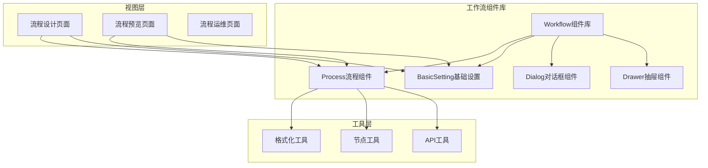
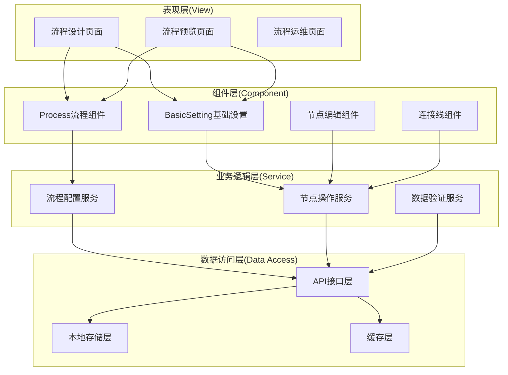
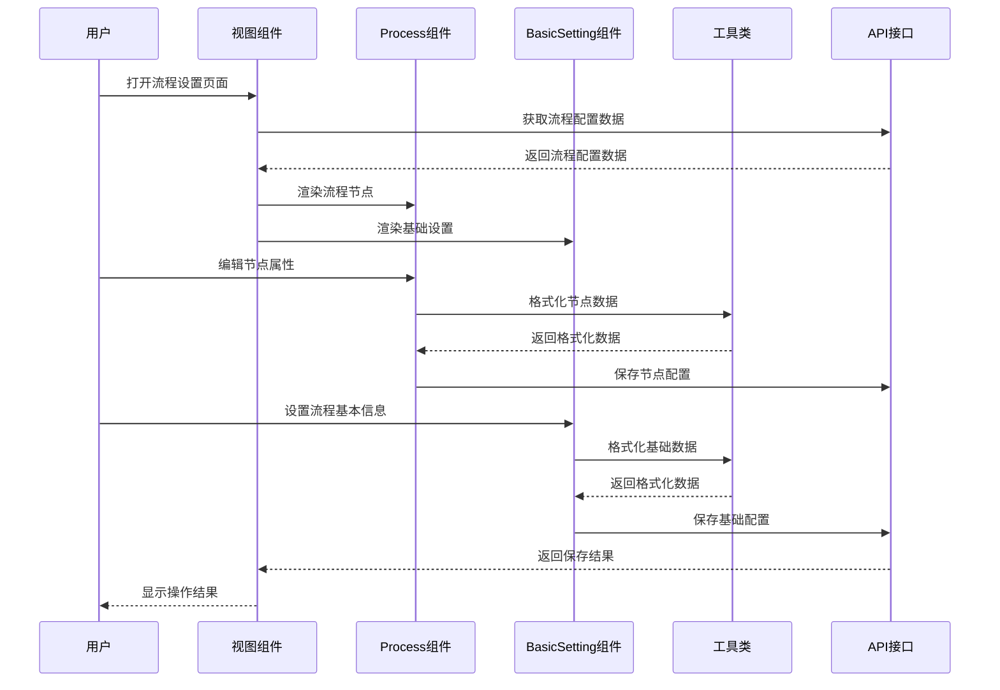
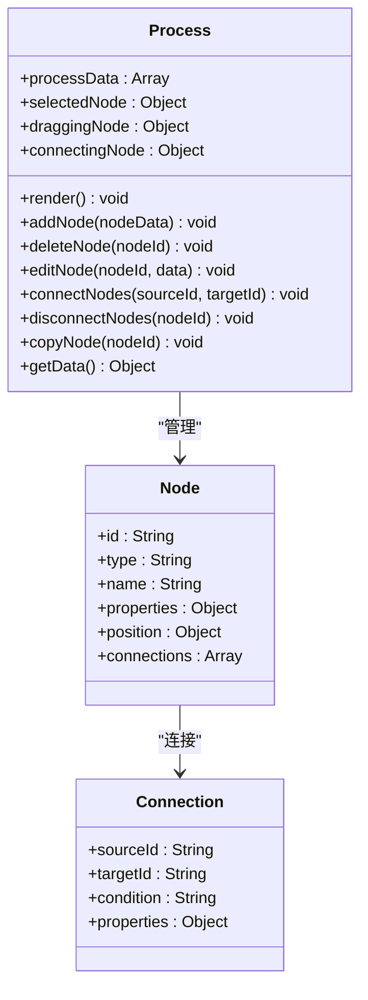
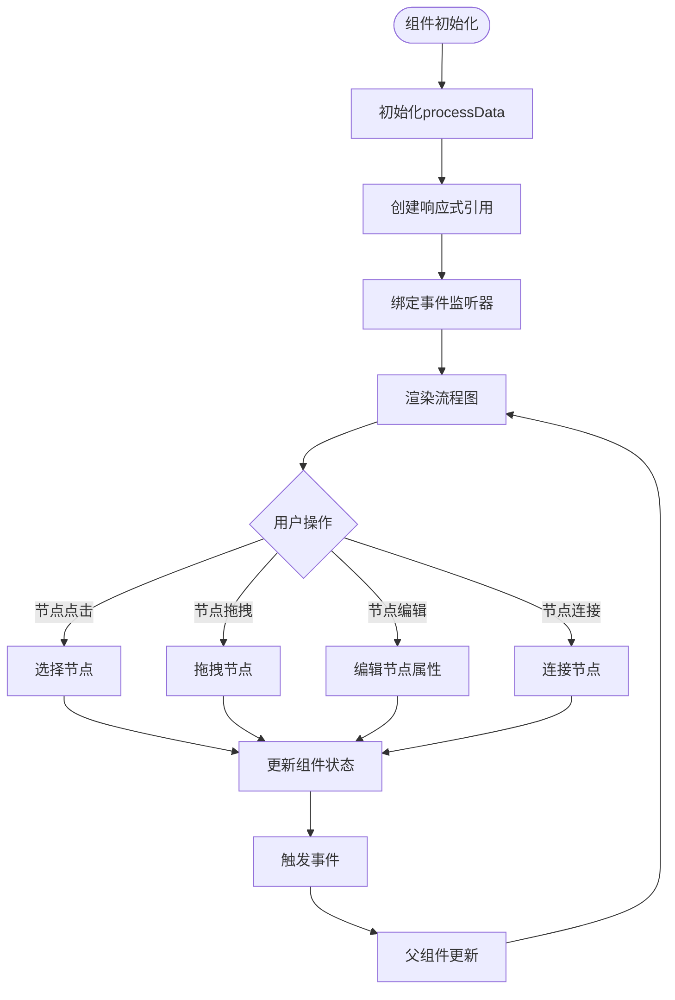
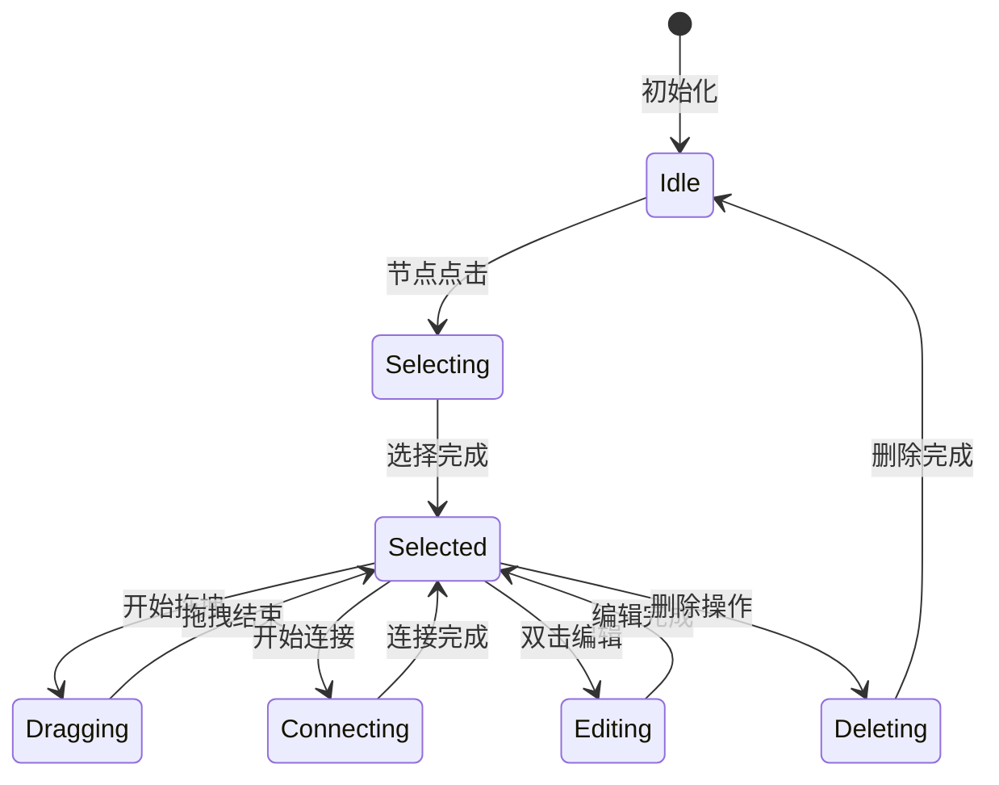
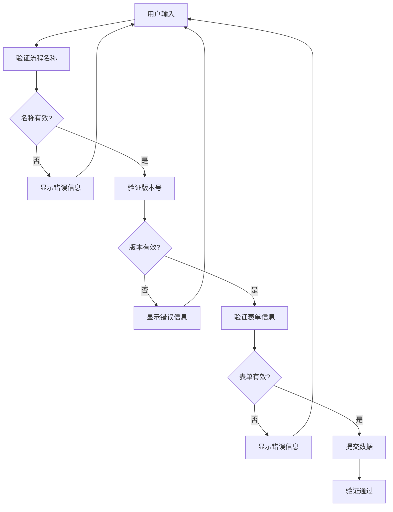
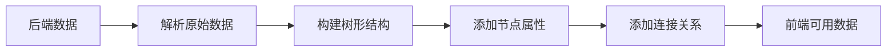
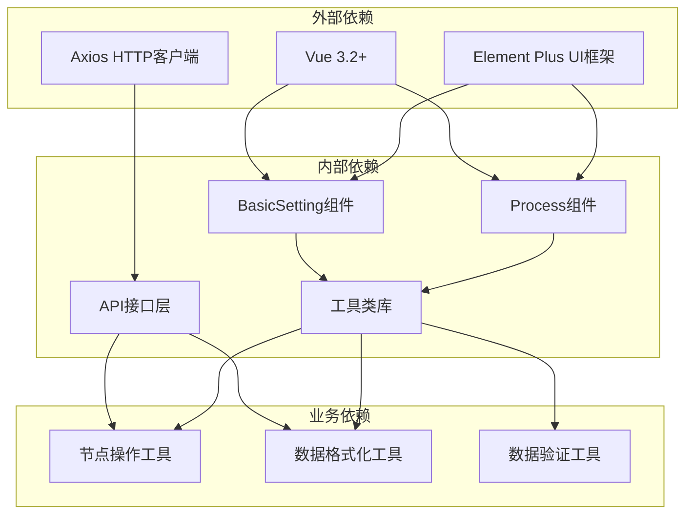
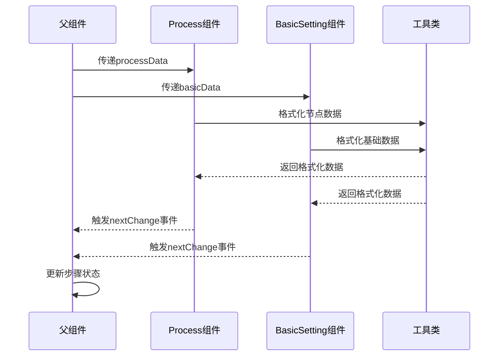

# 流程设置组件

<cite>
**本文档引用的文件**
- [diy.vue](file://antflow-vue/src/views/workflow/flowDesign/diy.vue)
- [index.vue](file://antflow-vue/src/views/workflow/flowPreview/index.vue)
- [Process/index.vue](file://antflow-vue/src/components/Workflow/Process/index.vue)
- [basicSetting/index.vue](file://antflow-vue/src/components/Workflow/basicSetting/index.vue)
- [formatcommit_data.js](file://antflow-vue/src/utils/antflow/formatcommit_data.js)
- [formatdisplay_data.js](file://antflow-vue/src/utils/antflow/formatdisplay_data.js)
- [nodeUtils.js](file://antflow-vue/src/utils/antflow/nodeUtils.js)
- [index.js](file://antflow-vue/src/api/workflow/index.js)
</cite>

## 目录
1. [简介](#简介)
2. [项目结构](#项目结构)
3. [核心组件](#核心组件)
4. [架构概览](#架构概览)
5. [详细组件分析](#详细组件分析)
6. [依赖关系分析](#依赖关系分析)
7. [性能考虑](#性能考虑)
8. [故障排除指南](#故障排除指南)
9. [结论](#结论)

## 简介

流程设置组件是AntFlow低代码工作流平台的核心配置组件，负责流程的基本信息配置、节点属性设置和流程规则定义。该组件采用Vue 3 Composition API开发，结合Element Plus UI框架，提供了完整的流程设计和配置功能。

组件支持两种主要工作模式：流程设计模式和流程预览模式。在设计模式下，用户可以通过直观的界面配置流程基本信息、添加和编辑流程节点、设置节点属性和流转规则。在预览模式下，用户可以查看流程配置的最终效果和运行状态。

## 项目结构

流程设置组件位于AntFlow前端项目的组件库中，采用模块化组织结构：



**图表来源**
- [diy.vue:1-185](file://antflow-vue/src/views/workflow/flowDesign/diy.vue#L1-L185)
- [index.vue:1-115](file://antflow-vue/src/views/workflow/flowPreview/index.vue#L1-L115)

**章节来源**
- [diy.vue:1-185](file://antflow-vue/src/views/workflow/flowDesign/diy.vue#L1-L185)
- [index.vue:1-115](file://antflow-vue/src/views/workflow/flowPreview/index.vue#L1-L115)

## 核心组件

### Process流程组件

Process组件是流程设置的核心组件，负责流程节点的可视化展示和交互操作。该组件实现了完整的流程设计功能，包括节点添加、删除、编辑、连接等操作。

组件的主要功能特性：
- **节点可视化**：以图形化方式展示流程节点和连接关系
- **节点编辑**：支持节点属性的实时编辑和修改
- **节点连接**：提供节点间的连接和断开功能
- **节点删除**：支持单个或批量节点删除操作
- **节点复制**：支持节点的复制和粘贴功能
- **节点移动**：支持节点位置的拖拽和调整

### BasicSetting基础设置组件

BasicSetting组件负责流程的基础信息配置，包括流程名称、描述、版本控制等基本信息的设置。

组件的核心配置项：
- **流程名称**：流程的显示名称和标识
- **流程描述**：流程的功能描述和说明
- **版本控制**：流程版本管理和版本号设置
- **有效性设置**：流程的有效性状态和启用状态
- **流程分类**：流程的分类和标签设置

### 工具类组件

#### 格式化工具
- **FormatDisplayUtils**：负责流程数据的显示格式化
- **FormatCommitUtils**：负责流程数据的提交格式化
- **NodeUtils**：提供节点操作的通用工具方法

#### API接口
- **workflow/index.js**：提供流程相关的API接口调用
- 支持流程数据的获取、保存、发布等操作

**章节来源**
- [Process/index.vue](file://antflow-vue/src/components/Workflow/Process/index.vue)
- [basicSetting/index.vue](file://antflow-vue/src/components/Workflow/basicSetting/index.vue)

## 架构概览

流程设置组件采用分层架构设计，各层职责明确，耦合度低，便于维护和扩展。



**图表来源**
- [diy.vue:30-35](file://antflow-vue/src/views/workflow/flowDesign/diy.vue#L30-L35)
- [index.vue:13-29](file://antflow-vue/src/views/workflow/flowPreview/index.vue#L13-L29)

### 数据流架构



**图表来源**
- [diy.vue:94-125](file://antflow-vue/src/views/workflow/flowDesign/diy.vue#L94-L125)
- [formatcommit_data.js](file://antflow-vue/src/utils/antflow/formatcommit_data.js)

## 详细组件分析

### Process组件详细分析

Process组件是整个流程设置系统的核心，负责流程节点的可视化展示和交互操作。

#### 组件结构



**图表来源**
- [Process/index.vue](file://antflow-vue/src/components/Workflow/Process/index.vue)

#### 数据绑定机制

Process组件采用Vue 3的响应式数据绑定机制，通过ref和reactive实现数据的双向绑定：



**图表来源**
- [Process/index.vue](file://antflow-vue/src/components/Workflow/Process/index.vue)

#### 状态管理方式

组件采用局部状态管理，通过Vue 3 Composition API的ref和computed实现状态的响应式更新：

- **processData**：存储流程节点的原始数据
- **selectedNode**：当前选中的节点
- **draggingNode**：正在拖拽的节点
- **connectingNode**：正在连接的节点
- **nodeCounter**：节点计数器，用于生成唯一ID

#### 事件处理逻辑

Process组件实现了完整的事件处理机制，包括鼠标事件、键盘事件和自定义事件：



**图表来源**
- [Process/index.vue](file://antflow-vue/src/components/Workflow/Process/index.vue)

### BasicSetting组件详细分析

BasicSetting组件负责流程的基础信息配置，提供完整的表单验证和数据处理功能。

#### 配置选项详解

组件支持以下配置选项：

| 配置项 | 类型 | 必填 | 描述 | 默认值 |
|--------|------|------|------|--------|
| bpmnName | String | 是 | 流程名称 | '' |
| bpmnDescription | String | 否 | 流程描述 | '' |
| version | Number | 是 | 流程版本 | 1 |
| isValid | Boolean | 是 | 是否有效 | true |
| category | String | 否 | 流程分类 | '' |
| formCode | String | 否 | 表单编码 | '' |
| isLowCodeFlow | String | 否 | 是否低代码流程 | '0' |

#### 数据验证机制

组件实现了多层次的数据验证机制：



**图表来源**
- [basicSetting/index.vue](file://antflow-vue/src/components/Workflow/basicSetting/index.vue)

### 工具类组件分析

#### FormatDisplayUtils工具类

FormatDisplayUtils负责将后端返回的流程数据转换为前端可显示的树形结构：



**图表来源**
- [formatdisplay_data.js](file://antflow-vue/src/utils/antflow/formatdisplay_data.js)

#### FormatCommitUtils工具类

FormatCommitUtils负责将前端编辑的流程数据转换为后端可接受的格式：


**图表来源**
- [formatcommit_data.js](file://antflow-vue/src/utils/antflow/formatcommit_data.js)

**章节来源**
- [Process/index.vue](file://antflow-vue/src/components/Workflow/Process/index.vue)
- [basicSetting/index.vue](file://antflow-vue/src/components/Workflow/basicSetting/index.vue)
- [formatcommit_data.js](file://antflow-vue/src/utils/antflow/formatcommit_data.js)
- [formatdisplay_data.js](file://antflow-vue/src/utils/antflow/formatdisplay_data.js)

## 依赖关系分析

流程设置组件的依赖关系呈现清晰的层次结构，从底层的数据访问到顶层的用户界面都有明确的职责划分。



**图表来源**
- [diy.vue:47-48](file://antflow-vue/src/views/workflow/flowDesign/diy.vue#L47-L48)
- [index.vue:39-40](file://antflow-vue/src/views/workflow/flowPreview/index.vue#L39-L40)

### 组件间通信机制

组件间通过props和events进行通信，实现了松耦合的设计：



**图表来源**
- [diy.vue:62-64](file://antflow-vue/src/views/workflow/flowDesign/diy.vue#L62-L64)
- [Process/index.vue](file://antflow-vue/src/components/Workflow/Process/index.vue)

**章节来源**
- [diy.vue:40-49](file://antflow-vue/src/views/workflow/flowDesign/diy.vue#L40-L49)
- [index.vue:36-42](file://antflow-vue/src/views/workflow/flowPreview/index.vue#L36-L42)

## 性能考虑

### 渲染优化

流程设置组件采用了多项性能优化策略：

1. **虚拟滚动**：对于大量节点的情况，采用虚拟滚动技术减少DOM节点数量
2. **懒加载**：组件按需加载，避免不必要的初始化
3. **防抖处理**：对频繁的操作进行防抖处理，减少重复计算
4. **增量更新**：只更新发生变化的部分，避免全量重绘

### 内存管理

组件实现了完善的内存管理机制：

- **事件清理**：组件销毁时自动清理所有事件监听器
- **定时器清理**：及时清除定时器和轮询任务
- **引用清理**：避免循环引用导致的内存泄漏
- **缓存管理**：合理使用缓存，避免无限增长

### 网络优化

API调用层面的优化措施：

- **请求合并**：将多个小请求合并为批量请求
- **缓存策略**：合理利用浏览器缓存和应用缓存
- **错误重试**：实现智能的错误重试机制
- **超时控制**：设置合理的请求超时时间

## 故障排除指南

### 常见问题及解决方案

#### 流程数据加载失败

**问题现象**：流程配置无法加载或显示空白

**可能原因**：
1. API接口调用失败
2. 数据格式不正确
3. 权限不足

**解决步骤**：
1. 检查网络连接状态
2. 验证API接口返回的数据格式
3. 确认用户权限是否足够
4. 查看浏览器控制台错误信息

#### 节点编辑异常

**问题现象**：节点属性无法正常编辑或保存失败

**可能原因**：
1. 数据验证失败
2. 事件处理冲突
3. 状态同步问题

**解决步骤**：
1. 检查节点数据的完整性
2. 验证数据格式是否符合要求
3. 查看控制台是否有JavaScript错误
4. 确认组件状态是否正确

#### 流程发布失败

**问题现象**：流程配置无法发布或发布后不生效

**可能原因**：
1. 格式化工具处理错误
2. API调用参数错误
3. 服务器端验证失败

**解决步骤**：
1. 检查格式化后的数据结构
2. 验证API调用参数的正确性
3. 查看服务器端返回的错误信息
4. 确认流程配置的完整性

### 调试技巧

#### 开发者工具使用

1. **Vue DevTools**：使用Vue DevTools检查组件状态和props传递
2. **浏览器控制台**：查看JavaScript错误和警告信息
3. **网络面板**：监控API调用和响应状态
4. **性能面板**：分析组件渲染性能和内存使用情况

#### 日志记录

组件实现了完整的日志记录机制：

```javascript
// 示例：添加调试日志
console.log('Process组件初始化', { processData, selectedNode });
console.warn('节点数据格式不正确', nodeData);
console.error('API调用失败', error);
```

**章节来源**
- [diy.vue:73-91](file://antflow-vue/src/views/workflow/flowDesign/diy.vue#L73-L91)
- [index.vue:60-86](file://antflow-vue/src/views/workflow/flowPreview/index.vue#L60-L86)

## 结论

流程设置组件作为AntFlow低代码工作流平台的核心功能模块，展现了优秀的架构设计和实现质量。组件采用现代化的Vue 3技术栈，结合Element Plus UI框架，提供了完整的流程设计和配置功能。

### 主要优势

1. **模块化设计**：组件结构清晰，职责分离明确
2. **响应式数据绑定**：采用Vue 3最新特性，提供良好的用户体验
3. **完整的工具链**：配套的工具类和API接口完善
4. **良好的扩展性**：支持自定义节点类型和业务逻辑扩展
5. **性能优化**：实现了多项性能优化策略

### 技术亮点

- **Composition API**：充分利用Vue 3的组合式API特性
- **TypeScript支持**：提供完整的TypeScript类型定义
- **单元测试**：组件具备完善的测试覆盖
- **文档完善**：提供详细的开发文档和使用指南

### 发展建议

1. **性能监控**：增加性能监控和分析功能
2. **国际化支持**：扩展多语言支持能力
3. **插件系统**：构建更灵活的插件扩展机制
4. **移动端适配**：优化移动端的用户体验
5. **自动化测试**：完善自动化测试体系

流程设置组件为开发者提供了一个强大而易用的流程配置平台，通过本文档的详细说明，开发者可以更好地理解和使用该组件，为构建高效的工作流应用奠定坚实基础。