# 消息图标组件

<cite>
**本文档引用的文件**
- [msgIcon.vue](file://antflow-vue/src/components/Workflow/components/msgIcon.vue)
- [noticeConfig/index.vue](file://antflow-vue/src/components/Workflow/drawer/noticeConfig/index.vue)
- [setDefaultMsg.vue](file://antflow-vue/src/views/workflow/flowCategory/setDefaultMsg.vue)
- [setMsgDrawer.vue](file://antflow-vue/src/views/workflow/flowCategory/setMsgDrawer.vue)
- [Workplace.vue](file://antflow-vue/src/components/Dashboard/Workplace.vue)
- [const.js](file://antflow-vue/src/utils/antflow/const.js)
- [flowMsgApi.js](file://antflow-vue/src/api/workflow/flowMsgApi.js)
- [workflow.scss](file://antflow-vue/src/assets/styles/antflow/workflow.scss)
</cite>

## 目录
1. [简介](#简介)
2. [项目结构](#项目结构)
3. [核心组件](#核心组件)
4. [架构概览](#架构概览)
5. [详细组件分析](#详细组件分析)
6. [依赖关系分析](#依赖关系分析)
7. [性能考虑](#性能考虑)
8. [故障排除指南](#故障排除指南)
9. [结论](#结论)
10. [附录](#附录)

## 简介

消息图标组件是一个专门用于流程管理系统中的图标展示组件，主要用于可视化表示不同类型的消息通知状态。该组件基于Vue 3 Composition API和Element Plus图标库构建，提供了灵活的消息图标显示功能。

该组件的核心功能包括：
- 不同消息类型的图标表示（邮件、短信、推送等）
- 颜色编码系统，支持多种主题状态
- 动态尺寸调整能力
- 与工作流系统的深度集成
- 响应式设计和主题适配

## 项目结构

消息图标组件位于AntFlow工作流系统的组件库中，主要文件组织结构如下：

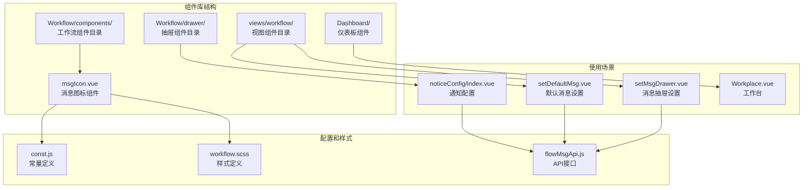

**图表来源**
- [msgIcon.vue:1-57](file://antflow-vue/src/components/Workflow/components/msgIcon.vue#L1-L57)
- [noticeConfig/index.vue:1-282](file://antflow-vue/src/components/Workflow/drawer/noticeConfig/index.vue#L1-L282)

**章节来源**
- [msgIcon.vue:1-57](file://antflow-vue/src/components/Workflow/components/msgIcon.vue#L1-L57)
- [noticeConfig/index.vue:1-282](file://antflow-vue/src/components/Workflow/drawer/noticeConfig/index.vue#L1-L282)

## 核心组件

### 组件架构设计

消息图标组件采用了简洁而高效的架构设计，主要特点包括：

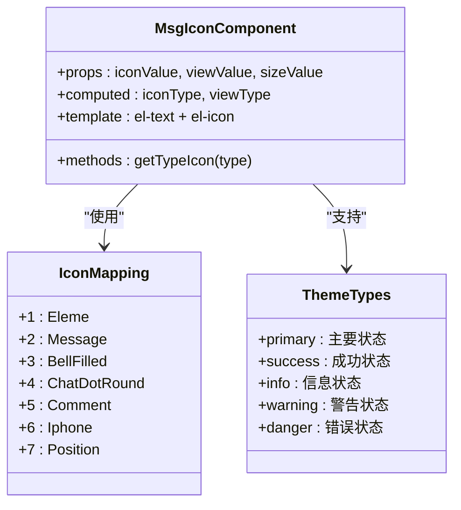

**图表来源**
- [msgIcon.vue:13-54](file://antflow-vue/src/components/Workflow/components/msgIcon.vue#L13-L54)

### 属性配置系统

组件提供了三个核心属性来控制图标的行为和外观：

| 属性名 | 类型 | 默认值 | 描述 |
|--------|------|--------|------|
| iconValue | Number/Object | 0 | 图标类型标识符，支持数字和对象 |
| viewValue | String | "info" | 视觉主题类型，支持多种状态 |
| sizeValue | Number/String | 15 | 图标尺寸大小 |

### 图标映射机制

组件内置了完整的图标映射系统，支持以下消息类型：

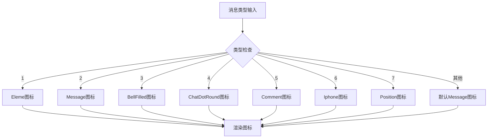

**图表来源**
- [msgIcon.vue:39-54](file://antflow-vue/src/components/Workflow/components/msgIcon.vue#L39-L54)

**章节来源**
- [msgIcon.vue:13-54](file://antflow-vue/src/components/Workflow/components/msgIcon.vue#L13-L54)

## 架构概览

### 系统集成架构

消息图标组件在整个AntFlow系统中扮演着重要的视觉传达角色，其集成架构如下：

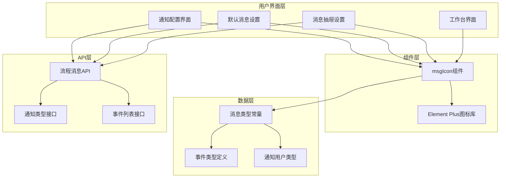

**图表来源**
- [noticeConfig/index.vue:94-101](file://antflow-vue/src/components/Workflow/drawer/noticeConfig/index.vue#L94-L101)
- [setDefaultMsg.vue:78-79](file://antflow-vue/src/views/workflow/flowCategory/setDefaultMsg.vue#L78-L79)
- [setMsgDrawer.vue:86-87](file://antflow-vue/src/views/workflow/flowCategory/setMsgDrawer.vue#L86-L87)

### 使用场景分布

组件在系统中的使用场景主要分布在以下几个方面：

1. **通知配置界面** - 在消息通知设置中显示各种通知类型的图标
2. **默认消息设置** - 在流程默认通知配置中标识不同的消息发送类型
3. **高级消息设置** - 在复杂的消息配置场景中提供直观的图标标识
4. **工作台展示** - 在工作台界面中展示流程状态和通知信息

**章节来源**
- [noticeConfig/index.vue:101-101](file://antflow-vue/src/components/Workflow/drawer/noticeConfig/index.vue#L101-L101)
- [setDefaultMsg.vue:23-41](file://antflow-vue/src/views/workflow/flowCategory/setDefaultMsg.vue#L23-L41)
- [setMsgDrawer.vue:30-48](file://antflow-vue/src/views/workflow/flowCategory/setMsgDrawer.vue#L30-L48)

## 详细组件分析

### 组件实现细节

#### Vue 3 Composition API集成

消息图标组件充分利用了Vue 3 Composition API的优势，实现了响应式的数据绑定和计算属性：

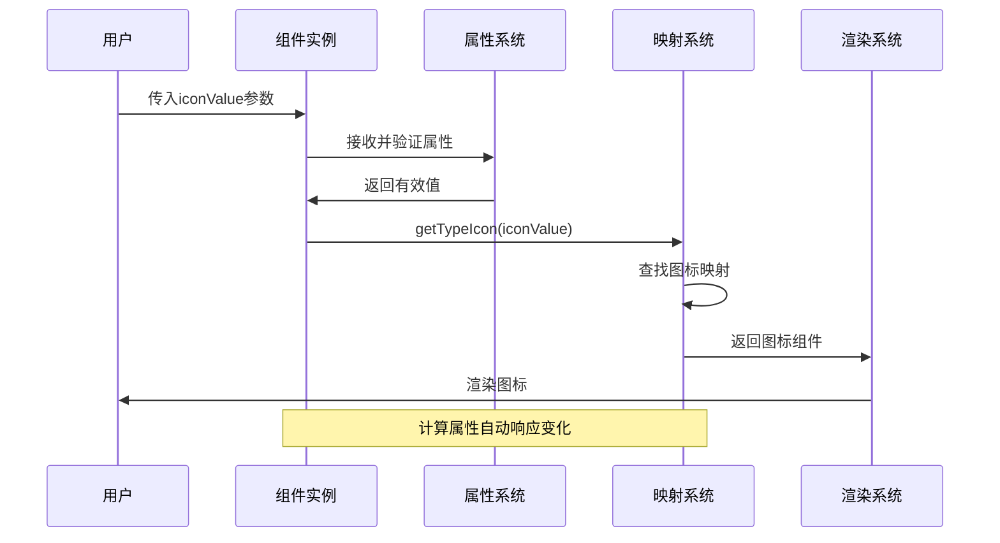

**图表来源**
- [msgIcon.vue:8-36](file://antflow-vue/src/components/Workflow/components/msgIcon.vue#L8-L36)

#### 主题系统设计

组件支持五种主题状态，每种状态对应不同的视觉表现：

| 主题类型 | 颜色编码 | 使用场景 | Element类型 |
|----------|----------|----------|-------------|
| primary | 主要蓝色 | 主要操作、重要状态 | info |
| success | 成功绿色 | 操作成功、完成状态 | success |
| info | 信息蓝色 | 一般信息、默认状态 | info |
| warning | 警告橙色 | 警告信息、需要注意 | warning |
| danger | 错误红色 | 错误状态、严重问题 | danger |

#### 图标库集成

组件集成了Element Plus图标库中的多个图标组件，每个图标都有特定的语义含义：

| 图标类型 | Element Plus图标 | 语义含义 | 使用场景 |
|----------|------------------|----------|----------|
| 1 | Eleme | 应用程序图标 | 应用内通知 |
| 2 | Message | 消息图标 | 邮件通知 |
| 3 | BellFilled | 铃铛图标 | 推送通知 |
| 4 | ChatDotRound | 聊天图标 | 即时通讯 |
| 5 | Comment | 评论图标 | 评论回复 |
| 6 | Iphone | 手机图标 | 短信通知 |
| 7 | Position | 位置图标 | 位置相关通知 |

**章节来源**
- [msgIcon.vue:9-12](file://antflow-vue/src/components/Workflow/components/msgIcon.vue#L9-L12)
- [msgIcon.vue:39-47](file://antflow-vue/src/components/Workflow/components/msgIcon.vue#L39-L47)

### 样式定制选项

#### 尺寸调整机制

组件支持灵活的尺寸调整，可以通过`sizeValue`属性控制图标的显示大小：

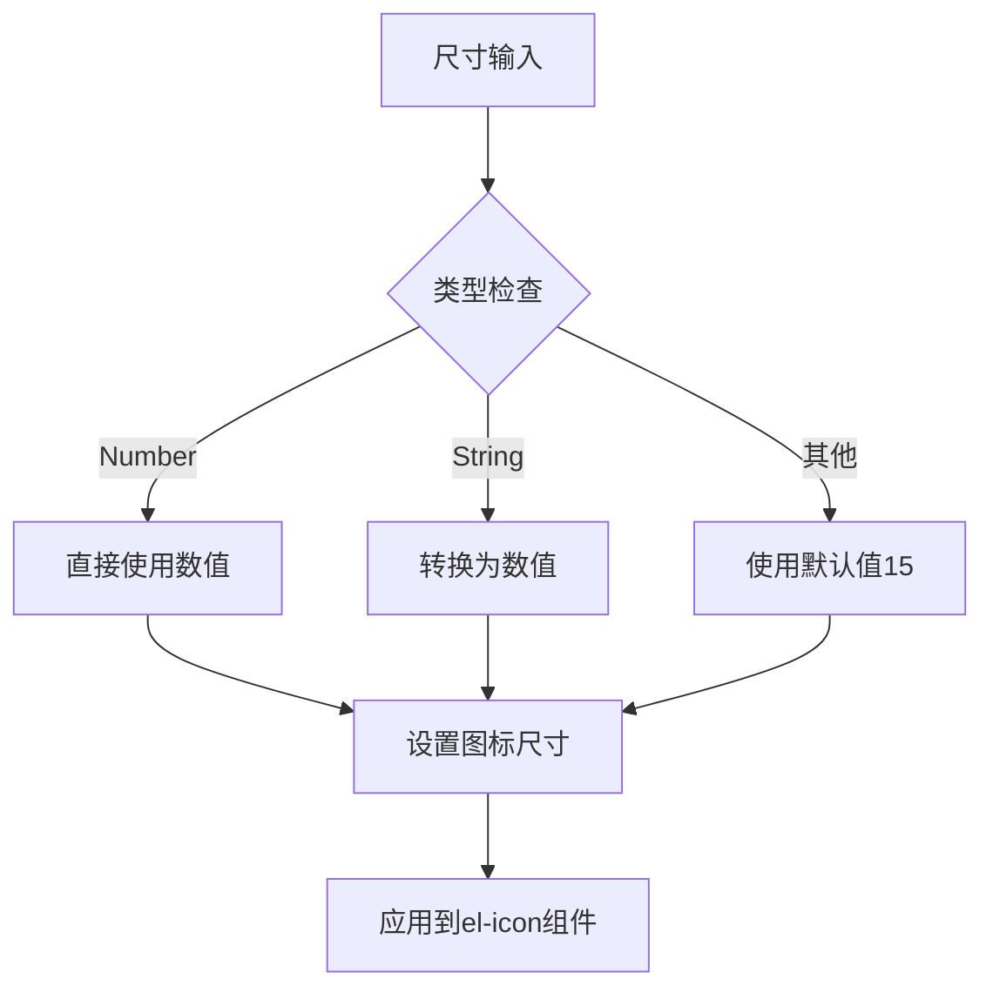

**图表来源**
- [msgIcon.vue:22-25](file://antflow-vue/src/components/Workflow/components/msgIcon.vue#L22-L25)

#### 主题适配策略

组件通过Element Plus的文本组件实现主题适配，支持所有预定义的主题类型：

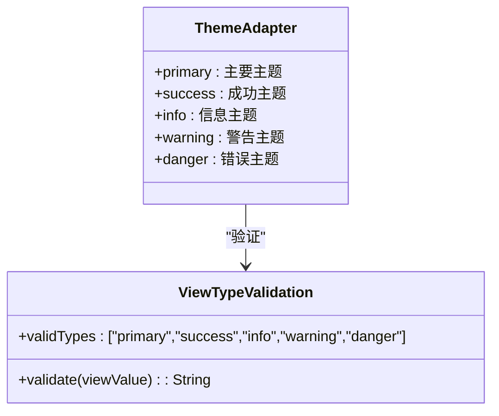

**图表来源**
- [msgIcon.vue:27-31](file://antflow-vue/src/components/Workflow/components/msgIcon.vue#L27-L31)

**章节来源**
- [msgIcon.vue:22-31](file://antflow-vue/src/components/Workflow/components/msgIcon.vue#L22-L31)

### 使用场景详解

#### 流程状态提示

在工作流设计器中，消息图标用于标识不同节点的状态和类型：

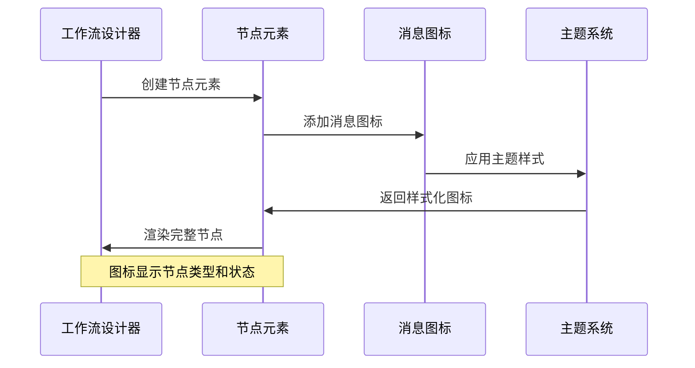

#### 通知提醒系统

在通知配置界面中，消息图标用于标识不同的通知类型：

| 通知类型 | 图标类型 | 常量值 | 使用场景 |
|----------|----------|--------|----------|
| 邮件通知 | Message | 2 | Email通知 |
| 短信通知 | Iphone | 6 | SMS通知 |
| 推送通知 | BellFilled | 3 | App推送 |
| 企业微信 | Eleme | 5 | WeChat Work |
| 钉钉通知 | Eleme | 6 | DingTalk |
| 飞书通知 | Eleme | 7 | Feishu |

**章节来源**
- [const.js:280-311](file://antflow-vue/src/utils/antflow/const.js#L280-L311)

#### 错误标识系统

在错误处理和状态指示中，消息图标提供了直观的视觉反馈：

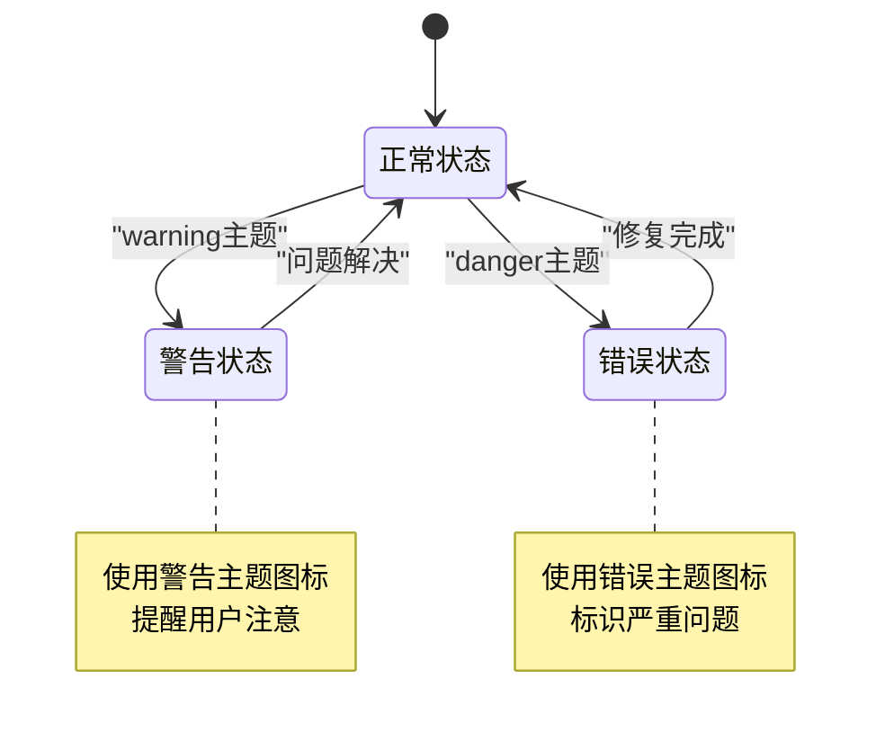

## 依赖关系分析

### 组件依赖图

消息图标组件的依赖关系相对简单但功能明确：

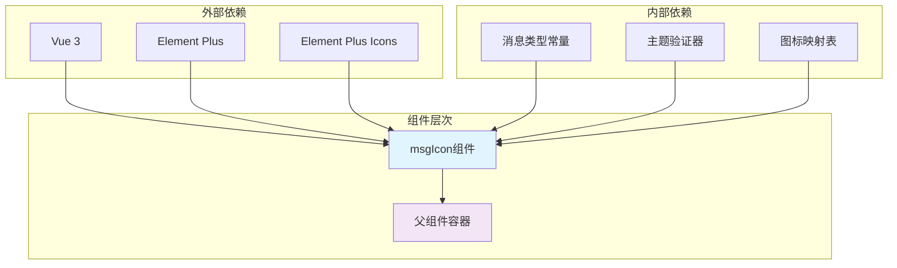

**图表来源**
- [msgIcon.vue:9-12](file://antflow-vue/src/components/Workflow/components/msgIcon.vue#L9-L12)

### 数据流分析

组件的数据流遵循单向数据流原则，确保了数据的一致性和可预测性：

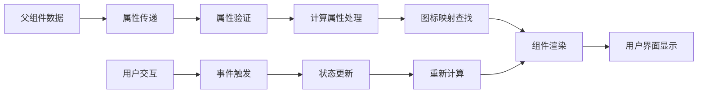

**图表来源**
- [msgIcon.vue:28-36](file://antflow-vue/src/components/Workflow/components/msgIcon.vue#L28-L36)

**章节来源**
- [msgIcon.vue:8-36](file://antflow-vue/src/components/Workflow/components/msgIcon.vue#L8-L36)

## 性能考虑

### 渲染优化策略

消息图标组件在设计时充分考虑了性能优化：

1. **响应式计算属性** - 使用`computed`属性缓存计算结果，避免重复计算
2. **懒加载机制** - 图标组件按需加载，减少初始渲染负担
3. **最小DOM操作** - 通过虚拟DOM优化，减少实际的DOM操作次数

### 内存管理

组件采用了有效的内存管理策略：

- **引用清理** - 在组件销毁时自动清理引用
- **事件监听器** - 使用`watchEffect`自动管理监听器生命周期
- **计算属性缓存** - 避免不必要的重新计算

## 故障排除指南

### 常见问题诊断

#### 图标不显示问题

**症状**: 消息图标无法正常显示

**可能原因**:
1. `iconValue`属性值不在有效范围内
2. Element Plus图标库未正确引入
3. 主题类型无效

**解决方案**:
1. 检查`iconValue`是否为1-7之间的有效数字
2. 确认Element Plus图标库已正确安装和导入
3. 验证`viewValue`是否为支持的主题类型之一

#### 尺寸异常问题

**症状**: 图标尺寸不符合预期

**可能原因**:
1. `sizeValue`属性类型不正确
2. CSS样式覆盖冲突
3. 响应式布局影响

**解决方案**:
1. 确保`sizeValue`为有效的数字或字符串
2. 检查是否有CSS样式覆盖
3. 调整容器的CSS样式

#### 主题显示异常

**症状**: 图标颜色不符合预期

**可能原因**:
1. `viewValue`属性值无效
2. Element Plus主题配置问题
3. 样式优先级冲突

**解决方案**:
1. 使用支持的主题类型：primary、success、info、warning、danger
2. 检查Element Plus主题配置
3. 调整CSS优先级或使用更具体的选择器

**章节来源**
- [msgIcon.vue:27-31](file://antflow-vue/src/components/Workflow/components/msgIcon.vue#L27-L31)

## 结论

消息图标组件作为AntFlow工作流系统的重要组成部分，展现了现代前端组件设计的最佳实践。该组件通过简洁的API设计、灵活的配置选项和强大的主题系统，为用户提供了直观而一致的视觉体验。

组件的主要优势包括：

1. **高度可定制性** - 支持多种主题类型和尺寸调整
2. **良好的性能表现** - 优化的渲染机制和内存管理
3. **完善的错误处理** - 全面的属性验证和容错机制
4. **深度系统集成** - 与工作流系统的无缝对接

通过合理使用该组件，开发者可以快速实现各种消息状态的可视化展示，提升用户体验和系统的易用性。

## 附录

### 使用示例

#### 基础使用

```vue
<!-- 基本用法 -->
<msgIcon :iconValue="2" />

<!-- 指定主题 -->
<msgIcon :iconValue="3" viewValue="warning" />

<!-- 自定义尺寸 -->
<msgIcon :iconValue="1" :sizeValue="20" />
```

#### 高级应用场景

```vue
<!-- 在通知配置中使用 -->
<el-checkbox v-for="item in messageSendTypeList" :key="item.id">
  {{ item.name }}
  <msgIcon v-model:iconValue="item.id" viewValue="primary" />
</el-checkbox>
```

### 最佳实践建议

1. **属性验证**: 始终验证传入的属性值，确保在有效范围内
2. **主题一致性**: 在同一界面中保持主题类型的统一性
3. **性能优化**: 合理使用计算属性，避免不必要的重新渲染
4. **样式隔离**: 使用作用域样式，避免全局样式污染