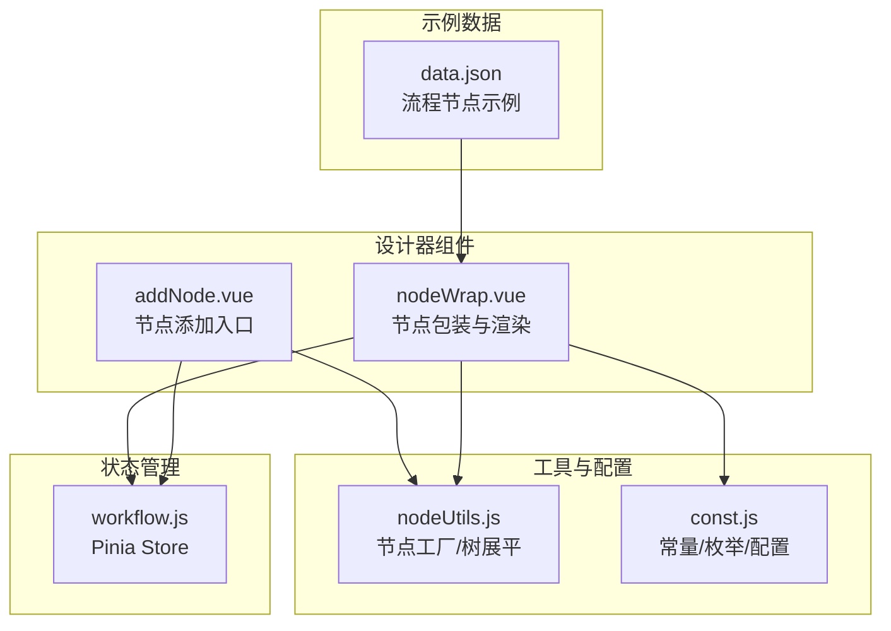
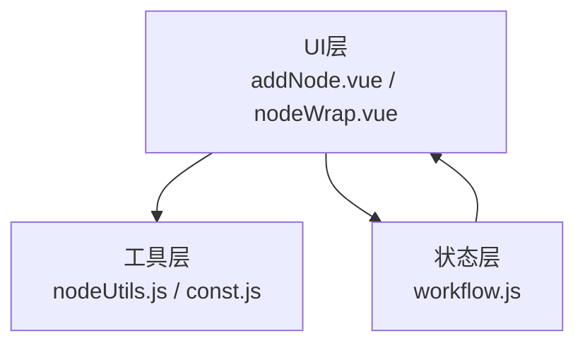
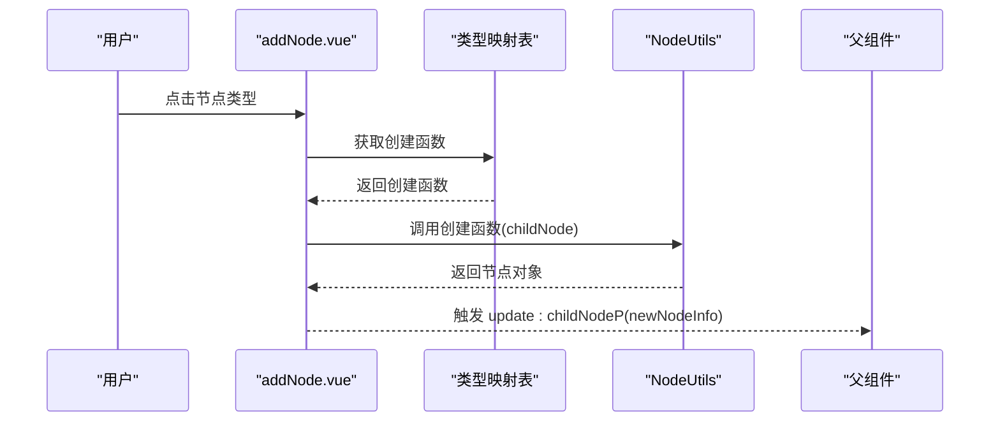
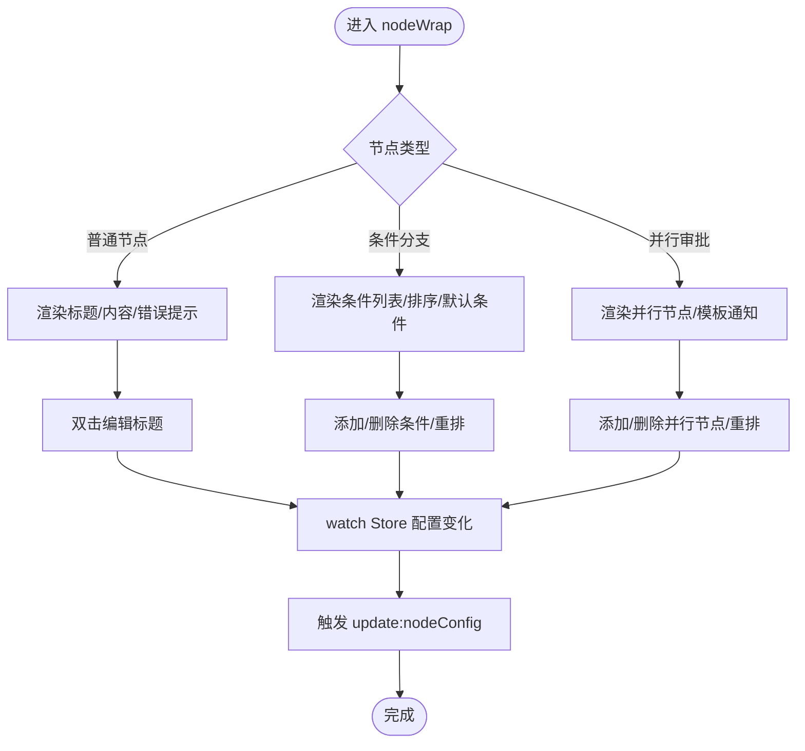
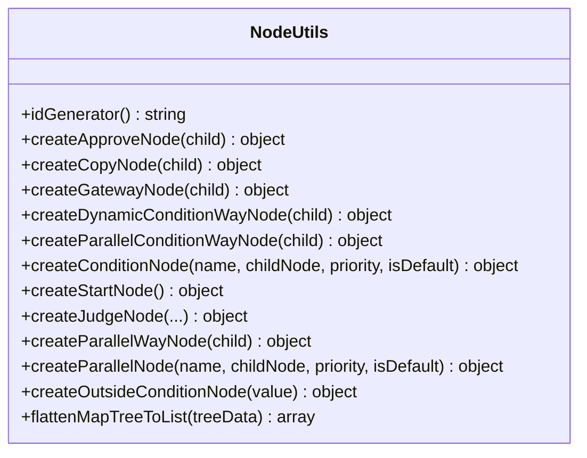
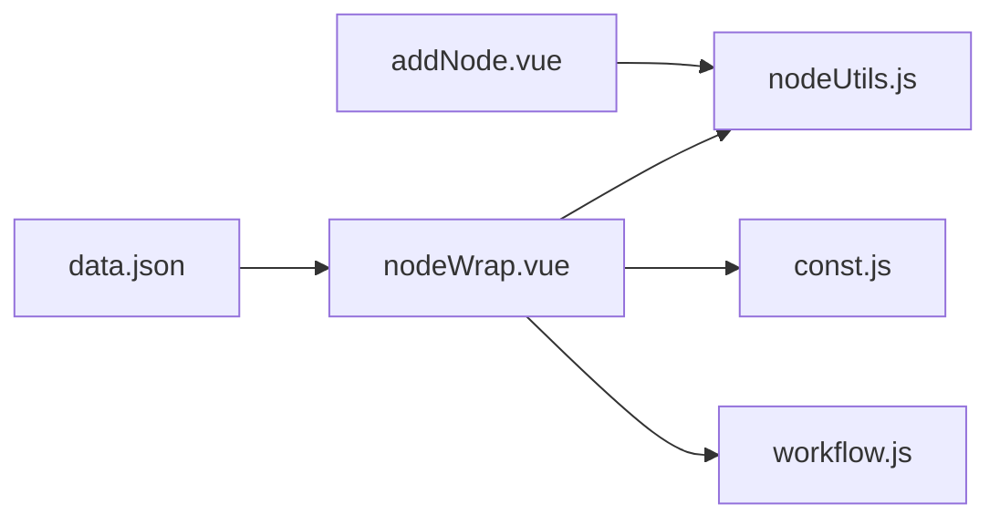

# 设计器组件

<cite>
**本文引用的文件**
- [addNode.vue](file://antflow-vue/src/components/Workflow/addNode.vue)
- [nodeWrap.vue](file://antflow-vue/src/components/Workflow/nodeWrap.vue)
- [nodeUtils.js](file://antflow-vue/src/utils/antflow/nodeUtils.js)
- [const.js](file://antflow-vue/src/utils/antflow/const.js)
- [workflow.js](file://antflow-vue/src/store/modules/workflow.js)
- [data.json](file://antflow-vue/public/mock/data.json)
</cite>

## 目录
1. [简介](#简介)
2. [项目结构](#项目结构)
3. [核心组件](#核心组件)
4. [架构总览](#架构总览)
5. [详细组件分析](#详细组件分析)
6. [依赖分析](#依赖分析)
7. [性能考虑](#性能考虑)
8. [故障排查指南](#故障排查指南)
9. [结论](#结论)
10. [附录](#附录)

## 简介
本文件面向设计器组件，聚焦以下目标：
- 深入解释节点添加组件(addNode)的功能实现，包括节点类型选择、拖拽交互、节点生成逻辑
- 详细说明节点包装组件(nodeWrap)的作用机制，包括节点渲染、属性编辑、事件处理
- 阐述设计器中节点的生命周期管理、数据绑定方式、状态同步机制
- 提供节点配置的完整示例，包括节点属性设置、连线规则、条件配置
- 帮助开发者理解设计器的核心交互逻辑和扩展方式

## 项目结构
设计器相关的核心文件位于 antflow-vue 工程中，主要包含：
- 组件层：addNode.vue、nodeWrap.vue
- 工具层：nodeUtils.js（节点工厂与树展平）、const.js（常量与配置）
- 状态层：workflow.js（Pinia Store，集中管理设计器状态）
- 示例数据：data.json（流程节点示例）

图表来源
- [addNode.vue:1-252](file://antflow-vue/src/components/Workflow/addNode.vue#L1-L252)
- [nodeWrap.vue:1-503](file://antflow-vue/src/components/Workflow/nodeWrap.vue#L1-L503)
- [nodeUtils.js:1-412](file://antflow-vue/src/utils/antflow/nodeUtils.js#L1-L412)
- [const.js:1-359](file://antflow-vue/src/utils/antflow/const.js#L1-L359)
- [workflow.js:1-69](file://antflow-vue/src/store/modules/workflow.js#L1-L69)
- [data.json:1-406](file://antflow-vue/public/mock/data.json#L1-L406)

章节来源
- [addNode.vue:1-252](file://antflow-vue/src/components/Workflow/addNode.vue#L1-L252)
- [nodeWrap.vue:1-503](file://antflow-vue/src/components/Workflow/nodeWrap.vue#L1-L503)
- [nodeUtils.js:1-412](file://antflow-vue/src/utils/antflow/nodeUtils.js#L1-L412)
- [const.js:1-359](file://antflow-vue/src/utils/antflow/const.js#L1-L359)
- [workflow.js:1-69](file://antflow-vue/src/store/modules/workflow.js#L1-L69)
- [data.json:1-406](file://antflow-vue/public/mock/data.json#L1-L406)

## 核心组件
- 节点添加组件(addNode)：提供节点类型选择面板，基于类型映射调用节点工厂生成节点，触发父组件更新
- 节点包装组件(nodeWrap)：负责节点渲染、可编辑标题、条件/并行节点列表、事件处理、状态同步
- 节点工具(nodeUtils)：统一生成各类节点对象、初始化流程数据、树形展平
- 常量配置(const)：节点类型、占位符、审批方式、按钮配置等
- 状态管理(workflow)：集中管理设计器状态（如“是否已尝试提交”、“各节点配置”等）

章节来源
- [addNode.vue:54-104](file://antflow-vue/src/components/Workflow/addNode.vue#L54-L104)
- [nodeWrap.vue:140-467](file://antflow-vue/src/components/Workflow/nodeWrap.vue#L140-L467)
- [nodeUtils.js:26-357](file://antflow-vue/src/utils/antflow/nodeUtils.js#L26-L357)
- [const.js:8-359](file://antflow-vue/src/utils/antflow/const.js#L8-L359)
- [workflow.js:1-69](file://antflow-vue/src/store/modules/workflow.js#L1-L69)

## 架构总览
设计器采用“组件-工具-状态”的分层架构：
- 组件层负责交互与渲染
- 工具层负责数据模型与工厂方法
- 状态层负责跨组件共享的状态与事件

图表来源
- [addNode.vue:54-104](file://antflow-vue/src/components/Workflow/addNode.vue#L54-L104)
- [nodeWrap.vue:140-467](file://antflow-vue/src/components/Workflow/nodeWrap.vue#L140-L467)
- [nodeUtils.js:1-412](file://antflow-vue/src/utils/antflow/nodeUtils.js#L1-L412)
- [const.js:1-359](file://antflow-vue/src/utils/antflow/const.js#L1-L359)
- [workflow.js:1-69](file://antflow-vue/src/store/modules/workflow.js#L1-L69)

## 详细组件分析

### 节点添加组件(addNode)分析
- 节点类型选择
  - 支持审批人、并行审批、抄送人、条件分支、动态条件、条件并行
  - 通过类型到创建函数的映射表完成分发
- 交互与事件
  - 点击类型项后关闭弹窗，调用对应创建函数生成节点对象
  - 触发 update:childNodeP 事件，将新节点传递给父组件
- 节点生成逻辑
  - 使用 NodeUtils 工厂方法生成标准节点对象，包含节点ID、类型、默认属性、按钮配置等
- 扩展性
  - 新增节点类型只需在映射表中注册创建函数

图表来源
- [addNode.vue:89-103](file://antflow-vue/src/components/Workflow/addNode.vue#L89-L103)
- [nodeUtils.js:26-357](file://antflow-vue/src/utils/antflow/nodeUtils.js#L26-L357)

章节来源
- [addNode.vue:54-104](file://antflow-vue/src/components/Workflow/addNode.vue#L54-L104)
- [nodeUtils.js:26-357](file://antflow-vue/src/utils/antflow/nodeUtils.js#L26-L357)

### 节点包装组件(nodeWrap)分析
- 渲染策略
  - 普通节点：标题区域（可编辑名称）、内容区域（点击打开配置）、错误提示
  - 条件分支：条件列表、优先级排序、默认条件处理、错误状态重置
  - 并行审批：并行节点列表、模板通知图标、错误状态重置
- 属性编辑
  - 双击标题进入编辑模式，失焦保存；默认名为空时回填占位符
  - 条件/并行节点支持批量重命名与重排
- 事件处理
  - 点击“设置节点信息”打开对应配置抽屉（发起人/审批人/抄送人/条件），并通过 Store 同步配置
  - 添加/删除条件或并行节点时，维护优先级与默认条件
- 生命周期与状态同步
  - mounted 时根据节点类型重置条件/并行节点的错误状态与展示名
  - 通过 watch 监听 Store 中的配置变化，将更新同步回 props.nodeConfig
  - isTried 控制错误提示的显示时机

图表来源
- [nodeWrap.vue:188-233](file://antflow-vue/src/components/Workflow/nodeWrap.vue#L188-L233)
- [nodeWrap.vue:235-257](file://antflow-vue/src/components/Workflow/nodeWrap.vue#L235-L257)
- [nodeWrap.vue:402-448](file://antflow-vue/src/components/Workflow/nodeWrap.vue#L402-L448)

章节来源
- [nodeWrap.vue:140-467](file://antflow-vue/src/components/Workflow/nodeWrap.vue#L140-L467)
- [workflow.js:1-69](file://antflow-vue/src/store/modules/workflow.js#L1-L69)

### 节点工厂与树展平分析
- 节点工厂
  - 审批人、抄送人、网关（含动态条件、条件并行）、并行网关、条件节点、并行节点等
  - 统一生成节点ID（基于时间戳与随机数的64进制生成器）、默认属性、按钮配置、模板/表单字段等
- 树展平
  - 递归遍历节点树，填充 nodeFrom/nodeTo，形成扁平化的节点列表，便于序列化与传输

图表来源
- [nodeUtils.js:1-412](file://antflow-vue/src/utils/antflow/nodeUtils.js#L1-L412)

章节来源
- [nodeUtils.js:1-412](file://antflow-vue/src/utils/antflow/nodeUtils.js#L1-L412)

### 常量与配置分析
- 节点类型与占位符
  - 节点类型列表、背景色映射、占位符文本
- 审批方式与人员设置
  - 审批方式（会签/或签/顺序会签）、人员设置类型（指定人员/角色/Hrpb/层级等）
- 按钮配置
  - 发起页/审批页/查看页按钮集合及其描述
- 条件判断映射
  - 表单控件类型到后端字段类型的映射，用于条件节点与引擎对接

章节来源
- [const.js:8-359](file://antflow-vue/src/utils/antflow/const.js#L8-L359)

## 依赖分析
- 组件间依赖
  - addNode.vue 依赖 nodeUtils.js 进行节点创建
  - nodeWrap.vue 依赖 nodeUtils.js、const.js、workflow.js
- 状态依赖
  - nodeWrap.vue 通过 Pinia Store 的 watcher 将配置变更回传给父组件
- 数据依赖
  - 示例数据 data.json 展示了真实流程节点的结构，可用于理解节点属性与连线关系

图表来源
- [addNode.vue:54-104](file://antflow-vue/src/components/Workflow/addNode.vue#L54-L104)
- [nodeWrap.vue:140-467](file://antflow-vue/src/components/Workflow/nodeWrap.vue#L140-L467)
- [nodeUtils.js:1-412](file://antflow-vue/src/utils/antflow/nodeUtils.js#L1-L412)
- [const.js:1-359](file://antflow-vue/src/utils/antflow/const.js#L1-L359)
- [workflow.js:1-69](file://antflow-vue/src/store/modules/workflow.js#L1-L69)
- [data.json:1-406](file://antflow-vue/public/mock/data.json#L1-L406)

章节来源
- [addNode.vue:54-104](file://antflow-vue/src/components/Workflow/addNode.vue#L54-L104)
- [nodeWrap.vue:140-467](file://antflow-vue/src/components/Workflow/nodeWrap.vue#L140-L467)
- [nodeUtils.js:1-412](file://antflow-vue/src/utils/antflow/nodeUtils.js#L1-L412)
- [const.js:1-359](file://antflow-vue/src/utils/antflow/const.js#L1-L359)
- [workflow.js:1-69](file://antflow-vue/src/store/modules/workflow.js#L1-L69)
- [data.json:1-406](file://antflow-vue/public/mock/data.json#L1-L406)

## 性能考虑
- 节点ID生成
  - 使用基于时间戳与随机数的64进制生成器，避免重复同时具备一定随机性
- 树展平算法
  - 递归遍历，时间复杂度 O(N)，建议在大型流程中按需调用
- 状态同步
  - 通过 Pinia 的 watcher 实现双向绑定，注意避免不必要的深度拷贝与频繁触发

## 故障排查指南
- 节点名称为空
  - 失焦时若未输入名称，将回填默认占位符；检查占位符映射与 isInput/isInputList 状态
- 条件节点错误提示
  - 当条件未设置或默认条件缺失时，错误状态会被重置；检查 resetConditionNodesErr 逻辑
- 并行节点错误提示
  - 当并行节点未配置审批人时标记错误；检查 resetParallelNodesErr 逻辑
- 状态不同步
  - 确认 Store 中的 watcher 是否正确触发 update:nodeConfig；检查 _uid 与 flag/id 匹配

章节来源
- [nodeWrap.vue:188-233](file://antflow-vue/src/components/Workflow/nodeWrap.vue#L188-L233)
- [nodeWrap.vue:235-257](file://antflow-vue/src/components/Workflow/nodeWrap.vue#L235-L257)
- [nodeWrap.vue:275-287](file://antflow-vue/src/components/Workflow/nodeWrap.vue#L275-L287)
- [nodeWrap.vue:384-397](file://antflow-vue/src/components/Workflow/nodeWrap.vue#L384-L397)

## 结论
设计器组件通过清晰的分层设计实现了节点的可视化添加与管理：
- addNode 提供直观的节点类型选择与生成
- nodeWrap 负责复杂的节点渲染、编辑与状态同步
- nodeUtils 与 const.js 提供稳定的模型与配置支撑
- workflow.js 保证跨组件状态一致性

该架构易于扩展：新增节点类型只需完善工厂方法与 UI 映射；条件/并行节点的交互逻辑可复用。

## 附录

### 节点配置示例（基于示例数据）
- 发起人节点
  - 节点ID、类型、显示名、按钮配置、连线关系
- 审批人节点
  - 节点ID、类型、人员设置、审批方式、按钮配置
- 抄送人节点
  - 节点ID、类型、人员设置、按钮配置
- 并行网关节点
  - 节点ID、类型、并行节点列表、连线关系
- 路由节点
  - 节点ID、类型、连线关系

章节来源
- [data.json:29-391](file://antflow-vue/public/mock/data.json#L29-L391)