# 配置抽屉组件

<cite>
**本文档引用的文件**
- [approverDrawer.vue](file://antflow-vue/src/components/Workflow/drawer/approverDrawer.vue)
- [conditionDrawer.vue](file://antflow-vue/src/components/Workflow/drawer/conditionDrawer.vue)
- [copyerDrawer.vue](file://antflow-vue/src/components/Workflow/drawer/copyerDrawer.vue)
- [promoterDrawer.vue](file://antflow-vue/src/components/Workflow/drawer/promoterDrawer.vue)
- [noticeConfig/index.vue](file://antflow-vue/src/components/Workflow/drawer/noticeConfig/index.vue)
- [permConfig/FormPermConf.vue](file://antflow-vue/src/components/Workflow/drawer/permConfig/FormPermConf.vue)
- [selectUserDialog.vue](file://antflow-vue/src/components/Workflow/dialog/selectUserDialog.vue)
- [selectRoleDialog.vue](file://antflow-vue/src/components/Workflow/dialog/selectRoleDialog.vue)
- [const.js](file://antflow-vue/src/utils/antflow/const.js)
- [workflow.js](file://antflow-vue/src/store/modules/workflow.js)
</cite>

## 目录
1. [简介](#简介)
2. [项目结构](#项目结构)
3. [核心组件](#核心组件)
4. [架构概览](#架构概览)
5. [详细组件分析](#详细组件分析)
6. [依赖关系分析](#依赖关系分析)
7. [性能考虑](#性能考虑)
8. [故障排除指南](#故障排除指南)
9. [结论](#结论)

## 简介

配置抽屉组件是AntFlow工作流系统中的重要配置界面，提供了完整的流程配置能力。本文档详细介绍了四个核心配置抽屉组件的功能实现：

- **审批人配置抽屉(approverDrawer)**：负责审批人选择、层级设置、权限控制
- **条件配置抽屉(conditionDrawer)**：处理条件表达式编辑、变量绑定、规则验证
- **抄送配置抽屉(copyerDrawer)**：管理抄送对象选择、通知设置
- **发起人配置抽屉(promoterDrawer)**：实现权限管理功能

这些组件通过统一的状态管理和事件机制，为用户提供直观的流程配置体验。

## 项目结构

配置抽屉组件位于AntFlow前端项目的Workflow模块中，采用模块化的组织方式：

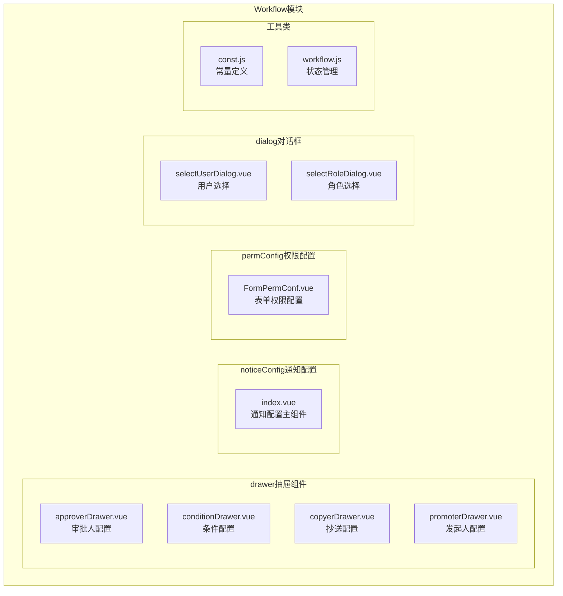

**图表来源**
- [approverDrawer.vue:1-413](file://antflow-vue/src/components/Workflow/drawer/approverDrawer.vue#L1-L413)
- [conditionDrawer.vue:1-474](file://antflow-vue/src/components/Workflow/drawer/conditionDrawer.vue#L1-L474)
- [copyerDrawer.vue:1-165](file://antflow-vue/src/components/Workflow/drawer/copyerDrawer.vue#L1-L165)
- [promoterDrawer.vue:1-87](file://antflow-vue/src/components/Workflow/drawer/promoterDrawer.vue#L1-L87)

**章节来源**
- [approverDrawer.vue:1-50](file://antflow-vue/src/components/Workflow/drawer/approverDrawer.vue#L1-L50)
- [conditionDrawer.vue:1-50](file://antflow-vue/src/components/Workflow/drawer/conditionDrawer.vue#L1-L50)
- [copyerDrawer.vue:1-50](file://antflow-vue/src/components/Workflow/drawer/copyerDrawer.vue#L1-L50)
- [promoterDrawer.vue:1-50](file://antflow-vue/src/components/Workflow/drawer/promoterDrawer.vue#L1-L50)

## 核心组件

### 组件架构设计

所有配置抽屉组件都遵循统一的架构模式：

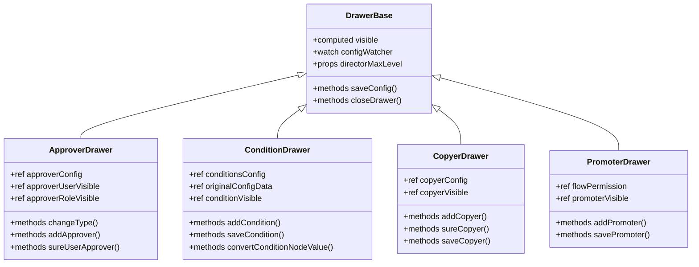

**图表来源**
- [approverDrawer.vue:164-350](file://antflow-vue/src/components/Workflow/drawer/approverDrawer.vue#L164-L350)
- [conditionDrawer.vue:201-368](file://antflow-vue/src/components/Workflow/drawer/conditionDrawer.vue#L201-L368)
- [copyerDrawer.vue:44-120](file://antflow-vue/src/components/Workflow/drawer/copyerDrawer.vue#L44-L120)
- [promoterDrawer.vue:24-67](file://antflow-vue/src/components/Workflow/drawer/promoterDrawer.vue#L24-L67)

### 状态管理模式

组件通过Pinia状态管理实现数据共享：

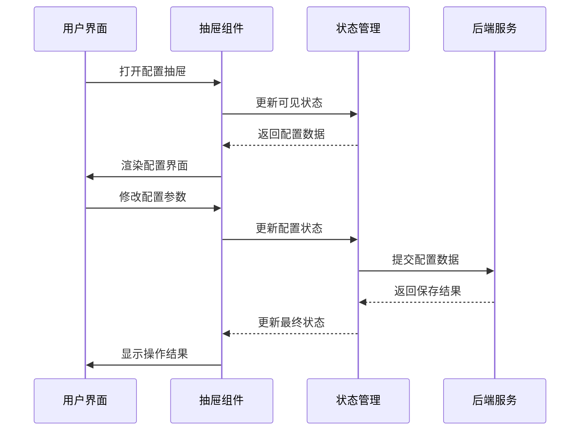

**图表来源**
- [workflow.js:1-69](file://antflow-vue/src/store/modules/workflow.js#L1-L69)
- [approverDrawer.vue:198-224](file://antflow-vue/src/components/Workflow/drawer/approverDrawer.vue#L198-L224)

**章节来源**
- [workflow.js:1-69](file://antflow-vue/src/store/modules/workflow.js#L1-L69)
- [const.js:1-359](file://antflow-vue/src/utils/antflow/const.js#L1-L359)

## 架构概览

### 组件间依赖关系

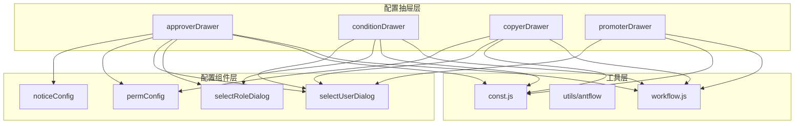

**图表来源**
- [approverDrawer.vue:169-172](file://antflow-vue/src/components/Workflow/drawer/approverDrawer.vue#L169-L172)
- [conditionDrawer.vue:203-206](file://antflow-vue/src/components/Workflow/drawer/conditionDrawer.vue#L203-L206)
- [copyerDrawer.vue:46-47](file://antflow-vue/src/components/Workflow/drawer/copyerDrawer.vue#L46-L47)
- [promoterDrawer.vue:26-27](file://antflow-vue/src/components/Workflow/drawer/promoterDrawer.vue#L26-L27)

### 数据流架构

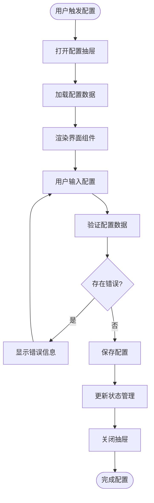

**图表来源**
- [approverDrawer.vue:303-313](file://antflow-vue/src/components/Workflow/drawer/approverDrawer.vue#L303-L313)
- [conditionDrawer.vue:239-264](file://antflow-vue/src/components/Workflow/drawer/conditionDrawer.vue#L239-L264)

## 详细组件分析

### 审批人配置抽屉 (approverDrawer)

#### 功能特性

审批人配置抽屉提供了丰富的审批人设置选项：

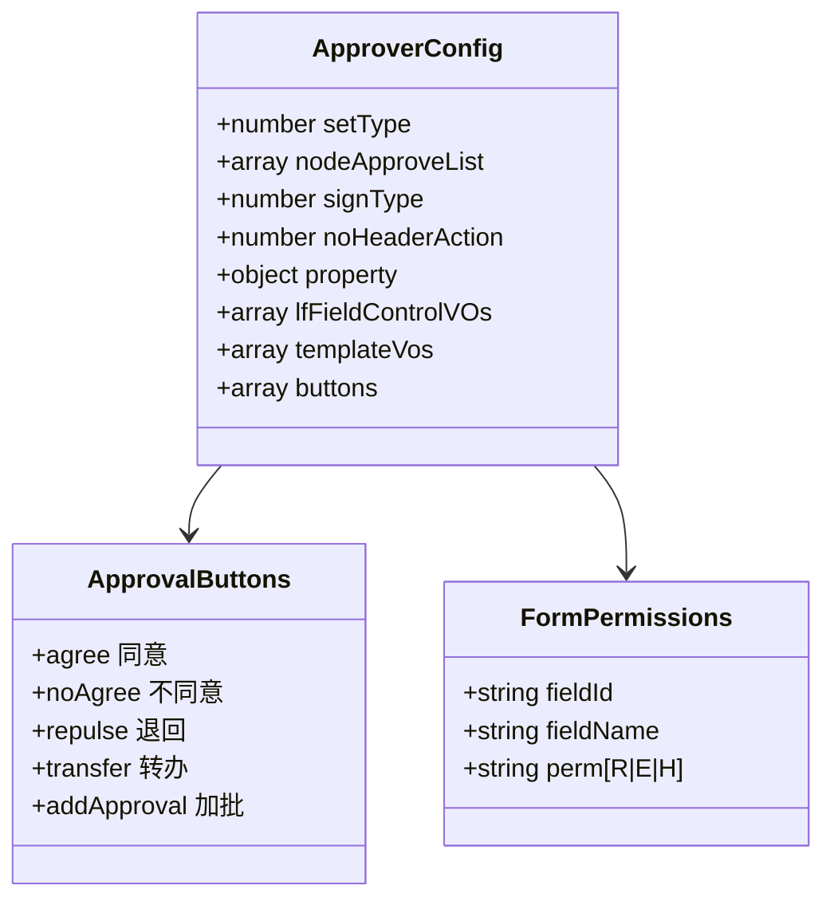

**图表来源**
- [approverDrawer.vue:181-190](file://antflow-vue/src/components/Workflow/drawer/approverDrawer.vue#L181-L190)
- [const.js:129-160](file://antflow-vue/src/utils/antflow/const.js#L129-L160)

#### 审批人类型配置

组件支持多种审批人配置方式：

| 配置类型 | 数值标识 | 功能描述 |
|---------|---------|----------|
| 指定人员 | 5 | 选择具体的用户作为审批人 |
| 指定角色 | 4 | 选择角色，系统自动匹配角色成员 |
| HRBP | 6 | 选择HRBP或HRBP Leader |
| 直属领导 | 13 | 选择直属领导作为审批人 |
| 指定层级审批 | 3 | 按组织层级选择审批人 |
| 发起人自己 | 12 | 审批人为发起人本人 |
| 发起人自选审批人 | 7 | 发起人在申请时选择审批人 |

#### 权限控制机制

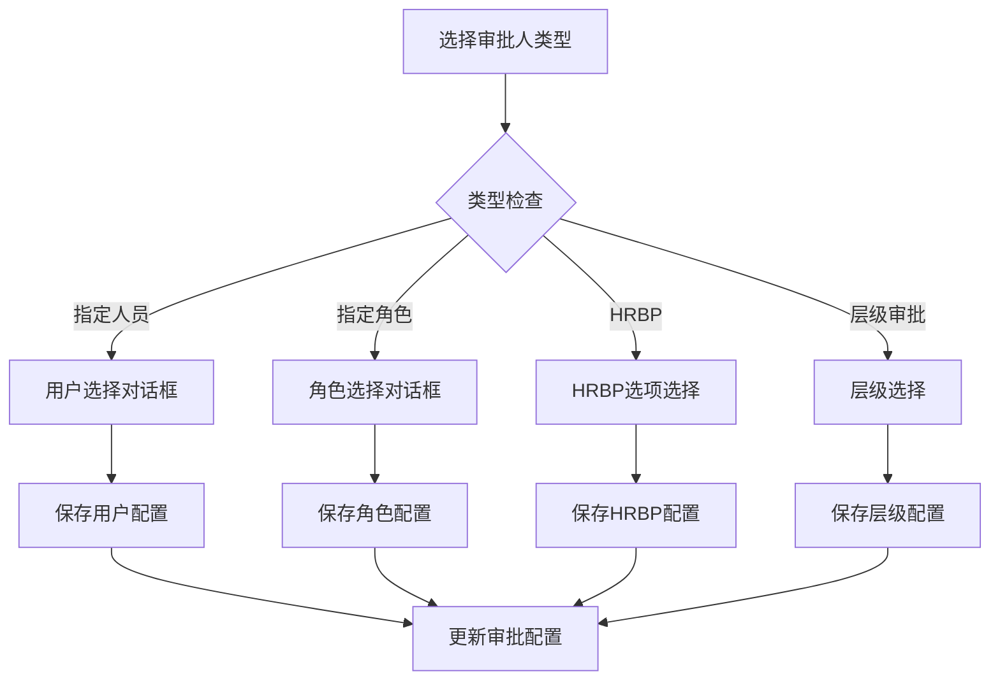

**图表来源**
- [approverDrawer.vue:250-278](file://antflow-vue/src/components/Workflow/drawer/approverDrawer.vue#L250-L278)
- [selectUserDialog.vue:174-182](file://antflow-vue/src/components/Workflow/dialog/selectUserDialog.vue#L174-L182)
- [selectRoleDialog.vue:145-155](file://antflow-vue/src/components/Workflow/dialog/selectRoleDialog.vue#L145-L155)

**章节来源**
- [approverDrawer.vue:1-413](file://antflow-vue/src/components/Workflow/drawer/approverDrawer.vue#L1-L413)
- [selectUserDialog.vue:1-203](file://antflow-vue/src/components/Workflow/dialog/selectUserDialog.vue#L1-L203)
- [selectRoleDialog.vue:1-174](file://antflow-vue/src/components/Workflow/dialog/selectRoleDialog.vue#L1-L174)

### 条件配置抽屉 (conditionDrawer)

#### 条件表达式编辑器

条件配置抽屉提供了强大的条件表达式编辑功能：

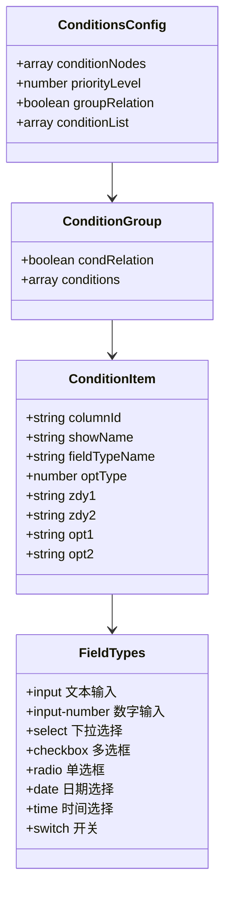

**图表来源**
- [conditionDrawer.vue:213-216](file://antflow-vue/src/components/Workflow/drawer/conditionDrawer.vue#L213-L216)
- [const.js:208-252](file://antflow-vue/src/utils/antflow/const.js#L208-L252)

#### 条件验证机制

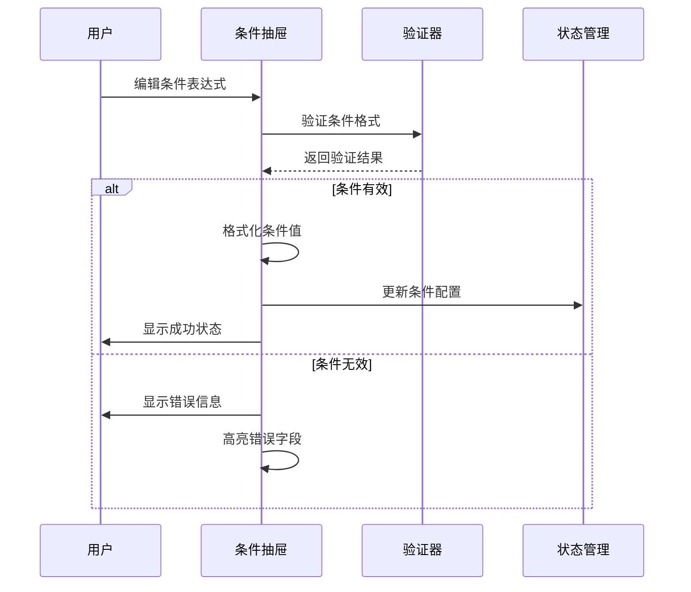

**图表来源**
- [conditionDrawer.vue:239-264](file://antflow-vue/src/components/Workflow/drawer/conditionDrawer.vue#L239-L264)
- [conditionDrawer.vue:318-367](file://antflow-vue/src/components/Workflow/drawer/conditionDrawer.vue#L318-L367)

#### 条件类型支持

| 字段类型 | 支持的操作符 | 特殊处理 |
|---------|-------------|----------|
| input | 等于、包含、不等于 | 文本匹配 |
| input-number | 大于、小于、等于、范围 | 数值比较 |
| select | 等于、不等于 | 下拉选项匹配 |
| checkbox | 包含、不包含 | 多选值处理 |
| radio | 等于 | 单选值处理 |
| date | 大于、小于、等于 | 日期格式转换 |
| time | 大于、小于、等于 | 时间格式转换 |
| switch | 等于 | 布尔值处理 |

**章节来源**
- [conditionDrawer.vue:1-474](file://antflow-vue/src/components/Workflow/drawer/conditionDrawer.vue#L1-L474)
- [const.js:58-70](file://antflow-vue/src/utils/antflow/const.js#L58-L70)

### 抄送配置抽屉 (copyerDrawer)

#### 抄送对象管理

抄送配置抽屉专注于抄送对象的选择和管理：

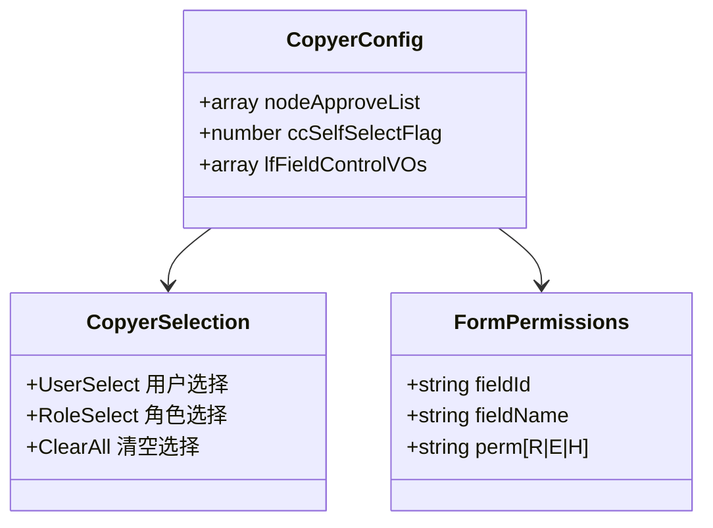

**图表来源**
- [copyerDrawer.vue:50-54](file://antflow-vue/src/components/Workflow/drawer/copyerDrawer.vue#L50-L54)
- [permConfig/FormPermConf.vue:1-88](file://antflow-vue/src/components/Workflow/drawer/permConfig/FormPermConf.vue#L1-L88)

#### 抄送权限配置

抄送配置支持灵活的表单权限控制：

| 权限级别 | 标识 | 描述 |
|---------|------|------|
| 只读 | R | 抄送人只能查看表单内容 |
| 可编辑 | E | 抄送人可以编辑表单内容 |
| 隐藏 | H | 表单字段对抄送人不可见 |

**章节来源**
- [copyerDrawer.vue:1-165](file://antflow-vue/src/components/Workflow/drawer/copyerDrawer.vue#L1-L165)
- [permConfig/FormPermConf.vue:1-88](file://antflow-vue/src/components/Workflow/drawer/permConfig/FormPermConf.vue#L1-L88)

### 发起人配置抽屉 (promoterDrawer)

#### 权限管理功能

发起人配置抽屉专门处理流程发起权限的设置：

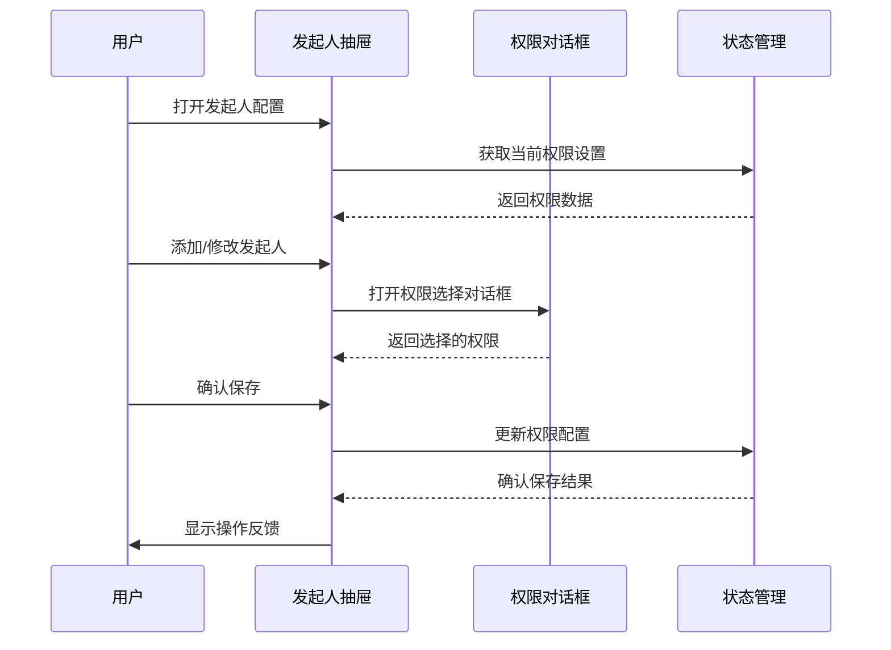

**图表来源**
- [promoterDrawer.vue:48-66](file://antflow-vue/src/components/Workflow/drawer/promoterDrawer.vue#L48-L66)
- [selectUserDialog.vue:174-182](file://antflow-vue/src/components/Workflow/dialog/selectUserDialog.vue#L174-L182)

**章节来源**
- [promoterDrawer.vue:1-87](file://antflow-vue/src/components/Workflow/drawer/promoterDrawer.vue#L1-L87)

### 通知配置组件 (noticeConfig)

#### 通知设置选项

通知配置组件提供了全面的消息通知设置：

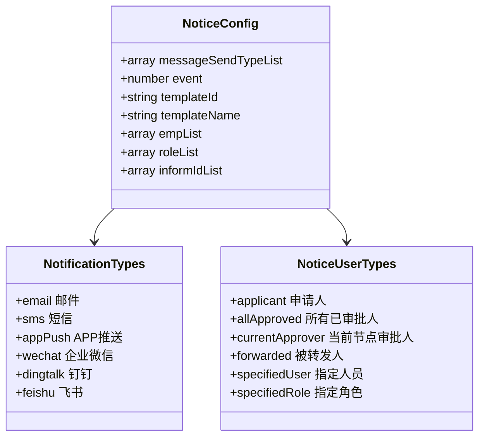

**图表来源**
- [noticeConfig/index.vue:117-125](file://antflow-vue/src/components/Workflow/drawer/noticeConfig/index.vue#L117-L125)
- [const.js:280-311](file://antflow-vue/src/utils/antflow/const.js#L280-L311)
- [const.js:254-279](file://antflow-vue/src/utils/antflow/const.js#L254-L279)

#### 事件类型配置

| 事件类型 | 数值标识 | 描述 |
|---------|---------|------|
| 流程发起 | 1 | 流程开始时触发 |
| 作废操作 | 2 | 流程被作废时触发 |
| 流程流转 | 3 | 流程到达当前节点时触发 |
| 同意操作 | 4 | 审批同意时触发 |
| 不同意操作 | 5 | 审批不同意时触发 |
| 加批操作 | 6 | 进行加批操作时触发 |
| 退回修改 | 7 | 退回修改时触发 |
| 转发操作 | 8 | 流程被转发时触发 |
| 流程结束 | 9 | 流程完成时触发 |

**章节来源**
- [noticeConfig/index.vue:1-282](file://antflow-vue/src/components/Workflow/drawer/noticeConfig/index.vue#L1-L282)
- [const.js:312-358](file://antflow-vue/src/utils/antflow/const.js#L312-L358)

### 权限配置组件 (permConfig)

#### 表单权限控制

权限配置组件实现了细粒度的表单字段权限控制：

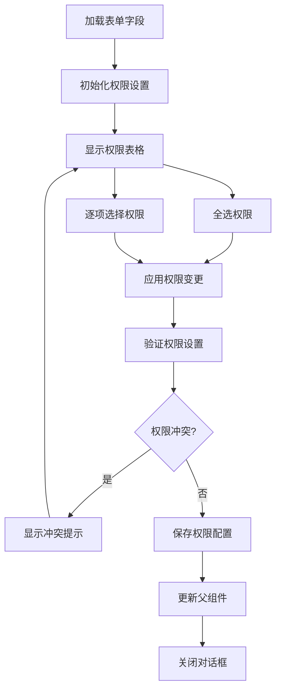

**图表来源**
- [permConfig/FormPermConf.vue:22-43](file://antflow-vue/src/components/Workflow/drawer/permConfig/FormPermConf.vue#L22-L43)

**章节来源**
- [permConfig/FormPermConf.vue:1-88](file://antflow-vue/src/components/Workflow/drawer/permConfig/FormPermConf.vue#L1-L88)

## 依赖关系分析

### 组件依赖图

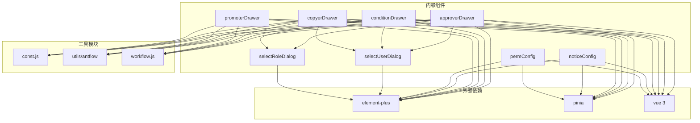

**图表来源**
- [approverDrawer.vue:165-172](file://antflow-vue/src/components/Workflow/drawer/approverDrawer.vue#L165-L172)
- [conditionDrawer.vue:202-206](file://antflow-vue/src/components/Workflow/drawer/conditionDrawer.vue#L202-L206)
- [copyerDrawer.vue:45-49](file://antflow-vue/src/components/Workflow/drawer/copyerDrawer.vue#L45-L49)
- [promoterDrawer.vue:25-27](file://antflow-vue/src/components/Workflow/drawer/promoterDrawer.vue#L25-L27)

### 数据依赖关系

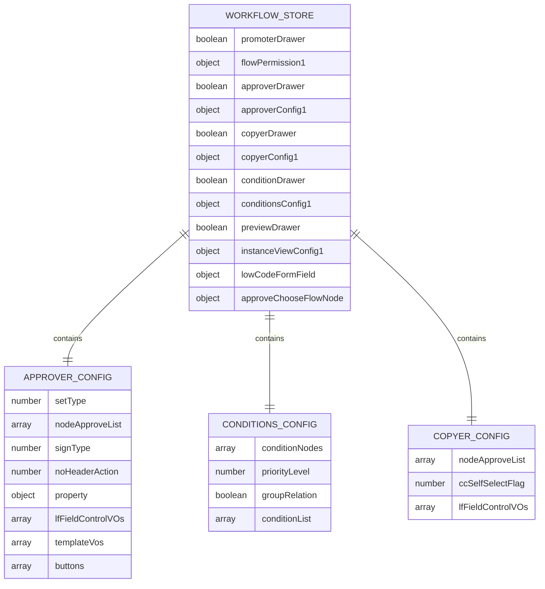

**图表来源**
- [workflow.js:2-20](file://antflow-vue/src/store/modules/workflow.js#L2-L20)
- [approverDrawer.vue:181-190](file://antflow-vue/src/components/Workflow/drawer/approverDrawer.vue#L181-L190)
- [conditionDrawer.vue:213-216](file://antflow-vue/src/components/Workflow/drawer/conditionDrawer.vue#L213-L216)
- [copyerDrawer.vue:50-54](file://antflow-vue/src/components/Workflow/drawer/copyerDrawer.vue#L50-L54)

**章节来源**
- [workflow.js:1-69](file://antflow-vue/src/store/modules/workflow.js#L1-L69)
- [const.js:1-359](file://antflow-vue/src/utils/antflow/const.js#L1-L359)

## 性能考虑

### 优化策略

1. **懒加载机制**：抽屉组件使用`lazy`属性实现按需加载
2. **计算属性缓存**：大量使用`computed`属性避免重复计算
3. **条件渲染**：通过`v-show`和`v-if`控制组件渲染
4. **事件防抖**：对频繁触发的事件进行防抖处理

### 内存管理

- 使用`watchEffect`替代多个`watch`实例
- 及时清理事件监听器和定时器
- 合理使用`ref`和`reactive`避免内存泄漏

## 故障排除指南

### 常见问题及解决方案

#### 审批人配置问题

**问题**：审批人无法保存
**解决方案**：
1. 检查审批人类型是否正确选择
2. 验证审批人列表是否为空
3. 确认权限配置是否有效

#### 条件配置验证失败

**问题**：条件表达式验证失败
**解决方案**：
1. 检查字段类型与操作符的兼容性
2. 验证数值范围和格式
3. 确认条件表达式的语法正确性

#### 通知配置异常

**问题**：通知设置不生效
**解决方案**：
1. 检查通知类型是否正确选择
2. 验证事件类型与流程节点的匹配
3. 确认消息模板是否正确配置

**章节来源**
- [approverDrawer.vue:303-313](file://antflow-vue/src/components/Workflow/drawer/approverDrawer.vue#L303-L313)
- [conditionDrawer.vue:239-264](file://antflow-vue/src/components/Workflow/drawer/conditionDrawer.vue#L239-L264)
- [noticeConfig/index.vue:155-161](file://antflow-vue/src/components/Workflow/drawer/noticeConfig/index.vue#L155-L161)

## 结论

配置抽屉组件为AntFlow工作流系统提供了完整的流程配置能力。通过模块化的架构设计、统一的状态管理和丰富的配置选项，这些组件能够满足各种复杂的业务场景需求。

### 主要优势

1. **功能完整性**：涵盖审批、条件、抄送、发起人等核心配置
2. **用户体验友好**：直观的界面设计和交互流程
3. **扩展性强**：基于Vue 3 Composition API的现代化架构
4. **维护性好**：清晰的代码结构和完善的注释说明

### 最佳实践建议

1. **合理使用配置**：根据业务需求选择合适的配置组合
2. **及时验证**：在保存前进行充分的配置验证
3. **文档记录**：详细记录配置变更历史
4. **测试覆盖**：确保配置变更的兼容性和稳定性

这些配置抽屉组件为构建复杂的工作流系统奠定了坚实的基础，通过合理的使用和维护，能够为企业提供高效、可靠的流程管理解决方案。