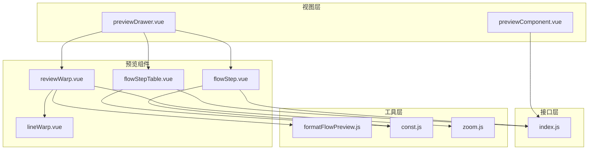
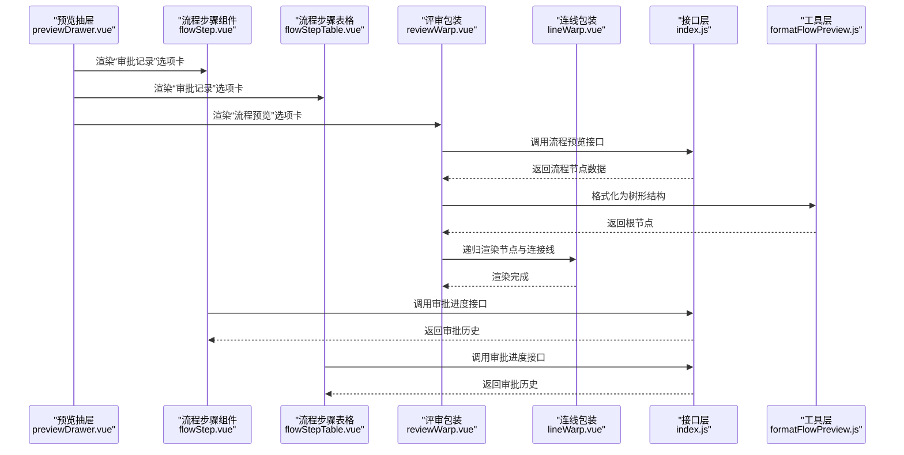
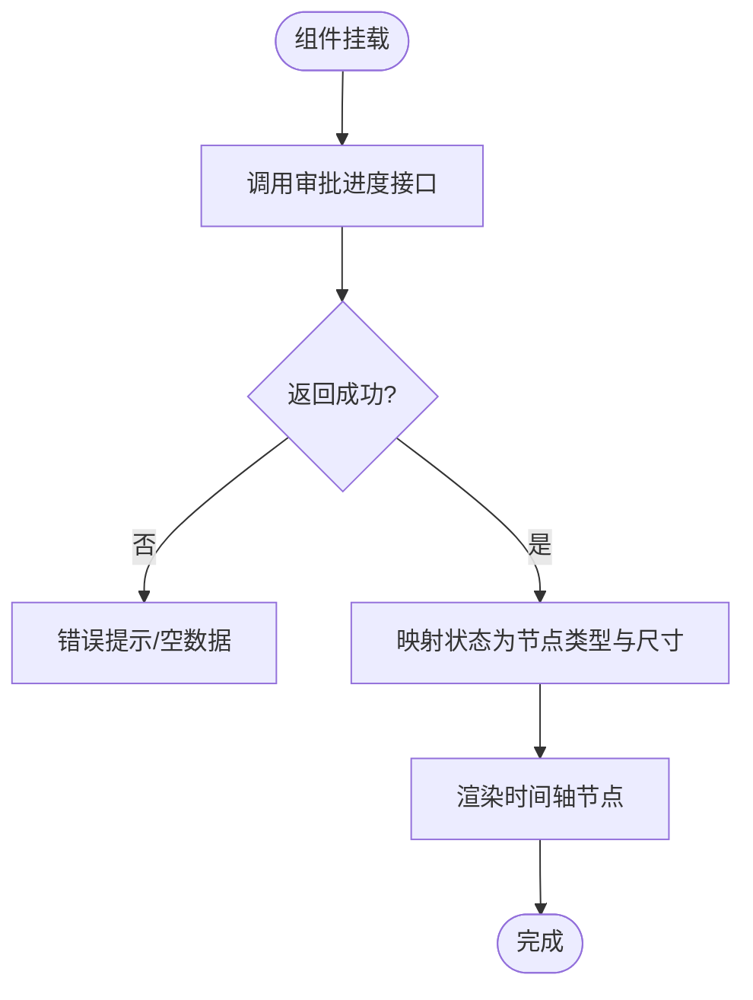
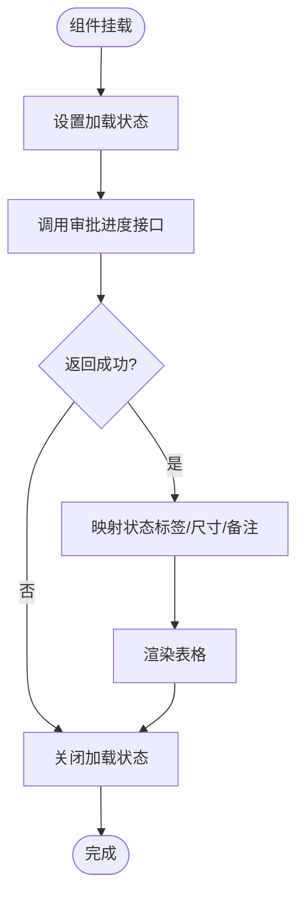
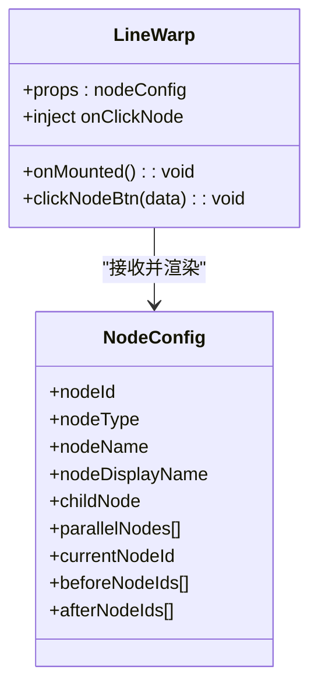
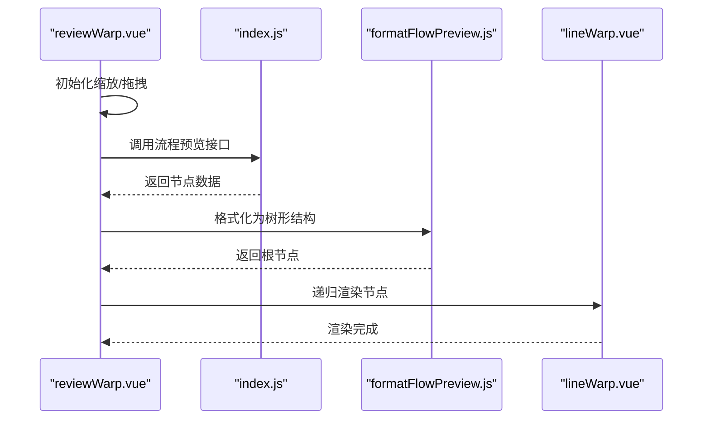
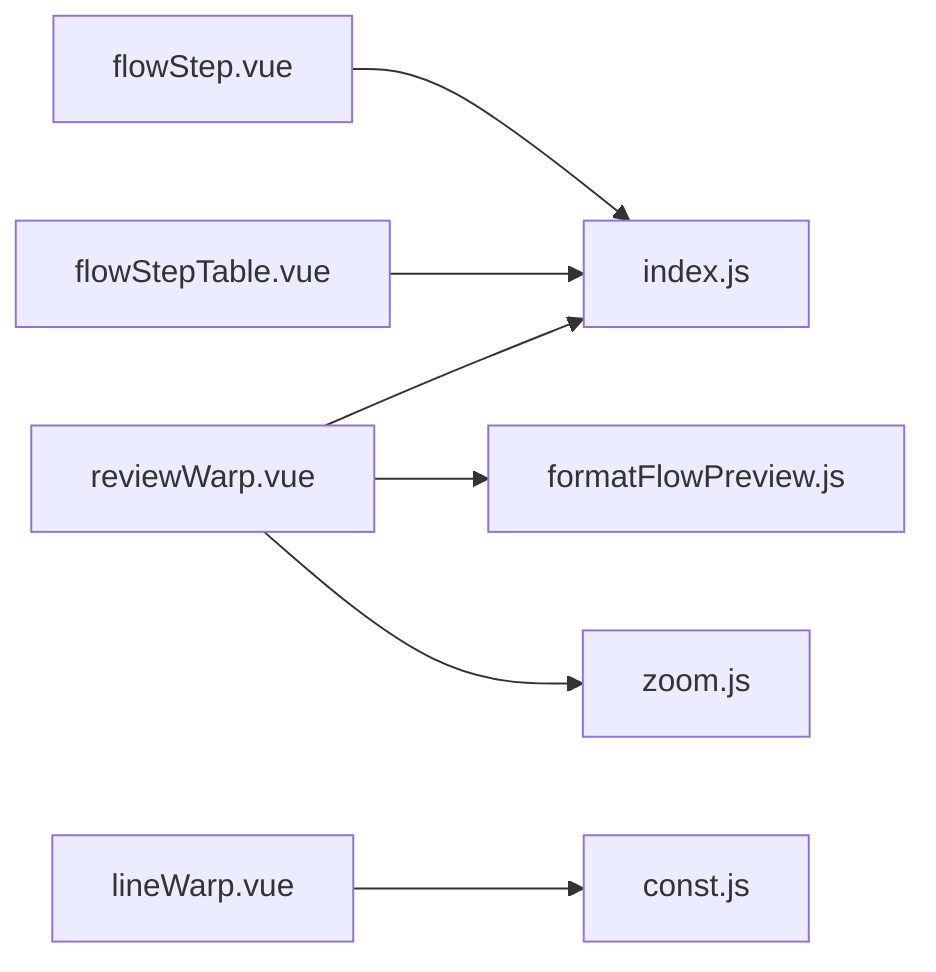

# 预览组件

<cite>
**本文引用的文件**
- [flowStep.vue](file://antflow-vue/src/components/Workflow/Preview/flowStep.vue)
- [flowStepTable.vue](file://antflow-vue/src/components/Workflow/Preview/flowStepTable.vue)
- [lineWarp.vue](file://antflow-vue/src/components/Workflow/Preview/lineWarp.vue)
- [reviewWarp.vue](file://antflow-vue/src/components/Workflow/Preview/reviewWarp.vue)
- [previewDrawer.vue](file://antflow-vue/src/views/workflow/components/previewDrawer.vue)
- [previewComponent.vue](file://antflow-vue/src/views/workflow/components/previewComponent.vue)
- [formatFlowPreview.js](file://antflow-vue/src/utils/antflow/formatFlowPreview.js)
- [const.js](file://antflow-vue/src/utils/antflow/const.js)
- [zoom.js](file://antflow-vue/src/utils/antflow/zoom.js)
- [index.js](file://antflow-vue/src/api/workflow/index.js)
</cite>

## 目录
1. [简介](#简介)
2. [项目结构](#项目结构)
3. [核心组件](#核心组件)
4. [架构总览](#架构总览)
5. [详细组件分析](#详细组件分析)
6. [依赖关系分析](#依赖关系分析)
7. [性能考量](#性能考量)
8. [故障排查指南](#故障排查指南)
9. [结论](#结论)
10. [附录：使用示例与自定义配置](#附录使用示例与自定义配置)

## 简介
本文件面向“预览组件”体系，围绕以下四个核心组件展开：
- 流程步骤组件（flowStep）：以时间轴形式展示审批节点的节点状态、流程进度与历史意见。
- 流程步骤表格组件（flowStepTable）：以表格形式展示步骤列表、状态筛选与操作按钮。
- 连线包装组件（lineWarp）：递归渲染流程节点与连接线，支持节点高亮、点击交互与并行分支绘制。
- 评审包装组件（reviewWarp）：承载流程图预览容器，提供缩放、复位、节点渲染与结束节点标识。

此外，文档还提供预览抽屉（previewDrawer）与表单预览组件（previewComponent）的使用场景说明，并给出可扩展的自定义配置建议，帮助开发者快速理解流程可视化展示的实现原理。

## 项目结构
预览组件位于前端工程 antflow-vue 的 Workflow 预览区域，主要文件组织如下：
- 组件层：components/Workflow/Preview 下的四个核心组件
- 视图层：views/workflow/components 下的抽屉与表单预览组件
- 工具层：utils/antflow 下的格式化、常量与缩放工具
- 接口层：api/workflow 下的流程相关接口

图表来源
- [previewDrawer.vue:1-82](file://antflow-vue/src/views/workflow/components/previewDrawer.vue#L1-L82)
- [previewComponent.vue:1-177](file://antflow-vue/src/views/workflow/components/previewComponent.vue#L1-L177)
- [flowStep.vue:1-116](file://antflow-vue/src/components/Workflow/Preview/flowStep.vue#L1-L116)
- [flowStepTable.vue:1-61](file://antflow-vue/src/components/Workflow/Preview/flowStepTable.vue#L1-L61)
- [lineWarp.vue:1-137](file://antflow-vue/src/components/Workflow/Preview/lineWarp.vue#L1-L137)
- [reviewWarp.vue:1-97](file://antflow-vue/src/components/Workflow/Preview/reviewWarp.vue#L1-L97)
- [formatFlowPreview.js:1-191](file://antflow-vue/src/utils/antflow/formatFlowPreview.js#L1-L191)
- [const.js:1-359](file://antflow-vue/src/utils/antflow/const.js#L1-L359)
- [zoom.js:1-95](file://antflow-vue/src/utils/antflow/zoom.js#L1-L95)
- [index.js:1-285](file://antflow-vue/src/api/workflow/index.js#L1-L285)

章节来源
- [previewDrawer.vue:1-82](file://antflow-vue/src/views/workflow/components/previewDrawer.vue#L1-L82)
- [previewComponent.vue:1-177](file://antflow-vue/src/views/workflow/components/previewComponent.vue#L1-L177)

## 核心组件
- 流程步骤组件（flowStep）
  - 功能：基于时间轴展示审批历史，包含节点名称、审批人、结果、意见、时间等字段；根据状态映射不同节点样式与尺寸。
  - 数据来源：调用审批进度接口，结合状态颜色映射生成节点类型与尺寸。
- 流程步骤表格组件（flowStepTable）
  - 功能：以表格列展示步骤列表，含执行人头像、状态标签、审批意见、处理时间；支持加载状态。
  - 数据来源：从全局视图配置读取参数，调用审批进度接口，映射状态标签与备注。
- 连线包装组件（lineWarp）
  - 功能：递归渲染流程节点与连接线，支持普通节点与并行分支节点；根据当前节点高亮；支持节点点击事件注入。
  - 渲染：通过背景色数组与节点类型映射决定节点外观；并行分支使用左右遮挡线增强视觉连通性。
- 评审包装组件（reviewWarp）
  - 功能：承载流程图容器，提供缩放、复位、放大/缩小按钮；拉取流程预览数据并格式化为树形结构后渲染。
  - 缩放：初始化缩放与拖拽，限制缩放范围，回调更新百分比；支持外部调用放大/缩小/复位。

章节来源
- [flowStep.vue:1-116](file://antflow-vue/src/components/Workflow/Preview/flowStep.vue#L1-L116)
- [flowStepTable.vue:1-61](file://antflow-vue/src/components/Workflow/Preview/flowStepTable.vue#L1-L61)
- [lineWarp.vue:1-137](file://antflow-vue/src/components/Workflow/Preview/lineWarp.vue#L1-L137)
- [reviewWarp.vue:1-97](file://antflow-vue/src/components/Workflow/Preview/reviewWarp.vue#L1-L97)

## 架构总览
预览组件的调用链路与数据流向如下：

图表来源
- [previewDrawer.vue:1-82](file://antflow-vue/src/views/workflow/components/previewDrawer.vue#L1-L82)
- [flowStep.vue:1-116](file://antflow-vue/src/components/Workflow/Preview/flowStep.vue#L1-L116)
- [flowStepTable.vue:1-61](file://antflow-vue/src/components/Workflow/Preview/flowStepTable.vue#L1-L61)
- [reviewWarp.vue:1-97](file://antflow-vue/src/components/Workflow/Preview/reviewWarp.vue#L1-L97)
- [lineWarp.vue:1-137](file://antflow-vue/src/components/Workflow/Preview/lineWarp.vue#L1-L137)
- [index.js:165-185](file://antflow-vue/src/api/workflow/index.js#L165-L185)
- [formatFlowPreview.js:1-191](file://antflow-vue/src/utils/antflow/formatFlowPreview.js#L1-L191)

## 详细组件分析

### 流程步骤组件（flowStep）
- 数据模型与映射
  - 输入参数：通过审批进度接口传入流程编号。
  - 输出字段：节点名称、审批人、审批结果、审批意见、操作时间；并根据状态映射节点类型与尺寸。
- 渲染策略
  - 使用 Element Timeline 组件逐项渲染；每个节点包裹折叠面板，便于展开查看详细意见。
- 交互与样式
  - 通过状态颜色映射决定节点样式；当前节点采用较大尺寸突出显示；结束节点以特殊备注标识。

图表来源
- [flowStep.vue:37-55](file://antflow-vue/src/components/Workflow/Preview/flowStep.vue#L37-L55)
- [index.js:165-170](file://antflow-vue/src/api/workflow/index.js#L165-L170)
- [const.js:182-201](file://antflow-vue/src/utils/antflow/const.js#L182-L201)

章节来源
- [flowStep.vue:1-116](file://antflow-vue/src/components/Workflow/Preview/flowStep.vue#L1-L116)
- [index.js:165-170](file://antflow-vue/src/api/workflow/index.js#L165-L170)
- [const.js:182-201](file://antflow-vue/src/utils/antflow/const.js#L182-L201)

### 流程步骤表格组件（flowStepTable）
- 数据模型与映射
  - 输入参数：从全局视图配置读取参数，作为审批进度接口的查询条件。
  - 输出字段：流程环节、执行人（带头像首字母）、操作状态标签、审批意见、处理时间。
- 渲染策略
  - 使用 Element 表格渲染；状态标签根据状态映射类型与尺寸；时间列使用工具函数格式化。
- 交互与样式
  - 支持加载状态；状态标签统一映射，未处理与结束节点有默认文案兜底。

图表来源
- [flowStepTable.vue:37-58](file://antflow-vue/src/components/Workflow/Preview/flowStepTable.vue#L37-L58)
- [index.js:165-170](file://antflow-vue/src/api/workflow/index.js#L165-L170)
- [const.js:182-201](file://antflow-vue/src/utils/antflow/const.js#L182-L201)

章节来源
- [flowStepTable.vue:1-61](file://antflow-vue/src/components/Workflow/Preview/flowStepTable.vue#L1-L61)
- [index.js:165-170](file://antflow-vue/src/api/workflow/index.js#L165-L170)
- [const.js:182-201](file://antflow-vue/src/utils/antflow/const.js#L182-L201)

### 连线包装组件（lineWarp）
- 渲染机制
  - 普通节点：标题栏与内容区，背景色按节点类型映射；支持当前节点高亮与激活态高亮。
  - 并行分支：渲染“并行审批”按钮与多个分支节点，分支节点间绘制遮挡线以强调拓扑关系。
  - 子节点：递归渲染 childNode 与 parallelNodes。
- 交互处理
  - 注入点击回调；点击节点时移除其他节点的激活态，仅对目标节点切换激活态；若存在环形前置节点则阻止点击。
- 样式与动画
  - 通过类名切换实现高亮边框与阴影；连接线采用像素线段与遮挡线组合，提升可读性。

图表来源
- [lineWarp.vue:56-96](file://antflow-vue/src/components/Workflow/Preview/lineWarp.vue#L56-L96)
- [const.js:8-16](file://antflow-vue/src/utils/antflow/const.js#L8-L16)

章节来源
- [lineWarp.vue:1-137](file://antflow-vue/src/components/Workflow/Preview/lineWarp.vue#L1-L137)
- [const.js:8-16](file://antflow-vue/src/utils/antflow/const.js#L8-L16)

### 评审包装组件（reviewWarp）
- 渲染逻辑
  - 初始化缩放与拖拽，限制缩放范围；根据全局视图配置或传入的 previewConf 参数调用流程预览接口。
  - 使用格式化工具将节点列表转换为树形结构，再递归交给 lineWarp 渲染。
  - 底部渲染“流程结束”节点，增强流程边界识别。
- 交互处理
  - 提供放大、缩小、复位按钮；复位时重置平移与缩放并回调更新百分比。
- 错误处理
  - 接口失败时弹出错误提示并关闭加载层。

图表来源
- [reviewWarp.vue:39-72](file://antflow-vue/src/components/Workflow/Preview/reviewWarp.vue#L39-L72)
- [index.js:177-185](file://antflow-vue/src/api/workflow/index.js#L177-L185)
- [formatFlowPreview.js:9-19](file://antflow-vue/src/utils/antflow/formatFlowPreview.js#L9-L19)

章节来源
- [reviewWarp.vue:1-97](file://antflow-vue/src/components/Workflow/Preview/reviewWarp.vue#L1-L97)
- [formatFlowPreview.js:1-191](file://antflow-vue/src/utils/antflow/formatFlowPreview.js#L1-L191)
- [zoom.js:9-95](file://antflow-vue/src/utils/antflow/zoom.js#L9-L95)

## 依赖关系分析
- 组件内聚与耦合
  - flowStep 与 flowStepTable 共享状态映射与接口调用，耦合度较低，便于独立维护。
  - lineWarp 与 reviewWarp 形成父子关系，lineWarp 作为通用渲染器，reviewWarp 作为容器与交互入口。
- 外部依赖
  - 接口层提供审批进度与流程预览两类接口；工具层提供格式化与缩放能力。
- 循环依赖
  - 未发现循环依赖；lineWarp 通过 v-if 条件渲染子节点，避免自引用导致的无限递归。

图表来源
- [flowStep.vue:30-35](file://antflow-vue/src/components/Workflow/Preview/flowStep.vue#L30-L35)
- [flowStepTable.vue:30-36](file://antflow-vue/src/components/Workflow/Preview/flowStepTable.vue#L30-L36)
- [reviewWarp.vue:22-28](file://antflow-vue/src/components/Workflow/Preview/reviewWarp.vue#L22-L28)
- [lineWarp.vue:56-58](file://antflow-vue/src/components/Workflow/Preview/lineWarp.vue#L56-L58)
- [formatFlowPreview.js:1-10](file://antflow-vue/src/utils/antflow/formatFlowPreview.js#L1-L10)
- [zoom.js:1-10](file://antflow-vue/src/utils/antflow/zoom.js#L1-L10)
- [const.js:1-10](file://antflow-vue/src/utils/antflow/const.js#L1-L10)
- [index.js:165-185](file://antflow-vue/src/api/workflow/index.js#L165-L185)

章节来源
- [flowStep.vue:1-116](file://antflow-vue/src/components/Workflow/Preview/flowStep.vue#L1-L116)
- [flowStepTable.vue:1-61](file://antflow-vue/src/components/Workflow/Preview/flowStepTable.vue#L1-L61)
- [lineWarp.vue:1-137](file://antflow-vue/src/components/Workflow/Preview/lineWarp.vue#L1-L137)
- [reviewWarp.vue:1-97](file://antflow-vue/src/components/Workflow/Preview/reviewWarp.vue#L1-L97)
- [formatFlowPreview.js:1-191](file://antflow-vue/src/utils/antflow/formatFlowPreview.js#L1-L191)
- [const.js:1-359](file://antflow-vue/src/utils/antflow/const.js#L1-L359)
- [zoom.js:1-95](file://antflow-vue/src/utils/antflow/zoom.js#L1-L95)
- [index.js:1-285](file://antflow-vue/src/api/workflow/index.js#L1-L285)

## 性能考量
- 渲染优化
  - flowStep 与 flowStepTable 通过映射状态减少重复计算；lineWarp 采用 v-if 控制子节点渲染，避免不必要的 DOM。
- 数据请求
  - 两处审批进度接口调用均在组件挂载时触发，建议在抽屉打开时再请求，减少无用请求。
- 缩放与拖拽
  - zoom.js 限制缩放范围与拖拽节流，避免过度重绘；建议在大数据量流程图时进一步节流 transform 更新。

## 故障排查指南
- 审批记录为空
  - 检查接口返回与参数传递；确认流程编号正确且流程存在审批历史。
- 流程预览失败
  - 查看接口返回错误信息；确认预览参数（流程编号、是否低代码流程等）正确。
- 节点无法点击
  - 检查是否存在前置自环节点；确认节点点击回调是否注入。
- 缩放异常
  - 确认初始化函数已调用；检查缩放范围与回调更新逻辑。

章节来源
- [flowStep.vue:40-55](file://antflow-vue/src/components/Workflow/Preview/flowStep.vue#L40-L55)
- [flowStepTable.vue:43-58](file://antflow-vue/src/components/Workflow/Preview/flowStepTable.vue#L43-L58)
- [reviewWarp.vue:40-66](file://antflow-vue/src/components/Workflow/Preview/reviewWarp.vue#L40-L66)
- [lineWarp.vue:77-93](file://antflow-vue/src/components/Workflow/Preview/lineWarp.vue#L77-L93)
- [zoom.js:56-95](file://antflow-vue/src/utils/antflow/zoom.js#L56-L95)

## 结论
预览组件体系以清晰的职责划分实现了“审批记录展示”和“流程图预览”的两大场景：
- flowStep 与 flowStepTable 提供结构化的审批历史浏览体验；
- lineWarp 与 reviewWarp 提供可交互的流程图渲染与缩放能力；
- 工具层与接口层为组件提供了稳定的格式化与数据支撑。

通过合理的参数传递与状态映射，组件具备良好的可扩展性与可维护性。

## 附录：使用示例与自定义配置
- 在抽屉中使用
  - 将预览抽屉组件引入页面，设置全局视图配置；在“流程预览”选项卡中嵌入 reviewWarp；在“审批记录”选项卡中嵌入 flowStep 或 flowStepTable。
- 自定义配置
  - 通过 reviewWarp 的 previewConf 属性覆盖默认参数，实现外部访问或低代码流程的预览。
  - 通过全局视图配置对象传入流程编号、是否外部访问、是否低代码流程等参数。
- 扩展建议
  - 若需支持更多状态标签样式，可在状态映射表中扩展 approveButtonColor。
  - 若需支持更多节点类型样式，可在背景色数组与节点类型映射中扩展 bgColors 与 nodeTypeList。
  - 若需支持更多交互（如双击跳转、右键菜单），可在 lineWarp 中扩展点击回调注入与事件绑定。

章节来源
- [previewDrawer.vue:1-82](file://antflow-vue/src/views/workflow/components/previewDrawer.vue#L1-L82)
- [reviewWarp.vue:33-38](file://antflow-vue/src/components/Workflow/Preview/reviewWarp.vue#L33-L38)
- [const.js:8-36](file://antflow-vue/src/utils/antflow/const.js#L8-L36)
- [const.js:182-201](file://antflow-vue/src/utils/antflow/const.js#L182-L201)