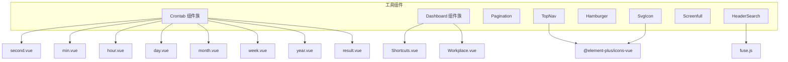
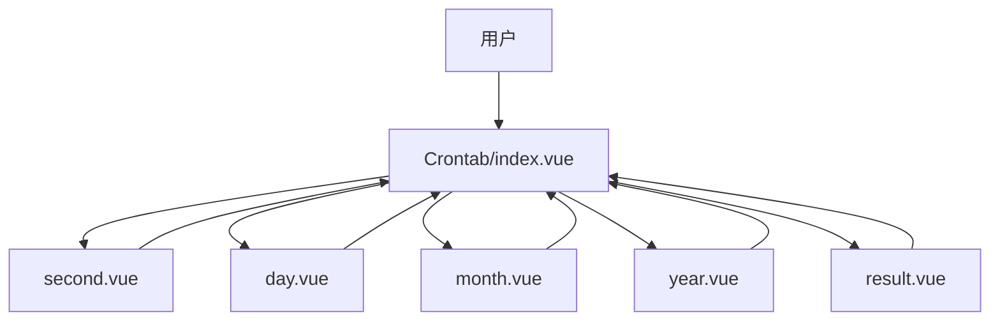
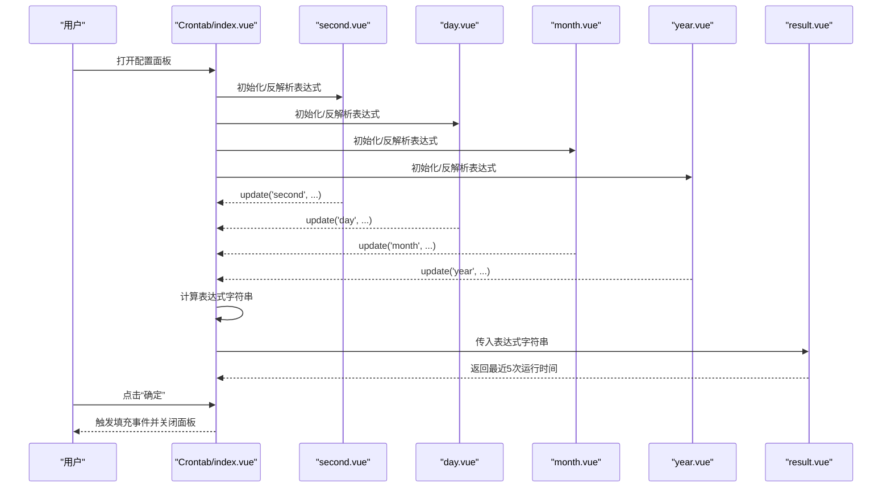
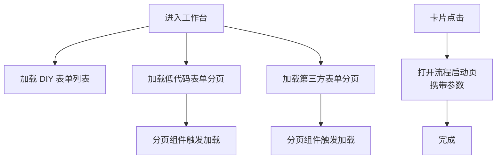
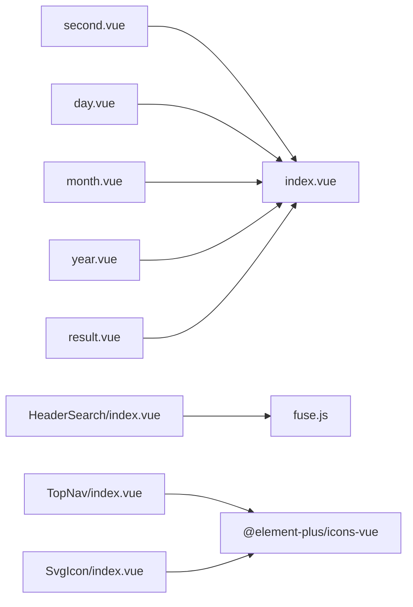

# 工具组件

<cite>
**本文引用的文件**
- [Crontab/index.vue](file://antflow-vue/src/components/Crontab/index.vue)
- [Crontab/second.vue](file://antflow-vue/src/components/Crontab/second.vue)
- [Crontab/day.vue](file://antflow-vue/src/components/Crontab/day.vue)
- [Crontab/month.vue](file://antflow-vue/src/components/Crontab/month.vue)
- [Crontab/year.vue](file://antflow-vue/src/components/Crontab/year.vue)
- [Crontab/result.vue](file://antflow-vue/src/components/Crontab/result.vue)
- [Dashboard/Shortcuts.vue](file://antflow-vue/src/components/Dashboard/Shortcuts.vue)
- [Dashboard/Workplace.vue](file://antflow-vue/src/components/Dashboard/Workplace.vue)
- [Pagination/index.vue](file://antflow-vue/src/components/Pagination/index.vue)
- [SvgIcon/index.vue](file://antflow-vue/src/components/SvgIcon/index.vue)
- [SvgIcon/svgicon.js](file://antflow-vue/src/components/SvgIcon/svgicon.js)
- [Hamburger/index.vue](file://antflow-vue/src/components/Hamburger/index.vue)
- [HeaderSearch/index.vue](file://antflow-vue/src/components/HeaderSearch/index.vue)
- [Screenfull/index.vue](file://antflow-vue/src/components/Screenfull/index.vue)
- [TopNav/index.vue](file://antflow-vue/src/components/TopNav/index.vue)
</cite>

## 目录
1. [简介](#简介)
2. [项目结构](#项目结构)
3. [核心组件](#核心组件)
4. [架构总览](#架构总览)
5. [详细组件分析](#详细组件分析)
6. [依赖关系分析](#依赖关系分析)
7. [性能考量](#性能考量)
8. [故障排查指南](#故障排查指南)
9. [结论](#结论)
10. [附录](#附录)

## 简介
本文件面向前端开发者，系统性梳理并说明以下工具组件的功能与使用方法：
- 定时任务组件：Cron 表达式解析、时间配置、结果展示
- 仪表盘组件：快捷方式配置、工作台布局、数据展示方式
- 分页组件：页码控制、数据加载、样式定制
- SVG 图标组件：图标管理、动态加载、主题适配
- 顶部导航、汉堡菜单、搜索框、全屏切换等通用工具组件：使用方法、配置参数、事件处理与样式定制

目标是帮助你在现有工程基础上快速集成与扩展这些组件，构建功能完善的前端界面。

## 项目结构
组件位于 antflow-vue/src/components 下，按功能域组织：
- Crontab：Cron 表达式可视化配置与结果预览
- Dashboard：快捷入口与工作台卡片布局
- Pagination：分页控件封装
- SvgIcon：SVG 图标渲染与全局注册
- Hamburger、HeaderSearch、Screenfull、TopNav：通用工具组件

图表来源
- [Crontab/index.vue:1-313](file://antflow-vue/src/components/Crontab/index.vue#L1-L313)
- [Dashboard/Shortcuts.vue:1-172](file://antflow-vue/src/components/Dashboard/Shortcuts.vue#L1-L172)
- [Dashboard/Workplace.vue:1-314](file://antflow-vue/src/components/Dashboard/Workplace.vue#L1-L314)
- [Pagination/index.vue:1-105](file://antflow-vue/src/components/Pagination/index.vue#L1-L105)
- [SvgIcon/index.vue:1-54](file://antflow-vue/src/components/SvgIcon/index.vue#L1-L54)
- [SvgIcon/svgicon.js:1-11](file://antflow-vue/src/components/SvgIcon/svgicon.js#L1-L11)
- [Hamburger/index.vue:1-43](file://antflow-vue/src/components/Hamburger/index.vue#L1-L43)
- [HeaderSearch/index.vue:1-253](file://antflow-vue/src/components/HeaderSearch/index.vue#L1-L253)
- [Screenfull/index.vue:1-22](file://antflow-vue/src/components/Screenfull/index.vue#L1-L22)
- [TopNav/index.vue:1-218](file://antflow-vue/src/components/TopNav/index.vue#L1-L218)

章节来源
- [Crontab/index.vue:1-313](file://antflow-vue/src/components/Crontab/index.vue#L1-L313)
- [Dashboard/Shortcuts.vue:1-172](file://antflow-vue/src/components/Dashboard/Shortcuts.vue#L1-L172)
- [Dashboard/Workplace.vue:1-314](file://antflow-vue/src/components/Dashboard/Workplace.vue#L1-L314)
- [Pagination/index.vue:1-105](file://antflow-vue/src/components/Pagination/index.vue#L1-L105)
- [SvgIcon/index.vue:1-54](file://antflow-vue/src/components/SvgIcon/index.vue#L1-L54)
- [SvgIcon/svgicon.js:1-11](file://antflow-vue/src/components/SvgIcon/svgicon.js#L1-L11)
- [Hamburger/index.vue:1-43](file://antflow-vue/src/components/Hamburger/index.vue#L1-L43)
- [HeaderSearch/index.vue:1-253](file://antflow-vue/src/components/HeaderSearch/index.vue#L1-L253)
- [Screenfull/index.vue:1-22](file://antflow-vue/src/components/Screenfull/index.vue#L1-L22)
- [TopNav/index.vue:1-218](file://antflow-vue/src/components/TopNav/index.vue#L1-L218)

## 核心组件
- 定时任务组件（Crontab）
  - 功能：以可视化方式配置 Cron 表达式的各段（秒、分钟、小时、日、月、周、年），并实时生成表达式字符串与最近运行时间列表
  - 关键点：支持反解析已有表达式、数值范围校验、多种规则组合（周期、步长、指定集合、不指定等）、结果预览
- 仪表盘组件（Dashboard）
  - 快捷方式（Shortcuts）：四个卡片入口，分别跳转到不同任务视图；数据来自接口
  - 工作台（Workplace）：三块卡片区域（DIY 流程、低代码表单、第三方流程），支持分页加载与卡片点击跳转
- 分页组件（Pagination）
  - 功能：基于 Element Plus 的分页器，提供双向绑定的页码与页大小、移动端页码按钮数量自适应、滚动定位
- SVG 图标组件（SvgIcon）
  - 功能：统一渲染 SVG 图标，支持类名与颜色注入、全局注册 ElementPlus 图标
- 通用工具组件
  - 汉堡菜单（Hamburger）：侧边栏展开/收起状态切换
  - 顶部导航（TopNav）：水平菜单、响应式显示、子菜单联动
  - 搜索框（HeaderSearch）：菜单项模糊搜索、键盘导航、HTTP 链接处理
  - 全屏切换（Screenfull）：基于 @vueuse/core 的全屏控制

章节来源
- [Crontab/index.vue:1-313](file://antflow-vue/src/components/Crontab/index.vue#L1-L313)
- [Dashboard/Shortcuts.vue:1-172](file://antflow-vue/src/components/Dashboard/Shortcuts.vue#L1-L172)
- [Dashboard/Workplace.vue:1-314](file://antflow-vue/src/components/Dashboard/Workplace.vue#L1-L314)
- [Pagination/index.vue:1-105](file://antflow-vue/src/components/Pagination/index.vue#L1-L105)
- [SvgIcon/index.vue:1-54](file://antflow-vue/src/components/SvgIcon/index.vue#L1-L54)
- [Hamburger/index.vue:1-43](file://antflow-vue/src/components/Hamburger/index.vue#L1-L43)
- [HeaderSearch/index.vue:1-253](file://antflow-vue/src/components/HeaderSearch/index.vue#L1-L253)
- [Screenfull/index.vue:1-22](file://antflow-vue/src/components/Screenfull/index.vue#L1-L22)
- [TopNav/index.vue:1-218](file://antflow-vue/src/components/TopNav/index.vue#L1-L218)

## 架构总览
组件间交互与数据流概览如下：

图表来源
- [Crontab/index.vue:1-313](file://antflow-vue/src/components/Crontab/index.vue#L1-L313)
- [Crontab/second.vue:1-128](file://antflow-vue/src/components/Crontab/second.vue#L1-L128)
- [Crontab/day.vue:1-174](file://antflow-vue/src/components/Crontab/day.vue#L1-L174)
- [Crontab/month.vue:1-141](file://antflow-vue/src/components/Crontab/month.vue#L1-L141)
- [Crontab/year.vue:1-143](file://antflow-vue/src/components/Crontab/year.vue#L1-L143)
- [Crontab/result.vue:1-540](file://antflow-vue/src/components/Crontab/result.vue#L1-L540)

## 详细组件分析

### 定时任务组件（Crontab）

- 组件职责
  - 提供 Cron 各段的可视化配置面板（秒、分钟、小时、日、月、周、年）
  - 实时拼装 Cron 表达式字符串并在表格中展示
  - 展示“最近5次运行时间”的结果列表
  - 支持传入已有表达式进行反解析，或清空为默认值

- 关键实现要点
  - 子组件按段独立维护规则状态，通过 update 事件回传到父组件
  - 父组件统一计算表达式字符串并驱动结果组件更新
  - 数值输入带范围校验，确保符合 Cron 规范
  - 结果组件根据表达式规则生成最近运行时间序列，包含对日规则（工作日、月末、第几周星期X、最后一个星期X）的复杂逻辑

- 使用建议
  - 通过属性传入表达式字符串，以便初始化
  - 通过事件监听确定用户确认后，再取最终表达式字符串
  - 如需隐藏某段，可通过属性传入要隐藏的段名列表

图表来源
- [Crontab/index.vue:127-248](file://antflow-vue/src/components/Crontab/index.vue#L127-L248)
- [Crontab/second.vue:36-118](file://antflow-vue/src/components/Crontab/second.vue#L36-L118)
- [Crontab/day.vue:54-164](file://antflow-vue/src/components/Crontab/day.vue#L54-L164)
- [Crontab/month.vue:36-131](file://antflow-vue/src/components/Crontab/month.vue#L36-L131)
- [Crontab/year.vue:43-133](file://antflow-vue/src/components/Crontab/year.vue#L43-L133)
- [Crontab/result.vue:13-330](file://antflow-vue/src/components/Crontab/result.vue#L13-L330)

章节来源
- [Crontab/index.vue:1-313](file://antflow-vue/src/components/Crontab/index.vue#L1-L313)
- [Crontab/second.vue:1-128](file://antflow-vue/src/components/Crontab/second.vue#L1-L128)
- [Crontab/day.vue:1-174](file://antflow-vue/src/components/Crontab/day.vue#L1-L174)
- [Crontab/month.vue:1-141](file://antflow-vue/src/components/Crontab/month.vue#L1-L141)
- [Crontab/year.vue:1-143](file://antflow-vue/src/components/Crontab/year.vue#L1-L143)
- [Crontab/result.vue:1-540](file://antflow-vue/src/components/Crontab/result.vue#L1-L540)

### 仪表盘组件（Dashboard）

- 快捷方式（Shortcuts）
  - 四个卡片入口，分别统计“我的待办”、“今日已办”、“今日发起”、“我的草稿”，点击后通过标签页打开对应路由
  - 数据通过接口拉取并缓存，异常时输出日志

- 工作台（Workplace）
  - DIY 流程、低代码表单、第三方流程三块卡片区
  - 低代码与第三方流程支持分页加载，卡片点击后携带参数跳转到启动页
  - 卡片头像颜色按索引轮换，提升视觉层次

- 使用建议
  - Shortcuts 作为首页入口，建议保持简洁；Workplace 作为常用流程聚合区，注意卡片数量与分页策略
  - 若需扩展快捷入口，可在 Shortcuts 中新增卡片并绑定相应路由

图表来源
- [Dashboard/Workplace.vue:119-250](file://antflow-vue/src/components/Dashboard/Workplace.vue#L119-L250)
- [Pagination/index.vue:17-95](file://antflow-vue/src/components/Pagination/index.vue#L17-L95)

章节来源
- [Dashboard/Shortcuts.vue:1-172](file://antflow-vue/src/components/Dashboard/Shortcuts.vue#L1-L172)
- [Dashboard/Workplace.vue:1-314](file://antflow-vue/src/components/Dashboard/Workplace.vue#L1-L314)
- [Pagination/index.vue:1-105](file://antflow-vue/src/components/Pagination/index.vue#L1-L105)

### 分页组件（Pagination）

- 功能特性
  - 双向绑定页码与页大小，支持自定义页码按钮数量（移动端默认更少）
  - 支持布局字符串与背景色开关
  - 自动滚动到顶部，优化用户体验

- 参数与事件
  - 属性：total、page、limit、pageSizes、pagerCount、layout、background、autoScroll、hidden
  - 事件：update:page、update:limit、pagination（返回 {page, limit}）

- 使用建议
  - 与后端分页接口配合，监听 pagination 事件并重新请求数据
  - 在移动端适当减少 pagerCount，避免横向滚动

章节来源
- [Pagination/index.vue:1-105](file://antflow-vue/src/components/Pagination/index.vue#L1-L105)

### SVG 图标组件（SvgIcon）

- 功能特性
  - 渲染 SVG 图标，支持传入 iconClass、className、color
  - 内部将 iconClass 组合为 #icon-{name} 的 xlink:href
  - 全局安装 ElementPlus 图标，便于在项目中直接使用

- 使用建议
  - 优先使用统一的 SvgIcon 组件，保证图标尺寸与主题一致
  - 如需动态主题适配，通过 color 或 CSS 变量控制

章节来源
- [SvgIcon/index.vue:1-54](file://antflow-vue/src/components/SvgIcon/index.vue#L1-L54)
- [SvgIcon/svgicon.js:1-11](file://antflow-vue/src/components/SvgIcon/svgicon.js#L1-L11)

### 通用工具组件

- 汉堡菜单（Hamburger）
  - 通过点击事件切换侧边栏展开/收起状态
  - 支持 isActive 状态样式切换

- 顶部导航（TopNav）
  - 基于权限路由生成顶部菜单，支持响应式显示与“更多菜单”折叠
  - 点击菜单联动左侧侧边栏路由

- 搜索框（HeaderSearch）
  - 基于 Fuse.js 实现菜单项模糊搜索，支持键盘上下导航与 Enter 选择
  - 支持 HTTP 链接新窗口打开

- 全屏切换（Screenfull）
  - 基于 @vueuse/core 的 useFullscreen，点击切换全屏状态

章节来源
- [Hamburger/index.vue:1-43](file://antflow-vue/src/components/Hamburger/index.vue#L1-L43)
- [TopNav/index.vue:1-218](file://antflow-vue/src/components/TopNav/index.vue#L1-L218)
- [HeaderSearch/index.vue:1-253](file://antflow-vue/src/components/HeaderSearch/index.vue#L1-L253)
- [Screenfull/index.vue:1-22](file://antflow-vue/src/components/Screenfull/index.vue#L1-L22)

## 依赖关系分析

图表来源
- [Crontab/index.vue:128-135](file://antflow-vue/src/components/Crontab/index.vue#L128-L135)
- [Crontab/second.vue:36-37](file://antflow-vue/src/components/Crontab/second.vue#L36-L37)
- [Crontab/day.vue:54-55](file://antflow-vue/src/components/Crontab/day.vue#L54-L55)
- [Crontab/month.vue:36-37](file://antflow-vue/src/components/Crontab/month.vue#L36-L37)
- [Crontab/year.vue:43-44](file://antflow-vue/src/components/Crontab/year.vue#L43-L44)
- [Crontab/result.vue:13-18](file://antflow-vue/src/components/Crontab/result.vue#L13-L18)
- [HeaderSearch/index.vue:48-52](file://antflow-vue/src/components/HeaderSearch/index.vue#L48-L52)
- [TopNav/index.vue:36-40](file://antflow-vue/src/components/TopNav/index.vue#L36-L40)
- [SvgIcon/index.vue:7-34](file://antflow-vue/src/components/SvgIcon/index.vue#L7-L34)
- [SvgIcon/svgicon.js:1-11](file://antflow-vue/src/components/SvgIcon/svgicon.js#L1-L11)

章节来源
- [Crontab/index.vue:128-135](file://antflow-vue/src/components/Crontab/index.vue#L128-L135)
- [HeaderSearch/index.vue:48-52](file://antflow-vue/src/components/HeaderSearch/index.vue#L48-L52)
- [TopNav/index.vue:36-40](file://antflow-vue/src/components/TopNav/index.vue#L36-L40)
- [SvgIcon/index.vue:7-34](file://antflow-vue/src/components/SvgIcon/index.vue#L7-L34)
- [SvgIcon/svgicon.js:1-11](file://antflow-vue/src/components/SvgIcon/svgicon.js#L1-L11)

## 性能考量
- Crontab 结果计算
  - 结果组件会遍历未来一段时间内的可能时间，复杂度与规则复杂度相关；建议在表达式变更时才触发计算，避免频繁重算
- 搜索框
  - Fuse.js 初始化与索引构建在路由列表变化时进行，建议在页面初始化时一次性构建，避免重复初始化
- 分页
  - 自动滚动到顶部可提升体验，但大量数据时建议在合适时机关闭 autoScroll 以减少滚动开销

## 故障排查指南
- Cron 表达式无效
  - 确认各段数值范围与通配符组合正确；检查是否有冲突（如日与周同时设置具体值）
- 结果列表为空
  - 检查表达式是否在未来100年内存在有效时间；确认年段是否留空或设置合理
- 分页不生效
  - 确认 total 与 page/limit 的绑定正确；检查 pagination 事件是否被消费并触发数据刷新
- 搜索无结果
  - 确认路由列表已生成且包含标题；检查 Fuse.js 的 keys 配置与权重
- 图标不显示
  - 确认 iconClass 与 SVG ID 匹配；检查全局图标注册是否生效

章节来源
- [Crontab/result.vue:320-330](file://antflow-vue/src/components/Crontab/result.vue#L320-L330)
- [Pagination/index.vue:80-95](file://antflow-vue/src/components/Pagination/index.vue#L80-L95)
- [HeaderSearch/index.vue:103-118](file://antflow-vue/src/components/HeaderSearch/index.vue#L103-L118)
- [SvgIcon/index.vue:23-33](file://antflow-vue/src/components/SvgIcon/index.vue#L23-L33)

## 结论
上述工具组件覆盖了前端常见的配置、展示与导航需求。通过统一的参数与事件接口，可以快速集成到业务页面中。建议在实际项目中结合业务场景对组件进行二次封装，以满足更复杂的交互与样式需求。

## 附录

### 组件配置参数与事件清单

- Crontab（父组件）
  - 属性：expression（字符串）、hideComponent（数组）
  - 事件：hide、fill（传入最终表达式字符串）
- Crontab（子组件）
  - 属性：cron（对象）、check（函数）
  - 事件：update（name, value, from）
- Dashboard/Shortcuts
  - 无属性；通过点击事件打开对应路由
- Dashboard/Workplace
  - 无属性；通过卡片点击打开启动页并携带参数
- Pagination
  - 属性：total、page、limit、pageSizes、pagerCount、layout、background、autoScroll、hidden
  - 事件：update:page、update:limit、pagination
- SvgIcon
  - 属性：iconClass、className、color
- Hamburger
  - 属性：isActive
  - 事件：toggleClick
- HeaderSearch
  - 无属性；内部使用 store 与路由
  - 事件：内部处理路由跳转与键盘导航
- Screenfull
  - 无属性；内部使用 @vueuse/core
- TopNav
  - 无属性；内部使用 store 与路由
  - 事件：菜单选择与子菜单联动

章节来源
- [Crontab/index.vue:138-147](file://antflow-vue/src/components/Crontab/index.vue#L138-L147)
- [Crontab/second.vue:36-56](file://antflow-vue/src/components/Crontab/second.vue#L36-L56)
- [Pagination/index.vue:20-60](file://antflow-vue/src/components/Pagination/index.vue#L20-L60)
- [SvgIcon/index.vue:9-22](file://antflow-vue/src/components/SvgIcon/index.vue#L9-L22)
- [Hamburger/index.vue:17-23](file://antflow-vue/src/components/Hamburger/index.vue#L17-L23)
- [HeaderSearch/index.vue:47-63](file://antflow-vue/src/components/HeaderSearch/index.vue#L47-L63)
- [Screenfull/index.vue:7-11](file://antflow-vue/src/components/Screenfull/index.vue#L7-L11)
- [TopNav/index.vue:35-53](file://antflow-vue/src/components/TopNav/index.vue#L35-L53)