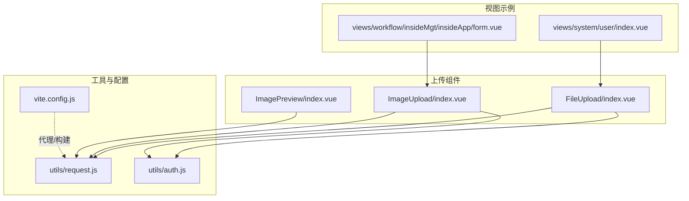
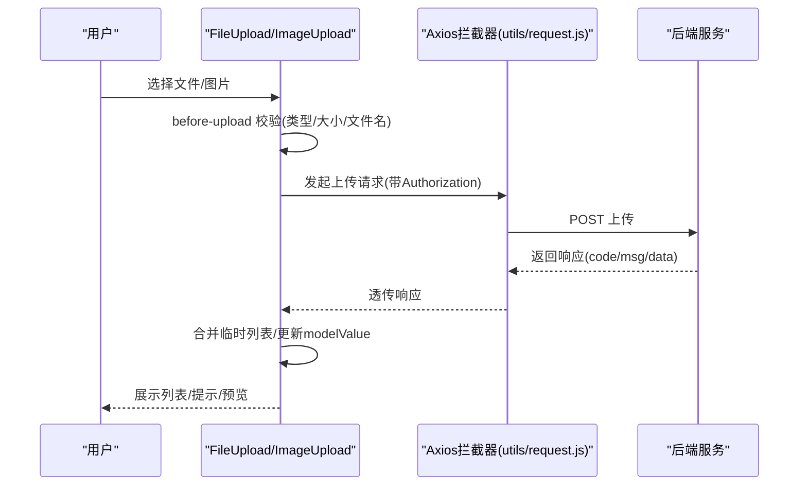
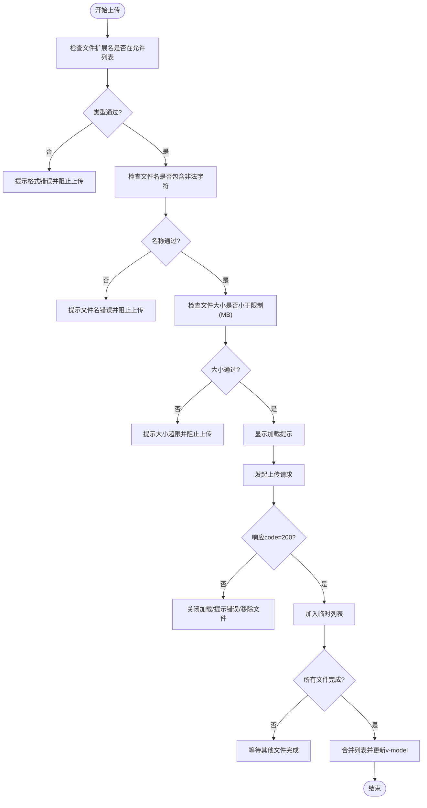
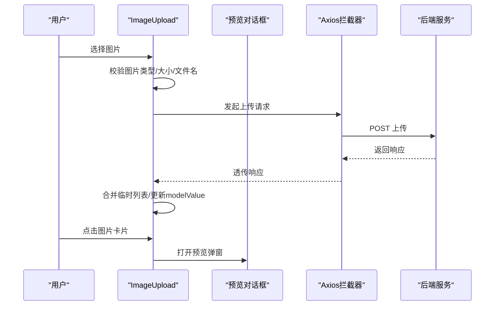
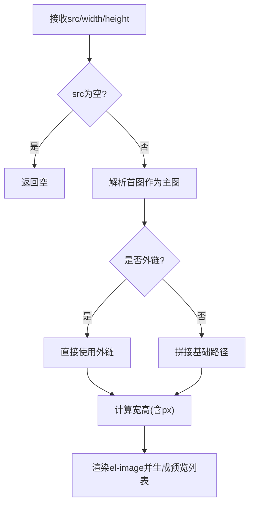
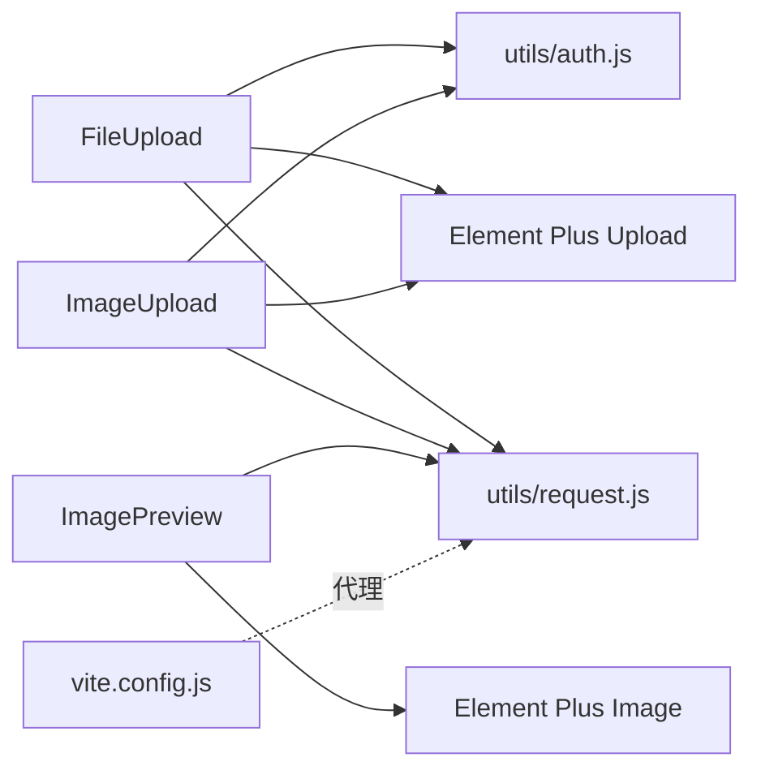

# 文件上传组件

<cite>
**本文引用的文件**
- [FileUpload/index.vue](file://antflow-vue/src/components/FileUpload/index.vue)
- [ImageUpload/index.vue](file://antflow-vue/src/components/ImageUpload/index.vue)
- [ImagePreview/index.vue](file://antflow-vue/src/components/ImagePreview/index.vue)
- [request.js](file://antflow-vue/src/utils/request.js)
- [auth.js](file://antflow-vue/src/utils/auth.js)
- [vite.config.js](file://antflow-vue/vite.config.js)
- [user/index.vue](file://antflow-vue/src/views/system/user/index.vue)
- [workflow/form.vue](file://antflow-vue/src/views/workflow/insideMgt/insideApp/form.vue)
</cite>

## 目录
1. [简介](#简介)
2. [项目结构](#项目结构)
3. [核心组件](#核心组件)
4. [架构总览](#架构总览)
5. [组件详细分析](#组件详细分析)
6. [依赖关系分析](#依赖关系分析)
7. [性能考量](#性能考量)
8. [故障排查指南](#故障排查指南)
9. [结论](#结论)
10. [附录](#附录)

## 简介
本文件上传组件文档聚焦于 AntFlow 前端工程中的文件上传与图片上传能力，涵盖以下要点：
- 多格式支持：通过配置文件类型数组实现灵活的格式白名单校验
- 大小限制：基于文件字节大小的上传前校验
- 进度显示：结合 Element Plus Upload 组件的进度事件回调
- 图片上传：支持预览弹窗、拖拽排序、禁用态展示
- 文件预览：缩略图生成、全屏查看、下载能力
- 上传策略：基于组件内部状态的批量上传与合并逻辑
- 错误重试机制：当前实现以组件内错误提示为主，未见断点续传或自动重试逻辑
- 配置参数、事件回调、样式定制选项
- 使用示例、安全考虑、性能优化建议

## 项目结构
围绕上传与预览的相关文件组织如下：
- 文件上传组件：FileUpload/index.vue
- 图片上传组件：ImageUpload/index.vue
- 图片预览组件：ImagePreview/index.vue
- 上传工具与拦截器：utils/request.js
- 认证令牌：utils/auth.js
- 构建与代理配置：vite.config.js
- 使用示例：views/system/user/index.vue、views/workflow/insideMgt/insideApp/form.vue

**图表来源**
- [FileUpload/index.vue:1-257](file://antflow-vue/src/components/FileUpload/index.vue#L1-L257)
- [ImageUpload/index.vue:1-258](file://antflow-vue/src/components/ImageUpload/index.vue#L1-L258)
- [ImagePreview/index.vue:1-93](file://antflow-vue/src/components/ImagePreview/index.vue#L1-L93)
- [request.js:1-205](file://antflow-vue/src/utils/request.js#L1-L205)
- [auth.js:1-16](file://antflow-vue/src/utils/auth.js#L1-L16)
- [vite.config.js:1-100](file://antflow-vue/vite.config.js#L1-L100)
- [user/index.vue:530-635](file://antflow-vue/src/views/system/user/index.vue#L530-L635)
- [workflow/form.vue:45-140](file://antflow-vue/src/views/workflow/insideMgt/insideApp/form.vue#L45-L140)

**章节来源**
- [FileUpload/index.vue:1-257](file://antflow-vue/src/components/FileUpload/index.vue#L1-L257)
- [ImageUpload/index.vue:1-258](file://antflow-vue/src/components/ImageUpload/index.vue#L1-L258)
- [ImagePreview/index.vue:1-93](file://antflow-vue/src/components/ImagePreview/index.vue#L1-L93)
- [request.js:1-205](file://antflow-vue/src/utils/request.js#L1-L205)
- [auth.js:1-16](file://antflow-vue/src/utils/auth.js#L1-L16)
- [vite.config.js:1-100](file://antflow-vue/vite.config.js#L1-L100)
- [user/index.vue:530-635](file://antflow-vue/src/views/system/user/index.vue#L530-L635)
- [workflow/form.vue:45-140](file://antflow-vue/src/views/workflow/insideMgt/insideApp/form.vue#L45-L140)

## 核心组件
- 文件上传组件（FileUpload）
  - 支持多文件、数量限制、格式与大小校验、拖拽排序、禁用态、提示信息
  - 上传成功后合并临时列表，更新 v-model 输出
- 图片上传组件（ImageUpload）
  - 支持图片格式校验、预览弹窗、拖拽排序、禁用态
  - 上传成功后合并临时列表，更新 v-model 输出
- 图片预览组件（ImagePreview）
  - 基于 Element Plus el-image，支持外链与内链拼接、预览列表、尺寸控制

**章节来源**
- [FileUpload/index.vue:47-88](file://antflow-vue/src/components/FileUpload/index.vue#L47-L88)
- [ImageUpload/index.vue:55-96](file://antflow-vue/src/components/ImageUpload/index.vue#L55-L96)
- [ImagePreview/index.vue:20-33](file://antflow-vue/src/components/ImagePreview/index.vue#L20-L33)

## 架构总览
上传与预览的整体交互流程如下：

**图表来源**
- [FileUpload/index.vue:121-174](file://antflow-vue/src/components/FileUpload/index.vue#L121-L174)
- [ImageUpload/index.vue:133-185](file://antflow-vue/src/components/ImageUpload/index.vue#L133-L185)
- [request.js:28-164](file://antflow-vue/src/utils/request.js#L28-L164)
- [auth.js:5-7](file://antflow-vue/src/utils/auth.js#L5-L7)

## 组件详细分析

### 文件上传组件（FileUpload）
- 功能特性
  - 多文件上传、数量限制、格式与大小校验、禁用态、提示信息
  - 上传成功后合并临时列表，最终统一更新 v-model
  - 支持拖拽排序（Sortable），并触发父组件更新
- 关键参数
  - action：上传接口相对路径，默认“/common/upload”
  - data：上传附加参数对象
  - limit：最大文件数量，默认5
  - fileSize：文件大小上限（MB），默认5
  - fileType：允许的文件扩展名数组，默认["doc","docx","xls","xlsx","ppt","pptx","txt","pdf"]
  - isShowTip：是否显示提示，默认true
  - disabled：禁用态（只读），默认false
  - drag：是否启用拖拽排序，默认true
- 事件与回调
  - before-upload：上传前校验
  - on-exceed：超出数量限制
  - on-success：上传成功回调
  - on-error：上传失败回调
- 进度显示
  - 当前组件未绑定进度事件；可在父组件中监听 Element Plus Upload 的进度事件实现
- 预览与下载
  - 列表项为可点击链接，支持在新窗口打开
  - 未内置下载功能，可通过工具方法或后端接口实现

**图表来源**
- [FileUpload/index.vue:121-191](file://antflow-vue/src/components/FileUpload/index.vue#L121-L191)

**章节来源**
- [FileUpload/index.vue:1-257](file://antflow-vue/src/components/FileUpload/index.vue#L1-L257)

### 图片上传组件（ImageUpload）
- 功能特性
  - 图片格式校验（优先使用 fileType，否则按 MIME 类型判断）
  - 预览弹窗（点击图片卡片触发）
  - 拖拽排序（启用时隐藏“+”按钮）
  - 禁用态下隐藏上传入口
- 关键参数
  - action：上传接口相对路径，默认“/common/upload”
  - data：上传附加参数对象
  - limit：最大图片数量，默认5
  - fileSize：图片大小上限（MB），默认5
  - fileType：允许的图片扩展名数组，默认["png","jpg","jpeg"]
  - isShowTip：是否显示提示，默认true
  - disabled：禁用态（只读），默认false
  - drag：是否启用拖拽排序，默认true
- 事件与回调
  - before-upload：上传前校验
  - on-exceed：超出数量限制
  - on-success：上传成功回调
  - on-error：上传失败回调
  - on-preview：点击图片卡片预览
  - before-remove：删除前钩子
- 预览与下载
  - 内置预览弹窗，支持全屏查看
  - 未内置下载功能，可通过工具方法或后端接口实现

**图表来源**
- [ImageUpload/index.vue:133-218](file://antflow-vue/src/components/ImageUpload/index.vue#L133-L218)
- [request.js:28-164](file://antflow-vue/src/utils/request.js#L28-L164)

**章节来源**
- [ImageUpload/index.vue:1-258](file://antflow-vue/src/components/ImageUpload/index.vue#L1-L258)

### 图片预览组件（ImagePreview）
- 功能特性
  - 接收以逗号分隔的多图地址，自动拼接基础路径
  - 支持外链与内链识别，统一渲染
  - 基于 Element Plus el-image，支持预览列表与全屏查看
  - 支持宽度、高度传入，自动补 px
- 关键参数
  - src：逗号分隔的图片地址
  - width：宽度（数值或字符串）
  - height：高度（数值或字符串）

**图表来源**
- [ImagePreview/index.vue:35-67](file://antflow-vue/src/components/ImagePreview/index.vue#L35-L67)

**章节来源**
- [ImagePreview/index.vue:1-93](file://antflow-vue/src/components/ImagePreview/index.vue#L1-L93)

## 依赖关系分析
- 组件依赖
  - FileUpload/ImageUpload 依赖 Element Plus Upload 组件
  - 两者均通过 Axios 拦截器发送请求，并携带 Authorization 头
  - 上传前校验依赖本地逻辑（类型、大小、文件名）
- 工具与配置
  - utils/request.js 提供全局 Axios 实例、拦截器、下载方法
  - utils/auth.js 提供 Token 读取
  - vite.config.js 提供开发代理与构建配置

**图表来源**
- [FileUpload/index.vue:1-40](file://antflow-vue/src/components/FileUpload/index.vue#L1-L40)
- [ImageUpload/index.vue:1-47](file://antflow-vue/src/components/ImageUpload/index.vue#L1-L47)
- [ImagePreview/index.vue:1-15](file://antflow-vue/src/components/ImagePreview/index.vue#L1-L15)
- [request.js:1-205](file://antflow-vue/src/utils/request.js#L1-L205)
- [auth.js:1-16](file://antflow-vue/src/utils/auth.js#L1-L16)
- [vite.config.js:64-81](file://antflow-vue/vite.config.js#L64-L81)

**章节来源**
- [FileUpload/index.vue:1-257](file://antflow-vue/src/components/FileUpload/index.vue#L1-L257)
- [ImageUpload/index.vue:1-258](file://antflow-vue/src/components/ImageUpload/index.vue#L1-L258)
- [ImagePreview/index.vue:1-93](file://antflow-vue/src/components/ImagePreview/index.vue#L1-L93)
- [request.js:1-205](file://antflow-vue/src/utils/request.js#L1-L205)
- [auth.js:1-16](file://antflow-vue/src/utils/auth.js#L1-L16)
- [vite.config.js:1-100](file://antflow-vue/vite.config.js#L1-L100)

## 性能考量
- 上传前校验
  - 在客户端进行类型、大小、文件名校验，减少无效请求
- 并发与批量
  - 组件内部使用计数器与临时列表合并，避免频繁 DOM 更新
- 图片预览
  - 使用 Element Plus el-image 的预览列表，减少额外渲染负担
- 构建与代理
  - 开发环境通过代理转发上传请求，避免跨域问题；生产环境由后端统一处理

**章节来源**
- [FileUpload/index.vue:121-191](file://antflow-vue/src/components/FileUpload/index.vue#L121-L191)
- [ImageUpload/index.vue:133-206](file://antflow-vue/src/components/ImageUpload/index.vue#L133-L206)
- [request.js:28-164](file://antflow-vue/src/utils/request.js#L28-L164)
- [vite.config.js:64-81](file://antflow-vue/vite.config.js#L64-L81)

## 故障排查指南
- 常见问题
  - 上传失败：检查响应 code 与 msg，确认后端接口返回规范
  - 超出数量限制：调整 limit 参数或引导用户删除多余文件
  - 格式不正确：核对 fileType 配置与实际文件扩展名
  - 大小超限：调整 fileSize 或压缩文件
  - 无进度显示：父组件需绑定进度事件回调
- 日志与提示
  - 组件内部通过模态提示反馈错误信息
  - Axios 拦截器统一处理 401/500/601 等状态码

**章节来源**
- [FileUpload/index.vue:151-174](file://antflow-vue/src/components/FileUpload/index.vue#L151-L174)
- [ImageUpload/index.vue:168-212](file://antflow-vue/src/components/ImageUpload/index.vue#L168-L212)
- [request.js:100-164](file://antflow-vue/src/utils/request.js#L100-L164)

## 结论
- FileUpload 与 ImageUpload 提供了完善的上传前校验、列表展示与合并更新机制
- ImageUpload 内置预览弹窗，提升用户体验
- ImagePreview 提供统一的图片渲染与预览能力
- 当前实现未包含断点续传与自动重试机制，如需更稳健的上传策略，可在后端与组件层进一步扩展

## 附录

### 配置参数与事件回调清单
- FileUpload
  - 参数：action、data、limit、fileSize、fileType、isShowTip、disabled、drag
  - 事件：before-upload、on-exceed、on-success、on-error
- ImageUpload
  - 参数：action、data、limit、fileSize、fileType、isShowTip、disabled、drag
  - 事件：before-upload、on-exceed、on-success、on-error、on-preview、before-remove
- ImagePreview
  - 参数：src、width、height

**章节来源**
- [FileUpload/index.vue:47-88](file://antflow-vue/src/components/FileUpload/index.vue#L47-L88)
- [ImageUpload/index.vue:55-96](file://antflow-vue/src/components/ImageUpload/index.vue#L55-L96)
- [ImagePreview/index.vue:20-33](file://antflow-vue/src/components/ImagePreview/index.vue#L20-L33)

### 使用示例
- 文件上传示例（父组件监听进度）
  - 在父组件中绑定进度事件，实现上传中状态与提示
  - 参考路径：[user/index.vue:539-551](file://antflow-vue/src/views/system/user/index.vue#L539-L551)
- 图片上传示例（表单内使用）
  - 在表单项中嵌入图片上传组件，限制数量与大小
  - 参考路径：[workflow/form.vue:45-55](file://antflow-vue/src/views/workflow/insideMgt/insideApp/form.vue#L45-L55)

**章节来源**
- [user/index.vue:539-551](file://antflow-vue/src/views/system/user/index.vue#L539-L551)
- [workflow/form.vue:45-55](file://antflow-vue/src/views/workflow/insideMgt/insideApp/form.vue#L45-L55)

### 安全考虑
- 认证与授权
  - 组件通过 utils/auth.js 读取 Token，并在请求头中携带 Authorization
- 上传前校验
  - 严格校验文件类型与大小，避免恶意或超大文件上传
- 外链与内链
  - ImagePreview 对外链与内链分别处理，避免路径拼接错误

**章节来源**
- [auth.js:5-7](file://antflow-vue/src/utils/auth.js#L5-L7)
- [FileUpload/index.vue:121-149](file://antflow-vue/src/components/FileUpload/index.vue#L121-L149)
- [ImageUpload/index.vue:133-166](file://antflow-vue/src/components/ImageUpload/index.vue#L133-L166)
- [ImagePreview/index.vue:35-59](file://antflow-vue/src/components/ImagePreview/index.vue#L35-L59)

### 性能优化建议
- 前端
  - 合理设置 fileSize 与 limit，降低网络与存储压力
  - 使用拖拽排序减少多次渲染
- 后端
  - 提供分片上传与断点续传接口，前端配合实现断点续传与自动重试
  - 提供图片压缩与格式转换接口，减轻前端压力

**章节来源**
- [FileUpload/index.vue:58-87](file://antflow-vue/src/components/FileUpload/index.vue#L58-L87)
- [ImageUpload/index.vue:66-95](file://antflow-vue/src/components/ImageUpload/index.vue#L66-L95)