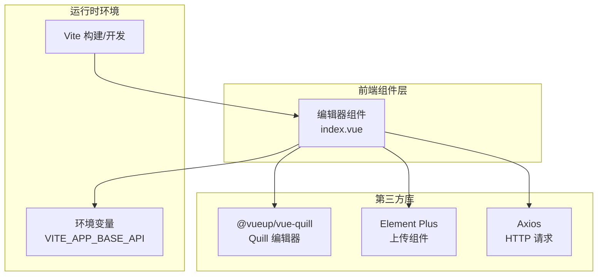
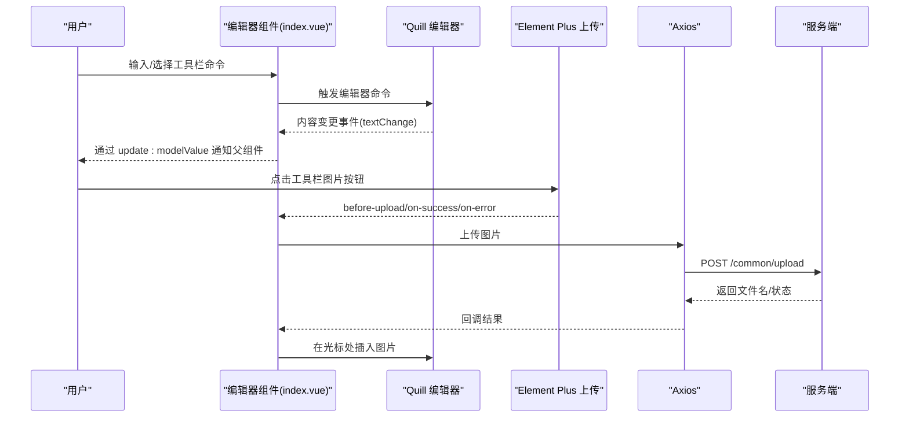
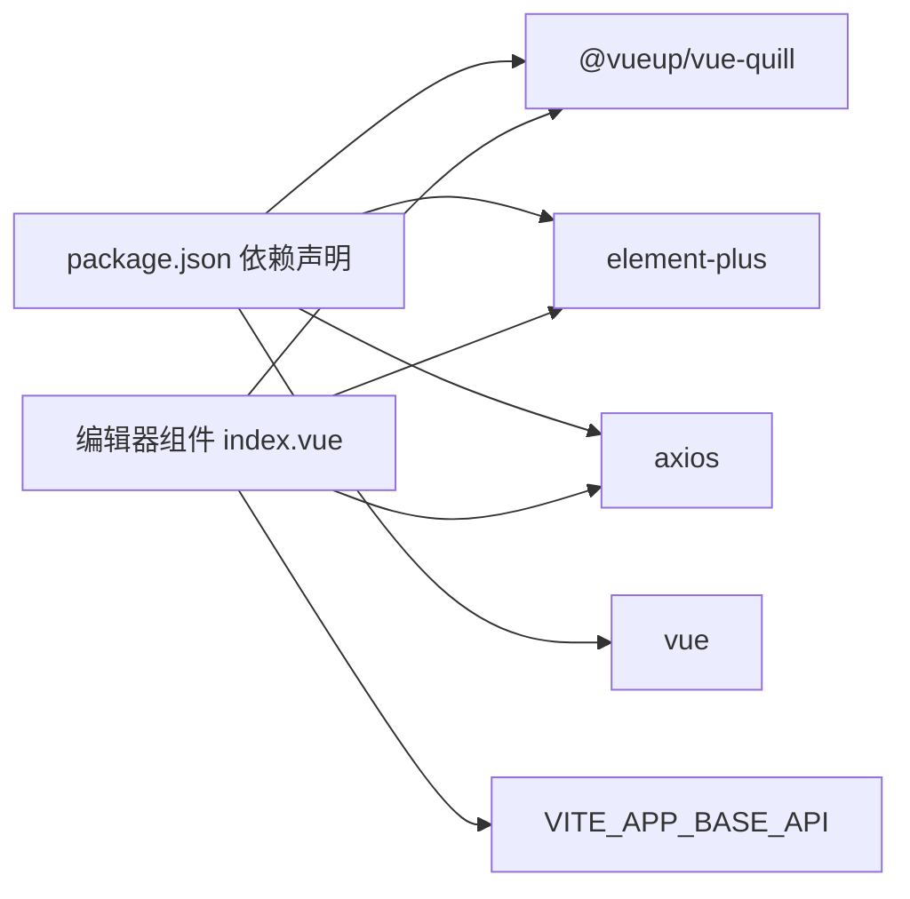

# 编辑器组件

<cite>
**本文引用的文件**
- [index.vue](file://antflow-vue/src/components/Editor/index.vue)
- [package.json](file://antflow-vue/package.json)
- [validate.js](file://antflow-vue/src/utils/validate.js)
</cite>

## 目录
1. [简介](#简介)
2. [项目结构](#项目结构)
3. [核心组件](#核心组件)
4. [架构总览](#架构总览)
5. [详细组件分析](#详细组件分析)
6. [依赖关系分析](#依赖关系分析)
7. [性能考虑](#性能考虑)
8. [故障排查指南](#故障排查指南)
9. [结论](#结论)
10. [附录](#附录)

## 简介
本文件面向开发者，系统性梳理“编辑器组件”的功能特性、工具栏配置、内容格式化支持、初始化配置、内容获取与事件监听机制，并结合 Element Plus 的集成方式、样式覆盖与主题定制进行说明。同时提供插件扩展、自定义按钮添加、内容验证规则的实践建议，以及使用示例与常见问题解决方案，帮助在项目中高效集成富文本编辑能力。

## 项目结构
编辑器组件位于前端工程 antflow-vue 中，基于 Vue 3 与 @vueup/vue-quill（即 Quill 的 Vue 封装）实现，配合 Element Plus 的上传组件完成图片上传与粘贴图片处理。组件通过属性驱动配置，支持只读、高度、最小高度、文件大小限制、图片上传类型等参数；通过事件向外暴露内容变更。

图表来源
- [index.vue:18-25](file://antflow-vue/src/components/Editor/index.vue#L18-L25)
- [index.vue:30-33](file://antflow-vue/src/components/Editor/index.vue#L30-L33)
- [package.json:18-40](file://antflow-vue/package.json#L18-L40)

章节来源
- [index.vue:1-277](file://antflow-vue/src/components/Editor/index.vue#L1-L277)
- [package.json:1-54](file://antflow-vue/package.json#L1-L54)

## 核心组件
- 组件名称：编辑器组件
- 技术栈：Vue 3 + @vueup/vue-quill + Element Plus
- 主要职责：
  - 提供富文本编辑能力（HTML 内容）
  - 支持工具栏格式化（加粗、斜体、列表、对齐、标题、颜色等）
  - 图片上传与粘贴插入（支持本地上传与 URL 两种模式）
  - 只读模式、高度与最小高度控制
  - 事件透传（内容变更）

章节来源
- [index.vue:18-25](file://antflow-vue/src/components/Editor/index.vue#L18-L25)
- [index.vue:43-73](file://antflow-vue/src/components/Editor/index.vue#L43-L73)
- [index.vue:75-96](file://antflow-vue/src/components/Editor/index.vue#L75-L96)

## 架构总览
编辑器组件采用“组合式 API + 第三方库封装”的架构设计。组件内部通过 QuillEditor 实现富文本编辑，通过 Element Plus 的上传组件实现图片上传，通过 Axios 发起上传请求，通过环境变量拼接上传接口地址。组件对外以属性与事件的方式提供配置与回调。

图表来源
- [index.vue:18-25](file://antflow-vue/src/components/Editor/index.vue#L18-L25)
- [index.vue:38-41](file://antflow-vue/src/components/Editor/index.vue#L38-L41)
- [index.vue:117-130](file://antflow-vue/src/components/Editor/index.vue#L117-L130)
- [index.vue:133-150](file://antflow-vue/src/components/Editor/index.vue#L133-L150)
- [index.vue:153-172](file://antflow-vue/src/components/Editor/index.vue#L153-L172)
- [index.vue:175-195](file://antflow-vue/src/components/Editor/index.vue#L175-L195)

## 详细组件分析

### 属性与配置
- modelValue：双向绑定的内容值（HTML 字符串）
- height：编辑器整体高度（像素）
- minHeight：编辑器最小高度（像素）
- readOnly：是否只读
- fileSize：上传文件大小限制（MB）
- type：图片上传类型（"url" 或其他），用于切换上传行为

章节来源
- [index.vue:43-73](file://antflow-vue/src/components/Editor/index.vue#L43-L73)

### 工具栏与内容格式化
- 主题：snow
- 工具栏分组包括：文本样式、引用/代码块、列表、缩进、字号、标题、颜色/背景、对齐、清除格式、链接/图片/视频
- 占位符：请输入内容
- 只读状态由属性决定

章节来源
- [index.vue:75-96](file://antflow-vue/src/components/Editor/index.vue#L75-L96)

### 初始化与挂载逻辑
- mounted 阶段：
  - 若 type 为 "url"，注册工具栏图片处理器，点击图片按钮触发隐藏上传按钮
  - 注册粘贴事件监听，捕获剪贴板中的图片并自动上传插入

章节来源
- [index.vue:117-130](file://antflow-vue/src/components/Editor/index.vue#L117-L130)
- [index.vue:175-187](file://antflow-vue/src/components/Editor/index.vue#L175-L187)

### 图片上传与粘贴处理
- 上传前校验：
  - 文件类型限制（JPEG/JPG/PNG/SVG）
  - 文件大小限制（MB）
- 成功回调：
  - 获取 Quill 实例与当前光标位置
  - 在光标处插入图片（使用服务端返回的文件名）
  - 将光标移动到插入图片之后
- 错误回调：
  - 通过全局提示组件提示“图片插入失败”
- 粘贴处理：
  - 捕获剪贴板图片，构造 FormData 并上传

章节来源
- [index.vue:133-150](file://antflow-vue/src/components/Editor/index.vue#L133-L150)
- [index.vue:153-172](file://antflow-vue/src/components/Editor/index.vue#L153-L172)
- [index.vue:175-195](file://antflow-vue/src/components/Editor/index.vue#L175-L195)

### 事件监听机制
- 内容变更事件：通过 textChange 将当前 HTML 同步回父组件（update:modelValue）
- 上传事件：before-upload、on-success、on-error 由 Element Plus 上传组件触发

章节来源
- [index.vue:22](file://antflow-vue/src/components/Editor/index.vue#L22)
- [index.vue:3](file://antflow-vue/src/components/Editor/index.vue#L3)

### 与 Element Plus 的集成
- 使用 ElUpload 组件作为图片上传入口
- 通过 ref 触发隐藏的上传按钮
- 上传请求头携带认证令牌（Authorization: Bearer ...）

章节来源
- [index.vue:3](file://antflow-vue/src/components/Editor/index.vue#L3)
- [index.vue:38-41](file://antflow-vue/src/components/Editor/index.vue#L38-L41)

### 样式覆盖与主题定制
- 默认主题 snow
- 工具栏提示文案本地化（如链接/视频输入提示）
- 字号/标题/字体选择器的占位文案本地化
- 行高与换行优化（white-space、line-height）
- 可通过覆盖类名扩展样式（如 .ql-snow、.ql-tooltip、.ql-picker 等）

章节来源
- [index.vue:75](file://antflow-vue/src/components/Editor/index.vue#L75)
- [index.vue:198-276](file://antflow-vue/src/components/Editor/index.vue#L198-L276)

### 插件扩展与自定义按钮
- 当前内置图片上传与粘贴处理
- 可通过 Quill 模块扩展（例如注册自定义工具栏按钮、模块）
- 建议在 mounted 中通过 quill.getModule("toolbar").addHandler(...) 注册自定义处理函数

章节来源
- [index.vue:119-127](file://antflow-vue/src/components/Editor/index.vue#L119-L127)

### 内容验证规则
- 组件未内置内容校验逻辑
- 建议在父组件中结合通用校验工具进行验证（如非空、长度、URL 合法性等）
- 可参考 validate.js 中的常用校验方法

章节来源
- [validate.js:1-115](file://antflow-vue/src/utils/validate.js#L1-L115)

### 使用示例与配置参数说明
- 基本用法：绑定 modelValue，监听 update:modelValue 获取最新 HTML
- 高度控制：height/minHeight 控制容器尺寸
- 只读模式：readOnly=true
- 上传限制：fileSize 控制大小，type 控制上传模式
- 事件使用：监听 textChange 获取内容变更

章节来源
- [index.vue:18-25](file://antflow-vue/src/components/Editor/index.vue#L18-L25)
- [index.vue:43-73](file://antflow-vue/src/components/Editor/index.vue#L43-L73)
- [index.vue:109-114](file://antflow-vue/src/components/Editor/index.vue#L109-L114)

## 依赖关系分析
- 组件依赖：
  - @vueup/vue-quill：富文本编辑器核心
  - element-plus：上传组件与全局提示
  - axios：HTTP 上传请求
  - vue：组合式 API 与响应式系统
- 运行时依赖：
  - 环境变量 VITE_APP_BASE_API：拼接上传接口地址
  - 认证令牌：Authorization 头部

图表来源
- [package.json:18-40](file://antflow-vue/package.json#L18-L40)
- [index.vue:30-33](file://antflow-vue/src/components/Editor/index.vue#L30-L33)
- [index.vue:38](file://antflow-vue/src/components/Editor/index.vue#L38)

章节来源
- [package.json:1-54](file://antflow-vue/package.json#L1-L54)
- [index.vue:30-41](file://antflow-vue/src/components/Editor/index.vue#L30-L41)

## 性能考虑
- 图片上传采用 FormData，避免额外序列化开销
- 仅在 type 为 "url" 时注册图片处理与粘贴监听，减少不必要事件绑定
- 通过 props 控制只读与尺寸，避免不必要的渲染更新
- 建议在父组件中对频繁的 update:modelValue 事件做节流/防抖处理（可选）

## 故障排查指南
- 图片上传失败
  - 检查服务端接口是否可用与返回结构是否符合预期
  - 确认 Authorization 头是否正确传递
  - 确认文件类型与大小限制是否满足要求
- 粘贴图片无效
  - 浏览器剪贴板权限与格式支持
  - 确认 mounted 中的粘贴事件已注册
- 工具栏按钮无效
  - 确认 mounted 中图片处理器已注册
  - 确认 type 配置为 "url"
- 样式异常
  - 检查是否覆盖了 .ql-snow、.ql-tooltip、.ql-picker 等类名
  - 确认主题样式文件已正确引入

章节来源
- [index.vue:133-150](file://antflow-vue/src/components/Editor/index.vue#L133-L150)
- [index.vue:153-172](file://antflow-vue/src/components/Editor/index.vue#L153-L172)
- [index.vue:175-195](file://antflow-vue/src/components/Editor/index.vue#L175-L195)
- [index.vue:117-130](file://antflow-vue/src/components/Editor/index.vue#L117-L130)
- [index.vue:198-276](file://antflow-vue/src/components/Editor/index.vue#L198-L276)

## 结论
该编辑器组件以轻量、易用为目标，结合 Quill 与 Element Plus 实现了基础富文本编辑与图片上传能力。通过属性与事件即可灵活控制编辑器行为，配合样式覆盖与主题定制可满足多数业务场景。对于更复杂的扩展需求（如自定义按钮、模块化插件），可在现有基础上继续增强。

## 附录
- 依赖安装与版本
  - @vueup/vue-quill、element-plus、axios、vue 等
- 环境变量
  - VITE_APP_BASE_API：用于拼接上传接口地址
- 常用校验工具
  - validate.js 提供多种校验方法，可用于内容验证

章节来源
- [package.json:18-40](file://antflow-vue/package.json#L18-L40)
- [index.vue:38](file://antflow-vue/src/components/Editor/index.vue#L38)
- [validate.js:1-115](file://antflow-vue/src/utils/validate.js#L1-L115)