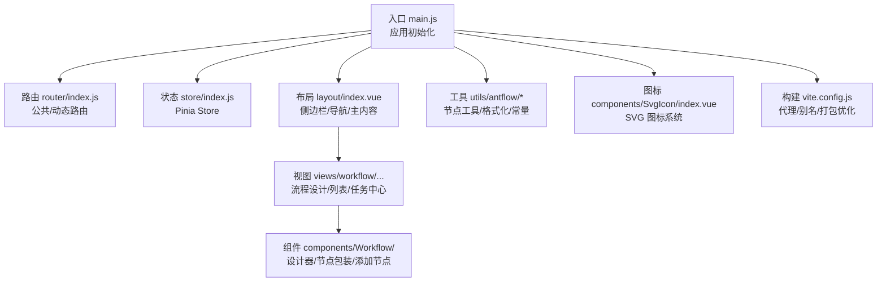
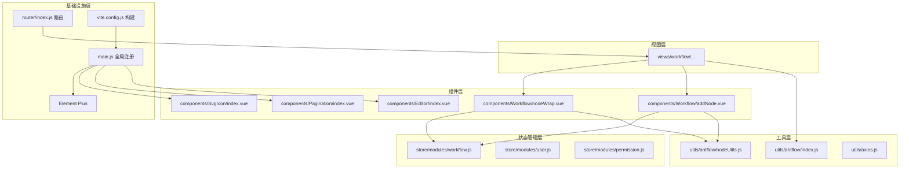
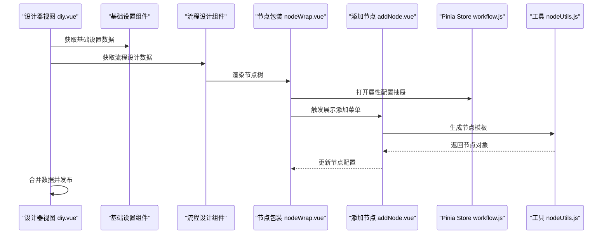
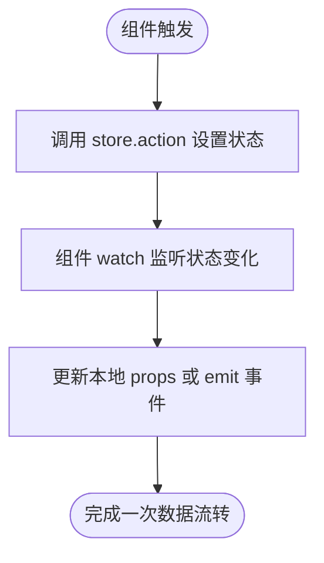
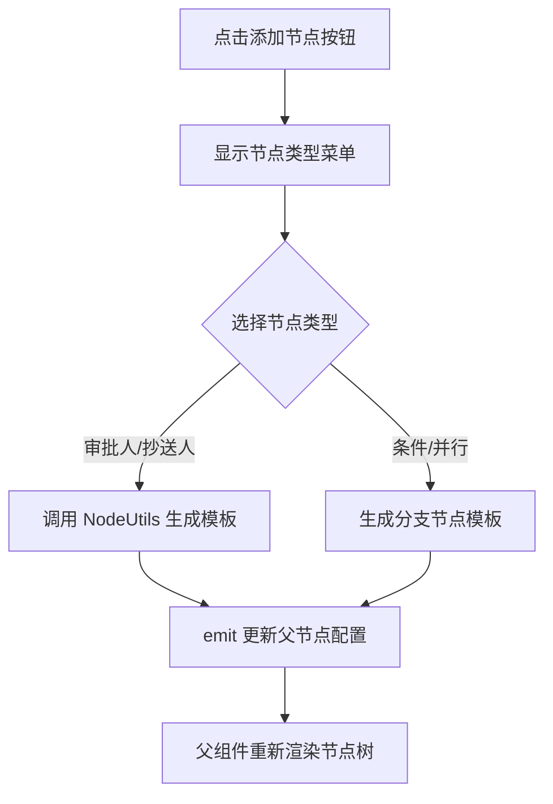
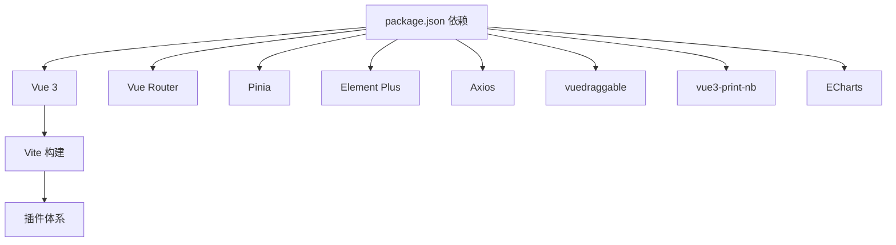

# 前端系统架构

<cite>
**本文档引用的文件**
- [package.json](file://antflow-vue/package.json)
- [main.js](file://antflow-vue/src/main.js)
- [App.vue](file://antflow-vue/src/App.vue)
- [vite.config.js](file://antflow-vue/vite.config.js)
- [settings.js](file://antflow-vue/src/settings.js)
- [router/index.js](file://antflow-vue/src/router/index.js)
- [store/index.js](file://antflow-vue/src/store/index.js)
- [layout/index.vue](file://antflow-vue/src/layout/index.vue)
- [components/Workflow/addNode.vue](file://antflow-vue/src/components/Workflow/addNode.vue)
- [components/Workflow/nodeWrap.vue](file://antflow-vue/src/components/Workflow/nodeWrap.vue)
- [store/modules/workflow.js](file://antflow-vue/src/store/modules/workflow.js)
- [utils/antflow/nodeUtils.js](file://antflow-vue/src/utils/antflow/nodeUtils.js)
- [utils/antflow/index.js](file://antflow-vue/src/utils/antflow/index.js)
- [components/SvgIcon/index.vue](file://antflow-vue/src/components/SvgIcon/index.vue)
- [views/workflow/flowDesign/diy.vue](file://antflow-vue/src/views/workflow/flowDesign/diy.vue)
</cite>

## 目录
1. [简介](#简介)
2. [项目结构](#项目结构)
3. [核心组件](#核心组件)
4. [架构总览](#架构总览)
5. [详细组件分析](#详细组件分析)
6. [依赖分析](#依赖分析)
7. [性能考虑](#性能考虑)
8. [故障排除指南](#故障排除指南)
9. [结论](#结论)
10. [附录](#附录)

## 简介
本文件面向前端系统架构，围绕 Vue.js 应用展开，重点阐述整体架构设计、组件树结构、状态管理模式；深入解析工作流设计器的组件架构、拖拽交互实现与属性配置面板设计；梳理业务组件库的设计理念、工具组件实现方式与图标系统管理机制；并覆盖路由配置、API 集成模式与响应式设计实现。最后提供组件开发指南与最佳实践，帮助开发者高效理解与扩展系统功能。

## 项目结构
AntFlow 前端采用 Vite 构建，基于 Vue 3 + Pinia + Vue Router 的现代前端技术栈。项目通过模块化组织，将路由、状态管理、组件、工具函数与样式分离，形成清晰的层次结构。入口文件负责全局注册与插件初始化，布局组件承载导航、侧边栏与主内容区，工作流相关视图与组件集中在 workflow 目录下，工具函数与常量位于 utils 下，图标系统通过 SVG 方案统一管理。

**图表来源**
- [main.js:1-110](file://antflow-vue/src/main.js#L1-L110)
- [router/index.js:1-339](file://antflow-vue/src/router/index.js#L1-L339)
- [store/index.js:1-3](file://antflow-vue/src/store/index.js#L1-L3)
- [layout/index.vue:1-142](file://antflow-vue/src/layout/index.vue#L1-L142)
- [views/workflow/flowDesign/diy.vue:1-185](file://antflow-vue/src/views/workflow/flowDesign/diy.vue#L1-L185)
- [components/Workflow/nodeWrap.vue:1-503](file://antflow-vue/src/components/Workflow/nodeWrap.vue#L1-L503)
- [components/Workflow/addNode.vue:1-252](file://antflow-vue/src/components/Workflow/addNode.vue#L1-L252)
- [utils/antflow/nodeUtils.js:1-412](file://antflow-vue/src/utils/antflow/nodeUtils.js#L1-L412)
- [components/SvgIcon/index.vue:1-54](file://antflow-vue/src/components/SvgIcon/index.vue#L1-L54)
- [vite.config.js:1-100](file://antflow-vue/vite.config.js#L1-L100)

**章节来源**
- [main.js:1-110](file://antflow-vue/src/main.js#L1-L110)
- [vite.config.js:1-100](file://antflow-vue/vite.config.js#L1-L100)
- [settings.js:1-58](file://antflow-vue/src/settings.js#L1-L58)

## 核心组件
- 应用入口与全局注册
  - 在入口文件中完成 Element Plus、SVG 图标、全局组件、指令、打印插件与权限控制的注册，确保应用启动时具备完整的 UI 与交互能力。
  - 通过全局属性挂载常用工具方法，便于在组件中直接调用。
- 布局与导航
  - 布局组件负责侧边栏、顶部导航、标签页与主内容区域的组合，支持响应式切换与主题控制。
  - 通过设置模块读取配置，控制侧边栏主题、标签页显示、固定头部等行为。
- 工作流设计器
  - 设计器视图通过步骤化界面串联“基础设置”和“流程设计”，并在发布时整合两部分数据。
  - 流程设计的核心是节点包装组件与添加节点组件，配合状态管理实现节点增删改查与属性配置。

**章节来源**
- [main.js:67-110](file://antflow-vue/src/main.js#L67-L110)
- [layout/index.vue:16-94](file://antflow-vue/src/layout/index.vue#L16-L94)
- [views/workflow/flowDesign/diy.vue:40-91](file://antflow-vue/src/views/workflow/flowDesign/diy.vue#L40-L91)

## 架构总览
系统采用“视图层-组件层-状态管理层-工具层-基础设施层”的分层架构：
- 视图层：路由驱动的页面视图，按功能域划分（系统管理、工作流等）。
- 组件层：可复用的业务组件与工具组件，如节点包装、添加节点、图标、分页、富文本等。
- 状态管理层：Pinia Store 提供跨组件共享的状态，包括流程设计器状态、用户信息、权限等。
- 工具层：封装节点生成、流程树展平、条件字符串生成等工具函数。
- 基础设施层：Vite 构建、Element Plus UI、SVG 图标、Axios 请求等。

**图表来源**
- [router/index.js:1-339](file://antflow-vue/src/router/index.js#L1-L339)
- [store/modules/workflow.js:1-69](file://antflow-vue/src/store/modules/workflow.js#L1-L69)
- [components/Workflow/nodeWrap.vue:140-467](file://antflow-vue/src/components/Workflow/nodeWrap.vue#L140-L467)
- [components/Workflow/addNode.vue:54-104](file://antflow-vue/src/components/Workflow/addNode.vue#L54-L104)
- [utils/antflow/nodeUtils.js:1-412](file://antflow-vue/src/utils/antflow/nodeUtils.js#L1-L412)
- [utils/antflow/index.js:1-279](file://antflow-vue/src/utils/antflow/index.js#L1-L279)
- [main.js:1-110](file://antflow-vue/src/main.js#L1-L110)
- [vite.config.js:1-100](file://antflow-vue/vite.config.js#L1-L100)

## 详细组件分析

### 工作流设计器组件架构
- 设计器视图（diy.vue）
  - 采用步骤化界面，包含“基础设置”和“流程设计”两个步骤，分别由对应子组件承载。
  - 发布流程时，先收集基础设置数据，再从流程设计子组件获取节点配置，最终合并提交至后端。
- 节点包装组件（nodeWrap.vue）
  - 根据节点类型渲染不同 UI：普通审批人/抄送人、条件分支、并行审批分支。
  - 支持节点名称编辑、条件/并行节点增删、优先级调整、错误提示与子节点递归渲染。
  - 通过 Pinia 状态管理触发属性配置抽屉打开与数据回填。
- 添加节点组件（addNode.vue）
  - 提供弹出式菜单，支持添加审批人、并行审批、抄送人、条件分支、动态条件、条件并行等节点类型。
  - 通过映射表根据类型调用节点工具函数生成节点模板，并向上级组件发出更新事件。

**图表来源**
- [views/workflow/flowDesign/diy.vue:40-129](file://antflow-vue/src/views/workflow/flowDesign/diy.vue#L40-L129)
- [components/Workflow/nodeWrap.vue:140-467](file://antflow-vue/src/components/Workflow/nodeWrap.vue#L140-L467)
- [components/Workflow/addNode.vue:54-104](file://antflow-vue/src/components/Workflow/addNode.vue#L54-L104)
- [store/modules/workflow.js:1-69](file://antflow-vue/src/store/modules/workflow.js#L1-L69)
- [utils/antflow/nodeUtils.js:26-356](file://antflow-vue/src/utils/antflow/nodeUtils.js#L26-L356)

**章节来源**
- [views/workflow/flowDesign/diy.vue:40-129](file://antflow-vue/src/views/workflow/flowDesign/diy.vue#L40-L129)
- [components/Workflow/nodeWrap.vue:140-467](file://antflow-vue/src/components/Workflow/nodeWrap.vue#L140-L467)
- [components/Workflow/addNode.vue:54-104](file://antflow-vue/src/components/Workflow/addNode.vue#L54-L104)

### 状态管理模式
- Store 结构
  - 包含流程设计器相关的状态：发起人、审批人、抄送人、条件分支、预览抽屉等。
  - 通过 actions 维护状态变更，组件通过计算属性与 watch 监听状态变化，实现双向数据流。
- 数据流转
  - 节点包装组件在用户点击属性时，调用 store 的相应 action 设置抽屉状态与当前节点配置。
  - 组件通过监听 store 中的配置对象，将外部传入的配置与内部修改进行同步。

**图表来源**
- [store/modules/workflow.js:21-67](file://antflow-vue/src/store/modules/workflow.js#L21-L67)
- [components/Workflow/nodeWrap.vue:235-257](file://antflow-vue/src/components/Workflow/nodeWrap.vue#L235-L257)

**章节来源**
- [store/modules/workflow.js:1-69](file://antflow-vue/src/store/modules/workflow.js#L1-L69)
- [components/Workflow/nodeWrap.vue:235-257](file://antflow-vue/src/components/Workflow/nodeWrap.vue#L235-L257)

### 拖拽交互实现
- 节点添加与连接
  - 添加节点组件通过弹出式菜单提供节点类型选择，点击后调用节点工具函数生成模板节点。
  - 节点包装组件维护父子节点关系，支持条件/并行节点的增删与优先级调整。
- 交互细节
  - 名称编辑采用输入框与只读文本切换，失焦保存。
  - 条件节点支持排序与删除，删除后自动调整剩余节点的优先级与标题。
  - 错误状态通过 isTried 与 error 字段联动，统一展示错误提示。

**图表来源**
- [components/Workflow/addNode.vue:54-104](file://antflow-vue/src/components/Workflow/addNode.vue#L54-L104)
- [utils/antflow/nodeUtils.js:26-356](file://antflow-vue/src/utils/antflow/nodeUtils.js#L26-L356)
- [components/Workflow/nodeWrap.vue:292-373](file://antflow-vue/src/components/Workflow/nodeWrap.vue#L292-L373)

**章节来源**
- [components/Workflow/addNode.vue:54-104](file://antflow-vue/src/components/Workflow/addNode.vue#L54-L104)
- [components/Workflow/nodeWrap.vue:292-373](file://antflow-vue/src/components/Workflow/nodeWrap.vue#L292-L373)

### 属性配置面板设计
- 配置触发
  - 节点包装组件在点击节点内容区域时，根据节点类型调用 store 的相应 action 打开对应的属性配置抽屉。
- 数据绑定
  - 抽屉内组件通过双向绑定接收当前节点配置，修改后通过 emit 将更新后的配置回传给父组件。
- 错误与提示
  - 通过 isTried 与 error 字段控制错误提示的显示，条件节点与并行节点在增删改时自动重置错误状态与展示名称。

**章节来源**
- [components/Workflow/nodeWrap.vue:402-448](file://antflow-vue/src/components/Workflow/nodeWrap.vue#L402-L448)
- [store/modules/workflow.js:34-54](file://antflow-vue/src/store/modules/workflow.js#L34-L54)

### 业务组件库设计理念
- 可复用性
  - 组件以功能维度拆分，如分页、富文本、文件上传、图片上传/预览、字典标签等，均以全局注册或局部引入的方式提供。
- 一致性
  - 统一使用 Element Plus 作为 UI 基础，结合 SVG 图标系统，保证视觉与交互的一致性。
- 可扩展性
  - 通过 props 与 emits 实现组件间通信，配合工具函数与状态管理，便于扩展新的节点类型与配置项。

**章节来源**
- [main.js:84-92](file://antflow-vue/src/main.js#L84-L92)
- [components/SvgIcon/index.vue:1-54](file://antflow-vue/src/components/SvgIcon/index.vue#L1-L54)

### 工具组件实现方式
- 节点工具（nodeUtils.js）
  - 提供节点模板生成、流程树展平、条件判断对象创建等能力，支撑设计器的数据模型。
- 流程工具（index.js）
  - 提供节点名称展示字符串生成、条件表达式拼接、数组操作等工具方法，用于 UI 展示与逻辑处理。
- 常量与颜色
  - 通过常量文件定义节点类型与占位符，配合颜色映射实现不同节点类型的视觉区分。

**章节来源**
- [utils/antflow/nodeUtils.js:1-412](file://antflow-vue/src/utils/antflow/nodeUtils.js#L1-L412)
- [utils/antflow/index.js:1-279](file://antflow-vue/src/utils/antflow/index.js#L1-L279)

### 图标系统管理机制
- SVG 图标方案
  - 通过虚拟模块注册与组件封装，实现 SVG 图标的统一管理与按需使用。
  - 组件支持 iconClass、className、color 等属性，便于在不同场景下灵活使用。
- 注册与使用
  - 在入口文件中完成图标注册与全局组件注册，组件内通过 svg-icon 组件引用图标。

**章节来源**
- [main.js:26-29](file://antflow-vue/src/main.js#L26-L29)
- [components/SvgIcon/index.vue:1-54](file://antflow-vue/src/components/SvgIcon/index.vue#L1-L54)

### 路由配置
- 公共路由
  - 登录、404、重定向、个人中心等页面采用公共路由，无需权限校验。
- 动态路由
  - 基于用户权限动态加载的路由，如流程设计、流程预览、任务管理等，通过权限标识控制访问。
- 路由守卫
  - 通过权限文件实现访问控制，结合 keep-alive 与面包屑导航，提供良好的用户体验。

**章节来源**
- [router/index.js:28-324](file://antflow-vue/src/router/index.js#L28-L324)

### API 集成模式
- 请求封装
  - 通过 Axios 封装请求工具，统一处理拦截器、错误码与下载等功能。
- 设计器数据流
  - 设计器视图在发布时，先从基础设置与流程设计子组件获取数据，再通过格式化工具转换为后端所需结构，最后调用设置接口提交。
- Mock 与真实接口
  - 项目同时提供 mock 数据与真实 API 接口，便于开发与联调。

**章节来源**
- [views/workflow/flowDesign/diy.vue:94-125](file://antflow-vue/src/views/workflow/flowDesign/diy.vue#L94-L125)

### 响应式设计实现
- 布局响应式
  - 布局组件根据设备类型切换侧边栏与标签页显示，支持移动端与桌面端的差异化体验。
- 主题与样式
  - 通过设置模块与主题工具，支持深浅主题切换与动态样式注入。
- UI 组件
  - 基于 Element Plus 的响应式组件，结合 SCSS 变量与混入，实现一致的视觉规范。

**章节来源**
- [layout/index.vue:39-55](file://antflow-vue/src/layout/index.vue#L39-L55)
- [App.vue:9-14](file://antflow-vue/src/App.vue#L9-L14)
- [settings.js:1-58](file://antflow-vue/src/settings.js#L1-L58)

## 依赖分析
- 核心依赖
  - Vue 3、Vue Router、Pinia、Element Plus、Axios 等构成前端核心生态。
- 开发与构建
  - Vite 提供快速开发与构建能力，插件体系支持自动导入、SVG 图标、压缩等。
- 第三方组件
  - vuedraggable 用于拖拽交互，vue3-print-nb 用于打印，ECharts 用于图表展示等。

**图表来源**
- [package.json:18-40](file://antflow-vue/package.json#L18-L40)
- [vite.config.js:1-100](file://antflow-vue/vite.config.js#L1-L100)

**章节来源**
- [package.json:18-40](file://antflow-vue/package.json#L18-L40)
- [vite.config.js:1-100](file://antflow-vue/vite.config.js#L1-L100)

## 性能考虑
- 代码分割与懒加载
  - Vite 配置对 vForm 库与第三方依赖进行手动分包，减少首屏体积。
  - 路由组件采用动态导入，实现按需加载。
- 打包优化
  - 关闭生产 sourcemap，启用压缩与文件命名策略，提升加载速度。
- 运行时优化
  - 使用虚拟模块注册 SVG 图标，避免重复请求；全局组件与指令按需注册，降低运行时开销。

**章节来源**
- [vite.config.js:32-62](file://antflow-vue/vite.config.js#L32-L62)
- [main.js:100-101](file://antflow-vue/src/main.js#L100-L101)

## 故障排除指南
- 路由跳转异常
  - 检查路由配置中的 meta、name、permissions 等字段是否正确设置。
  - 确认权限文件已正确引入并生效。
- 设计器节点无法添加/删除
  - 检查节点工具函数是否正确生成模板，确认组件 emit 事件是否正常触发。
  - 查看 store 状态是否正确更新，watch 是否生效。
- 图标不显示
  - 确认 SVG 图标注册是否完成，组件属性是否正确传入 iconClass。
- 打包或运行时错误
  - 检查 Vite 插件配置与别名设置，确保路径与导入路径一致。

**章节来源**
- [router/index.js:18-25](file://antflow-vue/src/router/index.js#L18-L25)
- [main.js:26-29](file://antflow-vue/src/main.js#L26-L29)
- [vite.config.js:28-30](file://antflow-vue/vite.config.js#L28-L30)

## 结论
本前端系统以 Vue 3 为核心，结合 Pinia 与 Vue Router，构建了清晰的分层架构与可扩展的组件体系。工作流设计器通过节点包装与添加节点组件实现强大的可视化配置能力，配合状态管理与工具函数，形成稳定的数据流与交互闭环。图标系统、路由与 API 集成、响应式设计与性能优化共同保障了系统的可用性与可维护性。遵循本文档的组件开发指南与最佳实践，可帮助团队高效迭代与扩展系统功能。

## 附录
- 组件开发指南与最佳实践
  - 组件职责单一，通过 props 与 emits 明确数据流。
  - 使用工具函数封装复杂逻辑，保持组件简洁。
  - 利用 Pinia 管理跨组件共享状态，避免深层传递。
  - 为关键流程编写单元测试与集成测试，确保稳定性。
  - 对外暴露统一的 API 与类型定义，便于协作与维护。