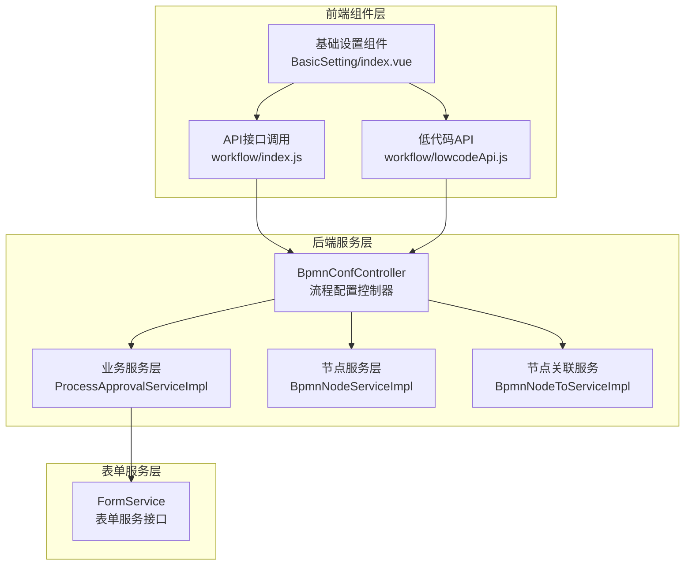
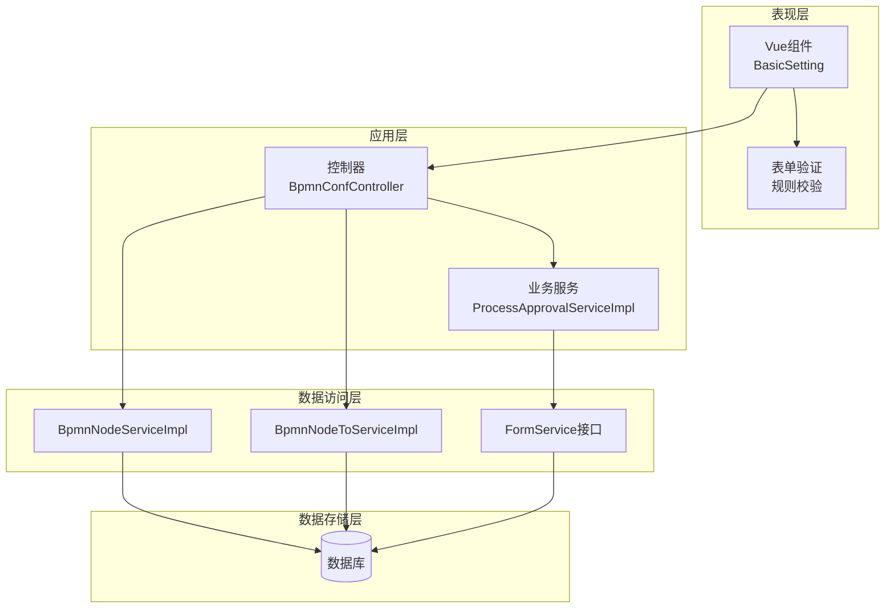
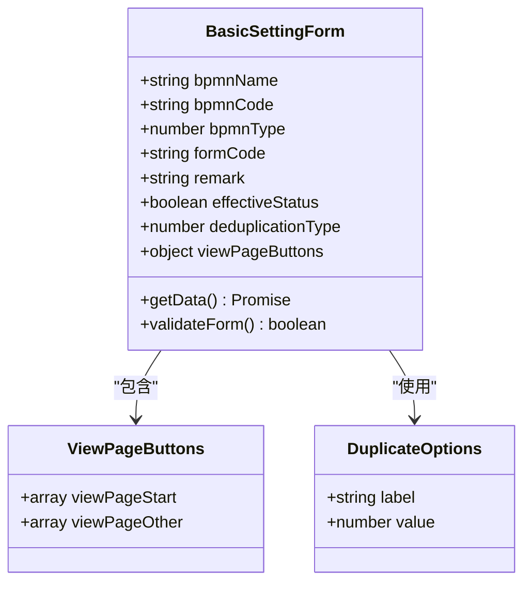
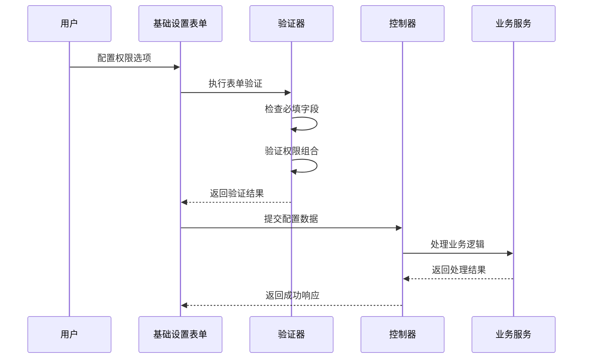
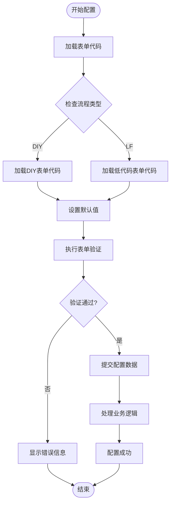
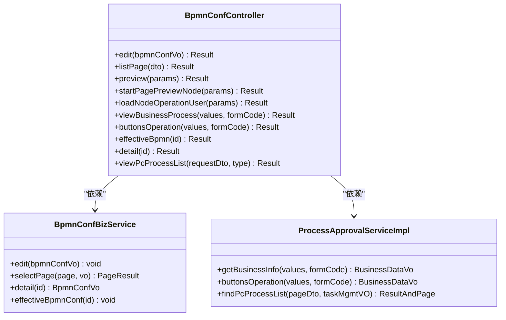
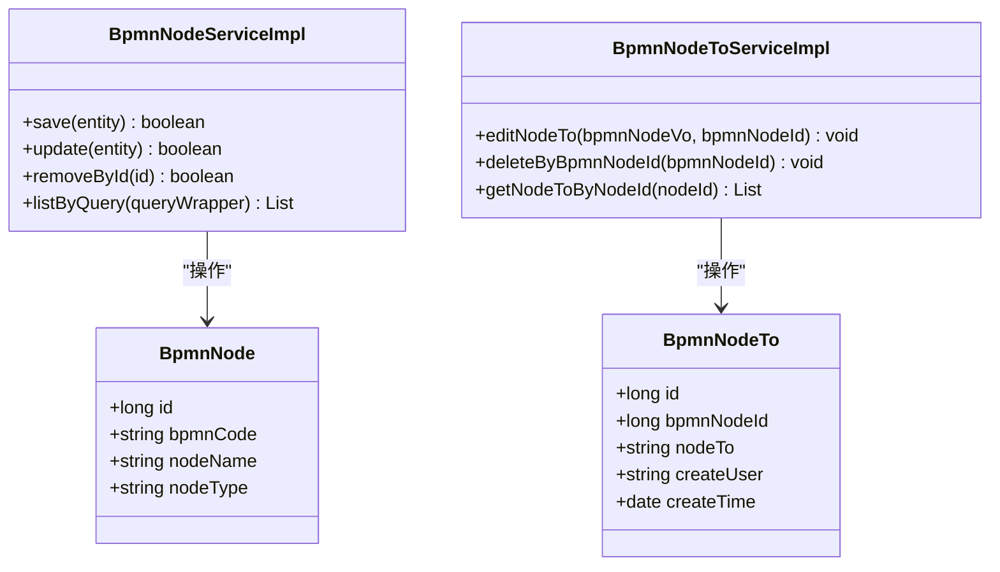
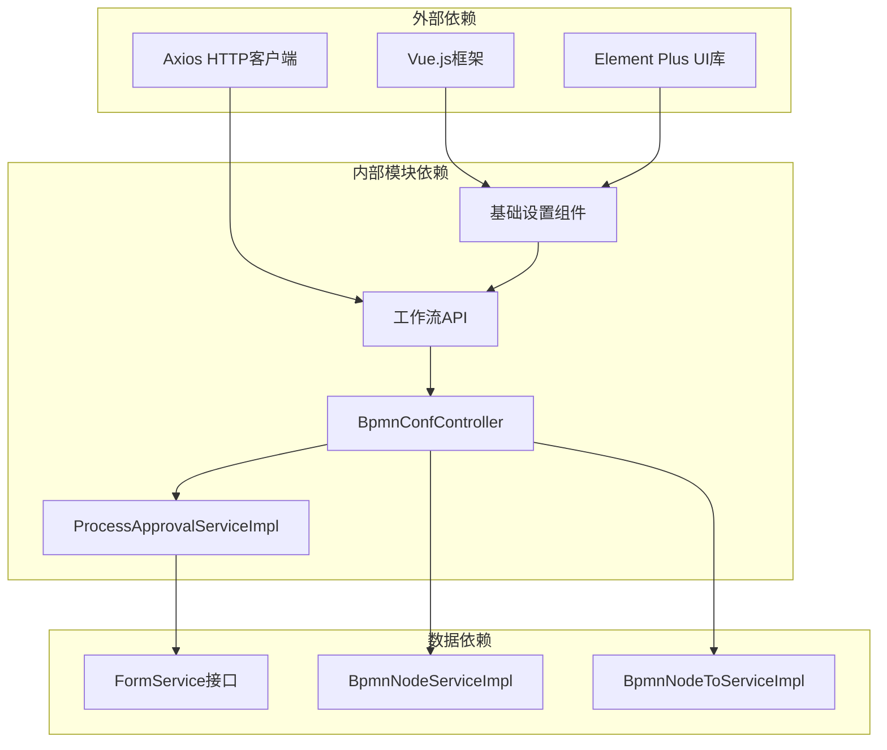
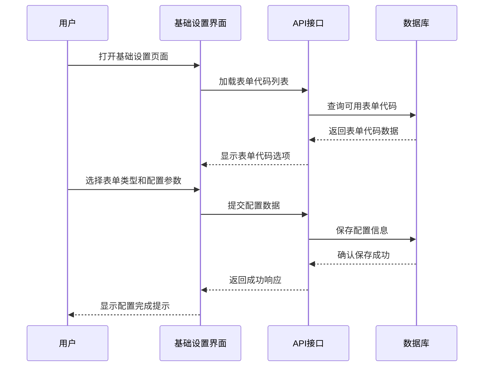

# 基础设置组件

<cite>
**本文档引用的文件**
- [index.vue](file://antflow-vue/src/components/Workflow/BasicSetting/index.vue)
- [BpmnConfController.java](file://antflow-engine/src/main/java/org/openoa/engine/bpmnconf/controller/BpmnConfController.java)
- [FormService.java](file://antflow-base/src/main/java/org/activiti/engine/FormService.java)
- [BpmnNodeServiceImpl.java](file://antflow-engine/src/main/java/org/openoa/engine/bpmnconf/service/impl/BpmnNodeServiceImpl.java)
- [BpmnNodeToServiceImpl.java](file://antflow-engine/src/main/java/org/openoa/engine/bpmnconf/service/impl/BpmnNodeToServiceImpl.java)
- [ProcessApprovalServiceImpl.java](file://antflow-engine/src/main/java/org/openoa/engine/bpmnconf/service/biz/ProcessApprovalServiceImpl.java)
</cite>

## 目录
1. [简介](#简介)
2. [项目结构](#项目结构)
3. [核心组件](#核心组件)
4. [架构概览](#架构概览)
5. [详细组件分析](#详细组件分析)
6. [依赖关系分析](#依赖关系分析)
7. [性能考虑](#性能考虑)
8. [故障排除指南](#故障排除指南)
9. [结论](#结论)
10. [附录](#附录)

## 简介

基础设置组件是工作流管理系统中的关键配置模块，负责管理流程的基本信息设置、表单权限配置和接口管理。该组件为用户提供了一个直观的界面来配置流程的基础属性，包括流程名称、类型标识、审批人去重策略、发起人权限等。

该组件采用前后端分离的设计架构，前端使用Vue.js框架构建响应式表单界面，后端通过Spring Boot提供RESTful API服务。组件支持两种流程类型：DIY（自定义）和LF（低代码），能够灵活适配不同的业务场景需求。

## 项目结构

基础设置组件在项目中的组织结构如下：

**图表来源**
- [index.vue:1-233](file://antflow-vue/src/components/Workflow/BasicSetting/index.vue#L1-L233)
- [BpmnConfController.java:1-191](file://antflow-engine/src/main/java/org/openoa/engine/bpmnconf/controller/BpmnConfController.java#L1-L191)

**章节来源**
- [index.vue:1-233](file://antflow-vue/src/components/Workflow/BasicSetting/index.vue#L1-L233)
- [BpmnConfController.java:1-191](file://antflow-engine/src/main/java/org/openoa/engine/bpmnconf/controller/BpmnConfController.java#L1-L191)

## 核心组件

### 前端基础设置组件

基础设置组件是一个基于Vue.js的响应式表单组件，主要功能包括：

- **流程基本信息管理**：支持流程名称、类型标识、备注信息的配置
- **审批人去重策略**：提供四种去重模式选择（不去重、前去重、后去重、相邻节点去重）
- **发起人权限配置**：支持撤回和作废等权限按钮的配置
- **表单代码管理**：支持DIY和LF两种类型的表单代码选择
- **数据验证机制**：内置表单验证规则，确保数据完整性

### 后端控制器服务

BpmnConfController作为核心控制器，提供以下API接口：

- **流程编辑接口**：处理流程配置的保存和更新操作
- **流程列表查询**：支持分页查询和条件筛选
- **流程预览功能**：提供流程设计的实时预览能力
- **节点操作用户加载**：获取节点当前的实际操作人员
- **业务流程查看**：支持审批页面的业务数据展示

**章节来源**
- [index.vue:76-233](file://antflow-vue/src/components/Workflow/BasicSetting/index.vue#L76-L233)
- [BpmnConfController.java:29-191](file://antflow-engine/src/main/java/org/openoa/engine/bpmnconf/controller/BpmnConfController.java#L29-L191)

## 架构概览

基础设置组件采用分层架构设计，确保了良好的可维护性和扩展性：

**图表来源**
- [index.vue:76-233](file://antflow-vue/src/components/Workflow/BasicSetting/index.vue#L76-L233)
- [BpmnConfController.java:32-46](file://antflow-engine/src/main/java/org/openoa/engine/bpmnconf/controller/BpmnConfController.java#L32-L46)
- [ProcessApprovalServiceImpl.java](file://antflow-engine/src/main/java/org/openoa/engine/bpmnconf/service/biz/ProcessApprovalServiceImpl.java)

## 详细组件分析

### 基础设置表单组件

#### 数据模型设计

基础设置组件使用响应式数据模型来管理表单状态：

**图表来源**
- [index.vue:122-134](file://antflow-vue/src/components/Workflow/BasicSetting/index.vue#L122-L134)
- [index.vue:113-119](file://antflow-vue/src/components/Workflow/BasicSetting/index.vue#L113-L119)

#### 表单权限配置机制

组件实现了灵活的权限配置机制，支持多种权限组合：

**图表来源**
- [index.vue:187-217](file://antflow-vue/src/components/Workflow/BasicSetting/index.vue#L187-L217)
- [BpmnConfController.java:65-69](file://antflow-engine/src/main/java/org/openoa/engine/bpmnconf/controller/BpmnConfController.java#L65-L69)

#### 表单接口管理机制

组件提供了完整的表单接口管理功能：

**图表来源**
- [index.vue:166-185](file://antflow-vue/src/components/Workflow/BasicSetting/index.vue#L166-L185)
- [index.vue:206-217](file://antflow-vue/src/components/Workflow/BasicSetting/index.vue#L206-L217)

**章节来源**
- [index.vue:122-217](file://antflow-vue/src/components/Workflow/BasicSetting/index.vue#L122-L217)

### 后端服务组件

#### 流程配置控制器

BpmnConfController作为核心控制器，提供了完整的RESTful API接口：

**图表来源**
- [BpmnConfController.java:32-46](file://antflow-engine/src/main/java/org/openoa/engine/bpmnconf/controller/BpmnConfController.java#L32-L46)
- [ProcessApprovalServiceImpl.java](file://antflow-engine/src/main/java/org/openoa/engine/bpmnconf/service/biz/ProcessApprovalServiceImpl.java)

#### 节点服务组件

节点服务组件负责处理流程节点的相关操作：

**图表来源**
- [BpmnNodeServiceImpl.java:9-12](file://antflow-engine/src/main/java/org/openoa/engine/bpmnconf/service/impl/BpmnNodeServiceImpl.java#L9-L12)
- [BpmnNodeToServiceImpl.java:17-47](file://antflow-engine/src/main/java/org/openoa/engine/bpmnconf/service/impl/BpmnNodeToServiceImpl.java#L17-L47)

**章节来源**
- [BpmnConfController.java:29-191](file://antflow-engine/src/main/java/org/openoa/engine/bpmnconf/controller/BpmnConfController.java#L29-L191)
- [BpmnNodeServiceImpl.java:1-13](file://antflow-engine/src/main/java/org/openoa/engine/bpmnconf/service/impl/BpmnNodeServiceImpl.java#L1-L13)
- [BpmnNodeToServiceImpl.java:1-48](file://antflow-engine/src/main/java/org/openoa/engine/bpmnconf/service/impl/BpmnNodeToServiceImpl.java#L1-L48)

## 依赖关系分析

基础设置组件的依赖关系体现了清晰的分层架构：

**图表来源**
- [index.vue:76-83](file://antflow-vue/src/components/Workflow/BasicSetting/index.vue#L76-L83)
- [BpmnConfController.java:32-46](file://antflow-engine/src/main/java/org/openoa/engine/bpmnconf/controller/BpmnConfController.java#L32-L46)

**章节来源**
- [FormService.java:31-102](file://antflow-base/src/main/java/org/activiti/engine/FormService.java#L31-L102)

## 性能考虑

### 前端性能优化

基础设置组件在前端层面采用了多项性能优化策略：

- **懒加载机制**：表单代码选项按需加载，减少初始加载时间
- **响应式数据绑定**：使用Vue.js的响应式系统，避免不必要的DOM更新
- **表单验证缓存**：验证规则结果缓存，提升用户体验
- **异步数据加载**：采用异步方式加载表单数据，避免阻塞UI线程

### 后端性能优化

后端服务通过以下方式保证高性能：

- **服务层分离**：控制器、业务服务、数据访问层职责明确，便于优化
- **批量操作**：节点关联数据采用批量插入，减少数据库交互次数
- **缓存策略**：合理使用缓存机制，减少重复计算和数据库查询
- **连接池管理**：数据库连接池配置优化，提高并发处理能力

## 故障排除指南

### 常见问题及解决方案

#### 表单验证失败

**问题描述**：表单提交时出现验证错误

**可能原因**：
- 必填字段未填写
- 权限配置冲突
- 表单代码无效

**解决步骤**：
1. 检查必填字段是否完整填写
2. 验证权限配置的合理性
3. 确认表单代码的有效性

#### API接口调用失败

**问题描述**：前端无法调用后端API接口

**可能原因**：
- CORS跨域问题
- 接口地址配置错误
- 认证令牌过期

**解决步骤**：
1. 检查CORS配置
2. 验证API接口地址
3. 刷新认证令牌

#### 数据持久化异常

**问题描述**：流程配置无法保存到数据库

**可能原因**：
- 数据库连接异常
- 事务处理失败
- 数据约束冲突

**解决步骤**：
1. 检查数据库连接状态
2. 查看事务日志
3. 验证数据约束

**章节来源**
- [index.vue:187-217](file://antflow-vue/src/components/Workflow/BasicSetting/index.vue#L187-L217)
- [BpmnConfController.java:65-69](file://antflow-engine/src/main/java/org/openoa/engine/bpmnconf/controller/BpmnConfController.java#L65-L69)

## 结论

基础设置组件作为工作流管理系统的核心配置模块，通过精心设计的架构和完善的实现机制，为用户提供了灵活、易用的流程配置功能。组件具有以下特点：

- **模块化设计**：前后端分离，职责明确，便于维护和扩展
- **灵活配置**：支持多种流程类型和权限配置，适应不同业务场景
- **性能优化**：采用多项性能优化策略，确保系统高效运行
- **错误处理**：完善的错误处理机制，提升系统稳定性

该组件为后续的功能扩展奠定了良好的基础，开发者可以在此基础上进一步完善表单权限管理、接口配置等功能，构建更加完善的工作流管理系统。

## 附录

### 使用示例

#### 基础配置使用流程

#### 权限配置最佳实践

1. **最小权限原则**：为不同角色配置最小必要的权限
2. **定期审查**：定期审查和更新权限配置
3. **文档记录**：详细记录权限配置变更历史
4. **测试验证**：在生产环境部署前进行充分测试

### 配置方法

#### 前端配置

1. 在基础设置组件中配置表单字段
2. 设置表单验证规则
3. 配置权限按钮显示逻辑
4. 集成API接口调用

#### 后端配置

1. 在控制器中添加新的API接口
2. 实现业务逻辑处理
3. 配置数据访问层
4. 设置安全认证机制