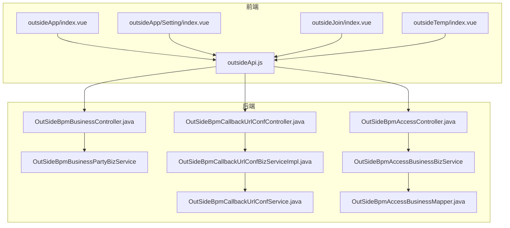
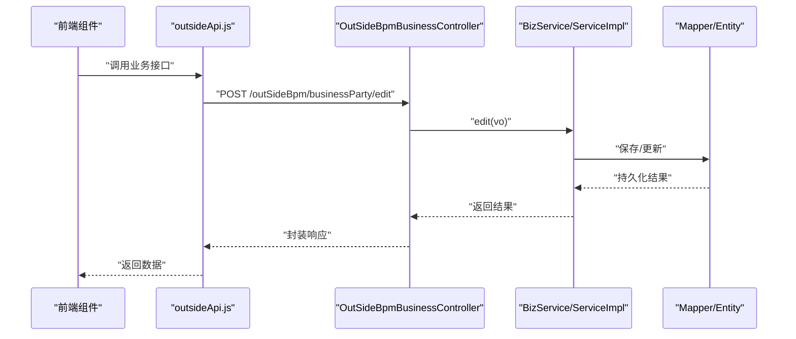
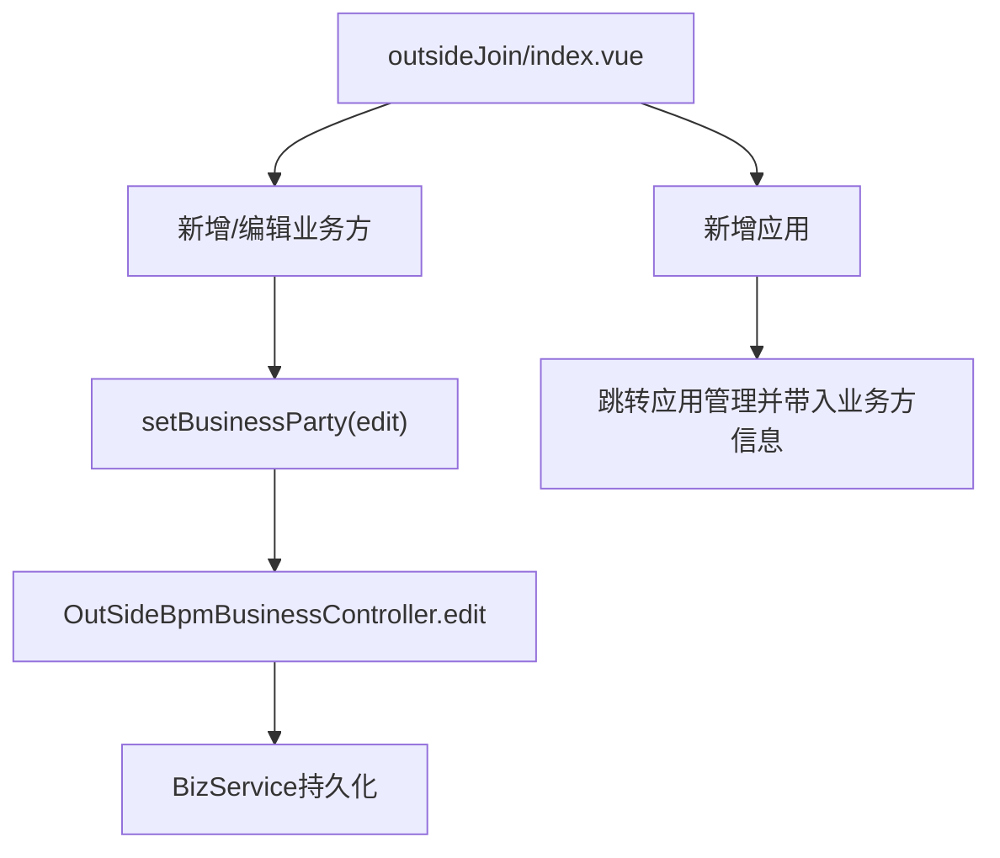
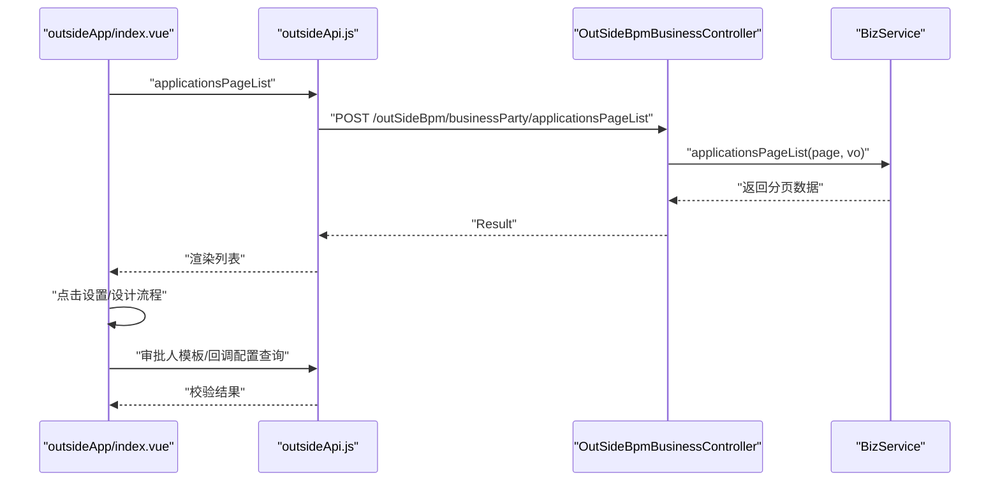
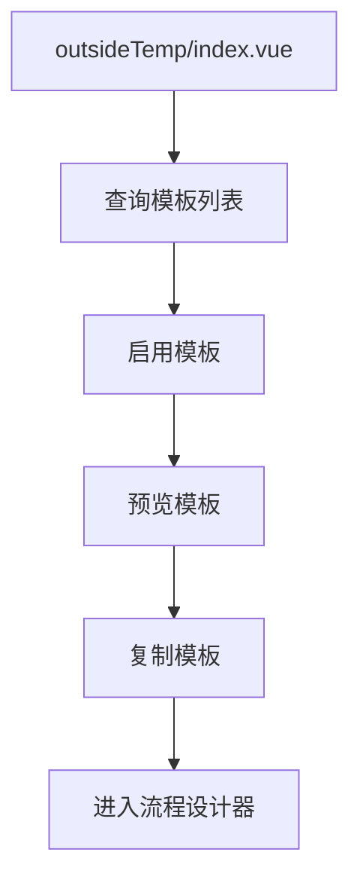
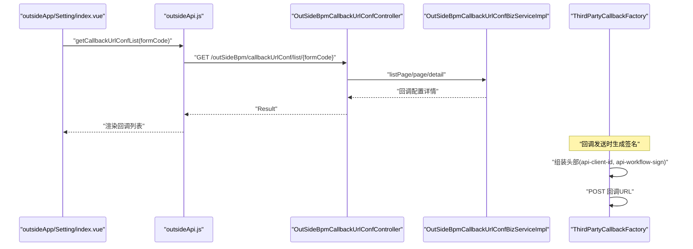
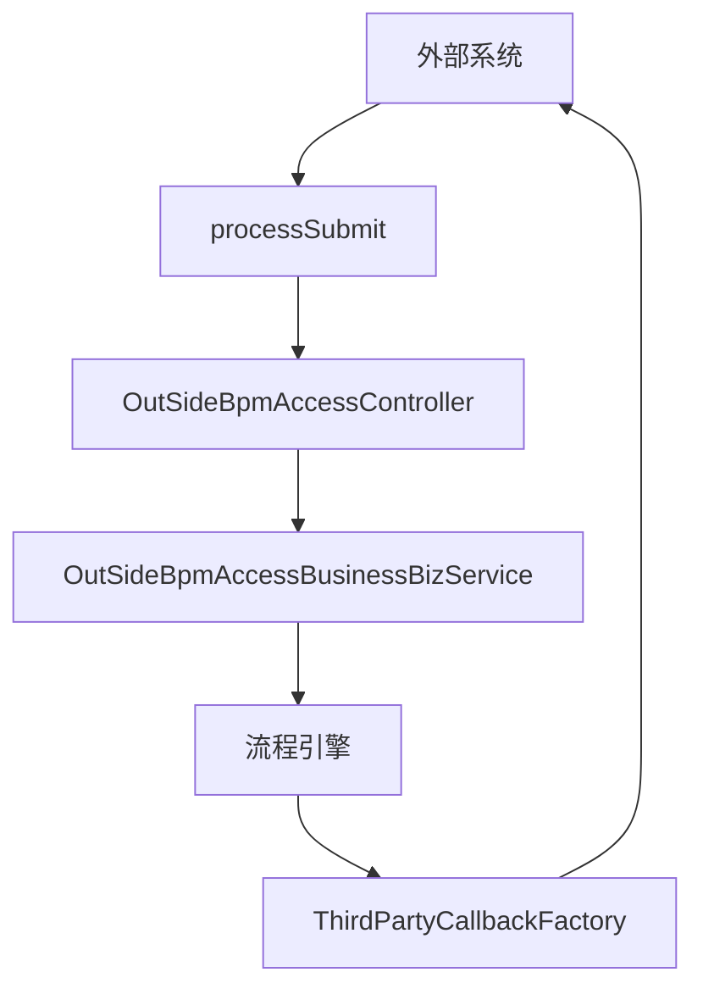
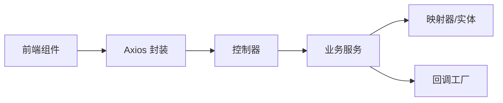

# 外部系统设置

<cite>
**本文引用的文件**
- [外部应用管理.md](file://doc/系统介绍篇/18.外部工作流应用管理.md)
- [外部系统集成.md](file://doc/系统介绍篇/10.外部系统集成.md)
- [核心概念与术语.md](file://doc/系统介绍篇/3.核心概念和术语.md)
- [前端系统.md](file://doc/系统介绍篇/13.前端系统.md)
- [outsideApp/index.vue](file://antflow-vue/src/views/workflow/outsideMgt/outsideApp/index.vue)
- [outsideApp/Setting/index.vue](file://antflow-vue/src/views/workflow/outsideMgt/outsideApp/Setting/index.vue)
- [outsideJoin/index.vue](file://antflow-vue/src/views/workflow/outsideMgt/outsideJoin/index.vue)
- [outsideTemp/index.vue](file://antflow-vue/src/views/workflow/outsideMgt/outsideTemp/index.vue)
- [outsideApi.js](file://antflow-vue/src/api/workflow/outsideApi.js)
- [OutSideBpmBusinessController.java](file://antflow-engine/src/main/java/org/openoa/engine/bpmnconf/controller/OutSideBpmBusinessController.java)
- [OutSideBpmCallbackUrlConfController.java](file://antflow-engine/src/main/java/org/openoa/engine/bpmnconf/controller/OutSideBpmCallbackUrlConfController.java)
- [OutSideBpmCallbackUrlConfServiceImpl.java](file://antflow-engine/src/main/java/org/openoa/engine/bpmnconf/service/impl/OutSideBpmCallbackUrlConfServiceImpl.java)
- [OutSideBpmCallbackUrlConfBizServiceImpl.java](file://antflow-engine/src/main/java/org/openoa/engine/bpmnconf/service/biz/OutSideBpmCallbackUrlConfBizServiceImpl.java)
- [OutSideBpmAccessBusinessService.java](file://antflow-engine/src/main/java/org/openoa/engine/bpmnconf/service/interf/repository/OutSideBpmAccessBusinessService.java)
- [OutSideBpmAccessBusinessBizService.java](file://antflow-engine/src/main/java/org/openoa/engine/bpmnconf/service/interf/biz/OutSideBpmAccessBusinessBizService.java)
- [OutSideBpmAccessBusinessMapper.java](file://antflow-engine/src/main/java/org/openoa/engine/bpmnconf/mapper/OutSideBpmAccessBusinessMapper.java)
- [OutSideBpmAccessController.java](file://antflow-engine/src/main/java/org/openoa/engine/bpmnconf/controller/OutSideBpmAccessController.java)
- [ThirdPartyCallbackFactory.java](file://antflow-engine/src/main/java/org/openoa/engine/factory/ThirdPartyCallbackFactory.java)
- [OutSideBpmApproveTemplateServiceImpl.java](file://antflow-engine/src/main/java/org/openoa/engine/bpmnconf/service/impl/OutSideBpmApproveTemplateServiceImpl.java)
- [OutSideBpmApproveTemplateService.java](file://antflow-engine/src/main/java/org/openoa/engine/bpmnconf/service/interf/repository/OutSideBpmApproveTemplateService.java)
- [OutSideBpmApproveTemplateMapper.xml](file://antflow-engine/src/main/resources/mapper/OutSideBpmApproveTemplateMapper.xml)
</cite>

## 目录
1. [简介](#简介)
2. [项目结构](#项目结构)
3. [核心组件](#核心组件)
4. [架构总览](#架构总览)
5. [详细组件分析](#详细组件分析)
6. [依赖分析](#依赖分析)
7. [性能考虑](#性能考虑)
8. [故障排查指南](#故障排查指南)
9. [结论](#结论)
10. [附录](#附录)

## 简介
本文件面向需要与 AntFlow 工作流系统进行外部系统集成的开发者，系统性阐述“外部系统设置”组件的架构、应用管理、流程设计与接入配置机制。重点覆盖：
- 外部应用注册与管理
- 流程模板配置与启用
- 系统对接设置（审批人模板、流程回调）
- 数据流管理与配置同步
- 权限控制策略与安全机制
- 使用示例与集成步骤

## 项目结构
外部系统设置涉及前端页面与后端控制器/服务/映射器的协同，形成“业务方管理 → 应用管理 → 流程模板 → 对接设置”的闭环。

图表来源
- [outsideApp/index.vue:1-201](file://antflow-vue/src/views/workflow/outsideMgt/outsideApp/index.vue#L1-L201)
- [outsideApp/Setting/index.vue:1-138](file://antflow-vue/src/views/workflow/outsideMgt/outsideApp/Setting/index.vue#L1-L138)
- [outsideJoin/index.vue:1-270](file://antflow-vue/src/views/workflow/outsideMgt/outsideJoin/index.vue#L1-L270)
- [outsideTemp/index.vue:1-159](file://antflow-vue/src/views/workflow/outsideMgt/outsideTemp/index.vue#L1-L159)
- [outsideApi.js:1-233](file://antflow-vue/src/api/workflow/outsideApi.js#L1-L233)
- [OutSideBpmBusinessController.java:1-196](file://antflow-engine/src/main/java/org/openoa/engine/bpmnconf/controller/OutSideBpmBusinessController.java#L1-L196)
- [OutSideBpmAccessController.java:74-90](file://antflow-engine/src/main/java/org/openoa/engine/bpmnconf/controller/OutSideBpmAccessController.java#L74-L90)
- [OutSideBpmCallbackUrlConfController.java:39-68](file://antflow-engine/src/main/java/org/openoa/engine/bpmnconf/controller/OutSideBpmCallbackUrlConfController.java#L39-L68)
- [OutSideBpmCallbackUrlConfBizServiceImpl.java:100-160](file://antflow-engine/src/main/java/org/openoa/engine/bpmnconf/service/biz/OutSideBpmCallbackUrlConfBizServiceImpl.java#L100-L160)
- [OutSideBpmAccessBusinessMapper.java:1-10](file://antflow-engine/src/main/java/org/openoa/engine/bpmnconf/mapper/OutSideBpmAccessBusinessMapper.java#L1-L10)

章节来源
- [外部应用管理.md:1-139](file://doc/系统介绍篇/18.外部工作流应用管理.md#L1-L139)
- [前端系统.md:235-297](file://doc/系统介绍篇/13.前端系统.md#L235-L297)

## 核心组件
- 业务方（项目）管理：负责外部业务方注册、接入类型配置与项目信息维护。
- 应用管理：管理每个业务方内的外部应用，支持应用编辑、设置跳转、流程设计入口。
- 流程模板管理：外部业务方可基于模板创建、启用、复制与预览流程。
- 对接设置：审批人模板配置与流程回调配置，保障外部系统与工作流引擎的双向通信。

章节来源
- [outsideJoin/index.vue:1-270](file://antflow-vue/src/views/workflow/outsideMgt/outsideJoin/index.vue#L1-L270)
- [outsideApp/index.vue:1-201](file://antflow-vue/src/views/workflow/outsideMgt/outsideApp/index.vue#L1-L201)
- [outsideTemp/index.vue:1-159](file://antflow-vue/src/views/workflow/outsideMgt/outsideTemp/index.vue#L1-L159)
- [outsideApp/Setting/index.vue:1-138](file://antflow-vue/src/views/workflow/outsideMgt/outsideApp/Setting/index.vue#L1-L138)

## 架构总览
外部系统设置遵循“前端路由与组件 → API 层 → 控制器 → 业务/仓储服务 → 映射器/数据库”的分层架构。前端通过 Axios 封装的 API 与后端交互；后端控制器统一暴露 REST 接口，业务层负责领域逻辑，仓储层负责数据持久化。

图表来源
- [outsideApi.js:83-87](file://antflow-vue/src/api/workflow/outsideApi.js#L83-L87)
- [OutSideBpmBusinessController.java:61-65](file://antflow-engine/src/main/java/org/openoa/engine/bpmnconf/controller/OutSideBpmBusinessController.java#L61-L65)

## 详细组件分析

### 业务方（项目）管理
- 功能职责
  - 业务方注册与验证（标识、名称、接入类型、备注）
  - 业务方信息分页查询与详情查看
  - 为业务方新增应用（自动填充业务方标识与名称）
- 关键流程
  - 新增/编辑业务方 → 保存至业务方表
  - 业务方列表页 → 支持新增应用并跳转应用管理
- 前端交互
  - 表单校验（标识格式、名称长度、接入类型）
  - 分页查询与列显隐控制
- 后端接口
  - 分页列表、详情、编辑等 REST 接口由业务控制器提供

图表来源
- [outsideJoin/index.vue:176-232](file://antflow-vue/src/views/workflow/outsideMgt/outsideJoin/index.vue#L176-L232)
- [outsideApi.js:83-87](file://antflow-vue/src/api/workflow/outsideApi.js#L83-L87)
- [OutSideBpmBusinessController.java:61-65](file://antflow-engine/src/main/java/org/openoa/engine/bpmnconf/controller/OutSideBpmBusinessController.java#L61-L65)

章节来源
- [outsideJoin/index.vue:1-270](file://antflow-vue/src/views/workflow/outsideMgt/outsideJoin/index.vue#L1-L270)
- [outsideApi.js:58-87](file://antflow-vue/src/api/workflow/outsideApi.js#L58-L87)
- [OutSideBpmBusinessController.java:36-65](file://antflow-engine/src/main/java/org/openoa/engine/bpmnconf/controller/OutSideBpmBusinessController.java#L36-L65)

### 应用管理
- 功能职责
  - 应用列表展示（租户标识、应用标识、应用名称、业务类型、创建时间）
  - 应用编辑、设置跳转、流程设计入口
  - 流程设计前置校验：审批人模板与流程回调配置
- 关键流程
  - 点击“设置” → 跳转应用设置页，携带业务方与应用上下文
  - 点击“设计流程” → 校验审批人与回调配置，满足则进入流程设计器
- 前端交互
  - 列表分页、搜索、操作按钮
  - 设置页采用标签页切换审批人与回调配置列表
- 后端接口
  - 应用分页列表、应用详情、新增应用、应用设置相关接口

图表来源
- [outsideApp/index.vue:89-201](file://antflow-vue/src/views/workflow/outsideMgt/outsideApp/index.vue#L89-L201)
- [outsideApi.js:94-128](file://antflow-vue/src/api/workflow/outsideApi.js#L94-L128)
- [OutSideBpmBusinessController.java:70-100](file://antflow-engine/src/main/java/org/openoa/engine/bpmnconf/controller/OutSideBpmBusinessController.java#L70-L100)

章节来源
- [outsideApp/index.vue:1-201](file://antflow-vue/src/views/workflow/outsideMgt/outsideApp/index.vue#L1-L201)
- [outsideApi.js:94-128](file://antflow-vue/src/api/workflow/outsideApi.js#L94-L128)
- [OutSideBpmBusinessController.java:70-100](file://antflow-engine/src/main/java/org/openoa/engine/bpmnconf/controller/OutSideBpmBusinessController.java#L70-L100)

### 流程模板管理
- 功能职责
  - 模板列表查询（编号、名称、去重策略、状态）
  - 启用/禁用模板、复制模板、预览模板
- 关键流程
  - 模板启用前校验（如管理员专用流程禁止操作）
  - 复制模板 → 进入流程设计器
  - 预览模板 → 渲染流程图
- 前端交互
  - 状态标签、操作按钮、分页
- 后端接口
  - 模板分页列表、启用模板、预览模板等

图表来源
- [outsideTemp/index.vue:98-159](file://antflow-vue/src/views/workflow/outsideMgt/outsideTemp/index.vue#L98-L159)

章节来源
- [outsideTemp/index.vue:1-159](file://antflow-vue/src/views/workflow/outsideMgt/outsideTemp/index.vue#L1-L159)

### 对接设置（审批人模板与流程回调）
- 审批人模板
  - 作用：为外部应用配置审批人来源（API 地址、鉴权信息等）
  - 前端：应用设置页的“审批人列表”标签页，支持查询与删除（演示环境限制）
  - 后端：审批人模板的分页查询、详情、编辑与删除
- 流程回调
  - 作用：工作流引擎向外部系统推送流程事件（如启动、完成、回退等）
  - 前端：应用设置页的“流程回调列表”标签页，支持查询与删除
  - 后端：回调配置的分页查询、详情、编辑；工厂类负责签名与发送

图表来源
- [outsideApp/Setting/index.vue:82-132](file://antflow-vue/src/views/workflow/outsideMgt/outsideApp/Setting/index.vue#L82-L132)
- [outsideApi.js:228-232](file://antflow-vue/src/api/workflow/outsideApi.js#L228-L232)
- [OutSideBpmCallbackUrlConfController.java:40-54](file://antflow-engine/src/main/java/org/openoa/engine/bpmnconf/controller/OutSideBpmCallbackUrlConfController.java#L40-L54)
- [OutSideBpmCallbackUrlConfBizServiceImpl.java:100-160](file://antflow-engine/src/main/java/org/openoa/engine/bpmnconf/service/biz/OutSideBpmCallbackUrlConfBizServiceImpl.java#L100-L160)
- [ThirdPartyCallbackFactory.java:183-198](file://antflow-engine/src/main/java/org/openoa/engine/factory/ThirdPartyCallbackFactory.java#L183-L198)

章节来源
- [outsideApp/Setting/index.vue:1-138](file://antflow-vue/src/views/workflow/outsideMgt/outsideApp/Setting/index.vue#L1-L138)
- [outsideApi.js:176-232](file://antflow-vue/src/api/workflow/outsideApi.js#L176-L232)
- [OutSideBpmCallbackUrlConfController.java:39-68](file://antflow-engine/src/main/java/org/openoa/engine/bpmnconf/controller/OutSideBpmCallbackUrlConfController.java#L39-L68)
- [OutSideBpmCallbackUrlConfBizServiceImpl.java:100-160](file://antflow-engine/src/main/java/org/openoa/engine/bpmnconf/service/biz/OutSideBpmCallbackUrlConfBizServiceImpl.java#L100-L160)
- [ThirdPartyCallbackFactory.java:183-198](file://antflow-engine/src/main/java/org/openoa/engine/factory/ThirdPartyCallbackFactory.java#L183-L198)

### 外部流程接入与数据流
- 外部系统通过 API 发起流程，工作流引擎根据应用标识与模板匹配执行流程
- 审批人来源通过审批人模板的 API 获取
- 流程运行过程中，工作流引擎通过回调配置向外部系统推送事件

图表来源
- [OutSideBpmAccessController.java:74-90](file://antflow-engine/src/main/java/org/openoa/engine/bpmnconf/controller/OutSideBpmAccessController.java#L74-L90)
- [OutSideBpmAccessBusinessBizService.java:16-25](file://antflow-engine/src/main/java/org/openoa/engine/bpmnconf/service/interf/biz/OutSideBpmAccessBusinessBizService.java#L16-L25)
- [ThirdPartyCallbackFactory.java:183-198](file://antflow-engine/src/main/java/org/openoa/engine/factory/ThirdPartyCallbackFactory.java#L183-L198)

章节来源
- [OutSideBpmAccessController.java:74-90](file://antflow-engine/src/main/java/org/openoa/engine/bpmnconf/controller/OutSideBpmAccessController.java#L74-L90)
- [OutSideBpmAccessBusinessBizService.java:16-25](file://antflow-engine/src/main/java/org/openoa/engine/bpmnconf/service/interf/biz/OutSideBpmAccessBusinessBizService.java#L16-L25)

## 依赖分析
- 前端依赖
  - Axios 封装的 API 层负责与后端通信
  - Vue 组件负责页面渲染与交互
- 后端依赖
  - 控制器层：统一暴露 REST 接口
  - 业务层：封装领域逻辑与数据转换
  - 仓储层：MyBatis-Plus 映射器负责数据库操作
- 外部依赖
  - 回调工厂负责签名与 HTTP 请求发送

图表来源
- [outsideApi.js:1-233](file://antflow-vue/src/api/workflow/outsideApi.js#L1-L233)
- [OutSideBpmBusinessController.java:1-196](file://antflow-engine/src/main/java/org/openoa/engine/bpmnconf/controller/OutSideBpmBusinessController.java#L1-L196)
- [OutSideBpmCallbackUrlConfBizServiceImpl.java:100-160](file://antflow-engine/src/main/java/org/openoa/engine/bpmnconf/service/biz/OutSideBpmCallbackUrlConfBizServiceImpl.java#L100-L160)
- [ThirdPartyCallbackFactory.java:183-198](file://antflow-engine/src/main/java/org/openoa/engine/factory/ThirdPartyCallbackFactory.java#L183-L198)

章节来源
- [outsideApi.js:1-233](file://antflow-vue/src/api/workflow/outsideApi.js#L1-L233)
- [OutSideBpmBusinessController.java:1-196](file://antflow-engine/src/main/java/org/openoa/engine/bpmnconf/controller/OutSideBpmBusinessController.java#L1-L196)
- [OutSideBpmCallbackUrlConfBizServiceImpl.java:100-160](file://antflow-engine/src/main/java/org/openoa/engine/bpmnconf/service/biz/OutSideBpmCallbackUrlConfBizServiceImpl.java#L100-L160)

## 性能考虑
- 前端
  - 列表分页加载，避免一次性渲染大量数据
  - 按需加载审批人与回调配置列表
- 后端
  - 分页查询与排序字段默认值设置，减少无效查询
  - 回调发送采用异步或幂等设计，避免阻塞主流程
- 数据库
  - 合理使用索引（如 formCode、businessPartyId、applicationId 等）
  - 批量操作与缓存策略（如审批人模板列表）

## 故障排查指南
- 无法加载审批人/回调配置
  - 检查 formCode 是否正确传入
  - 检查业务方与应用的绑定关系
- 回调未到达外部系统
  - 检查回调 URL 配置与状态
  - 核对签名算法与头部字段（api-client-id、api-workflow-sign）
- 流程无法启动
  - 检查模板状态（是否启用）
  - 检查审批人模板是否配置
- 权限与安全
  - 确认业务方注册与人员分配
  - 核对回调配置中的鉴权信息

章节来源
- [outsideApp/Setting/index.vue:82-132](file://antflow-vue/src/views/workflow/outsideMgt/outsideApp/Setting/index.vue#L82-L132)
- [OutSideBpmCallbackUrlConfBizServiceImpl.java:100-160](file://antflow-engine/src/main/java/org/openoa/engine/bpmnconf/service/biz/OutSideBpmCallbackUrlConfBizServiceImpl.java#L100-L160)
- [ThirdPartyCallbackFactory.java:183-198](file://antflow-engine/src/main/java/org/openoa/engine/factory/ThirdPartyCallbackFactory.java#L183-L198)
- [外部系统集成.md:284-310](file://doc/系统介绍篇/10.外部系统集成.md#L284-L310)

## 结论
外部系统设置通过清晰的前端页面与完善的后端接口，实现了业务方注册、应用管理、流程模板与对接配置的全链路管理。结合审批人模板与流程回调机制，可满足第三方系统与工作流引擎的双向集成需求。建议在生产环境中完善鉴权与监控，确保数据一致性与安全性。

## 附录

### 使用示例与集成步骤
- 注册业务方
  - 在“项目管理”界面填写标识、名称、接入类型与备注，提交保存
- 新增应用
  - 在业务方下新增应用，自动带入业务方标识与名称
- 配置审批人模板
  - 在应用设置页的“审批人列表”中新增模板，配置 API 地址与鉴权信息
- 配置流程回调
  - 在应用设置页的“流程回调列表”中新增回调，配置回调 URL 与鉴权信息
- 设计流程
  - 在“流程模板”中选择模板，复制或预览，进入流程设计器
- 发起流程
  - 外部系统调用流程提交接口，工作流引擎根据模板与审批人配置执行流程，并通过回调通知外部系统

章节来源
- [outsideJoin/index.vue:176-232](file://antflow-vue/src/views/workflow/outsideMgt/outsideJoin/index.vue#L176-L232)
- [outsideApp/index.vue:141-178](file://antflow-vue/src/views/workflow/outsideMgt/outsideApp/index.vue#L141-L178)
- [outsideTemp/index.vue:108-159](file://antflow-vue/src/views/workflow/outsideMgt/outsideTemp/index.vue#L108-L159)
- [outsideApi.js:210-232](file://antflow-vue/src/api/workflow/outsideApi.js#L210-L232)
- [OutSideBpmBusinessController.java:88-100](file://antflow-engine/src/main/java/org/openoa/engine/bpmnconf/controller/OutSideBpmBusinessController.java#L88-L100)