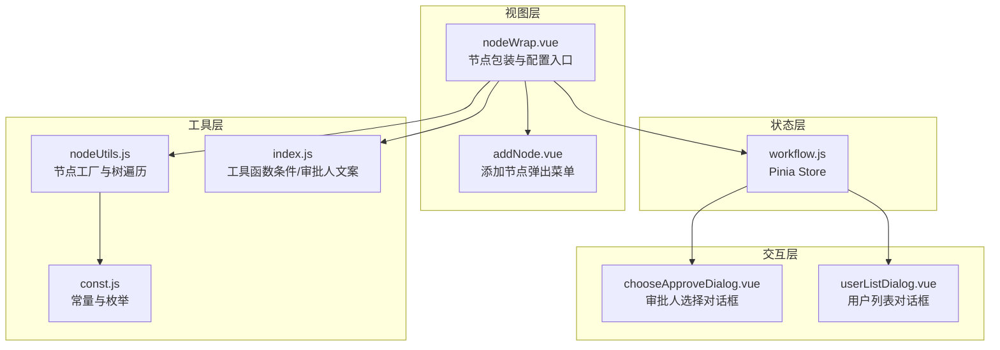
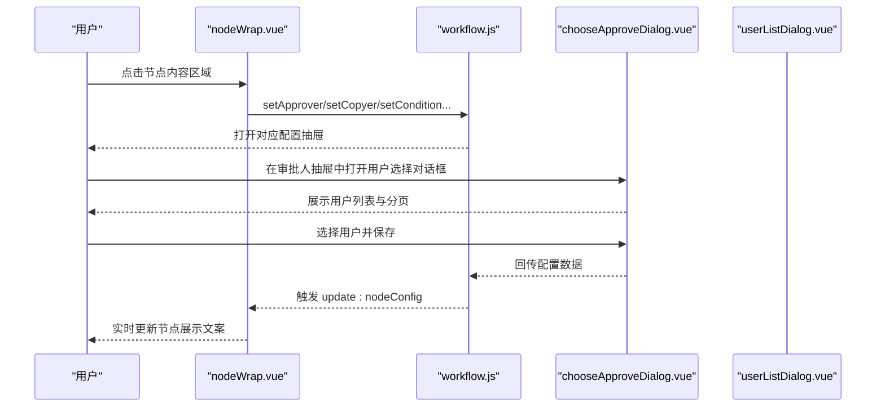
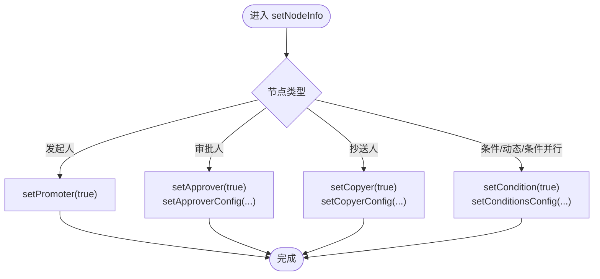
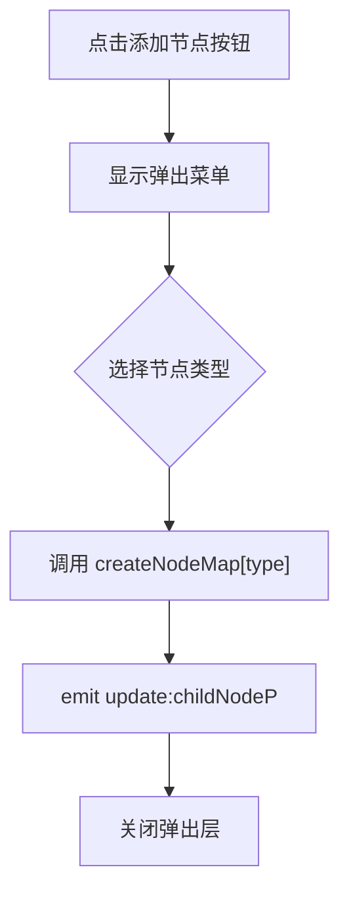
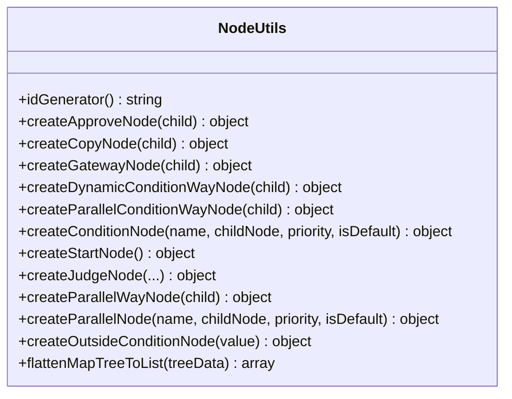
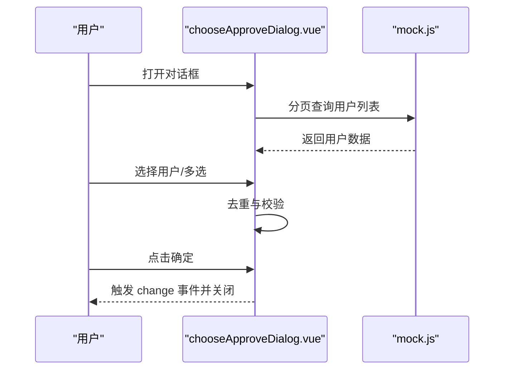
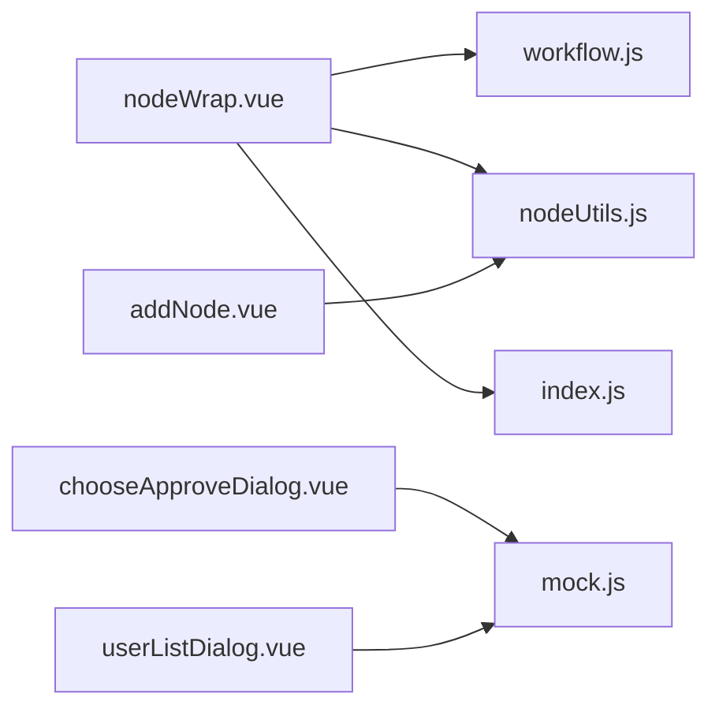

# 属性配置面板

<cite>
**本文档引用的文件**
- [nodeWrap.vue](file://antflow-vue/src/components/Workflow/nodeWrap.vue)
- [addNode.vue](file://antflow-vue/src/components/Workflow/addNode.vue)
- [nodeUtils.js](file://antflow-vue/src/utils/antflow/nodeUtils.js)
- [workflow.js](file://antflow-vue/src/store/modules/workflow.js)
- [const.js](file://antflow-vue/src/utils/antflow/const.js)
- [index.js](file://antflow-vue/src/utils/antflow/index.js)
- [chooseApproveDialog.vue](file://antflow-vue/src/components/BizSelects/chooseApproveDialog.vue)
- [userListDialog.vue](file://antflow-vue/src/components/BizSelects/userListDialog.vue)
</cite>

## 目录
1. [简介](#简介)
2. [项目结构](#项目结构)
3. [核心组件](#核心组件)
4. [架构总览](#架构总览)
5. [详细组件分析](#详细组件分析)
6. [依赖关系分析](#依赖关系分析)
7. [性能考虑](#性能考虑)
8. [故障排除指南](#故障排除指南)
9. [结论](#结论)
10. [附录](#附录)

## 箬简介
本文件面向流程设计器中的“属性配置面板”，系统性阐述其组件架构、抽屉式配置界面设计理念、对话框组件实现机制，并深入解析以下关键能力：
- 审批人抽屉：支持多种审批人类型（指定人员、角色、层级、直属领导等）、会签/或签/顺序会签等审批方式、加批与减签策略
- 条件抽屉：条件节点的配置逻辑、条件组关系（且/或）、动态条件与条件并行网关
- 用户选择对话框：发起人/审批人/抄送人的用户选择交互、分页查询、多选限制与去重
- 数据流管理：基于 Pinia 的状态管理、父子组件通信、配置变更的响应式更新
- 表单验证机制：节点错误标记、默认条件处理、实时预览文案生成
- 实时预览：条件表达式、审批人展示文案的动态生成
- 权限控制与动态表单：按钮集配置、消息通知模板、低代码表单字段控制

## 项目结构
属性配置面板主要由以下层次构成：
- 视图层：节点包装组件负责渲染不同类型的节点（发起人、审批人、抄送人、条件网关、并行网关），并触发配置抽屉
- 抽屉层：通过 Pinia 状态驱动的配置抽屉，承载具体配置项
- 工具层：节点工具类负责节点对象的创建与序列化、扁平化树遍历；常量与工具函数提供文案、枚举、条件表达式生成
- 交互层：用户选择对话框提供用户检索、分页、多选与保存回调

**图表来源**
- [nodeWrap.vue:1-503](file://antflow-vue/src/components/Workflow/nodeWrap.vue#L1-L503)
- [addNode.vue:1-252](file://antflow-vue/src/components/Workflow/addNode.vue#L1-L252)
- [workflow.js:1-69](file://antflow-vue/src/store/modules/workflow.js#L1-L69)
- [nodeUtils.js:1-412](file://antflow-vue/src/utils/antflow/nodeUtils.js#L1-L412)
- [const.js:1-359](file://antflow-vue/src/utils/antflow/const.js#L1-L359)
- [index.js:1-279](file://antflow-vue/src/utils/antflow/index.js#L1-L279)
- [chooseApproveDialog.vue:1-199](file://antflow-vue/src/components/BizSelects/chooseApproveDialog.vue#L1-L199)
- [userListDialog.vue:1-195](file://antflow-vue/src/components/BizSelects/userListDialog.vue#L1-L195)

**章节来源**
- [nodeWrap.vue:140-467](file://antflow-vue/src/components/Workflow/nodeWrap.vue#L140-L467)
- [addNode.vue:54-104](file://antflow-vue/src/components/Workflow/addNode.vue#L54-L104)
- [workflow.js:1-69](file://antflow-vue/src/store/modules/workflow.js#L1-L69)

## 核心组件
- 节点包装组件（nodeWrap.vue）
  - 渲染不同类型节点的外观与交互，点击进入配置抽屉
  - 维护节点名称编辑、条件节点排序、并行节点管理、错误状态标记
  - 通过 Pinia Store 触发配置抽屉并传递上下文数据
- 添加节点组件（addNode.vue）
  - 提供节点类型选择的弹出菜单，封装节点工厂调用
  - 将新节点通过 v-model 更新父节点树
- 节点工具类（nodeUtils.js）
  - 节点工厂：创建审批人、抄送人、条件网关、并行网关、并行审批人等节点对象
  - 树遍历：扁平化节点树，计算 nodeFrom/nodeTo 关系
- 状态管理（workflow.js）
  - 统一管理各配置抽屉开关与配置数据，提供响应式更新
- 工具函数（index.js）
  - 条件表达式生成、审批人展示文案、复选/单选值解析
- 对话框组件（chooseApproveDialog.vue、userListDialog.vue）
  - 用户检索与分页展示，支持单选/多选、去重与保存回调

**章节来源**
- [nodeWrap.vue:140-467](file://antflow-vue/src/components/Workflow/nodeWrap.vue#L140-L467)
- [addNode.vue:54-104](file://antflow-vue/src/components/Workflow/addNode.vue#L54-L104)
- [nodeUtils.js:26-357](file://antflow-vue/src/utils/antflow/nodeUtils.js#L26-L357)
- [workflow.js:1-69](file://antflow-vue/src/store/modules/workflow.js#L1-L69)
- [index.js:36-275](file://antflow-vue/src/utils/antflow/index.js#L36-L275)
- [chooseApproveDialog.vue:1-199](file://antflow-vue/src/components/BizSelects/chooseApproveDialog.vue#L1-L199)
- [userListDialog.vue:1-195](file://antflow-vue/src/components/BizSelects/userListDialog.vue#L1-L195)

## 架构总览
属性配置面板采用“视图-状态-工具-交互”分层架构：
- 视图层负责节点渲染与用户交互
- 状态层集中管理抽屉开关与配置数据
- 工具层提供节点模型与表达式生成
- 交互层提供用户选择与数据持久化

**图表来源**
- [nodeWrap.vue:402-448](file://antflow-vue/src/components/Workflow/nodeWrap.vue#L402-L448)
- [workflow.js:31-66](file://antflow-vue/src/store/modules/workflow.js#L31-L66)
- [chooseApproveDialog.vue:159-183](file://antflow-vue/src/components/BizSelects/chooseApproveDialog.vue#L159-L183)

## 详细组件分析

### 节点包装组件（nodeWrap.vue）
- 功能特性
  - 支持发起人、审批人、抄送人、条件网关、动态条件网关、条件并行网关、并行审批网关
  - 节点名称可编辑，失焦自动保存默认值
  - 条件节点支持添加/删除/排序，动态维护优先级与错误状态
  - 并行节点支持添加/删除，动态维护优先级
  - 错误状态通过 isTried 与节点 error 字段联动
- 数据流
  - setNodeInfo 根据节点类型调用相应 store 方法，传递上下文数据
  - 通过 watch 监听 store 中的配置变化，触发 update:nodeConfig 向父组件回传
- 实时预览
  - 通过工具函数生成条件表达式与审批人展示文案
  - onMounted 阶段对条件节点与并行节点进行错误状态与展示名重置

**图表来源**
- [nodeWrap.vue:402-448](file://antflow-vue/src/components/Workflow/nodeWrap.vue#L402-L448)
- [workflow.js:31-66](file://antflow-vue/src/store/modules/workflow.js#L31-L66)

**章节来源**
- [nodeWrap.vue:188-233](file://antflow-vue/src/components/Workflow/nodeWrap.vue#L188-L233)
- [nodeWrap.vue:292-373](file://antflow-vue/src/components/Workflow/nodeWrap.vue#L292-L373)
- [nodeWrap.vue:402-448](file://antflow-vue/src/components/Workflow/nodeWrap.vue#L402-L448)

### 添加节点组件（addNode.vue）
- 功能特性
  - 弹出式菜单提供节点类型选择（审批人、并行审批、抄送人、条件分支、动态条件、条件并行）
  - 使用 Map 将类型映射到工厂方法，统一创建节点
  - 通过 v-model 将新节点回传给父组件
- 设计要点
  - 通过 NodeUtils 工厂方法创建节点，确保节点结构一致性
  - 隐藏弹出层，避免遮挡画布

**图表来源**
- [addNode.vue:98-103](file://antflow-vue/src/components/Workflow/addNode.vue#L98-L103)
- [nodeUtils.js:26-357](file://antflow-vue/src/utils/antflow/nodeUtils.js#L26-L357)

**章节来源**
- [addNode.vue:54-104](file://antflow-vue/src/components/Workflow/addNode.vue#L54-L104)

### 节点工具类（nodeUtils.js）
- 节点工厂
  - 审批人节点：setType、signType、isSignUp、directorLevel 等字段初始化
  - 抄送人节点：ccFlag、buttons 配置
  - 条件网关：conditionNodes 默认包含两条初始分支
  - 并行网关：parallelNodes 默认包含两条初始分支
  - 动态条件网关：isDynamicCondition=true
  - 条件并行网关：isParallel=true，子节点为并行聚合
- 树遍历
  - flattenMapTreeToList：递归遍历节点树，填充 nodeFrom/nodeTo，支持条件网关与并行网关

**图表来源**
- [nodeUtils.js:26-357](file://antflow-vue/src/utils/antflow/nodeUtils.js#L26-L357)
- [nodeUtils.js:372-411](file://antflow-vue/src/utils/antflow/nodeUtils.js#L372-L411)

**章节来源**
- [nodeUtils.js:26-357](file://antflow-vue/src/utils/antflow/nodeUtils.js#L26-L357)
- [nodeUtils.js:372-411](file://antflow-vue/src/utils/antflow/nodeUtils.js#L372-L411)

### 状态管理（workflow.js）
- 状态字段
  - isTried：是否尝试过提交，用于错误提示
  - 各种配置抽屉开关：promoterDrawer、approverDrawer、copyerDrawer、conditionDrawer
  - 配置数据：flowPermission1、approverConfig1、copyerConfig1、conditionsConfig1
  - 低代码字段与实例视图配置：lowCodeFormField、instanceViewConfig1
- 动作方法
  - setPromoter/setApprover/setCopyer/setCondition：切换抽屉开关
  - setFlowPermission/setApproverConfig/setCopyerConfig/setConditionsConfig：写入配置数据
  - setPreviewDrawer/setPreviewDrawerConfig：预览抽屉与配置
  - setLowCodeFormField/setApproveChooseFlowNodeConfig：低代码与选择节点配置

**章节来源**
- [workflow.js:1-69](file://antflow-vue/src/store/modules/workflow.js#L1-L69)

### 工具函数与常量（const.js、index.js）
- 常量
  - bgColors、placeholderList、nodeTypeList：节点样式与占位符
  - setTypes：审批人类型枚举（指定人员、角色、HRBP、层级、直属领导、发起人自选等）
  - signTypeObj：会签/或签/顺序会签文案
  - approvalButtonConf/approvalPageButtons/startPageButtons/viewPageButtons：按钮配置
  - condition_*Map：条件控件类型与后端约定映射
  - noticeUserList/messageSendTypeList/eventTypeList：通知相关枚举
- 工具函数
  - setApproverStr/copyerStr：生成审批人/抄送人展示文案
  - conditionStr/getConditionStr：生成条件表达式，处理且/或关系、多选/单选/日期/数值等控件类型
  - arrToStr/toggleClass/toChecked/removeEle：数组与集合辅助操作

**章节来源**
- [const.js:8-359](file://antflow-vue/src/utils/antflow/const.js#L8-L359)
- [index.js:36-275](file://antflow-vue/src/utils/antflow/index.js#L36-L275)

### 用户选择对话框（chooseApproveDialog.vue、userListDialog.vue）
- 功能特性
  - 支持关键字搜索、分页加载、单选/多选
  - 多选限制：通过 multiplelimit 控制最大选择数量
  - 去重：保存前对重复用户 ID 进行去重
  - 回调：通过 change 事件回传选中用户列表
- 交互流程
  - 打开对话框时触发分页查询
  - 用户选择后，保存到父组件传入的 checkedData 或 checkedData 数组
  - 关闭时清空列表与临时变量

**图表来源**
- [chooseApproveDialog.vue:109-130](file://antflow-vue/src/components/BizSelects/chooseApproveDialog.vue#L109-L130)
- [chooseApproveDialog.vue:159-183](file://antflow-vue/src/components/BizSelects/chooseApproveDialog.vue#L159-L183)

**章节来源**
- [chooseApproveDialog.vue:1-199](file://antflow-vue/src/components/BizSelects/chooseApproveDialog.vue#L1-L199)
- [userListDialog.vue:1-195](file://antflow-vue/src/components/BizSelects/userListDialog.vue#L1-L195)

## 依赖关系分析
- 组件耦合
  - nodeWrap.vue 依赖 workflow.js 的状态与动作，依赖 nodeUtils.js 的节点工厂，依赖 index.js 的文案生成
  - addNode.vue 依赖 nodeUtils.js 的节点工厂
  - 对话框组件依赖 mock API 获取用户数据
- 数据流向
  - 用户交互 → nodeWrap.vue → workflow.js → 抽屉/对话框 → 回写 nodeWrap.vue → 实时预览
- 可能的循环依赖
  - 当前结构无直接循环依赖，但建议保持工具函数与状态管理的纯函数特性，避免跨模块耦合

**图表来源**
- [nodeWrap.vue:140-467](file://antflow-vue/src/components/Workflow/nodeWrap.vue#L140-L467)
- [addNode.vue:54-104](file://antflow-vue/src/components/Workflow/addNode.vue#L54-L104)
- [workflow.js:1-69](file://antflow-vue/src/store/modules/workflow.js#L1-L69)
- [nodeUtils.js:26-357](file://antflow-vue/src/utils/antflow/nodeUtils.js#L26-L357)
- [index.js:36-275](file://antflow-vue/src/utils/antflow/index.js#L36-L275)
- [chooseApproveDialog.vue:49-124](file://antflow-vue/src/components/BizSelects/chooseApproveDialog.vue#L49-L124)
- [userListDialog.vue:48-122](file://antflow-vue/src/components/BizSelects/userListDialog.vue#L48-L122)

**章节来源**
- [nodeWrap.vue:140-467](file://antflow-vue/src/components/Workflow/nodeWrap.vue#L140-L467)
- [addNode.vue:54-104](file://antflow-vue/src/components/Workflow/addNode.vue#L54-L104)
- [workflow.js:1-69](file://antflow-vue/src/store/modules/workflow.js#L1-L69)
- [nodeUtils.js:26-357](file://antflow-vue/src/utils/antflow/nodeUtils.js#L26-L357)
- [index.js:36-275](file://antflow-vue/src/utils/antflow/index.js#L36-L275)
- [chooseApproveDialog.vue:49-124](file://antflow-vue/src/components/BizSelects/chooseApproveDialog.vue#L49-L124)
- [userListDialog.vue:48-122](file://antflow-vue/src/components/BizSelects/userListDialog.vue#L48-L122)

## 性能考虑
- 节点树遍历
  - flattenMapTreeToList 采用递归遍历，时间复杂度 O(N)，建议在节点规模较大时避免频繁全量重算
- 文案生成
  - conditionStr/getConditionStr 对条件数组进行扁平化与字符串拼接，建议在条件较多时进行缓存或按需生成
- 对话框分页
  - 用户列表分页加载，减少一次性渲染压力；建议合理设置每页大小与搜索防抖
- 状态更新
  - 通过 Pinia 的响应式更新，避免不必要的整树重渲染；建议在批量更新时合并多次变更

## 故障排除指南
- 节点错误提示不显示
  - 检查 isTried 是否为 true，以及节点 error 字段是否正确设置
  - 确认 nodeWrap.vue 中的错误提示样式与位置
- 条件节点无法删除或排序异常
  - 检查 delConditionNodeTerm/delParallelNodeTerm 的索引与优先级重排逻辑
  - 确认条件节点长度为 1 时的子节点合并逻辑
- 审批人/抄送人选择无效
  - 检查 chooseApproveDialog.vue/userListDialog.vue 的 canCommit 校验与去重逻辑
  - 确认多选限制 multiplelimit 与 checkedData 的引用关系
- 预览文案为空或不正确
  - 检查 index.js 中的 conditionStr/getConditionStr 逻辑，确认字段类型映射与枚举值
  - 确认节点 setType/signType/directorLevel 等字段是否完整

**章节来源**
- [nodeWrap.vue:198-233](file://antflow-vue/src/components/Workflow/nodeWrap.vue#L198-L233)
- [nodeWrap.vue:331-373](file://antflow-vue/src/components/Workflow/nodeWrap.vue#L331-L373)
- [chooseApproveDialog.vue:102-104](file://antflow-vue/src/components/BizSelects/chooseApproveDialog.vue#L102-L104)
- [index.js:128-243](file://antflow-vue/src/utils/antflow/index.js#L128-L243)

## 结论
属性配置面板通过清晰的分层架构实现了流程节点的可视化配置与实时预览。节点包装组件作为入口，结合 Pinia 状态管理与工具函数，提供了完整的配置体验。用户选择对话框与节点工厂进一步完善了交互与数据模型。建议在扩展新节点类型或配置项时，遵循现有模式，保持工具函数与状态管理的纯函数特性，确保系统的可维护性与可扩展性。

## 附录
- 配置项设置方法
  - 发起人：在发起人节点点击进入配置抽屉，设置权限范围与按钮集
  - 审批人：设置审批人类型（指定人员/角色/层级/直属领导/发起人自选）、审批方式（会签/或签/顺序会签）、加批与减签策略
  - 抄送人：设置抄送人类型与按钮集
  - 条件：设置条件组关系（且/或）、条件表达式、默认条件分支
  - 并行：设置并行节点优先级与审批人
- 权限控制
  - 通过 setTypes 与按钮集配置实现不同角色的可见性与操作权限
- 动态表单生成
  - 通过 lowCodeFormField 与 lfFieldControlVOs 实现低代码表单字段控制
- 使用示例
  - 在节点包装组件中点击节点内容区域，触发对应配置抽屉
  - 在用户选择对话框中完成用户选择与保存
- 扩展开发指南
  - 新增节点类型：在 nodeUtils.js 中扩展工厂方法，补充默认字段与按钮集
  - 新增配置项：在 workflow.js 中新增状态字段与动作方法，在 nodeWrap.vue 中绑定 UI
  - 新增条件控件：在 const.js 中扩展 condition_*Map，并在 index.js 中完善表达式生成逻辑