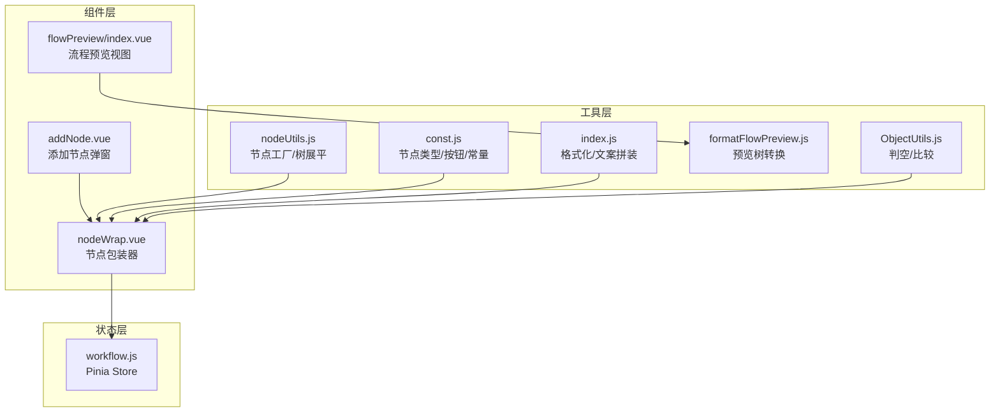
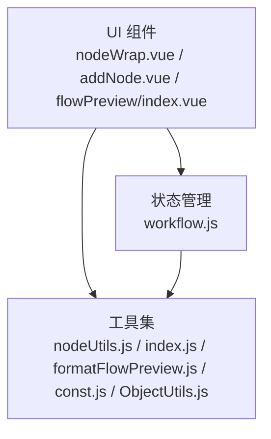
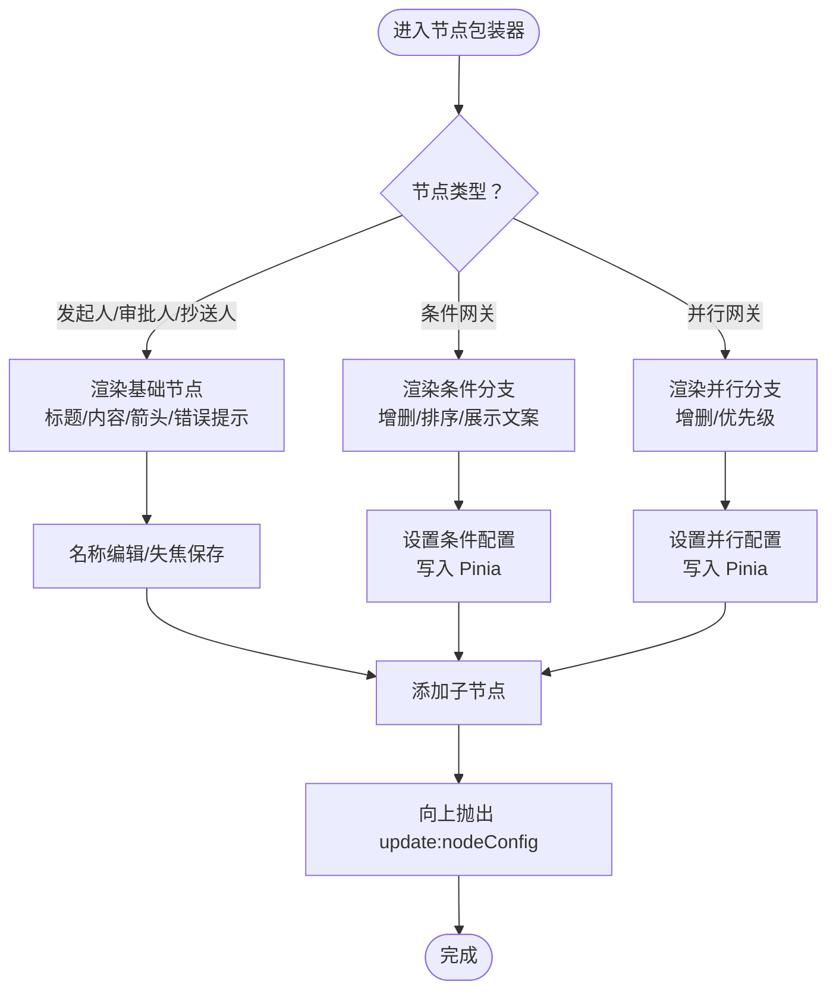
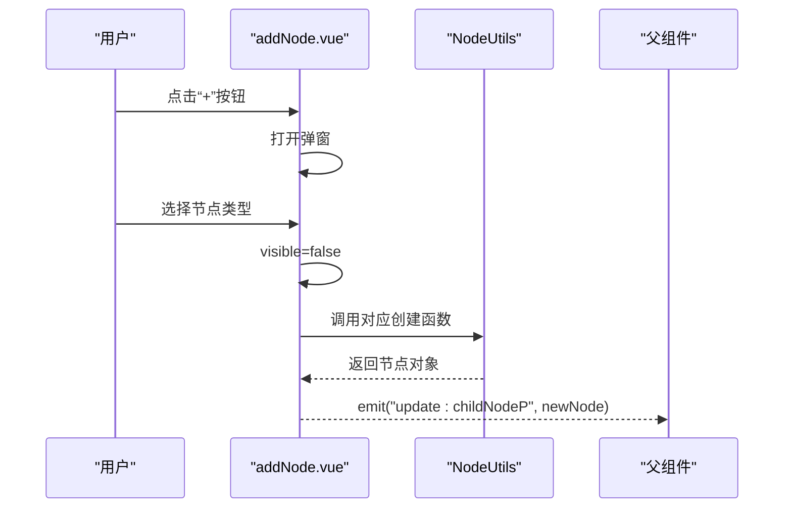
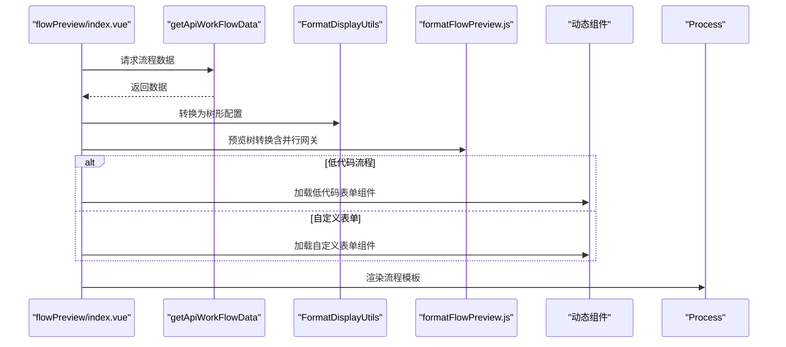
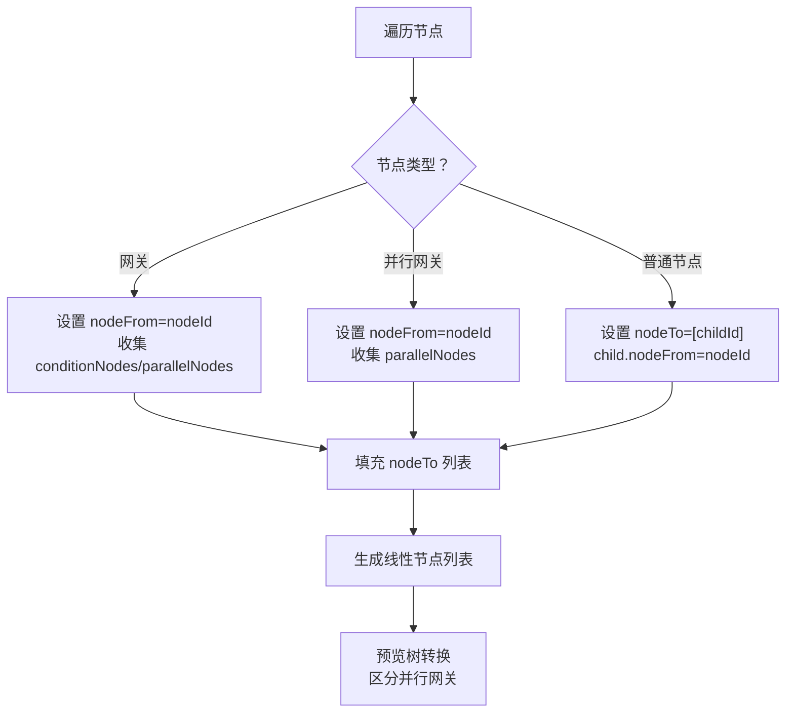
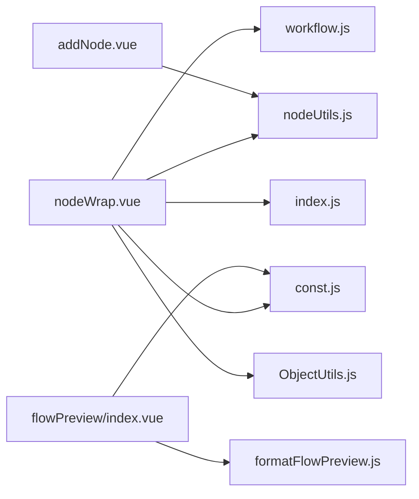

# 工作流组件

<cite>
**本文引用的文件**
- [addNode.vue](file://antflow-vue/src/components/Workflow/addNode.vue)
- [nodeWrap.vue](file://antflow-vue/src/components/Workflow/nodeWrap.vue)
- [workflow.js](file://antflow-vue/src/store/modules/workflow.js)
- [nodeUtils.js](file://antflow-vue/src/utils/antflow/nodeUtils.js)
- [formatFlowPreview.js](file://antflow-vue/src/utils/antflow/formatFlowPreview.js)
- [const.js](file://antflow-vue/src/utils/antflow/const.js)
- [index.js](file://antflow-vue/src/utils/antflow/index.js)
- [ObjectUtils.js](file://antflow-vue/src/utils/antflow/ObjectUtils.js)
- [index.vue](file://antflow-vue/src/views/workflow/flowPreview/index.vue)
</cite>

## 目录
1. [简介](#简介)
2. [项目结构](#项目结构)
3. [核心组件](#核心组件)
4. [架构总览](#架构总览)
5. [组件详解](#组件详解)
6. [依赖关系分析](#依赖关系分析)
7. [性能考量](#性能考量)
8. [故障排查指南](#故障排查指南)
9. [结论](#结论)
10. [附录](#附录)

## 简介
本文件面向需要在前端构建复杂工作流界面的开发者，系统性梳理工作流设计器的核心组件与实现机制，覆盖以下主题：
- 组件架构与职责边界
- 节点拖拽交互与属性配置面板设计模式
- 流程预览组件功能特性与渲染策略
- 节点编辑器实现机制与连线绘制算法
- 状态管理、事件处理与数据绑定策略
- 组件间通信、插槽系统使用与自定义组件开发指南
- 使用示例与扩展方法

## 项目结构
工作流组件主要位于 antflow-vue 前端工程中，围绕“节点编辑器 + 属性配置 + 流程预览”的三层结构组织：
- 组件层：节点包装器、添加节点弹窗、流程预览视图
- 工具层：节点工具类、常量与格式化工具、对象工具
- 状态层：基于 Pinia 的工作流状态管理模块

**图表来源**
- [addNode.vue:1-252](file://antflow-vue/src/components/Workflow/addNode.vue#L1-L252)
- [nodeWrap.vue:1-503](file://antflow-vue/src/components/Workflow/nodeWrap.vue#L1-L503)
- [workflow.js:1-69](file://antflow-vue/src/store/modules/workflow.js#L1-L69)
- [nodeUtils.js:1-412](file://antflow-vue/src/utils/antflow/nodeUtils.js#L1-L412)
- [formatFlowPreview.js:1-191](file://antflow-vue/src/utils/antflow/formatFlowPreview.js#L1-L191)
- [const.js:1-359](file://antflow-vue/src/utils/antflow/const.js#L1-L359)
- [index.js:1-279](file://antflow-vue/src/utils/antflow/index.js#L1-L279)
- [ObjectUtils.js:1-141](file://antflow-vue/src/utils/antflow/ObjectUtils.js#L1-L141)

**章节来源**
- [addNode.vue:1-252](file://antflow-vue/src/components/Workflow/addNode.vue#L1-L252)
- [nodeWrap.vue:1-503](file://antflow-vue/src/components/Workflow/nodeWrap.vue#L1-L503)
- [workflow.js:1-69](file://antflow-vue/src/store/modules/workflow.js#L1-L69)
- [nodeUtils.js:1-412](file://antflow-vue/src/utils/antflow/nodeUtils.js#L1-L412)
- [formatFlowPreview.js:1-191](file://antflow-vue/src/utils/antflow/formatFlowPreview.js#L1-L191)
- [const.js:1-359](file://antflow-vue/src/utils/antflow/const.js#L1-L359)
- [index.js:1-279](file://antflow-vue/src/utils/antflow/index.js#L1-L279)
- [ObjectUtils.js:1-141](file://antflow-vue/src/utils/antflow/ObjectUtils.js#L1-L141)

## 核心组件
- 节点包装器（nodeWrap.vue）
  - 负责渲染不同类型的节点（发起人、审批人、抄送人、条件网关、并行网关等），提供节点名称编辑、属性配置入口、子节点递归渲染与错误提示。
  - 通过 Pinia store 与属性配置对话框联动，实现双向数据绑定与状态同步。

- 添加节点弹窗（addNode.vue）
  - 提供节点类型选择菜单，点击后调用节点工具类创建对应节点结构，并通过事件向上抛出，驱动父级更新数据模型。

- 流程预览视图（flowPreview/index.vue）
  - 加载后端流程数据，调用格式化工具将列表数据转换为树形结构，分别渲染流程基本信息、业务表单与流程模板预览。

- 状态管理（workflow.js）
  - 统一维护流程设计器的抽屉开关、当前选中节点配置、是否已尝试提交等状态，作为组件间通信的中枢。

- 工具集
  - 节点工厂（nodeUtils.js）：创建各类节点对象、初始化流程数据、展平树为列表。
  - 常量与配置（const.js）：节点类型、审批按钮、条件字段映射等。
  - 文案与格式化（index.js）：根据节点配置生成展示文案。
  - 预览树转换（formatFlowPreview.js）：将线性节点列表转换为树形结构，区分普通与并行网关场景。
  - 对象工具（ObjectUtils.js）：判空、深比较等通用逻辑。

**章节来源**
- [nodeWrap.vue:1-503](file://antflow-vue/src/components/Workflow/nodeWrap.vue#L1-L503)
- [addNode.vue:1-252](file://antflow-vue/src/components/Workflow/addNode.vue#L1-L252)
- [workflow.js:1-69](file://antflow-vue/src/store/modules/workflow.js#L1-L69)
- [nodeUtils.js:1-412](file://antflow-vue/src/utils/antflow/nodeUtils.js#L1-L412)
- [formatFlowPreview.js:1-191](file://antflow-vue/src/utils/antflow/formatFlowPreview.js#L1-L191)
- [const.js:1-359](file://antflow-vue/src/utils/antflow/const.js#L1-L359)
- [index.js:1-279](file://antflow-vue/src/utils/antflow/index.js#L1-L279)
- [ObjectUtils.js:1-141](file://antflow-vue/src/utils/antflow/ObjectUtils.js#L1-L141)

## 架构总览
工作流组件采用“组件-工具-状态”分层架构：
- 组件层负责 UI 渲染与用户交互
- 工具层封装业务逻辑与数据转换
- 状态层集中管理跨组件共享状态

**图表来源**
- [nodeWrap.vue:1-503](file://antflow-vue/src/components/Workflow/nodeWrap.vue#L1-L503)
- [addNode.vue:1-252](file://antflow-vue/src/components/Workflow/addNode.vue#L1-L252)
- [workflow.js:1-69](file://antflow-vue/src/store/modules/workflow.js#L1-L69)
- [nodeUtils.js:1-412](file://antflow-vue/src/utils/antflow/nodeUtils.js#L1-L412)
- [index.js:1-279](file://antflow-vue/src/utils/antflow/index.js#L1-L279)
- [formatFlowPreview.js:1-191](file://antflow-vue/src/utils/antflow/formatFlowPreview.js#L1-L191)
- [const.js:1-359](file://antflow-vue/src/utils/antflow/const.js#L1-L359)
- [ObjectUtils.js:1-141](file://antflow-vue/src/utils/antflow/ObjectUtils.js#L1-L141)

## 组件详解

### 节点包装器（nodeWrap.vue）
- 节点类型与渲染
  - 发起人/审批人/抄送人：标题栏支持输入与点击切换、右侧箭头触发属性配置、错误提示角标。
  - 条件网关：支持动态条件/并行条件/普通条件，可增删条件项、拖动排序、计算展示文案。
  - 并行网关：并行审批人列表，支持增删与优先级重排。
- 交互与事件
  - 名称编辑：点击进入输入框，失焦保存默认值。
  - 属性配置：点击“内容区”或“优先级”打开对应抽屉，写入 Pinia store。
  - 子节点添加：通过 addNode 弹窗创建并插入子节点。
- 数据绑定与校验
  - 计算属性组合展示文案（如审批人、抄送人、条件表达式）。
  - 错误状态标记与默认条件处理，保证“其他条件”节点可用。

**图表来源**
- [nodeWrap.vue:1-503](file://antflow-vue/src/components/Workflow/nodeWrap.vue#L1-L503)

**章节来源**
- [nodeWrap.vue:1-503](file://antflow-vue/src/components/Workflow/nodeWrap.vue#L1-L503)

### 添加节点弹窗（addNode.vue）
- 功能概述
  - 提供审批人、并行审批、抄送人、条件分支、动态条件、条件并行六种节点类型入口。
  - 通过 Map 将类型映射到创建函数，统一处理可见性与事件冒泡。
- 交互流程
  - 点击图标打开弹窗，选择类型后关闭弹窗并创建节点对象。
  - 通过 v-model:childNodeP 将新节点信息向上游传递，驱动父级更新。

**图表来源**
- [addNode.vue:1-252](file://antflow-vue/src/components/Workflow/addNode.vue#L1-L252)
- [nodeUtils.js:1-412](file://antflow-vue/src/utils/antflow/nodeUtils.js#L1-L412)

**章节来源**
- [addNode.vue:1-252](file://antflow-vue/src/components/Workflow/addNode.vue#L1-L252)
- [nodeUtils.js:1-412](file://antflow-vue/src/utils/antflow/nodeUtils.js#L1-L412)

### 流程预览组件（flowPreview/index.vue）
- 功能特性
  - 三标签页：流程基本信息、业务表单预览、流程模板预览。
  - 低代码与自定义表单双渲染路径：根据 isLowCodeFlow 切换组件加载策略。
  - 调用格式化工具将线性节点列表转换为树形结构，驱动流程图渲染。
- 数据绑定
  - 通过 ref 获取子组件实例，按需传入 processConfig、nodeConfig、lfFormData 等 props。
  - 使用异步加载组件，确保表单与流程图在数据就绪后渲染。

**图表来源**
- [index.vue:1-115](file://antflow-vue/src/views/workflow/flowPreview/index.vue#L1-L115)
- [formatFlowPreview.js:1-191](file://antflow-vue/src/utils/antflow/formatFlowPreview.js#L1-L191)

**章节来源**
- [index.vue:1-115](file://antflow-vue/src/views/workflow/flowPreview/index.vue#L1-L115)
- [formatFlowPreview.js:1-191](file://antflow-vue/src/utils/antflow/formatFlowPreview.js#L1-L191)

### 节点编辑器与连线绘制算法
- 节点编辑器
  - 通过 nodeWrap.vue 的属性配置入口，结合 Pinia store 的抽屉状态与配置对象，实现节点属性的可视化编辑。
  - 支持审批人类型、会签/或签/顺序会签、消息通知等配置项的读取与写入。
- 连线绘制算法
  - 节点工具类提供“展平树为列表”的能力，遍历节点并填充 nodeFrom/nodeTo，形成父子关系链路。
  - 预览树转换针对并行网关场景进行特殊处理：识别并行子节点（parallelChildNode 标记）与普通子节点，分别挂载到 childNode 或 parallelNodes。
  - 流程图渲染时依据 nodeFrom/nodeTo 构建连线，普通网关与并行网关的连线策略不同，确保图形正确性。

**图表来源**
- [nodeUtils.js:372-412](file://antflow-vue/src/utils/antflow/nodeUtils.js#L372-L412)
- [formatFlowPreview.js:79-191](file://antflow-vue/src/utils/antflow/formatFlowPreview.js#L79-L191)

**章节来源**
- [nodeUtils.js:372-412](file://antflow-vue/src/utils/antflow/nodeUtils.js#L372-L412)
- [formatFlowPreview.js:79-191](file://antflow-vue/src/utils/antflow/formatFlowPreview.js#L79-L191)

### 属性配置面板设计模式
- 设计要点
  - 抽屉式面板：通过 store 中的布尔开关控制抽屉显隐，避免阻塞主画布。
  - 事件驱动：节点包装器在点击“内容区”时触发 setXxxConfig，写入当前节点配置对象。
  - 读写分离：computed 监听 store 中的配置对象，实现双向绑定；失焦或确认后写回节点树。
- 常量与文案
  - 通过 const.js 提供节点类型、审批按钮、条件字段映射等常量，保证配置面板与后端约定一致。
  - 通过 index.js 生成展示文案，减少重复逻辑。

**章节来源**
- [nodeWrap.vue:402-448](file://antflow-vue/src/components/Workflow/nodeWrap.vue#L402-L448)
- [const.js:1-359](file://antflow-vue/src/utils/antflow/const.js#L1-L359)
- [index.js:1-279](file://antflow-vue/src/utils/antflow/index.js#L1-L279)

### 状态管理、事件处理与数据绑定
- 状态管理
  - workflow.js 统一维护流程设计器状态：抽屉开关、当前配置对象、是否已尝试提交等。
  - 通过 actions 写入状态，组件通过 computed 监听 store 中的配置对象，实现响应式更新。
- 事件处理
  - 节点包装器通过 emits 向父组件抛出 update:nodeConfig，驱动树结构更新。
  - 添加节点弹窗通过 emits 向父组件抛出 update:childNodeP，注入新节点。
- 数据绑定
  - v-model 与 v-model:childNodeP 实现双向绑定，简化父子组件通信。
  - computed 结合 ObjectUtils 的判空与比较工具，确保渲染与校验逻辑稳定。

**章节来源**
- [workflow.js:1-69](file://antflow-vue/src/store/modules/workflow.js#L1-L69)
- [nodeWrap.vue:162-257](file://antflow-vue/src/components/Workflow/nodeWrap.vue#L162-L257)
- [addNode.vue:63-103](file://antflow-vue/src/components/Workflow/addNode.vue#L63-L103)
- [ObjectUtils.js:1-141](file://antflow-vue/src/utils/antflow/ObjectUtils.js#L1-L141)

### 组件间通信、插槽系统与自定义组件开发
- 组件间通信
  - 通过 props 与 emits 实现父子通信；通过 Pinia store 实现跨组件共享状态。
  - 预览视图通过动态组件加载策略支持低代码与自定义表单，体现松耦合设计。
- 插槽系统
  - 在节点包装器中，条件/并行节点的“内容区”点击可触发属性配置抽屉，形成“插槽式”的配置面板。
- 自定义组件开发
  - 低代码表单：通过 bizFormMaps 映射 formCode 与组件路径，运行时动态加载。
  - 自定义表单：根据后端返回的 formCode 动态加载对应组件，失败时提示错误。
  - 扩展建议：新增节点类型时，在 nodeUtils.js 中补充创建函数，并在 addNode.vue 中注册映射；在 const.js 中完善文案与按钮配置。

**章节来源**
- [index.vue:75-85](file://antflow-vue/src/views/workflow/flowPreview/index.vue#L75-L85)
- [const.js:174-180](file://antflow-vue/src/utils/antflow/const.js#L174-L180)
- [nodeUtils.js:26-356](file://antflow-vue/src/utils/antflow/nodeUtils.js#L26-L356)
- [addNode.vue:89-97](file://antflow-vue/src/components/Workflow/addNode.vue#L89-L97)

## 依赖关系分析
- 组件依赖
  - nodeWrap.vue 依赖：Pinia store、节点工具类、常量与格式化工具、对象工具。
  - addNode.vue 依赖：节点工具类、图标组件。
  - flowPreview/index.vue 依赖：格式化工具、动态组件加载器。
- 工具依赖
  - nodeUtils.js 为节点工厂与树转换的核心；index.js 为文案拼装；formatFlowPreview.js 为预览树转换；const.js 为常量；ObjectUtils.js 为通用工具。

**图表来源**
- [nodeWrap.vue:1-503](file://antflow-vue/src/components/Workflow/nodeWrap.vue#L1-L503)
- [addNode.vue:1-252](file://antflow-vue/src/components/Workflow/addNode.vue#L1-L252)
- [workflow.js:1-69](file://antflow-vue/src/store/modules/workflow.js#L1-L69)
- [nodeUtils.js:1-412](file://antflow-vue/src/utils/antflow/nodeUtils.js#L1-L412)
- [formatFlowPreview.js:1-191](file://antflow-vue/src/utils/antflow/formatFlowPreview.js#L1-L191)
- [const.js:1-359](file://antflow-vue/src/utils/antflow/const.js#L1-L359)
- [index.js:1-279](file://antflow-vue/src/utils/antflow/index.js#L1-L279)
- [ObjectUtils.js:1-141](file://antflow-vue/src/utils/antflow/ObjectUtils.js#L1-L141)

**章节来源**
- [nodeWrap.vue:1-503](file://antflow-vue/src/components/Workflow/nodeWrap.vue#L1-L503)
- [addNode.vue:1-252](file://antflow-vue/src/components/Workflow/addNode.vue#L1-L252)
- [workflow.js:1-69](file://antflow-vue/src/store/modules/workflow.js#L1-L69)
- [nodeUtils.js:1-412](file://antflow-vue/src/utils/antflow/nodeUtils.js#L1-L412)
- [formatFlowPreview.js:1-191](file://antflow-vue/src/utils/antflow/formatFlowPreview.js#L1-L191)
- [const.js:1-359](file://antflow-vue/src/utils/antflow/const.js#L1-L359)
- [index.js:1-279](file://antflow-vue/src/utils/antflow/index.js#L1-L279)
- [ObjectUtils.js:1-141](file://antflow-vue/src/utils/antflow/ObjectUtils.js#L1-L141)

## 性能考量
- 渲染优化
  - 条件/并行节点列表使用 v-for 渲染，注意 key 的稳定性，避免不必要的重排。
  - 预览树转换在大数据量时可能成为瓶颈，建议对节点数量与深度做限制或分页加载。
- 状态更新
  - 通过 computed 监听 store 配置对象，避免频繁写入导致的多次渲染。
  - 使用 ObjectUtils 的浅比较工具减少无效更新。
- 组件懒加载
  - 动态组件按需加载，降低首屏体积与等待时间。

## 故障排查指南
- 常见问题
  - 条件节点“请设置条件”提示：检查 conditionList 是否为空或列 ID 为 0，确保默认“其他条件”节点存在。
  - 并行节点错误：检查 parallelNodes 是否为空或 nodeApproveList 缺失，必要时重置优先级与标题。
  - 预览树转换异常：确认 nodeFrom/nodeTo 是否正确填充，区分并行网关场景。
- 定位方法
  - 在 nodeWrap.vue 中查看 resetConditionNodesErr 与 resetParallelNodesErr 的逻辑。
  - 在 formatFlowPreview.js 中核对 depthConverterNodes 与 isParallelChildNode 的判断。
  - 使用 ObjectUtils 的判空与比较工具辅助调试。

**章节来源**
- [nodeWrap.vue:198-226](file://antflow-vue/src/components/Workflow/nodeWrap.vue#L198-L226)
- [formatFlowPreview.js:79-191](file://antflow-vue/src/utils/antflow/formatFlowPreview.js#L79-L191)
- [ObjectUtils.js:1-141](file://antflow-vue/src/utils/antflow/ObjectUtils.js#L1-L141)

## 结论
本工作流组件通过清晰的分层架构与完善的工具集，实现了从节点编辑、属性配置到流程预览的全链路能力。借助 Pinia 状态管理与动态组件加载，系统具备良好的扩展性与可维护性。开发者可在此基础上快速构建复杂的工作流界面，并按需扩展节点类型与表单组件。

## 附录
- 使用示例
  - 在设计器中添加节点：点击“+”按钮，选择节点类型，节点被插入到当前节点之下。
  - 配置节点属性：点击节点内容区，打开对应抽屉，填写审批人/条件/通知等配置。
  - 查看流程预览：在流程预览页切换标签，查看基本信息、表单与流程图。
- 扩展方法
  - 新增节点类型：在 nodeUtils.js 中增加创建函数，在 addNode.vue 中注册映射，在 const.js 中完善文案与按钮配置。
  - 自定义表单：在 bizFormMaps 中添加 formCode 与组件路径，或通过后端返回 formCode 动态加载。