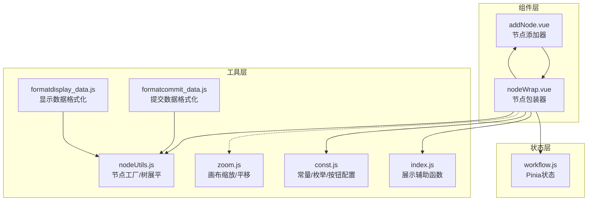
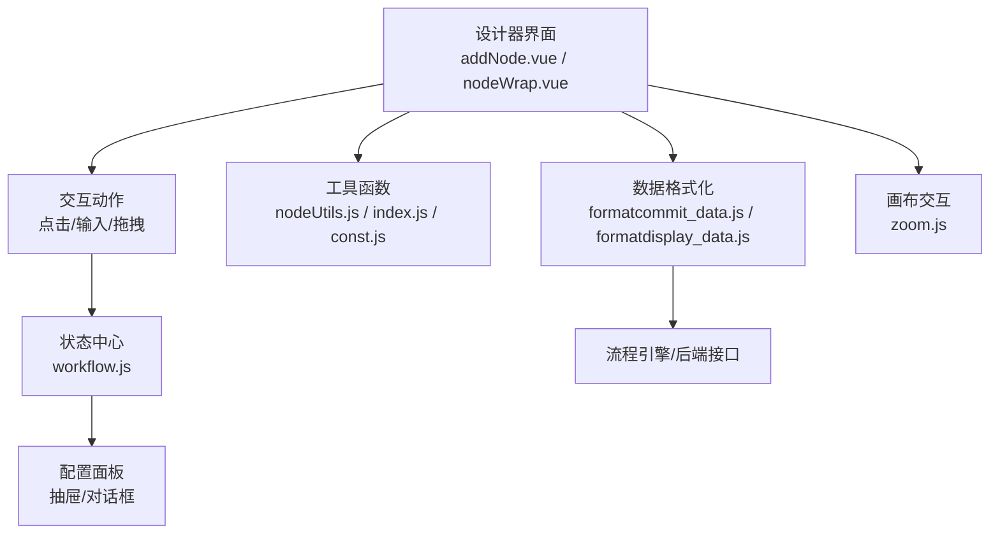
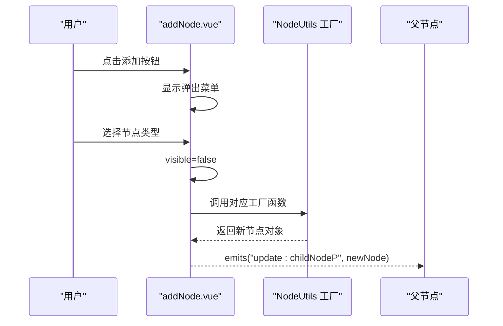
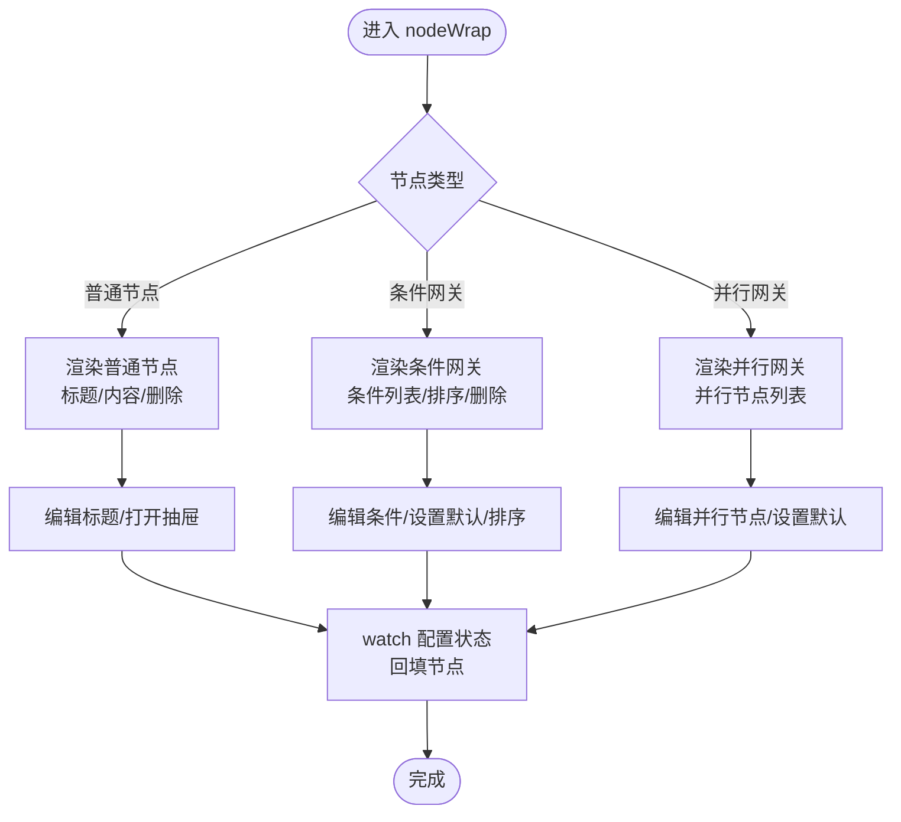
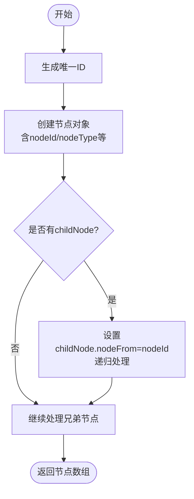
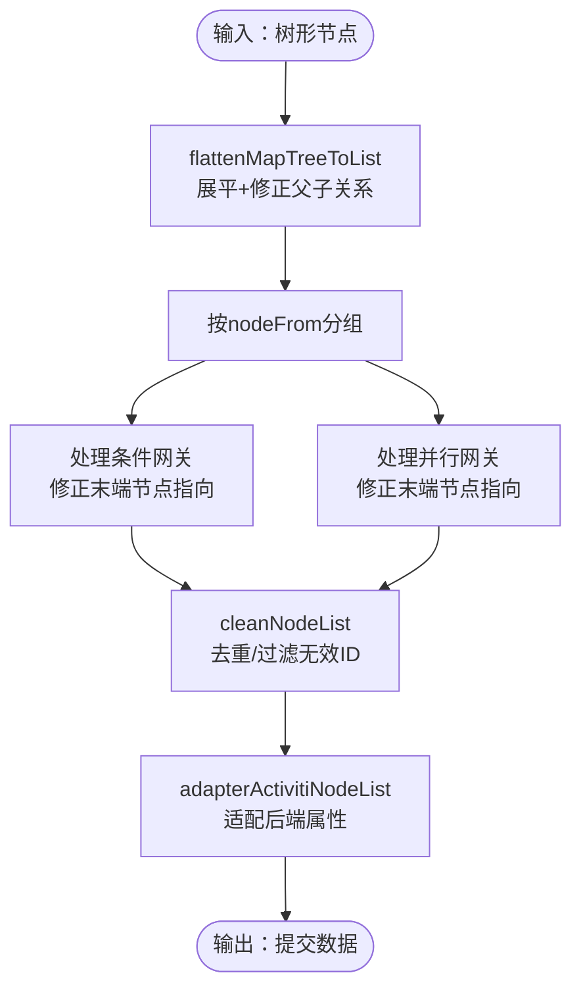
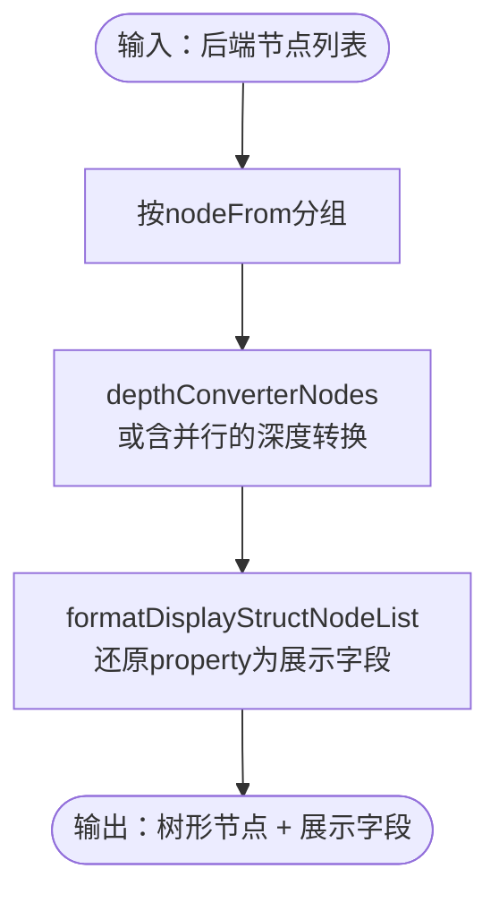
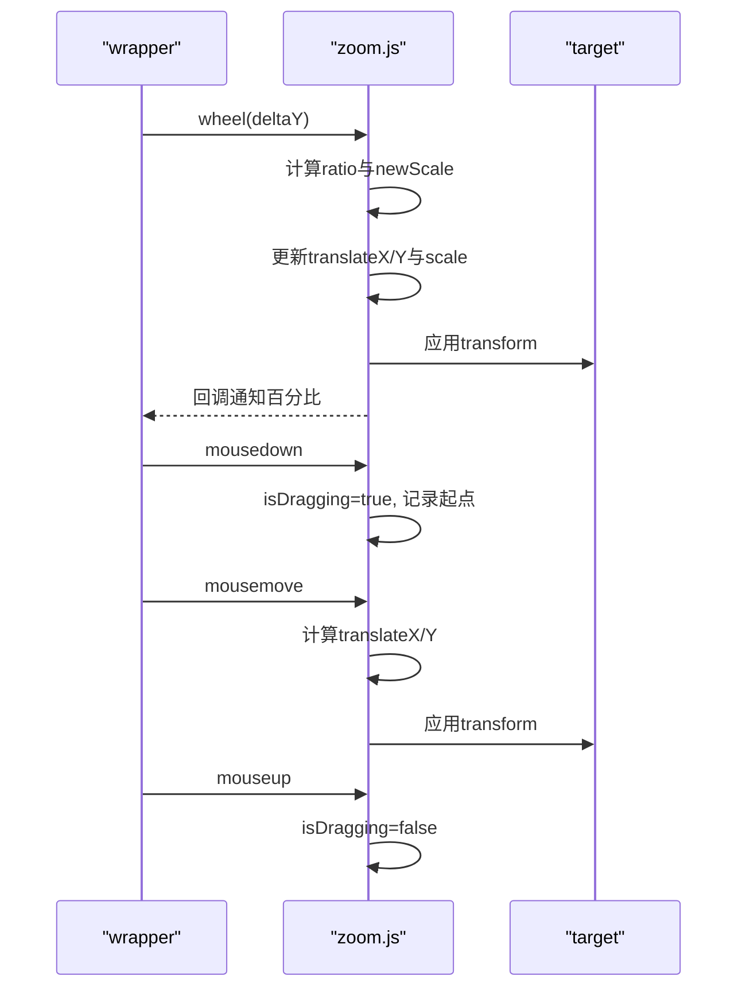
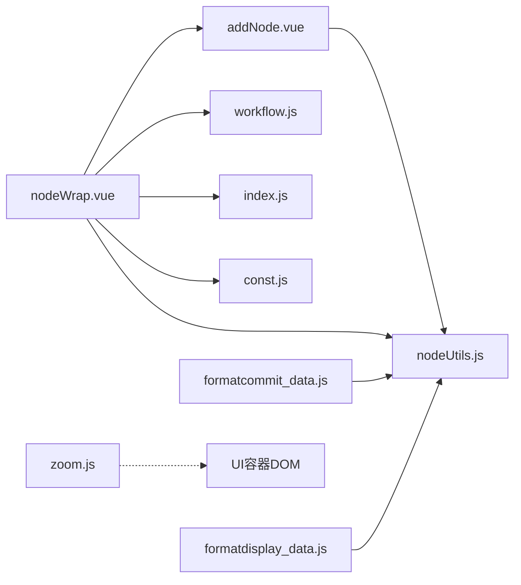

# 工作流设计器

<cite>
**本文引用的文件**   
- [addNode.vue](file://antflow-vue/src/components/Workflow/addNode.vue)
- [nodeWrap.vue](file://antflow-vue/src/components/Workflow/nodeWrap.vue)
- [nodeUtils.js](file://antflow-vue/src/utils/antflow/nodeUtils.js)
- [formatcommit_data.js](file://antflow-vue/src/utils/antflow/formatcommit_data.js)
- [formatdisplay_data.js](file://antflow-vue/src/utils/antflow/formatdisplay_data.js)
- [zoom.js](file://antflow-vue/src/utils/antflow/zoom.js)
- [const.js](file://antflow-vue/src/utils/antflow/const.js)
- [index.js](file://antflow-vue/src/utils/antflow/index.js)
- [workflow.js](file://antflow-vue/src/store/modules/workflow.js)
</cite>

## 目录
1. [简介](#简介)
2. [项目结构](#项目结构)
3. [核心组件](#核心组件)
4. [架构总览](#架构总览)
5. [详细组件分析](#详细组件分析)
6. [依赖分析](#依赖分析)
7. [性能考虑](#性能考虑)
8. [故障排查指南](#故障排查指南)
9. [结论](#结论)
10. [附录](#附录)

## 简介
本文件面向“工作流设计器”的使用者与二次开发者，系统性阐述设计器的组件架构、节点拖拽交互、画布操作机制、节点添加器与节点包装器的实现、连线绘制算法、状态管理与事件处理、数据绑定策略、工具栏功能、节点类型管理与布局算法，并提供使用示例与自定义配置方法，帮助快速理解与扩展。

## 项目结构
设计器位于前端 Vue 工程 antflow-vue 中，核心围绕以下模块组织：
- 组件层：节点添加器、节点包装器、对话框/抽屉承载的配置面板
- 工具层：节点工具类、数据格式化（提交/显示）、常量与按钮配置、缩放与画布交互
- 状态层：基于 Pinia 的工作流状态管理
- 视图层：工作流设计页面（入口视图）

**图表来源**
- [addNode.vue:1-252](file://antflow-vue/src/components/Workflow/addNode.vue#L1-L252)
- [nodeWrap.vue:1-503](file://antflow-vue/src/components/Workflow/nodeWrap.vue#L1-L503)
- [nodeUtils.js:1-412](file://antflow-vue/src/utils/antflow/nodeUtils.js#L1-L412)
- [formatcommit_data.js:1-300](file://antflow-vue/src/utils/antflow/formatcommit_data.js#L1-L300)
- [formatdisplay_data.js:1-232](file://antflow-vue/src/utils/antflow/formatdisplay_data.js#L1-L232)
- [zoom.js:1-95](file://antflow-vue/src/utils/antflow/zoom.js#L1-L95)
- [const.js:1-359](file://antflow-vue/src/utils/antflow/const.js#L1-L359)
- [index.js:1-279](file://antflow-vue/src/utils/antflow/index.js#L1-L279)
- [workflow.js:1-69](file://antflow-vue/src/store/modules/workflow.js#L1-L69)

**章节来源**
- [addNode.vue:1-252](file://antflow-vue/src/components/Workflow/addNode.vue#L1-L252)
- [nodeWrap.vue:1-503](file://antflow-vue/src/components/Workflow/nodeWrap.vue#L1-L503)
- [nodeUtils.js:1-412](file://antflow-vue/src/utils/antflow/nodeUtils.js#L1-L412)
- [formatcommit_data.js:1-300](file://antflow-vue/src/utils/antflow/formatcommit_data.js#L1-L300)
- [formatdisplay_data.js:1-232](file://antflow-vue/src/utils/antflow/formatdisplay_data.js#L1-L232)
- [zoom.js:1-95](file://antflow-vue/src/utils/antflow/zoom.js#L1-L95)
- [const.js:1-359](file://antflow-vue/src/utils/antflow/const.js#L1-L359)
- [index.js:1-279](file://antflow-vue/src/utils/antflow/index.js#L1-L279)
- [workflow.js:1-69](file://antflow-vue/src/store/modules/workflow.js#L1-L69)

## 核心组件
- 节点添加器（addNode.vue）
  - 提供弹出式菜单，支持添加审批人、并行审批、抄送人、条件分支、动态条件、条件并行等节点类型
  - 通过 Map 将类型映射到工厂函数，统一创建节点并向上游传递
- 节点包装器（nodeWrap.vue）
  - 递归渲染节点树，支持普通节点、条件网关、并行网关分支
  - 绑定节点编辑、删除、排序、错误提示、配置抽屉联动
  - 与 Pinia 状态联动，触发配置抽屉打开与数据回填
- 节点工具类（nodeUtils.js）
  - 生成唯一 ID、创建各类节点对象（发起人、审批人、抄送人、网关、条件、并行）
  - 提供树展平与父子关系修正，支撑连线与拓扑构建
- 数据格式化（formatcommit_data.js / formatdisplay_data.js）
  - 提交前将树形结构扁平化、修正 nodeTo 关系、适配后端节点属性
  - 显示前将后端节点列表还原为树形结构，补充展示所需字段
- 画布缩放（zoom.js）
  - 实现画布容器内的滚轮缩放、拖拽平移、重置与回调
- 常量与配置（const.js）
  - 节点颜色、占位符、节点类型名、审批方式、按钮配置、条件字段映射等
- 展示辅助（index.js）
  - 将复杂节点配置转换为可读字符串（如审批人、条件表达式）
- 状态管理（workflow.js）
  - 定义设计器抽屉开关与配置对象，供节点包装器触发

**章节来源**
- [addNode.vue:54-104](file://antflow-vue/src/components/Workflow/addNode.vue#L54-L104)
- [nodeWrap.vue:140-467](file://antflow-vue/src/components/Workflow/nodeWrap.vue#L140-L467)
- [nodeUtils.js:3-357](file://antflow-vue/src/utils/antflow/nodeUtils.js#L3-L357)
- [formatcommit_data.js:3-179](file://antflow-vue/src/utils/antflow/formatcommit_data.js#L3-L179)
- [formatdisplay_data.js:4-231](file://antflow-vue/src/utils/antflow/formatdisplay_data.js#L4-L231)
- [zoom.js:9-94](file://antflow-vue/src/utils/antflow/zoom.js#L9-L94)
- [const.js:8-359](file://antflow-vue/src/utils/antflow/const.js#L8-L359)
- [index.js:4-279](file://antflow-vue/src/utils/antflow/index.js#L4-L279)
- [workflow.js:1-69](file://antflow-vue/src/store/modules/workflow.js#L1-L69)

## 架构总览
设计器采用“组件驱动 + 工具函数 + 状态管理”的分层架构：
- 组件层负责交互与渲染
- 工具层负责数据建模与格式化
- 状态层集中管理抽屉与配置
- 画布层提供缩放与平移能力

**图表来源**
- [addNode.vue:1-252](file://antflow-vue/src/components/Workflow/addNode.vue#L1-L252)
- [nodeWrap.vue:1-503](file://antflow-vue/src/components/Workflow/nodeWrap.vue#L1-L503)
- [workflow.js:1-69](file://antflow-vue/src/store/modules/workflow.js#L1-L69)
- [nodeUtils.js:1-412](file://antflow-vue/src/utils/antflow/nodeUtils.js#L1-L412)
- [index.js:1-279](file://antflow-vue/src/utils/antflow/index.js#L1-L279)
- [const.js:1-359](file://antflow-vue/src/utils/antflow/const.js#L1-L359)
- [formatcommit_data.js:1-300](file://antflow-vue/src/utils/antflow/formatcommit_data.js#L1-L300)
- [formatdisplay_data.js:1-232](file://antflow-vue/src/utils/antflow/formatdisplay_data.js#L1-L232)
- [zoom.js:1-95](file://antflow-vue/src/utils/antflow/zoom.js#L1-L95)

## 详细组件分析

### 节点添加器（addNode.vue）
- 功能特性
  - 弹出式菜单提供多种节点类型入口
  - 使用 Map 将类型编号映射到工厂函数，统一创建节点
  - 通过 v-model:childNodeP 向父节点传递新建节点
- 交互机制
  - 点击图标弹出菜单，选择类型后隐藏菜单并调用工厂函数
  - 通过 emits 事件向上游传递新节点，父组件负责插入到树结构中
- 扩展建议
  - 如需新增节点类型，只需在 Map 中注册新类型与工厂函数

**图表来源**
- [addNode.vue:54-104](file://antflow-vue/src/components/Workflow/addNode.vue#L54-L104)
- [nodeUtils.js:26-357](file://antflow-vue/src/utils/antflow/nodeUtils.js#L26-L357)

**章节来源**
- [addNode.vue:54-104](file://antflow-vue/src/components/Workflow/addNode.vue#L54-L104)
- [nodeUtils.js:26-357](file://antflow-vue/src/utils/antflow/nodeUtils.js#L26-L357)

### 节点包装器（nodeWrap.vue）
- 功能特性
  - 递归渲染节点树，支持普通节点、条件网关、并行网关分支
  - 支持节点标题编辑、删除、添加/删除条件、条件排序
  - 错误状态提示与展示名称计算
  - 触发配置抽屉（发起人/审批人/抄送人/条件）
- 事件与状态
  - 通过 Pinia 计算属性监听全局配置状态，实现抽屉联动
  - setNodeInfo 根据节点类型派发不同配置对象与标识
- 数据绑定
  - v-model:nodeConfig 与 v-model:flowPermission 实现双向绑定
  - watch 监听外部传入的配置，回填到当前节点

**图表来源**
- [nodeWrap.vue:140-467](file://antflow-vue/src/components/Workflow/nodeWrap.vue#L140-L467)
- [workflow.js:1-69](file://antflow-vue/src/store/modules/workflow.js#L1-L69)

**章节来源**
- [nodeWrap.vue:140-467](file://antflow-vue/src/components/Workflow/nodeWrap.vue#L140-L467)
- [workflow.js:1-69](file://antflow-vue/src/store/modules/workflow.js#L1-L69)

### 节点工具类（nodeUtils.js）
- 节点工厂
  - 生成唯一 ID（基于时间戳与随机数的 64 进制）
  - 创建审批人、抄送人、网关、条件、并行节点及其子节点
- 树展平与关系修正
  - flattenMapTreeToList：遍历树，修正 nodeFrom/nodeTo，拆分 conditionNodes/parallelNodes
  - 为后续连线与拓扑构建提供扁平化的节点关系

**图表来源**
- [nodeUtils.js:3-412](file://antflow-vue/src/utils/antflow/nodeUtils.js#L3-L412)

**章节来源**
- [nodeUtils.js:3-412](file://antflow-vue/src/utils/antflow/nodeUtils.js#L3-L412)

### 提交数据格式化（formatcommit_data.js）
- 主要职责
  - 将树形节点扁平化为节点列表
  - 修正网关子节点的 nodeTo 关系（处理条件网关与并行网关）
  - 清洗重复与无效 nodeTo
  - 适配后端节点属性（property、setType、nodeApproveList 等）
- 关键算法
  - getEndpointNodeId：按 nodeFrom 分组，分别处理条件网关与并行网关
  - handleConditionGetway / handleApproverParallelGetway：递归修正末端节点指向

**图表来源**
- [formatcommit_data.js:3-179](file://antflow-vue/src/utils/antflow/formatcommit_data.js#L3-L179)

**章节来源**
- [formatcommit_data.js:3-179](file://antflow-vue/src/utils/antflow/formatcommit_data.js#L3-L179)

### 显示数据格式化（formatdisplay_data.js）
- 主要职责
  - 将后端节点列表还原为树形结构（含条件/并行分支）
  - 补充展示所需字段（如 property -> conditionList、nodeApproveList）
  - 判断并行子节点归属（isParallelChildNode）
- 关键算法
  - depthConverterNodes / depthConverterToTreeForParallelway：根据 nodeFrom 分组重建树
  - formatDisplayStructNodeList：将后端 property 还原为前端展示字段

**图表来源**
- [formatdisplay_data.js:4-231](file://antflow-vue/src/utils/antflow/formatdisplay_data.js#L4-L231)

**章节来源**
- [formatdisplay_data.js:4-231](file://antflow-vue/src/utils/antflow/formatdisplay_data.js#L4-L231)

### 画布缩放与平移（zoom.js）
- 功能特性
  - 鼠标滚轮缩放，支持最小/最大比例限制
  - 鼠标拖拽平移，实时更新 transform
  - 提供重置方法，恢复初始缩放与平移
- 交互流程
  - 监听 wrapper 的 wheel/mousedown/mousemove/mouseup
  - 计算缩放比例与平移增量，更新目标元素 transform
  - 回调通知缩放百分比

**图表来源**
- [zoom.js:9-94](file://antflow-vue/src/utils/antflow/zoom.js#L9-L94)

**章节来源**
- [zoom.js:9-94](file://antflow-vue/src/utils/antflow/zoom.js#L9-L94)

### 常量与配置（const.js）
- 节点颜色、占位符、节点类型名
- 审批方式、节点类型枚举、按钮配置（审批/发起/查看）
- 条件字段类型映射（控件 -> 后端字段类型/值类型）
- 通知用户类型、消息发送渠道、事件类型等

**章节来源**
- [const.js:8-359](file://antflow-vue/src/utils/antflow/const.js#L8-L359)

### 展示辅助（index.js）
- 将复杂节点配置转换为可读字符串
  - 审批人字符串（指定人员/角色/HBBP/层级）
  - 条件表达式字符串（含“且/或”关系）
  - 抄送人字符串
- 提供数组/选择/复选等辅助拼装

**章节来源**
- [index.js:4-279](file://antflow-vue/src/utils/antflow/index.js#L4-L279)

## 依赖分析
- 组件依赖
  - addNode.vue 依赖 NodeUtils 工厂
  - nodeWrap.vue 依赖 NodeUtils、Pinia 状态、展示辅助、常量、addNode.vue
- 工具依赖
  - formatcommit_data.js 依赖 nodeUtils.js 的树展平与修正
  - formatdisplay_data.js 依赖 nodeUtils.js 的节点还原
- 画布依赖
  - zoom.js 与 UI 容器 DOM 强耦合，需确保初始化时机

**图表来源**
- [addNode.vue:54-104](file://antflow-vue/src/components/Workflow/addNode.vue#L54-L104)
- [nodeWrap.vue:140-467](file://antflow-vue/src/components/Workflow/nodeWrap.vue#L140-L467)
- [nodeUtils.js:1-412](file://antflow-vue/src/utils/antflow/nodeUtils.js#L1-L412)
- [formatcommit_data.js:1-300](file://antflow-vue/src/utils/antflow/formatcommit_data.js#L1-L300)
- [formatdisplay_data.js:1-232](file://antflow-vue/src/utils/antflow/formatdisplay_data.js#L1-L232)
- [zoom.js:1-95](file://antflow-vue/src/utils/antflow/zoom.js#L1-L95)
- [workflow.js:1-69](file://antflow-vue/src/store/modules/workflow.js#L1-L69)

**章节来源**
- [addNode.vue:54-104](file://antflow-vue/src/components/Workflow/addNode.vue#L54-L104)
- [nodeWrap.vue:140-467](file://antflow-vue/src/components/Workflow/nodeWrap.vue#L140-L467)
- [nodeUtils.js:1-412](file://antflow-vue/src/utils/antflow/nodeUtils.js#L1-L412)
- [formatcommit_data.js:1-300](file://antflow-vue/src/utils/antflow/formatcommit_data.js#L1-L300)
- [formatdisplay_data.js:1-232](file://antflow-vue/src/utils/antflow/formatdisplay_data.js#L1-L232)
- [zoom.js:1-95](file://antflow-vue/src/utils/antflow/zoom.js#L1-L95)
- [workflow.js:1-69](file://antflow-vue/src/store/modules/workflow.js#L1-L69)

## 性能考虑
- 树展平与关系修正
  - flattenMapTreeToList 与 getEndpointNodeId 为 O(N) 遍历，注意避免重复计算
  - 清洗 nodeTo 时使用 Set 去重，减少查找成本
- 画布缩放
  - 鼠标移动事件频繁触发，建议在 UI 层节流或使用 requestAnimationFrame
- 渲染优化
  - nodeWrap.vue 使用 v-if 控制分支渲染，减少不必要的 DOM
  - watch 监听仅在必要时触发，避免深层对象全量比较

[本节为通用指导，无需特定文件引用]

## 故障排查指南
- 节点无法添加
  - 检查 addNode.vue 的类型映射与工厂函数是否正确注册
  - 确认父组件是否正确接收并插入新节点
- 条件/并行网关连线异常
  - 检查 formatcommit_data.js 的 handleConditionGetway 与 handleApproverParallelGetway 是否正确修正末端节点
  - 确认 cleanNodeList 是否过滤了无效 nodeTo
- 显示数据不正确
  - 检查 formatdisplay_data.js 的 depthConverterNodes 与 formatDisplayStructNodeList 字段还原逻辑
- 画布无法缩放/平移
  - 确认 zoom.js 初始化参数（wrapper/target）是否正确
  - 检查事件绑定与 transform 应用是否生效

**章节来源**
- [addNode.vue:54-104](file://antflow-vue/src/components/Workflow/addNode.vue#L54-L104)
- [formatcommit_data.js:68-299](file://antflow-vue/src/utils/antflow/formatcommit_data.js#L68-L299)
- [formatdisplay_data.js:58-231](file://antflow-vue/src/utils/antflow/formatdisplay_data.js#L58-L231)
- [zoom.js:9-94](file://antflow-vue/src/utils/antflow/zoom.js#L9-L94)

## 结论
工作流设计器通过“组件 + 工具 + 状态 + 画布”的清晰分层，实现了节点的可视化编辑、树形结构的构建与修正、以及与后端的数据对接。节点添加器与节点包装器承担交互与渲染职责；节点工具类与数据格式化保障节点模型与连线拓扑的正确性；Pinia 状态与常量配置提供一致的交互体验与展示语义。在此基础上，开发者可快速扩展节点类型、完善配置面板与校验逻辑。

[本节为总结，无需特定文件引用]

## 附录

### 使用示例
- 新增节点类型
  - 在 addNode.vue 的类型映射中注册新类型与工厂函数
  - 在 nodeUtils.js 中实现对应的工厂函数
- 打开配置抽屉
  - 在 nodeWrap.vue 的 setNodeInfo 中派发对应配置对象与标识
  - 在 workflow.js 中定义抽屉开关与配置对象
- 提交流程
  - 调用 formatcommit_data.js 的 formatSettings，获取提交数据
  - 发送至后端保存

**章节来源**
- [addNode.vue:89-103](file://antflow-vue/src/components/Workflow/addNode.vue#L89-L103)
- [nodeUtils.js:26-357](file://antflow-vue/src/utils/antflow/nodeUtils.js#L26-L357)
- [nodeWrap.vue:402-448](file://antflow-vue/src/components/Workflow/nodeWrap.vue#L402-L448)
- [workflow.js:21-67](file://antflow-vue/src/store/modules/workflow.js#L21-L67)
- [formatcommit_data.js:8-14](file://antflow-vue/src/utils/antflow/formatcommit_data.js#L8-L14)

### 自定义配置方法
- 节点类型管理
  - 在 const.js 中扩展节点类型名与颜色
  - 在 addNode.vue 中扩展弹出菜单项
- 按钮与展示
  - 在 const.js 的按钮配置中新增/调整按钮
  - 在 index.js 中扩展字符串拼装逻辑
- 画布交互
  - 在 zoom.js 中调整缩放范围与步进
- 数据格式化
  - 在 formatcommit_data.js 与 formatdisplay_data.js 中扩展字段映射与还原逻辑

**章节来源**
- [const.js:8-359](file://antflow-vue/src/utils/antflow/const.js#L8-L359)
- [index.js:36-279](file://antflow-vue/src/utils/antflow/index.js#L36-L279)
- [zoom.js:75-94](file://antflow-vue/src/utils/antflow/zoom.js#L75-L94)
- [formatcommit_data.js:112-179](file://antflow-vue/src/utils/antflow/formatcommit_data.js#L112-L179)
- [formatdisplay_data.js:168-231](file://antflow-vue/src/utils/antflow/formatdisplay_data.js#L168-L231)