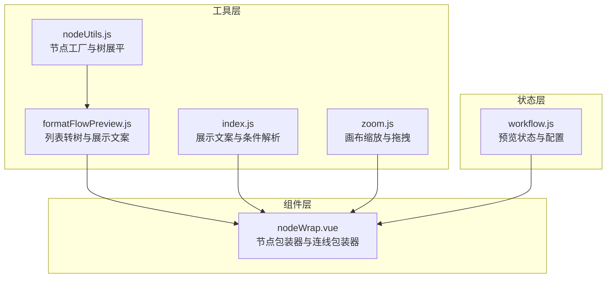
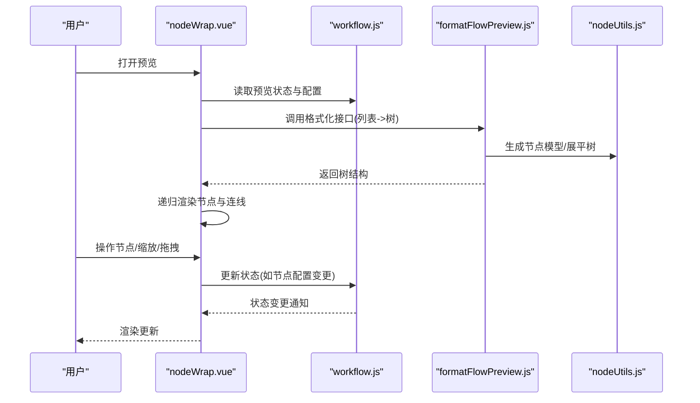
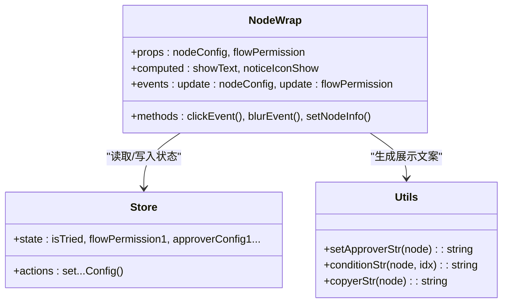
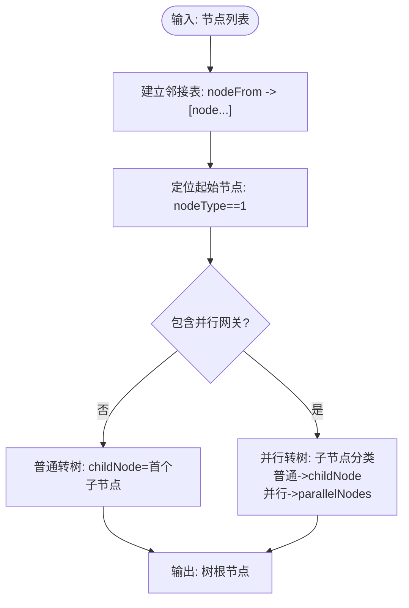
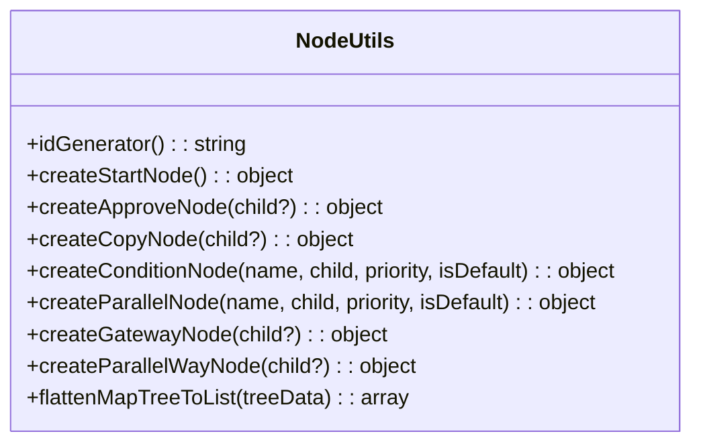
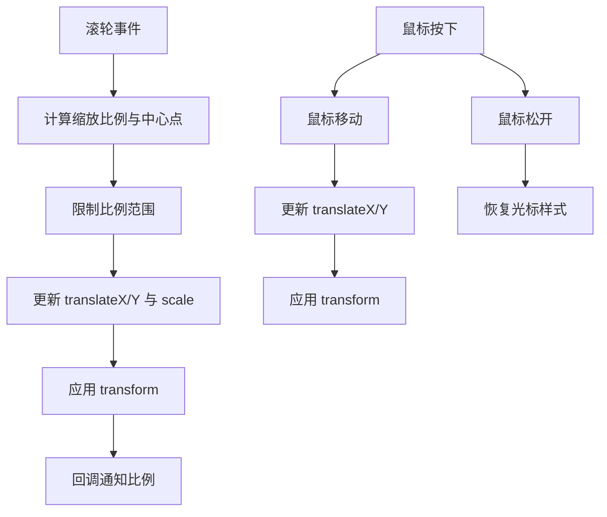
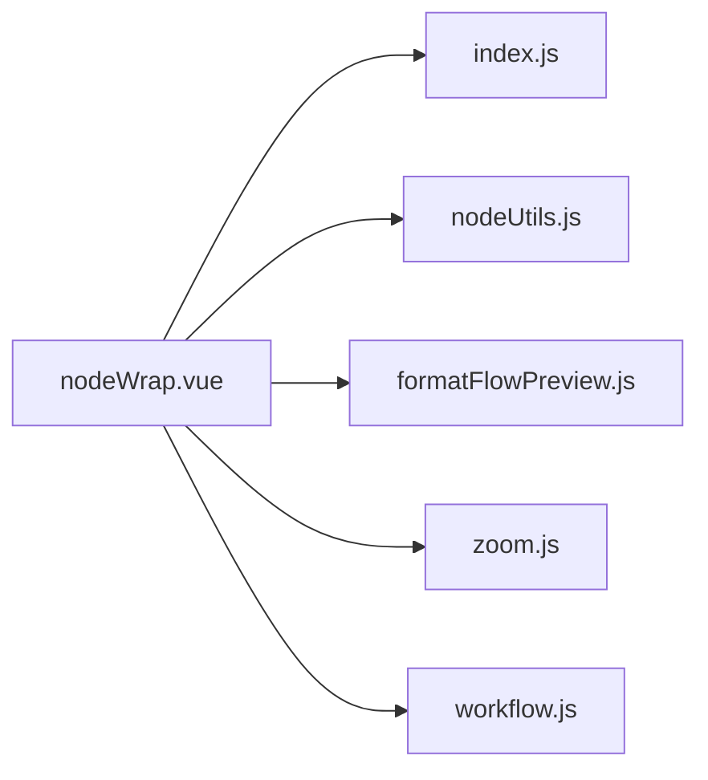

# 流程预览组件

<cite>
**本文引用的文件**
- [formatFlowPreview.js](file://antflow-vue/src/utils/antflow/formatFlowPreview.js)
- [nodeUtils.js](file://antflow-vue/src/utils/antflow/nodeUtils.js)
- [index.js](file://antflow-vue/src/utils/antflow/index.js)
- [zoom.js](file://antflow-vue/src/utils/antflow/zoom.js)
- [nodeWrap.vue](file://antflow-vue/src/components/Workflow/nodeWrap.vue)
- [workflow.js](file://antflow-vue/src/store/modules/workflow.js)
</cite>

## 目录
1. [简介](#简介)
2. [项目结构](#项目结构)
3. [核心组件](#核心组件)
4. [架构总览](#架构总览)
5. [详细组件分析](#详细组件分析)
6. [依赖分析](#依赖分析)
7. [性能考虑](#性能考虑)
8. [故障排查指南](#故障排查指南)
9. [结论](#结论)
10. [附录](#附录)

## 简介
本文件面向“流程预览组件”的功能与实现，围绕以下目标展开：
- 解释预览组件的架构设计与数据流转
- 详述流程步骤展示机制与连线渲染算法
- 阐明流程步骤组件的功能特性、审查包装器与线条包装器的绘制逻辑
- 说明预览模式下的数据绑定、状态同步与交互响应机制
- 提供使用示例与定制化配置建议，帮助开发者实现流畅的流程预览体验

## 项目结构
预览组件位于前端工程 antflow-vue 中，核心文件分布如下：
- 工具层：负责节点模型构建、数据格式化、展示文案生成与缩放交互
- 组件层：负责节点树渲染、连线绘制与用户交互
- 状态层：集中管理预览状态与配置

图表来源
- [nodeUtils.js:1-412](file://antflow-vue/src/utils/antflow/nodeUtils.js#L1-L412)
- [formatFlowPreview.js:1-191](file://antflow-vue/src/utils/antflow/formatFlowPreview.js#L1-L191)
- [index.js:1-279](file://antflow-vue/src/utils/antflow/index.js#L1-L279)
- [zoom.js:1-95](file://antflow-vue/src/utils/antflow/zoom.js#L1-L95)
- [nodeWrap.vue:1-503](file://antflow-vue/src/components/Workflow/nodeWrap.vue#L1-L503)
- [workflow.js:1-69](file://antflow-vue/src/store/modules/workflow.js#L1-L69)

章节来源
- [nodeUtils.js:1-412](file://antflow-vue/src/utils/antflow/nodeUtils.js#L1-L412)
- [formatFlowPreview.js:1-191](file://antflow-vue/src/utils/antflow/formatFlowPreview.js#L1-L191)
- [index.js:1-279](file://antflow-vue/src/utils/antflow/index.js#L1-L279)
- [zoom.js:1-95](file://antflow-vue/src/utils/antflow/zoom.js#L1-L95)
- [nodeWrap.vue:1-503](file://antflow-vue/src/components/Workflow/nodeWrap.vue#L1-L503)
- [workflow.js:1-69](file://antflow-vue/src/store/modules/workflow.js#L1-L69)

## 核心组件
- 节点工厂与树展平：提供节点模型构造、起始节点初始化、条件/并行网关节点创建与树形展平能力
- 数据格式化与展示文案：将原始节点列表转换为树结构，并生成节点展示文案
- 展示文案与条件解析：根据节点配置生成“审批人”“抄送人”“条件”等可读文本
- 缩放与拖拽：提供画布缩放与拖拽交互，支持滚轮缩放与平移
- 节点包装器与连线包装器：负责节点UI渲染、连线绘制与交互事件

章节来源
- [nodeUtils.js:1-412](file://antflow-vue/src/utils/antflow/nodeUtils.js#L1-L412)
- [formatFlowPreview.js:1-191](file://antflow-vue/src/utils/antflow/formatFlowPreview.js#L1-L191)
- [index.js:1-279](file://antflow-vue/src/utils/antflow/index.js#L1-L279)
- [zoom.js:1-95](file://antflow-vue/src/utils/antflow/zoom.js#L1-L95)
- [nodeWrap.vue:1-503](file://antflow-vue/src/components/Workflow/nodeWrap.vue#L1-L503)

## 架构总览
预览组件采用“工具层-组件层-状态层”的分层架构：
- 工具层：提供节点模型与数据格式化能力，确保组件层专注于渲染与交互
- 组件层：以 nodeWrap 为核心，递归渲染节点树，按节点类型绘制连线
- 状态层：通过 store 管理预览开关、配置与交互状态，驱动组件更新

图表来源
- [nodeWrap.vue:140-467](file://antflow-vue/src/components/Workflow/nodeWrap.vue#L140-L467)
- [workflow.js:1-69](file://antflow-vue/src/store/modules/workflow.js#L1-L69)
- [formatFlowPreview.js:79-164](file://antflow-vue/src/utils/antflow/formatFlowPreview.js#L79-L164)
- [nodeUtils.js:372-411](file://antflow-vue/src/utils/antflow/nodeUtils.js#L372-L411)

## 详细组件分析

### 节点包装器（nodeWrap.vue）
- 功能特性
  - 支持多种节点类型：普通审批人、抄送人、条件分支、并行分支、起始节点
  - 动态编辑节点名称、优先级、条件表达式
  - 错误状态提示与默认文案生成
  - 递归渲染子节点与连线覆盖线
- 审查包装器
  - 通过 store 的 isTried 字段触发错误状态高亮
  - 审批人/抄送人/条件节点在失焦时重算展示文案与错误标志
- 连线包装器
  - 条件分支与并行分支通过“覆盖线”视觉化连接关系
  - 起始节点与后续节点通过 childNode/nodeTo 关系建立连线

图表来源
- [nodeWrap.vue:140-467](file://antflow-vue/src/components/Workflow/nodeWrap.vue#L140-L467)
- [workflow.js:1-69](file://antflow-vue/src/store/modules/workflow.js#L1-L69)
- [index.js:36-253](file://antflow-vue/src/utils/antflow/index.js#L36-L253)

章节来源
- [nodeWrap.vue:1-503](file://antflow-vue/src/components/Workflow/nodeWrap.vue#L1-L503)
- [workflow.js:1-69](file://antflow-vue/src/store/modules/workflow.js#L1-L69)
- [index.js:1-279](file://antflow-vue/src/utils/antflow/index.js#L1-L279)

### 数据格式化与树构建（formatFlowPreview.js）
- 列表转树
  - 依据 nodeFrom/nodeTo 建立邻接关系，将一维节点列表转换为树结构
  - 区分普通流程与包含并行网关的流程，分别处理“普通审批/并行审批”场景
- 展示文案生成
  - 审批人/抄送人：根据 setType 与成员列表生成可读文案
  - 条件节点：解析条件表达式，生成自然语言描述
- 并行节点判定
  - 通过父节点 nodeType 与 nodeTo 包含关系识别并行子节点

图表来源
- [formatFlowPreview.js:79-164](file://antflow-vue/src/utils/antflow/formatFlowPreview.js#L79-L164)

章节来源
- [formatFlowPreview.js:1-191](file://antflow-vue/src/utils/antflow/formatFlowPreview.js#L1-L191)

### 节点模型与树展平（nodeUtils.js）
- 节点工厂
  - 提供创建起始节点、审批人节点、抄送人节点、条件节点、并行节点、网关节点等工厂方法
  - 自动生成唯一 nodeId，统一节点属性结构
- 树展平
  - 将树形结构展平为列表，便于序列化与传输
  - 递归遍历节点，设置 nodeFrom/nodeTo 关系

图表来源
- [nodeUtils.js:1-412](file://antflow-vue/src/utils/antflow/nodeUtils.js#L1-L412)

章节来源
- [nodeUtils.js:1-412](file://antflow-vue/src/utils/antflow/nodeUtils.js#L1-L412)

### 展示文案与条件解析（index.js）
- 审批人展示文案
  - 根据 setType（指定人员/角色/部门/主管层级/自选等）与 signType（会签/或签/顺序会签）生成可读文案
- 抄送人展示文案
  - 基于成员列表生成逗号分隔的名称串
- 条件展示文案
  - 解析条件数组，支持输入框、日期、数值范围、下拉/多选等字段类型，拼接“且/或”关系

章节来源
- [index.js:1-279](file://antflow-vue/src/utils/antflow/index.js#L1-L279)

### 缩放与拖拽（zoom.js）
- 画布缩放
  - 鼠标滚轮缩放，限制最小/最大比例，支持以鼠标位置为中心的缩放
  - 外部调用可直接传入目标 scale
- 画布拖拽
  - 鼠标按下拖动，实时更新 translateX/translateY
  - 松开恢复光标样式
- 回调通知
  - 缩放比例变化时回调通知组件更新 UI

图表来源
- [zoom.js:9-95](file://antflow-vue/src/utils/antflow/zoom.js#L9-L95)

章节来源
- [zoom.js:1-95](file://antflow-vue/src/utils/antflow/zoom.js#L1-L95)

## 依赖分析
- 组件对工具层的依赖
  - nodeWrap 依赖 index.js 的展示文案生成与条件解析
  - nodeWrap 依赖 nodeUtils.js 的节点模型与树展平
  - nodeWrap 依赖 formatFlowPreview.js 的列表转树与展示文案
  - nodeWrap 依赖 zoom.js 的画布交互
- 组件对状态层的依赖
  - 通过 workflow.js 的 store 订阅/发布节点配置变更与预览状态
- 依赖耦合与内聚
  - 工具层职责清晰，组件层专注渲染与交互，状态层集中管理，整体耦合度较低，内聚性良好

图表来源
- [nodeWrap.vue:140-467](file://antflow-vue/src/components/Workflow/nodeWrap.vue#L140-L467)
- [index.js:1-279](file://antflow-vue/src/utils/antflow/index.js#L1-L279)
- [nodeUtils.js:1-412](file://antflow-vue/src/utils/antflow/nodeUtils.js#L1-L412)
- [formatFlowPreview.js:1-191](file://antflow-vue/src/utils/antflow/formatFlowPreview.js#L1-L191)
- [zoom.js:1-95](file://antflow-vue/src/utils/antflow/zoom.js#L1-L95)
- [workflow.js:1-69](file://antflow-vue/src/store/modules/workflow.js#L1-L69)

章节来源
- [nodeWrap.vue:1-503](file://antflow-vue/src/components/Workflow/nodeWrap.vue#L1-L503)
- [workflow.js:1-69](file://antflow-vue/src/store/modules/workflow.js#L1-L69)

## 性能考虑
- 渲染优化
  - 使用递归组件渲染树结构，避免不必要的整树重渲染；通过 props 变更触发局部更新
- 数据结构
  - 列表转树时使用邻接表，时间复杂度 O(N)，空间复杂度 O(N)
- 交互性能
  - 缩放与拖拽采用 transform，避免重排重绘；限制缩放范围防止过度放大导致的性能问题
- 文案生成
  - 条件解析与展示文案生成在用户编辑时触发，避免在高频渲染中重复计算

## 故障排查指南
- 节点无连线或连线异常
  - 检查 nodeFrom/nodeTo 是否正确设置；确认列表转树逻辑是否命中并行分支分支
- 审批人/抄送人显示为空
  - 检查 setType 与成员列表；确认展示文案生成逻辑是否被调用
- 条件节点错误高亮
  - 检查 isTried 状态与条件表达式是否为空；确认默认条件分支处理
- 画布无法缩放/拖拽
  - 检查 zoomInit 的 DOM 引用与事件绑定；确认回调函数是否正确传递

章节来源
- [formatFlowPreview.js:79-164](file://antflow-vue/src/utils/antflow/formatFlowPreview.js#L79-L164)
- [nodeWrap.vue:198-233](file://antflow-vue/src/components/Workflow/nodeWrap.vue#L198-L233)
- [zoom.js:9-95](file://antflow-vue/src/utils/antflow/zoom.js#L9-L95)

## 结论
流程预览组件通过清晰的分层设计与工具化能力，实现了从数据到渲染的高效闭环。节点包装器负责节点树渲染与连线绘制，工具层提供节点模型与数据格式化，状态层保障交互一致性。缩放与拖拽提升了预览体验，展示文案与条件解析增强了可读性。整体架构具备良好的扩展性与可维护性。

## 附录

### 使用示例与定制化配置
- 列表转树与展示
  - 输入：节点列表（包含 nodeFrom/nodeTo/nodeType 等）
  - 输出：树根节点，用于 nodeWrap 递归渲染
  - 参考路径：[formatFlowPreview.js:79-164](file://antflow-vue/src/utils/antflow/formatFlowPreview.js#L79-L164)
- 节点模型定制
  - 通过工厂方法创建不同类型的节点，设置 setType/signType/成员列表等
  - 参考路径：[nodeUtils.js:26-357](file://antflow-vue/src/utils/antflow/nodeUtils.js#L26-L357)
- 展示文案定制
  - 自定义审批人/抄送人/条件的展示文案生成逻辑
  - 参考路径：[index.js:36-253](file://antflow-vue/src/utils/antflow/index.js#L36-L253)
- 画布交互定制
  - 调整缩放范围、拖拽行为与回调通知
  - 参考路径：[zoom.js:9-95](file://antflow-vue/src/utils/antflow/zoom.js#L9-L95)
- 预览状态管理
  - 通过 store 控制预览开关与配置下发
  - 参考路径：[workflow.js:1-69](file://antflow-vue/src/store/modules/workflow.js#L1-L69)