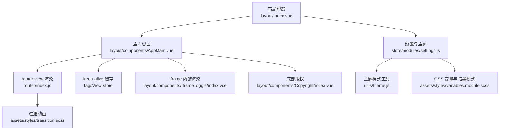
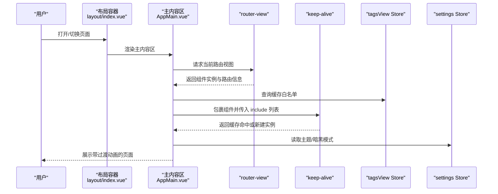
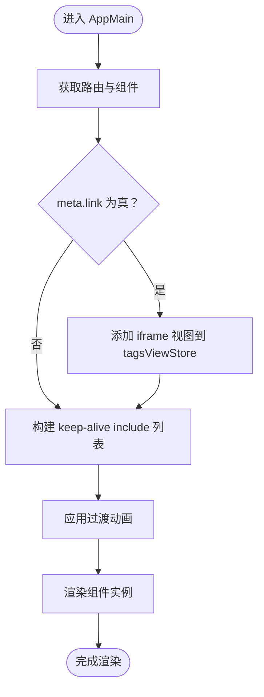
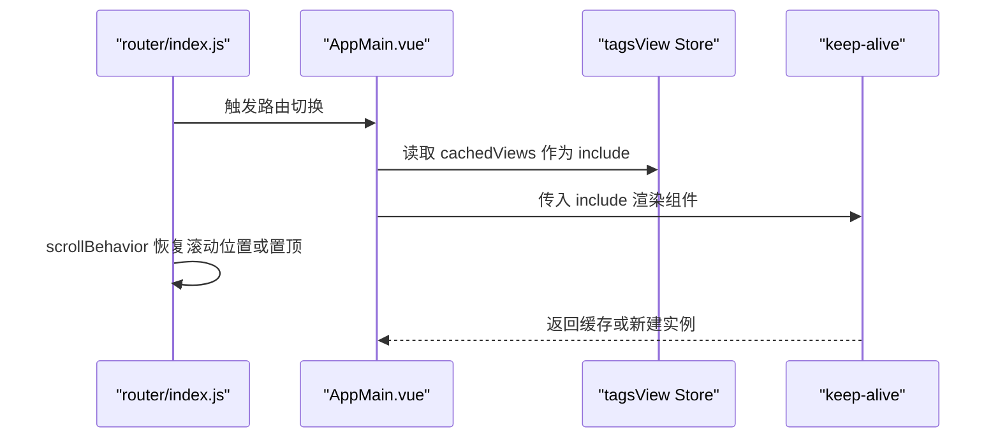
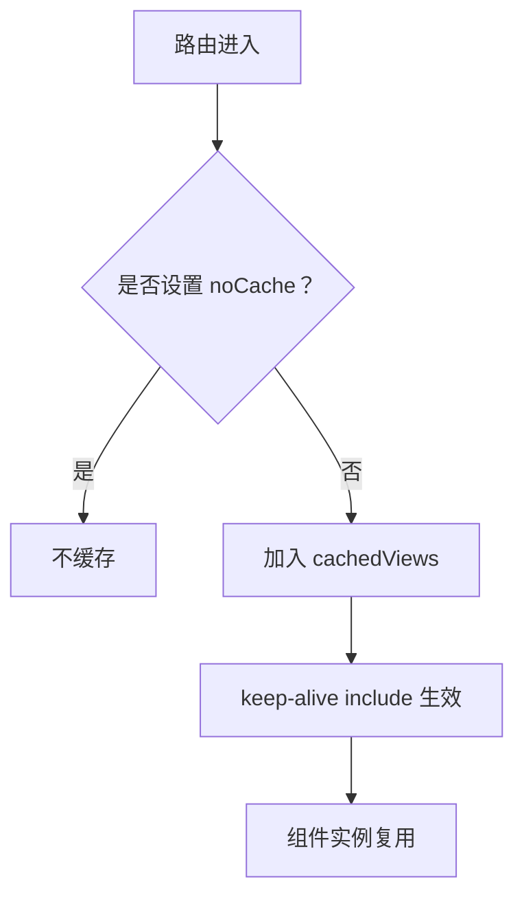
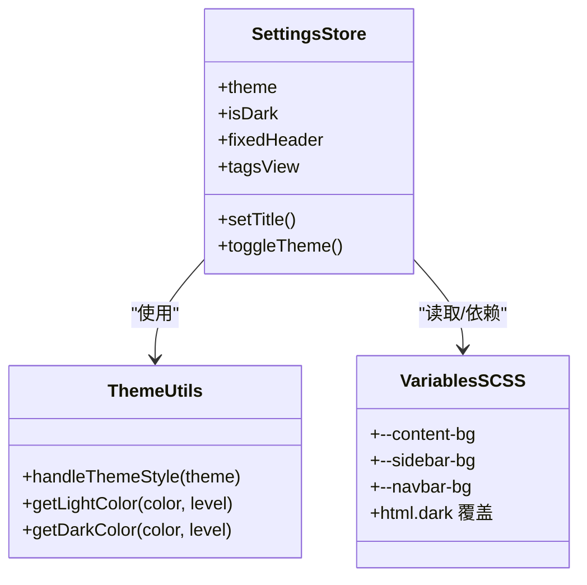
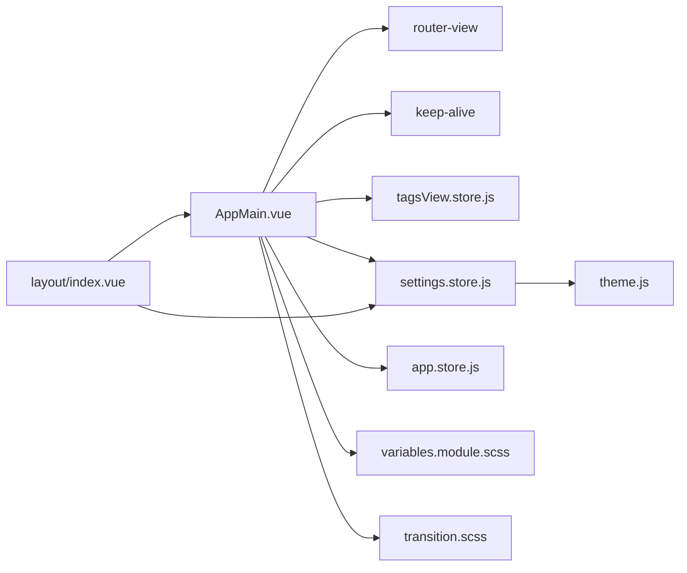

# 主内容区域

<cite>
**本文引用的文件**
- [AppMain.vue](file://antflow-vue/src/layout/components/AppMain.vue)
- [layout.index.vue](file://antflow-vue/src/layout/index.vue)
- [router.index.js](file://antflow-vue/src/router/index.js)
- [tagsView.store.js](file://antflow-vue/src/store/modules/tagsView.js)
- [app.store.js](file://antflow-vue/src/store/modules/app.js)
- [settings.store.js](file://antflow-vue/src/store/modules/settings.js)
- [settings.default.js](file://antflow-vue/src/settings.js)
- [variables.module.scss](file://antflow-vue/src/assets/styles/variables.module.scss)
- [transition.scss](file://antflow-vue/src/assets/styles/transition.scss)
- [index.scss](file://antflow-vue/src/assets/styles/index.scss)
- [main.js](file://antflow-vue/src/main.js)
- [IframeToggle.index.vue](file://antflow-vue/src/layout/components/IframeToggle/index.vue)
- [InnerLink.index.vue](file://antflow-vue/src/layout/components/InnerLink/index.vue)
- [Copyright.index.vue](file://antflow-vue/src/layout/components/Copyright/index.vue)
- [theme.js](file://antflow-vue/src/utils/theme.js)
</cite>

## 目录
1. [简介](#简介)
2. [项目结构](#项目结构)
3. [核心组件](#核心组件)
4. [架构总览](#架构总览)
5. [详细组件分析](#详细组件分析)
6. [依赖关系分析](#依赖关系分析)
7. [性能考量](#性能考量)
8. [故障排查指南](#故障排查指南)
9. [结论](#结论)
10. [附录](#附录)

## 简介
本章节聚焦于 AntFlow 前端工程中的“主内容区域”，系统性阐述 AppMain 组件的核心职责、路由视图渲染机制、页面过渡动画、布局与响应式策略、滚动行为控制、页面缓存与 keep-alive、组件生命周期管理、样式系统与主题/暗黑模式、性能优化与懒加载、错误边界处理，以及定制化开发与特殊页面布局、动画效果实现的实践建议。

## 项目结构
主内容区域位于布局层，由顶层布局容器负责设备/侧边栏/标签页等上下文状态，AppMain 作为核心渲染区承载路由视图，并通过 keep-alive 实现页面缓存与复用；同时配合 tagsView 缓存列表、滚动位置恢复、暗黑模式与主题切换、自定义滚动条等能力，形成完整的页面渲染与交互体验闭环。

**图表来源**
- [layout.index.vue:1-142](file://antflow-vue/src/layout/index.vue#L1-L142)
- [AppMain.vue:1-90](file://antflow-vue/src/layout/components/AppMain.vue#L1-L90)
- [router.index.js:1-339](file://antflow-vue/src/router/index.js#L1-L339)
- [tagsView.store.js:1-183](file://antflow-vue/src/store/modules/tagsView.js#L1-L183)
- [IframeToggle.index.vue:1-26](file://antflow-vue/src/layout/components/IframeToggle/index.vue#L1-L26)
- [Copyright.index.vue:1-31](file://antflow-vue/src/layout/components/Copyright/index.vue#L1-L31)
- [settings.store.js:1-81](file://antflow-vue/src/store/modules/settings.js#L1-L81)
- [variables.module.scss:1-226](file://antflow-vue/src/assets/styles/variables.module.scss#L1-L226)
- [transition.scss:1-50](file://antflow-vue/src/assets/styles/transition.scss#L1-L50)

**章节来源**
- [layout.index.vue:1-142](file://antflow-vue/src/layout/index.vue#L1-L142)
- [AppMain.vue:1-90](file://antflow-vue/src/layout/components/AppMain.vue#L1-L90)
- [router.index.js:1-339](file://antflow-vue/src/router/index.js#L1-L339)

## 核心组件
- AppMain：负责路由视图渲染、过渡动画、keep-alive 缓存、iframe 内链注入与版权区定位。
- 布局容器：根据设备/侧边栏状态计算布局类名，控制固定头部宽度与侧边栏遮挡。
- tagsView Store：维护已访问页、缓存页集合、iframe 内链页，支撑 keep-alive include 与标签页联动。
- settings Store：主题色、暗黑模式、固定头部、标签页开关等全局布局配置。
- 过渡与样式：全局过渡类、CSS 变量与暗黑模式覆盖、自定义滚动条。

**章节来源**
- [AppMain.vue:1-90](file://antflow-vue/src/layout/components/AppMain.vue#L1-L90)
- [layout.index.vue:1-142](file://antflow-vue/src/layout/index.vue#L1-L142)
- [tagsView.store.js:1-183](file://antflow-vue/src/store/modules/tagsView.js#L1-L183)
- [settings.store.js:1-81](file://antflow-vue/src/store/modules/settings.js#L1-L81)
- [variables.module.scss:1-226](file://antflow-vue/src/assets/styles/variables.module.scss#L1-L226)
- [transition.scss:1-50](file://antflow-vue/src/assets/styles/transition.scss#L1-L50)

## 架构总览
主内容区域采用“布局容器 + 主内容区 + 路由视图”的分层结构。布局容器负责响应式与设备切换、侧边栏开合、固定头部宽度计算；主内容区负责按路由渲染、过渡动画、keep-alive 缓存、iframe 内链与版权区定位；tagsView Store 提供缓存白名单与标签页联动；settings Store 提供主题与暗黑模式；样式系统通过 CSS 变量与暗黑选择器实现主题切换与暗黑覆盖。

**图表来源**
- [layout.index.vue:1-142](file://antflow-vue/src/layout/index.vue#L1-L142)
- [AppMain.vue:1-90](file://antflow-vue/src/layout/components/AppMain.vue#L1-L90)
- [router.index.js:1-339](file://antflow-vue/src/router/index.js#L1-L339)
- [tagsView.store.js:1-183](file://antflow-vue/src/store/modules/tagsView.js#L1-L183)
- [settings.store.js:1-81](file://antflow-vue/src/store/modules/settings.js#L1-L81)

## 详细组件分析

### AppMain 组件分析
- 路由视图渲染：通过 router-view 插槽获取组件与路由信息，结合路由 meta.link 决定是否注入 iframe 内链。
- 过渡动画：使用 transition 组件包裹，内置“淡入淡出 + 水平位移”的过渡类，mode="out-in" 确保切换过程不重叠。
- keep-alive 缓存：include 来自 tagsViewStore.cachedViews，仅对未标记 noCache 的路由进行缓存。
- 生命周期与副作用：onMounted/watchEffect 中调用 addIframe，当路由 meta.link 为真时向 tagsViewStore 添加 iframe 视图。
- 布局与滚动：通过 CSS 变量与类名组合，动态调整最小高度、固定头部内边距、标签页存在时的高度补偿；自定义滚动条宽度与颜色。
- 版权区定位：当存在版权组件时，为内容区增加底部内边距以避免遮挡。

**图表来源**
- [AppMain.vue:1-90](file://antflow-vue/src/layout/components/AppMain.vue#L1-L90)
- [tagsView.store.js:1-183](file://antflow-vue/src/store/modules/tagsView.js#L1-L183)

**章节来源**
- [AppMain.vue:1-90](file://antflow-vue/src/layout/components/AppMain.vue#L1-L90)

### 路由视图渲染机制
- 路由配置：constantRoutes/dynamicRoutes 定义公共与权限路由，meta 字段控制缓存、标题、图标、面包屑、激活菜单等。
- 滚动行为：scrollBehavior 在路由切换时优先恢复历史滚动位置，否则滚动至顶部。
- 页面标识：路由 name 必填，用于 keep-alive include 匹配与标签页标题展示。

**图表来源**
- [router.index.js:1-339](file://antflow-vue/src/router/index.js#L1-L339)
- [AppMain.vue:1-90](file://antflow-vue/src/layout/components/AppMain.vue#L1-L90)
- [tagsView.store.js:1-183](file://antflow-vue/src/store/modules/tagsView.js#L1-L183)

**章节来源**
- [router.index.js:1-339](file://antflow-vue/src/router/index.js#L1-L339)

### 页面过渡动画实现
- 过渡类：fade、fade-transform、breadcrumb 等，分别控制透明度与位移变化。
- 切换模式：mode="out-in" 确保先离开再进入，避免重叠闪烁。
- 动画时长与缓动：通过 CSS 变量与 transition-duration 控制流畅度。

**章节来源**
- [transition.scss:1-50](file://antflow-vue/src/assets/styles/transition.scss#L1-L50)
- [AppMain.vue:1-90](file://antflow-vue/src/layout/components/AppMain.vue#L1-L90)

### 布局策略与响应式适配
- 响应式断点：基于窗口宽度与 Bootstrap 响应式设计，小于阈值时切换移动端布局并关闭侧边栏。
- 固定头部宽度：根据侧边栏隐藏/显示与设备类型动态计算宽度，保证内容区不被遮挡。
- 标签页补偿：当启用标签页时，内容区最小高度与顶部内边距相应增加，确保可视区域完整。

**章节来源**
- [layout.index.vue:1-142](file://antflow-vue/src/layout/index.vue#L1-L142)

### 滚动行为控制
- 恢复滚动位置：使用路由 scrollBehavior，优先返回 savedPosition。
- 置顶策略：无历史位置时滚动至顶部，保证新页面从顶部开始阅读。
- 自定义滚动条：统一宽度、轨道与滑块颜色，提升视觉一致性。

**章节来源**
- [router.index.js:1-339](file://antflow-vue/src/router/index.js#L326-L339)
- [AppMain.vue:68-89](file://antflow-vue/src/layout/components/AppMain.vue#L68-L89)

### 页面缓存机制与 keep-alive 配置
- 缓存白名单：tagsViewStore.cachedViews 存储需要缓存的路由 name，作为 keep-alive include 的依据。
- 缓存策略：未设置 meta.noCache 的路由会被加入缓存；affix 固定标签页始终保留。
- 删除策略：支持删除当前页、其他页、左侧/右侧、全部，同步清理 iframeViews 与 cachedViews。

**图表来源**
- [tagsView.store.js:1-183](file://antflow-vue/src/store/modules/tagsView.js#L1-L183)
- [AppMain.vue:1-90](file://antflow-vue/src/layout/components/AppMain.vue#L1-L90)

**章节来源**
- [tagsView.store.js:1-183](file://antflow-vue/src/store/modules/tagsView.js#L1-L183)

### 组件生命周期管理
- onMounted/watchEffect：在主内容区挂载与路由变化时触发 addIframe，确保内链页面正确注入。
- 组件卸载：tagsViewStore 提供删除与清空缓存接口，避免内存泄漏与重复渲染。

**章节来源**
- [AppMain.vue:1-90](file://antflow-vue/src/layout/components/AppMain.vue#L1-L90)
- [tagsView.store.js:1-183](file://antflow-vue/src/store/modules/tagsView.js#L1-L183)

### 样式系统、主题适配与暗黑模式
- CSS 变量：通过 variables.module.scss 定义 --content-bg、--sidebar-bg、--navbar-bg 等，AppMain 使用 var(--content-bg) 作为背景色。
- 暗黑模式：html.dark 选择器下重定义大量组件变量，包括内容区背景、侧边栏、导航栏、标签页、表格等，实现全站暗黑覆盖。
- 主题色：settings.store.js 维护当前主题色，utils/theme.js 提供主题色变浅/变深算法，动态写入 Element Plus CSS 变量。
- 全局样式：index.scss 引入过渡、Element UI、侧边栏、按钮、RuoYi、AntFlow 样式，统一字体与排版。

**图表来源**
- [settings.store.js:1-81](file://antflow-vue/src/store/modules/settings.js#L1-L81)
- [theme.js:1-50](file://antflow-vue/src/utils/theme.js#L1-L50)
- [variables.module.scss:1-226](file://antflow-vue/src/assets/styles/variables.module.scss#L1-L226)

**章节来源**
- [settings.store.js:1-81](file://antflow-vue/src/store/modules/settings.js#L1-L81)
- [theme.js:1-50](file://antflow-vue/src/utils/theme.js#L1-L50)
- [variables.module.scss:1-226](file://antflow-vue/src/assets/styles/variables.module.scss#L1-L226)
- [index.scss:1-205](file://antflow-vue/src/assets/styles/index.scss#L1-L205)

### iframe 内链与版权区
- IframeToggle：遍历 tagsViewStore.iframeViews，按当前路由匹配显示对应 iframe，支持 query 参数拼接。
- InnerLink：iframe 容器，动态高度、加载状态提示、onload 后隐藏加载。
- Copyright：受 settingsStore.footerVisible 控制，固定在底部，与 AppMain 的底部内边距协同避免遮挡。

**章节来源**
- [IframeToggle.index.vue:1-26](file://antflow-vue/src/layout/components/IframeToggle/index.vue#L1-L26)
- [InnerLink.index.vue:1-36](file://antflow-vue/src/layout/components/InnerLink/index.vue#L1-L36)
- [Copyright.index.vue:1-31](file://antflow-vue/src/layout/components/Copyright/index.vue#L1-L31)

## 依赖关系分析
- AppMain 依赖：
  - 路由：router-view 获取组件与路由元信息。
  - Store：tagsViewStore 提供缓存白名单；settingsStore 提供主题/暗黑模式；appStore 提供设备/侧边栏状态。
  - 样式：variables.module.scss 提供 CSS 变量；transition.scss 提供过渡类。
- 布局容器与主内容区：
  - 布局容器根据设备/侧边栏状态计算类名，影响固定头部宽度与内容区最小高度。
- 主题与样式：
  - settings.store.js 与 utils/theme.js 协同生成主题色系；variables.module.scss 的 html.dark 选择器实现暗黑覆盖。

**图表来源**
- [AppMain.vue:1-90](file://antflow-vue/src/layout/components/AppMain.vue#L1-L90)
- [layout.index.vue:1-142](file://antflow-vue/src/layout/index.vue#L1-L142)
- [tagsView.store.js:1-183](file://antflow-vue/src/store/modules/tagsView.js#L1-L183)
- [settings.store.js:1-81](file://antflow-vue/src/store/modules/settings.js#L1-L81)
- [app.store.js:1-47](file://antflow-vue/src/store/modules/app.js#L1-L47)
- [variables.module.scss:1-226](file://antflow-vue/src/assets/styles/variables.module.scss#L1-L226)
- [transition.scss:1-50](file://antflow-vue/src/assets/styles/transition.scss#L1-L50)
- [theme.js:1-50](file://antflow-vue/src/utils/theme.js#L1-L50)

**章节来源**
- [AppMain.vue:1-90](file://antflow-vue/src/layout/components/AppMain.vue#L1-L90)
- [layout.index.vue:1-142](file://antflow-vue/src/layout/index.vue#L1-L142)
- [tagsView.store.js:1-183](file://antflow-vue/src/store/modules/tagsView.js#L1-L183)
- [settings.store.js:1-81](file://antflow-vue/src/store/modules/settings.js#L1-L81)
- [app.store.js:1-47](file://antflow-vue/src/store/modules/app.js#L1-L47)
- [variables.module.scss:1-226](file://antflow-vue/src/assets/styles/variables.module.scss#L1-L226)
- [transition.scss:1-50](file://antflow-vue/src/assets/styles/transition.scss#L1-L50)
- [theme.js:1-50](file://antflow-vue/src/utils/theme.js#L1-L50)

## 性能考量
- 懒加载与按需导入：路由与视图普遍采用动态导入，减少首屏体积。
- keep-alive 缓存：仅缓存必要路由，避免无限增长；结合 tagsViewStore 的删除策略清理无效缓存。
- 滚动恢复：scrollBehavior 优先恢复历史位置，减少页面抖动与重排。
- 自定义滚动条：统一滚动条样式，降低浏览器默认样式差异带来的重绘成本。
- 主题与暗黑模式：通过 CSS 变量与选择器覆盖，避免运行时样式计算开销。

[本节为通用性能建议，无需特定文件引用]

## 故障排查指南
- 页面不缓存：
  - 检查路由 meta.noCache 是否为真；确认路由 name 已正确设置。
  - 查看 tagsViewStore.cachedViews 是否包含该路由 name。
- 切换动画异常：
  - 确认 transition 名称与 transition.scss 类名一致；检查 mode="out-in" 是否生效。
- 滚动位置不恢复：
  - 确认路由是否保存了 savedPosition；检查 scrollBehavior 实现。
- 暗黑模式不生效：
  - 检查 html.dark 是否被正确添加；确认 variables.module.scss 中的覆盖规则。
- iframe 内链不显示：
  - 确认路由 meta.link 是否为真；检查 IframeToggle 是否匹配当前路由 path；确认 InnerLink onload 是否触发。

**章节来源**
- [tagsView.store.js:1-183](file://antflow-vue/src/store/modules/tagsView.js#L1-L183)
- [router.index.js:1-339](file://antflow-vue/src/router/index.js#L326-L339)
- [variables.module.scss:1-226](file://antflow-vue/src/assets/styles/variables.module.scss#L1-L226)
- [IframeToggle.index.vue:1-26](file://antflow-vue/src/layout/components/IframeToggle/index.vue#L1-L26)
- [InnerLink.index.vue:1-36](file://antflow-vue/src/layout/components/InnerLink/index.vue#L1-L36)

## 结论
主内容区域通过 AppMain 与布局容器的协作，实现了稳定、可扩展、高性能的页面渲染与交互体验。借助 keep-alive 缓存、路由滚动恢复、主题与暗黑模式、自定义滚动条与过渡动画，系统在可用性与视觉一致性方面达到良好平衡。通过合理配置路由 meta 与 tagsView 缓存策略，可进一步优化性能与用户体验。

[本节为总结性内容，无需特定文件引用]

## 附录
- 定制化开发建议：
  - 新增页面：在路由中设置 name 与 meta（含 noCache、title、icon），按需设置 affix 固定标签。
  - 特殊页面布局：通过路由 meta.link 实现 iframe 内链；通过 meta.activeMenu 高亮侧边栏。
  - 动画效果：在 transition.scss 中扩展类名，或在 AppMain 中切换不同过渡名称。
  - 错误边界：可在 AppMain 外层包裹错误边界组件，捕获子组件渲染异常并降级展示。
- 最佳实践：
  - 保持路由 name 唯一且语义明确；
  - 对频繁切换但数据稳定的页面启用缓存；
  - 使用 CSS 变量统一风格，避免硬编码颜色；
  - 移动端与桌面端差异化配置，确保在小屏设备上的可读性与可触达性。

[本节为通用指导，无需特定文件引用]