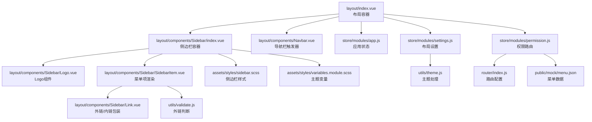
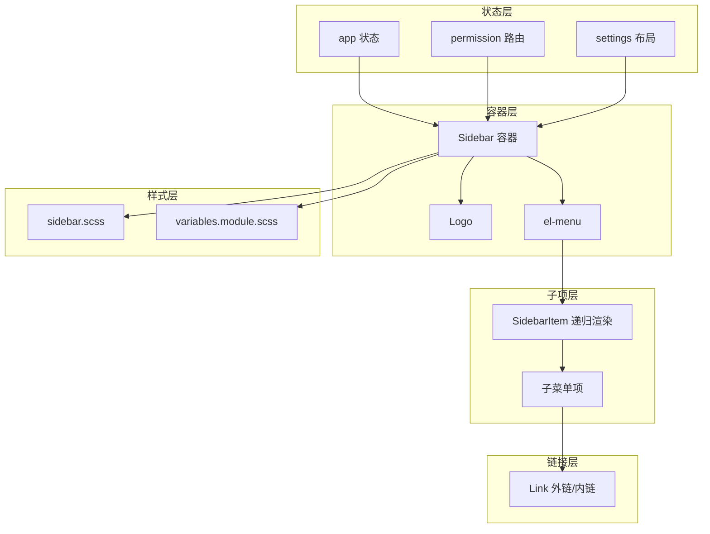
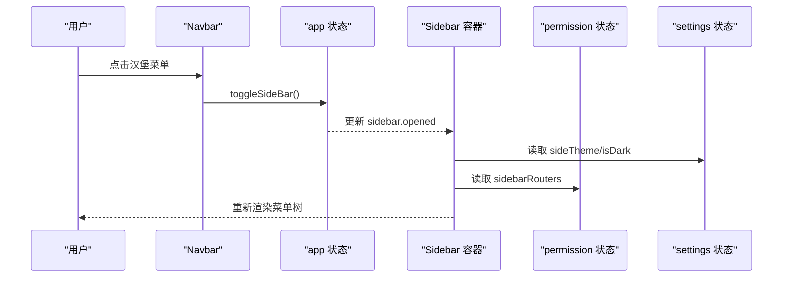
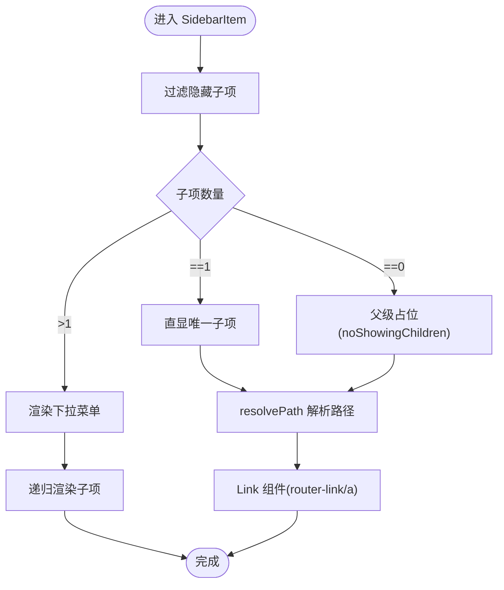
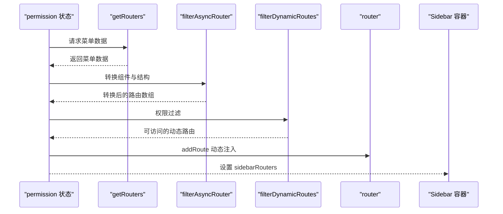
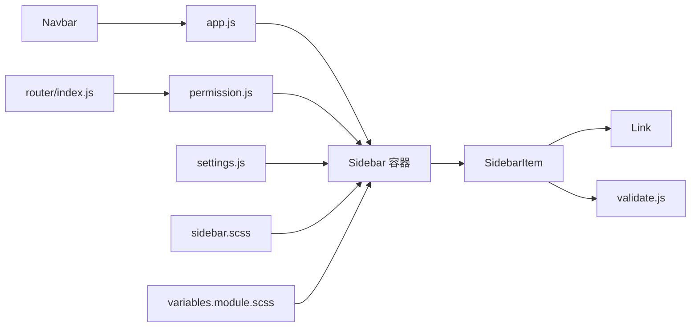

# 侧边栏导航

<cite>
**本文引用的文件**
- [layout/index.vue](file://antflow-vue/src/layout/index.vue)
- [layout/components/Sidebar/index.vue](file://antflow-vue/src/layout/components/Sidebar/index.vue)
- [layout/components/Sidebar/SidebarItem.vue](file://antflow-vue/src/layout/components/Sidebar/SidebarItem.vue)
- [layout/components/Sidebar/Logo.vue](file://antflow-vue/src/layout/components/Sidebar/Logo.vue)
- [layout/components/Sidebar/Link.vue](file://antflow-vue/src/layout/components/Sidebar/Link.vue)
- [layout/components/Navbar.vue](file://antflow-vue/src/layout/components/Navbar.vue)
- [store/modules/app.js](file://antflow-vue/src/store/modules/app.js)
- [store/modules/permission.js](file://antflow-vue/src/store/modules/permission.js)
- [store/modules/settings.js](file://antflow-vue/src/store/modules/settings.js)
- [router/index.js](file://antflow-vue/src/router/index.js)
- [assets/styles/sidebar.scss](file://antflow-vue/src/assets/styles/sidebar.scss)
- [assets/styles/variables.module.scss](file://antflow-vue/src/assets/styles/variables.module.scss)
- [utils/theme.js](file://antflow-vue/src/utils/theme.js)
- [utils/validate.js](file://antflow-vue/src/utils/validate.js)
- [public/mock/menu.json](file://antflow-vue/public/mock/menu.json)
</cite>

## 目录
1. [简介](#简介)
2. [项目结构](#项目结构)
3. [核心组件](#核心组件)
4. [架构总览](#架构总览)
5. [详细组件分析](#详细组件分析)
6. [依赖关系分析](#依赖关系分析)
7. [性能考量](#性能考量)
8. [故障排查指南](#故障排查指南)
9. [结论](#结论)
10. [附录](#附录)

## 简介
本技术文档围绕 AntFlow 前端工程中的侧边栏导航系统进行深入解析，涵盖菜单项渲染机制、层级结构处理、图标显示逻辑；详解 SidebarItem 组件的递归渲染算法、菜单激活状态管理、折叠展开动画效果；阐述 Logo 组件的设计理念、Link 组件的外链处理机制；并说明菜单权限控制、动态路由加载、菜单搜索过滤功能的实现思路与扩展方法。同时提供侧边栏样式定制、主题适配、响应式布局的实现要点与实践建议。

## 项目结构
侧边栏导航位于前端工程 antflow-vue 中，核心文件组织如下：
- 布局容器：layout/index.vue
- 侧边栏容器：layout/components/Sidebar/index.vue
- 侧边栏菜单项：layout/components/Sidebar/SidebarItem.vue
- 侧边栏 Logo：layout/components/Sidebar/Logo.vue
- 外链/内链包装：layout/components/Sidebar/Link.vue
- 导航栏触发器：layout/components/Navbar.vue
- 状态管理：
  - 应用状态 app.js（侧边栏开关、设备、尺寸）
  - 权限路由 permission.js（动态路由生成、菜单过滤）
  - 设置 settings.js（主题、侧边栏Logo、暗黑模式等）
- 样式：
  - 侧边栏样式 sidebar.scss
  - 主题变量 variables.module.scss
- 工具：
  - 主题处理 theme.js
  - 外链判断 validate.js
- 菜单数据：public/mock/menu.json

**图表来源**
- [layout/index.vue:1-142](file://antflow-vue/src/layout/index.vue#L1-L142)
- [layout/components/Sidebar/index.vue:1-94](file://antflow-vue/src/layout/components/Sidebar/index.vue#L1-L94)
- [layout/components/Sidebar/SidebarItem.vue:1-101](file://antflow-vue/src/layout/components/Sidebar/SidebarItem.vue#L1-L101)
- [layout/components/Sidebar/Logo.vue:1-97](file://antflow-vue/src/layout/components/Sidebar/Logo.vue#L1-L97)
- [layout/components/Sidebar/Link.vue:1-41](file://antflow-vue/src/layout/components/Sidebar/Link.vue#L1-L41)
- [layout/components/Navbar.vue:1-227](file://antflow-vue/src/layout/components/Navbar.vue#L1-L227)
- [store/modules/app.js:1-47](file://antflow-vue/src/store/modules/app.js#L1-L47)
- [store/modules/permission.js:1-143](file://antflow-vue/src/store/modules/permission.js#L1-L143)
- [store/modules/settings.js:1-81](file://antflow-vue/src/store/modules/settings.js#L1-L81)
- [assets/styles/sidebar.scss:1-239](file://antflow-vue/src/assets/styles/sidebar.scss#L1-L239)
- [assets/styles/variables.module.scss:1-226](file://antflow-vue/src/assets/styles/variables.module.scss#L1-L226)
- [utils/theme.js:1-50](file://antflow-vue/src/utils/theme.js#L1-L50)
- [utils/validate.js:1-115](file://antflow-vue/src/utils/validate.js#L1-L115)
- [router/index.js:1-339](file://antflow-vue/src/router/index.js#L1-L339)
- [public/mock/menu.json:1-295](file://antflow-vue/public/mock/menu.json#L1-L295)

**章节来源**
- [layout/index.vue:1-142](file://antflow-vue/src/layout/index.vue#L1-L142)
- [assets/styles/sidebar.scss:1-239](file://antflow-vue/src/assets/styles/sidebar.scss#L1-L239)

## 核心组件
- 侧边栏容器：负责渲染菜单树、绑定激活态、主题色、折叠状态，以及条件性渲染 Logo。
- 菜单项渲染：递归渲染子菜单，处理单子项直显、父级无子项占位、外链/内链跳转。
- Logo 组件：根据折叠状态切换标题/Logo 显示，适配主题色。
- Link 组件：根据目标路径是否外链选择 router-link 或 a 标签。
- 导航栏触发器：通过 Navbar 触发侧边栏开关，联动布局宽度变化。
- 状态管理：
  - app：维护侧边栏开关、设备类型、尺寸。
  - permission：从后端/模拟数据加载路由，过滤动态路由，生成侧边栏路由树。
  - settings：主题色、侧边栏Logo、暗黑模式、固定头部等布局设置。
- 样式：通过 SCSS 变量与 CSS 自定义属性实现主题适配与响应式布局。

**章节来源**
- [layout/components/Sidebar/index.vue:1-94](file://antflow-vue/src/layout/components/Sidebar/index.vue#L1-L94)
- [layout/components/Sidebar/SidebarItem.vue:1-101](file://antflow-vue/src/layout/components/Sidebar/SidebarItem.vue#L1-L101)
- [layout/components/Sidebar/Logo.vue:1-97](file://antflow-vue/src/layout/components/Sidebar/Logo.vue#L1-L97)
- [layout/components/Sidebar/Link.vue:1-41](file://antflow-vue/src/layout/components/Sidebar/Link.vue#L1-L41)
- [layout/components/Navbar.vue:1-227](file://antflow-vue/src/layout/components/Navbar.vue#L1-L227)
- [store/modules/app.js:1-47](file://antflow-vue/src/store/modules/app.js#L1-L47)
- [store/modules/permission.js:1-143](file://antflow-vue/src/store/modules/permission.js#L1-L143)
- [store/modules/settings.js:1-81](file://antflow-vue/src/store/modules/settings.js#L1-L81)
- [assets/styles/sidebar.scss:1-239](file://antflow-vue/src/assets/styles/sidebar.scss#L1-L239)
- [assets/styles/variables.module.scss:1-226](file://antflow-vue/src/assets/styles/variables.module.scss#L1-L226)

## 架构总览
侧边栏导航系统采用“容器-子项-链接-状态”的分层架构：
- 容器层：Sidebar 容器聚合 Logo、滚动条、菜单树。
- 子项层：SidebarItem 递归渲染，按规则决定直显或下拉。
- 链接层：Link 组件根据外链/内链动态选择渲染标签。
- 状态层：app/permission/settings 三者协作，驱动菜单生成、激活态与主题。
- 样式层：SCSS 变量与 CSS 自定义属性统一主题与响应式行为。

**图表来源**
- [layout/components/Sidebar/index.vue:1-94](file://antflow-vue/src/layout/components/Sidebar/index.vue#L1-L94)
- [layout/components/Sidebar/SidebarItem.vue:1-101](file://antflow-vue/src/layout/components/Sidebar/SidebarItem.vue#L1-L101)
- [layout/components/Sidebar/Link.vue:1-41](file://antflow-vue/src/layout/components/Sidebar/Link.vue#L1-L41)
- [store/modules/app.js:1-47](file://antflow-vue/src/store/modules/app.js#L1-L47)
- [store/modules/permission.js:1-143](file://antflow-vue/src/store/modules/permission.js#L1-L143)
- [store/modules/settings.js:1-81](file://antflow-vue/src/store/modules/settings.js#L1-L81)
- [assets/styles/sidebar.scss:1-239](file://antflow-vue/src/assets/styles/sidebar.scss#L1-L239)
- [assets/styles/variables.module.scss:1-226](file://antflow-vue/src/assets/styles/variables.module.scss#L1-L226)

## 详细组件分析

### Sidebar 容器组件
- 职责
  - 渲染 Logo（可选）、滚动容器、菜单树。
  - 绑定菜单主题色、文字色、激活态、折叠状态。
  - 读取权限路由集合，作为菜单树的数据源。
- 关键点
  - 菜单背景色与文字色根据 settings 的 isDark 与 sideTheme 切换。
  - 折叠状态由 app.sidebar.opened 的布尔取反决定。
  - 激活态优先使用路由 meta.activeMenu，否则使用当前路由 path。
  - 支持关闭过渡动画（withoutAnimation）以避免折叠动画闪烁。

**图表来源**
- [layout/components/Navbar.vue:75-77](file://antflow-vue/src/layout/components/Navbar.vue#L75-L77)
- [store/modules/app.js:16-27](file://antflow-vue/src/store/modules/app.js#L16-L27)
- [layout/components/Sidebar/index.vue:28-56](file://antflow-vue/src/layout/components/Sidebar/index.vue#L28-L56)
- [store/modules/permission.js:20-32](file://antflow-vue/src/store/modules/permission.js#L20-L32)
- [store/modules/settings.js:26-56](file://antflow-vue/src/store/modules/settings.js#L26-L56)

**章节来源**
- [layout/components/Sidebar/index.vue:1-94](file://antflow-vue/src/layout/components/Sidebar/index.vue#L1-L94)
- [store/modules/app.js:1-47](file://antflow-vue/src/store/modules/app.js#L1-L47)
- [store/modules/permission.js:1-143](file://antflow-vue/src/store/modules/permission.js#L1-L143)
- [store/modules/settings.js:1-81](file://antflow-vue/src/store/modules/settings.js#L1-L81)

### SidebarItem 递归渲染算法
- 单子项直显策略
  - 若仅有一个可见子项且父级未设置 alwaysShow，则默认直显该子项，父级标题仅作占位。
- 父级无子项处理
  - 若子项均隐藏，保留父级占位并标记 noShowingChildren，确保父级可点击。
- 递归渲染
  - 对每个子项递归调用自身，传递 base-path 与 isNest 标记。
- 外链/内链解析
  - resolvePath 依据 isExternal 判断，外链直接返回，内链拼接 basePath 与 routePath，并支持 query 参数。
- 图标与标题
  - 使用 svg-icon 组件，标题溢出省略，长标题支持 title 提示。

**图表来源**
- [layout/components/Sidebar/SidebarItem.vue:53-77](file://antflow-vue/src/layout/components/Sidebar/SidebarItem.vue#L53-L77)
- [layout/components/Sidebar/SidebarItem.vue:79-91](file://antflow-vue/src/layout/components/Sidebar/SidebarItem.vue#L79-L91)
- [utils/validate.js:39-41](file://antflow-vue/src/utils/validate.js#L39-L41)
- [layout/components/Sidebar/Link.vue:17-39](file://antflow-vue/src/layout/components/Sidebar/Link.vue#L17-L39)

**章节来源**
- [layout/components/Sidebar/SidebarItem.vue:1-101](file://antflow-vue/src/layout/components/Sidebar/SidebarItem.vue#L1-L101)
- [utils/validate.js:1-115](file://antflow-vue/src/utils/validate.js#L1-L115)
- [layout/components/Sidebar/Link.vue:1-41](file://antflow-vue/src/layout/components/Sidebar/Link.vue#L1-L41)

### Logo 组件设计理念
- 折叠切换
  - 折叠状态下仅显示 Logo 或标题，展开时显示完整标识。
- 主题适配
  - 背景色与文字色根据 isDark 与 sideTheme 动态计算，保证在不同主题下可读性。
- 过渡动画
  - 使用 transition 实现淡入淡出，提升交互体验。

**章节来源**
- [layout/components/Sidebar/Logo.vue:1-97](file://antflow-vue/src/layout/components/Sidebar/Logo.vue#L1-L97)
- [store/modules/settings.js:26-56](file://antflow-vue/src/store/modules/settings.js#L26-L56)

### Link 组件外链处理机制
- 判断逻辑
  - isExternal 使用正则匹配 http/https/mailto/tel，识别外链。
- 渲染策略
  - 外链：渲染 a 标签并设置 target="_blank" 与 rel="noopener"。
  - 内链：渲染 router-link，支持带查询参数的对象路径。
- 适用范围
  - SidebarItem 的直显菜单项与下拉菜单项均通过 AppLink（即 Link）包裹。

**章节来源**
- [layout/components/Sidebar/Link.vue:1-41](file://antflow-vue/src/layout/components/Sidebar/Link.vue#L1-L41)
- [utils/validate.js:39-41](file://antflow-vue/src/utils/validate.js#L39-L41)

### 菜单激活状态管理
- 优先级
  - meta.activeMenu 存在时，以 activeMenu 为准高亮。
  - 否则以当前路由 path 高亮。
- 作用域
  - 仅影响当前路由对应的菜单项或其父级高亮，不改变导航行为。

**章节来源**
- [layout/components/Sidebar/index.vue:50-56](file://antflow-vue/src/layout/components/Sidebar/index.vue#L50-L56)

### 折叠展开动画效果
- 触发方式
  - Navbar 汉堡菜单点击 -> app.toggleSideBar -> 更新 sidebar.opened。
- 动画表现
  - 侧边栏宽度与主内容区 margin-left 平滑过渡。
  - 移动端采用 transform 平移，关闭时禁用交互。
- 状态持久化
  - 通过 Cookie 保存侧边栏开关状态，刷新后恢复。

**章节来源**
- [layout/components/Navbar.vue:75-77](file://antflow-vue/src/layout/components/Navbar.vue#L75-L77)
- [store/modules/app.js:16-27](file://antflow-vue/src/store/modules/app.js#L16-L27)
- [assets/styles/sidebar.scss:175-201](file://antflow-vue/src/assets/styles/sidebar.scss#L175-L201)

### 菜单权限控制与动态路由加载
- 数据来源
  - permission.generateRoutes 调用 getRouters 获取菜单数据（mock），并复制三份用于不同用途。
- 路由转换
  - filterAsyncRouter 将字符串组件名映射为真实组件，处理 Layout/ParentView/InnerLink 特殊组件。
  - filterChildren 展平嵌套路由，修正子路由 path。
- 权限过滤
  - filterDynamicRoutes 根据路由 permissions/roles 与 auth.hasPermiOr/hasRoleOr 判断是否加入菜单。
- 路由注入
  - 将动态路由逐条 addRoute 注入，形成最终路由表。
- 侧边栏路由树
  - 生成 sidebarRouters 供 Sidebar 容器渲染。

**图表来源**
- [store/modules/permission.js:33-54](file://antflow-vue/src/store/modules/permission.js#L33-L54)
- [store/modules/permission.js:59-84](file://antflow-vue/src/store/modules/permission.js#L59-L84)
- [store/modules/permission.js:115-129](file://antflow-vue/src/store/modules/permission.js#L115-L129)
- [router/index.js:28-93](file://antflow-vue/src/router/index.js#L28-L93)
- [public/mock/menu.json:1-295](file://antflow-vue/public/mock/menu.json#L1-L295)

**章节来源**
- [store/modules/permission.js:1-143](file://antflow-vue/src/store/modules/permission.js#L1-L143)
- [router/index.js:1-339](file://antflow-vue/src/router/index.js#L1-L339)
- [public/mock/menu.json:1-295](file://antflow-vue/public/mock/menu.json#L1-L295)

### 菜单搜索过滤功能
- 实现思路
  - 在 SidebarItem 上游增加搜索输入框，对菜单标题进行模糊匹配。
  - 使用 computed 与 watchEffect 监听搜索词，动态过滤 sidebarRouters。
  - 过滤时需保持父子关系完整性，避免孤立子项。
- 扩展建议
  - 将搜索词写入 settings 或 app 状态，便于跨组件共享。
  - 结合 keep-alive 与缓存策略，避免频繁重渲染。

[本节为概念性说明，不直接分析具体文件，故无“章节来源”]

### 侧边栏样式定制、主题适配与响应式布局
- 主题适配
  - variables.module.scss 定义亮/暗两套 CSS 自定义变量，Sidebar 与 Logo 动态读取。
  - settings.toggleTheme 切换 isDark，Sidebar 与 Logo 自动切换主题色。
  - utils/theme.js 提供主题色系计算，配合 Element Plus 主题变量。
- 样式定制
  - sidebar.scss 控制侧边栏宽度、折叠态、移动端 transform、滚动条样式。
  - 通过 SCSS 变量统一字体、间距、阴影等视觉规范。
- 响应式布局
  - layout/index.vue 监听窗口宽度，移动端强制关闭侧边栏并禁用过渡。
  - 侧边栏宽度与主内容区 margin-left 随设备变化自动调整。

**章节来源**
- [assets/styles/variables.module.scss:68-226](file://antflow-vue/src/assets/styles/variables.module.scss#L68-L226)
- [layout/components/Sidebar/index.vue:34-48](file://antflow-vue/src/layout/components/Sidebar/index.vue#L34-L48)
- [layout/components/Sidebar/Logo.vue:32-46](file://antflow-vue/src/layout/components/Sidebar/Logo.vue#L32-L46)
- [store/modules/settings.js:72-76](file://antflow-vue/src/store/modules/settings.js#L72-L76)
- [utils/theme.js:1-50](file://antflow-vue/src/utils/theme.js#L1-L50)
- [assets/styles/sidebar.scss:1-239](file://antflow-vue/src/assets/styles/sidebar.scss#L1-L239)
- [layout/index.vue:39-55](file://antflow-vue/src/layout/index.vue#L39-L55)

## 依赖关系分析
- 组件耦合
  - Sidebar 依赖 permission.sidebarRouters、settings.sideTheme、app.sidebar.opened。
  - SidebarItem 依赖 Link 组件与 validate 工具，递归依赖自身。
  - Navbar 依赖 app.toggleSideBar，间接影响 Sidebar。
- 外部依赖
  - Element Plus 的 el-menu、el-sub-menu、el-scrollbar。
  - Vue Router 的路由注册与导航。
- 潜在风险
  - 菜单数据结构变更可能影响 filterAsyncRouter 与 filterChildren。
  - 外链正则匹配需随业务扩展更新。

**图表来源**
- [store/modules/app.js:1-47](file://antflow-vue/src/store/modules/app.js#L1-L47)
- [store/modules/permission.js:1-143](file://antflow-vue/src/store/modules/permission.js#L1-L143)
- [store/modules/settings.js:1-81](file://antflow-vue/src/store/modules/settings.js#L1-L81)
- [layout/components/Sidebar/index.vue:1-94](file://antflow-vue/src/layout/components/Sidebar/index.vue#L1-L94)
- [layout/components/Sidebar/SidebarItem.vue:1-101](file://antflow-vue/src/layout/components/Sidebar/SidebarItem.vue#L1-L101)
- [layout/components/Sidebar/Link.vue:1-41](file://antflow-vue/src/layout/components/Sidebar/Link.vue#L1-L41)
- [utils/validate.js:1-115](file://antflow-vue/src/utils/validate.js#L1-L115)
- [layout/components/Navbar.vue:1-227](file://antflow-vue/src/layout/components/Navbar.vue#L1-L227)
- [router/index.js:1-339](file://antflow-vue/src/router/index.js#L1-L339)
- [assets/styles/sidebar.scss:1-239](file://antflow-vue/src/assets/styles/sidebar.scss#L1-L239)
- [assets/styles/variables.module.scss:1-226](file://antflow-vue/src/assets/styles/variables.module.scss#L1-L226)

**章节来源**
- [store/modules/app.js:1-47](file://antflow-vue/src/store/modules/app.js#L1-L47)
- [store/modules/permission.js:1-143](file://antflow-vue/src/store/modules/permission.js#L1-L143)
- [store/modules/settings.js:1-81](file://antflow-vue/src/store/modules/settings.js#L1-L81)
- [layout/components/Sidebar/index.vue:1-94](file://antflow-vue/src/layout/components/Sidebar/index.vue#L1-L94)
- [layout/components/Sidebar/SidebarItem.vue:1-101](file://antflow-vue/src/layout/components/Sidebar/SidebarItem.vue#L1-L101)
- [layout/components/Sidebar/Link.vue:1-41](file://antflow-vue/src/layout/components/Sidebar/Link.vue#L1-L41)
- [utils/validate.js:1-115](file://antflow-vue/src/utils/validate.js#L1-L115)
- [layout/components/Navbar.vue:1-227](file://antflow-vue/src/layout/components/Navbar.vue#L1-L227)
- [router/index.js:1-339](file://antflow-vue/src/router/index.js#L1-L339)
- [assets/styles/sidebar.scss:1-239](file://antflow-vue/src/assets/styles/sidebar.scss#L1-L239)
- [assets/styles/variables.module.scss:1-226](file://antflow-vue/src/assets/styles/variables.module.scss#L1-L226)

## 性能考量
- 渲染优化
  - SidebarItem 仅渲染 visible 子项，隐藏项不参与 DOM。
  - 折叠时通过 CSS 隐藏文本与图标，减少布局抖动。
- 路由加载
  - 动态路由仅在登录后按权限加载，避免一次性注入过多路由。
- 样式性能
  - 使用 CSS 自定义属性与 SCSS 变量，减少重复计算。
  - 移动端 transform 替代 position 变更，降低重排成本。

[本节为通用性能建议，不直接分析具体文件，故无“章节来源”]

## 故障排查指南
- 菜单不显示
  - 检查 permission.generateRoutes 是否正确返回数据，确认 filterAsyncRouter 与 filterChildren 未误删子项。
  - 确认路由 permissions/roles 与当前用户权限匹配。
- 外链无法打开
  - 检查 isExternal 正则是否覆盖业务外链格式。
  - 确认 Link 组件的 a 标签属性（target/rel）是否正确。
- 折叠异常
  - 检查 app.sidebar.opened 状态与 Cookie 是否同步。
  - 确认 sidebar.scss 的折叠类名与 transform 规则生效。
- 主题错乱
  - 检查 settings.isDark 与 CSS 自定义变量是否一致。
  - 确认 variables.module.scss 的主题变量导出与 sidebar.scss 的读取。

**章节来源**
- [store/modules/permission.js:33-54](file://antflow-vue/src/store/modules/permission.js#L33-L54)
- [utils/validate.js:39-41](file://antflow-vue/src/utils/validate.js#L39-L41)
- [layout/components/Sidebar/Link.vue:17-39](file://antflow-vue/src/layout/components/Sidebar/Link.vue#L17-L39)
- [store/modules/app.js:16-27](file://antflow-vue/src/store/modules/app.js#L16-L27)
- [assets/styles/sidebar.scss:175-201](file://antflow-vue/src/assets/styles/sidebar.scss#L175-L201)
- [store/modules/settings.js:72-76](file://antflow-vue/src/store/modules/settings.js#L72-L76)
- [assets/styles/variables.module.scss:68-226](file://antflow-vue/src/assets/styles/variables.module.scss#L68-L226)

## 结论
侧边栏导航系统通过清晰的分层设计与完善的权限、主题、响应式机制，实现了灵活可扩展的菜单体系。SidebarItem 的递归渲染算法与外链/内链处理保障了复杂层级与多场景导航需求；结合动态路由与菜单过滤，满足不同角色的访问控制；样式层的变量与 CSS 自定义属性提供了良好的主题适配与性能表现。建议在扩展时遵循现有结构与命名约定，确保一致性与可维护性。

[本节为总结性内容，不直接分析具体文件，故无“章节来源”]

## 附录

### 菜单配置示例（字段说明）
- path：路由路径，支持绝对与相对。
- component：组件名或特殊组件（Layout/ParentView/InnerLink）。
- meta：菜单元信息
  - title：菜单标题
  - icon：图标名称
  - activeMenu：高亮定位的目标路由
  - noCache：是否缓存
  - link：外链地址（可选）
- children：子菜单
- alwaysShow：是否总是显示根菜单
- hidden：是否在侧边栏隐藏
- permissions/roles：权限标识

**章节来源**
- [router/index.js:18-25](file://antflow-vue/src/router/index.js#L18-L25)
- [public/mock/menu.json:15-21](file://antflow-vue/public/mock/menu.json#L15-L21)

### 扩展开发指南
- 新增菜单
  - 在菜单数据中添加路由配置，确保 component 与 meta 字段完整。
  - 若为外链，设置 meta.link 并确认 isExternal 能正确识别。
- 自定义图标
  - 在 assets/icons/svg 中添加 SVG 文件，使用 meta.icon 指向文件名。
- 动态路由
  - 在 permission.generateRoutes 中处理后端返回的路由字符串，映射到真实组件。
- 主题定制
  - 在 variables.module.scss 中修改主题变量，或通过 settings.changeSetting 动态切换。
- 响应式增强
  - 在 sidebar.scss 中扩展移动端样式，或在 layout/index.vue 中完善断点逻辑。

**章节来源**
- [public/mock/menu.json:1-295](file://antflow-vue/public/mock/menu.json#L1-L295)
- [store/modules/permission.js:59-84](file://antflow-vue/src/store/modules/permission.js#L59-L84)
- [assets/styles/variables.module.scss:68-226](file://antflow-vue/src/assets/styles/variables.module.scss#L68-L226)
- [assets/styles/sidebar.scss:175-201](file://antflow-vue/src/assets/styles/sidebar.scss#L175-L201)