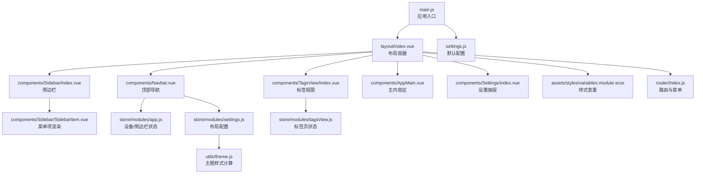
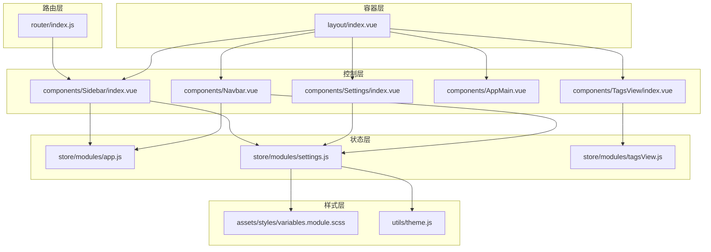
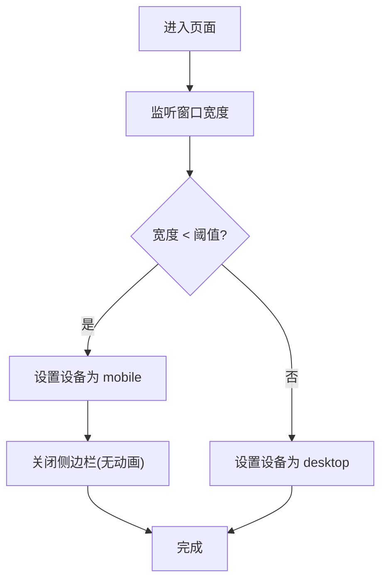
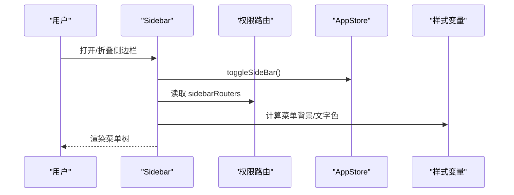
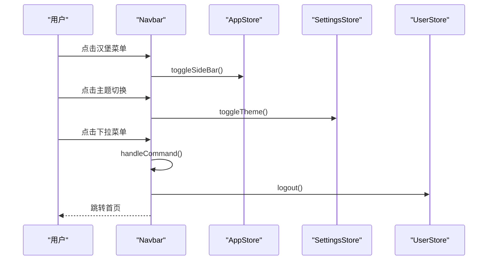
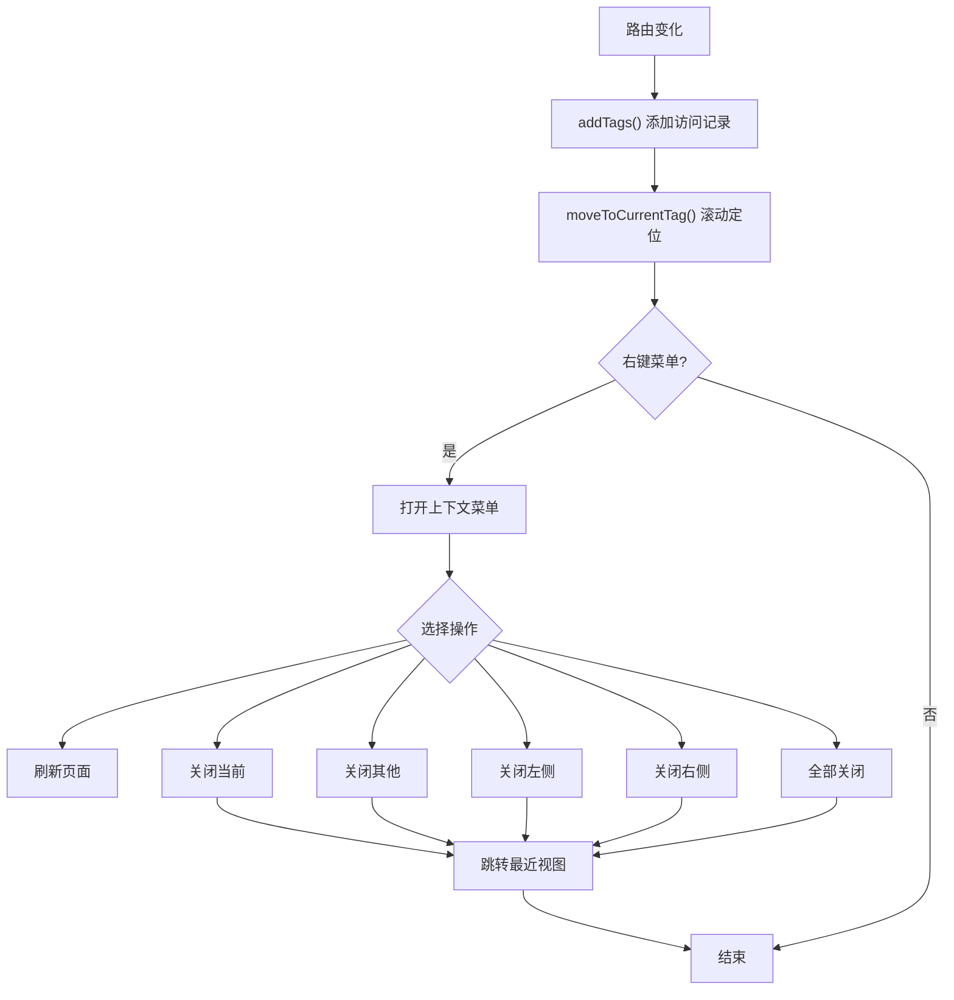
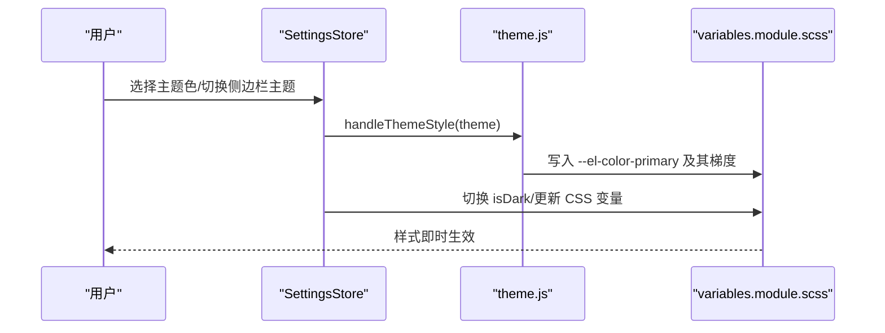
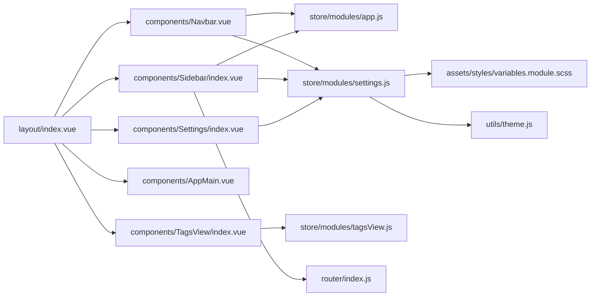

# 布局系统

<cite>
**本文引用的文件**
- [layout/index.vue](file://antflow-vue/src/layout/index.vue)
- [layout/components/Sidebar/index.vue](file://antflow-vue/src/layout/components/Sidebar/index.vue)
- [layout/components/Navbar.vue](file://antflow-vue/src/layout/components/Navbar.vue)
- [layout/components/TagsView/index.vue](file://antflow-vue/src/layout/components/TagsView/index.vue)
- [layout/components/AppMain.vue](file://antflow-vue/src/layout/components/AppMain.vue)
- [layout/components/Settings/index.vue](file://antflow-vue/src/layout/components/Settings/index.vue)
- [layout/components/Sidebar/SidebarItem.vue](file://antflow-vue/src/layout/components/Sidebar/SidebarItem.vue)
- [store/modules/app.js](file://antflow-vue/src/store/modules/app.js)
- [store/modules/settings.js](file://antflow-vue/src/store/modules/settings.js)
- [store/modules/tagsView.js](file://antflow-vue/src/store/modules/tagsView.js)
- [assets/styles/variables.module.scss](file://antflow-vue/src/assets/styles/variables.module.scss)
- [utils/theme.js](file://antflow-vue/src/utils/theme.js)
- [settings.js](file://antflow-vue/src/settings.js)
- [main.js](file://antflow-vue/src/main.js)
- [router/index.js](file://antflow-vue/src/router/index.js)
</cite>

## 目录
1. [简介](#简介)
2. [项目结构](#项目结构)
3. [核心组件](#核心组件)
4. [架构总览](#架构总览)
5. [组件详解](#组件详解)
6. [依赖关系分析](#依赖关系分析)
7. [性能考量](#性能考量)
8. [故障排查指南](#故障排查指南)
9. [结论](#结论)
10. [附录](#附录)

## 简介
本布局系统围绕响应式设计、侧边栏导航、顶部导航栏、标签视图、主题切换与设备自适应展开，采用 Vue 3 + Element Plus + Pinia 架构，结合 SCSS 变量与 CSS 变量实现主题与样式的统一管理。系统通过路由元信息驱动菜单生成，利用状态管理实现布局配置持久化与跨组件状态同步，并提供可扩展的设置抽屉以支持运行时布局调整。

## 项目结构
布局系统主要位于前端工程 antflow-vue 中，核心文件组织如下：
- 布局容器：layout/index.vue
- 子组件：Sidebar、Navbar、TagsView、AppMain、Settings
- 状态管理：store/modules/app.js、settings.js、tagsView.js
- 样式系统：assets/styles/variables.module.scss
- 主题工具：utils/theme.js
- 全局配置：settings.js
- 应用入口：main.js
- 路由：router/index.js

图表来源
- [layout/index.vue:1-142](file://antflow-vue/src/layout/index.vue#L1-L142)
- [layout/components/Sidebar/index.vue:1-94](file://antflow-vue/src/layout/components/Sidebar/index.vue#L1-L94)
- [layout/components/Navbar.vue:1-227](file://antflow-vue/src/layout/components/Navbar.vue#L1-L227)
- [layout/components/TagsView/index.vue:1-371](file://antflow-vue/src/layout/components/TagsView/index.vue#L1-L371)
- [layout/components/AppMain.vue:1-90](file://antflow-vue/src/layout/components/AppMain.vue#L1-L90)
- [layout/components/Settings/index.vue:1-225](file://antflow-vue/src/layout/components/Settings/index.vue#L1-L225)
- [layout/components/Sidebar/SidebarItem.vue:1-101](file://antflow-vue/src/layout/components/Sidebar/SidebarItem.vue#L1-L101)
- [store/modules/app.js:1-47](file://antflow-vue/src/store/modules/app.js#L1-L47)
- [store/modules/settings.js:1-81](file://antflow-vue/src/store/modules/settings.js#L1-L81)
- [store/modules/tagsView.js:1-183](file://antflow-vue/src/store/modules/tagsView.js#L1-L183)
- [assets/styles/variables.module.scss:1-226](file://antflow-vue/src/assets/styles/variables.module.scss#L1-L226)
- [utils/theme.js:1-50](file://antflow-vue/src/utils/theme.js#L1-L50)
- [settings.js:1-58](file://antflow-vue/src/settings.js#L1-L58)
- [main.js:1-110](file://antflow-vue/src/main.js#L1-L110)
- [router/index.js:1-339](file://antflow-vue/src/router/index.js#L1-L339)

章节来源
- [layout/index.vue:1-142](file://antflow-vue/src/layout/index.vue#L1-L142)
- [main.js:1-110](file://antflow-vue/src/main.js#L1-L110)

## 核心组件
- 布局容器：负责响应式断点判断、侧边栏开关、移动端遮罩、固定头部宽度计算、版本检测与更新提示。
- 侧边栏：根据权限路由生成菜单树，支持折叠、主题色与暗色模式下的菜单样式。
- 顶部导航：汉堡菜单、面包屑或顶部导航切换、搜索、全屏、主题切换、尺寸选择、用户下拉菜单。
- 标签视图：记录访问历史、支持刷新/关闭、右键上下文菜单、动态滚动定位。
- 主内容区：路由视图渲染、keep-alive 缓存、iframe 视图处理、版权组件。
- 设置抽屉：主题风格、布局配置项（TopNav、TagsView、固定Header、Logo、动态标题、底部版权）、保存与重置。

章节来源
- [layout/index.vue:16-94](file://antflow-vue/src/layout/index.vue#L16-L94)
- [layout/components/Sidebar/index.vue:15-57](file://antflow-vue/src/layout/components/Sidebar/index.vue#L15-L57)
- [layout/components/Navbar.vue:57-112](file://antflow-vue/src/layout/components/Navbar.vue#L57-L112)
- [layout/components/TagsView/index.vue:45-260](file://antflow-vue/src/layout/components/TagsView/index.vue#L45-L260)
- [layout/components/AppMain.vue:15-36](file://antflow-vue/src/layout/components/AppMain.vue#L15-L36)
- [layout/components/Settings/index.vue:99-168](file://antflow-vue/src/layout/components/Settings/index.vue#L99-L168)

## 架构总览
系统采用“容器-子组件-状态管理-样式系统”的分层架构：
- 容器层：layout/index.vue 统一承载布局结构与响应式逻辑。
- 控制层：Navbar/Settings 等组件通过状态管理读取与写入布局配置。
- 数据层：Pinia Store 管理设备、侧边栏、设置、标签页等状态。
- 样式层：SCSS 变量与 CSS 变量组合，支持亮/暗色主题与主题色动态切换。
- 路由层：constantRoutes/dynamicRoutes 驱动菜单生成与权限控制。

图表来源
- [layout/index.vue:16-94](file://antflow-vue/src/layout/index.vue#L16-L94)
- [layout/components/Navbar.vue:67-73](file://antflow-vue/src/layout/components/Navbar.vue#L67-L73)
- [layout/components/Settings/index.vue:106-112](file://antflow-vue/src/layout/components/Settings/index.vue#L106-L112)
- [layout/components/TagsView/index.vue:48-50](file://antflow-vue/src/layout/components/TagsView/index.vue#L48-L50)
- [layout/components/Sidebar/index.vue:19-26](file://antflow-vue/src/layout/components/Sidebar/index.vue#L19-L26)
- [store/modules/app.js:3-14](file://antflow-vue/src/store/modules/app.js#L3-L14)
- [store/modules/settings.js:23-58](file://antflow-vue/src/store/modules/settings.js#L23-L58)
- [store/modules/tagsView.js:1-8](file://antflow-vue/src/store/modules/tagsView.js#L1-L8)
- [assets/styles/variables.module.scss:68-131](file://antflow-vue/src/assets/styles/variables.module.scss#L68-L131)
- [utils/theme.js:2-10](file://antflow-vue/src/utils/theme.js#L2-L10)
- [router/index.js:28-93](file://antflow-vue/src/router/index.js#L28-L93)

## 组件详解

### 响应式布局与设备检测
- 断点策略：基于窗口宽度与 Bootstrap 响应式断点进行设备判定，小于阈值进入移动端模式。
- 移动端行为：移动端自动关闭侧边栏并显示遮罩；固定头部宽度随侧边栏状态变化。
- 版本检测：定时检查版本差异，发现新版本弹框提示刷新。

图表来源
- [layout/index.vue:39-55](file://antflow-vue/src/layout/index.vue#L39-L55)

章节来源
- [layout/index.vue:39-55](file://antflow-vue/src/layout/index.vue#L39-L55)

### 侧边栏导航
- 菜单生成：根据权限路由过滤生成 sidebarRouters，支持多级菜单与图标。
- 折叠与主题：折叠状态与侧边栏主题（亮/暗）联动；暗色模式下菜单颜色使用 CSS 变量。
- 活跃项：优先使用路由 meta.activeMenu，否则使用当前路径。

图表来源
- [layout/components/Sidebar/index.vue:28-56](file://antflow-vue/src/layout/components/Sidebar/index.vue#L28-L56)
- [layout/components/Sidebar/SidebarItem.vue:35-91](file://antflow-vue/src/layout/components/Sidebar/SidebarItem.vue#L35-L91)
- [store/modules/app.js:15-27](file://antflow-vue/src/store/modules/app.js#L15-L27)
- [assets/styles/variables.module.scss:68-131](file://antflow-vue/src/assets/styles/variables.module.scss#L68-L131)

章节来源
- [layout/components/Sidebar/index.vue:15-57](file://antflow-vue/src/layout/components/Sidebar/index.vue#L15-L57)
- [layout/components/Sidebar/SidebarItem.vue:30-91](file://antflow-vue/src/layout/components/Sidebar/SidebarItem.vue#L30-L91)

### 顶部导航栏
- 功能集合：汉堡菜单、面包屑/顶部导航切换、搜索、全屏、主题切换、尺寸选择、用户头像下拉。
- 交互流程：汉堡菜单切换侧边栏；下拉菜单触发布局设置或退出登录；主题切换通过设置存储切换暗/亮模式。

图表来源
- [layout/components/Navbar.vue:75-111](file://antflow-vue/src/layout/components/Navbar.vue#L75-L111)
- [store/modules/app.js:15-27](file://antflow-vue/src/store/modules/app.js#L15-L27)
- [store/modules/settings.js:59-77](file://antflow-vue/src/store/modules/settings.js#L59-L77)

章节来源
- [layout/components/Navbar.vue:57-112](file://antflow-vue/src/layout/components/Navbar.vue#L57-L112)

### 标签视图组件
- 生命周期：初始化时扫描 affix 固定标签；每次路由变化添加/更新访问记录。
- 交互能力：中间点击关闭、右键上下文菜单（刷新/关闭当前/关闭其他/左右侧/全部关闭）、滚动定位。
- 状态管理：通过 tagsView store 维护 visitedViews/cachedViews/iframeViews，支持批量删除与范围删除。

图表来源
- [layout/components/TagsView/index.vue:68-170](file://antflow-vue/src/layout/components/TagsView/index.vue#L68-L170)
- [layout/components/TagsView/index.vue:179-233](file://antflow-vue/src/layout/components/TagsView/index.vue#L179-L233)
- [store/modules/tagsView.js:9-178](file://antflow-vue/src/store/modules/tagsView.js#L9-L178)

章节来源
- [layout/components/TagsView/index.vue:45-260](file://antflow-vue/src/layout/components/TagsView/index.vue#L45-L260)
- [store/modules/tagsView.js:1-183](file://antflow-vue/src/store/modules/tagsView.js#L1-L183)

### 主题切换机制
- 主题色：通过工具函数计算主题色的明/暗梯度，写入 CSS 变量，影响 Element Plus 组件。
- 侧边栏主题：支持 theme-dark 与 theme-light，结合 SCSS 变量与 CSS 变量实现不同主题下的菜单样式。
- 暗色模式：使用 VueUse 的 useDark，自动切换 HTML.dark 类名，配合 SCSS 变量覆盖组件样式。

图表来源
- [layout/components/Settings/index.vue:128-131](file://antflow-vue/src/layout/components/Settings/index.vue#L128-L131)
- [utils/theme.js:2-10](file://antflow-vue/src/utils/theme.js#L2-L10)
- [assets/styles/variables.module.scss:68-131](file://antflow-vue/src/assets/styles/variables.module.scss#L68-L131)
- [store/modules/settings.js:59-77](file://antflow-vue/src/store/modules/settings.js#L59-L77)

章节来源
- [layout/components/Settings/index.vue:99-168](file://antflow-vue/src/layout/components/Settings/index.vue#L99-L168)
- [utils/theme.js:1-50](file://antflow-vue/src/utils/theme.js#L1-L50)
- [assets/styles/variables.module.scss:68-226](file://antflow-vue/src/assets/styles/variables.module.scss#L68-L226)

### 布局配置选项与自定义主题
- 配置项：TopNav、TagsView、TagsIcon、FixedHeader、SidebarLogo、DynamicTitle、FooterVisible、SideTheme、Theme。
- 本地持久化：设置抽屉保存至 localStorage，重启后恢复。
- 自定义主题：通过主题色选择器与侧边栏主题切换，结合 CSS 变量实现全局样式覆盖。

章节来源
- [layout/components/Settings/index.vue:40-95](file://antflow-vue/src/layout/components/Settings/index.vue#L40-L95)
- [settings.js:1-58](file://antflow-vue/src/settings.js#L1-L58)
- [store/modules/settings.js:21-58](file://antflow-vue/src/store/modules/settings.js#L21-L58)

### 移动端适配方案
- 触摸与点击：移动端自动切换设备类型，关闭侧边栏并显示遮罩层。
- 样式适配：固定头部宽度在移动端始终为 100%，避免侧边栏遮挡。
- 交互优化：移动端隐藏部分右侧功能按钮，保留必要控件。

章节来源
- [layout/index.vue:39-55](file://antflow-vue/src/layout/index.vue#L39-L55)
- [layout/index.vue:139-141](file://antflow-vue/src/layout/index.vue#L139-L141)

### 布局组件的生命周期管理与状态同步
- 生命周期：AppMain 在挂载与路由变化时处理 iframe 视图；TagsView 在挂载时初始化固定标签。
- 状态同步：Navbar 通过 emit 将布局设置事件传递给容器；Settings 通过 store 同步至各组件。
- Keep-alive：AppMain 基于 tagsView.cachedViews 对路由组件进行缓存，减少重复渲染。

章节来源
- [layout/components/AppMain.vue:23-35](file://antflow-vue/src/layout/components/AppMain.vue#L23-L35)
- [layout/components/TagsView/index.vue:81-84](file://antflow-vue/src/layout/components/TagsView/index.vue#L81-L84)
- [layout/components/Navbar.vue:104-107](file://antflow-vue/src/layout/components/Navbar.vue#L104-L107)

## 依赖关系分析
- 组件耦合：布局容器对子组件存在直接依赖；子组件通过 store 进行状态读取与写入，降低耦合。
- 外部依赖：Element Plus 提供 UI 组件；VueUse 提供 useDark/useToggle；SCSS 变量与 CSS 变量提供样式抽象。
- 路由依赖：菜单生成依赖路由元信息；权限路由决定 sidebarRouters。

图表来源
- [layout/index.vue:16-31](file://antflow-vue/src/layout/index.vue#L16-L31)
- [layout/components/Navbar.vue:67-73](file://antflow-vue/src/layout/components/Navbar.vue#L67-L73)
- [layout/components/Sidebar/index.vue:19-26](file://antflow-vue/src/layout/components/Sidebar/index.vue#L19-L26)
- [layout/components/TagsView/index.vue:48-50](file://antflow-vue/src/layout/components/TagsView/index.vue#L48-L50)
- [store/modules/app.js:3-14](file://antflow-vue/src/store/modules/app.js#L3-L14)
- [store/modules/settings.js:23-58](file://antflow-vue/src/store/modules/settings.js#L23-L58)
- [store/modules/tagsView.js:1-8](file://antflow-vue/src/store/modules/tagsView.js#L1-L8)
- [assets/styles/variables.module.scss:68-131](file://antflow-vue/src/assets/styles/variables.module.scss#L68-L131)
- [utils/theme.js:2-10](file://antflow-vue/src/utils/theme.js#L2-L10)
- [router/index.js:28-93](file://antflow-vue/src/router/index.js#L28-L93)

章节来源
- [router/index.js:28-93](file://antflow-vue/src/router/index.js#L28-L93)

## 性能考量
- 路由缓存：通过 keep-alive 与 tagsView.cachedViews 缓存组件，减少重复渲染。
- 滚动优化：TagsView 使用滚动面板，避免长列表滚动卡顿。
- 样式变量：CSS 变量与 SCSS 变量结合，减少重复计算与样式回流。
- 响应式：断点监听仅在窗口尺寸变化时触发，避免频繁重排。

## 故障排查指南
- 侧边栏不显示或无法折叠
  - 检查权限路由是否正确注入 sidebarRouters。
  - 确认 AppStore 的 sidebar.opened 状态与 Cookie 是否一致。
- 标签页异常
  - 查看 tagsView.store 的 visitedViews/cachedViews 是否正确更新。
  - 确认 affix 标签初始化逻辑与路由 meta.affix 配置。
- 主题切换无效
  - 确认 theme.js 已调用 handleThemeStyle 并写入 CSS 变量。
  - 检查 SCSS 变量与 CSS 变量映射是否正确。
- 移动端遮罩未消失
  - 检查移动端断点逻辑与 handleClickOutside 事件绑定。
- 版本提示循环弹窗
  - 检查 localStorage 中 version-setting 与 package.json 版本一致性。

章节来源
- [store/modules/app.js:15-32](file://antflow-vue/src/store/modules/app.js#L15-L32)
- [store/modules/tagsView.js:9-178](file://antflow-vue/src/store/modules/tagsView.js#L9-L178)
- [utils/theme.js:2-10](file://antflow-vue/src/utils/theme.js#L2-L10)
- [layout/index.vue:57-59](file://antflow-vue/src/layout/index.vue#L57-L59)

## 结论
该布局系统通过清晰的分层架构、完善的响应式策略与主题体系，实现了高可用、可扩展的前端布局解决方案。借助 Pinia 状态管理与 SCSS/CSS 变量，系统在保持一致视觉体验的同时，提供了灵活的配置与自定义能力。建议在实际项目中结合业务场景进一步完善权限路由与标签页缓存策略，以获得更佳的用户体验。

## 附录
- 使用指南
  - 在路由元信息中配置 title/icon/affix 等字段以驱动菜单与标签页。
  - 通过设置抽屉调整布局配置并保存至本地。
  - 自定义主题时注意 CSS 变量与 SCSS 变量的映射关系。
- 扩展方法
  - 新增菜单项：在权限路由中添加子路由并配置 meta。
  - 新增布局配置：在 settings.js 与 Settings 组件中增加配置项并持久化。
  - 自定义样式：在 variables.module.scss 中扩展 CSS 变量并覆盖组件样式。