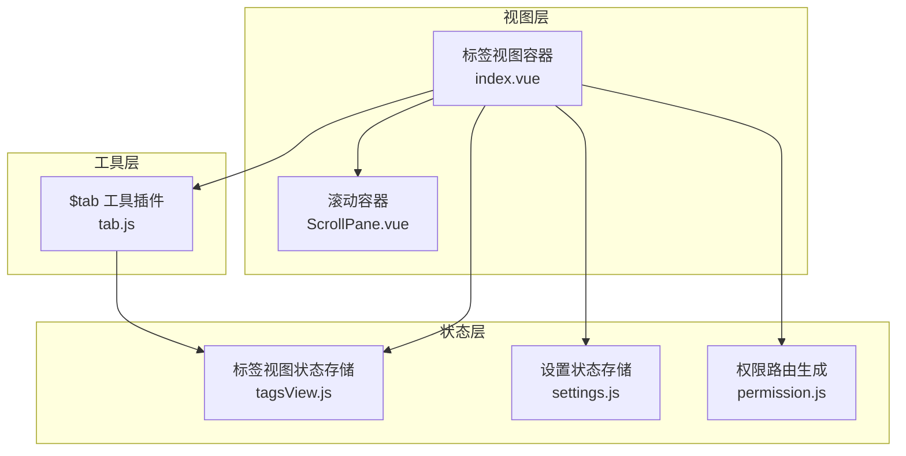
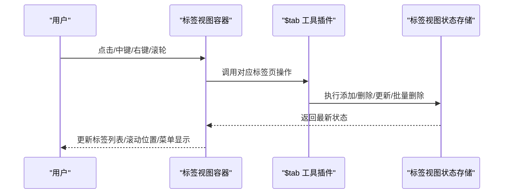
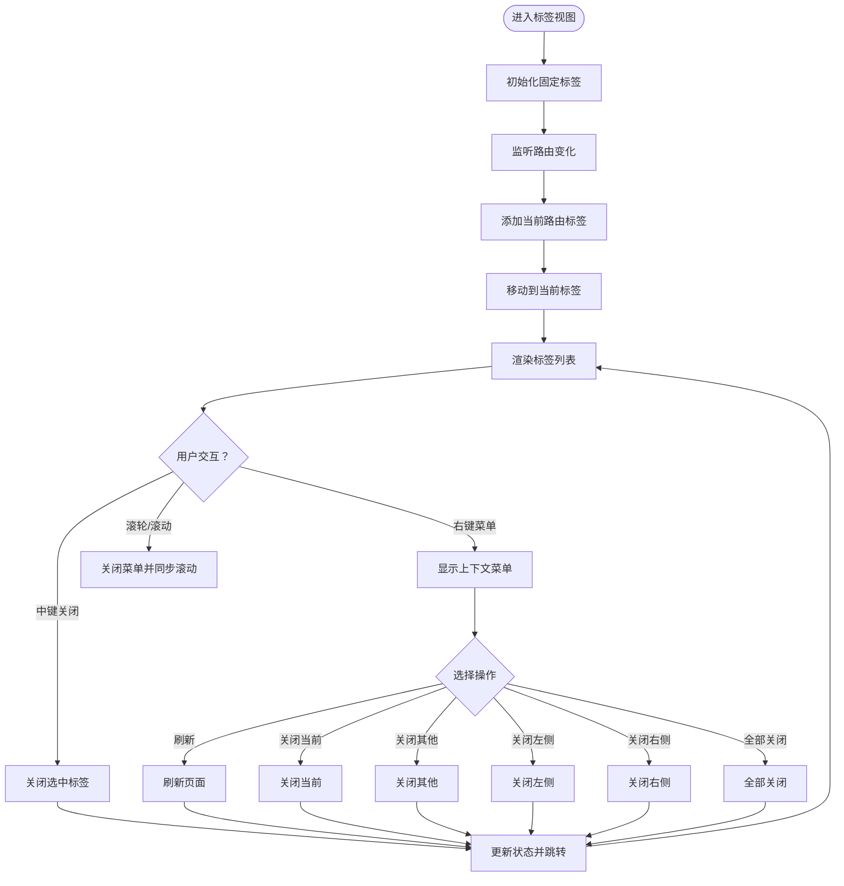
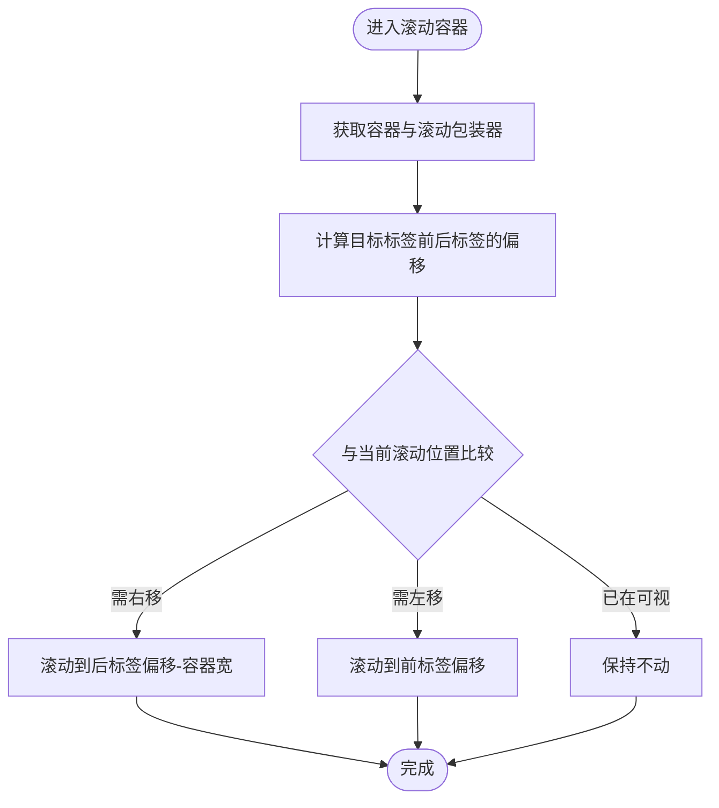
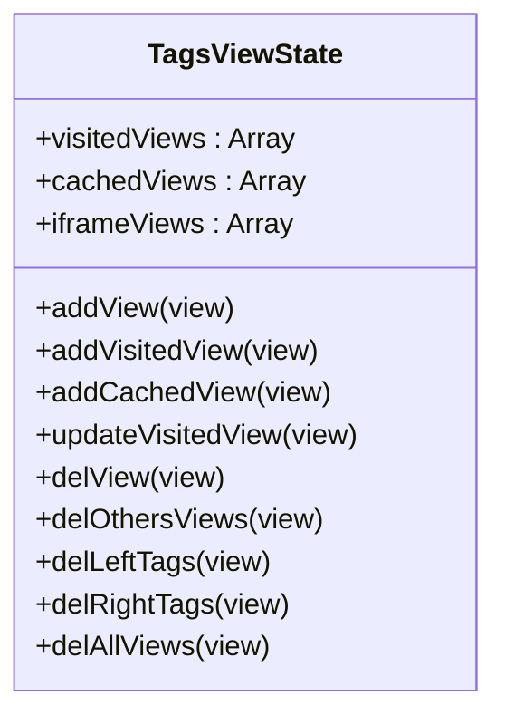
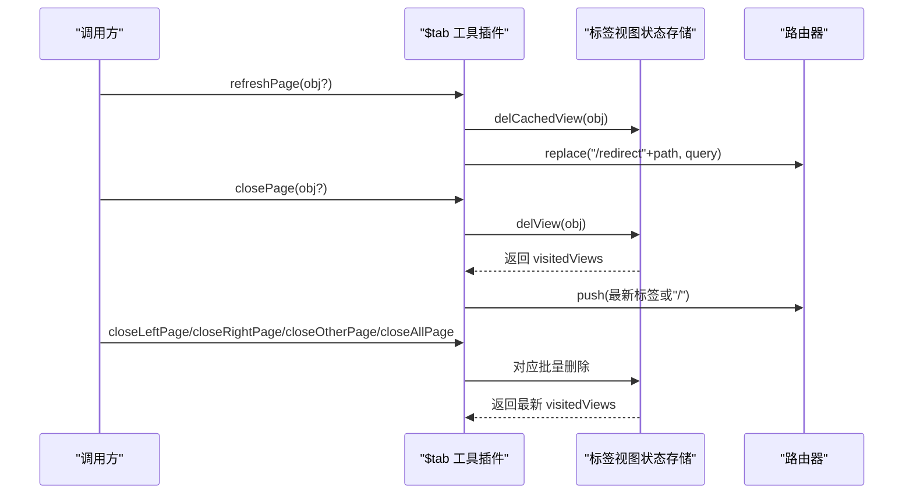
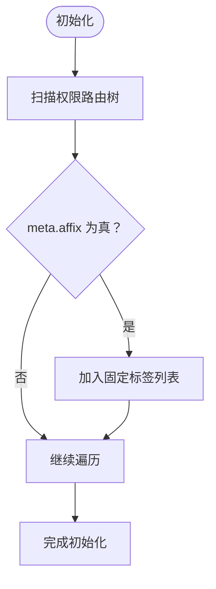
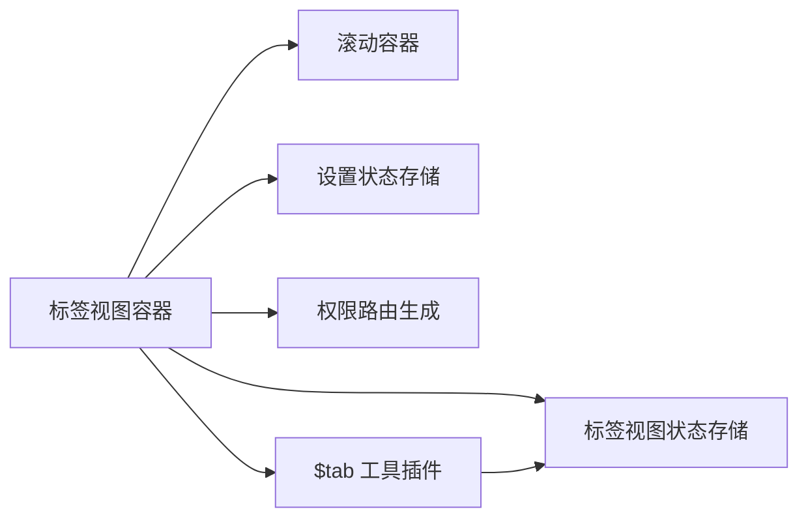

# 标签视图

<cite>
**本文引用的文件**
- [标签视图容器](file://antflow-vue/src/layout/components/TagsView/index.vue)
- [滚动容器](file://antflow-vue/src/layout/components/TagsView/ScrollPane.vue)
- [标签视图状态存储](file://antflow-vue/src/store/modules/tagsView.js)
- [$tab 工具插件](file://antflow-vue/src/plugins/tab.js)
- [设置状态存储](file://antflow-vue/src/store/modules/settings.js)
- [权限路由生成](file://antflow-vue/src/store/modules/permission.js)
- [前端手册（$tab 方法说明）](file://antflow-vue/public/docs/前端手册.md)
</cite>

## 目录
1. [简介](#简介)
2. [项目结构](#项目结构)
3. [核心组件](#核心组件)
4. [架构总览](#架构总览)
5. [详细组件分析](#详细组件分析)
6. [依赖关系分析](#依赖关系分析)
7. [性能考量](#性能考量)
8. [故障排查指南](#故障排查指南)
9. [结论](#结论)
10. [附录](#附录)

## 简介
本文件面向“标签视图”系统，围绕标签页的渲染机制、滚动容器实现、标签切换交互、状态管理与缓存策略、关闭行为控制、右键菜单与刷新、固定标签页、拖拽排序与批量操作、历史记录管理、样式与动画、性能优化以及扩展开发进行系统化说明。目标是帮助开发者快速理解并高效扩展标签视图能力。

## 项目结构
标签视图由以下关键部分组成：
- 视图容器：负责渲染标签列表、绑定点击/中键关闭、右键菜单、滚动定位与主题样式联动
- 滚动容器：提供横向滚动、滚轮滚动事件处理、可视区域对齐目标标签
- 状态存储：维护已访问标签、缓存标签集合、内嵌 iframe 标签集合，并提供批量删除、更新等动作
- 工具插件：封装统一的标签页操作接口（打开、刷新、关闭、批量关闭）
- 设置存储：控制标签图标显示、主题色、标签视图开关等
- 权限路由：生成可访问路由树，用于初始化固定标签

**图表来源**
- [标签视图容器:1-371](file://antflow-vue/src/layout/components/TagsView/index.vue#L1-L371)
- [滚动容器:1-107](file://antflow-vue/src/layout/components/TagsView/ScrollPane.vue#L1-L107)
- [标签视图状态存储:1-183](file://antflow-vue/src/store/modules/tagsView.js#L1-L183)
- [$tab 工具插件:1-80](file://antflow-vue/src/plugins/tab.js#L1-L80)
- [设置状态存储:1-81](file://antflow-vue/src/store/modules/settings.js#L1-L81)
- [权限路由生成:1-143](file://antflow-vue/src/store/modules/permission.js#L1-L143)

**章节来源**
- [标签视图容器:1-371](file://antflow-vue/src/layout/components/TagsView/index.vue#L1-L371)
- [滚动容器:1-107](file://antflow-vue/src/layout/components/TagsView/ScrollPane.vue#L1-L107)
- [标签视图状态存储:1-183](file://antflow-vue/src/store/modules/tagsView.js#L1-L183)
- [$tab 工具插件:1-80](file://antflow-vue/src/plugins/tab.js#L1-L80)
- [设置状态存储:1-81](file://antflow-vue/src/store/modules/settings.js#L1-L81)
- [权限路由生成:1-143](file://antflow-vue/src/store/modules/permission.js#L1-L143)

## 核心组件
- 标签视图容器：负责渲染 visitedViews，绑定激活态样式、图标、中键关闭、右键菜单、滚动定位；监听路由变化以添加标签并移动到当前标签
- 滚动容器：提供横向滚动条、滚轮滚动事件处理、根据目标标签计算滚动位置，确保目标标签在可视区域内
- 标签视图状态存储：维护 visitedViews、cachedViews、iframeViews；提供添加、删除、更新、批量删除等动作
- $tab 工具插件：封装统一的标签页操作接口，包括刷新、关闭、打开、更新、批量关闭等
- 设置状态存储：控制标签图标显示、主题色、标签视图开关等
- 权限路由生成：生成可访问路由树，用于初始化固定标签

**章节来源**
- [标签视图容器:1-371](file://antflow-vue/src/layout/components/TagsView/index.vue#L1-L371)
- [滚动容器:1-107](file://antflow-vue/src/layout/components/TagsView/ScrollPane.vue#L1-L107)
- [标签视图状态存储:1-183](file://antflow-vue/src/store/modules/tagsView.js#L1-L183)
- [$tab 工具插件:1-80](file://antflow-vue/src/plugins/tab.js#L1-L80)
- [设置状态存储:1-81](file://antflow-vue/src/store/modules/settings.js#L1-L81)
- [权限路由生成:1-143](file://antflow-vue/src/store/modules/permission.js#L1-L143)

## 架构总览
标签视图采用“视图-状态-工具-设置-路由”的分层设计：
- 视图层通过计算属性订阅状态存储与设置存储，驱动 DOM 渲染与交互
- 工具插件作为统一入口，调用状态存储执行具体动作
- 权限路由生成决定初始固定标签与可访问标签范围

**图表来源**
- [标签视图容器:1-371](file://antflow-vue/src/layout/components/TagsView/index.vue#L1-L371)
- [$tab 工具插件:1-80](file://antflow-vue/src/plugins/tab.js#L1-L80)
- [标签视图状态存储:1-183](file://antflow-vue/src/store/modules/tagsView.js#L1-L183)

## 详细组件分析

### 标签视图容器（渲染与交互）
- 渲染机制
  - 使用滚动容器包裹标签项，按 visitedViews 渲染每个标签
  - 激活态通过 activeStyle 动态绑定主题色背景与边框
  - 支持显示图标（受设置控制），并为非固定标签提供关闭按钮
- 交互逻辑
  - 中键点击：关闭非固定标签
  - 右键点击：弹出上下文菜单，支持刷新、关闭当前、关闭其他、关闭左侧、关闭右侧、全部关闭
  - 滚动事件：关闭菜单并同步滚动容器
- 生命周期与路由联动
  - 初始化：扫描权限路由中的固定标签并加入 visitedViews
  - 路由变化：添加当前路由对应的标签，移动到当前标签并更新 fullPath
- 滚动定位
  - 调用滚动容器的 moveToTarget，根据目标标签前后标签的偏移量计算滚动位置，保证目标标签可见

**图表来源**
- [标签视图容器:1-371](file://antflow-vue/src/layout/components/TagsView/index.vue#L1-L371)

**章节来源**
- [标签视图容器:1-371](file://antflow-vue/src/layout/components/TagsView/index.vue#L1-L371)

### 滚动容器（横向滚动与可视对齐）
- 横向滚动
  - 使用横向滚动条，禁用纵向滚动
  - 监听滚轮事件，计算滚动增量并更新 scrollLeft
- 可视对齐
  - 根据目标标签前后相邻标签的 offsetLeft 与容器宽度，计算需要滚动的位置
  - 特殊处理首尾标签，直接滚动到最左/最右
- 事件绑定
  - 挂载时绑定 scroll 事件，卸载时移除，避免内存泄漏

**图表来源**
- [滚动容器:1-107](file://antflow-vue/src/layout/components/TagsView/ScrollPane.vue#L1-L107)

**章节来源**
- [滚动容器:1-107](file://antflow-vue/src/layout/components/TagsView/ScrollPane.vue#L1-L107)

### 标签视图状态存储（状态管理与缓存策略）
- 状态结构
  - visitedViews：已访问标签列表（含路径、标题、元信息）
  - cachedViews：需要缓存的组件名称集合（受 noCache 控制）
  - iframeViews：内嵌 iframe 的标签集合
- 添加与更新
  - addView：同时添加到 visitedViews 与 cachedViews（受 noCache 控制）
  - addVisitedView：去重后加入 visitedViews
  - addCachedView：去重后加入 cachedViews（noCache 为真则不加入）
  - updateVisitedView：按路径更新已存在标签
- 删除与批量删除
  - delView：删除 visitedViews 与对应缓存
  - delOthersViews：仅保留当前标签与固定标签
  - delLeftTags/delRightTags：按索引删除左侧/右侧标签，并清理对应缓存与 iframe
  - delAllViews：清空 visitedViews 与 cachedViews，并清空 iframeViews
- 缓存策略
  - 仅当 meta.noCache 为假时才加入 cachedViews
  - 刷新操作通过删除缓存项并重定向到 /redirect 路由触发重新加载

**图表来源**
- [标签视图状态存储:1-183](file://antflow-vue/src/store/modules/tagsView.js#L1-L183)

**章节来源**
- [标签视图状态存储:1-183](file://antflow-vue/src/store/modules/tagsView.js#L1-L183)

### $tab 工具插件（统一操作接口）
- 刷新页面
  - 根据当前路由匹配组件名，删除对应缓存项，重定向到 /redirect 路由触发重新加载
- 关闭页面
  - 支持关闭当前、指定标签、关闭后跳转到最新标签或首页
- 批量关闭
  - 关闭左侧、右侧、其他、全部
- 打开/更新页面
  - openPage：添加标签并跳转
  - updatePage：更新已存在标签的标题等信息

**图表来源**
- [$tab 工具插件:1-80](file://antflow-vue/src/plugins/tab.js#L1-L80)
- [标签视图状态存储:1-183](file://antflow-vue/src/store/modules/tagsView.js#L1-L183)

**章节来源**
- [$tab 工具插件:1-80](file://antflow-vue/src/plugins/tab.js#L1-L80)
- [前端手册（$tab 方法说明）:1-98](file://antflow-vue/public/docs/前端手册.md#L1-L98)

### 固定标签页与初始化
- 固定标签识别
  - 通过权限路由树递归筛选 meta.affix 为真的路由，生成固定标签列表
- 初始化流程
  - 在 mounted 时扫描固定标签并加入 visitedViews
  - 路由变化时自动添加当前路由标签

**图表来源**
- [标签视图容器:118-149](file://antflow-vue/src/layout/components/TagsView/index.vue#L118-L149)
- [权限路由生成:1-143](file://antflow-vue/src/store/modules/permission.js#L1-L143)

**章节来源**
- [标签视图容器:118-149](file://antflow-vue/src/layout/components/TagsView/index.vue#L118-L149)
- [权限路由生成:1-143](file://antflow-vue/src/store/modules/permission.js#L1-L143)

### 右键菜单与刷新机制
- 右键菜单
  - 支持刷新、关闭当前、关闭其他、关闭左侧、关闭右侧、全部关闭
  - 菜单位置根据容器边界与鼠标坐标动态计算，避免溢出
- 刷新机制
  - refreshSelectedTag 调用 $tab.refreshPage，内部删除缓存并重定向到 /redirect

**章节来源**
- [标签视图容器:22-41](file://antflow-vue/src/layout/components/TagsView/index.vue#L22-L41)
- [标签视图容器:172-177](file://antflow-vue/src/layout/components/TagsView/index.vue#L172-L177)
- [$tab 工具插件:6-26](file://antflow-vue/src/plugins/tab.js#L6-L26)

### 拖拽排序与批量操作
- 拖拽排序
  - 当前实现未包含拖拽排序逻辑，如需扩展可在标签项上增加拖拽事件并在状态存储中维护 visitedViews 的顺序
- 批量操作
  - 支持关闭左侧、右侧、其他、全部，均通过状态存储的批量删除动作实现

**章节来源**
- [标签视图容器:187-217](file://antflow-vue/src/layout/components/TagsView/index.vue#L187-L217)
- [标签视图状态存储:133-178](file://antflow-vue/src/store/modules/tagsView.js#L133-L178)

### 历史记录管理
- 历史记录
  - visitedViews 即为历史记录，按访问顺序维护
- 导航回退
  - 关闭标签后若无剩余标签，会跳转到首页或特定页面

**章节来源**
- [标签视图状态存储:101-124](file://antflow-vue/src/store/modules/tagsView.js#L101-L124)
- [标签视图容器:219-233](file://antflow-vue/src/layout/components/TagsView/index.vue#L219-L233)

### 样式定制与动画效果
- 主题色联动
  - 激活态标签背景色与边框色由设置存储的主题色动态绑定
- 图标显示
  - 受设置存储的 tagsIcon 控制，支持显示路由 meta.icon
- 动画与过渡
  - 关闭按钮 hover 效果通过过渡与尺寸变化实现
  - 右键菜单使用阴影与悬停背景色提升交互体验

**章节来源**
- [标签视图容器:90-96](file://antflow-vue/src/layout/components/TagsView/index.vue#L90-L96)
- [标签视图容器:262-371](file://antflow-vue/src/layout/components/TagsView/index.vue#L262-L371)
- [设置状态存储:23-58](file://antflow-vue/src/store/modules/settings.js#L23-L58)

## 依赖关系分析
- 视图容器依赖
  - 计算属性订阅设置存储（主题色、图标开关）、权限路由（固定标签）、标签视图状态存储（visitedViews）
  - 通过 $tab 插件调用状态存储执行动作
- 状态存储依赖
  - 仅维护数据结构与动作，不直接依赖视图
- 工具插件依赖
  - 依赖标签视图状态存储与路由器，实现统一操作

**图表来源**
- [标签视图容器:1-371](file://antflow-vue/src/layout/components/TagsView/index.vue#L1-L371)
- [滚动容器:1-107](file://antflow-vue/src/layout/components/TagsView/ScrollPane.vue#L1-L107)
- [标签视图状态存储:1-183](file://antflow-vue/src/store/modules/tagsView.js#L1-L183)
- [$tab 工具插件:1-80](file://antflow-vue/src/plugins/tab.js#L1-L80)
- [设置状态存储:1-81](file://antflow-vue/src/store/modules/settings.js#L1-L81)
- [权限路由生成:1-143](file://antflow-vue/src/store/modules/permission.js#L1-L143)

**章节来源**
- [标签视图容器:1-371](file://antflow-vue/src/layout/components/TagsView/index.vue#L1-L371)
- [滚动容器:1-107](file://antflow-vue/src/layout/components/TagsView/ScrollPane.vue#L1-L107)
- [标签视图状态存储:1-183](file://antflow-vue/src/store/modules/tagsView.js#L1-L183)
- [$tab 工具插件:1-80](file://antflow-vue/src/plugins/tab.js#L1-L80)
- [设置状态存储:1-81](file://antflow-vue/src/store/modules/settings.js#L1-L81)
- [权限路由生成:1-143](file://antflow-vue/src/store/modules/permission.js#L1-L143)

## 性能考量
- 渲染优化
  - 使用 v-for 渲染标签，key 为路径，减少不必要的重排
  - 仅在路由变化时更新 visitedViews，避免频繁变更
- 滚动优化
  - 滚动容器监听 scroll 事件并节流触发，避免高频重绘
  - 通过计算目标标签前后标签的偏移量，一次性滚动到位
- 缓存策略
  - 仅对非 noCache 的标签加入缓存集合，减少重复渲染
  - 刷新通过删除缓存并重定向到 /redirect，确保强制重新加载
- 内存管理
  - 滚动容器挂载/卸载时正确绑定/移除事件，防止内存泄漏

**章节来源**
- [标签视图容器:68-71](file://antflow-vue/src/layout/components/TagsView/index.vue#L68-L71)
- [滚动容器:20-26](file://antflow-vue/src/layout/components/TagsView/ScrollPane.vue#L20-L26)
- [标签视图状态存储:30-34](file://antflow-vue/src/store/modules/tagsView.js#L30-L34)
- [$tab 工具插件:6-26](file://antflow-vue/src/plugins/tab.js#L6-L26)

## 故障排查指南
- 右键菜单不显示
  - 检查 visible 状态与 document.body 事件绑定
  - 确认 openMenu 计算的 left/top 不超出容器边界
- 标签无法关闭
  - 确认 isAffix 判断逻辑，固定标签不可关闭
  - 检查 $tab.closePage 返回的最新 visitedViews 是否为空
- 刷新无效
  - 确认 $tab.refreshPage 是否正确删除缓存并重定向到 /redirect
  - 检查路由组件名称是否在 matched 中被正确识别
- 滚动错位
  - 检查 moveToTarget 的标签偏移计算与容器宽度
  - 确认标签 DOM 已渲染完成再进行 offsetLeft 获取

**章节来源**
- [标签视图容器:235-255](file://antflow-vue/src/layout/components/TagsView/index.vue#L235-L255)
- [标签视图容器:179-185](file://antflow-vue/src/layout/components/TagsView/index.vue#L179-L185)
- [$tab 工具插件:6-26](file://antflow-vue/src/plugins/tab.js#L6-L26)
- [滚动容器:42-87](file://antflow-vue/src/layout/components/TagsView/ScrollPane.vue#L42-L87)

## 结论
标签视图系统通过清晰的分层设计实现了稳定的标签渲染、滚动与交互能力。状态存储与工具插件提供了完善的生命周期管理与批量操作能力。未来可在拖拽排序、批量操作增强、历史记录持久化等方面进一步扩展，以满足更复杂的业务场景。

## 附录
- 开发指南
  - 扩展右键菜单：在标签视图容器的上下文菜单中新增选项，调用 $tab 对应方法或自定义动作
  - 自定义样式：通过设置存储的主题色与图标开关，结合 SCSS 变量覆盖实现主题定制
  - 批量操作：基于状态存储的批量删除动作，扩展更多维度的过滤条件
  - 拖拽排序：在标签项上增加拖拽事件，在状态存储中维护 visitedViews 的顺序

**章节来源**
- [标签视图容器:22-41](file://antflow-vue/src/layout/components/TagsView/index.vue#L22-L41)
- [标签视图状态存储:133-178](file://antflow-vue/src/store/modules/tagsView.js#L133-L178)
- [设置状态存储:23-58](file://antflow-vue/src/store/modules/settings.js#L23-L58)
- [$tab 工具插件:1-80](file://antflow-vue/src/plugins/tab.js#L1-L80)