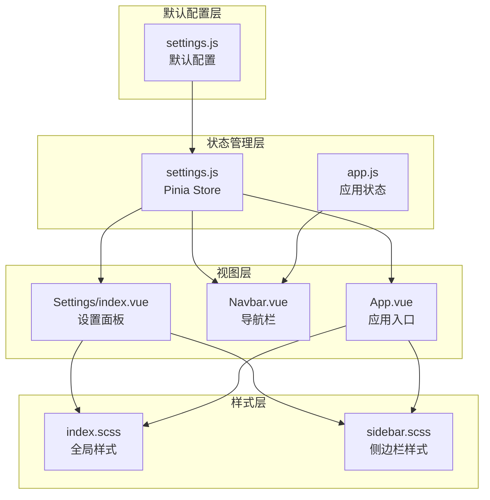
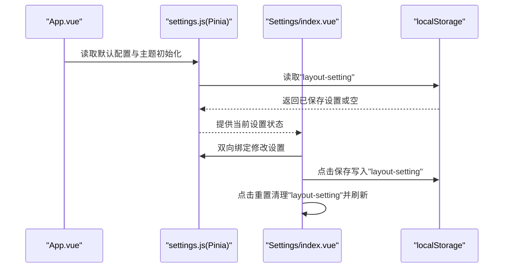
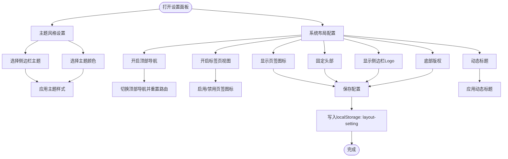
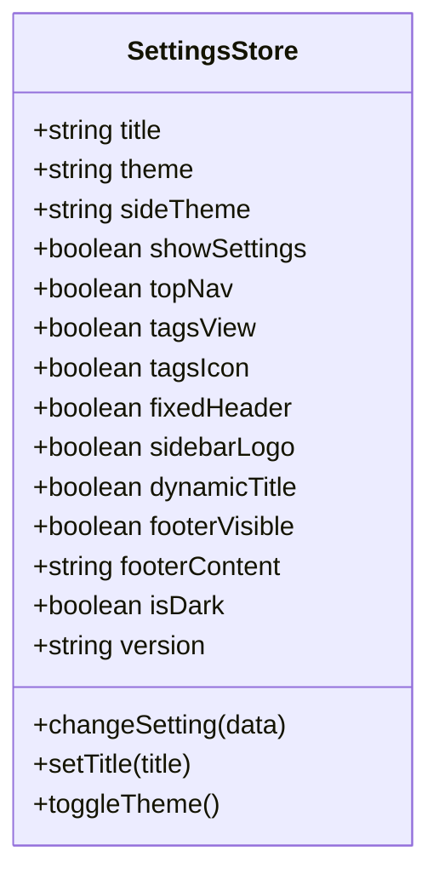
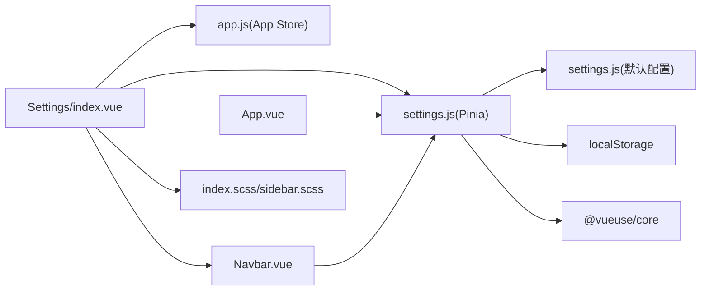

# 系统设置面板

<cite>
**本文档引用的文件**
- [settings.js](file://antflow-vue/src/settings.js)
- [settings.js](file://antflow-vue/src/store/modules/settings.js)
- [index.vue](file://antflow-vue/src/layout/components/Settings/index.vue)
- [app.js](file://antflow-vue/src/store/modules/app.js)
- [Navbar.vue](file://antflow-vue/src/layout/components/Navbar.vue)
- [index.scss](file://antflow-vue/src/assets/styles/index.scss)
- [sidebar.scss](file://antflow-vue/src/assets/styles/sidebar.scss)
- [App.vue](file://antflow-vue/src/App.vue)
- [13.前端系统.md](file://doc/系统介绍篇/13.前端系统.md)
- [19.导航和布局.md](file://doc/系统介绍篇/19.导航和布局.md)
</cite>

## 目录
1. [简介](#简介)
2. [项目结构](#项目结构)
3. [核心组件](#核心组件)
4. [架构总览](#架构总览)
5. [详细组件分析](#详细组件分析)
6. [依赖关系分析](#依赖关系分析)
7. [性能考虑](#性能考虑)
8. [故障排查指南](#故障排查指南)
9. [结论](#结论)
10. [附录](#附录)

## 简介
本文件面向系统设置面板的配置与扩展开发，围绕以下目标展开：
- 深入解析设置面板的布局设计、配置项分类与实时预览机制
- 详解主题配置系统、布局选项设置、多语言切换能力现状与扩展路径
- 解释设置数据的存储策略、本地缓存机制与配置同步逻辑
- 阐述设置面板的交互设计、动画效果与用户体验优化
- 提供设置项的扩展开发、自定义配置与默认值管理指南
- 给出设置面板的定制化实现、新配置项添加与配置持久化的开发指南

## 项目结构
设置面板位于前端工程 antflow-vue 中，采用“默认配置 + Pinia 状态 + 本地缓存”的分层设计：
- 默认配置：集中于 settings.js，定义所有可配置项的默认值与初始状态
- 状态管理：Pinia Store settings.js 负责读取默认配置与本地缓存，提供变更接口
- 视图组件：Settings/index.vue 提供抽屉式设置面板，绑定 Store 并触发持久化
- 全局应用：App.vue 在挂载时初始化主题样式；Navbar.vue 根据设置渲染顶部导航与主题切换入口
- 样式系统：index.scss 与 sidebar.scss 提供主题与布局的样式支撑

图表来源
- [settings.js:1-58](file://antflow-vue/src/settings.js#L1-L58)
- [settings.js:1-81](file://antflow-vue/src/store/modules/settings.js#L1-L81)
- [index.vue:1-225](file://antflow-vue/src/layout/components/Settings/index.vue#L1-L225)
- [app.js:1-46](file://antflow-vue/src/store/modules/app.js#L1-L46)
- [Navbar.vue:1-29](file://antflow-vue/src/layout/components/Navbar.vue#L1-L29)
- [App.vue:1-15](file://antflow-vue/src/App.vue#L1-L15)
- [index.scss:148-204](file://antflow-vue/src/assets/styles/index.scss#L148-L204)
- [sidebar.scss:60-238](file://antflow-vue/src/assets/styles/sidebar.scss#L60-L238)

章节来源
- [settings.js:1-58](file://antflow-vue/src/settings.js#L1-L58)
- [settings.js:1-81](file://antflow-vue/src/store/modules/settings.js#L1-L81)
- [index.vue:1-225](file://antflow-vue/src/layout/components/Settings/index.vue#L1-L225)
- [app.js:1-46](file://antflow-vue/src/store/modules/app.js#L1-L46)
- [Navbar.vue:1-29](file://antflow-vue/src/layout/components/Navbar.vue#L1-L29)
- [App.vue:1-15](file://antflow-vue/src/App.vue#L1-L15)
- [index.scss:148-204](file://antflow-vue/src/assets/styles/index.scss#L148-L204)
- [sidebar.scss:60-238](file://antflow-vue/src/assets/styles/sidebar.scss#L60-L238)

## 核心组件
- 默认配置 settings.js：集中定义主题、布局、标题、版权等配置项的默认值，作为全局默认来源
- 设置 Store settings.js：从 localStorage 读取已保存的布局设置，若缺失则回退到默认配置；提供 changeSetting、setTitle、toggleTheme 等动作
- 设置面板 Settings/index.vue：提供抽屉式设置面板，包含主题风格、主题颜色、布局选项与保存/重置按钮；支持实时预览与本地持久化
- 应用状态 Store app.js：维护侧边栏状态、设备类型与尺寸等应用级状态，与设置联动（如关闭顶部导航时重置路由）
- 导航栏 Navbar.vue：根据设置决定是否显示面包屑或顶部菜单；提供主题切换入口
- 应用入口 App.vue：在挂载完成后初始化主题样式
- 样式系统：index.scss 与 sidebar.scss 提供主题与布局的样式支撑

章节来源
- [settings.js:1-58](file://antflow-vue/src/settings.js#L1-L58)
- [settings.js:1-81](file://antflow-vue/src/store/modules/settings.js#L1-L81)
- [index.vue:1-225](file://antflow-vue/src/layout/components/Settings/index.vue#L1-L225)
- [app.js:1-46](file://antflow-vue/src/store/modules/app.js#L1-L46)
- [Navbar.vue:1-29](file://antflow-vue/src/layout/components/Navbar.vue#L1-L29)
- [App.vue:1-15](file://antflow-vue/src/App.vue#L1-L15)
- [index.scss:148-204](file://antflow-vue/src/assets/styles/index.scss#L148-L204)
- [sidebar.scss:60-238](file://antflow-vue/src/assets/styles/sidebar.scss#L60-L238)

## 架构总览
设置面板的运行时架构如下：
- 初始化阶段：App.vue 在挂载后调用主题样式初始化；settings Store 从 localStorage 读取布局设置并合并默认配置
- 运行阶段：Settings 面板通过双向绑定修改 Store；部分变更即时生效（如主题颜色、顶部导航开关），部分需点击“保存”写入 localStorage
- 同步阶段：localStorage 成为唯一持久化介质；重置时清空并刷新页面以恢复默认

图表来源
- [App.vue:1-15](file://antflow-vue/src/App.vue#L1-L15)
- [settings.js:21-58](file://antflow-vue/src/store/modules/settings.js#L21-L58)
- [index.vue:138-159](file://antflow-vue/src/layout/components/Settings/index.vue#L138-L159)

章节来源
- [App.vue:1-15](file://antflow-vue/src/App.vue#L1-L15)
- [settings.js:21-58](file://antflow-vue/src/store/modules/settings.js#L21-L58)
- [index.vue:138-159](file://antflow-vue/src/layout/components/Settings/index.vue#L138-L159)

## 详细组件分析

### 设置面板组件（Settings/index.vue）
- 布局设计：右侧滑出式抽屉，宽度 300px；分为“主题风格设置”和“系统布局配置”两大区域
- 配置项分类：
  - 主题风格：侧边栏主题（深色/浅色）、主题颜色（预定义色板）
  - 系统布局：顶部导航、标签页视图、页签图标、固定头部、侧边栏 Logo、动态标题、底部版权
- 实时预览机制：
  - 主题颜色变更：直接调用主题样式处理函数，即时应用到 CSS 自定义属性
  - 顶部导航开关：当关闭时联动应用状态，重置侧边栏路由
  - 动态标题：切换后立即调用动态标题逻辑
- 交互与动画：
  - 使用 Element Plus 的 Drawer、Switch、ColorPicker 等组件
  - 抽屉方向为“从右向左”，配合锁屏滚动与无头部设计
- 数据持久化：
  - 保存：将当前设置序列化写入 localStorage 的 "layout-setting"
  - 重置：删除 "layout-setting" 并刷新页面

图表来源
- [index.vue:1-225](file://antflow-vue/src/layout/components/Settings/index.vue#L1-L225)

章节来源
- [index.vue:1-225](file://antflow-vue/src/layout/components/Settings/index.vue#L1-L225)

### 设置 Store（settings.js）
- 默认值来源：从 settings.js 读取默认配置
- 本地缓存优先：从 localStorage 读取 "layout-setting"，缺失字段回退到默认值
- 状态字段：title、theme、sideTheme、showSettings、topNav、tagsView、tagsIcon、fixedHeader、sidebarLogo、dynamicTitle、footerVisible、footerContent、isDark、version
- 动作方法：
  - changeSetting：按键名更新对应状态
  - setTitle：设置标题并触发动态标题逻辑
  - toggleTheme：切换暗黑模式并同步到系统

图表来源
- [settings.js:23-78](file://antflow-vue/src/store/modules/settings.js#L23-L78)

章节来源
- [settings.js:1-81](file://antflow-vue/src/store/modules/settings.js#L1-L81)

### 默认配置（settings.js）
- 定义所有可配置项的默认值，包括：
  - 网页标题、侧边栏主题、是否显示设置面板
  - 顶部导航、标签页视图、页签图标
  - 固定头部、侧边栏 Logo、动态标题
  - 底部版权开关与内容
- 作用：作为 Store 初始化时的基准值，未命中本地缓存时的回退值

章节来源
- [settings.js:1-58](file://antflow-vue/src/settings.js#L1-L58)

### 应用状态 Store（app.js）
- 维护侧边栏状态、设备类型与尺寸
- 提供侧边栏开关、关闭、隐藏控制与尺寸设置
- 与设置联动：当关闭顶部导航时，重置侧边栏路由

章节来源
- [app.js:1-46](file://antflow-vue/src/store/modules/app.js#L1-L46)

### 导航栏（Navbar.vue）
- 根据设置决定显示面包屑或顶部菜单
- 提供主题切换入口（明/暗模式图标切换）

章节来源
- [Navbar.vue:1-29](file://antflow-vue/src/layout/components/Navbar.vue#L1-L29)

### 应用入口（App.vue）
- 在挂载完成后初始化主题样式，确保首次渲染即使用正确主题

章节来源
- [App.vue:1-15](file://antflow-vue/src/App.vue#L1-L15)

### 样式系统（index.scss 与 sidebar.scss）
- 提供全局样式与侧边栏样式，支持主题与布局的视觉表现
- 侧边栏样式包含折叠、移动端响应式、悬停效果等

章节来源
- [index.scss:148-204](file://antflow-vue/src/assets/styles/index.scss#L148-L204)
- [sidebar.scss:60-238](file://antflow-vue/src/assets/styles/sidebar.scss#L60-L238)

## 依赖关系分析
设置面板的依赖关系如下：
- Settings/index.vue 依赖：
  - Pinia Store（settings.js）：读取与写入设置
  - 应用状态 Store（app.js）：在关闭顶部导航时重置侧边栏路由
  - Navbar.vue：根据设置决定顶部导航显示
  - App.vue：初始化主题样式
  - 样式文件：index.scss 与 sidebar.scss 提供主题与布局样式
- settings.js 依赖：
  - settings.js（默认配置）：提供默认值
  - localStorage：持久化与读取
  - VueUse：暗黑模式状态管理

图表来源
- [index.vue:1-225](file://antflow-vue/src/layout/components/Settings/index.vue#L1-L225)
- [settings.js:1-81](file://antflow-vue/src/store/modules/settings.js#L1-L81)
- [app.js:1-46](file://antflow-vue/src/store/modules/app.js#L1-L46)
- [Navbar.vue:1-29](file://antflow-vue/src/layout/components/Navbar.vue#L1-L29)
- [App.vue:1-15](file://antflow-vue/src/App.vue#L1-L15)
- [index.scss:148-204](file://antflow-vue/src/assets/styles/index.scss#L148-L204)
- [sidebar.scss:60-238](file://antflow-vue/src/assets/styles/sidebar.scss#L60-L238)

章节来源
- [index.vue:1-225](file://antflow-vue/src/layout/components/Settings/index.vue#L1-L225)
- [settings.js:1-81](file://antflow-vue/src/store/modules/settings.js#L1-L81)
- [app.js:1-46](file://antflow-vue/src/store/modules/app.js#L1-L46)
- [Navbar.vue:1-29](file://antflow-vue/src/layout/components/Navbar.vue#L1-L29)
- [App.vue:1-15](file://antflow-vue/src/App.vue#L1-L15)
- [index.scss:148-204](file://antflow-vue/src/assets/styles/index.scss#L148-L204)
- [sidebar.scss:60-238](file://antflow-vue/src/assets/styles/sidebar.scss#L60-L238)

## 性能考虑
- 本地缓存命中：设置读取与写入均通过 localStorage，避免网络请求，性能稳定
- 即时预览：主题颜色与动态标题变更直接应用，减少不必要的重渲染
- 组件懒加载：设置面板为抽屉式，按需打开，降低常驻内存占用
- 样式复用：通过 SCSS 变量与主题类名统一管理，减少重复计算

## 故障排查指南
- 设置不生效
  - 检查 localStorage 中是否存在 "layout-setting"；若缺失，确认默认配置是否正确
  - 确认 settings Store 的状态字段是否被正确赋值
- 主题颜色未变化
  - 确认主题样式初始化是否执行（App.vue 挂载时）
  - 检查主题颜色变更回调是否调用主题样式处理函数
- 顶部导航切换无效
  - 确认关闭顶部导航时是否调用应用状态重置侧边栏路由
- 重置后仍不恢复默认
  - 确认重置逻辑是否删除 "layout-setting" 并刷新页面

章节来源
- [index.vue:138-159](file://antflow-vue/src/layout/components/Settings/index.vue#L138-L159)
- [settings.js:21-58](file://antflow-vue/src/store/modules/settings.js#L21-L58)
- [App.vue:1-15](file://antflow-vue/src/App.vue#L1-L15)

## 结论
系统设置面板通过“默认配置 + Pinia Store + localStorage”的清晰分层，提供了直观、可扩展的配置体验。其设计兼顾易用性与性能，支持主题与布局的实时预览与持久化。对于多语言切换，当前仓库未发现直接的语言配置项，建议在后续扩展中引入语言设置并沿用相同的持久化与状态管理模式。

## 附录

### 配置项分类与含义
- 主题风格
  - sideTheme：侧边栏主题（深色/浅色）
  - theme：主题颜色（CSS 自定义属性驱动）
- 系统布局
  - topNav：是否显示顶部导航
  - tagsView：是否显示标签页视图
  - tagsIcon：是否显示页签图标（依赖 tagsView）
  - fixedHeader：是否固定头部
  - sidebarLogo：是否显示侧边栏 Logo
  - dynamicTitle：是否启用动态标题
  - footerVisible：是否显示底部版权
  - footerContent：底部版权内容
- 其他
  - title：网页标题
  - isDark：暗黑模式状态
  - version：版本信息（用于版本检查）

章节来源
- [settings.js:1-58](file://antflow-vue/src/settings.js#L1-L58)
- [settings.js:23-78](file://antflow-vue/src/store/modules/settings.js#L23-L78)

### 多语言切换功能现状与扩展建议
- 现状：当前设置面板未提供语言切换配置项
- 扩展建议：
  - 在默认配置中增加语言字段与语言列表
  - 在设置 Store 中新增语言状态与切换动作
  - 在导航栏或设置面板中增加语言选择器
  - 将语言设置写入 localStorage 并在应用启动时读取
  - 对接 i18n 框架（如 vue-i18n）以实现文案切换

章节来源
- [settings.js:1-58](file://antflow-vue/src/settings.js#L1-L58)
- [settings.js:23-78](file://antflow-vue/src/store/modules/settings.js#L23-L78)

### 开发指南：添加新的设置项
- 步骤
  1. 在默认配置 settings.js 中添加新字段及其默认值
  2. 在 settings Store 中读取本地缓存并合并默认值
  3. 在设置面板 Settings/index.vue 中添加对应的 UI 控件与事件
  4. 若需要即时生效，编写变更回调并调用相应逻辑
  5. 若需要持久化，确保保存/重置逻辑覆盖该字段
- 示例参考
  - 主题颜色与动态标题的实现可作为新增开关项的参考

章节来源
- [settings.js:1-58](file://antflow-vue/src/settings.js#L1-L58)
- [settings.js:23-78](file://antflow-vue/src/store/modules/settings.js#L23-L78)
- [index.vue:1-225](file://antflow-vue/src/layout/components/Settings/index.vue#L1-L225)

### 存储策略与同步逻辑
- 存储介质：localStorage
- 键名：
  - "layout-setting"：布局与主题相关设置
  - "version-setting"：版本信息（用于版本检查）
- 同步策略：
  - 读取：启动时从 localStorage 读取，缺失字段回退到默认值
  - 写入：保存按钮将当前设置整体写入 "layout-setting"
  - 清理：重置按钮删除 "layout-setting" 并刷新页面

章节来源
- [settings.js:21-22](file://antflow-vue/src/store/modules/settings.js#L21-L22)
- [index.vue:138-159](file://antflow-vue/src/layout/components/Settings/index.vue#L138-L159)

### 交互设计与用户体验优化
- 交互设计
  - 抽屉式面板，右侧滑出，便于快速访问
  - 即时预览：主题颜色与动态标题变更立即生效
  - 分组展示：主题风格与系统布局清晰分组
- 用户体验优化
  - 页签图标仅在启用标签页视图时可用
  - 保存/重置提供加载提示与页面刷新反馈
  - 暗黑模式与主题切换入口显眼且易于操作

章节来源
- [index.vue:1-225](file://antflow-vue/src/layout/components/Settings/index.vue#L1-L225)
- [Navbar.vue:1-29](file://antflow-vue/src/layout/components/Navbar.vue#L1-L29)