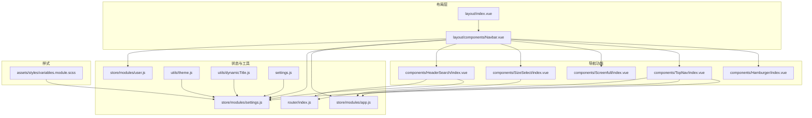
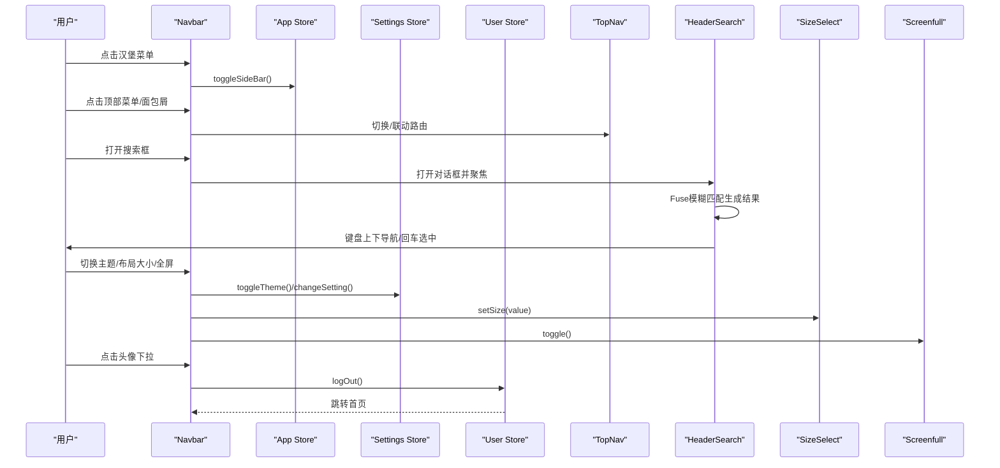
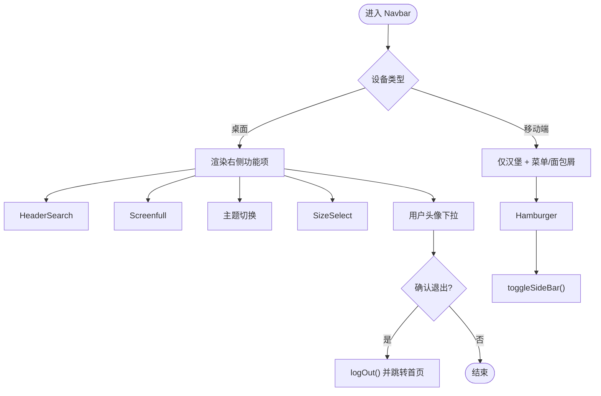
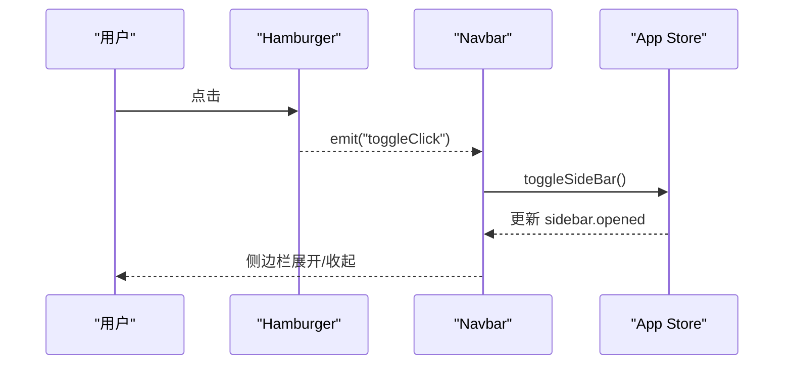
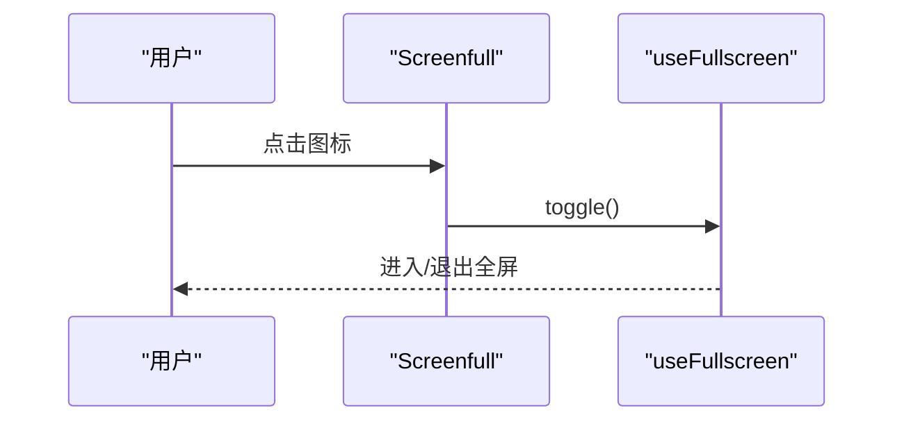
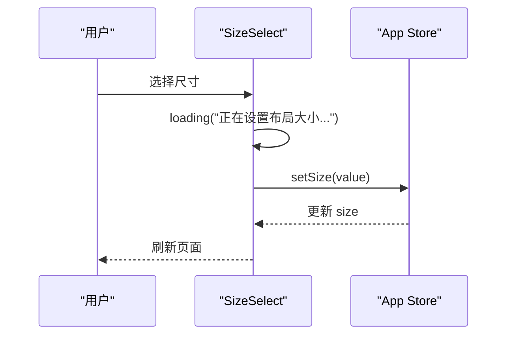
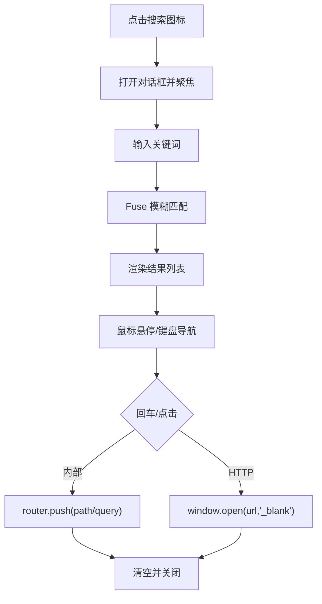
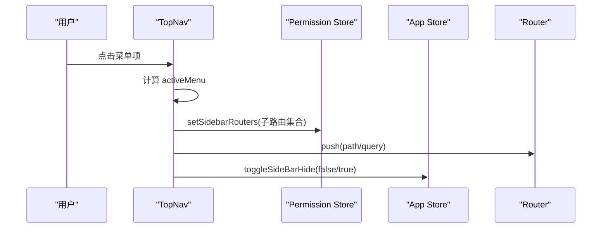
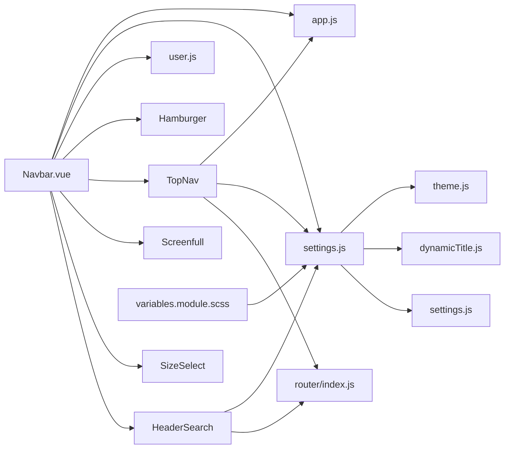

# 顶部导航栏

<cite>
**本文引用的文件**
- [Navbar.vue](file://antflow-vue/src/layout/components/Navbar.vue)
- [Hamburger/index.vue](file://antflow-vue/src/components/Hamburger/index.vue)
- [Screenfull/index.vue](file://antflow-vue/src/components/Screenfull/index.vue)
- [SizeSelect/index.vue](file://antflow-vue/src/components/SizeSelect/index.vue)
- [HeaderSearch/index.vue](file://antflow-vue/src/components/HeaderSearch/index.vue)
- [TopNav/index.vue](file://antflow-vue/src/components/TopNav/index.vue)
- [app.js](file://antflow-vue/src/store/modules/app.js)
- [settings.js](file://antflow-vue/src/store/modules/settings.js)
- [user.js](file://antflow-vue/src/store/modules/user.js)
- [theme.js](file://antflow-vue/src/utils/theme.js)
- [dynamicTitle.js](file://antflow-vue/src/utils/dynamicTitle.js)
- [settings.js](file://antflow-vue/src/settings.js)
- [index.js](file://antflow-vue/src/router/index.js)
- [index.vue](file://antflow-vue/src/layout/index.vue)
- [variables.module.scss](file://antflow-vue/src/assets/styles/variables.module.scss)
</cite>

## 目录
1. [简介](#简介)
2. [项目结构](#项目结构)
3. [核心组件](#核心组件)
4. [架构总览](#架构总览)
5. [详细组件分析](#详细组件分析)
6. [依赖关系分析](#依赖关系分析)
7. [性能考量](#性能考量)
8. [故障排查指南](#故障排查指南)
9. [结论](#结论)
10. [附录：扩展与自定义指南](#附录扩展与自定义指南)

## 简介
本文件面向AntFlow前端工程中的顶部导航栏系统，提供从整体布局、响应式适配、交互体验到各功能组件（Hamburger、全屏、尺寸选择器、头部搜索、顶部菜单）的深入解析。文档同时涵盖权限控制、动态标题、主题与国际化支持、样式定制与动画、移动端优化策略，并给出可扩展与自定义样式的开发指南。

## 项目结构
顶部导航栏由布局容器、导航条组件以及多个功能子组件构成，配合状态管理与样式体系实现统一的视觉与交互体验。

**图表来源**
- [index.vue:1-142](file://antflow-vue/src/layout/index.vue#L1-L142)
- [Navbar.vue:1-227](file://antflow-vue/src/layout/components/Navbar.vue#L1-L227)
- [Hamburger/index.vue:1-43](file://antflow-vue/src/components/Hamburger/index.vue#L1-L43)
- [TopNav/index.vue:1-218](file://antflow-vue/src/components/TopNav/index.vue#L1-L218)
- [Screenfull/index.vue:1-22](file://antflow-vue/src/components/Screenfull/index.vue#L1-L22)
- [SizeSelect/index.vue:1-45](file://antflow-vue/src/components/SizeSelect/index.vue#L1-L45)
- [HeaderSearch/index.vue:1-253](file://antflow-vue/src/components/HeaderSearch/index.vue#L1-L253)
- [app.js:1-47](file://antflow-vue/src/store/modules/app.js#L1-L47)
- [settings.js:1-81](file://antflow-vue/src/store/modules/settings.js#L1-L81)
- [user.js:1-130](file://antflow-vue/src/store/modules/user.js#L1-L130)
- [theme.js:1-50](file://antflow-vue/src/utils/theme.js#L1-L50)
- [dynamicTitle.js:1-14](file://antflow-vue/src/utils/dynamicTitle.js#L1-L14)
- [settings.js:1-58](file://antflow-vue/src/settings.js#L1-L58)
- [index.js:1-200](file://antflow-vue/src/router/index.js#L1-L200)
- [variables.module.scss:1-226](file://antflow-vue/src/assets/styles/variables.module.scss#L1-L226)

**章节来源**
- [index.vue:1-142](file://antflow-vue/src/layout/index.vue#L1-L142)
- [Navbar.vue:1-227](file://antflow-vue/src/layout/components/Navbar.vue#L1-L227)

## 核心组件
- 顶部导航容器：负责布局、响应式断点、设备检测、固定头部宽度计算、版本检查与刷新提示。
- 导航条组件：承载汉堡菜单、面包屑/顶部菜单切换、搜索、全屏、主题切换、尺寸选择、用户头像下拉等。
- Hamburger：侧边栏开关触发器，支持旋转动画与状态类名切换。
- Screenfull：全屏切换，基于VueUse的useFullscreen。
- SizeSelect：布局尺寸选择（大/默认/稍小），通过Cookie持久化并强制刷新以应用。
- HeaderSearch：全局菜单搜索，支持Fuse模糊匹配、键盘导航、HTTP链接新窗口打开。
- TopNav：顶部横向菜单，支持动态可见数量、更多菜单折叠、联动侧边栏路由。

**章节来源**
- [Navbar.vue:1-227](file://antflow-vue/src/layout/components/Navbar.vue#L1-L227)
- [Hamburger/index.vue:1-43](file://antflow-vue/src/components/Hamburger/index.vue#L1-L43)
- [Screenfull/index.vue:1-22](file://antflow-vue/src/components/Screenfull/index.vue#L1-L22)
- [SizeSelect/index.vue:1-45](file://antflow-vue/src/components/SizeSelect/index.vue#L1-L45)
- [HeaderSearch/index.vue:1-253](file://antflow-vue/src/components/HeaderSearch/index.vue#L1-L253)
- [TopNav/index.vue:1-218](file://antflow-vue/src/components/TopNav/index.vue#L1-L218)

## 架构总览
顶部导航栏采用“布局容器 + 导航条 + 功能子组件 + 状态管理 + 工具函数 + 样式体系”的分层架构，确保职责清晰、耦合可控、易于扩展与维护。

**图表来源**
- [Navbar.vue:75-111](file://antflow-vue/src/layout/components/Navbar.vue#L75-L111)
- [TopNav/index.vue:120-141](file://antflow-vue/src/components/TopNav/index.vue#L120-L141)
- [HeaderSearch/index.vue:65-101](file://antflow-vue/src/components/HeaderSearch/index.vue#L65-L101)
- [SizeSelect/index.vue:32-36](file://antflow-vue/src/components/SizeSelect/index.vue#L32-L36)
- [Screenfull/index.vue:10-11](file://antflow-vue/src/components/Screenfull/index.vue#L10-L11)
- [user.js:110-125](file://antflow-vue/src/store/modules/user.js#L110-L125)
- [settings.js:59-77](file://antflow-vue/src/store/modules/settings.js#L59-L77)

## 详细组件分析

### 导航条组件（Navbar）
- 布局与响应式：根据设备类型隐藏部分右侧功能；在移动设备下自动关闭侧边栏并遮罩点击关闭。
- 内容组织：左侧汉堡菜单与面包屑/顶部菜单二选一；右侧按需渲染搜索、仓库/文档入口、全屏、主题切换、尺寸选择、用户头像下拉。
- 用户交互：头像下拉支持“个人中心”、“布局设置”、“退出登录”，其中退出登录使用确认对话框。
- 主题与尺寸：通过Settings Store切换暗黑/明亮主题；通过App Store设置布局尺寸并强制刷新。

**图表来源**
- [Navbar.vue:8-54](file://antflow-vue/src/layout/components/Navbar.vue#L8-L54)
- [Navbar.vue:75-111](file://antflow-vue/src/layout/components/Navbar.vue#L75-L111)

**章节来源**
- [Navbar.vue:1-227](file://antflow-vue/src/layout/components/Navbar.vue#L1-L227)
- [index.vue:42-55](file://antflow-vue/src/layout/index.vue#L42-L55)

### Hamburger 组件（汉堡菜单）
- 触发逻辑：点击事件向上派发 toggleClick，父组件 Navbar 接收后调用 App Store 切换侧边栏。
- 视觉反馈：通过 isActive 属性控制类名，实现旋转180度的动画状态。
- 无障碍与性能：使用内联填充与轻量SVG，避免重排抖动。

**图表来源**
- [Hamburger/index.vue:25-28](file://antflow-vue/src/components/Hamburger/index.vue#L25-L28)
- [Navbar.vue:75-77](file://antflow-vue/src/layout/components/Navbar.vue#L75-L77)
- [app.js:15-27](file://antflow-vue/src/store/modules/app.js#L15-L27)

**章节来源**
- [Hamburger/index.vue:1-43](file://antflow-vue/src/components/Hamburger/index.vue#L1-L43)
- [Navbar.vue:3-4](file://antflow-vue/src/layout/components/Navbar.vue#L3-L4)

### 屏幕全屏组件（Screenfull）
- 实现机制：基于 @vueuse/core 的 useFullscreen，直接绑定 SVG 图标点击事件，切换全屏状态。
- 适用场景：在需要最大化内容可视区域时使用，如报表或演示场景。

**图表来源**
- [Screenfull/index.vue:3-11](file://antflow-vue/src/components/Screenfull/index.vue#L3-L11)

**章节来源**
- [Screenfull/index.vue:1-22](file://antflow-vue/src/components/Screenfull/index.vue#L1-L22)

### 尺寸选择器（SizeSelect）
- 功能：提供“较大/默认/稍小”三种布局密度选项，点击后弹出加载提示，写入App Store并延迟刷新页面以应用新尺寸。
- 适配策略：结合CSS变量与Element Plus组件，保证在不同密度下UI元素的可读性与紧凑性。

**图表来源**
- [SizeSelect/index.vue:32-36](file://antflow-vue/src/components/SizeSelect/index.vue#L32-L36)
- [app.js:36-39](file://antflow-vue/src/store/modules/app.js#L36-L39)

**章节来源**
- [SizeSelect/index.vue:1-45](file://antflow-vue/src/components/SizeSelect/index.vue#L1-L45)
- [app.js:1-47](file://antflow-vue/src/store/modules/app.js#L1-L47)

### 头部搜索（HeaderSearch）
- 智能提示：初始化 Fuse 模糊搜索实例，支持按标题与路径进行加权匹配；输入时实时过滤，空输入恢复原始搜索池。
- 键盘导航：支持上下方向键循环选择，Enter 键确认跳转；鼠标悬停同步高亮。
- 路由跳转：支持内部路由与带查询参数的路由；HTTP 链接在新窗口打开。
- 国际化与标题：通过权限路由生成可搜索列表，标题取自 meta.title，支持多级面包屑路径拼接。

**图表来源**
- [HeaderSearch/index.vue:65-101](file://antflow-vue/src/components/HeaderSearch/index.vue#L65-L101)
- [HeaderSearch/index.vue:159-188](file://antflow-vue/src/components/HeaderSearch/index.vue#L159-L188)
- [HeaderSearch/index.vue:190-196](file://antflow-vue/src/components/HeaderSearch/index.vue#L190-L196)

**章节来源**
- [HeaderSearch/index.vue:1-253](file://antflow-vue/src/components/HeaderSearch/index.vue#L1-L253)
- [index.js:28-93](file://antflow-vue/src/router/index.js#L28-L93)

### 顶部导航菜单（TopNav）
- 动态可见数量：根据窗口宽度动态计算每项宽度，超出部分折叠至“更多菜单”子菜单。
- 联动侧边栏：点击顶部菜单时，根据父路径筛选子路由并写入侧边栏路由，实现顶部与侧边栏的联动。
- 主题适配：通过CSS变量 --theme 与 Element Plus 菜单样式结合，实现高亮与悬停主题色一致。

**图表来源**
- [TopNav/index.vue:98-113](file://antflow-vue/src/components/TopNav/index.vue#L98-L113)
- [TopNav/index.vue:120-141](file://antflow-vue/src/components/TopNav/index.vue#L120-L141)
- [TopNav/index.vue:143-158](file://antflow-vue/src/components/TopNav/index.vue#L143-L158)

**章节来源**
- [TopNav/index.vue:1-218](file://antflow-vue/src/components/TopNav/index.vue#L1-L218)

### 用户信息与设置面板
- 用户信息：头像、昵称来自 User Store；支持个人中心跳转。
- 设置面板：通过 Navbar 的下拉菜单触发，打开全局设置抽屉（由布局容器持有）。
- 退出登录：二次确认对话框，成功后清除令牌并跳转首页。

**章节来源**
- [Navbar.vue:34-52](file://antflow-vue/src/layout/components/Navbar.vue#L34-L52)
- [user.js:110-125](file://antflow-vue/src/store/modules/user.js#L110-L125)
- [index.vue:61-64](file://antflow-vue/src/layout/index.vue#L61-L64)

## 依赖关系分析
- 组件间依赖：Navbar 依赖 App/Settings/User Store 与多个功能子组件；TopNav 依赖权限路由与 App Store；HeaderSearch 依赖权限路由与 Fuse。
- 状态管理：App Store 管理侧边栏状态与布局尺寸；Settings Store 管理主题、顶部导航开关、动态标题等；User Store 管理用户信息与登出。
- 样式体系：SCSS 变量定义了亮/暗两套主题色，Navbar 使用 CSS 变量实现背景与文字色随主题切换。

**图表来源**
- [Navbar.vue:67-73](file://antflow-vue/src/layout/components/Navbar.vue#L67-L73)
- [TopNav/index.vue:38-53](file://antflow-vue/src/components/TopNav/index.vue#L38-L53)
- [HeaderSearch/index.vue:51-63](file://antflow-vue/src/components/HeaderSearch/index.vue#L51-L63)
- [settings.js:23-58](file://antflow-vue/src/store/modules/settings.js#L23-L58)
- [theme.js:1-50](file://antflow-vue/src/utils/theme.js#L1-L50)
- [dynamicTitle.js:7-14](file://antflow-vue/src/utils/dynamicTitle.js#L7-L14)
- [settings.js:1-58](file://antflow-vue/src/settings.js#L1-L58)
- [variables.module.scss:68-125](file://antflow-vue/src/assets/styles/variables.module.scss#L68-L125)

**章节来源**
- [settings.js:1-81](file://antflow-vue/src/store/modules/settings.js#L1-L81)
- [variables.module.scss:1-226](file://antflow-vue/src/assets/styles/variables.module.scss#L1-L226)

## 性能考量
- 搜索性能：Fuse 初始化在挂载时执行，搜索池变更时重建索引，避免每次输入都重建；建议对超大路由集进行分页或懒加载。
- 渲染优化：TopNav 使用计算属性缓存 topMenus 与 childrenMenus，减少重复计算；Hamburger 仅在状态变化时重绘。
- 响应式：布局容器监听窗口尺寸，移动端自动关闭侧边栏并使用遮罩，降低不必要的DOM层级。
- 强制刷新：SizeSelect 在切换尺寸后强制刷新页面，确保全局样式与布局变量生效，但可能带来短暂白屏，建议在大型应用中考虑无刷新方案。

[本节为通用性能建议，不直接分析具体文件，故无“章节来源”]

## 故障排查指南
- 退出登录无效
  - 检查用户登出接口与令牌清除逻辑；确认 Navbar 的 handleCommand 与 userStore.logOut 调用链。
  - 参考：[Navbar.vue:79-102](file://antflow-vue/src/layout/components/Navbar.vue#L79-L102)、[user.js:110-125](file://antflow-vue/src/store/modules/user.js#L110-L125)
- 搜索无结果或异常
  - 确认 Fuse 初始化与搜索池生成逻辑；检查 generateRoutes 是否正确提取 meta.title 与 path。
  - 参考：[HeaderSearch/index.vue:103-157](file://antflow-vue/src/components/HeaderSearch/index.vue#L103-L157)、[index.js:28-93](file://antflow-vue/src/router/index.js#L28-L93)
- 顶部菜单不显示或无法联动
  - 检查 Permission Store 的 topbarRouters 与 childrenMenus 生成逻辑；确认 activeMenu 计算与 App Store 的侧边栏隐藏状态。
  - 参考：[TopNav/index.vue:61-95](file://antflow-vue/src/components/TopNav/index.vue#L61-L95)、[TopNav/index.vue:98-113](file://antflow-vue/src/components/TopNav/index.vue#L98-L113)
- 尺寸切换未生效
  - 确认 App Store 的 setSize 写入 Cookie 与页面刷新时机；检查 SCSS 变量与组件样式是否一致。
  - 参考：[SizeSelect/index.vue:32-36](file://antflow-vue/src/components/SizeSelect/index.vue#L32-L36)、[app.js:36-39](file://antflow-vue/src/store/modules/app.js#L36-L39)

**章节来源**
- [Navbar.vue:79-102](file://antflow-vue/src/layout/components/Navbar.vue#L79-L102)
- [user.js:110-125](file://antflow-vue/src/store/modules/user.js#L110-L125)
- [HeaderSearch/index.vue:103-157](file://antflow-vue/src/components/HeaderSearch/index.vue#L103-L157)
- [TopNav/index.vue:61-113](file://antflow-vue/src/components/TopNav/index.vue#L61-L113)
- [SizeSelect/index.vue:32-36](file://antflow-vue/src/components/SizeSelect/index.vue#L32-L36)
- [app.js:36-39](file://antflow-vue/src/store/modules/app.js#L36-L39)

## 结论
顶部导航栏系统通过清晰的组件划分与状态管理，实现了从布局适配、菜单联动到主题与尺寸控制的完整闭环。其搜索与顶部菜单具备良好的可扩展性，结合权限路由与动态标题，满足多场景下的用户体验需求。建议在大型应用中对强制刷新与搜索性能进行进一步优化，并持续完善国际化与无障碍支持。

[本节为总结性内容，不直接分析具体文件，故无“章节来源”]

## 附录：扩展与自定义指南

### 权限控制与动态标题
- 权限路由：通过 constantRoutes 与 dynamicRoutes 定义，Meta 中的 title/icon/breadcrumb 等字段用于生成菜单与面包屑。
- 动态标题：开启 settings.dynamicTitle 后，页面标题将由 settings.title 与默认标题组合。
- 参考：[index.js:28-93](file://antflow-vue/src/router/index.js#L28-L93)、[settings.js:43-45](file://antflow-vue/src/settings.js#L43-L45)、[dynamicTitle.js:7-14](file://antflow-vue/src/utils/dynamicTitle.js#L7-L14)

**章节来源**
- [index.js:28-93](file://antflow-vue/src/router/index.js#L28-L93)
- [settings.js:43-45](file://antflow-vue/src/settings.js#L43-L45)
- [dynamicTitle.js:7-14](file://antflow-vue/src/utils/dynamicTitle.js#L7-L14)

### 主题与样式定制
- 主题变量：通过 SCSS 变量与 CSS 自定义属性实现亮/暗两套主题，Navbar 背景与文字色随主题切换。
- 主题色适配：使用工具函数处理主色与明暗梯度，写入 CSS 变量以供组件共享。
- 参考：[variables.module.scss:68-125](file://antflow-vue/src/assets/styles/variables.module.scss#L68-L125)、[theme.js:1-50](file://antflow-vue/src/utils/theme.js#L1-L50)、[settings.js:59-77](file://antflow-vue/src/store/modules/settings.js#L59-L77)

**章节来源**
- [variables.module.scss:68-125](file://antflow-vue/src/assets/styles/variables.module.scss#L68-L125)
- [theme.js:1-50](file://antflow-vue/src/utils/theme.js#L1-L50)
- [settings.js:59-77](file://antflow-vue/src/store/modules/settings.js#L59-L77)

### 动画与交互优化
- 汉堡菜单旋转：通过 isActive 类名控制旋转角度，实现直观的展开/收起反馈。
- 悬停与焦点：Navbar 右侧项与菜单项均提供 hover/focus 背景色过渡，提升交互感知。
- 参考：[Hamburger/index.vue:39-41](file://antflow-vue/src/components/Hamburger/index.vue#L39-L41)、[Navbar.vue:167-188](file://antflow-vue/src/layout/components/Navbar.vue#L167-L188)

**章节来源**
- [Hamburger/index.vue:39-41](file://antflow-vue/src/components/Hamburger/index.vue#L39-L41)
- [Navbar.vue:167-188](file://antflow-vue/src/layout/components/Navbar.vue#L167-L188)

### 移动端优化策略
- 断点与设备检测：当窗口宽度小于阈值时切换为移动端设备，自动关闭侧边栏并启用遮罩点击关闭。
- 交互简化：移动端仅保留汉堡与必要菜单，减少右侧功能项以提升可用性。
- 参考：[index.vue:39-55](file://antflow-vue/src/layout/index.vue#L39-L55)

**章节来源**
- [index.vue:39-55](file://antflow-vue/src/layout/index.vue#L39-L55)

### 国际化支持
- 菜单标题：通过路由 meta.title 支持多语言；搜索标题由 generateRoutes 生成并参与 Fuse 匹配。
- 建议：在路由配置中为每个语言环境提供对应的 meta.title，并在切换语言时重新生成搜索池。
- 参考：[HeaderSearch/index.vue:122-157](file://antflow-vue/src/components/HeaderSearch/index.vue#L122-L157)、[index.js:28-93](file://antflow-vue/src/router/index.js#L28-L93)

**章节来源**
- [HeaderSearch/index.vue:122-157](file://antflow-vue/src/components/HeaderSearch/index.vue#L122-L157)
- [index.js:28-93](file://antflow-vue/src/router/index.js#L28-L93)