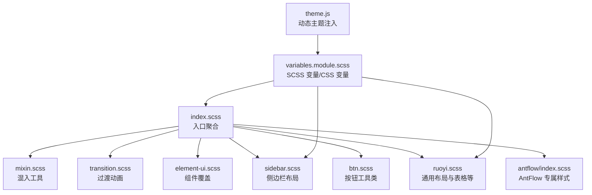
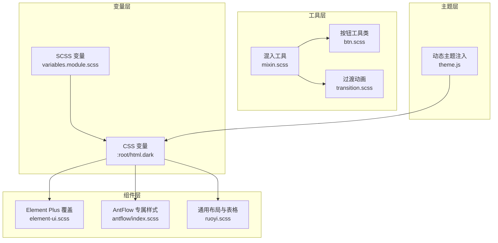
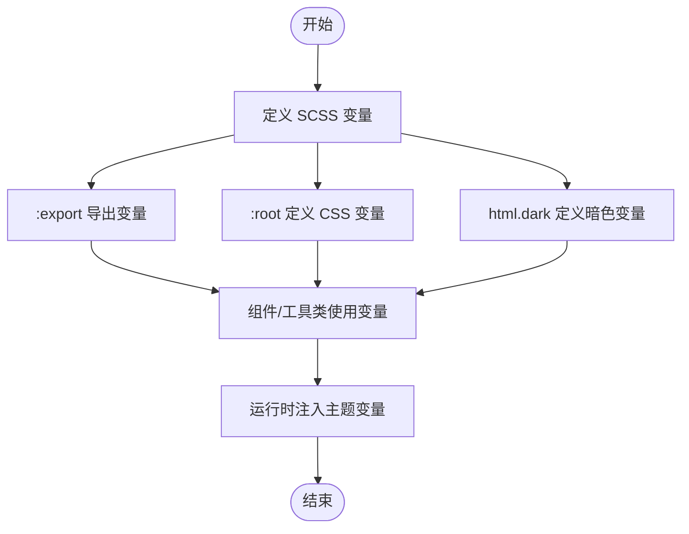
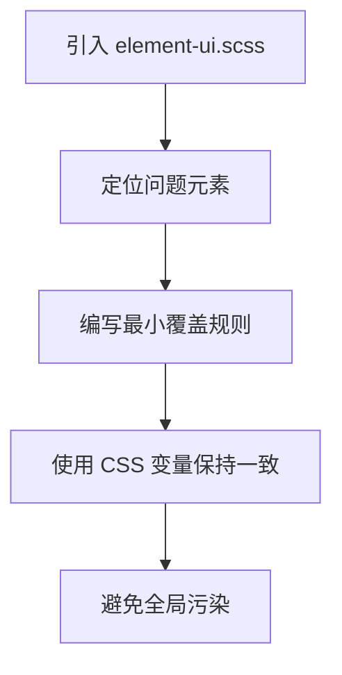
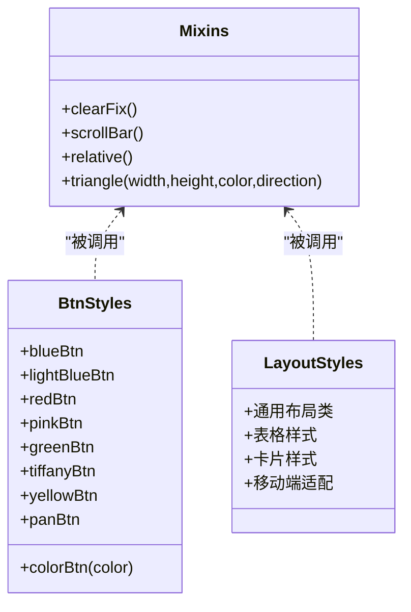
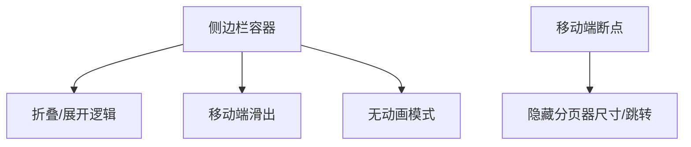
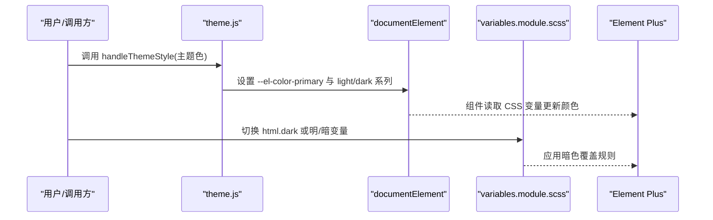
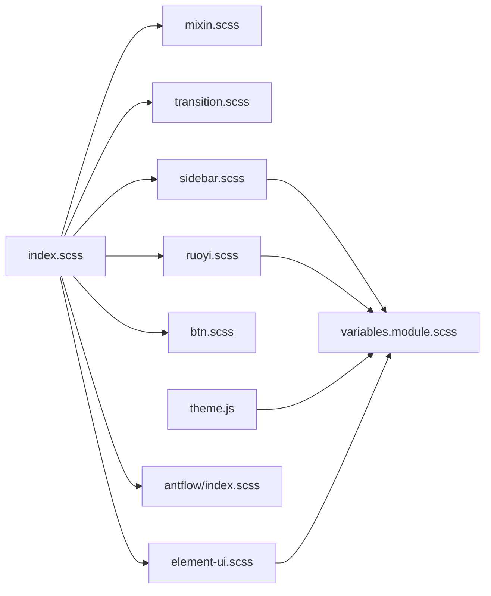

# 样式系统与主题

<cite>
**本文引用的文件**
- [variables.module.scss](file://antflow-vue/src/assets/styles/variables.module.scss)
- [index.scss](file://antflow-vue/src/assets/styles/index.scss)
- [mixin.scss](file://antflow-vue/src/assets/styles/mixin.scss)
- [element-ui.scss](file://antflow-vue/src/assets/styles/element-ui.scss)
- [sidebar.scss](file://antflow-vue/src/assets/styles/sidebar.scss)
- [btn.scss](file://antflow-vue/src/assets/styles/btn.scss)
- [transition.scss](file://antflow-vue/src/assets/styles/transition.scss)
- [ruoyi.scss](file://antflow-vue/src/assets/styles/ruoyi.scss)
- [antflow/index.scss](file://antflow-vue/src/assets/styles/antflow/index.scss)
- [theme.js](file://antflow-vue/src/utils/theme.js)
</cite>

## 目录
1. [简介](#简介)
2. [项目结构](#项目结构)
3. [核心组件](#核心组件)
4. [架构总览](#架构总览)
5. [详细组件分析](#详细组件分析)
6. [依赖关系分析](#依赖关系分析)
7. [性能考量](#性能考量)
8. [故障排查指南](#故障排查指南)
9. [结论](#结论)
10. [附录](#附录)

## 简介
本文件面向样式系统与主题管理，系统性阐述 AntFlow 前端工程中基于 SCSS 的样式架构设计、CSS 变量体系、主题切换的动态实现机制；解释 Element Plus 组件的自定义策略、工具类系统的构建方式、响应式样式实现技巧；并总结样式模块化组织、覆盖策略、浏览器兼容性处理方法。文档同时提供主题定制指南、样式调试方法、性能优化建议与最佳实践，帮助团队构建一致且可维护的视觉系统。

## 项目结构
样式系统采用“模块化 + 变量驱动 + 动态主题”的组织方式，主要文件分布如下：
- 变量与 CSS 变量：variables.module.scss 定义 SCSS 变量与导出映射，同时在 :root 与 html.dark 中声明 CSS 变量，支撑 Element Plus 与第三方组件的主题覆盖。
- 入口聚合：index.scss 统一引入 mixin、过渡动画、Element UI 覆盖、侧边栏、按钮、RuoYi 扩展与 AntFlow 专属样式。
- 组件与布局：sidebar.scss、element-ui.scss、btn.scss、transition.scss、ruoyi.scss、antflow/index.scss 分别负责侧边栏、Element UI 覆盖、按钮工具类、过渡动画、通用布局与 AntFlow 专属样式。
- 主题动态：theme.js 提供运行时主题色与明暗模式变量注入能力，结合变量层实现主题切换。

图表来源
- [index.scss:1-205](file://antflow-vue/src/assets/styles/index.scss#L1-L205)
- [variables.module.scss:1-226](file://antflow-vue/src/assets/styles/variables.module.scss#L1-L226)
- [sidebar.scss:1-239](file://antflow-vue/src/assets/styles/sidebar.scss#L1-L239)
- [element-ui.scss:1-96](file://antflow-vue/src/assets/styles/element-ui.scss#L1-L96)
- [btn.scss:1-100](file://antflow-vue/src/assets/styles/btn.scss#L1-L100)
- [transition.scss:1-50](file://antflow-vue/src/assets/styles/transition.scss#L1-L50)
- [ruoyi.scss:1-304](file://antflow-vue/src/assets/styles/ruoyi.scss#L1-L304)
- [antflow/index.scss:1-121](file://antflow-vue/src/assets/styles/antflow/index.scss#L1-L121)
- [theme.js:1-50](file://antflow-vue/src/utils/theme.js#L1-L50)

章节来源
- [index.scss:1-205](file://antflow-vue/src/assets/styles/index.scss#L1-L205)
- [variables.module.scss:1-226](file://antflow-vue/src/assets/styles/variables.module.scss#L1-L226)

## 核心组件
- 变量与 CSS 变量层
  - SCSS 变量集中定义基础色板、菜单与组件色、布局尺寸等，通过 :export 导出供 JS 使用，同时在 :root 与 html.dark 中以 CSS 变量形式暴露，用于 Element Plus 与第三方组件的动态覆盖。
  - 关键点：明/暗两套变量映射，确保组件状态（如 hover、active、禁用）与内容区背景、边框色等随主题切换而变化。
- 元素覆盖层（Element Plus）
  - 对上传、对话框、下拉、日期选择器等常见 UI 问题进行修复与风格统一，保证在不同场景下的可用性与一致性。
- 工具类与混入
  - mixin.scss 提供 clearfix、滚动条、相对定位、三角形等常用混入，btn.scss 提供颜色按钮的可复用样式，ruoyi.scss 提供通用布局、表格、卡片等样式。
- 布局与响应式
  - sidebar.scss 控制侧边栏宽度、折叠行为、移动端适配与滚动条样式；transition.scss 提供全局过渡动画；ruoyi.scss 在移动端对分页器进行隐藏优化。
- 动态主题
  - theme.js 提供十六进制与 RGB 转换、主题色变浅/变深算法，以及向 documentElement 注入 Element Plus 主题变量的能力，实现运行时主题切换。

章节来源
- [variables.module.scss:1-226](file://antflow-vue/src/assets/styles/variables.module.scss#L1-L226)
- [element-ui.scss:1-96](file://antflow-vue/src/assets/styles/element-ui.scss#L1-L96)
- [mixin.scss:1-67](file://antflow-vue/src/assets/styles/mixin.scss#L1-L67)
- [btn.scss:1-100](file://antflow-vue/src/assets/styles/btn.scss#L1-L100)
- [ruoyi.scss:1-304](file://antflow-vue/src/assets/styles/ruoyi.scss#L1-L304)
- [sidebar.scss:1-239](file://antflow-vue/src/assets/styles/sidebar.scss#L1-L239)
- [transition.scss:1-50](file://antflow-vue/src/assets/styles/transition.scss#L1-L50)
- [theme.js:1-50](file://antflow-vue/src/utils/theme.js#L1-L50)

## 架构总览
样式系统遵循“变量驱动 + 组件覆盖 + 工具类 + 动态主题”的分层架构：
- 变量层：统一色板与布局参数，支持 JS 导出与 CSS 变量双通道。
- 组件层：对 Element Plus 与第三方组件进行最小必要覆盖，避免全局污染。
- 工具层：混入与工具类提升复用性与开发效率。
- 主题层：运行时注入主题变量，配合暗色模式选择器实现明/暗切换。

图表来源
- [variables.module.scss:1-226](file://antflow-vue/src/assets/styles/variables.module.scss#L1-L226)
- [element-ui.scss:1-96](file://antflow-vue/src/assets/styles/element-ui.scss#L1-L96)
- [antflow/index.scss:1-121](file://antflow-vue/src/assets/styles/antflow/index.scss#L1-L121)
- [ruoyi.scss:1-304](file://antflow-vue/src/assets/styles/ruoyi.scss#L1-L304)
- [mixin.scss:1-67](file://antflow-vue/src/assets/styles/mixin.scss#L1-L67)
- [btn.scss:1-100](file://antflow-vue/src/assets/styles/btn.scss#L1-L100)
- [transition.scss:1-50](file://antflow-vue/src/assets/styles/transition.scss#L1-L50)
- [theme.js:1-50](file://antflow-vue/src/utils/theme.js#L1-L50)

## 详细组件分析

### 变量与 CSS 变量系统
- 设计原则
  - SCSS 变量用于编译期计算与模块内引用；:export 将关键变量导出给 JS 使用；:root 与 html.dark 中的 CSS 变量用于运行时覆盖 Element Plus 与第三方组件。
  - 明/暗两套变量映射，确保组件状态与页面背景、边框、文字色随主题切换保持对比度与一致性。
- 关键实现要点
  - 菜单与侧边栏颜色、组件主色、布局尺寸均通过变量统一管理，便于主题扩展与一致性维护。
  - 暗色模式选择器内对 Element Plus 组件（表格、树、分割面板等）进行覆盖，减少重复样式。
- 复杂度与性能
  - 变量层为纯编译期与运行时注入，无复杂算法，性能开销极小。
- 错误处理与边界
  - 若 CSS 变量未正确注入或命名不一致，可能导致组件颜色异常，需检查注入顺序与命名空间。

图表来源
- [variables.module.scss:1-226](file://antflow-vue/src/assets/styles/variables.module.scss#L1-L226)
- [theme.js:1-50](file://antflow-vue/src/utils/theme.js#L1-L50)

章节来源
- [variables.module.scss:1-226](file://antflow-vue/src/assets/styles/variables.module.scss#L1-L226)
- [theme.js:1-50](file://antflow-vue/src/utils/theme.js#L1-L50)

### Element Plus 组件自定义策略
- 目标与范围
  - 修复已知 UI 问题（如上传控件、对话框定位、日期选择器布局），统一标签与按钮在表格中的间距与对齐。
- 实现方式
  - 在 element-ui.scss 中针对特定类名进行最小覆盖，避免影响其他组件。
  - 结合 variables.module.scss 的 CSS 变量，使覆盖后的组件颜色与整体主题保持一致。
- 性能与兼容性
  - 属于样式覆盖，无运行时逻辑，性能开销低；通过选择器限定作用域，降低冲突风险。

图表来源
- [element-ui.scss:1-96](file://antflow-vue/src/assets/styles/element-ui.scss#L1-L96)
- [variables.module.scss:1-226](file://antflow-vue/src/assets/styles/variables.module.scss#L1-L226)

章节来源
- [element-ui.scss:1-96](file://antflow-vue/src/assets/styles/element-ui.scss#L1-L96)
- [variables.module.scss:1-226](file://antflow-vue/src/assets/styles/variables.module.scss#L1-L226)

### 工具类系统与混入
- 混入（mixin.scss）
  - 提供 clearfix、滚动条美化、相对定位、三角形绘制等常用混入，减少重复代码。
- 按钮工具类（btn.scss）
  - 基于 SCSS 变量生成多色按钮，提供统一的悬停与过渡效果，支持自定义按钮样式。
- 通用布局（ruoyi.scss）
  - 提供表单、表格、卡片、分页器等通用布局与样式，含移动端适配。
- 复杂度与性能
  - 工具类为纯样式复用，编译后体积可控，性能影响可忽略。

图表来源
- [mixin.scss:1-67](file://antflow-vue/src/assets/styles/mixin.scss#L1-L67)
- [btn.scss:1-100](file://antflow-vue/src/assets/styles/btn.scss#L1-L100)
- [ruoyi.scss:1-304](file://antflow-vue/src/assets/styles/ruoyi.scss#L1-L304)

章节来源
- [mixin.scss:1-67](file://antflow-vue/src/assets/styles/mixin.scss#L1-L67)
- [btn.scss:1-100](file://antflow-vue/src/assets/styles/btn.scss#L1-L100)
- [ruoyi.scss:1-304](file://antflow-vue/src/assets/styles/ruoyi.scss#L1-L304)

### 响应式样式与布局
- 侧边栏响应式（sidebar.scss）
  - 支持折叠、移动端滑出、无动画模式；通过 SCSS 变量控制宽度与过渡时间，确保在不同设备上的可用性。
- 移动端优化（ruoyi.scss）
  - 在 max-width: 768px 下隐藏分页器尺寸与跳转控件，减少移动端拥挤感。
- 过渡动画（transition.scss）
  - 提供全局淡入淡出与面包屑过渡，增强交互体验。

图表来源
- [sidebar.scss:1-239](file://antflow-vue/src/assets/styles/sidebar.scss#L1-L239)
- [ruoyi.scss:134-146](file://antflow-vue/src/assets/styles/ruoyi.scss#L134-L146)
- [transition.scss:1-50](file://antflow-vue/src/assets/styles/transition.scss#L1-L50)

章节来源
- [sidebar.scss:1-239](file://antflow-vue/src/assets/styles/sidebar.scss#L1-L239)
- [ruoyi.scss:134-146](file://antflow-vue/src/assets/styles/ruoyi.scss#L134-L146)
- [transition.scss:1-50](file://antflow-vue/src/assets/styles/transition.scss#L1-L50)

### 主题切换的动态实现
- 运行时注入
  - theme.js 提供 handleThemeStyle 方法，接收主题色，动态设置 --el-color-primary 及其 light/dark 系列变量。
- 明/暗模式联动
  - variables.module.scss 中通过 html.dark 选择器定义暗色模式变量，并对 Element Plus 组件进行覆盖，确保切换时组件状态一致。
- 切换流程

图表来源
- [theme.js:1-50](file://antflow-vue/src/utils/theme.js#L1-L50)
- [variables.module.scss:84-225](file://antflow-vue/src/assets/styles/variables.module.scss#L84-L225)

章节来源
- [theme.js:1-50](file://antflow-vue/src/utils/theme.js#L1-L50)
- [variables.module.scss:84-225](file://antflow-vue/src/assets/styles/variables.module.scss#L84-L225)

## 依赖关系分析
- 入口聚合
  - index.scss 作为全局入口，统一引入 mixin、transition、element-ui、sidebar、btn、ruoyi、antflow/index，形成稳定的加载顺序。
- 变量依赖
  - sidebar.scss 与 ruoyi.scss 通过 @use 引入 variables.module.scss，确保布局与通用样式使用统一变量。
- 组件覆盖
  - element-ui.scss 与 variables.module.scss 的 CSS 变量共同作用，保障 Element Plus 组件在不同主题下的表现一致。
- 动态主题
  - theme.js 仅依赖 CSS 变量注入接口，不直接依赖具体组件库版本，具备良好的可移植性。

图表来源
- [index.scss:1-205](file://antflow-vue/src/assets/styles/index.scss#L1-L205)
- [sidebar.scss:1-239](file://antflow-vue/src/assets/styles/sidebar.scss#L1-L239)
- [ruoyi.scss:1-304](file://antflow-vue/src/assets/styles/ruoyi.scss#L1-L304)
- [variables.module.scss:1-226](file://antflow-vue/src/assets/styles/variables.module.scss#L1-L226)
- [element-ui.scss:1-96](file://antflow-vue/src/assets/styles/element-ui.scss#L1-L96)
- [theme.js:1-50](file://antflow-vue/src/utils/theme.js#L1-L50)

章节来源
- [index.scss:1-205](file://antflow-vue/src/assets/styles/index.scss#L1-L205)
- [sidebar.scss:1-239](file://antflow-vue/src/assets/styles/sidebar.scss#L1-L239)
- [ruoyi.scss:1-304](file://antflow-vue/src/assets/styles/ruoyi.scss#L1-L304)
- [variables.module.scss:1-226](file://antflow-vue/src/assets/styles/variables.module.scss#L1-L226)
- [element-ui.scss:1-96](file://antflow-vue/src/assets/styles/element-ui.scss#L1-L96)
- [theme.js:1-50](file://antflow-vue/src/utils/theme.js#L1-L50)

## 性能考量
- 编译期优化
  - 使用 SCSS 变量与混入，减少重复样式；按需引入样式模块，避免全量打包。
- 运行时优化
  - 主题切换仅注入 CSS 变量，避免重排与重绘；暗色模式覆盖通过选择器限定，减少全局样式扫描。
- 体积控制
  - 工具类与混入在编译后固化为具体样式，体积可控；过渡动画与布局样式按需使用，避免冗余。
- 兼容性
  - 通过 CSS 变量与降级方案，确保在较老浏览器中仍能正常显示；对第三方组件的覆盖尽量使用稳定选择器。

## 故障排查指南
- 主题色不生效
  - 检查是否正确调用 handleThemeStyle 并传入有效十六进制颜色；确认 CSS 变量注入顺序与命名一致。
- 暗色模式组件颜色异常
  - 检查 html.dark 选择器是否正确应用；核对 variables.module.scss 中的暗色变量覆盖是否完整。
- Element Plus 组件样式错乱
  - 检查 element-ui.scss 的覆盖规则是否被更高优先级样式覆盖；确认未误删关键选择器。
- 响应式布局异常
  - 检查 sidebar.scss 的折叠与移动端断点逻辑；确认 ruoyi.scss 的移动端规则未被覆盖。

章节来源
- [theme.js:1-50](file://antflow-vue/src/utils/theme.js#L1-L50)
- [variables.module.scss:84-225](file://antflow-vue/src/assets/styles/variables.module.scss#L84-L225)
- [element-ui.scss:1-96](file://antflow-vue/src/assets/styles/element-ui.scss#L1-L96)
- [sidebar.scss:1-239](file://antflow-vue/src/assets/styles/sidebar.scss#L1-L239)
- [ruoyi.scss:134-146](file://antflow-vue/src/assets/styles/ruoyi.scss#L134-L146)

## 结论
该样式系统通过“变量驱动 + 组件覆盖 + 工具类 + 动态主题”的分层设计，实现了主题一致性与可扩展性。变量层提供统一色板与布局参数，组件覆盖解决 Element Plus 常见问题，工具类与混入提升复用性，动态主题注入则让明/暗切换与品牌色替换变得简单可靠。配合响应式与兼容性策略，整体方案具备良好的可维护性与性能表现。

## 附录
- 主题定制指南
  - 在 variables.module.scss 中调整基础色板与组件色；通过 :export 导出新变量供 JS 使用；在 html.dark 中补充暗色覆盖。
  - 使用 theme.js 的 handleThemeStyle 注入品牌色，确保 Element Plus 组件系列色同步更新。
- 样式调试方法
  - 利用浏览器开发者工具查看 CSS 变量的实际值；核对选择器优先级与覆盖链路；在移动端断点下验证布局。
- 性能优化技巧
  - 合理拆分样式模块，避免一次性引入过多文件；使用 SCSS 变量与混入减少重复；控制过渡动画的复杂度与数量。
- 最佳实践
  - 统一使用变量层管理颜色与尺寸；组件覆盖遵循最小必要原则；工具类与混入优先于重复样式；主题切换前后对比测试，确保一致性。