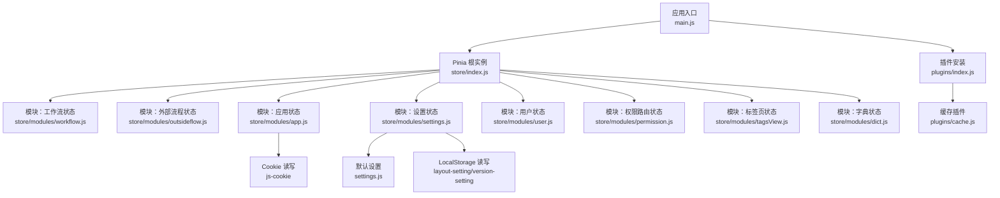
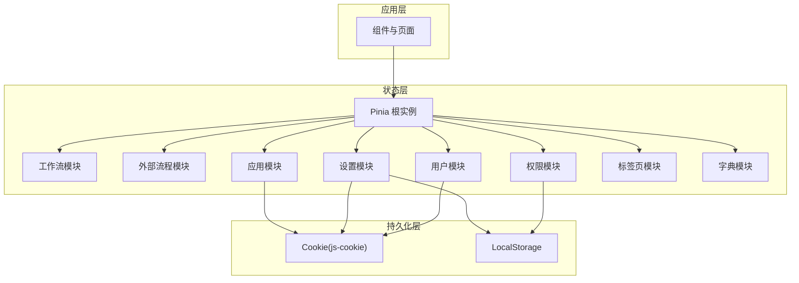
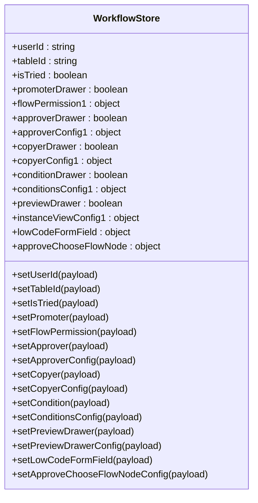
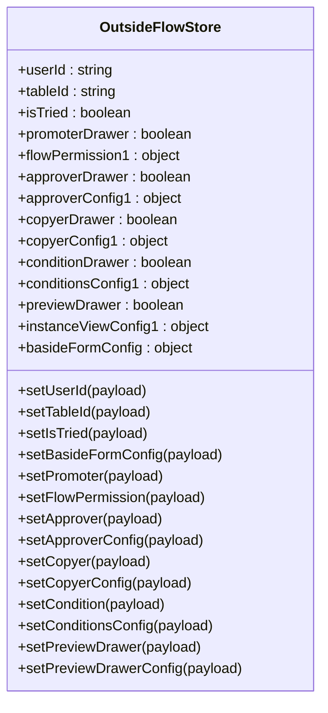
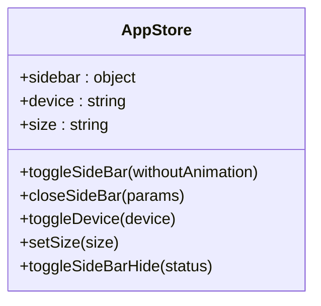
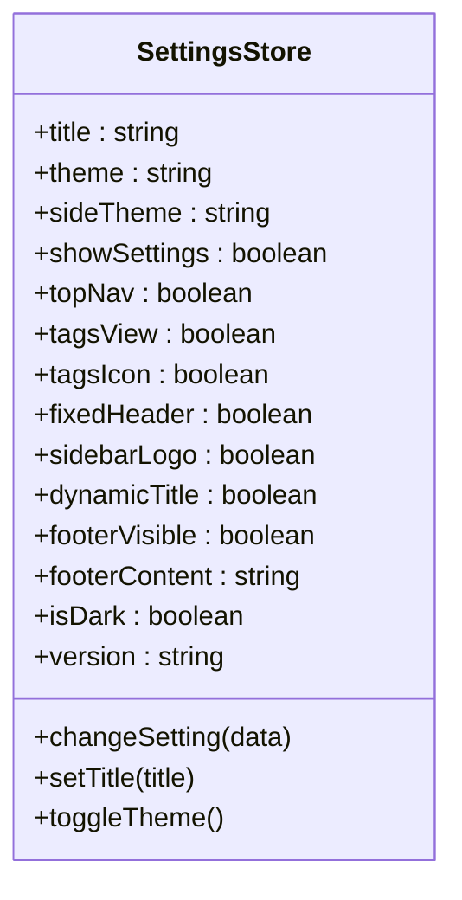
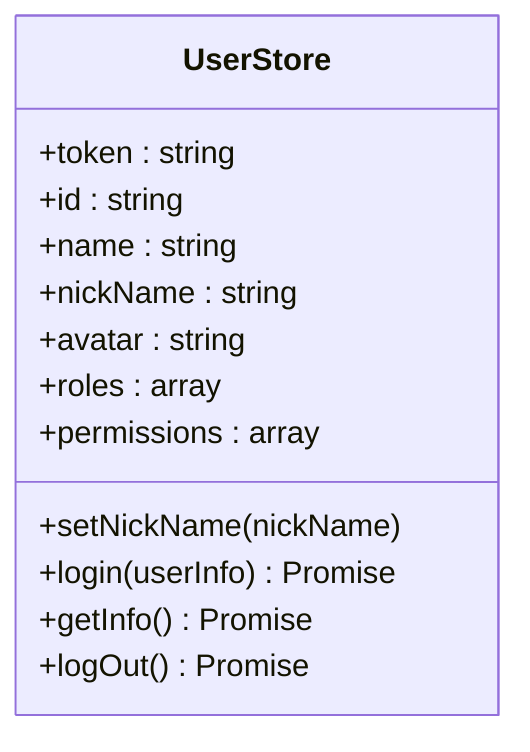
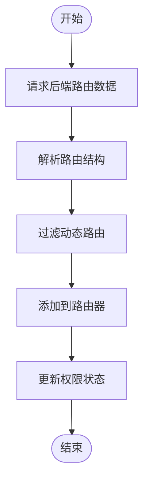
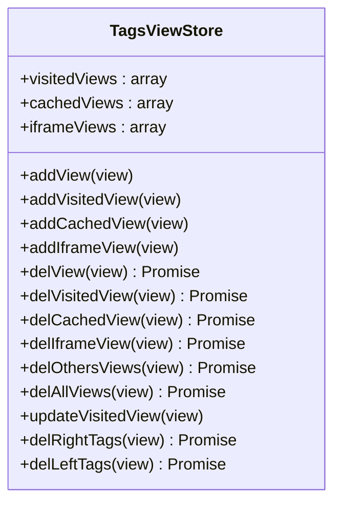
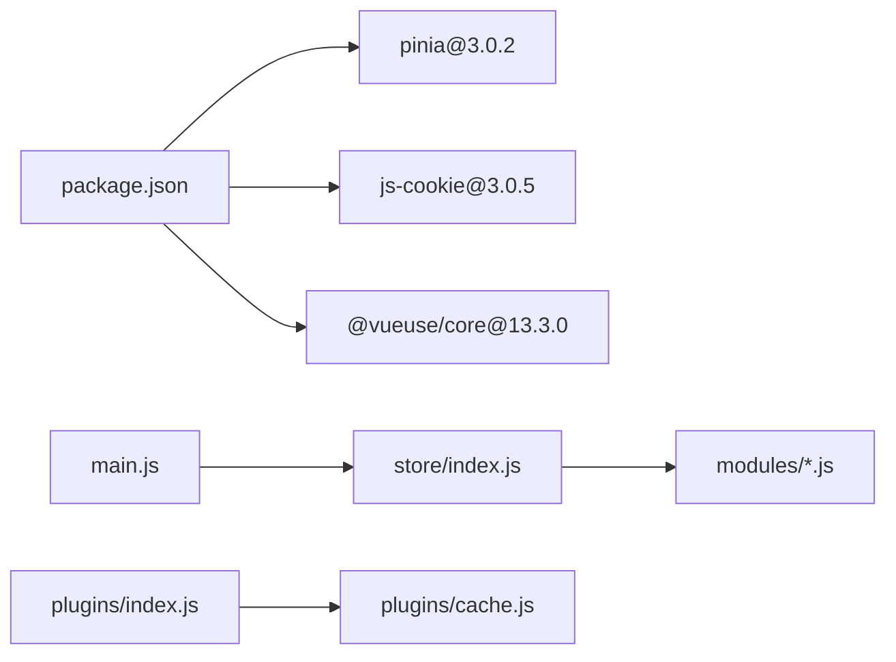

# 状态管理

<cite>
**本文引用的文件**
- [index.js](file://antflow-vue/src/store/index.js)
- [workflow.js](file://antflow-vue/src/store/modules/workflow.js)
- [outsideflow.js](file://antflow-vue/src/store/modules/outsideflow.js)
- [app.js](file://antflow-vue/src/store/modules/app.js)
- [settings.js](file://antflow-vue/src/store/modules/settings.js)
- [user.js](file://antflow-vue/src/store/modules/user.js)
- [permission.js](file://antflow-vue/src/store/modules/permission.js)
- [tagsView.js](file://antflow-vue/src/store/modules/tagsView.js)
- [dict.js](file://antflow-vue/src/store/modules/dict.js)
- [main.js](file://antflow-vue/src/main.js)
- [settings.js](file://antflow-vue/src/settings.js)
- [cache.js](file://antflow-vue/src/plugins/cache.js)
- [index.js](file://antflow-vue/src/plugins/index.js)
- [package.json](file://antflow-vue/package.json)
</cite>

## 目录
1. [简介](#简介)
2. [项目结构](#项目结构)
3. [核心组件](#核心组件)
4. [架构总览](#架构总览)
5. [详细组件分析](#详细组件分析)
6. [依赖分析](#依赖分析)
7. [性能考虑](#性能考虑)
8. [故障排查指南](#故障排查指南)
9. [结论](#结论)
10. [附录](#附录)

## 简介
本文件面向“状态管理系统”的技术文档，聚焦于 Pinia 状态管理在前端工程中的设计与实现。内容涵盖模块化存储的组织方式、状态持久化机制、工作流状态管理、外部集成状态、应用配置状态的实现策略；阐述状态变更的触发机制、异步操作处理、状态订阅模式；并提供状态调试工具使用、性能优化技巧、状态迁移策略，以及最佳实践与组件绑定方法。

## 项目结构
本项目采用 Pinia 的模块化状态管理模式，将不同领域的状态拆分为独立的 store 模块，通过根 store 统一注入应用。核心入口在应用启动时安装 Pinia 插件，并在各模块中定义 state、actions 与必要的副作用（如 Cookie、LocalStorage 的读写）。

**图表来源**
- [main.js:1-110](file://antflow-vue/src/main.js#L1-L110)
- [index.js:1-3](file://antflow-vue/src/store/index.js#L1-L3)
- [workflow.js:1-69](file://antflow-vue/src/store/modules/workflow.js#L1-L69)
- [outsideflow.js:1-65](file://antflow-vue/src/store/modules/outsideflow.js#L1-L65)
- [app.js:1-47](file://antflow-vue/src/store/modules/app.js#L1-L47)
- [settings.js:1-81](file://antflow-vue/src/store/modules/settings.js#L1-L81)
- [user.js:1-130](file://antflow-vue/src/store/modules/user.js#L1-L130)
- [permission.js:1-143](file://antflow-vue/src/store/modules/permission.js#L1-L143)
- [tagsView.js:1-183](file://antflow-vue/src/store/modules/tagsView.js#L1-L183)
- [dict.js:1-58](file://antflow-vue/src/store/modules/dict.js#L1-L58)
- [settings.js:1-58](file://antflow-vue/src/settings.js#L1-L58)
- [cache.js:1-80](file://antflow-vue/src/plugins/cache.js#L1-L80)
- [index.js:1-19](file://antflow-vue/src/plugins/index.js#L1-L19)

**章节来源**
- [main.js:1-110](file://antflow-vue/src/main.js#L1-L110)
- [index.js:1-3](file://antflow-vue/src/store/index.js#L1-L3)

## 核心组件
- Pinia 根实例：集中式状态容器，统一注册与导出。
- 模块化 store：按领域拆分，职责清晰，便于维护与测试。
- 插件体系：提供缓存、认证、模态框、下载等能力，增强状态周边功能。
- 默认设置：集中管理主题、导航、标签页、页脚等布局配置。

关键要点
- 模块命名规范：以领域命名（如 workflow、outsideflow、app、settings、user、permission、tagsView、dict），避免命名冲突。
- 状态持久化：通过 Cookie、LocalStorage 实现跨会话持久化，减少重复请求与初始化成本。
- 异步处理：登录、登出、获取用户信息、生成路由等均采用 Promise 封装，便于在组件中链式调用。
- 订阅与响应：通过 actions 触发状态变更，组件通过 store 实例或组合式 API 订阅变化。

**章节来源**
- [workflow.js:1-69](file://antflow-vue/src/store/modules/workflow.js#L1-L69)
- [outsideflow.js:1-65](file://antflow-vue/src/store/modules/outsideflow.js#L1-L65)
- [app.js:1-47](file://antflow-vue/src/store/modules/app.js#L1-L47)
- [settings.js:1-81](file://antflow-vue/src/store/modules/settings.js#L1-L81)
- [user.js:1-130](file://antflow-vue/src/store/modules/user.js#L1-L130)
- [permission.js:1-143](file://antflow-vue/src/store/modules/permission.js#L1-L143)
- [tagsView.js:1-183](file://antflow-vue/src/store/modules/tagsView.js#L1-L183)
- [dict.js:1-58](file://antflow-vue/src/store/modules/dict.js#L1-L58)
- [settings.js:1-58](file://antflow-vue/src/settings.js#L1-L58)
- [cache.js:1-80](file://antflow-vue/src/plugins/cache.js#L1-L80)
- [index.js:1-19](file://antflow-vue/src/plugins/index.js#L1-L19)

## 架构总览
下图展示状态管理的整体交互：应用启动时安装 Pinia，随后各模块根据需要读取持久化数据并初始化；组件通过 store 实例或组合式 API 访问状态与动作；部分模块在动作执行过程中进行持久化写入（如 Cookie、LocalStorage）。

**图表来源**
- [main.js:1-110](file://antflow-vue/src/main.js#L1-L110)
- [index.js:1-3](file://antflow-vue/src/store/index.js#L1-L3)
- [app.js:1-47](file://antflow-vue/src/store/modules/app.js#L1-L47)
- [settings.js:1-81](file://antflow-vue/src/store/modules/settings.js#L1-L81)
- [user.js:1-130](file://antflow-vue/src/store/modules/user.js#L1-L130)
- [permission.js:1-143](file://antflow-vue/src/store/modules/permission.js#L1-L143)

## 详细组件分析

### 工作流状态模块（workflow）
职责
- 维护流程设计器与流程实例视图相关的 UI 状态与配置。
- 提供一系列 setter 动作用于更新抽屉开关、权限配置、节点选择等。

设计要点
- 状态字段覆盖发起人、审批人、抄送人、条件节点、预览配置、低代码表单字段等。
- 动作以 set 前缀命名，语义明确，便于在组件中直接调用。

**图表来源**
- [workflow.js:1-69](file://antflow-vue/src/store/modules/workflow.js#L1-L69)

**章节来源**
- [workflow.js:1-69](file://antflow-vue/src/store/modules/workflow.js#L1-L69)

### 外部流程状态模块（outsideflow）
职责
- 维护外部系统接入场景下的流程配置与表单配置。
- 与工作流模块类似，提供丰富的 setter 动作以驱动 UI 与配置。

设计要点
- 在工作流基础上增加基础表单配置字段，适配外部集成场景。
- 保持与工作流模块一致的动作命名风格，便于复用。

**图表来源**
- [outsideflow.js:1-65](file://antflow-vue/src/store/modules/outsideflow.js#L1-L65)

**章节来源**
- [outsideflow.js:1-65](file://antflow-vue/src/store/modules/outsideflow.js#L1-L65)

### 应用状态模块（app）
职责
- 维护侧边栏、设备类型、界面尺寸等应用级 UI 状态。
- 通过 Cookie 实现跨会话持久化，减少初始化开销。

设计要点
- 侧边栏状态读取自 Cookie，切换时同步写回。
- 设备类型与尺寸同样持久化，保证用户偏好一致。

**图表来源**
- [app.js:1-47](file://antflow-vue/src/store/modules/app.js#L1-L47)

**章节来源**
- [app.js:1-47](file://antflow-vue/src/store/modules/app.js#L1-L47)

### 设置状态模块（settings）
职责
- 维护主题、侧边栏主题、顶部导航、标签页、固定头部、侧边栏 Logo、动态标题、页脚可见性等布局配置。
- 通过默认设置与 LocalStorage 合并，实现可覆盖的持久化配置。

设计要点
- 使用 VueUse 的暗黑模式开关，配合 store 内部状态切换。
- 动态标题通过工具函数更新，支持运行时标题变更。

**图表来源**
- [settings.js:1-81](file://antflow-vue/src/store/modules/settings.js#L1-L81)
- [settings.js:1-58](file://antflow-vue/src/settings.js#L1-L58)

**章节来源**
- [settings.js:1-81](file://antflow-vue/src/store/modules/settings.js#L1-L81)
- [settings.js:1-58](file://antflow-vue/src/settings.js#L1-L58)

### 用户状态模块（user）
职责
- 维护用户登录态、角色、权限、头像等信息。
- 提供登录、登出、获取用户信息等异步动作。

设计要点
- 登录成功后写入 Token 至 Cookie，登出时清理。
- 获取用户信息时对头像 URL 进行拼接与校验，确保资源可用。
- 对初始密码与过期密码进行提示与路由跳转。

**图表来源**
- [user.js:1-130](file://antflow-vue/src/store/modules/user.js#L1-L130)

**章节来源**
- [user.js:1-130](file://antflow-vue/src/store/modules/user.js#L1-L130)

### 权限路由模块（permission）
职责
- 根据后端返回的路由数据生成动态路由，并注入到路由器。
- 提供权限校验与路由过滤逻辑。

设计要点
- 通过模块化加载器解析组件路径，支持 Layout、ParentView、InnerLink 等特殊组件。
- 对动态路由进行权限校验，仅注入具备访问权限的路由。

**图表来源**
- [permission.js:1-143](file://antflow-vue/src/store/modules/permission.js#L1-L143)

**章节来源**
- [permission.js:1-143](file://antflow-vue/src/store/modules/permission.js#L1-L143)

### 标签页模块（tagsView）
职责
- 维护已访问页面列表、缓存页面列表与 iframe 页面列表。
- 提供增删改查、清空、左右删除等操作，支持固定页签。

设计要点
- 支持无缓存标记的页面不进入缓存队列。
- 对 iframe 页面进行独立管理，便于跨域或内嵌场景。

**图表来源**
- [tagsView.js:1-183](file://antflow-vue/src/store/modules/tagsView.js#L1-L183)

**章节来源**
- [tagsView.js:1-183](file://antflow-vue/src/store/modules/tagsView.js#L1-L183)

### 字典模块（dict）
职责
- 提供键值对字典的增删改查与清空能力。
- 作为轻量级全局字典存储，供组件按需读取。

设计要点
- 使用数组存储字典项，查找复杂度为 O(n)，适用于小规模数据。
- 初始化与清理方法预留扩展空间。

**章节来源**
- [dict.js:1-58](file://antflow-vue/src/store/modules/dict.js#L1-L58)

## 依赖分析
- Pinia 版本：在依赖中声明 pinia@3.0.2，确保与 Vue 3 生态兼容。
- Cookie：js-cookie 用于持久化侧边栏与界面尺寸等用户偏好。
- LocalStorage：用于持久化布局设置与版本信息，避免每次刷新丢失。
- VueUse：@vueuse/core 提供暗黑模式等响应式工具能力。
- 插件体系：通过 plugins/index.js 暴露 $cache、$auth、$modal、$tab、$download 等全局属性，增强状态周边能力。

**图表来源**
- [package.json:1-54](file://antflow-vue/package.json#L1-L54)
- [main.js:1-110](file://antflow-vue/src/main.js#L1-L110)
- [index.js:1-3](file://antflow-vue/src/store/index.js#L1-L3)
- [index.js:1-19](file://antflow-vue/src/plugins/index.js#L1-L19)
- [cache.js:1-80](file://antflow-vue/src/plugins/cache.js#L1-L80)

**章节来源**
- [package.json:1-54](file://antflow-vue/package.json#L1-L54)
- [main.js:1-110](file://antflow-vue/src/main.js#L1-L110)

## 性能考虑
- 状态粒度拆分：按领域拆分模块，降低耦合，避免无关状态变更引发的重渲染。
- 持久化策略：对高频读取的用户偏好与布局设置采用 Cookie/LocalStorage，减少网络请求与初始化时间。
- 动态路由：仅注入具备权限的路由，避免无效组件加载。
- 缓存策略：标签页模块对 noCache 标记进行判断，避免不必要的 keep-alive 缓存。
- 工具函数：使用 VueUse 的响应式工具，减少手动状态管理开销。

[本节为通用指导，无需特定文件引用]

## 故障排查指南
常见问题与定位建议
- 登录后状态未更新：检查用户模块登录动作是否正确写入 Token 并更新 store；确认 Cookie 是否被浏览器禁用。
- 侧边栏状态不生效：检查 Cookie 键名与 app 模块读写逻辑是否一致；确认刷新后是否重新从 Cookie 初始化。
- 动态路由未生效：检查权限模块生成路由过程中的组件解析与权限过滤逻辑；确认路由是否成功注入。
- 标签页缓存异常：检查页面 meta.noCache 标记与缓存队列更新逻辑；确认 iframe 场景下的特殊处理。
- 设置项未持久化：检查 settings 模块对 LocalStorage 的读写键名；确认默认设置与用户覆盖逻辑顺序。

**章节来源**
- [user.js:1-130](file://antflow-vue/src/store/modules/user.js#L1-L130)
- [app.js:1-47](file://antflow-vue/src/store/modules/app.js#L1-L47)
- [permission.js:1-143](file://antflow-vue/src/store/modules/permission.js#L1-L143)
- [tagsView.js:1-183](file://antflow-vue/src/store/modules/tagsView.js#L1-L183)
- [settings.js:1-81](file://antflow-vue/src/store/modules/settings.js#L1-L81)

## 结论
本状态管理体系以 Pinia 为核心，结合 Cookie、LocalStorage 与插件体系，实现了模块化、可持久化的前端状态管理。通过清晰的模块边界与动作命名，降低了组件与状态之间的耦合；通过异步动作与权限过滤，提升了系统的安全性与可维护性。建议在后续迭代中持续关注状态体积与持久化策略，进一步优化首屏性能与用户体验。

[本节为总结性内容，无需特定文件引用]

## 附录

### 状态调试工具使用
- 浏览器扩展：推荐使用 Vue DevTools 或 Pinia Devtools，查看 store 的 state、getters、actions 调用历史与快照。
- 日志辅助：在关键 actions 中输出变更前后的 state，便于追踪状态流转。
- 断点调试：在 actions 执行路径设置断点，观察异步请求与状态更新的时序关系。

[本节为通用指导，无需特定文件引用]

### 状态迁移策略
- 字段演进：新增字段时提供默认值，避免旧版本数据缺失导致的异常。
- 数据格式升级：对复杂配置（如流程节点、条件配置）提供版本号与迁移函数，保证向后兼容。
- 渐进式替换：对旧的 Cookie/LocalStorage 键名进行兼容读取与迁移，逐步淘汰旧键。

[本节为通用指导，无需特定文件引用]

### 最佳实践
- 组件绑定方法
  - 组合式 API：在组件中通过 storeToRefs 与 computed 绑定状态，减少不必要的解构。
  - 严格动作：将所有状态变更封装在 actions 中，避免直接修改 state。
- 状态共享模式
  - 公共状态：提取至 app、settings、dict 等模块，避免重复定义。
  - 作用域隔离：工作流、外部流程等状态尽量保持独立，避免跨域污染。
- 异步与错误处理
  - Promise 化：将异步动作统一返回 Promise，便于在组件中链式调用与错误捕获。
  - 错误上抛：在 actions 中捕获错误并向上抛出，由组件决定 UI 层反馈。

[本节为通用指导，无需特定文件引用]